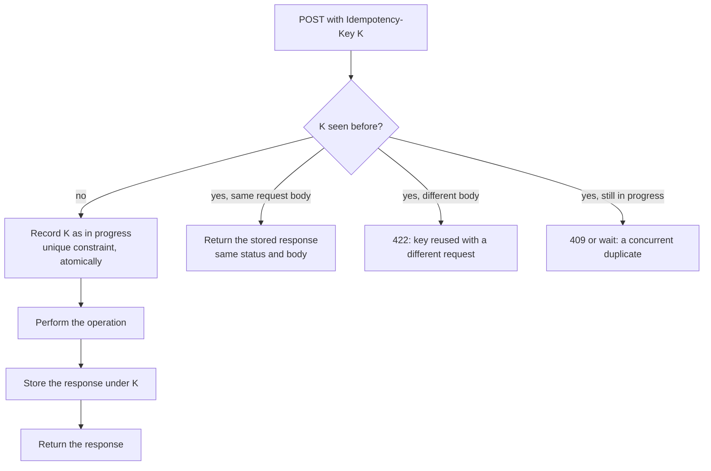
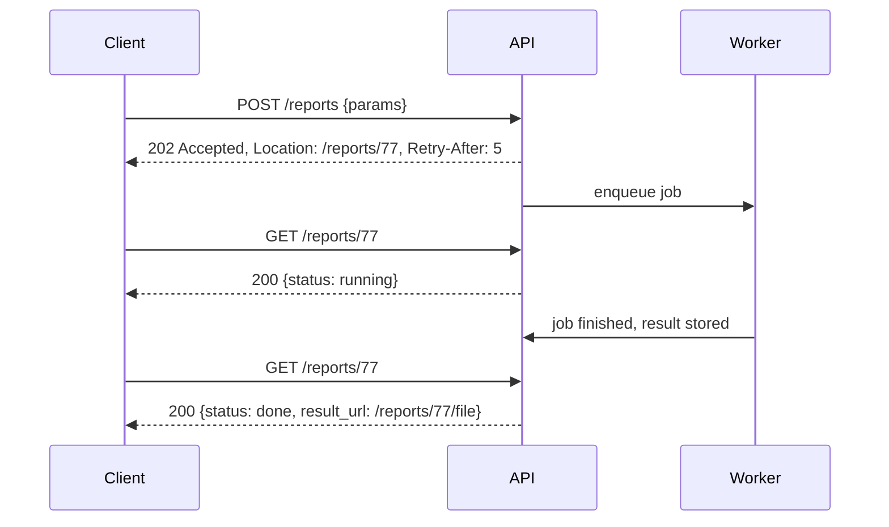

# 📘 API Design

An API is a contract that other people build on, so mistakes are expensive and hard to undo.
This page covers how to model resources, choose status codes, paginate, evolve without breaking clients, make writes safe to retry, and when to use GraphQL, gRPC or webhooks instead of plain REST.
Three demos were executed: signed cursor pagination, idempotency keys, and webhook signature verification.

## Table of Contents

1. [Principles](#1-principles)
2. [Resource Modeling and URLs](#2-resource-modeling-and-urls)
3. [Methods, Status Codes and Errors](#3-methods-status-codes-and-errors)
4. [Safe Writes: Idempotency and Concurrency Control](#4-safe-writes-idempotency-and-concurrency-control)
5. [Collections: Filtering, Sorting, Pagination](#5-collections-filtering-sorting-pagination)
6. [Versioning and Evolution](#6-versioning-and-evolution)
7. [Long-Running Operations and Uploads](#7-long-running-operations-and-uploads)
8. [Rate Limiting and Quotas](#8-rate-limiting-and-quotas)
9. [GraphQL](#9-graphql)
10. [gRPC and Protocol Buffers](#10-grpc-and-protocol-buffers)
11. [Webhooks](#11-webhooks)
12. [Documentation and Tooling](#12-documentation-and-tooling)
13. [Checklist and Questions](#13-checklist-and-questions)

---

## 1. Principles

- **Design for the consumer.** Start from the use cases and write example requests and responses before code.
- **Be consistent.** Naming, error shape, pagination, dates and casing should look the same everywhere.
- **Be predictable.** Follow HTTP semantics (safe, idempotent, cacheable) so clients, proxies and libraries behave correctly.
- **Evolve without breaking.** Additive changes only inside a version, deprecate slowly.
- **Assume failure.** Networks time out and clients retry, so writes must be safe to repeat.
- **Secure by default.** Authenticate, authorize each object, validate input, limit rates, see [Authentication and Security](/docs/backend/authentication-and-security).

### 1.1 Richardson Maturity Model

| Level | Description |
| --- | --- |
| 0 | One endpoint, one method (RPC over HTTP) |
| 1 | Resources with their own URLs |
| 2 | Correct use of **HTTP methods and status codes** (where most APIs stop, and where you should) |
| 3 | Hypermedia controls (HATEOAS): responses contain links to next actions. Rare in practice |

---

## 2. Resource Modeling and URLs

Model **nouns** (resources), not actions.

| Guideline | Good | Avoid |
| --- | --- | --- |
| Plural nouns for collections | `/users`, `/orders` | `/getUsers`, `/createOrder` |
| Identify by id | `/orders/1001` | `/orders?id=1001` for the canonical resource |
| Nest to show ownership, but only one or two levels | `/users/42/orders` | `/a/1/b/2/c/3/d/4` |
| Lowercase, hyphens | `/purchase-orders` | camelCase or underscores in paths |
| Filters in the query string | `/orders?status=paid&from=2026-01-01` | Filters in the path |
| Actions that are not CRUD | `POST /orders/1001/cancel`, or model the result: `POST /orders/1001/cancellations` | Verbs everywhere for normal CRUD |
| Stable identifiers | UUIDs or opaque ids | Sequential ids exposed for sensitive data (enumeration) |
| Consistent JSON | `snake_case` or `camelCase`, pick one. ISO 8601 UTC timestamps. Money as integer minor units plus currency | Mixed styles, local time without zone, floats for money |

Collection and item pattern:

```text
GET    /orders            list (paginated)
POST   /orders            create
GET    /orders/1001       read
PUT    /orders/1001       replace
PATCH  /orders/1001       partial update
DELETE /orders/1001       delete
GET    /orders/1001/items sub-collection
```

Response design:

- Return the **created or updated resource** in the body (and `Location` on create).
- Include ids and links clients need, avoid deeply nested payloads that force over-fetching.
- Let clients choose fields when payloads are large (`?fields=id,status,total`) or use expansion (`?expand=customer`).
- Never expose database internals (foreign key columns, internal flags), map to a public schema.

---

## 3. Methods, Status Codes and Errors

### 3.1 Choosing Methods and Codes

| Operation | Method | Success | Common errors |
| --- | --- | --- | --- |
| List | `GET` | 200 with a page | 400 bad filter, 401, 403 |
| Read one | `GET` | 200, or 304 for a conditional match | 404 |
| Create | `POST` | **201** with `Location` and the body | 400 or 422 invalid, 409 duplicate, 415 wrong media type |
| Replace | `PUT` | 200 or 204 (201 if it created) | 404, 409, 412 |
| Partial update | `PATCH` | 200 with the resource, or 204 | 404, 409, 412, 422 |
| Delete | `DELETE` | 204 (idempotent, a repeat may return 404 or 204) | 404, 409 if in use |
| Async work accepted | `POST` | **202** with a status URL | |

Nuances people get wrong:

- **401 vs 403:** 401 for missing or invalid credentials (and include `WWW-Authenticate`), 403 for a known caller who is not allowed. To avoid revealing that a resource exists, return **404** when the caller may not see it.
- **400 vs 422:** 400 for malformed syntax, 422 for valid syntax with invalid semantics. Pick a convention and document it.
- **409 Conflict:** state conflict (duplicate email, version mismatch, invalid state transition).
- **412 Precondition Failed:** an `If-Match` or `If-Unmodified-Since` condition failed (optimistic locking).
- **429 Too Many Requests** with `Retry-After`.
- **5xx** are server faults, do not use them for client mistakes. **503** with `Retry-After` during maintenance or overload.
- `PATCH` formats: **JSON Merge Patch** (RFC 7386, send only changed fields, `null` deletes) is simple, **JSON Patch** (RFC 6902, an array of operations) is precise.

### 3.2 A Standard Error Body: RFC 9457

**Problem Details for HTTP APIs** (RFC 9457, which obsoletes RFC 7807) defines a JSON error format with the media type `application/problem+json`.

```json
{
  "type": "https://api.example.com/problems/insufficient-funds",
  "title": "Insufficient funds",
  "status": 422,
  "detail": "Balance 30.00 is less than the requested 50.00.",
  "instance": "/transfers/9f2c",
  "errors": [{ "field": "amount", "message": "exceeds balance" }],
  "traceId": "4bf92f3577b34da6a3ce929d0e0e4736"
}
```

- `type` is a stable identifier clients can switch on, `title` a short human summary, `detail` the specific explanation, `instance` the occurrence.
- Add **extension members** (field errors, a trace id for support) as needed.
- Do not leak internals (stack traces, SQL). Log the detail server-side under the trace id.
- Spring Boot supports it natively through `ProblemDetail`, and libraries exist for Express and Fastify.

---

## 4. Safe Writes: Idempotency and Concurrency Control

### 4.1 Idempotency Keys

Networks fail after the server acted but before the client got the answer, so clients retry.
Without protection, a retried `POST /payments` charges twice.

**Idempotency-Key** pattern: the client generates a unique key (a UUID) per logical operation and sends it in a header, reusing it on every retry.
The server stores the key with the request fingerprint and result, and replays the stored result for repeats.



```js
// runnable
const crypto = require('node:crypto');

const store = new Map();       // idempotency key -> { hash, response }. In production: a table with a UNIQUE key column
let charges = 0;               // the real side effect we must not repeat

function createCharge(idempotencyKey, body) {
  const hash = crypto.createHash('sha256').update(JSON.stringify(body)).digest('hex');
  const prior = store.get(idempotencyKey);
  if (prior) {
    if (prior.hash !== hash) return { status: 422, body: { title: 'Idempotency key reused with a different request' } };
    return { ...prior.response, replayed: true };
  }
  charges++;                                                       // perform the operation once
  const response = { status: 201, body: { chargeId: 'ch_' + charges, amount: body.amount } };
  store.set(idempotencyKey, { hash, response });
  return response;
}

console.log(createCharge('k-1', { amount: 500 }));                 // created
console.log(createCharge('k-1', { amount: 500 }));                 // network retry: same response, replayed
console.log(createCharge('k-1', { amount: 999 }));                 // same key, different body: rejected
console.log(createCharge('k-2', { amount: 500 }));                 // a new logical operation
console.log('times the charge really happened:', charges);          // 2
```

Rules for a correct implementation:

- Insert the key **atomically** with a unique constraint before doing the work, so two concurrent duplicates cannot both proceed.
- Store the **result**, and ideally do the work and store the record in one database transaction.
- Scope keys per client, expire them after a window (about 24 hours).
- Return the same status and body, so the client cannot tell a replay from the original.
- The mechanism is the same one used in [Distributed Systems](/docs/system-design/hld/distributed-systems) and in payments, see the [payment design](/docs/system-design/hld/large-scale-designs).
- `PUT` and `DELETE` are naturally idempotent, so keys matter mainly for `POST` and non-idempotent `PATCH`.

### 4.2 Optimistic Concurrency With ETags

Two users edit the same resource, and the second overwrites the first (a lost update).
Use **conditional requests**:

```text
GET /documents/7
  200 OK
  ETag: "v12"

PUT /documents/7
  If-Match: "v12"          "apply this only if it is still version 12"
  -> 200 OK  (ETag: "v13")
  -> 412 Precondition Failed   (someone else changed it, re-fetch and merge)
```

`If-Match` is the API equivalent of the version column in [Transactions](/docs/databases/transactions-and-concurrency).
`If-None-Match` with `GET` gives **cache revalidation**: the server answers **304 Not Modified** with no body when the ETag still matches.
Some APIs make the header mandatory for updates (`428 Precondition Required`).

---

## 5. Collections: Filtering, Sorting, Pagination

### 5.1 Conventions

```text
GET /orders?status=paid&created_from=2026-01-01&sort=-created_at&limit=20&cursor=...
```

- Filters as query parameters, ranges with `_from`/`_to` or `[gte]`, a documented `sort` parameter (`-` for descending).
- **Always paginate**, with a maximum page size, so no request can return a million rows.
- Whitelist filterable and sortable fields, and back them with indexes.
- For search across text use a dedicated `q` parameter and a search engine, see [Building Blocks](/docs/system-design/hld/building-blocks).

### 5.2 Pagination Styles

| Style | Request | Pros | Cons |
| --- | --- | --- | --- |
| **Offset and limit** | `?offset=40&limit=20` or `?page=3` | Simple, random access to a page | Slow at depth (the database reads and discards rows), duplicates and gaps when data changes |
| **Cursor (keyset)** | `?limit=20&cursor=abc` | Fast at any depth, stable under inserts and deletes | No jumping to page N, needs a deterministic sort with a unique tiebreaker |
| **Time or id based** | `?since_id=981234` | Very simple for feeds | Only for a single ordering |

Response shape for cursors:

```json
{ "items": [ ... ], "next_cursor": "eyJpZCI6IDQyfQ.q1x...", "has_more": true }
```

or use the standard `Link` header (`rel="next"`).

**Make the cursor opaque and tamper-proof.**
Clients must not construct or interpret it, so you can change the implementation.
Signing it (HMAC) stops a client from forging a cursor to reach data or trigger expensive queries.

```js
// runnable
const crypto = require('node:crypto');
const SECRET = 'demo-secret-key';

const b64 = (o) => Buffer.from(JSON.stringify(o)).toString('base64url');
const mac = (body) => crypto.createHmac('sha256', SECRET).update(body).digest('base64url');
const encodeCursor = (payload) => { const body = b64(payload); return `${body}.${mac(body)}`; };

function decodeCursor(cursor) {
  const [body = '', tag = ''] = String(cursor).split('.');
  const a = Buffer.from(tag), b = Buffer.from(mac(body));
  if (a.length !== b.length || !crypto.timingSafeEqual(a, b)) throw new Error('invalid cursor');
  return JSON.parse(Buffer.from(body, 'base64url').toString());
}

// 11 posts, several sharing a date, so the sort needs a unique tiebreaker (id)
const posts = Array.from({ length: 11 }, (_, i) => ({ id: i + 1, createdAt: `2026-05-${String(20 - Math.floor(i / 3)).padStart(2, '0')}` }));
const sorted = [...posts].sort((x, y) => y.createdAt.localeCompare(x.createdAt) || y.id - x.id);   // newest first, id breaks ties

function listPosts({ limit = 4, cursor } = {}) {
  let start = 0;
  if (cursor) {
    const c = decodeCursor(cursor);
    // keyset condition: strictly after the last seen (createdAt, id) in the sort order
    start = sorted.findIndex((p) => p.createdAt < c.createdAt || (p.createdAt === c.createdAt && p.id < c.id));
    if (start === -1) start = sorted.length;
  }
  const window = sorted.slice(start, start + limit + 1);           // fetch one extra row to know if more exist
  const items = window.slice(0, limit);
  const last = items[items.length - 1];
  return { ids: items.map((p) => p.id), next: window.length > limit ? encodeCursor({ createdAt: last.createdAt, id: last.id }) : null };
}

let page = listPosts({ limit: 4 });
const seen = [];
while (true) {
  console.log('page:', page.ids, page.next ? 'has next' : 'end');
  seen.push(...page.ids);
  if (!page.next) break;
  page = listPosts({ limit: 4, cursor: page.next });
}
console.log('all ids seen exactly once:', seen.length === 11 && new Set(seen).size === 11);

const forged = encodeCursor({ createdAt: '2026-05-20', id: 999 }).replace(/.$/, 'x');      // tampered signature
try { listPosts({ cursor: forged }); } catch (e) { console.log('forged cursor:', e.message); }
```

In SQL the keyset condition is a row-value comparison on an indexed sort key, see [Indexing](/docs/databases/indexing-and-query-performance).
Return the total count only if you must, since `COUNT(*)` on big tables is slow.

---

## 6. Versioning and Evolution

Breaking a client is the worst API failure, so plan evolution up front.

| Change | Breaking? |
| --- | --- |
| Add an optional request field, add a response field, add an endpoint, add an enum value on output | No, if clients ignore unknown fields (design them to) |
| Remove or rename a field or endpoint | **Yes** |
| Change a type, meaning, default, or validation rule | **Yes** |
| Make an optional field required | **Yes** |
| Add a new enum value clients switch on | Often yes, document "clients must handle unknown values" |

Versioning approaches:

| Approach | Example | Notes |
| --- | --- | --- |
| **URL path** | `/v1/orders` | Most common, simple, cacheable, visible |
| **Header or media type** | `Accept: application/vnd.example.v2+json` | Clean URLs, harder to test in a browser |
| **Date-based version header** | `Stripe-Version: 2026-04-01` | Pin each client to the behavior it integrated against, fine-grained |
| **No versions, only additive change** | | Requires great discipline |

Practices:

- **Robustness principle:** be strict in what you send, tolerant in what you accept (ignore unknown fields).
- Announce deprecations with the `Deprecation` and `Sunset` (RFC 8594) headers plus documentation and usage tracking, and keep the old version for a published window.
- Use **expand and contract** for changes: add the new field, migrate clients, then remove the old one.
- Version the **schema of events and webhooks** too.
- Keep a **changelog** and run **contract tests** so a change that breaks a consumer fails the build, see [Architecture and Testing](/docs/backend/architecture-and-testing).

---

## 7. Long-Running Operations and Uploads

### 7.1 Asynchronous Operations

When the work takes more than a few seconds (report generation, video processing), do not hold the request open.



Options for completion: **polling** the status resource, a **webhook** callback, or **SSE** or **WebSocket** push.
Queue design is in [Async Processing](/docs/backend/async-processing-and-messaging).

### 7.2 File Uploads

| Method | Use |
| --- | --- |
| `multipart/form-data` to your API | Small files, simple |
| **Pre-signed URL** to object storage | Large files: the client uploads directly to S3 or GCS, your API only issues the URL and records metadata |
| **Resumable upload protocols** (tus, S3 multipart, Google resumable) | Unreliable networks, very large files |

Always limit size and type, scan uploads, store outside the web root, and never trust the client-supplied filename or content type.

---

## 8. Rate Limiting and Quotas

Protect the service and give clients feedback.

```text
HTTP/1.1 429 Too Many Requests
Retry-After: 30
RateLimit-Limit: 100
RateLimit-Remaining: 0
RateLimit-Reset: 30
```

- Limit per API key, user and IP, with separate tiers and a stricter limit on expensive endpoints (search, exports, login).
- Return **429** with `Retry-After`. Clients should back off with jitter.
- The `RateLimit` headers are being standardized by the IETF, and older APIs use `X-RateLimit-*`.
- Algorithms and the distributed design (token bucket in Redis) are in [Classic Designs](/docs/system-design/hld/classic-designs).
- Also cap **payload size, page size, query complexity** and concurrency.

---

## 9. GraphQL

GraphQL lets the client ask for exactly the fields it needs from a typed schema, through a single endpoint.

```text
type Query { user(id: ID!): User }
type User  { id: ID!  name: String!  orders(first: Int = 10): [Order!]! }
type Order { id: ID!  total: Int!  items: [Item!]! }

query { user(id: "42") { name  orders(first: 3) { id total } } }
```

| Concept | Meaning |
| --- | --- |
| **Query, Mutation, Subscription** | Read, write, and push updates |
| **Schema and types** | The contract, introspectable, drives tooling and codegen |
| **Resolvers** | Functions that fetch each field |
| **Variables, fragments** | Reusable, parameterized queries |

Strengths: no over- or under-fetching, one round trip for nested data, strong typing, great for varied clients (web, mobile).
Costs and pitfalls:

| Problem | Mitigation |
| --- | --- |
| **N+1 resolver calls** (each order resolver queries the database separately) | **DataLoader**: batch and cache per request, see the demo in [Performance and Caching](/docs/backend/performance-and-caching) |
| **Expensive or abusive queries** (deep nesting, huge lists) | Depth and complexity limits, pagination limits, timeouts, persisted queries |
| **HTTP caching is harder** (everything is `POST /graphql`) | Persisted queries with GET, CDN integration, client caches (Apollo, urql) |
| **Authorization per field and object** | Enforce in resolvers or a shared policy layer, never rely on the client |
| **Error handling** (200 with an `errors` array) | Consistent error extensions, monitoring on the errors array |
| **Schema evolution** | Add fields freely, deprecate with `@deprecated`, avoid removal |
| **Many services** | **Federation** (Apollo Federation) composes several GraphQL services into one graph |

REST is simpler and cache-friendly for public and resource-oriented APIs.
GraphQL suits client-driven UIs with varied data needs.
Neither replaces a good backend design, see [Frontend System Design](/docs/system-design/hld/frontend-system-design) for the client view.

---

## 10. gRPC and Protocol Buffers

**gRPC** is a high-performance RPC framework over HTTP/2 using **Protocol Buffers** (protobuf), a compact binary format defined in `.proto` files with generated clients and servers in many languages.

```text
syntax = "proto3";

service OrderService {
  rpc GetOrder (GetOrderRequest) returns (Order);                       // unary
  rpc WatchOrders (WatchRequest) returns (stream Order);                // server streaming
  rpc UploadItems (stream Item) returns (Summary);                      // client streaming
  rpc Chat (stream Message) returns (stream Message);                   // bidirectional
}

message Order {
  int64 id = 1;
  string status = 2;
  int64 total_cents = 3;
  reserved 4;                       // a removed field number must never be reused
}
```

| Aspect | Notes |
| --- | --- |
| **Strengths** | Fast and compact, strict contracts, code generation, streaming, deadlines and cancellation propagate across services |
| **Weaknesses** | Not human readable, limited browser support (gRPC-Web needs a proxy), tooling and debugging are less familiar |
| **Best for** | Internal service-to-service calls, streaming, polyglot microservices |
| **Deadlines** | Every call carries a deadline that propagates, so downstream work stops when the caller has given up |
| **Status codes** | gRPC has its own set (`OK`, `NOT_FOUND`, `DEADLINE_EXCEEDED`, `UNAVAILABLE`, ...) |
| **Evolution rules** | Never reuse or renumber field numbers, only add optional fields, mark removed fields `reserved` |

Use **REST or GraphQL at the edge** for public and browser clients, and gRPC between internal services.
For TypeScript full-stack apps, **tRPC** gives end-to-end types without a schema language.

---

## 11. Webhooks

A **webhook** is an HTTP callback: your system `POST`s an event to a URL that the customer registered, when something happens.
It is the API counterpart of polling.

Design rules:

| Concern | Practice |
| --- | --- |
| **Authenticity** | Sign each delivery with an **HMAC** using a per-endpoint secret, and send the signature and timestamp in headers. Receivers verify with a **constant-time comparison** |
| **Replay protection** | Include a timestamp in the signed content and reject deliveries older than a tolerance (for example 5 minutes), and use event ids for dedupe |
| **At-least-once delivery** | Retry with exponential backoff and jitter on non-2xx or timeout, for hours or days, then disable and notify. **Receivers must be idempotent** (dedupe by event id) |
| **Fast acknowledgement** | Receivers should reply 2xx quickly and process asynchronously via a queue |
| **Ordering** | Not guaranteed. Include a sequence number or timestamp, let receivers fetch current state if it matters |
| **Payload** | A stable event envelope (`id`, `type`, `created`, `data`, `api_version`), keep it small and let clients fetch details, or include the full object |
| **Operations** | A delivery log and dashboard, manual replay, secret rotation with an overlap period, per-endpoint health and auto-disable |
| **Security** | HTTPS only, block SSRF to internal addresses when you call customer URLs, timeouts, do not follow redirects blindly |

Verifying a signature (receiver side):

```js
// runnable
const crypto = require('node:crypto');
const SECRET = 'whsec_demo_secret';

// Sender: sign "<timestamp>.<raw body>" with the shared secret
const sign = (timestamp, rawBody) =>
  crypto.createHmac('sha256', SECRET).update(`${timestamp}.${rawBody}`).digest('hex');

// Receiver: verify against the RAW body bytes (not a re-serialized object)
function verifyWebhook({ signature, timestamp }, rawBody, nowSec, toleranceSec = 300) {
  if (Math.abs(nowSec - timestamp) > toleranceSec) return 'rejected: timestamp outside tolerance (possible replay)';
  const expected = sign(timestamp, rawBody);
  const ok = signature.length === expected.length &&
             crypto.timingSafeEqual(Buffer.from(signature), Buffer.from(expected));
  return ok ? 'accepted' : 'rejected: bad signature';
}

const now = 1_800_000_000;
const body = JSON.stringify({ id: 'evt_1', type: 'invoice.paid', data: { amount: 4500 } });
const good = { timestamp: now - 10, signature: sign(now - 10, body) };

console.log(verifyWebhook(good, body, now));                                                     // accepted
console.log(verifyWebhook(good, body.replace('4500', '9999'), now));                             // tampered payload
console.log(verifyWebhook({ ...good, signature: 'a'.repeat(64) }, body, now));                   // forged signature
console.log(verifyWebhook({ timestamp: now - 3600, signature: sign(now - 3600, body) }, body, now)); // old, replayed
```

Verify against the **raw request body**.
Parsing and re-serializing JSON can change bytes and break the signature, so capture the raw body before your JSON middleware.

---

## 12. Documentation and Tooling

- **OpenAPI 3.1** describes REST APIs (paths, schemas, auth, examples). Choose **schema-first** (write the spec, generate stubs and clients) or **code-first** (generate the spec from code), and keep the spec the source of truth.
- Generate **SDKs**, mock servers and documentation (Swagger UI, Redoc, Scalar) from the spec.
- **Lint** the spec (Spectral) to enforce naming and error conventions.
- **Contract tests** (consumer-driven with Pact, or schema-based) catch breaking changes before release.
- Provide a **sandbox** and copy-paste examples. Document errors, rate limits, pagination, idempotency and versioning explicitly.
- **AsyncAPI** does the same for event-driven APIs.
- Monitor API usage per version and endpoint to know who is affected by a change.

---

## 13. Checklist and Questions

**Design checklist**

```text
Resources are nouns, plural, stable ids, consistent JSON, ISO timestamps, money as integers
Correct methods and status codes, 201 + Location, 202 for async, 404 vs 403 decision made
RFC 9457 problem details, trace id in errors, no internals leaked
Writes: idempotency keys on POST, If-Match on updates
Lists: pagination with a max, cursor for large sets, allowlisted filters and sorts
Versioning and deprecation policy, additive changes, tolerant readers
Auth on every route, object-level authorization, rate limits with 429 + Retry-After
OpenAPI spec, contract tests, examples
```

**Q1. How do you make a POST safe to retry?**
An Idempotency-Key header stored with the request hash and result, checked atomically with a unique constraint, replaying the stored response on repeats.

**Q2. PUT vs PATCH?**
`PUT` replaces the whole resource and is idempotent.
`PATCH` changes part of it, which may or may not be idempotent depending on the operations.

**Q3. Offset or cursor pagination?**
Cursor for large or changing data because it is fast at any depth and stable, offset for small data that needs page jumping.
Use an opaque, signed cursor over an indexed, unique sort key.

**Q4. How do you version an API?**
Prefer additive, backward-compatible changes.
When breaking is unavoidable, use a version in the path or header, announce deprecation with `Sunset`, and support both for a published window.

**Q5. How do you prevent lost updates in a REST API?**
ETags with `If-Match`, returning 412 when the version changed, so the client re-fetches and retries.

**Q6. REST, GraphQL or gRPC?**
REST for public, resource-oriented, cache-friendly APIs.
GraphQL for client-driven UIs with varied data needs.
gRPC for internal, low-latency, streaming, polyglot service calls.

**Q7. What is the N+1 problem in GraphQL?**
Each parent's resolver triggers a separate query for its children.
Fix with DataLoader-style batching and caching per request.

**Q8. How do you design webhooks reliably?**
Signed payloads with timestamps, retries with backoff, at-least-once delivery with event ids, idempotent receivers, fast acknowledgements, and delivery logs with replay.

**Q9. How should long-running operations be exposed?**
Return 202 with a status resource URL, and let clients poll, receive a webhook, or subscribe.

**Q10. Which status code for a validation failure, an unauthenticated call and a forbidden action?**
422 (or 400) with a problem body, 401 with `WWW-Authenticate`, 403 (or 404 to hide existence).

**Q11. What belongs in an error response?**
A stable machine-readable type, a status, a human title and detail, field errors, and a trace id, in the `application/problem+json` format.

**Q12. What makes an API change breaking?**
Removing or renaming fields or endpoints, changing types or semantics, or making optional inputs required.
Additions are safe if clients ignore unknown fields.

Next: [Authentication and Security](/docs/backend/authentication-and-security).
