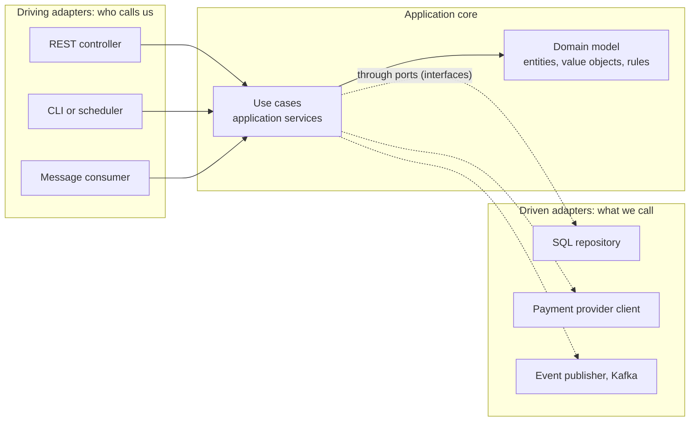
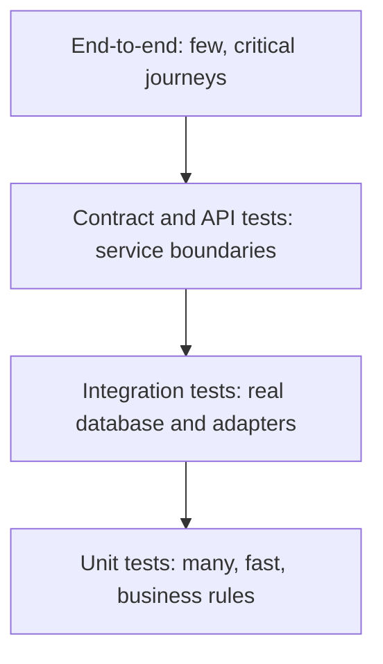

# 📘 Architecture and Testing

Architecture is how a codebase is divided so that it can change without breaking.
Testing is how you know it still works.
The two are linked: code with clear boundaries and injected dependencies is easy to test, and code that is hard to test usually has tangled boundaries.
This page covers the architectural styles used in practice, domain-driven design basics, and a testing strategy, with a hexagonal architecture example in Java and a Node.js test-runner example, both executed.

## Table of Contents

1. [Architecture Styles](#1-architecture-styles)
2. [Hexagonal Architecture in Code](#2-hexagonal-architecture-in-code)
3. [Domain-Driven Design Essentials](#3-domain-driven-design-essentials)
4. [Cross-Cutting Concerns](#4-cross-cutting-concerns)
5. [Testing Strategy](#5-testing-strategy)
6. [Tests in Practice](#6-tests-in-practice)
7. [Backend Code Review Checklist](#7-backend-code-review-checklist)
8. [Questions and Answers](#8-questions-and-answers)

---

## 1. Architecture Styles

### 1.1 From Layered to Ports and Adapters

| Style | Idea | Weakness |
| --- | --- | --- |
| **Layered** (controller, service, repository) | Each layer depends on the one below | Business logic tends to depend on the persistence layer and the framework, so it is hard to test and change |
| **Hexagonal** (ports and adapters) | The **domain and use cases sit in the center** and define **ports** (interfaces). Infrastructure (web, database, queues, external APIs) are **adapters** implementing the ports | A bit more code and indirection |
| **Onion and Clean architecture** | The same dependency rule in concentric rings: entities, use cases, interface adapters, frameworks | Same, and easy to over-layer |

The rule that defines all of them: **dependencies point inward.**
The domain knows nothing about HTTP, SQL or a framework, and the outer layers depend on the inner ones, never the reverse.



Benefits: the business rules are testable in milliseconds with fakes, infrastructure can be swapped (a different database, provider or transport) without touching the core, and the framework is a detail.

### 1.2 Choosing Granularity

| Style | When |
| --- | --- |
| **Simple layered CRUD** | Thin business logic, mostly storing and retrieving. Do not add ceremony |
| **Hexagonal or clean** | Real business rules, several integrations, long-lived systems, a need for fast unit tests |
| **Modular monolith** | One deployable, divided into modules with explicit public interfaces and separate data ownership. The best default starting point for most teams |
| **Microservices** | Independent deployability, team autonomy and different scaling needs justify the operational cost, see [Distributed Systems](/docs/system-design/hld/distributed-systems) |
| **Event-driven** | Loose coupling between parts, integration through events, see [Async Processing](/docs/backend/async-processing-and-messaging) |
| **Serverless** | Spiky or low traffic, event triggers, small teams, see [Deployment](/docs/backend/deployment-and-runtime) |

Warning signs of a **distributed monolith**: services that must deploy together, chatty synchronous chains, a shared database.
Start with a modular monolith, and split a module out when there is a reason.

---

## 2. Hexagonal Architecture in Code

The example is a checkout use case.
The **domain** (`Order`, `Money`) enforces business rules and has no dependencies.
The **application service** (`CheckoutService`) coordinates a use case through **ports** (`OrderRepository`, `PaymentGateway`, `EventPublisher`).
**Adapters** implement the ports, and here they are in-memory fakes, so the whole thing runs and is testable without any framework or database.
The `main` method is the **composition root** that wires everything together.

```java
// runnable
import java.util.*;

// ---------------- Domain: pure rules, no framework, no I/O ----------------
record Money(long cents) {
    Money {
        if (cents < 0) throw new IllegalArgumentException("money cannot be negative");
    }
    Money plus(Money other) { return new Money(cents + other.cents); }
    Money times(int n) { return new Money(cents * n); }
    @Override public String toString() { return String.format("%d.%02d", cents / 100, cents % 100); }
}

record OrderLine(String sku, int qty, Money unitPrice) {
    Money total() { return unitPrice.times(qty); }
}

/** Aggregate root: the only way to change an order, so its invariants always hold. */
class Order {
    enum Status { NEW, PAID, CANCELLED }

    private final String id;
    private final List<OrderLine> lines = new ArrayList<>();
    private Status status = Status.NEW;

    Order(String id) { this.id = id; }

    String id() { return id; }
    Status status() { return status; }

    void addLine(String sku, int qty, Money unitPrice) {
        requireStatus(Status.NEW);
        if (qty <= 0) throw new IllegalArgumentException("quantity must be positive");
        lines.add(new OrderLine(sku, qty, unitPrice));
    }

    Money total() {
        return lines.stream().map(OrderLine::total).reduce(new Money(0), Money::plus);
    }

    void markPaid() {
        requireStatus(Status.NEW);
        if (lines.isEmpty()) throw new IllegalStateException("cannot pay for an empty order");
        status = Status.PAID;
    }

    void cancel() {
        if (status == Status.PAID) throw new IllegalStateException("a paid order cannot be cancelled, refund it instead");
        status = Status.CANCELLED;
    }

    private void requireStatus(Status expected) {
        if (status != expected) throw new IllegalStateException("order is " + status + ", expected " + expected);
    }
}

// ---------------- Ports: what the application needs from the outside world ----------------
interface OrderRepository {
    void save(Order order);
    Optional<Order> find(String id);
}
interface PaymentGateway {
    boolean charge(String orderId, Money amount);
}
interface EventPublisher {
    void publish(String event);
}

// ---------------- Application service: one use case, orchestrates ports and domain ----------------
class CheckoutService {
    private final OrderRepository orders;
    private final PaymentGateway payments;
    private final EventPublisher events;

    CheckoutService(OrderRepository orders, PaymentGateway payments, EventPublisher events) {
        this.orders = orders; this.payments = payments; this.events = events;
    }

    void checkout(String orderId) {
        Order order = orders.find(orderId).orElseThrow(() -> new NoSuchElementException("no order " + orderId));
        if (!payments.charge(order.id(), order.total())) throw new IllegalStateException("payment declined");
        order.markPaid();                                   // the domain enforces the rules
        orders.save(order);
        events.publish("OrderPaid:" + order.id() + ":" + order.total());
    }
}

// ---------------- Adapters: infrastructure implementations (fakes here, SQL and HTTP in production) ----------------
class InMemoryOrderRepository implements OrderRepository {
    private final Map<String, Order> store = new HashMap<>();
    public void save(Order order) { store.put(order.id(), order); }
    public Optional<Order> find(String id) { return Optional.ofNullable(store.get(id)); }
}
class FakePaymentGateway implements PaymentGateway {
    boolean approve = true;
    public boolean charge(String orderId, Money amount) { return approve; }
}
class RecordingPublisher implements EventPublisher {
    final List<String> published = new ArrayList<>();
    public void publish(String event) { published.add(event); }
}

// ---------------- Composition root: the only place that knows the concrete classes ----------------
public class Main {
    public static void main(String[] args) {
        InMemoryOrderRepository repo = new InMemoryOrderRepository();
        FakePaymentGateway gateway = new FakePaymentGateway();
        RecordingPublisher events = new RecordingPublisher();
        CheckoutService checkout = new CheckoutService(repo, gateway, events);

        Order paid = new Order("A-1");
        paid.addLine("K1", 1, new Money(4500));
        paid.addLine("M2", 2, new Money(2000));
        repo.save(paid);
        checkout.checkout("A-1");
        System.out.println("A-1 status: " + repo.find("A-1").get().status() + ", events: " + events.published);

        gateway.approve = false;                             // a failure scenario needs no mocking framework, just a fake
        Order declined = new Order("B-2");
        declined.addLine("K1", 1, new Money(4500));
        repo.save(declined);
        try { checkout.checkout("B-2"); } catch (IllegalStateException e) { System.out.println("B-2: " + e.getMessage()); }
        System.out.println("B-2 status: " + repo.find("B-2").get().status() + ", events so far: " + events.published.size());

        try { paid.addLine("X9", 1, new Money(100)); } catch (IllegalStateException e) { System.out.println("invariant: " + e.getMessage()); }
        try { new Order("C-3").addLine("K1", 0, new Money(100)); } catch (IllegalArgumentException e) { System.out.println("invariant: " + e.getMessage()); }
        try { new Order("D-4").markPaid(); } catch (IllegalStateException e) { System.out.println("invariant: " + e.getMessage()); }
    }
}
```

What this buys you:

- **Business rules are tested without infrastructure:** `Order` and `CheckoutService` run in microseconds with the fakes above, including failure paths (declined payment) that are hard to trigger against a real provider.
- **Swapping adapters:** production wires `PostgresOrderRepository`, `StripePaymentGateway` and `KafkaEventPublisher`, and the use case is unchanged.
- **The framework is at the edge.** In Spring, the controller and `@Configuration` wiring are adapters, and `Order` has no annotations. In Node, the route handler calls the use case.
- **Testing a real adapter** still needs a real database, done as an integration test (section 5).

---

## 3. Domain-Driven Design Essentials

**Domain-driven design (DDD)** organizes complex software around the business domain.
You do not need all of it for a CRUD service, but the vocabulary helps in interviews and the tactical patterns are widely useful.

### 3.1 Strategic Design

| Concept | Meaning |
| --- | --- |
| **Ubiquitous language** | Developers and domain experts use the same terms, and code uses them too (`Shipment`, `Invoice`, not `DataObject`) |
| **Bounded context** | A boundary inside which a model and its language are consistent. "Customer" means something different to Billing and to Support, so each context has its own model |
| **Context map** | How contexts relate (shared kernel, customer-supplier, conformist, **anti-corruption layer**) |
| **Anti-corruption layer** | A translation layer that protects your model from a legacy or external model |
| **Subdomains** | Core (your competitive advantage, invest most), supporting, generic (buy or use off the shelf) |

Bounded contexts are natural **module or microservice boundaries**.

### 3.2 Tactical Design

| Building block | Meaning | Example |
| --- | --- | --- |
| **Entity** | Has an identity that persists as attributes change | `Order`, `User` |
| **Value object** | Defined by its values, immutable, no identity | `Money`, `Address`, `DateRange` |
| **Aggregate** | A cluster of entities and value objects treated as one **consistency boundary** with one **root** that guards invariants | `Order` with its `OrderLine`s |
| **Repository** | Collection-like access to aggregates | `OrderRepository` |
| **Domain service** | Behavior that does not belong to one entity | `PricingService` |
| **Domain event** | Something that happened in the domain | `OrderPaid` |
| **Factory** | Complex creation logic | `OrderFactory` |

Aggregate rules:

- **One transaction changes one aggregate.** Cross-aggregate consistency is eventual, via events.
- Keep aggregates **small**, and reference other aggregates **by id**, not by object.
- Outside code changes state only through the **root**, so invariants cannot be bypassed (as `Order` does above).
- Load and save whole aggregates through their repository.

### 3.3 When DDD Pays Off

Worth it for complex domains with real rules (insurance, logistics, finance) and long-lived systems with several teams.
Overkill for simple data-in, data-out services.
Use the ideas that fit: value objects and clear names almost always help.

---

## 4. Cross-Cutting Concerns

| Concern | Practice |
| --- | --- |
| **Dependency injection** | Pass dependencies through constructors, wire them in one **composition root**. A DI container (Spring, NestJS) automates it, but the principle works with plain functions |
| **Configuration** | Typed, validated at startup, from the environment, see [Fundamentals](/docs/backend/backend-fundamentals) |
| **Validation** | Shape and format at the boundary (schemas), business rules in the domain, database constraints as the last line |
| **Error handling** | Domain errors are explicit types, mapped to HTTP codes at the edge by one handler. Use exceptions for exceptional cases, or result types for expected failures |
| **Transactions** | At the use-case level, one per request, never spanning remote calls |
| **Request context** | Correlation id, user, tenant carried with `AsyncLocalStorage` (Node) or MDC and request scope (Java) instead of passing through every function |
| **Logging, metrics, tracing** | Structured logs, RED metrics, OpenTelemetry traces with context propagation across services and queues |
| **Feature flags** | Decouple deploy from release, gradual rollout, kill switches. Remove stale flags |
| **Idempotency** | Keys on unsafe endpoints and dedupe in consumers, see [API Design](/docs/backend/api-design) |
| **Authorization** | A central policy layer plus object-level checks, see [Security](/docs/backend/authentication-and-security) |
| **Resilience** | Timeouts, retries with backoff, circuit breakers, bulkheads around outbound calls, see [Distributed Systems](/docs/system-design/hld/distributed-systems) |
| **Multi-tenancy** | Tenant id in context, enforced in queries and by row-level security, see [Data Modeling](/docs/databases/data-modeling-patterns) |

Keep these at the **edges and in middleware**, not scattered through business logic.

---

## 5. Testing Strategy

### 5.1 Kinds of Tests

| Test | Scope | Speed | Purpose |
| --- | --- | --- | --- |
| **Unit** | One function or class, dependencies replaced | Milliseconds | Business rules, edge cases |
| **Integration** | Your code with a real dependency (database, queue, cache, HTTP client against a stub) | Seconds | Adapters and SQL, serialization, migrations |
| **Component / API** | The whole service running, external systems faked, tested through HTTP | Seconds | Wiring, validation, auth, error mapping |
| **Contract** | A consumer's expectations of a provider's API, checked against the provider (Pact, OpenAPI diff) | Fast | Catch breaking changes between services without full end-to-end runs |
| **End-to-end** | Several deployed services or the full stack | Slow, flaky-prone | A few critical user journeys |
| **Non-functional** | Load, security scanning, chaos, accessibility | Varies | Performance budgets, vulnerabilities, resilience |



The classic **pyramid** puts many unit tests at the base and few end-to-end tests at the top.
Some teams prefer a **testing trophy** with more weight on integration tests, because integration tests catch real wiring and SQL bugs that mocked unit tests miss.
The principle is the same: **more fast, focused tests than slow, broad ones**, and test each risk at the cheapest level that can catch it.

### 5.2 Test Doubles

| Double | What it is | Use |
| --- | --- | --- |
| **Dummy** | Placeholder passed but never used | Fill a parameter |
| **Stub** | Returns canned answers | Control indirect input (a user lookup) |
| **Spy** | A stub that records calls | Verify something was called |
| **Mock** | Pre-programmed expectations that fail the test if not met | Verify interactions with collaborators |
| **Fake** | A working lightweight implementation (in-memory repository) | Behavior tests without infrastructure |

Prefer **fakes and state assertions** over heavy mocking of interactions: tests that assert "method X was called with Y" break on refactors without catching bugs.
Mock only at architectural boundaries (external services), not your own internals.

### 5.3 Principles and Techniques

- **Test behavior, not implementation.** A refactor that keeps behavior should not break tests.
- **Arrange, act, assert**, one reason to fail per test, descriptive names.
- **Determinism:** inject the **clock**, random numbers and ids. Never sleep in tests, wait on conditions. Isolate state between tests.
- **Real dependencies in integration tests with Testcontainers:** start a real PostgreSQL, Redis or Kafka in a container from the test, apply real migrations, and discard it. This beats in-memory substitutes such as H2 that behave differently from production.
- **Contract testing:** consumer-driven (Pact) or provider schema checks in CI, so a change that breaks a consumer fails the provider's build.
- **Property-based testing** (fast-check, jqwik, Hypothesis): state a rule (`decode(encode(x)) == x`) and let the framework generate hundreds of inputs and shrink failures. Good for parsers, serializers and invariants.
- **Snapshot and approval tests** for large outputs, used carefully.
- **Test the failure paths:** timeouts, retries, duplicate messages, partial failures, invalid input, concurrency (see the start-gate technique in [Concurrency in LLD](/docs/system-design/lld/concurrency-in-lld)).
- **Mutation testing** (Stryker, PIT) checks whether your tests actually detect changes to the code, a better quality signal than line coverage.
- **Coverage is a floor, not a goal.** High coverage with weak assertions proves little.
- **Flaky tests** erode trust: quarantine, find the shared state or timing, fix or delete, and never ignore them.
- **TDD** (write a failing test, make it pass, refactor) is a design tool that yields testable code.
- **Test data:** builders and factories, small focused fixtures, avoid a giant shared dataset.
- Run fast tests on every commit, integration and contract tests in CI, e2e and load tests on merge or nightly.

---

## 6. Tests in Practice

### 6.1 Node.js: the Built-in Test Runner

Node has a built-in test runner (`node:test`) and assertions (`node:assert`), with mocks, no extra packages required.
The service below takes its dependencies as parameters (a repository and a clock), so tests can supply a stub and a fixed time.

```js
// runnable
const { test, describe, mock } = require('node:test');
const assert = require('node:assert/strict');

// Code under test: dependencies are injected, so tests control them
function makeGreeter({ userRepo, clock }) {
  return {
    async greeting(id) {
      const user = await userRepo.find(id);
      if (!user) throw Object.assign(new Error('user not found'), { code: 'NOT_FOUND' });
      const partOfDay = clock().getUTCHours() < 12 ? 'morning' : 'afternoon';
      return `Good ${partOfDay}, ${user.name}`;
    },
  };
}

describe('greeter', () => {
  test('greets by time of day (a stub repository and a fixed clock)', async () => {
    const userRepo = { find: mock.fn(async () => ({ id: 1, name: 'Ana' })) };     // stub that also records calls (a spy)
    const morning = makeGreeter({ userRepo, clock: () => new Date('2026-05-01T09:00:00Z') });
    const afternoon = makeGreeter({ userRepo, clock: () => new Date('2026-05-01T15:00:00Z') });

    assert.equal(await morning.greeting(1), 'Good morning, Ana');
    assert.equal(await afternoon.greeting(1), 'Good afternoon, Ana');
    assert.equal(userRepo.find.mock.callCount(), 2);
    assert.deepEqual(userRepo.find.mock.calls[0].arguments, [1]);
  });

  test('rejects for an unknown user', async () => {
    const greeter = makeGreeter({ userRepo: { find: async () => null }, clock: () => new Date() });
    await assert.rejects(() => greeter.greeting(99), { code: 'NOT_FOUND' });
  });

  test('fake timers make time-dependent code deterministic', async (t) => {
    t.mock.timers.enable({ apis: ['setTimeout'] });
    let fired = false;
    setTimeout(() => { fired = true; }, 60_000);                                   // a one-minute timer
    assert.equal(fired, false);
    t.mock.timers.tick(60_000);                                                    // advance the fake clock instantly
    assert.equal(fired, true);
  });
});
```

The fake timers API (`t.mock.timers`) is still marked experimental and prints a warning, while the rest of the test runner is stable.
Run with `node --test` (it finds `*.test.js` files), add `--watch` during development and `--experimental-test-coverage` for coverage.
Vitest and Jest are common alternatives with richer mocking and snapshot support, and **Supertest** tests HTTP handlers in-process.

### 6.2 Java: JUnit 5 and Spring (illustrative)

```java
// Unit test of the use case with fakes, no Spring involved
class CheckoutServiceTest {
    @Test
    void declinedPaymentLeavesOrderUnpaidAndPublishesNothing() {
        var repo = new InMemoryOrderRepository();
        var gateway = new FakePaymentGateway();
        gateway.approve = false;
        var events = new RecordingPublisher();
        var order = new Order("B-2");
        order.addLine("K1", 1, new Money(4500));
        repo.save(order);

        assertThrows(IllegalStateException.class, () -> new CheckoutService(repo, gateway, events).checkout("B-2"));

        assertEquals(Order.Status.NEW, repo.find("B-2").orElseThrow().status());
        assertTrue(events.published.isEmpty());
    }
}

// Web slice test: only the MVC layer, the service is mocked
@WebMvcTest(UserController.class)
class UserControllerTest {
    @Autowired MockMvc mvc;
    @MockitoBean UserService users;

    @Test
    void returns404ForUnknownUser() throws Exception {
        when(users.find(99)).thenThrow(new NotFoundException("user 99"));
        mvc.perform(get("/api/users/99")).andExpect(status().isNotFound());
    }
}

// Integration test against a real PostgreSQL in a container
@Testcontainers
@DataJpaTest
@AutoConfigureTestDatabase(replace = NONE)
class UserRepositoryIT {
    @Container @ServiceConnection
    static PostgreSQLContainer<?> db = new PostgreSQLContainer<>("postgres:17");

    @Autowired UserRepository repo;

    @Test
    void findsByEmail() {
        repo.save(new User("Ana", "ana@example.com"));
        assertTrue(repo.findByEmail("ana@example.com").isPresent());
    }
}
```

Node equivalents: Testcontainers for Node (`@testcontainers/postgresql`) and Supertest for HTTP.

---

## 7. Backend Code Review Checklist

```text
Correctness   Edge cases, null and empty, concurrency, idempotent retries, transaction boundaries
API           Right status codes, validation at the boundary, error shape, no breaking changes, pagination
Security      Authn and authz on every route, object-level checks, parameterized SQL, no secrets or PII in logs
Data          Migrations backward compatible and reversible plan, indexes for new queries, N+1 avoided
Performance   Queries per request, payload size, blocking calls on the event loop, timeouts and limits
Reliability   Timeouts and retries on outbound calls, graceful failure, behavior when a dependency is down
Observability Logs with correlation id, metrics for new paths, traces, alerts for new failure modes
Tests         Behavior covered, failure paths, no flakiness, fast, readable names
Design        Dependencies point inward, small functions, clear names, no leaked internals in DTOs
Operations    Config via environment, feature flag or rollout plan, rollback plan, docs and runbook
```

---

## 8. Questions and Answers

**Q1. What is hexagonal architecture?**
The domain and use cases are at the center and depend only on interfaces (ports), while infrastructure like web, database and messaging are adapters implementing them.
Dependencies point inward, which makes the core testable and infrastructure replaceable.

**Q2. What is the difference between layered and hexagonal architecture?**
In classic layered code the business layer depends on the data layer below it.
In hexagonal architecture the business logic depends on abstractions it owns, and persistence depends on the business layer.

**Q3. What is an aggregate?**
A cluster of objects treated as a single consistency boundary with a root entity that enforces invariants.
One transaction modifies one aggregate, and other aggregates are referenced by id and kept consistent eventually.

**Q4. Entity vs value object?**
An entity has identity that persists through change (an order).
A value object is defined by its attributes, immutable, and interchangeable (money, an address).

**Q5. What is a bounded context?**
A boundary within which a domain model and its language are consistent, often mapped to a module or service.

**Q6. Monolith or microservices?**
Start with a modular monolith with clear module boundaries and data ownership, and extract services when independent deployment, scaling or team autonomy justify the operational cost.

**Q7. What is the testing pyramid?**
Many fast unit tests, fewer integration and contract tests, and a few end-to-end tests, because cost and flakiness grow toward the top.

**Q8. Mock vs stub vs fake?**
A stub returns canned data, a mock verifies interactions, a fake is a working simplified implementation.
Prefer fakes and state assertions.

**Q9. Why use Testcontainers instead of an in-memory database?**
It tests against the real engine, so SQL dialects, locking, and features behave as in production, catching bugs an in-memory substitute hides.

**Q10. What is contract testing?**
Verifying that a provider satisfies the requests and responses its consumers rely on, so breaking changes are caught in CI without running everything end to end.

**Q11. How do you test time-dependent or random code?**
Inject a clock and a random source, and use fake timers, so tests are deterministic and instant.

**Q12. How do you handle flaky tests?**
Identify shared state, timing and ordering assumptions, fix the cause or remove the test, and never leave them ignored because they erode confidence in the suite.

Next: [Deployment and Runtime](/docs/backend/deployment-and-runtime).
