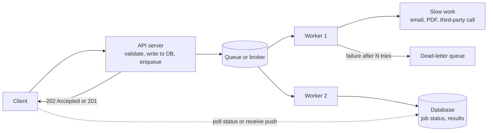
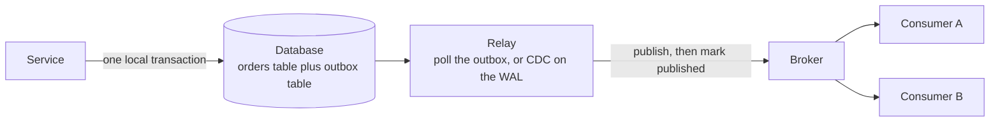

# 📘 Async Processing and Messaging

Not all work should happen while the user waits.
Sending email, resizing images, generating reports, calling slow partners and syncing other systems belong in the background, where they can be retried, throttled and scaled independently.
This page covers how to design reliable background processing in application code.
Broker-level ideas (partitions, consumer groups, delivery semantics) are in [Building Blocks](/docs/system-design/hld/building-blocks), and the distributed transaction theory is in [Distributed Systems](/docs/system-design/hld/distributed-systems).

## Table of Contents

1. [When to Go Async](#1-when-to-go-async)
2. [Messaging Patterns and Tools](#2-messaging-patterns-and-tools)
3. [Reliable Consumers](#3-reliable-consumers)
4. [A Working Job Queue](#4-a-working-job-queue)
5. [Reliable Producers: The Outbox](#5-reliable-producers-the-outbox)
6. [Events in Application Design](#6-events-in-application-design)
7. [Scheduling](#7-scheduling)
8. [Webhook Delivery](#8-webhook-delivery)
9. [Durable Workflows](#9-durable-workflows)
10. [Operating Queues](#10-operating-queues)
11. [Questions and Answers](#11-questions-and-answers)

---

## 1. When to Go Async

Move work off the request path when it is:

| Reason | Example |
| --- | --- |
| **Slow** | Video transcoding, PDF reports, ML inference |
| **Unreliable or rate limited** | Calling a payment provider, email or SMS gateway, partner APIs |
| **Non-essential to the response** | Analytics events, sending a welcome email, cache warming |
| **Bursty** | Absorb a spike with a queue and process at a steady rate |
| **Fan-out** | One order triggers inventory, email, analytics, search indexing |
| **Retry-worthy** | Should be retried automatically without the user seeing errors |

Keep it **synchronous** when the user needs the result to continue, the work is fast, and a failure should be reported immediately (validating a card, checking stock).
Async adds moving parts (a broker, workers, retries, monitoring) and **eventual consistency**: the user may see "processing" for a while, so design the UX for it.

The standard shape:



---

## 2. Messaging Patterns and Tools

### 2.1 Patterns

| Pattern | Shape | Use |
| --- | --- | --- |
| **Work queue** (competing consumers) | Many workers pull from one queue, each message goes to one worker | Background jobs |
| **Publish and subscribe** | Each subscriber gets a copy of every event | Notifying several systems of a change |
| **Event streaming** | Durable, replayable ordered log | Event sourcing, CDC, analytics pipelines |
| **Request and reply over a queue** | Reply queue or correlation id | Async RPC |
| **Delayed and scheduled messages** | Deliver later | Reminders, retries with backoff |
| **Priority queues** | Urgent work first | Password resets before newsletters |

### 2.2 Tools

| Tool | Type | Notes |
| --- | --- | --- |
| **Redis-based queues** (BullMQ for Node, Sidekiq for Ruby, RQ or Celery with Redis for Python) | Job queue library on Redis | Simple, fast, popular for background jobs. Durability depends on Redis persistence |
| **Amazon SQS**, Google Cloud Tasks, Azure Service Bus | Managed queues | Very low operations, at-least-once, visibility timeout, dead-letter queues, FIFO variants |
| **RabbitMQ** | Broker with exchanges, routing, acknowledgements | Rich routing, per-message ack, good for task queues and RPC |
| **Apache Kafka** | Distributed log | High throughput streams, replay, consumer groups. **Kafka 4.0** removed ZooKeeper (KRaft only), and **share groups** (queue-like consumption with per-message acknowledgement) arrived as an early-access feature, verify status for your version |
| **Google Pub/Sub, AWS SNS and EventBridge** | Managed pub/sub and event buses | Fan-out and routing |
| **Database-backed queues** (pg-boss, Graphile Worker, Oban) | Jobs in PostgreSQL using `FOR UPDATE SKIP LOCKED` | Transactional with your data, no extra infrastructure, good up to moderate volume. See [Transactions](/docs/databases/transactions-and-concurrency) |
| **Temporal, AWS Step Functions, Inngest** | Durable workflow engines | Multi-step processes with retries, timers and state |
| **Node `worker_threads`, JVM executors, virtual threads** | In-process concurrency | For CPU work inside one service, not a durable queue |

Choosing: start with what you already run (a Postgres queue or Redis-based library), use a managed queue in the cloud for low ops, and use Kafka when you need a shared, replayable event log at scale.

---

## 3. Reliable Consumers

The core truth: **delivery is at-least-once**.
Messages can be delivered more than once (a worker crashes after doing the work but before acknowledging, a network timeout triggers a redelivery).
Design every consumer for that.

### 3.1 The Rules

| Rule | How |
| --- | --- |
| **Idempotent handlers** | Processing the same message twice has the same effect as once: use a natural upsert, a dedupe table keyed by message id (unique constraint), or conditional updates |
| **Acknowledge after success** | Ack (or delete) only when the work is finished, so a crash leads to redelivery |
| **Retry with backoff and jitter** | Exponential delays (1s, 2s, 4s ...) plus randomness, capped, so retries do not synchronize into a storm |
| **Distinguish transient from permanent errors** | Retry timeouts and 503s, do not retry validation errors or a 4xx |
| **Bounded attempts and a dead-letter queue** | After N failures, park the message with the error for inspection and replay, so a **poison message** does not block the queue |
| **Timeouts** | Every job has a maximum runtime, and a visibility timeout longer than the timeout, extended by heartbeats for long jobs |
| **Concurrency limits** | Cap parallel jobs per worker and per downstream dependency |
| **Ordering only where needed** | Ordering costs parallelism, use a partition key so related messages stay ordered while others run concurrently |
| **Graceful shutdown** | On SIGTERM stop taking new jobs, finish in-flight ones, then exit, see [Deployment](/docs/backend/deployment-and-runtime) |
| **Small messages** | Put a reference (an id) in the message and load current data, or store big payloads in object storage |

### 3.2 Idempotency in Practice

```sql
-- a dedupe table makes "process at most once effectively"
CREATE TABLE processed_messages (message_id TEXT PRIMARY KEY, processed_at TIMESTAMPTZ NOT NULL DEFAULT now());

BEGIN;
INSERT INTO processed_messages (message_id) VALUES (:id);      -- duplicate key error means we already did this, so ack and skip
UPDATE accounts SET balance = balance + :amount WHERE id = :account;   -- the effect, in the SAME transaction
COMMIT;
```

The effect and the dedupe record commit together, so a crash between them cannot lose or repeat the work.
For effects outside your database (sending an email, charging a card), pass an **idempotency key** to the external API so their side also dedupes, see [API Design](/docs/backend/api-design).

### 3.3 Retry Delays

```text
delay = min(cap, base x 2^attempt)          exponential
sleep  = random(0, delay)                    "full jitter", the best spread
```

Combine with a **retry budget** so retries never exceed a fraction of traffic, and with **circuit breakers** when a dependency is down, see [Resilience Patterns](/docs/system-design/hld/distributed-systems).

---

## 4. A Working Job Queue

The queue below implements the reliability rules: bounded concurrency, retries with exponential backoff, a dead-letter list for poison jobs, and an idempotent consumer that skips duplicate deliveries.
It is in-memory for clarity, and the same logic lives inside BullMQ, SQS consumers and Celery.

```js
// runnable
class JobQueue {
  constructor({ handler, concurrency = 2, maxAttempts = 3, baseDelayMs = 5 }) {
    Object.assign(this, { handler, concurrency, maxAttempts, baseDelayMs });
    this.waiting = [];                 // jobs ready to run
    this.active = 0;
    this.pendingRetries = 0;           // jobs sleeping in backoff
    this.processed = new Set();        // ids already completed: makes the consumer idempotent
    this.deadLetters = [];
    this.results = new Map();
    this.peak = 0;
    this.retries = 0;
    this.idleWaiters = [];
  }

  add(job) { this.waiting.push({ attempts: 0, ...job }); this.#pump(); }

  #pump() {
    while (this.active < this.concurrency && this.waiting.length) this.#run(this.waiting.shift());
    if (this.active === 0 && this.waiting.length === 0 && this.pendingRetries === 0) {
      this.idleWaiters.splice(0).forEach((resolve) => resolve());
    }
  }

  async #run(job) {
    this.active++;
    this.peak = Math.max(this.peak, this.active);
    try {
      if (this.processed.has(job.id)) { this.results.set(job.id + ' (duplicate delivery)', 'skipped'); return; }
      job.attempts++;
      await this.handler(job);
      this.processed.add(job.id);                      // "ack" only after success
      this.results.set(job.id, `done after ${job.attempts} attempt(s)`);
    } catch (err) {
      if (job.permanent || job.attempts >= this.maxAttempts) {
        this.deadLetters.push({ id: job.id, error: err.message, attempts: job.attempts });
      } else {
        this.retries++;
        this.pendingRetries++;
        const delay = this.baseDelayMs * 2 ** (job.attempts - 1);          // exponential backoff (add jitter in production)
        setTimeout(() => { this.pendingRetries--; this.waiting.push(job); this.#pump(); }, delay);
      }
    } finally {
      this.active--;
      this.#pump();
    }
  }

  idle() { return new Promise((resolve) => { this.idleWaiters.push(resolve); this.#pump(); }); }
}

const sleep = (ms) => new Promise((r) => setTimeout(r, ms));
const failuresLeft = { flaky: 2 };                     // this job fails twice, then succeeds

const queue = new JobQueue({
  concurrency: 2,
  maxAttempts: 3,
  handler: async (job) => {
    await sleep(5);
    if (job.id === 'flaky' && failuresLeft.flaky-- > 0) throw new Error('503 from partner API');   // transient error
    if (job.id === 'poison') throw new Error('malformed payload');                                 // never succeeds
  },
});

['email-1', 'email-2', 'flaky', 'poison', 'email-3', 'email-1'].forEach((id) => queue.add({ id }));   // email-1 delivered twice

queue.idle().then(() => {
  console.log('results:', Object.fromEntries([...queue.results].sort()));
  console.log('dead letters:', queue.deadLetters);
  console.log('retries scheduled:', queue.retries, '| peak concurrency:', queue.peak);
});
```

One gap remains in this toy: the duplicate check runs at the **start** of a job, so two workers could start the same id at the same moment.
A real consumer closes that gap by inserting the dedupe record (unique constraint) **before** doing the work, as in section 3.2.

What the output shows: normal jobs finish first time, the flaky job succeeds on its third attempt after two backoff retries, the poison job lands in the dead-letter list after three attempts, the duplicate delivery of `email-1` is skipped, and concurrency never exceeds 2.

---

## 5. Reliable Producers: The Outbox

The **dual write problem**: a request must update the database **and** publish an event.
Two separate systems cannot be updated atomically, so one can succeed and the other fail.
Publishing first can announce something that then rolls back, and committing first can lose the event if the process dies before publishing.

**Transactional outbox:** write the event to an **outbox table in the same database transaction** as the business change.
A separate **relay** reads unpublished rows and sends them to the broker, then marks them published.
Delivery is at-least-once (the relay may crash between publishing and marking), so consumers must be idempotent.



```sql
-- runnable
CREATE TABLE orders (id INTEGER PRIMARY KEY, customer TEXT NOT NULL, total_cents INTEGER NOT NULL);
CREATE TABLE outbox (
  id INTEGER PRIMARY KEY AUTOINCREMENT,
  aggregate_id INTEGER NOT NULL,
  type TEXT NOT NULL,
  payload TEXT NOT NULL,
  published_at TEXT
);

-- The business row and its event commit together, or not at all
BEGIN;
INSERT INTO orders VALUES (1, 'ana', 8500);
INSERT INTO outbox (aggregate_id, type, payload) VALUES (1, 'OrderPlaced', '{"orderId":1,"totalCents":8500}');
COMMIT;

-- A failed transaction leaves no orphan event behind
BEGIN;
INSERT INTO orders VALUES (2, 'ben', 100);
INSERT INTO outbox (aggregate_id, type, payload) VALUES (2, 'OrderPlaced', '{"orderId":2,"totalCents":100}');
ROLLBACK;

-- The relay: read unpublished events in order and send them to the broker
SELECT id, type, payload FROM outbox WHERE published_at IS NULL ORDER BY id LIMIT 10;

-- After the broker acknowledges event 1, mark it. If the relay dies right before this line it will re-send on restart (at-least-once).
UPDATE outbox SET published_at = '2026-05-01T10:00:01Z' WHERE id = 1;

SELECT COUNT(*) AS still_unpublished FROM outbox WHERE published_at IS NULL;
SELECT (SELECT COUNT(*) FROM orders) AS orders, (SELECT COUNT(*) FROM outbox) AS events;
```

Relay options:

- **Polling** the table (simple, adds latency and load, use an index on unpublished rows and `SKIP LOCKED` for several relays).
- **Change data capture** (Debezium reads the database log and publishes outbox rows) for low latency without polling.
- Clean up old published rows on a schedule.
- Include an **event id** so consumers dedupe, and a **partition or ordering key** (the aggregate id) so events for one entity stay ordered.

The mirror image on the consumer side is the **inbox** table used for dedupe in section 3.2.

---

## 6. Events in Application Design

| Concept | Meaning |
| --- | --- |
| **Command** | A request to do something, addressed to one handler, may be rejected (`PlaceOrder`) |
| **Event** | A fact that already happened, past tense, anyone may react (`OrderPlaced`) |
| **Query** | A request for data |
| **Domain event** | An event raised inside your domain model, published after the transaction commits |

Practices:

- **Name events in the past tense**, and include what consumers need (or an id plus a way to fetch), never internal implementation details.
- Use a versioned **schema** (JSON Schema, Avro or Protobuf) with a **schema registry** in Kafka setups, and follow backward and forward compatibility rules: add optional fields, never change meanings, never reuse field numbers.
- **Envelope:** `id`, `type`, `version`, `occurredAt`, `source`, `correlationId`, `data`. The CloudEvents spec standardizes this.
- **Choreography vs orchestration** for multi-service flows: services react to each other's events (loose coupling, hard to see the whole), or a coordinator drives the steps (explicit flow, easier to monitor). Compensating steps for failures are **sagas**, see [Distributed Systems](/docs/system-design/hld/distributed-systems).
- **Ordering:** guarantee only per key (partition), design consumers to tolerate out-of-order events with version numbers or timestamps.
- **Do not put commands in fake events** ("SendEmail" as an event), and avoid a distributed monolith where every service needs every other to be up.
- **Testing:** contract tests for event schemas, and consumer tests that replay duplicates and out-of-order sequences.

Kafka consumer sketch (illustrative):

```ts
// Node with kafkajs
await consumer.subscribe({ topic: 'orders', fromBeginning: false });
await consumer.run({
  autoCommit: false,                                            // commit offsets ourselves, after processing
  eachMessage: async ({ topic, partition, message }) => {
    const event = JSON.parse(message.value.toString());
    await handleOrderPlaced(event);                             // idempotent: dedupe on event.id
    await consumer.commitOffsets([{ topic, partition, offset: (BigInt(message.offset) + 1n).toString() }]);
  },
});
```

```java
// Spring Kafka
@KafkaListener(topics = "orders", groupId = "billing")
public void onOrderPlaced(OrderPlaced event, Acknowledgment ack) {
    billingService.handle(event);      // idempotent by event id
    ack.acknowledge();                 // manual ack after success
}
```

---

## 7. Scheduling

Recurring and delayed work: nightly reports, expiring holds, reminder emails, retries.

| Approach | Notes |
| --- | --- |
| **OS cron or Kubernetes CronJob** | Simple for a single task, runs a container on a schedule, must handle overlap (`concurrencyPolicy: Forbid`) and missed runs |
| **In-app scheduler** (`@Scheduled` in Spring, `node-cron`, Quartz) | Convenient, but with several instances **every instance runs the job**, causing duplicates |
| **Distributed scheduling** | A single-run guarantee via a database lock (`ShedLock`, a row with `FOR UPDATE SKIP LOCKED`), leader election, or a queue with a repeatable job (BullMQ repeatable jobs, Cloud Scheduler enqueuing a task) |
| **Workflow engine timers** | Durable timers in Temporal or Step Functions |
| **Database-driven** | A `run_at` column polled with `SKIP LOCKED`, see the job scheduler in [Large-Scale Designs](/docs/system-design/hld/large-scale-designs) |

Rules:

- Assume **at-least-once**: a scheduled job may run twice or be skipped, so make it **idempotent** and able to catch up.
- Handle **time zones and daylight saving** (run in UTC unless the business says otherwise, and know what "2:30 AM" means on DST days).
- Add **jitter** to avoid every job starting at :00.
- Log start, end and outcome, and alert when a job **does not run** (dead-man's switch), not just when it fails.
- Keep jobs short, chunk large work into batches, and bound their resource use.

---

## 8. Webhook Delivery

If your product sends webhooks, you are building a small reliable messaging system.

- Store each event and one **delivery record per subscriber endpoint**.
- Sign requests (HMAC, timestamp), set short timeouts, do not follow redirects blindly, and block private network targets (SSRF), see [API Design](/docs/backend/api-design).
- Retry with exponential backoff and jitter for hours to days, then mark the endpoint failing, notify the owner and eventually disable it.
- **Isolate slow or dead endpoints** (per-endpoint queues or circuit breakers) so one bad customer does not delay others.
- Provide a **delivery log**, manual **replay**, and rotate signing secrets with an overlap window.
- Document that deliveries are at-least-once and unordered, and include an event id.

---

## 9. Durable Workflows

Multi-step business processes (onboarding, order fulfillment, refunds) need state, retries, timeouts, waiting for humans, and compensation.
Hand-rolling this with queues and status columns gets complicated.

A **durable execution engine** (Temporal, AWS Step Functions, Azure Durable Functions, Inngest, Cadence) records each step so a workflow survives crashes and resumes exactly where it stopped:

- **Activities** are the side-effecting steps, retried automatically with configurable policies.
- **Workflow code** is deterministic orchestration (loops, conditionals, waits), replayed from history after a failure.
- **Timers** can sleep for days, **signals** deliver external events (an approval), and **sagas** run compensations.

Use it when a process spans several steps or services, lasts long, or needs visibility and audit.
Use a plain queue for independent, short jobs.
See [Distributed Systems: sagas](/docs/system-design/hld/distributed-systems).

---

## 10. Operating Queues

| Metric | Why |
| --- | --- |
| **Queue depth** | Is work piling up? |
| **Age of the oldest message** | The real backlog signal, and the best autoscaling metric |
| **Processing time and success rate** | Job health |
| **Retry and dead-letter counts** | Poison messages, failing dependencies |
| **Consumer lag** (Kafka) | How far behind consumers are |
| **Worker saturation** | Are there enough workers? |

Practices:

- **Alert on age and DLQ growth**, not only on errors.
- **Autoscale workers** on queue depth or oldest-message age.
- **Backpressure:** bound queues, reject or shed when full, and rate limit producers, otherwise a slow consumer becomes an unbounded backlog and memory problem.
- **DLQ workflow:** inspect, fix the cause, and **redrive** messages, with tooling for it.
- **Trace** messages end to end by propagating a correlation id or trace context in message headers.
- **Capacity:** peak enqueue rate, average job time and target latency determine worker count (Little's law).
- **Secure** the broker (authentication, TLS, per-service permissions) and do not put secrets in messages.
- Plan for **poison messages**, **schema changes** during deploys, and **replays** after bugs.

---

## 11. Questions and Answers

**Q1. Why is message delivery at-least-once, and what does that imply?**
A worker can finish the work and crash before acknowledging, and networks can duplicate, so brokers redeliver rather than risk loss.
Consumers must be idempotent.

**Q2. How do you make a consumer idempotent?**
Dedupe by a message or event id with a unique constraint in the same transaction as the effect, use naturally idempotent operations (upserts, set to a value), and pass idempotency keys to external calls.

**Q3. What is a dead-letter queue?**
A holding queue for messages that fail repeatedly, so poison messages do not block processing, with the error attached for investigation and redrive.

**Q4. Exponential backoff with jitter: why both?**
Backoff gives failing dependencies time to recover, and jitter prevents all clients from retrying at the same instants, which would recreate the overload.

**Q5. What is the dual write problem and how does the outbox solve it?**
Updating a database and publishing to a broker cannot be atomic.
The outbox stores the event in the same transaction as the data, and a relay publishes it afterwards, giving at-least-once delivery.

**Q6. Queue or Kafka?**
A queue for task distribution with per-message acknowledgement and simple ops.
Kafka for durable, replayable, high-throughput event streams with multiple independent consumer groups.

**Q7. How do you guarantee ordering?**
Only per key: route related messages to the same partition or queue group, process them sequentially, and accept that global ordering limits scale.

**Q8. How do you run a cron job on a scaled-out service exactly once?**
Use a distributed lock or leader election, or enqueue the scheduled task into a queue processed by one worker, and make the job idempotent since exactly once is not guaranteed.

**Q9. How would you design email sending?**
Enqueue a job after the transaction commits (or via outbox), an idempotent worker with retries and backoff to a provider, per-recipient dedupe, bounce and complaint handling, rate limits, and a dead-letter queue with alerting.

**Q10. How do you handle a poison message?**
Limit attempts, move it to a dead-letter queue with the error, alert, fix the cause or the message, and redrive.

**Q11. When would you use a workflow engine?**
For long-running, multi-step processes needing durable state, timers, human steps, retries and compensation, where hand-built status machines become fragile.

**Q12. What is the best autoscaling signal for queue workers?**
Age of the oldest message (or queue depth per worker), because it reflects user-visible delay, unlike CPU.

Next: [Architecture and Testing](/docs/backend/architecture-and-testing).
