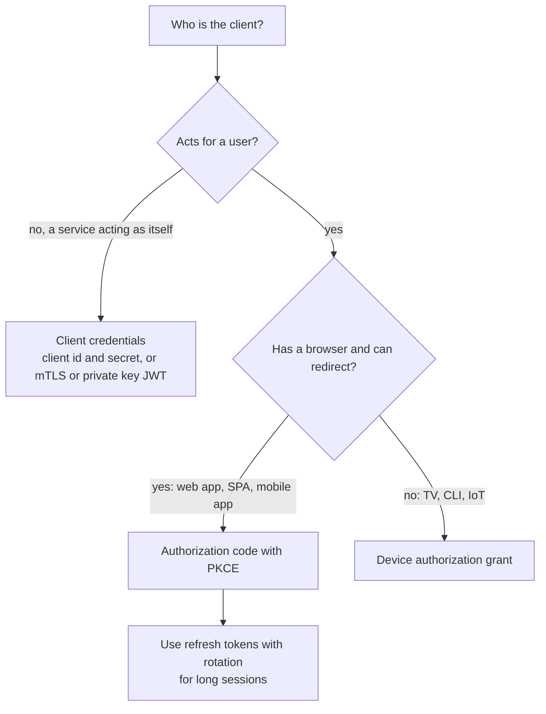
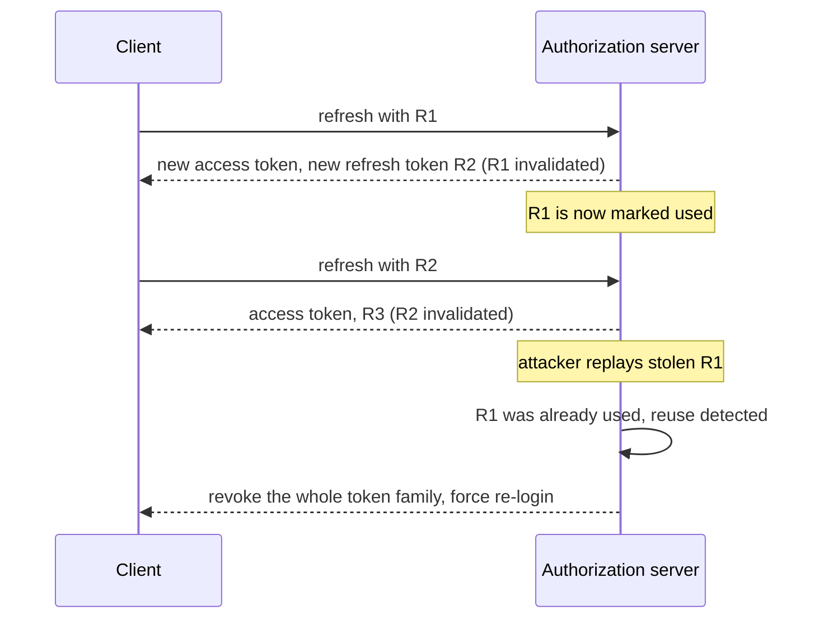

# 📘 Authentication and Security

Security mistakes are the most expensive backend bugs.
This page covers who the caller is (**authentication**), what they may do (**authorization**), and the attack classes you must defend against, ending with the current OWASP Top 10.
Four demos were executed: password hashing, a from-scratch JWT with the classic attacks, TOTP verified against the RFC 6238 test vectors, and SQL injection with its fix.

## Table of Contents

1. [Authentication vs Authorization](#1-authentication-vs-authorization)
2. [Sessions and Tokens](#2-sessions-and-tokens)
3. [Passwords](#3-passwords)
4. [JWT](#4-jwt)
5. [OAuth 2.0, OAuth 2.1 and OpenID Connect](#5-oauth-20-oauth-21-and-openid-connect)
6. [Multi-Factor Authentication and Passkeys](#6-multi-factor-authentication-and-passkeys)
7. [Authorization](#7-authorization)
8. [OWASP Top 10:2025](#8-owasp-top-102025)
9. [Injection and Input Attacks](#9-injection-and-input-attacks)
10. [Web-Facing Defenses](#10-web-facing-defenses)
11. [Secrets, Crypto and Supply Chain](#11-secrets-crypto-and-supply-chain)
12. [Questions and Answers](#12-questions-and-answers)

---

## 1. Authentication vs Authorization

| | Authentication (AuthN) | Authorization (AuthZ) |
| --- | --- | --- |
| Question | **Who** are you? | **What** may you do? |
| Failure code | 401 | 403 (or 404 to hide existence) |
| Examples | Password, passkey, token, certificate | Roles, permissions, ownership checks, policies |
| When | At login and on every request (verify the credential) | On **every** request, for **every** object |

Security principles that run through the page:

- **Defense in depth:** several independent layers, so one failure is not fatal.
- **Least privilege:** grant the minimum access, for the minimum time.
- **Deny by default:** allow only what is explicitly permitted.
- **Never trust the client:** everything from a browser or app can be forged.
- **Fail securely:** on error, deny.
- **Keep it simple:** complex security code hides bugs, use vetted libraries and standards.
- **Assume breach:** log, monitor, limit blast radius, be able to revoke and rotate.

---

## 2. Sessions and Tokens

| | **Server-side session** | **Token (JWT or opaque) in the Authorization header** |
| --- | --- | --- |
| How it works | Server stores state and gives the browser a random **session id** in a cookie | Client holds a signed token, server verifies it (or looks it up) |
| Revocation | Immediate (delete the session) | Hard for self-contained tokens, easy for opaque tokens with a lookup |
| Scaling | Needs a shared store (Redis) or sticky sessions | Stateless verification, scales trivially |
| Browser storage | `HttpOnly` cookie, automatically sent | `localStorage` is exposed to XSS, memory or cookie is safer |
| CSRF | **Vulnerable** (the browser sends cookies automatically), needs defenses | Not vulnerable when sent in a header explicitly |
| Best for | Traditional web apps, server-rendered sites, first-party UIs | APIs, mobile apps, service-to-service, third-party clients |

A very good default for a first-party web app is still a **server-side session in an `HttpOnly; Secure; SameSite=Lax` cookie**: simple, revocable, and safe from token theft through XSS.

### 2.1 Cookie Hardening

```text
Set-Cookie: __Host-sid=<random 128+ bit id>; HttpOnly; Secure; SameSite=Lax; Path=/; Max-Age=28800
```

- Generate the id with a cryptographically secure random generator, never a counter or hash of user data.
- **Rotate the session id at login** (prevents session fixation) and on privilege change.
- Use **idle and absolute timeouts**, and destroy the session on logout.
- Store minimal data in the session, keep the rest on the server.

### 2.2 CSRF (Cross-Site Request Forgery)

An attacker page makes the victim's browser send a request to your site, and the browser attaches the victim's cookies.

Defenses, combine them:

1. **`SameSite=Lax` or `Strict`** cookies (the modern baseline, blocks cross-site `POST`).
2. **Anti-CSRF tokens** (synchronizer token or a double-submit cookie) on state-changing requests.
3. Verify the **`Origin` or `Referer`** header on unsafe methods.
4. Require a **custom header** or `application/json` for APIs, which cross-site forms cannot send without CORS approval.
5. Never change state with `GET`.

### 2.3 CORS Is Not Authentication

CORS relaxes the browser's same-origin policy, it does not authenticate anyone.
Use an explicit origin allowlist, avoid `Access-Control-Allow-Origin: *` with credentials, and see [Fundamentals](/docs/backend/backend-fundamentals).

---

## 3. Passwords

If you store passwords, storing them correctly is non-negotiable.

- **Never store plaintext or reversible encryption.** Store a **slow, salted hash** made by a **password hashing function**.
- Recommended: **Argon2id** (memory-hard, the current OWASP first choice), then **scrypt**, **bcrypt** (cost 10 or more, 72-byte input limit), or **PBKDF2** with a very high iteration count when FIPS compliance requires it.
- A **salt** is a unique random value per password that defeats rainbow tables and makes identical passwords hash differently. Libraries generate and store it in the output string.
- A **pepper** is a secret key kept outside the database (in a secret manager or HSM) and mixed in, so a stolen database alone is not enough.
- Fast hashes (MD5, SHA-1, plain SHA-256) are **wrong** for passwords, GPUs test billions per second.
- Compare in **constant time** to avoid timing leaks.
- Tune the work factor so one hash takes tens to hundreds of milliseconds on your hardware, and rehash on login when parameters change.

```js
// runnable
const crypto = require('node:crypto');

// scrypt is built into Node. Format: algorithm$N$r$p$salt$hash, so parameters travel with the hash and can be upgraded later.
function hashPassword(password, salt = crypto.randomBytes(16), { N = 16384, r = 8, p = 1 } = {}) {
  const key = crypto.scryptSync(password.normalize('NFKC'), salt, 64, { N, r, p });
  return ['scrypt', N, r, p, salt.toString('base64'), key.toString('base64')].join('$');
}

function verifyPassword(password, stored) {
  const [alg, N, r, p, saltB64, keyB64] = stored.split('$');
  if (alg !== 'scrypt') return false;
  const expected = Buffer.from(keyB64, 'base64');
  const actual = crypto.scryptSync(password.normalize('NFKC'), Buffer.from(saltB64, 'base64'), expected.length, { N: +N, r: +r, p: +p });
  return crypto.timingSafeEqual(actual, expected);      // constant-time comparison
}

const h1 = hashPassword('correct horse battery staple');
const h2 = hashPassword('correct horse battery staple');
console.log('same password, different salts, different hashes:', h1 !== h2);
console.log('correct password verifies:', verifyPassword('correct horse battery staple', h1));
console.log('wrong password rejected:  ', !verifyPassword('Correct horse battery staple', h1));
console.log('stored form:', h1.split('$').slice(0, 4).join('$') + '$<salt>$<hash>');
```

In production use the async `crypto.scrypt` (runs in the thread pool and does not block the event loop) or a maintained Argon2 library, and never the synchronous variant on a request path.

Login flow protections:

- **Rate limit** by account and IP, add progressive delays or CAPTCHA, and alert on credential stuffing.
- Use **generic error messages** ("invalid email or password") so accounts cannot be enumerated, and make timing similar for unknown users.
- Check new passwords against **breached password lists** (Have I Been Pwned range API) and enforce length (12 or more) over complexity rules.
- **Password reset:** single-use, short-lived, random tokens (stored hashed), sent to the verified email, invalidate sessions after reset, no security questions.
- Prefer **passkeys or an identity provider** (see below) over building password auth yourself when you can.

---

## 4. JWT

A **JSON Web Token** is a compact, signed (and optionally encrypted) set of claims: `header.payload.signature`, each part Base64URL encoded.
The payload is **encoded, not encrypted**: anyone can read it.

```text
header:   { "alg": "HS256", "typ": "JWT" }
payload:  { "sub": "42", "iss": "https://auth.example.com", "aud": "orders-api",
            "exp": 1800000900, "iat": 1800000000, "scope": "orders:read" }
signature: HMAC-SHA256(base64url(header) + "." + base64url(payload), secret)
```

| Claim | Meaning |
| --- | --- |
| `iss` | Issuer, who created the token |
| `sub` | Subject, the user id |
| `aud` | Audience, the API the token is for |
| `exp`, `nbf`, `iat` | Expiry, not-before, issued-at (seconds since epoch) |
| `jti` | Unique token id (revocation lists, replay detection) |
| `scope`, `roles` | Permissions |

### 4.1 Signing Algorithms

| Algorithm | Type | Use |
| --- | --- | --- |
| **HS256** | Symmetric HMAC, one shared secret | Single service that both signs and verifies |
| **RS256, ES256, EdDSA** | Asymmetric, private key signs, public key verifies | An identity provider signs, many services verify with the public key from a **JWKS** endpoint. Prefer ES256 or EdDSA for smaller tokens |

### 4.2 A Verifier From Scratch, and the Classic Attacks

```js
// runnable
const crypto = require('node:crypto');
const SECRET = 'a-long-random-server-secret';

const b64u = (x) => Buffer.from(x).toString('base64url');
const json = (b64) => JSON.parse(Buffer.from(b64, 'base64url').toString());

function signJwt(claims, { expiresInSec = 900, now }) {
  const header = { alg: 'HS256', typ: 'JWT' };
  const payload = { ...claims, iat: now, exp: now + expiresInSec };
  const data = `${b64u(JSON.stringify(header))}.${b64u(JSON.stringify(payload))}`;
  return `${data}.${crypto.createHmac('sha256', SECRET).update(data).digest('base64url')}`;
}

function verifyJwt(token, { audience, issuer, now }) {
  const parts = token.split('.');
  if (parts.length !== 3) throw new Error('malformed token');
  const [h, p, s] = parts;
  if (json(h).alg !== 'HS256') throw new Error('unexpected algorithm');          // pin the algorithm, never trust the header
  const expected = crypto.createHmac('sha256', SECRET).update(`${h}.${p}`).digest();
  const given = Buffer.from(s, 'base64url');
  if (given.length !== expected.length || !crypto.timingSafeEqual(given, expected)) throw new Error('bad signature');
  const c = json(p);
  if (c.exp <= now) throw new Error('token expired');
  if (c.nbf && c.nbf > now) throw new Error('token not yet valid');
  if (c.aud !== audience) throw new Error('wrong audience');
  if (c.iss !== issuer) throw new Error('wrong issuer');
  return c;
}

const now = 1_800_000_000;
const opts = { audience: 'orders-api', issuer: 'https://auth.example.com', now };
const token = signJwt({ sub: '42', role: 'user', aud: 'orders-api', iss: 'https://auth.example.com' }, { now });

const attempt = (label, fn) => { try { console.log(label.padEnd(34), 'OK', JSON.stringify(fn())); } catch (e) { console.log(label.padEnd(34), 'REJECTED:', e.message); } };

attempt('valid token', () => verifyJwt(token, opts));

// 1. Tamper with the payload to become admin, keep the old signature
const [h, p, s] = token.split('.');
const forgedPayload = b64u(JSON.stringify({ ...json(p), role: 'admin' }));
attempt('tampered payload (role=admin)', () => verifyJwt(`${h}.${forgedPayload}.${s}`, opts));

// 2. The "alg: none" attack: claim no signature is needed
const noneHeader = b64u(JSON.stringify({ alg: 'none', typ: 'JWT' }));
attempt('alg none, no signature', () => verifyJwt(`${noneHeader}.${forgedPayload}.`, opts));

// 3. Expired, wrong audience
attempt('expired token', () => verifyJwt(token, { ...opts, now: now + 3600 }));
attempt('token meant for another API', () => verifyJwt(token, { ...opts, audience: 'billing-api' }));
```

### 4.3 JWT Pitfalls and Rules

| Pitfall | Rule |
| --- | --- |
| **Trusting the `alg` header** (accepting `none`, or an RSA public key used as an HMAC secret, "key confusion") | **Pin the expected algorithm** in the verifier |
| **Not validating claims** | Always check `exp`, `iss`, `aud`, and `nbf` |
| **Cannot revoke before expiry** | Short-lived access tokens (5 to 15 minutes), a deny list keyed by `jti` for emergencies, or opaque tokens with introspection |
| **Long-lived access tokens** | Combine short access tokens with **rotating refresh tokens** |
| **Sensitive data in the payload** | It is readable, never put secrets or unnecessary personal data in it |
| **Storing in `localStorage`** | Any XSS steals it. Prefer `HttpOnly` cookies for browser apps, or keep tokens in memory with a refresh cookie |
| **Weak HMAC secret** | 256 bits or more of random data, rotate, or use asymmetric keys |
| **Using JWT as a session store for everything** | Sessions with server-side state are often simpler and more secure for first-party web apps |
| **Key rotation** | Include a `kid` header, publish a JWKS, keep old keys until old tokens expire |

**Opaque tokens** (random strings looked up server-side, or via **token introspection**, RFC 7662) are revocable and reveal nothing, at the cost of a lookup.
Self-contained JWTs trade revocability for stateless verification.

---

## 5. OAuth 2.0, OAuth 2.1 and OpenID Connect

**OAuth 2.0** is a framework for **delegated authorization**: an application gets limited access to a resource on a user's behalf, without their password.
**OpenID Connect (OIDC)** adds an **identity layer** on top (an **ID token** proving who logged in), which is what "Sign in with Google" uses.

Roles: **resource owner** (the user), **client** (the app), **authorization server** (issues tokens, the identity provider), **resource server** (the API).

### 5.1 Which Flow?



| Flow | Use | Status |
| --- | --- | --- |
| **Authorization code + PKCE** | Web apps, SPAs, mobile and desktop | The recommended flow for every user-facing client |
| **Client credentials** | Machine to machine | Current |
| **Device code** | Input-constrained devices | Current |
| **Implicit** (tokens in the URL fragment) | Old SPAs | **Deprecated**, removed in OAuth 2.1 |
| **Resource owner password** (the app collects the password) | Legacy | **Deprecated**, removed in OAuth 2.1 |

### 5.2 Authorization Code With PKCE

1. The client creates a random **code verifier** and sends its hash (**code challenge**) with the authorization request, plus a random **state** (CSRF protection) and, for OIDC, a **nonce**.
2. The user logs in at the authorization server and consents.
3. The server redirects back to the client's **exact registered redirect URI** with a one-time **authorization code**.
4. The client exchanges the code plus the original **verifier** for tokens at the token endpoint. An attacker who stole the code cannot redeem it without the verifier.
5. The client calls the API with the **access token**. A **refresh token** gets new access tokens later.

The sequence is drawn in [Reliability and Operations](/docs/system-design/hld/reliability-and-operations#61-authentication-and-authorization).

### 5.3 OAuth 2.1 Direction

**OAuth 2.1** (an IETF draft consolidating best practice) makes the secure defaults mandatory:

- **PKCE required** for all clients using the authorization code flow.
- **Exact string matching** of redirect URIs.
- **No implicit grant, no password grant.**
- **Refresh tokens** must be sender-constrained or **single-use with rotation**.
- Bearer tokens not in query strings.

The Model Context Protocol for AI agents specifies OAuth 2.1 with PKCE for authorizing tool servers, see [AI System Design](/docs/system-design/hld/ai-system-design).
Stronger token binding options: **DPoP** (proof-of-possession per request) and **mutual TLS** bound tokens.

### 5.4 Refresh Token Rotation With Reuse Detection



Each refresh token is single-use, and presenting an old one signals theft, so the server revokes the entire chain.

### 5.5 Practical Points

- **Scopes** describe what the token may do (`orders:read`). They limit the client, and are not the same as the user's permissions, both must allow the action.
- Validate access tokens at the API: signature (via JWKS), `iss`, `aud`, `exp`, and scope.
- Use a **battle-tested identity provider** (Auth0, Okta, Keycloak, AWS Cognito, Entra ID, Firebase Auth, Clerk) or library, and do not implement the protocol yourself.
- **SSO** for enterprises uses **SAML 2.0** or OIDC, and **SCIM** provisions users.
- Service-to-service: mTLS, workload identity (SPIFFE), short-lived cloud credentials instead of static keys.

---

## 6. Multi-Factor Authentication and Passkeys

| Factor type | Examples | Notes |
| --- | --- | --- |
| Something you know | Password, PIN | Phishable, reused |
| Something you have | Authenticator app (TOTP), hardware key, passkey | Strong |
| Something you are | Fingerprint, face | Usually unlocks a device-bound key |
| SMS codes | | Weak (SIM swapping, interception), better than nothing, avoid for high-risk accounts |

### 6.1 TOTP (RFC 6238)

Authenticator apps compute a **time-based one-time password** from a shared secret and the current time.
The server stores the same secret and computes the same value.

```text
counter = floor(unix_time / 30)
HMAC    = HMAC-SHA1(secret, counter as 8 bytes)
offset  = last nibble of HMAC
code    = (4 bytes of HMAC at offset, top bit cleared) mod 10^digits
```

The implementation below is checked against the official RFC 6238 test vectors:

```js
// runnable
const crypto = require('node:crypto');

function hotp(secret, counter, digits = 6) {
  const msg = Buffer.alloc(8);
  msg.writeBigUInt64BE(BigInt(counter));
  const h = crypto.createHmac('sha1', secret).update(msg).digest();
  const offset = h[h.length - 1] & 0x0f;                                  // dynamic truncation
  const bin = ((h[offset] & 0x7f) << 24) | (h[offset + 1] << 16) | (h[offset + 2] << 8) | h[offset + 3];
  return String(bin % 10 ** digits).padStart(digits, '0');
}
const totp = (secret, unixSec, { step = 30, digits = 6 } = {}) => hotp(secret, Math.floor(unixSec / step), digits);

// Verify with a small window to tolerate clock drift, and use a constant-time comparison
function verifyTotp(secret, submitted, unixSec, windowSteps = 1) {
  for (let i = -windowSteps; i <= windowSteps; i++) {
    const expected = totp(secret, unixSec + i * 30);
    if (expected.length === submitted.length && crypto.timingSafeEqual(Buffer.from(expected), Buffer.from(submitted))) return true;
  }
  return false;
}

// RFC 6238 Appendix B test vectors (SHA-1, secret "12345678901234567890", 8 digits)
const secret = Buffer.from('12345678901234567890');
const vectors = [[59, '94287082'], [1111111109, '07081804'], [1111111111, '14050471'], [1234567890, '89005924'], [2000000000, '69279037']];
for (const [t, expected] of vectors) {
  const got = totp(secret, t, { digits: 8 });
  console.log(`t=${t}`.padEnd(14), got, got === expected ? 'matches RFC' : 'MISMATCH');
}
const t = 1_800_000_000;
console.log('6-digit code now:', totp(secret, t), '| accepted:', verifyTotp(secret, totp(secret, t), t),
            '| previous step accepted:', verifyTotp(secret, totp(secret, t - 30), t),
            '| two steps old rejected:', !verifyTotp(secret, totp(secret, t - 90), t));
```

Server-side rules: store the secret **encrypted**, reject a code that was already used (prevent replay within its window), rate limit attempts, and issue **recovery codes** (single-use, stored hashed).

### 6.2 Passkeys and WebAuthn

**WebAuthn** (with the FIDO2 CTAP protocol) lets a device create a **public-private key pair per site**.
The private key never leaves the device (or the platform's synced keychain), and the server stores only the public key.
Login is a **signature over a server challenge**, bound to the site's origin.

- **Phishing-resistant:** a fake site has a different origin, so the browser will not produce a valid signature for it.
- No shared secret to steal from your database, nothing to reuse across sites.
- **Passkeys** are discoverable, often synced credentials (iCloud Keychain, Google Password Manager, password managers), which made them practical for consumers. Adoption is now large (major platforms default new accounts to passkeys, and industry bodies report billions of accounts with passkeys enabled), with better success rates and faster sign-in than passwords.
- Design still needs **account recovery** paths and a fallback for older devices.
- Use a library (SimpleWebAuthn, webauthn4j) and an identity provider that supports them.

---

## 7. Authorization

### 7.1 Models

| Model | Idea | Example |
| --- | --- | --- |
| **RBAC** (role-based) | Users have roles, roles have permissions | `admin`, `editor`, `viewer` |
| **ABAC** (attribute-based) | Decide from attributes of the user, resource, action and environment | "Doctors may read records of patients in their department during working hours" |
| **ReBAC** (relationship-based) | Access follows relationships in a graph | "Editors of the folder can edit files inside", the Google Zanzibar model (OpenFGA, SpiceDB) |
| **Policy as code** | A policy engine evaluates rules | OPA (Rego), AWS Cedar, Casbin |
| **Scopes** | Limits on what an OAuth client may do | `read:orders` |

### 7.2 Rules That Prevent Real Breaches

- **Check authorization on the server, on every request, for every object.** Hidden buttons and client-side checks are not security.
- The most common serious API bug is **BOLA / IDOR** (broken object level authorization): `GET /orders/1001` returns any order to any logged-in user. Always verify that **this user may access this object**, typically by including the owner in the query (`WHERE id = ? AND tenant_id = ?`).
- Also check **function-level** access (a normal user calling admin endpoints) and **property-level** access (a user updating `isAdmin` or reading fields they should not).
- **Deny by default**, centralize the check in one policy layer or middleware, and **test** it with tests that try the forbidden path.
- Do not use the ids' obscurity as protection (random UUIDs help against enumeration but are not authorization).
- In multi-tenant systems isolate tenants in the data layer too (row-level security), see [Data Modeling](/docs/databases/data-modeling-patterns).
- Log authorization failures, and **avoid confused-deputy** issues when one service calls another on a user's behalf (propagate the user's identity and check at each hop, or use token exchange).

---

## 8. OWASP Top 10:2025

The OWASP Top 10 is the standard awareness list of web application risks.
The 2025 edition (announced in November 2025, final in January 2026) is:

| # | Category | What it is | Main defenses |
| --- | --- | --- | --- |
| **A01** | **Broken Access Control** | Users act outside their permissions (IDOR, missing checks, privilege escalation). SSRF is now grouped here | Deny by default, server-side checks on every object, ownership in queries, tests |
| **A02** | **Security Misconfiguration** | Default credentials, open buckets, verbose errors, missing hardening, unnecessary features | Hardened baselines, infrastructure as code, config scanning, minimal surface |
| **A03** | **Software Supply Chain Failures** | Compromised dependencies, build systems, registries, CI or update channels (new in 2025, highest incidence in the data) | Lockfiles, pinned versions, dependency scanning, SBOMs, signed artifacts, verified provenance, restricted CI secrets |
| **A04** | **Cryptographic Failures** | Weak or missing encryption, bad key management, plaintext secrets | TLS everywhere, modern algorithms, managed keys, hash passwords properly |
| **A05** | **Injection** | Untrusted data interpreted as code: SQL, NoSQL, OS command, LDAP, XSS, template injection | Parameterized queries, context-aware output encoding, allowlist validation |
| **A06** | **Insecure Design** | Flaws in the design that no implementation fixes | Threat modeling, secure design patterns, abuse cases, rate limits and business-logic limits |
| **A07** | **Authentication Failures** | Weak passwords, credential stuffing, session flaws, missing MFA | MFA and passkeys, rate limiting, secure sessions, breached-password checks |
| **A08** | **Software or Data Integrity Failures** | Trusting unsigned updates, insecure deserialization, unverified CI/CD artifacts | Signatures, integrity checks, avoid unsafe deserialization |
| **A09** | **Security Logging and Alerting Failures** | Cannot detect or investigate attacks | Log security events, alert on anomalies, protect log integrity |
| **A10** | **Mishandling of Exceptional Conditions** | Errors handled badly: crashes, fail-open behavior, leaking details, unchecked returns (new in 2025) | Fail closed, consistent error handling, resource cleanup, test failure paths |

Notes for interviews:

- A **new focus on the supply chain** (A03) and on **error handling** (A10) reflects real incidents, such as outages caused by mishandled unexpected input, see the Cloudflare case in [Reliability and Operations](/docs/system-design/hld/reliability-and-operations).
- OWASP also publishes the **API Security Top 10** (2023), led by broken object level authorization, broken authentication, broken object property level authorization, unrestricted resource consumption, and broken function level authorization.
- Use the list to **structure your answer** to "how would you secure this API?".

---

## 9. Injection and Input Attacks

### 9.1 SQL Injection

If user input becomes part of the SQL **text**, the attacker changes the query.
The fix is to send SQL and data **separately**: parameterized queries, so the input is always a value.

```sql
-- runnable
CREATE TABLE users (id INTEGER PRIMARY KEY, name TEXT, secret TEXT);
INSERT INTO users VALUES (1, 'ana', 'a-secret'), (2, 'ben', 'b-secret');

-- VULNERABLE: the app builds  "SELECT ... WHERE name = '" + input + "'"  and the attacker sends  x' OR '1'='1
-- The database receives this text, and the condition is always true, so every row leaks:
SELECT name, secret FROM users WHERE name = 'x' OR '1'='1';

-- SAFE: the query text is fixed, and the input is bound as a VALUE, never parsed as SQL
.parameter set :name "'x'' OR ''1''=''1'"
SELECT COUNT(*) AS rows_returned FROM users WHERE name = :name;      -- 0: looked for a user literally named that

.parameter set :name "'ana'"
SELECT name FROM users WHERE name = :name;                           -- normal input still works
```

- **Parameterize everything** that comes from outside: ORMs and query builders do this by default, but raw fragments (`ORDER BY ${column}`, `LIKE`, table names) still need **allowlists**, because identifiers cannot be bound as parameters.
- Least-privilege database accounts limit the damage of any injection.
- Do not rely on escaping or blocklists.

### 9.2 Other Injection and Input Attacks

| Attack | How it works | Defense |
| --- | --- | --- |
| **NoSQL injection** | Operators in JSON input (`{"$ne": null}` as a password) | Validate types, reject objects where strings are expected, sanitize operators |
| **OS command injection** | Input reaches a shell (`exec("convert " + name)`) | Avoid shells, pass argument arrays, allowlist |
| **XSS** (cross-site scripting) | Attacker script runs in a victim's browser | Context-aware output encoding (frameworks do by default), avoid raw HTML sinks, sanitize rich text (DOMPurify), **CSP**, `HttpOnly` cookies |
| **SSRF** (server-side request forgery) | The server is tricked into fetching an internal URL (cloud metadata at `169.254.169.254`, internal admin panels) | Allowlist destinations, resolve and block private and link-local ranges, no redirects, cloud metadata v2 (IMDSv2), network egress rules |
| **Path traversal** | `../../etc/passwd` in a filename | Normalize and validate, allowlist, serve from ids not paths |
| **Mass assignment** | Binding request JSON straight into a model lets `isAdmin: true` through | DTOs with allowlisted fields |
| **Insecure deserialization** | Untrusted serialized objects execute code (Java native serialization, pickle) | Do not deserialize untrusted data, use JSON with schemas |
| **XXE** | XML parsers fetch external entities | Disable DTDs and external entities |
| **Open redirect** | `?next=https://evil.com` | Allowlist redirect targets |
| **Prototype pollution** (JavaScript) | `__proto__` keys in merged objects alter all objects | Use `Object.create(null)` or `Map`, validate keys, safe merge libraries |
| **ReDoS** | A regex with catastrophic backtracking hangs the event loop | Linear-time engines, input length limits, safe patterns |
| **HTTP request smuggling** | Proxy and server disagree on message boundaries | Keep the stack patched, normalize at the edge, HTTP/2 end to end |
| **File upload abuse** | Executable or oversized uploads, content-type spoofing | Validate type by content, size limits, random names, store outside webroot or in object storage, scan, serve with `Content-Disposition` and a separate domain |

---

## 10. Web-Facing Defenses

| Control | Practice |
| --- | --- |
| **HTTPS everywhere** | TLS 1.2 or 1.3 only, HSTS (`Strict-Transport-Security`), automatic certificates |
| **Security headers** | `Content-Security-Policy` (restrict script sources, `frame-ancestors`), `X-Content-Type-Options: nosniff`, `Referrer-Policy`, `Permissions-Policy`, `Cross-Origin-Opener-Policy`. In Node use `helmet` |
| **Rate limiting and abuse control** | Per IP, user and key, stricter on login, signup, password reset, search and expensive endpoints. Bot detection |
| **Input validation** | Schema validation at the edge with allowlists, size limits on bodies and uploads |
| **Output handling** | Encode for the context (HTML, attribute, JavaScript, URL), return JSON with the correct content type |
| **Error handling** | Generic errors to the client, detail in logs, fail closed |
| **Logging and monitoring** | Log authentication, authorization failures, admin actions, input validation failures. Never log secrets. Alert on anomalies. Keep an audit trail |
| **DDoS protection** | CDN and WAF in front, autoscaling, request timeouts, connection limits |
| **Least-privilege infrastructure** | Private networks, security groups, service identities, no public databases |
| **Security testing** | SAST, dependency scanning, DAST, secret scanning in CI, periodic penetration tests, bug bounty for mature products |

---

## 11. Secrets, Crypto and Supply Chain

### 11.1 Secrets

- Never commit secrets. Use a **secret manager** (Vault, AWS Secrets Manager, GCP Secret Manager, Azure Key Vault) and inject at runtime, see [Deployment](/docs/backend/deployment-and-runtime).
- Prefer **short-lived credentials** (workload identity, cloud roles, OIDC federation from CI) over long-lived keys.
- **Rotate** regularly and on suspicion. Design services so rotation causes no downtime (accept two keys during overlap).
- Scan repositories and history for secrets (gitleaks, GitHub secret scanning), and revoke anything that leaked, since deleting the commit is not enough.

### 11.2 Cryptography Rules

- **Do not invent cryptography.** Use vetted libraries and high-level APIs (libsodium, `crypto` module, Tink).
- Encrypt in transit (TLS) and at rest (disk or database encryption, plus **field-level or envelope encryption** with a KMS for sensitive data).
- Use **authenticated encryption** (AES-GCM, ChaCha20-Poly1305), unique nonces, and never reuse a key with a nonce.
- Use `crypto.randomBytes` or `crypto.randomUUID` for security-relevant randomness, never `Math.random()`.
- Hash for integrity (SHA-256), HMAC for authenticity, password hashing functions for passwords, signatures for non-repudiation.
- Manage keys in a KMS or HSM, separate key access from data access, and log key use.

### 11.3 Supply Chain

Modern applications are mostly third-party code, and attacks on packages, build systems and registries are common (typosquatting, malicious updates, compromised maintainers, poisoned CI).

- **Commit lockfiles**, install with `npm ci` and pinned versions, and review dependency updates rather than auto-merging blindly.
- Run **dependency and license scanning** (npm audit, Dependabot, Renovate, OWASP Dependency-Check, Snyk) and remove unused packages.
- Prefer a **small dependency tree** and well-maintained packages.
- Use **install-script restrictions** where possible, and a private registry mirror.
- Produce an **SBOM** and sign artifacts (Sigstore cosign), record **build provenance** (SLSA), and verify at deploy.
- Harden CI: least-privilege tokens, pinned action versions (by commit SHA), no secrets in pull requests from forks, protected branches, mandatory review.

---

## 12. Questions and Answers

**Q1. Authentication vs authorization?**
Authentication verifies who the caller is, authorization decides what they may do.
Fail authentication with 401, authorization with 403.

**Q2. How would you store passwords?**
With a slow, salted, memory-hard password hash (Argon2id, scrypt or bcrypt), a per-user random salt, optionally a pepper in a secret manager, constant-time comparison, breached-password checks and rate limiting.

**Q3. Session cookies or JWTs?**
For a first-party web app, a server-side session in an `HttpOnly; Secure; SameSite` cookie is simple and revocable.
JWTs suit APIs, mobile and service-to-service, with short lifetimes and refresh rotation.

**Q4. What are the JWT pitfalls?**
Trusting the `alg` header, not validating `exp`, `aud` and `iss`, no revocation, sensitive data in the readable payload, storage in `localStorage`, and weak secrets.

**Q5. Explain the OAuth authorization code flow with PKCE.**
The app sends a code challenge, the user authenticates at the authorization server, the app receives a one-time code at its exact redirect URI, and exchanges it with the code verifier for tokens.
PKCE stops a stolen code from being redeemed.

**Q6. Why is the implicit flow deprecated?**
It returns tokens in the URL fragment where they leak through history and referrers and cannot be bound to the client.
Code flow with PKCE replaces it.

**Q7. How does refresh token rotation work?**
Each refresh returns a new refresh token and invalidates the old one.
Reuse of an old token signals theft and revokes the whole chain.

**Q8. What is CSRF and how do you stop it?**
A malicious site triggers a request that the browser sends with the victim's cookies.
Use `SameSite` cookies, anti-CSRF tokens, `Origin` checks, and never change state with `GET`.

**Q9. What is IDOR or BOLA?**
Accessing another user's object by changing an id because the server did not check ownership.
Enforce object-level authorization on every request.

**Q10. How do you prevent SQL injection?**
Parameterized queries or prepared statements for all values, allowlists for identifiers, least-privilege database accounts, and no string-built SQL.

**Q11. What is SSRF and why is it dangerous in the cloud?**
The server is tricked into requesting internal URLs, such as the cloud metadata service that returns credentials.
Allowlist destinations, block private ranges, and use metadata protections (IMDSv2).

**Q12. What changed in the OWASP Top 10:2025?**
Software Supply Chain Failures and Mishandling of Exceptional Conditions were added, SSRF folded into Broken Access Control, and Broken Access Control stayed at number one.

**Q13. Why are passkeys phishing resistant?**
The credential is a per-origin key pair and the signature is bound to the site's origin, so a lookalike domain cannot obtain a valid assertion, and there is no shared secret to type into a fake page.

**Q14. How do you handle secrets?**
Keep them out of code, load from a secret manager at runtime, prefer short-lived workload identity credentials, rotate, and scan for leaks.

**Q15. How would you secure a new public REST API?**
TLS and HSTS, strong authentication (OAuth with PKCE or API keys hashed at rest), object-level authorization, schema validation, rate limits, safe errors, security headers, secrets management, dependency scanning, logging and alerting, and threat modeling before building.

Next: [Performance and Caching](/docs/backend/performance-and-caching).
