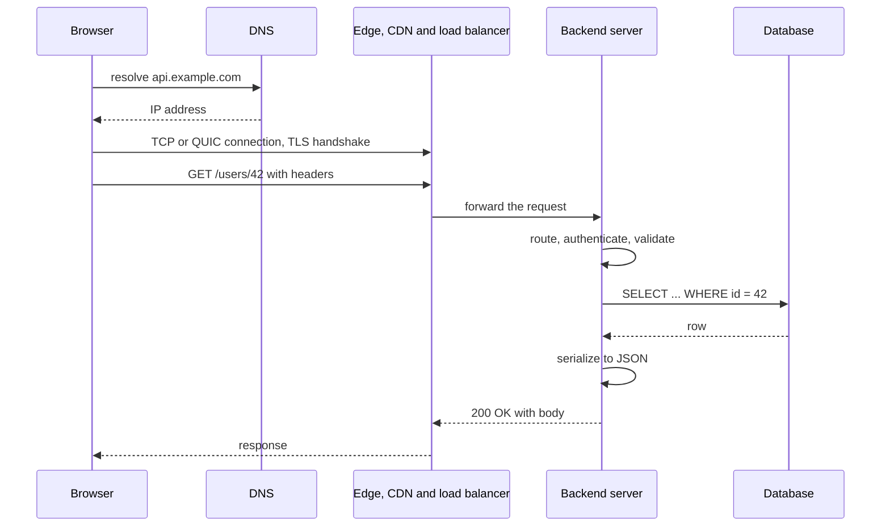
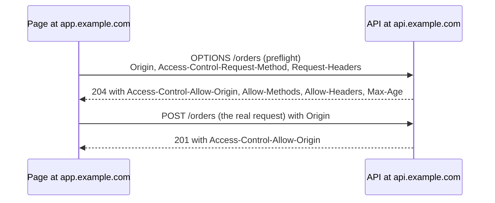
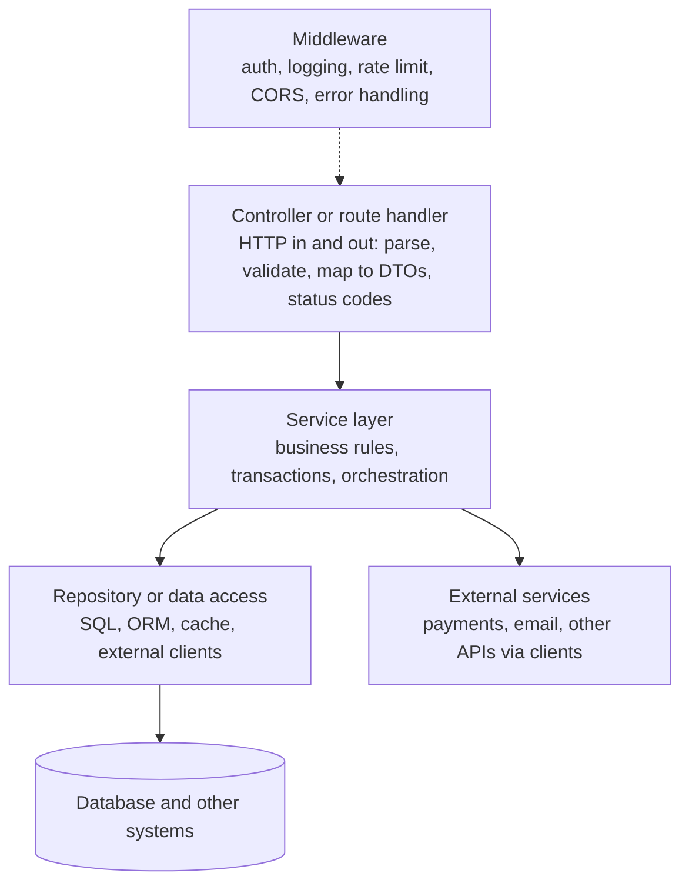

# 📘 Backend Fundamentals

A backend is the part of a product that runs on servers: it receives requests, applies rules, talks to databases and other services, and returns responses.
This page builds the mental model that every framework sits on: how a request travels, what HTTP means, how to structure code, how to configure it, and how it handles many requests at once.
The runnable example uses only Node.js built-in modules, so you can see the mechanics without a framework.

## Table of Contents

1. [The Life of a Request](#1-the-life-of-a-request)
2. [HTTP Essentials](#2-http-essentials)
3. [Cookies and CORS](#3-cookies-and-cors)
4. [A Server From Scratch](#4-a-server-from-scratch)
5. [Application Structure](#5-application-structure)
6. [Configuration and the Twelve-Factor App](#6-configuration-and-the-twelve-factor-app)
7. [Data Access](#7-data-access)
8. [Validation and Errors](#8-validation-and-errors)
9. [Logging and Health Checks](#9-logging-and-health-checks)
10. [Concurrency Models](#10-concurrency-models)
11. [Beginner Questions](#11-beginner-questions)

---

## 1. The Life of a Request

What happens when a browser calls `https://api.example.com/users/42`?



| Step | What it involves |
| --- | --- |
| **DNS** | Names to addresses, cached by resolvers and the OS |
| **Connection** | TCP handshake (or QUIC for HTTP/3), then **TLS** to encrypt and authenticate the server |
| **Request** | A method, a path, headers, and optionally a body |
| **Edge** | A CDN, a load balancer and often an API gateway terminate TLS, route, rate limit, and cache |
| **Application** | Routing, authentication, validation, business logic, database calls |
| **Response** | A status code, headers and a body |
| **Reuse** | Connections stay open (keep-alive, HTTP/2 multiplexing) so the next request skips the handshakes |

More on the infrastructure side in [Building Blocks](/docs/system-design/hld/building-blocks).

---

## 2. HTTP Essentials

HTTP is a text-based request and response protocol.
A request looks like this:

```text
POST /users HTTP/1.1
Host: api.example.com
Content-Type: application/json
Authorization: Bearer eyJhbGciOi...
Accept: application/json

{"name": "Ana"}
```

and the response:

```text
HTTP/1.1 201 Created
Content-Type: application/json
Location: /users/43

{"id": 43, "name": "Ana"}
```

### 2.1 Methods

| Method | Meaning | Safe (no side effects) | Idempotent (repeat = same effect) | Body |
| --- | --- | --- | --- | --- |
| `GET` | Read a resource | Yes | Yes | No |
| `HEAD` | Like GET without the body | Yes | Yes | No |
| `POST` | Create, or run an action | No | **No** | Yes |
| `PUT` | Replace a resource entirely | No | Yes | Yes |
| `PATCH` | Partially modify | No | Not guaranteed | Yes |
| `DELETE` | Remove | No | Yes | Usually no |
| `OPTIONS` | Ask what is allowed (CORS preflight) | Yes | Yes | No |

Safe and idempotent matter because clients, proxies and load balancers **retry** requests.
A retried `POST` can create two orders unless you add an idempotency key, see [API Design](/docs/backend/api-design).

### 2.2 Status Codes

| Range | Meaning | Common codes |
| --- | --- | --- |
| **1xx** | Informational | 101 Switching Protocols (WebSocket) |
| **2xx** | Success | **200** OK, **201** Created (with `Location`), **202** Accepted (async work), **204** No Content |
| **3xx** | Redirect or cache | 301 Moved Permanently, 302 and 307 Temporary Redirect, **304** Not Modified |
| **4xx** | Client error | **400** Bad Request, **401** Unauthorized (not authenticated), **403** Forbidden (authenticated but not allowed), **404** Not Found, **405** Method Not Allowed, **409** Conflict, **412** Precondition Failed, **415** Unsupported Media Type, **422** Unprocessable Content (valid syntax, invalid data), **429** Too Many Requests |
| **5xx** | Server error | **500** Internal Server Error, **502** Bad Gateway, **503** Service Unavailable, **504** Gateway Timeout |

The distinction that matters: **4xx means the caller should change the request, 5xx means the server failed** and a retry might work.
Clients and monitoring treat them differently, so do not return 200 with an error inside, and do not return 500 for bad input.

### 2.3 Headers That Matter

| Header | Direction | Purpose |
| --- | --- | --- |
| `Content-Type` | Both | Format of the body (`application/json`, `multipart/form-data`) |
| `Accept` | Request | Formats the client can handle (content negotiation) |
| `Authorization` | Request | Credentials: `Bearer <token>`, `Basic ...` |
| `Cache-Control` | Both | Caching rules: `max-age`, `no-store`, `private`, `public`, `s-maxage` |
| `ETag`, `If-None-Match` | Response, request | Validators for conditional requests, a match returns **304** with no body |
| `Location` | Response | URL of a created resource or redirect target |
| `Set-Cookie`, `Cookie` | Response, request | Cookies |
| `Retry-After` | Response | When to retry after 429 or 503 |
| `X-Request-Id` or `traceparent` | Both | Correlate logs and traces across services |
| `Content-Encoding` | Response | `gzip`, `br`, `zstd` compression |
| `User-Agent`, `Host`, `Origin` | Request | Who is calling, which site, which origin |

### 2.4 URLs

```text
https://api.example.com:443/v1/users/42/orders?status=paid&limit=20#section
\___/   \_____________/ \_/ \__________________/ \_______________/ \_____/
scheme      host       port        path                 query        fragment (client only)
```

- **Path** identifies the resource (`/users/42/orders`). **Query string** filters, sorts, paginates. **Body** carries the data being created or changed.
- URLs identify **nouns**. The method is the verb: `POST /orders`, not `POST /createOrder`.

### 2.5 HTTP Versions

| Version | Key points |
| --- | --- |
| **HTTP/1.1** | One request at a time per connection, plain text, keep-alive |
| **HTTP/2** | Multiplexed streams on one TCP connection, header compression, server push (rarely used) |
| **HTTP/3** | Runs over QUIC on UDP, no TCP head-of-line blocking, faster connection setup and migration, supported by major CDNs and browsers |

---

## 3. Cookies and CORS

### 3.1 Cookies

A cookie is a small value the server asks the browser to store and send back on every request to that site.
It is the usual carrier of a **session id**.

```text
Set-Cookie: sid=abc123; HttpOnly; Secure; SameSite=Lax; Path=/; Max-Age=3600
```

| Attribute | Effect |
| --- | --- |
| `HttpOnly` | JavaScript cannot read it, which limits theft through XSS |
| `Secure` | Sent only over HTTPS |
| `SameSite=Lax/Strict/None` | Controls cross-site sending, the main defense against CSRF. `Lax` is the modern default |
| `Domain`, `Path` | Scope of the cookie |
| `Max-Age` / `Expires` | Lifetime, absent means a session cookie |
| `__Host-` prefix | Enforces `Secure`, `Path=/` and no `Domain`, hardening the cookie |

Details of sessions vs tokens in [Authentication and Security](/docs/backend/authentication-and-security).

### 3.2 CORS

Browsers enforce the **same-origin policy**: a page from `https://app.example.com` cannot read responses from `https://api.example.com` unless the API opts in.
An **origin** is scheme, host and port.

**Cross-Origin Resource Sharing (CORS)** is that opt-in, done with headers.



- A **preflight** `OPTIONS` request is sent first for "non-simple" requests (methods other than GET, HEAD, POST, custom headers such as `Authorization`, JSON content type).
- The server answers with `Access-Control-Allow-Origin`, `-Methods`, `-Headers`, and optionally `-Credentials` and `-Max-Age` (to cache the preflight).
- With credentials (cookies), `Allow-Origin` must be one **specific** origin, not `*`.
- **CORS is a browser rule, not server security.** `curl` and other servers ignore it. It only stops other websites' scripts from reading responses in a user's browser.
- Common mistake: reflecting any `Origin` back with credentials allowed, which defeats the protection. Use an allowlist.

---

## 4. A Server From Scratch

Frameworks hide this, so build a tiny one with only Node's built-in `http` module: routing, JSON parsing, status codes, headers and error handling.
The server starts on a free port, calls itself with `fetch`, and shuts down.

```js
// runnable
const http = require('node:http');

const users = new Map([[1, { id: 1, name: 'Ana' }]]);
let nextId = 2;

function send(res, status, body, headers = {}) {
  const payload = body === undefined ? '' : JSON.stringify(body);
  res.writeHead(status, {
    'Content-Type': 'application/json',
    'Content-Length': Buffer.byteLength(payload),
    ...headers,
  });
  res.end(payload);
}

async function readJson(req) {
  let raw = '';
  for await (const chunk of req) raw += chunk;         // the body arrives as a stream of chunks
  if (!raw) return {};
  try { return JSON.parse(raw); }
  catch { throw Object.assign(new Error('invalid JSON'), { status: 400 }); }
}

const server = http.createServer(async (req, res) => {
  const url = new URL(req.url, 'http://localhost');
  try {
    if (req.method === 'GET' && url.pathname === '/healthz') return send(res, 200, { status: 'ok' });
    if (req.method === 'GET' && url.pathname === '/users') return send(res, 200, [...users.values()]);

    const match = url.pathname.match(/^\/users\/(\d+)$/);
    if (match && req.method === 'GET') {
      const user = users.get(Number(match[1]));
      return user ? send(res, 200, user) : send(res, 404, { error: 'user not found' });
    }
    if (req.method === 'POST' && url.pathname === '/users') {
      const body = await readJson(req);
      if (typeof body.name !== 'string' || !body.name.trim()) return send(res, 422, { error: 'name is required' });
      const user = { id: nextId++, name: body.name.trim() };
      users.set(user.id, user);
      return send(res, 201, user, { Location: `/users/${user.id}` });
    }
    return send(res, 404, { error: 'no such route' });
  } catch (e) {
    // client mistakes carry a status, anything else is a 500 and must not leak internals
    return send(res, e.status || 500, { error: e.status ? e.message : 'internal error' });
  }
});

server.listen(0, async () => {
  const base = `http://127.0.0.1:${server.address().port}`;
  const call = async (label, path, init) => {
    const r = await fetch(base + path, init);
    console.log(label.padEnd(24), r.status, (r.headers.get('location') || '').padEnd(9), await r.text());
  };
  await call('GET /users/1', '/users/1');
  await call('GET /users/99', '/users/99');
  await call('POST /users (valid)', '/users', { method: 'POST', headers: { 'Content-Type': 'application/json' }, body: '{"name":" Ben "}' });
  await call('POST /users (no name)', '/users', { method: 'POST', headers: { 'Content-Type': 'application/json' }, body: '{}' });
  await call('POST /users (bad JSON)', '/users', { method: 'POST', body: '{oops' });
  await call('GET /nope', '/nope');
  await call('GET /users', '/users');
  server.close();
});
```

What to notice:

- **Routing** is just matching method and path. Frameworks add parameters, middleware and ergonomics.
- The **body is a stream**, read chunk by chunk, so large uploads do not have to sit in memory.
- **`201` plus `Location`** on create, **`404`** for a missing resource, **`422`** for a well-formed request with invalid data, **`400`** for malformed JSON, **`500`** with a generic message for bugs.
- A single `try/catch` at the top is the seed of a **central error handler**.

---

## 5. Application Structure

Split code by responsibility so each layer can change and be tested independently.



| Layer | Responsibility | Should not |
| --- | --- | --- |
| **Controller** | Translate HTTP to a method call and back. Validate input shape. Choose status codes | Contain business rules or SQL |
| **Service** | Business rules, transaction boundaries, coordinate repositories and clients | Know about HTTP (`req`, `res`) |
| **Repository** | Persist and load data behind an interface | Contain business decisions |
| **DTO (data transfer object)** | The shape of data crossing the API boundary | Expose database entities directly (leaks columns, breaks on schema change) |
| **Middleware** | Cross-cutting concerns applied to many routes | Contain route-specific logic |

A typical folder layout, organized by feature:

```text
src/
  users/
    users.controller.ts     routes and HTTP mapping
    users.service.ts        business logic
    users.repository.ts     data access
    users.dto.ts            request and response shapes, validation schemas
    users.test.ts
  orders/ ...
  common/
    errors.ts  logger.ts  auth.middleware.ts  config.ts
  main.ts                   composition root: wire dependencies, start the server
```

Organize **by feature** (a folder per domain area) rather than by type (all controllers together), so related code changes together.
Pass dependencies in (constructor injection), and wire them once in the **composition root**, see [Architecture and Testing](/docs/backend/architecture-and-testing).

---

## 6. Configuration and the Twelve-Factor App

The **twelve-factor app** is a set of practices for building services that deploy cleanly to cloud platforms.

| Factor | Practice |
| --- | --- |
| **Codebase** | One repository per app, many deploys from it |
| **Dependencies** | Declare explicitly (`package.json`, `pom.xml`) with a lockfile, never rely on system packages |
| **Config** | Store config in the **environment**, not in code |
| **Backing services** | Treat databases, queues, caches as attached resources reached by URL |
| **Build, release, run** | Strictly separate: build an artifact once, combine with config, run |
| **Processes** | Stateless, share nothing, keep state in a database or cache |
| **Port binding** | Export the service by listening on a port |
| **Concurrency** | Scale out by running more processes |
| **Disposability** | Fast startup and **graceful shutdown**, robust to sudden death |
| **Dev and prod parity** | Keep environments similar |
| **Logs** | Write to stdout as an event stream, the platform collects them |
| **Admin processes** | Run one-off tasks (migrations) as separate processes |

Configuration guidance:

- **Environment variables** for anything that differs by environment: database URL, API keys, feature flags, log level. Validate them **at startup** and fail fast if missing.
- **Never commit secrets.** Use a secret manager and inject at runtime, see [Deployment](/docs/backend/deployment-and-runtime).
- **Build once, deploy many:** the same artifact runs in staging and production, only the environment differs.
- Precedence is usually defaults, then config file, then environment, then command-line flags.
- Node.js 20.6+ can load a `.env` file with `node --env-file=.env app.js`. Spring Boot uses `application.yml` with profiles and env overrides.

---

## 7. Data Access

| Approach | Examples | Trade-offs |
| --- | --- | --- |
| **Raw driver and SQL** | `pg`, `mysql2`, JDBC | Full control and performance, you write mapping code |
| **Query builder** | Knex, jOOQ, Kysely | Composable and type-safe SQL, close to the database |
| **ORM** | Prisma, TypeORM, Drizzle (Node), Hibernate and JPA, Spring Data (Java), SQLAlchemy, Django ORM | Productivity and mapping, risk of N+1 queries, hidden SQL, leaky abstractions |

Rules that apply to all of them:

- **Always use parameterized queries** (`WHERE id = $1`), never string concatenation, see [Security](/docs/backend/authentication-and-security).
- **Use a connection pool** and size it sensibly, see [Databases: connection pooling](/docs/databases/replication-sharding-and-operations).
- **Keep transactions short** and inside the service layer, and do not call external services while holding one.
- **Watch the SQL your ORM generates** (enable query logging in development), and eager load to avoid N+1.
- **Migrations** as versioned files applied in CI or at deploy, with backward-compatible steps, see [Databases: migrations](/docs/databases/replication-sharding-and-operations).
- **Set timeouts** on queries and acquisition of connections.
- **Return DTOs**, not entities, and select only needed columns.

---

## 8. Validation and Errors

### 8.1 Validate at the Boundary

Never trust input: clients, other services and even your own frontend can send anything.

- Validate **shape** (types, required fields), **format** (email, UUID), **ranges and lengths**, and **business rules** (start before end).
- Use a schema library: **Zod**, **Joi**, **Ajv** (JSON Schema) in Node, **Bean Validation** (`@NotBlank`, `@Size`, `@Valid`) in Java.
- **Allowlist** fields when binding request bodies to objects, so a caller cannot set `isAdmin: true` (mass assignment).
- Reject early with a clear, machine-readable message.
- Also validate **on the way out** when serializing, so you never leak internal fields.

### 8.2 Error Handling

| Kind | Example | Response | Log level |
| --- | --- | --- | --- |
| **Validation** | Missing name | 400 or 422 with field errors | debug or info |
| **Authentication** | Bad token | 401 | info |
| **Authorization** | Not your resource | 403 (or 404 to hide existence) | warn |
| **Not found, conflict** | Unknown id, duplicate email | 404, 409 | info |
| **Dependency failure** | Database or payment provider down | 502, 503 or 504, retry later | error |
| **Bug** | Null pointer | 500 with a generic body and an error id | error with stack trace |

Principles:

- One **central error handler** maps exceptions to responses, so controllers stay clean.
- **Never leak** stack traces, SQL or internal hostnames to clients. Log details server-side with a **correlation id**, and return the id.
- Use a consistent error body. The standard is **Problem Details for HTTP APIs (RFC 9457)**: `type`, `title`, `status`, `detail`, `instance`, see [API Design](/docs/backend/api-design).
- Distinguish **expected** errors (client mistakes, business rule violations) from **unexpected** ones (bugs, outages).
- Do not swallow exceptions. Either handle them meaningfully or let them propagate to the central handler.

---

## 9. Logging and Health Checks

**Logging**

- Write **structured logs** (JSON) to stdout: timestamp, level, message, request id, user id, route, duration, and error fields.
- Use levels consistently: `error` for failures needing action, `warn` for suspicious, `info` for business events, `debug` for diagnostics (off in production).
- Add a **correlation id** per request (accept `X-Request-Id` or generate one) and include it in every log line and outgoing call.
- **Do not log secrets or personal data** (passwords, tokens, card numbers). Redact.
- Use a real logger (pino, Winston in Node, SLF4J with Logback in Java), not `console.log` in production code.

**Health endpoints**

| Endpoint | Meaning | Used by |
| --- | --- | --- |
| **Liveness** (`/healthz`) | The process is alive and not stuck. If it fails, restart it | Kubernetes liveness probe |
| **Readiness** (`/readyz`) | Ready to serve traffic: dependencies reachable, warmed up. If it fails, stop routing to it | Load balancers, Kubernetes readiness probe |

Keep liveness **shallow** (do not check the database, or a database outage restarts every instance in a loop).
Make readiness reflect whether **this instance** can serve.
More in [Deployment and Runtime](/docs/backend/deployment-and-runtime) and the observability notes in [Reliability and Operations](/docs/system-design/hld/reliability-and-operations).

---

## 10. Concurrency Models

How does one server handle thousands of simultaneous requests?

| Model | How | Examples | Strengths | Watch out |
| --- | --- | --- | --- | --- |
| **Thread per request** | A pool of OS threads, each handles one request at a time | Traditional Java servlet containers (Tomcat), Rails with Puma, Django | Simple blocking code | Threads are heavy (memory, context switches), the pool size caps concurrency |
| **Event loop, async I/O** | One thread runs callbacks and awaits I/O without blocking | Node.js, Python asyncio, Nginx | Handles many idle connections cheaply | CPU-heavy work blocks everyone, need discipline |
| **Virtual threads** | Cheap user-space threads, blocking style code, the runtime multiplexes them on few OS threads | Java 21+ virtual threads, Go goroutines | Simple code with high concurrency | Pinning, thread-local usage, still bounded by downstream resources |
| **Actors / reactive streams** | Message passing or non-blocking pipelines | Akka, Vert.x, Spring WebFlux, Reactor | High throughput | Steeper learning curve, harder debugging |
| **Multi-process** | Several processes behind a balancer | Node cluster, Gunicorn workers, PM2 | Uses all cores, isolation | Shared state must live outside |

The takeaway: most backend time is spent **waiting** on databases and other services.
Async I/O and virtual threads let a small number of threads serve many waiting requests, and the limit becomes the database and downstream services, not the web server.
Node.js and Java specifics are in [Node.js and Spring](/docs/backend/nodejs-and-spring).

---

## 11. Beginner Questions

**Q1. What is the difference between GET and POST?**
`GET` reads data, is safe and idempotent, and can be cached, so parameters go in the URL.
`POST` sends data in the body to create or trigger something, is not idempotent, and is generally not cached.

**Q2. What does idempotent mean, and which methods are?**
Repeating the request has the same effect as doing it once.
`GET`, `PUT`, `DELETE` (and `HEAD`, `OPTIONS`) are idempotent, `POST` is not.

**Q3. 401 vs 403?**
401 means the caller is not authenticated (missing or invalid credentials).
403 means authenticated but not permitted.

**Q4. 400 vs 422?**
400 for a malformed request (bad JSON syntax).
422 for a well-formed request whose data fails validation.
Many APIs use 400 for both, be consistent.

**Q5. What is CORS and why does it exist?**
A browser mechanism that lets a server declare which other origins may read its responses, relaxing the same-origin policy.
It protects users from other sites reading their authenticated responses, and it is not a server-side security control.

**Q6. Cookie vs token authentication, briefly?**
A cookie holds a session id the browser sends automatically, so protect against CSRF.
A token (JWT) is sent explicitly in the `Authorization` header, so it is not sent automatically but needs safe storage.
Details in [Authentication and Security](/docs/backend/authentication-and-security).

**Q7. Why layer controller, service and repository?**
Separation of concerns: HTTP handling, business rules and persistence change for different reasons, and layering makes each testable and replaceable.

**Q8. What is the twelve-factor principle for configuration?**
Store config in the environment, not in code, so the same build runs in every environment and secrets stay out of the repository.

**Q9. Liveness vs readiness?**
Liveness asks "should I restart this process?", readiness asks "should I send it traffic now?".

**Q10. Why do many servers use an event loop or async I/O?**
Requests mostly wait on I/O, and non-blocking I/O lets one thread manage thousands of waiting connections without a thread each.

Next: [Node.js and Spring Boot](/docs/backend/nodejs-and-spring).
