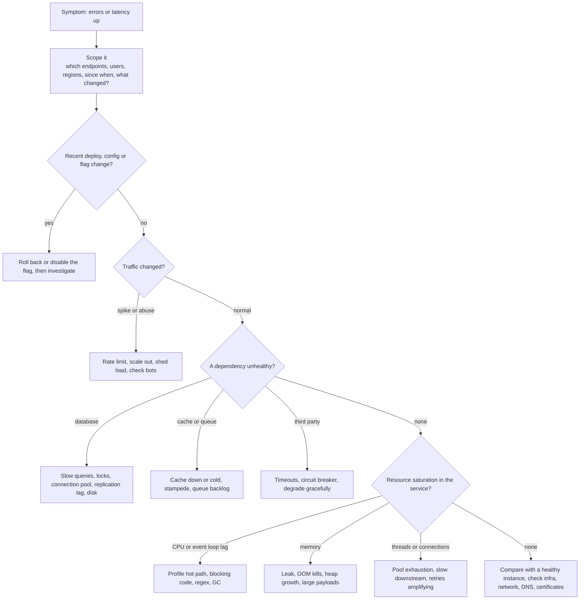

# 📘 Backend Interview Playbook

The other pages teach the material.
This page is for rehearsal: what interviewers look for, a bank of questions with what a strong answer covers, a full API design walk-through, coding tasks you can practice with the runnable examples, and a way to debug production problems out loud.

## Table of Contents

1. [What Interviewers Look For](#1-what-interviewers-look-for)
2. [Question Bank](#2-question-bank)
3. [Worked Exercise: Design a Booking API](#3-worked-exercise-design-a-booking-api)
4. [Coding Round Tasks](#4-coding-round-tasks)
5. [Debugging Production Out Loud](#5-debugging-production-out-loud)
6. [Cheat Sheets](#6-cheat-sheets)
7. [Common Mistakes](#7-common-mistakes)
8. [Study Plans](#8-study-plans)

---

## 1. What Interviewers Look For

| Level | Expected |
| --- | --- |
| **Junior** | HTTP and REST basics, status codes, CRUD with validation, SQL basics, error handling, can read and write clean code and tests |
| **Mid** | Sound API and schema design, authentication flows and common vulnerabilities, N+1 and caching, async jobs and idempotency, debugging with logs and plans, framework internals (event loop, DI, transactions) |
| **Senior** | Trade-offs and failure modes: consistency, retries, backpressure, security architecture, observability, deployment safety, performance analysis, mentoring through design |
| **Staff** | Cross-service design, migration and rollout strategy, reliability and cost, technical direction, translating business risk into engineering decisions |

Signals that raise your rating: you clarify requirements, you name the failure mode of each choice (what if the request is retried, the dependency is slow, two users click at once), you protect data (validation, authorization, least privilege), and you can debug systematically.

---

## 2. Question Bank

Sixty questions, with a checklist of what a strong answer includes.

### 2.1 HTTP, Web and Fundamentals (12)

| # | Question | Strong answer includes | Read |
| --- | --- | --- | --- |
| 1 | What happens when you type a URL and press enter? | DNS, TCP or QUIC, TLS, HTTP request, server processing, response, keep-alive | [Fundamentals](/docs/backend/backend-fundamentals) |
| 2 | GET vs POST vs PUT vs PATCH vs DELETE | Safe and idempotent, body, typical use, retries | [Fundamentals](/docs/backend/backend-fundamentals) |
| 3 | Explain common status codes and 401 vs 403, 400 vs 422 | Ranges, meaning, client vs server error | [Fundamentals](/docs/backend/backend-fundamentals) |
| 4 | What is idempotency and why does it matter? | Retries, examples, idempotency keys | [API Design](/docs/backend/api-design) |
| 5 | What are cookies and their security attributes? | HttpOnly, Secure, SameSite, scope, session ids | [Fundamentals](/docs/backend/backend-fundamentals) |
| 6 | What is CORS and how does preflight work? | Same-origin policy, headers, credentials, not a server security control | [Fundamentals](/docs/backend/backend-fundamentals) |
| 7 | HTTP/1.1 vs HTTP/2 vs HTTP/3 | Multiplexing, head-of-line blocking, QUIC | [Fundamentals](/docs/backend/backend-fundamentals) |
| 8 | How do you structure a backend service? | Controller, service, repository, DTOs, middleware, composition root | [Fundamentals](/docs/backend/backend-fundamentals) |
| 9 | What is the twelve-factor app? | Config in env, stateless, logs to stdout, disposability | [Fundamentals](/docs/backend/backend-fundamentals) |
| 10 | Liveness vs readiness | Restart vs remove from traffic, shallow liveness | [Deployment](/docs/backend/deployment-and-runtime) |
| 11 | How does a server handle many concurrent requests? | Thread pool, event loop, virtual threads, I/O bound vs CPU bound | [Fundamentals](/docs/backend/backend-fundamentals) |
| 12 | How do you handle errors in an API? | Central handler, no leaks, problem details, correlation id | [API Design](/docs/backend/api-design) |

### 2.2 APIs (10)

| # | Question | Strong answer includes | Read |
| --- | --- | --- | --- |
| 13 | Design REST resources for a domain | Nouns, nesting, ids, status codes, examples | [API Design](/docs/backend/api-design) |
| 14 | Offset vs cursor pagination | Deep offset cost, stable cursors, signed opaque cursor | [API Design](/docs/backend/api-design) |
| 15 | How do you version an API and deprecate safely? | Additive changes, path or header versions, Sunset header | [API Design](/docs/backend/api-design) |
| 16 | Make POST safe to retry | Idempotency key with unique constraint and stored response | [API Design](/docs/backend/api-design) |
| 17 | Prevent lost updates in REST | ETag and If-Match, 412 | [API Design](/docs/backend/api-design) |
| 18 | REST vs GraphQL vs gRPC | Fit, caching, typing, streaming, N+1 | [API Design](/docs/backend/api-design) |
| 19 | Design webhooks | Signatures, timestamps, retries, idempotent receivers, replay | [API Design](/docs/backend/api-design) |
| 20 | Expose a long-running operation | 202, status resource, polling or webhook | [API Design](/docs/backend/api-design) |
| 21 | Rate limiting design | Algorithms, 429, Retry-After, per key tiers | [Classic Designs](/docs/system-design/hld/classic-designs) |
| 22 | What belongs in an error response? | RFC 9457 fields, trace id, no internals | [API Design](/docs/backend/api-design) |

### 2.3 Authentication and Security (12)

| # | Question | Strong answer includes | Read |
| --- | --- | --- | --- |
| 23 | Authentication vs authorization | Definitions, 401 vs 403 | [Security](/docs/backend/authentication-and-security) |
| 24 | How do you store passwords? | Argon2id or scrypt or bcrypt, salt, pepper, rate limits | [Security](/docs/backend/authentication-and-security) |
| 25 | Sessions vs JWT | Revocation, storage, CSRF, scaling | [Security](/docs/backend/authentication-and-security) |
| 26 | JWT pitfalls | alg pinning, claims validation, revocation, storage | [Security](/docs/backend/authentication-and-security) |
| 27 | OAuth authorization code with PKCE | Steps, why PKCE, redirect URI, state | [Security](/docs/backend/authentication-and-security) |
| 28 | Refresh token rotation | Single use, reuse detection, revoke family | [Security](/docs/backend/authentication-and-security) |
| 29 | CSRF and defenses | SameSite, tokens, Origin, no state change on GET | [Security](/docs/backend/authentication-and-security) |
| 30 | SQL injection and prevention | Parameterization, allowlists for identifiers, least privilege | [Security](/docs/backend/authentication-and-security) |
| 31 | IDOR or BOLA | Object-level checks in queries | [Security](/docs/backend/authentication-and-security) |
| 32 | XSS and SSRF | Encoding and CSP, allowlists and metadata protection | [Security](/docs/backend/authentication-and-security) |
| 33 | OWASP Top 10:2025 highlights | Access control first, supply chain, exceptional conditions | [Security](/docs/backend/authentication-and-security) |
| 34 | How would you secure a new public API? | TLS, authn, authz, validation, rate limits, secrets, logging | [Security](/docs/backend/authentication-and-security) |

### 2.4 Node.js and Java (8)

| # | Question | Strong answer includes | Read |
| --- | --- | --- | --- |
| 35 | How does the Node.js event loop work? | Phases, microtasks, libuv pool, blocking | [Node and Spring](/docs/backend/nodejs-and-spring) |
| 36 | How do you handle CPU-bound work in Node? | Worker threads, queues, separate service | [Node and Spring](/docs/backend/nodejs-and-spring) |
| 37 | What is middleware? | Chain, next, short-circuit, ordering | [Node and Spring](/docs/backend/nodejs-and-spring) |
| 38 | Dependency injection in Spring | IoC container, constructor injection, testing | [Node and Spring](/docs/backend/nodejs-and-spring) |
| 39 | Why did my `@Transactional` not roll back? | Proxy, self-invocation, checked exceptions, visibility | [Node and Spring](/docs/backend/nodejs-and-spring) |
| 40 | JPA N+1 and fixes | Fetch join, entity graph, batch, DTOs | [Node and Spring](/docs/backend/nodejs-and-spring) |
| 41 | Spring MVC vs WebFlux vs virtual threads | Blocking vs reactive, when each | [Node and Spring](/docs/backend/nodejs-and-spring) |
| 42 | Node vs Java for a new service | Workload, team, ecosystem, operations | [Node and Spring](/docs/backend/nodejs-and-spring) |

### 2.5 Performance, Async, Architecture, Delivery (18)

| # | Question | Strong answer includes | Read |
| --- | --- | --- | --- |
| 43 | Approach a slow endpoint | Measure, trace, profile, fix the biggest, re-measure | [Performance](/docs/backend/performance-and-caching) |
| 44 | HTTP caching with ETag | Validators, 304, Cache-Control | [Performance](/docs/backend/performance-and-caching) |
| 45 | Cache stampede | Single-flight, jitter, stale-while-revalidate | [Performance](/docs/backend/performance-and-caching) |
| 46 | Cache invalidation strategies | TTL, delete on write, events, versioned keys | [Performance](/docs/backend/performance-and-caching) |
| 47 | N+1 and DataLoader | Batching per tick, caching per request | [Performance](/docs/backend/performance-and-caching) |
| 48 | Size a connection or thread pool | Little's law, small pools, backpressure | [Performance](/docs/backend/performance-and-caching) |
| 49 | Design background job processing | Queue, workers, retries, DLQ, idempotency | [Async](/docs/backend/async-processing-and-messaging) |
| 50 | The dual write problem and outbox | Atomic event with data, relay, at-least-once | [Async](/docs/backend/async-processing-and-messaging) |
| 51 | Retries: backoff, jitter, budgets | Why, formula, storms | [Async](/docs/backend/async-processing-and-messaging) |
| 52 | Run a cron job on many instances | Lock or leader, idempotent, alert on missing runs | [Async](/docs/backend/async-processing-and-messaging) |
| 53 | Queue or Kafka | Task distribution vs replayable log | [Async](/docs/backend/async-processing-and-messaging) |
| 54 | Hexagonal architecture | Ports, adapters, dependency rule, testability | [Architecture](/docs/backend/architecture-and-testing) |
| 55 | Aggregate, entity, value object | DDD tactical patterns | [Architecture](/docs/backend/architecture-and-testing) |
| 56 | Testing strategy for a service | Pyramid, fakes, Testcontainers, contract tests | [Architecture](/docs/backend/architecture-and-testing) |
| 57 | Mock vs stub vs fake | Definitions, prefer fakes | [Architecture](/docs/backend/architecture-and-testing) |
| 58 | Graceful shutdown | SIGTERM, drain, close pools, grace period | [Deployment](/docs/backend/deployment-and-runtime) |
| 59 | Zero-downtime deploy with a schema change | Rolling or canary, readiness, expand and contract | [Deployment](/docs/backend/deployment-and-runtime) |
| 60 | Secrets management | Secret manager, workload identity, rotation, no secrets in images | [Deployment](/docs/backend/deployment-and-runtime) |

---

## 3. Worked Exercise: Design a Booking API

**Prompt:** design the HTTP API for a movie ticket booking service (browse shows, hold seats, pay, get tickets).
Talk through it in this order.

### 3.1 Requirements and Resources

Clarify: public or internal API, web and mobile clients, expected traffic, payment provider, seat holds with a timeout, cancellations.

| Resource | Purpose |
| --- | --- |
| `/movies`, `/shows` | Catalog, read-heavy, cacheable |
| `/shows/{id}/seats` | Seat map with availability |
| `/holds` | Temporary reservation of seats (expires) |
| `/bookings` | Confirmed purchases |
| `/bookings/{id}/payments`, `/bookings/{id}/cancellations` | Actions modeled as sub-resources |

### 3.2 Key Endpoints

```text
GET    /v1/shows?movieId=12&date=2026-06-01&limit=20&cursor=...     list shows, cacheable, cursor pagination
GET    /v1/shows/501/seats                                          200, ETag, short max-age

POST   /v1/holds                                                     Idempotency-Key required
       { "showId": 501, "seatIds": ["A1", "A2"] }
       201 Created, Location: /v1/holds/h_9f2
       { "id": "h_9f2", "seatIds": ["A1","A2"], "expiresAt": "2026-06-01T18:05:00Z" }
       409 Conflict   (a seat is taken)   application/problem+json

POST   /v1/bookings                                                  Idempotency-Key required
       { "holdId": "h_9f2", "paymentMethodId": "pm_123" }
       201 Created, Location: /v1/bookings/b_77   or   402 / 422 payment failed   or   410 Gone   (hold expired)

GET    /v1/bookings/b_77                                             owner only, 404 for others
POST   /v1/bookings/b_77/cancellations                               202 Accepted, refund handled asynchronously
```

### 3.3 The Points That Show Depth

| Topic | What to say |
| --- | --- |
| **Double booking** | The hold is an atomic check-and-set in the database (unique constraint on confirmed seats, conditional update), see [Transactions](/docs/databases/transactions-and-concurrency) and [ticket booking](/docs/system-design/hld/large-scale-designs) |
| **Idempotency** | `Idempotency-Key` on `POST /holds` and `POST /bookings`, so a client retry after a timeout never creates two holds or charges twice |
| **Payment** | Call the provider with its own idempotency key, handle the unknown outcome (timeout) by querying status, confirm the booking via webhook or reconciliation, keep a state machine (`PENDING`, `CONFIRMED`, `FAILED`, `CANCELLED`) |
| **Hold expiry** | `expiresAt` stored and enforced at confirm time, a job releases expired holds, return **410 Gone** on a stale hold |
| **Authorization** | JWT or session, a user can only read their own bookings (`WHERE id = ? AND user_id = ?`), 404 not 403 for others, scopes for admin routes |
| **Caching** | Catalog endpoints with `Cache-Control` and CDN, the seat map with a short TTL and ETag, but the hold call is always authoritative |
| **Rate limits and abuse** | Per user and IP limits, a waiting room for hot events, bot protection |
| **Errors** | RFC 9457 problem details with stable `type` values (`seat-unavailable`, `hold-expired`) |
| **Async work** | Ticket generation and emails via queue with the outbox, see [Async](/docs/backend/async-processing-and-messaging) |
| **Observability** | Correlation id on every request, metrics for hold success rate, payment failures, expiry, and booking latency, alerts on SLO burn |
| **Evolution** | `/v1` prefix, additive changes, deprecation headers |

Close with what you would do next (webhooks for partners, pagination for bookings, multi-region).

---

## 4. Coding Round Tasks

Practice these in 30 to 45 minutes each. The runnable examples in this section are starting points.

| Task | What it tests | Reference |
| --- | --- | --- |
| Build a CRUD REST API for tasks with validation and correct status codes | HTTP, routing, error handling | [Server from scratch](/docs/backend/backend-fundamentals) |
| Add rate limiting middleware (token bucket) | Algorithms, per-key state, 429 and headers | [Rate limiter](/docs/system-design/hld/classic-designs), [LLD version](/docs/system-design/lld/machine-coding-problems-2) |
| Implement an LRU cache with TTL | Data structures, invariants | [LRU](/docs/system-design/lld/machine-coding-problems-1), [cache with single-flight](/docs/backend/performance-and-caching) |
| Implement retry with exponential backoff and jitter | Async control flow, error classification | [Retry](/docs/system-design/hld/distributed-systems) |
| Build an in-memory job queue with retries and a dead-letter list | Concurrency limits, idempotency | [Job queue](/docs/backend/async-processing-and-messaging) |
| Implement cursor pagination with a signed cursor | Keyset logic, HMAC | [Cursor demo](/docs/backend/api-design) |
| Implement idempotency keys for a payment endpoint | Storage, hashing, replay | [Idempotency demo](/docs/backend/api-design) |
| Verify a webhook signature | HMAC, constant-time compare, replay window | [Webhook demo](/docs/backend/api-design) |
| Write JWT auth middleware | Verification, claims, errors | [JWT demo](/docs/backend/authentication-and-security) |
| Implement TOTP verification | HMAC, time windows, test vectors | [TOTP demo](/docs/backend/authentication-and-security) |
| Batch requests in one tick (DataLoader) and limit concurrency | Promises, batching | [Batching demo](/docs/backend/performance-and-caching) |
| Implement graceful shutdown | Signals, draining | [Shutdown demo](/docs/backend/deployment-and-runtime) |
| Design a URL shortener API and code the core | Key generation, redirects, caching | [URL shortener](/docs/system-design/hld/classic-designs) |
| Prevent overselling with an atomic SQL update | Concurrency, SQL | [Transactions](/docs/databases/transactions-and-concurrency) |

Tips for coding rounds:

- Ask about input size, concurrency, error handling and persistence before typing.
- Get a working vertical slice first, then validate, then handle errors, then tests.
- Name things well, keep functions small, and inject the clock, ids and I/O so code is testable.
- State complexity and what would change at ten times the load.
- Write two or three tests, including a failure case, even if time is short.

---

## 5. Debugging Production Out Loud

Interviewers often give a symptom ("the API is slow", "we see intermittent 500s").
Show a structured approach: **mitigate first, then find the cause, then prevent recurrence.**



Habits to narrate:

- **Use the golden signals** (latency, traffic, errors, saturation) and RED per endpoint.
- **Follow one bad request** through logs and traces by correlation id.
- **Check what changed** first: deploys, config, flags, data, dependencies, traffic, dates (certificate expiry, quotas).
- **Form a hypothesis and test it** with a query, a metric or a repro, rather than changing many things.
- **Communicate:** status updates, impact, ETA, and a written timeline for the post-incident review.
- **Prevent recurrence:** add the missing alert, a test, a timeout, a limit or a runbook, see [Reliability and Operations](/docs/system-design/hld/reliability-and-operations).

Common root causes to mention: N+1 or missing index after a deploy, connection pool exhaustion caused by a slow dependency, retry storms, cache stampede after expiry or restart, unbounded queries or payloads, event-loop blocking, memory leaks, expired certificates or credentials, and misconfigured timeouts.

---

## 6. Cheat Sheets

### 6.1 HTTP

```text
Safe:        GET HEAD OPTIONS        Idempotent: GET HEAD PUT DELETE OPTIONS       Not idempotent: POST (PATCH depends)
2xx  200 OK  201 Created+Location  202 Accepted  204 No Content
3xx  301 302 307 308 redirects     304 Not Modified (conditional GET)
4xx  400 malformed  401 unauthenticated  403 forbidden  404 not found  405 method  409 conflict
     410 gone  412 precondition failed  415 media type  422 invalid data  429 too many requests
5xx  500 bug  502 bad gateway  503 unavailable (Retry-After)  504 gateway timeout
Caching:     Cache-Control max-age / no-cache / no-store / private / public / immutable,  ETag + If-None-Match -> 304
Cookies:     HttpOnly  Secure  SameSite=Lax  __Host- prefix
```

### 6.2 Auth and Security

```text
Passwords:   Argon2id | scrypt | bcrypt, unique salt, constant-time compare, rate limit, breached list
Sessions:    random id in HttpOnly Secure SameSite cookie, rotate on login, idle and absolute timeout, CSRF defense
JWT:         pin alg, check exp iss aud, short-lived access + rotating refresh, never sensitive data, no localStorage
OAuth:       Authorization code + PKCE for users, client credentials for services, exact redirect URIs, no implicit or password grant
MFA:         TOTP (RFC 6238), passkeys (WebAuthn) are phishing resistant, avoid SMS for high risk
AuthZ:       deny by default, check every object (BOLA), central policy, tenant isolation
Injection:   parameterize SQL, encode output, validate with allowlists, block SSRF to private ranges, no mass assignment
OWASP 2025:  A01 Broken Access Control, A02 Misconfiguration, A03 Supply Chain, A04 Crypto, A05 Injection, A06 Insecure Design,
             A07 Authentication Failures, A08 Integrity Failures, A09 Logging and Alerting, A10 Exceptional Conditions
```

### 6.3 Reliability Patterns

```text
Timeout everything | retry only idempotent calls with backoff + jitter + budget | circuit breaker | bulkhead | load shedding
Idempotency key on POST | dedupe table in consumers | outbox for DB + event | DLQ for poison messages
Graceful shutdown: SIGTERM, fail readiness, stop accepting, drain, close pools, exit
Liveness shallow, readiness reflects ability to serve, startup probe for slow boot
Expand and contract for schema changes | build once deploy many | canary with automated rollback
```

### 6.4 Performance

```text
Measure p95 p99 first | trace to the slow hop | N+1 -> join or batch | parallelize independent I/O, bound concurrency
HTTP cache + CDN | app cache with TTL jitter and single-flight | pool sized by the database | compress and paginate
Node: never block the loop, workers for CPU | JVM: heap vs container, GC, virtual threads for blocking I/O
```

---

## 7. Common Mistakes

| Mistake | Better |
| --- | --- |
| Jumping to code without clarifying | Ask about scale, clients, consistency and failure behavior |
| Ignoring retries and duplicates | Idempotency keys, dedupe, at-least-once thinking |
| Authentication without authorization | Check ownership on every object |
| Trusting client input | Validate at the boundary, allowlist fields, parameterize queries |
| Returning 200 for errors, or 500 for bad input | Correct 4xx and 5xx with a problem body |
| Leaking internals in errors | Generic message plus correlation id, details in logs |
| Blocking the event loop or the thread pool | Offload CPU work, use async I/O, bound concurrency |
| Unbounded everything (queries, payloads, retries, queues) | Limits, pagination, timeouts, backoff, bounded queues |
| Caching without invalidation or key dimensions | TTLs, versioned keys, per-user scoping, stampede protection |
| Long transactions and remote calls inside them | Short transactions, outbox for side effects |
| No timeouts on outbound calls | Timeouts and circuit breakers on every dependency |
| Secrets in code, images or logs | Secret manager, workload identity, redaction |
| Only happy-path tests | Failure, duplicate, concurrent and boundary cases |
| Debugging by guessing | Scope, follow a trace, check what changed, one hypothesis at a time |

---

## 8. Study Plans

### 8.1 Four Weeks

| Week | Learn | Practice |
| --- | --- | --- |
| **1: Foundations** | [Fundamentals](/docs/backend/backend-fundamentals), [Node and Spring](/docs/backend/nodejs-and-spring), [API Design](/docs/backend/api-design) | Build the CRUD API from scratch, add validation, errors, pagination and idempotency keys |
| **2: Security and data** | [Authentication and Security](/docs/backend/authentication-and-security), the [Databases](/docs/databases) fundamentals, SQL and indexing pages | Implement JWT middleware and password hashing, find and fix an injection and an IDOR, read query plans |
| **3: Reliability and scale** | [Performance and Caching](/docs/backend/performance-and-caching), [Async Processing](/docs/backend/async-processing-and-messaging), [Transactions](/docs/databases/transactions-and-concurrency) | Job queue with retries and outbox, cache with single-flight, oversell prevention |
| **4: Architecture and delivery** | [Architecture and Testing](/docs/backend/architecture-and-testing), [Deployment](/docs/backend/deployment-and-runtime), [System Design](/docs/system-design) | Write tests with fakes and Testcontainers, containerize, add graceful shutdown, do two mock interviews (design and debugging) |

### 8.2 Seven-Day Crash Plan

| Day | Focus |
| --- | --- |
| 1 | HTTP, status codes, REST design, idempotency, pagination |
| 2 | Auth flows: sessions, JWT, OAuth with PKCE, passwords, CSRF and CORS |
| 3 | Security: OWASP list, injection, IDOR, SSRF, secrets |
| 4 | Node event loop and Spring transactions and DI, ORM pitfalls |
| 5 | Caching, N+1, connection pools, async jobs, retries, outbox |
| 6 | Architecture, testing strategy, deployment, probes, graceful shutdown |
| 7 | Worked API design exercise, a debugging drill out loud, review the cheat sheets |

Next steps beyond this section: [System Design](/docs/system-design) for architecture-level questions, and [Databases](/docs/databases) for the data layer.
