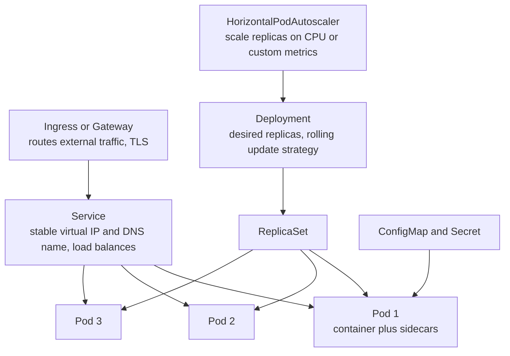
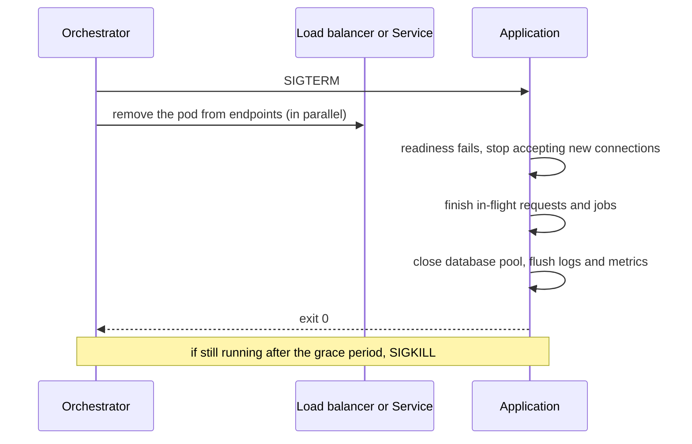

# 📘 Deployment and Runtime

Code that only runs on a laptop is not a backend.
This page covers packaging a service into a container, running it on an orchestrator, deploying safely, and the runtime behaviors (health checks, signals, graceful shutdown) that separate a service that survives deploys from one that drops requests.
A runnable demo shows graceful shutdown on `SIGTERM`.

Configuration files (Dockerfile, Kubernetes YAML, CI workflows, Terraform) are illustrative and need their own tools to run, while the shutdown demo was executed.

## Table of Contents

1. [The Path to Production](#1-the-path-to-production)
2. [Containers and Docker](#2-containers-and-docker)
3. [Local Development With Compose](#3-local-development-with-compose)
4. [Kubernetes Essentials](#4-kubernetes-essentials)
5. [Health Checks and Graceful Shutdown](#5-health-checks-and-graceful-shutdown)
6. [Configuration and Secrets](#6-configuration-and-secrets)
7. [CI/CD Pipelines](#7-cicd-pipelines)
8. [Serverless and Managed Platforms](#8-serverless-and-managed-platforms)
9. [Infrastructure as Code](#9-infrastructure-as-code)
10. [Runtime Observability and Operations](#10-runtime-observability-and-operations)
11. [Questions and Answers](#11-questions-and-answers)

---

## 1. The Path to Production

```mermaid
flowchart LR
  C["Commit"] --> B["Build and test<br/>lint, unit, integration"]
  B --> I["Build image<br/>once, immutable, tagged by commit"]
  I --> S["Scan and sign<br/>vulnerabilities, SBOM, provenance"]
  S --> R["Push to registry"]
  R --> ST["Deploy to staging<br/>smoke and end-to-end tests"]
  ST --> P["Deploy to production<br/>canary, rolling, or blue-green"]
  P --> M["Observe<br/>metrics, logs, traces, alerts"]
  M -->|"regression"| RB["Roll back to the previous image"]
```



Principles:

- **Build once, deploy many.** The same immutable artifact (a container image) moves through environments, and only configuration differs.
- **Automate everything** from commit to production, and keep the pipeline itself as code.
- **Small, frequent releases** are safer than large rare ones.
- **Every deploy is reversible:** keep the previous version, make database changes backward compatible, see [Reliability and Operations](/docs/system-design/hld/reliability-and-operations).
- **Environments should resemble production** (same OS image, same database engine and version).

---

## 2. Containers and Docker

A **container** packages an application with its dependencies and runs it in an isolated process using OS features (namespaces and cgroups), sharing the host kernel.
An **image** is the read-only template, built from a `Dockerfile` in **layers**.

### 2.1 Dockerfile for a Node.js Service

```dockerfile
# ---- build stage: full toolchain ----
FROM node:24-alpine AS build
WORKDIR /app
COPY package.json package-lock.json ./
RUN npm ci                                  # reproducible install from the lockfile
COPY . .
RUN npm run build && npm prune --omit=dev   # compile, then drop dev dependencies

# ---- runtime stage: only what is needed to run ----
FROM node:24-alpine
ENV NODE_ENV=production
WORKDIR /app
RUN addgroup -S app && adduser -S app -G app
COPY --from=build --chown=app:app /app/dist ./dist
COPY --from=build --chown=app:app /app/node_modules ./node_modules
COPY --chown=app:app package.json ./
USER app                                    # never run as root
EXPOSE 3000
HEALTHCHECK --interval=30s --timeout=3s CMD wget -qO- http://localhost:3000/healthz || exit 1
CMD ["node", "dist/main.js"]                # exec form: node is PID 1 and receives SIGTERM directly
```

### 2.2 Dockerfile for a Spring Boot Service

```dockerfile
FROM eclipse-temurin:25-jdk AS build
WORKDIR /src
COPY . .
RUN ./mvnw -q -DskipTests package
RUN java -Djarmode=tools -jar target/app.jar extract --layers --destination extracted   # split the fat jar into layers

FROM eclipse-temurin:25-jre
RUN useradd --system --uid 10001 app
WORKDIR /app
COPY --from=build /src/extracted/dependencies/ ./       # rarely changes, cached
COPY --from=build /src/extracted/application/ ./        # changes every build, small
USER app
ENV JAVA_TOOL_OPTIONS="-XX:MaxRAMPercentage=75"
EXPOSE 8080
ENTRYPOINT ["java", "-jar", "app.jar"]
```

### 2.3 Image Best Practices

| Practice | Why |
| --- | --- |
| **Multi-stage builds** | Small runtime images without compilers and build tools, fewer vulnerabilities |
| **Minimal, pinned base images** (distroless, Alpine, slim) | Smaller attack surface and faster pulls. Pin versions or digests for reproducibility. Alpine uses musl libc, which can break some native modules |
| **Layer order for cache** | Copy dependency manifests and install first, copy source later, so dependency layers are cached |
| **`.dockerignore`** | Keep `node_modules`, `.git`, secrets and build output out of the context |
| **Run as non-root**, read-only root filesystem, drop capabilities | Limits damage from a compromise |
| **Exec form `CMD ["node", ...]`** | The app gets signals directly. A shell wrapper swallows `SIGTERM` |
| **One process per container** | Simple lifecycle and scaling |
| **No secrets in the image** or build args | Layers are inspectable, inject at runtime |
| **Reproducible builds and image scanning** | Trivy, Grype, Docker Scout in CI, generate an **SBOM**, sign with cosign |
| **Tag by immutable version** (commit SHA), never rely on `latest` | Know exactly what is running, roll back precisely |
| **Set memory-aware runtime flags** | JVM `MaxRAMPercentage`, Node `--max-old-space-size`, so the runtime respects container limits |
| **PID 1 concerns** | Use `--init` (tini) if your process does not reap children |

---

## 3. Local Development With Compose

Run the service and its dependencies together, reproducibly, on a laptop or in CI.

```yaml
# compose.yaml
services:
  api:
    build: .
    ports: ["3000:3000"]
    environment:
      DATABASE_URL: postgres://app:pw@db:5432/app
      REDIS_URL: redis://cache:6379
    depends_on:
      db: { condition: service_healthy }
  db:
    image: postgres:17
    environment: { POSTGRES_USER: app, POSTGRES_PASSWORD: pw, POSTGRES_DB: app }
    healthcheck: { test: ["CMD-SHELL", "pg_isready -U app"], interval: 5s, retries: 10 }
    volumes: ["pgdata:/var/lib/postgresql/data"]
  cache:
    image: valkey/valkey:8          # or redis
volumes: { pgdata: {} }
```

`docker compose up` starts everything, and the same file can back integration tests.
Compose is for development and small deployments, not a substitute for an orchestrator in production at scale.

---

## 4. Kubernetes Essentials

**Kubernetes** runs containers across a cluster: scheduling, scaling, self-healing, rolling updates and service discovery.



| Object | Purpose |
| --- | --- |
| **Pod** | One or more containers sharing network and storage, the smallest unit. Ephemeral |
| **Deployment** | Declares the desired number of identical pods and how to roll out changes |
| **Service** | A stable address and load balancer in front of a changing set of pods (`ClusterIP`, `LoadBalancer`) |
| **Ingress / Gateway API** | HTTP routing from outside the cluster to services |
| **ConfigMap, Secret** | Configuration and sensitive values injected as environment variables or files |
| **HorizontalPodAutoscaler** | Adds and removes replicas based on metrics |
| **PodDisruptionBudget** | Limits how many pods may be down during voluntary disruptions such as node drains |
| **Job, CronJob** | Run-to-completion and scheduled tasks |
| **StatefulSet** | Stable identity and storage for databases and brokers (usually use managed services instead) |
| **Namespace, RBAC, NetworkPolicy** | Isolation, permissions, and traffic rules |

A production-minded Deployment:

```yaml
apiVersion: apps/v1
kind: Deployment
metadata: { name: orders-api }
spec:
  replicas: 3
  strategy:
    type: RollingUpdate
    rollingUpdate: { maxSurge: 1, maxUnavailable: 0 }        # never drop below full capacity during a rollout
  selector: { matchLabels: { app: orders-api } }
  template:
    metadata: { labels: { app: orders-api } }
    spec:
      terminationGracePeriodSeconds: 30                       # time to drain after SIGTERM
      containers:
        - name: api
          image: registry.example.com/orders-api:9f2c1ab      # immutable tag
          ports: [{ containerPort: 3000 }]
          envFrom: [{ configMapRef: { name: orders-config } }]
          env:
            - name: DATABASE_URL
              valueFrom: { secretKeyRef: { name: orders-secrets, key: database-url } }
          resources:
            requests: { cpu: "250m", memory: "256Mi" }        # used for scheduling
            limits: { memory: "512Mi" }                       # memory limit kills, CPU limits throttle
          startupProbe:   { httpGet: { path: /healthz, port: 3000 }, failureThreshold: 30, periodSeconds: 2 }
          readinessProbe: { httpGet: { path: /readyz,  port: 3000 }, periodSeconds: 5 }
          livenessProbe:  { httpGet: { path: /healthz, port: 3000 }, periodSeconds: 10, failureThreshold: 3 }
          lifecycle:
            preStop: { exec: { command: ["sleep", "5"] } }    # let load balancers notice before shutdown starts
```

Key points:

- **Requests and limits:** requests reserve capacity for scheduling, a memory limit **kills** a container that exceeds it (OOMKilled), a CPU limit **throttles**. Right-size from measurements, and avoid tight CPU limits on latency-sensitive services.
- **Rolling updates** replace pods gradually and use readiness to route traffic only to ready pods. `maxUnavailable: 0` keeps capacity during a rollout.
- **HPA** scales on CPU, memory, or custom metrics (requests per second, queue depth with KEDA).
- **GitOps** (Argo CD, Flux) keeps cluster state in Git and reconciles it, giving audit, review and easy rollback. **Helm** and **Kustomize** template the YAML.
- Managed Kubernetes (EKS, GKE, AKS) removes control-plane operations. For small teams, simpler platforms (Cloud Run, ECS Fargate, Fly.io, Render, App Runner) often beat running Kubernetes.

---

## 5. Health Checks and Graceful Shutdown

### 5.1 Probes

| Probe | Question | Failure action | What to check |
| --- | --- | --- | --- |
| **Startup** | Has the app finished starting? | Keep waiting, then restart | Slow initialization (JVM warm-up, migrations, cache loading) |
| **Readiness** | Can I serve traffic **now**? | Remove from the load balancer, no restart | Local ability to serve: initialized, not shutting down, critical dependency reachable |
| **Liveness** | Is the process stuck beyond recovery? | **Restart** the container | Only that the process is responsive (an internal check), **not** external dependencies |

The classic mistake: a liveness probe that calls the database.
When the database has a brief outage, every pod fails liveness and restarts at once, turning a dependency blip into a full outage.
Keep liveness shallow, and let readiness reflect dependencies (and even then, be careful about removing all pods at once).

### 5.2 Graceful Shutdown

On a deploy, scale-down or node drain, Kubernetes sends **`SIGTERM`**, waits up to `terminationGracePeriodSeconds`, then sends **`SIGKILL`** (which cannot be handled).
A service that ignores `SIGTERM` drops in-flight requests and messages.



Steps:

1. Handle `SIGTERM`, mark the instance as not ready.
2. **Stop accepting** new connections and messages (`server.close()` in Node, `server.shutdown.graceful` in Spring Boot).
3. **Finish in-flight work** within a deadline shorter than the grace period.
4. Close resources (database pool, broker connections), flush telemetry.
5. Exit. Use a **safety timer** to force exit if draining hangs.
6. Add a short `preStop` sleep so the load balancer stops routing before you close the listener, since endpoint removal is asynchronous.

The demo starts a slow request, sends `SIGTERM` to itself, and shows that new connections are refused while the in-flight request still completes:

```js
// runnable
const http = require('node:http');

let shuttingDown = false;

const server = http.createServer(async (req, res) => {
  if (req.url === '/readyz') {                                   // readiness: tell the load balancer to stop sending traffic
    res.writeHead(shuttingDown ? 503 : 200);
    return res.end(shuttingDown ? 'draining' : 'ready');
  }
  await new Promise((resolve) => setTimeout(resolve, 300));      // a slow request, still running when SIGTERM arrives
  res.end('slow request finished');
});

function shutdown(signal) {
  if (shuttingDown) return;
  shuttingDown = true;
  console.log(`${signal} received: stop accepting new connections`);
  server.close(() => console.log('all in-flight requests done, server closed (next: close the database pool, then exit 0)'));
  server.closeIdleConnections();                                 // drop idle keep-alive sockets, in-flight ones continue
  setTimeout(() => { console.log('grace period exceeded, forcing exit'); process.exit(1); }, 5000).unref();   // safety net
}
process.once('SIGTERM', () => shutdown('SIGTERM'));              // Kubernetes and Docker send SIGTERM first, SIGKILL after the grace period

server.listen(0, async () => {
  const base = `http://127.0.0.1:${server.address().port}`;
  const slow = fetch(`${base}/slow`).then((r) => r.text());      // a request is in flight
  await new Promise((resolve) => setTimeout(resolve, 50));

  process.kill(process.pid, 'SIGTERM');                          // the orchestrator asks us to stop
  await new Promise((resolve) => setTimeout(resolve, 20));

  const late = await fetch(`${base}/readyz`).then((r) => `status ${r.status}`, (e) => 'connection refused');
  console.log('a new request during shutdown:', late);
  console.log('the in-flight request:', await slow);
});
```

For Spring Boot set `server.shutdown=graceful` and `spring.lifecycle.timeout-per-shutdown-phase=25s`.
Queue workers should stop pulling messages and finish their current job, see [Async Processing](/docs/backend/async-processing-and-messaging).
Also handle **crash safety**: the process can die without any signal (OOM kill, node failure), so jobs and requests must still be safe to retry.

---

## 6. Configuration and Secrets

| Kind | Where it lives | Examples |
| --- | --- | --- |
| **Build-time constants** | In the image | Framework versions |
| **Environment config** | Environment variables, ConfigMaps | Database host, feature flags, log level, timeouts |
| **Secrets** | A secret manager, injected at runtime | Database passwords, API keys, signing keys |
| **Dynamic config and flags** | A flag service (LaunchDarkly, Unleash, OpenFeature) | Gradual rollouts, kill switches |

Guidance:

- **Twelve-factor:** configuration from the environment, validated at startup, fail fast on missing values, see [Fundamentals](/docs/backend/backend-fundamentals).
- **Secrets:** use a secret manager (HashiCorp Vault, AWS Secrets Manager, Google Secret Manager, Azure Key Vault) with the **External Secrets Operator** or a CSI driver to sync into Kubernetes. Kubernetes `Secret` objects are only base64 encoded by default, so enable encryption at rest and restrict RBAC.
- Prefer **workload identity** (IAM roles for service accounts, OIDC federation) over long-lived static keys, so there is no secret to leak.
- **Rotate** secrets without downtime by supporting two valid values during overlap.
- Never bake secrets into images, commit them, print them in logs, or pass them as build arguments.
- Keep **per-environment differences small** and explicit, and review config changes like code, since misconfiguration is a leading cause of outages.

---

## 7. CI/CD Pipelines

**Continuous integration** builds and tests every change.
**Continuous delivery** keeps the main branch always releasable, and **continuous deployment** releases automatically after checks pass.
Process background is in [SDLC](/docs/sdlc).

```yaml
# .github/workflows/ci.yaml (GitHub Actions, illustrative)
name: ci
on:
  pull_request:
  push: { branches: [main] }
permissions: { contents: read, packages: write, id-token: write }   # least privilege token
jobs:
  test:
    runs-on: ubuntu-latest
    services:
      postgres:
        image: postgres:17
        env: { POSTGRES_PASSWORD: pw }
        options: --health-cmd pg_isready --health-interval 5s --health-retries 10
        ports: ["5432:5432"]
    steps:
      - uses: actions/checkout@v4          # pin third-party actions to a commit SHA in real pipelines
      - uses: actions/setup-node@v4
        with: { node-version: 24, cache: npm }
      - run: npm ci
      - run: npm run lint && npm run typecheck
      - run: npm test
        env: { DATABASE_URL: postgres://postgres:pw@localhost:5432/postgres }
  image:
    needs: test
    if: github.ref == 'refs/heads/main'
    runs-on: ubuntu-latest
    steps:
      - uses: actions/checkout@v4
      - uses: docker/build-push-action@v6
        with: { push: true, tags: "ghcr.io/example/orders-api:${{ github.sha }}", provenance: true, sbom: true }
      - run: trivy image ghcr.io/example/orders-api:${{ github.sha }} --exit-code 1 --severity HIGH,CRITICAL
```

Pipeline design:

- **Fast feedback first:** lint and unit tests in minutes, slower suites in parallel, cache dependencies.
- **Trunk-based development** with short-lived branches, feature flags for unfinished work, and required reviews and checks on the main branch.
- **Promote the same artifact** through environments, with approvals for production if needed.
- **Security in the pipeline:** dependency and image scanning, secret scanning, SBOM, signed images and provenance (SLSA, Sigstore), least-privilege tokens, and restricted secrets for pull requests from forks. See supply chain in [Security](/docs/backend/authentication-and-security).
- **Deploy strategies:** rolling, blue-green, canary with automatic analysis, and rollback on SLO regression, see [Deployment Strategies](/docs/system-design/hld/reliability-and-operations).
- **Database migrations** as a separate, backward-compatible step before the code that needs them, see [Databases: migrations](/docs/databases/replication-sharding-and-operations).
- **DORA metrics** measure delivery health: deployment frequency, lead time for changes, change failure rate, time to restore.

---

## 8. Serverless and Managed Platforms

| Model | Examples | You manage | Good for |
| --- | --- | --- | --- |
| **Functions as a service** | AWS Lambda, Google Cloud Functions, Azure Functions, Vercel and Netlify functions | Code only | Event-driven glue, spiky or low traffic APIs |
| **Serverless containers** | Google Cloud Run, AWS App Runner and Fargate, Azure Container Apps | A container image | Web services with scale to zero, no cluster to run |
| **Platform as a service** | Heroku, Render, Fly.io, Railway | App and config | Small teams shipping quickly |
| **Edge runtimes** | Cloudflare Workers, Deno Deploy, Vercel Edge | Small isolate-based code | Low-latency logic near users, with a restricted API surface |
| **Kubernetes** | EKS, GKE, AKS | Manifests, cluster add-ons | Many services, custom needs, portability |

Serverless considerations:

- **Cold starts:** the first request after idle initializes a new instance, adding latency (tens of milliseconds to seconds, worse for the JVM without native images or SnapStart-style snapshots). Mitigate with provisioned concurrency, smaller bundles, and lightweight runtimes.
- **Concurrency and limits:** each function invocation is separate, so scaling can open thousands of database connections at once. Use a **connection pooler or data API** (RDS Proxy, PgBouncer, HTTP-based drivers).
- **Statelessness and time limits:** no local state, bounded execution time and memory, so long work goes to queues or workflows.
- **Cost model:** pay per invocation and duration, cheap at low volume, potentially expensive at sustained high volume compared with always-on containers.
- **Vendor coupling** of triggers, IAM and event formats, and harder local testing.

Choose the simplest platform that meets scale and control needs.
Many teams go from a PaaS or Cloud Run to Kubernetes only when they outgrow it.

---

## 9. Infrastructure as Code

Define infrastructure (networks, databases, queues, clusters, permissions) in versioned code, reviewed and applied by pipelines, instead of clicking in a console.

| Tool | Notes |
| --- | --- |
| **Terraform / OpenTofu** | Declarative, multi-cloud, huge provider ecosystem, state file tracks resources. OpenTofu is the open-source fork |
| **Pulumi, AWS CDK** | Infrastructure in general-purpose languages (TypeScript, Python, Java) |
| **CloudFormation, Bicep** | Native to AWS and Azure |
| **Crossplane** | Manage cloud resources through Kubernetes APIs |
| **Ansible** | Configuration management of machines |

```text
# Terraform, illustrative
resource "aws_db_instance" "orders" {
  identifier          = "orders-prod"
  engine              = "postgres"
  engine_version      = "17"
  instance_class      = "db.r7g.large"
  allocated_storage   = 200
  multi_az            = true
  backup_retention_period = 14
  storage_encrypted   = true
  deletion_protection = true
}
```

Practices: **remote, locked state**, small **modules**, separate state per environment, **plan in pull requests and apply from the pipeline**, detect and correct **drift**, **policy as code** (OPA, Sentinel, Checkov) to block insecure configuration, and protect destructive changes.

---

## 10. Runtime Observability and Operations

The three signals and how a service emits them:

| Signal | Emit | Collect |
| --- | --- | --- |
| **Logs** | Structured JSON to **stdout** with a correlation id | Agent or platform (Fluent Bit, Vector) to Loki, Elasticsearch, cloud logging |
| **Metrics** | An endpoint (`/metrics` for Prometheus) or push, RED metrics per route, runtime metrics (event loop lag, heap, GC, pool usage) | Prometheus, Datadog, CloudWatch |
| **Traces** | **OpenTelemetry** SDK or agent, propagating W3C `traceparent` across HTTP calls and message headers | OTel Collector to Tempo, Jaeger, vendors |

Operational habits:

- **Dashboards per service** (RED plus saturation) and **alerts on SLO burn**, not on every symptom, see [SLOs](/docs/system-design/hld/reliability-and-operations).
- **Runbooks** linked from alerts, and a clear on-call owner.
- **Resource management:** right-size CPU and memory from data, autoscale, and watch for **OOM kills**, throttling and pool exhaustion.
- **Dependency timeouts, retries and circuit breakers** configured in the service, see [Distributed Systems](/docs/system-design/hld/distributed-systems).
- **Capacity and cost:** review utilization, use committed or spot capacity where safe, scale non-production down at night.
- **Post-incident reviews** and follow-up actions tracked to done.
- **Chaos and game days** to verify failover and graceful degradation.
- **Patching:** base images and dependencies updated regularly, with automated pull requests.

---

## 11. Questions and Answers

**Q1. What is a container and how does it differ from a VM?**
A container is an isolated process using the host kernel through namespaces and cgroups, so it starts fast and is lightweight.
A VM runs a full guest operating system on virtualized hardware, with stronger isolation and more overhead.

**Q2. Why multi-stage Docker builds?**
They keep build tools out of the final image, giving smaller, faster, more secure images.

**Q3. Liveness vs readiness probes?**
Liveness restarts a stuck process, readiness removes a pod from traffic without restarting it.
Do not check external dependencies in liveness.

**Q4. What happens when Kubernetes terminates a pod?**
It removes the pod from service endpoints and sends `SIGTERM`, the app drains in-flight work, and if it is still running after the grace period it gets `SIGKILL`.

**Q5. How do you do zero-downtime deployments?**
Rolling or blue-green or canary releases with readiness probes, graceful shutdown, backward-compatible database migrations, and automated rollback on health regressions.

**Q6. How do you manage secrets in Kubernetes?**
A secret manager synced with the External Secrets Operator or CSI driver, encryption at rest for `Secret` objects, tight RBAC, and workload identity to avoid static keys.

**Q7. Requests vs limits?**
Requests are the resources the scheduler reserves for a pod.
Limits are the ceiling: exceeding the memory limit kills the container, exceeding the CPU limit throttles it.

**Q8. Blue-green vs canary?**
Blue-green switches all traffic between two full environments for instant rollback at double the capacity.
Canary shifts a small percentage first and expands while watching metrics.

**Q9. What are cold starts and how do you reduce them?**
Latency when a serverless platform initializes a new instance.
Reduce with smaller bundles, lighter runtimes, native images or snapshots, provisioned concurrency, and avoiding heavy initialization.

**Q10. Why can serverless overwhelm a database?**
Each concurrent invocation may open its own connection, so scale-out multiplies connections.
Use a pooler or proxy.

**Q11. What is GitOps?**
The desired state of the cluster lives in Git and a controller reconciles the cluster to it, giving review, audit trails and easy rollback.

**Q12. Which pipeline checks would you require before production?**
Lint and type checks, unit and integration tests, dependency and image vulnerability scans, secret scanning, a signed image with SBOM, staging smoke tests, and a canary with automated rollback.

Next: [Backend Interview Playbook](/docs/backend/backend-interview-playbook).
