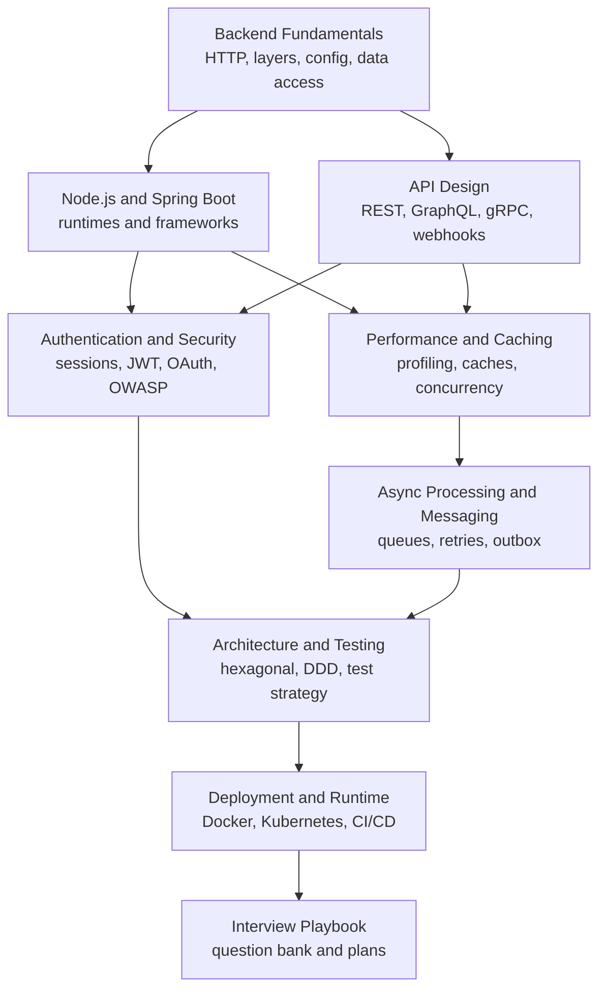

Start here for backend prep, from "what happens when a request hits the server" to "how do I make a consumer idempotent" and "why did my transaction not roll back".
The examples use Node.js and Java, the two stacks most common in interviews, and the ideas transfer to Python, Go and .NET.
Runnable snippets on these pages were executed, and facts that changed recently (Node.js 24 LTS with native TypeScript, Spring Boot 4, OWASP Top 10:2025, OAuth 2.1 and passkeys) are included where they matter.

<SectionHub
  path="backend"
  levels={{
    "backend-fundamentals": "Beginner",
    "nodejs-and-spring": "Beginner to mid",
    "api-design": "Beginner to mid",
    "authentication-and-security": "Mid to advanced",
    "performance-and-caching": "Mid to advanced",
    "async-processing-and-messaging": "Mid to advanced",
    "architecture-and-testing": "Mid to advanced",
    "deployment-and-runtime": "Mid",
    "backend-interview-playbook": "All levels"
  }}
/>

## Reading Path

## Pick Your Level

| You are | Read in this order |
| --- | --- |
| New to backend | [Fundamentals](/docs/backend/backend-fundamentals), [Node.js and Spring](/docs/backend/nodejs-and-spring), [API Design](/docs/backend/api-design) |
| Preparing for a mid-level loop | Add [Authentication and Security](/docs/backend/authentication-and-security), [Performance and Caching](/docs/backend/performance-and-caching), [Architecture and Testing](/docs/backend/architecture-and-testing) |
| Preparing for senior or staff | Add [Async Processing](/docs/backend/async-processing-and-messaging), [Deployment](/docs/backend/deployment-and-runtime), and the [System Design](/docs/system-design) section |
| One week left | The [Interview Playbook](/docs/backend/backend-interview-playbook) study plan |

## Related Sections

- [Databases](/docs/databases) covers the data layer: SQL, indexes, transactions, replication.
- [System Design](/docs/system-design) takes these building blocks to architecture scale.
- [JavaScript](/docs/javascript) and [TypeScript](/docs/typescript) for the language, [Java](/docs/java) for concurrency and the JVM.
- [SDLC](/docs/sdlc) for CI/CD and delivery process, [OOPS](/docs/oops) for design principles.
