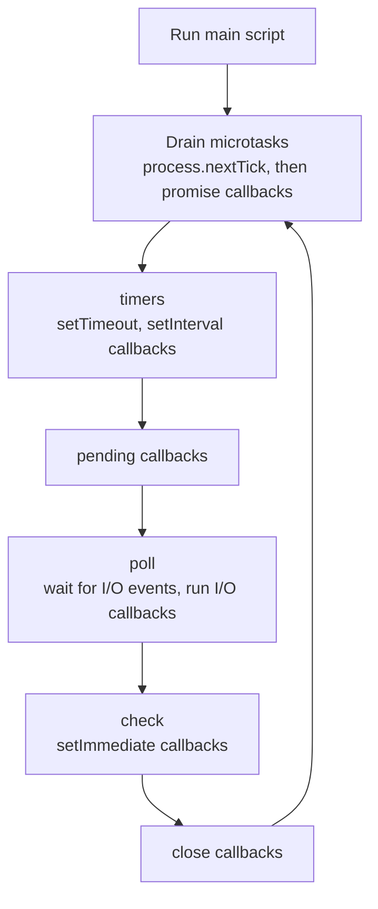
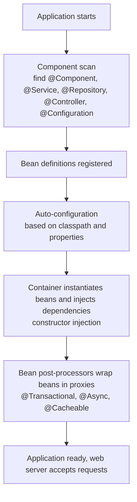

# 📘 Node.js and Spring Boot

Most backend interviews use either JavaScript on Node.js or Java with Spring Boot.
This page explains how each runtime executes your code, how the frameworks are organized, and the pitfalls that come up in questions: blocking the event loop, dependency injection, and why `@Transactional` sometimes does nothing.
Two runnable demos show the event loop and the proxy mechanism behind Spring transactions.

Snippets for Express, Fastify, NestJS and Spring are illustrative (they need their frameworks), while the demos marked as executed were run.

## Table of Contents

1. [Choosing a Stack](#1-choosing-a-stack)
2. [Node.js Runtime](#2-nodejs-runtime)
3. [Node.js Frameworks](#3-nodejs-frameworks)
4. [Spring Boot](#4-spring-boot)
5. [Spring Transactions and Proxies](#5-spring-transactions-and-proxies)
6. [Spring Data JPA Pitfalls](#6-spring-data-jpa-pitfalls)
7. [Comparing the Stacks](#7-comparing-the-stacks)
8. [Questions and Answers](#8-questions-and-answers)

---

## 1. Choosing a Stack

| | Node.js | Java with Spring Boot | Others |
| --- | --- | --- | --- |
| Language | JavaScript or TypeScript | Java (also Kotlin) | Go, Python (FastAPI, Django), C# (.NET), Rust (Axum), Ruby (Rails) |
| Concurrency | Single-threaded event loop, async I/O | Thread pool, or virtual threads (Java 21+) | Goroutines (Go), asyncio (Python), async/await (.NET, Rust) |
| Strengths | One language across the stack, huge ecosystem, fast startup, great for I/O-bound APIs and real-time | Mature ecosystem, strong typing, tooling, enterprise integration, performance on CPU-bound and long-lived services | Go: simple and fast services. Python: data and ML. .NET: enterprise on Microsoft stack |
| Watch out for | CPU-bound work blocking the loop, dependency sprawl, loose typing without TypeScript | Verbose setup, heavier memory and startup (mitigated by native images), annotation magic | |

Pick by team skills and the problem.
For an interview, be able to explain the runtime model of whichever you claim, because that is where the follow-ups go.

---

## 2. Node.js Runtime

### 2.1 Versions and Modern Features

- **Node.js 24** is the current long-term-support line (supported through April 2028), Node 22 is in maintenance, and Node 26 is the current release line as of 2026. Even-numbered releases become LTS.
- **Native TypeScript:** modern Node can run `.ts` files directly by **stripping types** (no type checking), so simple scripts and servers need no build step. You still run `tsc` for type checking. Features that need code generation (enums, parameter properties) are not supported by stripping alone.
- **Built-ins that replace packages:** `fetch`, `AbortController`, `URL`, `crypto.randomUUID()`, `structuredClone`, a **test runner** (`node --test`), `--watch`, `--env-file`, `node:sqlite`, and the **permission model** (`--permission`) to restrict file and network access.
- **ES modules** (`import`) are the standard. CommonJS (`require`) still works, and recent versions can `require()` synchronous ES modules.

### 2.2 The Event Loop

Node runs your JavaScript on **one thread**.
I/O (network, files, timers) is handed to the operating system or a small thread pool (**libuv**, default 4 threads), and callbacks are queued to run on the main thread when the work finishes.



Rules that follow:

- **Microtasks** (`process.nextTick`, resolved promises) run **between** every callback, before the loop moves on. `await` continuations are microtasks.
- Timers have a minimum delay, not an exact one.
- **Anything synchronous and slow blocks every request:** a big `JSON.parse`, a `for` loop over millions of items, a regex with catastrophic backtracking, synchronous `fs` or `crypto` calls, `bcrypt` hashing done synchronously.
- Node is great at **I/O-bound** work (waiting on databases and APIs) and needs care for **CPU-bound** work.

The demo below prints the order of events and then measures event-loop lag: the same CPU task stalls the loop on the main thread and does not in a worker thread.
Deeper coverage of the loop and promises is in [JavaScript notes](/docs/javascript).

```js
// runnable
const { Worker, isMainThread, parentPort, workerData } = require('node:worker_threads');
const fs = require('node:fs');

function fib(n) { return n < 2 ? n : fib(n - 1) + fib(n - 2); }

if (!isMainThread) {
  parentPort.postMessage(fib(workerData));
} else {
  // Part 1: the order in which the event loop runs things
  console.log('1 sync');
  process.nextTick(() => console.log('2 process.nextTick'));
  Promise.resolve().then(() => console.log('3 promise microtask'));
  fs.readFile(__filename, () => {
    setTimeout(() => console.log('5 setTimeout 0'), 0);
    setImmediate(() => console.log('4 setImmediate'));      // inside an I/O callback, immediate always runs first
  });

  // Part 2: a CPU-bound task blocks the loop, a worker thread does not
  const measureLag = (work) => new Promise((resolve) => {
    let worst = 0;
    let last = Date.now();
    const timer = setInterval(() => {                        // should fire every 10 ms if the loop is healthy
      const now = Date.now();
      worst = Math.max(worst, now - last - 10);
      last = now;
    }, 10);
    setTimeout(async () => {
      await work();
      setTimeout(() => { clearInterval(timer); resolve(worst); }, 30);
    }, 50);
  });

  const onMainThread = async () => { fib(38); };
  const inWorker = () => new Promise((resolve, reject) => {
    const w = new Worker(__filename, { workerData: 38 });
    w.once('message', resolve);
    w.once('error', reject);
  });

  setTimeout(async () => {
    const blocked = await measureLag(onMainThread);
    const offloaded = await measureLag(inWorker);
    console.log('event loop stalled 100 ms or more with CPU work on the main thread:', blocked >= 100);
    console.log('event loop stayed responsive with the work in a worker thread:', offloaded < 100);
  }, 100);
}
```

### 2.3 Scaling Node

| Technique | Use |
| --- | --- |
| **`worker_threads`** | Offload CPU-bound work (image processing, hashing, parsing) to threads, with a worker pool (Piscina) |
| **`cluster` or a process manager (PM2)** | One process per CPU core behind a shared port, uses all cores, restarts crashed workers |
| **Containers** | One process per container, scale replicas with the orchestrator (the modern default) |
| **Streams** | Process large data chunk by chunk with **backpressure**: `pipeline(readable, transform, writable)` |
| **`AsyncLocalStorage`** | Carry request context (request id, user) through async calls without passing it everywhere |
| **Memory** | The V8 heap has a default limit, raise with `--max-old-space-size`, watch for leaks (unbounded caches, listeners, closures) |

### 2.4 Error Handling and Shutdown

- **Always handle promise rejections.** An unhandled rejection can crash the process in modern Node. Use `try/catch` around `await`, and central error middleware.
- On `uncaughtException` or `unhandledRejection`, **log and exit**, and let the supervisor restart a clean process, because state may be corrupt.
- Handle `SIGTERM` for **graceful shutdown**: stop accepting requests, finish in-flight ones, close the database pool, then exit, see [Deployment and Runtime](/docs/backend/deployment-and-runtime).
- Do not run untrusted or heavy synchronous code on the main thread.

---

## 3. Node.js Frameworks

| Framework | Style | Notes |
| --- | --- | --- |
| **Express 5** | Minimal, middleware chain | Most widely known, huge ecosystem, Express 5 handles rejected promises from async handlers |
| **Fastify** | Fast, schema-based, plugin system | JSON Schema validation and serialization built in, strong TypeScript support, good default for new services |
| **NestJS** | Opinionated, Angular-style modules, decorators, DI | Familiar to Spring developers, good for large teams |
| **Hono** | Tiny, Web-standard `Request` and `Response` | Runs on Node, Bun, Deno and edge runtimes (Cloudflare Workers) |
| **Koa** | Minimal successor to Express | Async middleware |
| **Next.js route handlers, tRPC** | Full-stack integrations | Backend code colocated with a React frontend, tRPC gives end-to-end types without a REST layer |

**Middleware** is the central idea: a request flows through a chain of functions, each can act, short-circuit, or pass on.
The same pattern is in [Design Patterns: chain of responsibility](/docs/system-design/lld/design-patterns).

```ts
// Express: illustrative
import express from 'express';
import { z } from 'zod';

const app = express();
app.use(express.json());                                   // parse JSON bodies
app.use((req, res, next) => {                              // logging middleware
  const start = Date.now();
  res.on('finish', () => console.log(req.method, req.path, res.statusCode, Date.now() - start + 'ms'));
  next();
});

const CreateUser = z.object({ name: z.string().min(1), email: z.string().email() });

app.post('/users', async (req, res) => {
  const parsed = CreateUser.safeParse(req.body);           // validate at the boundary
  if (!parsed.success) return res.status(422).json({ errors: parsed.error.flatten().fieldErrors });
  const user = await userService.create(parsed.data);
  res.status(201).location(`/users/${user.id}`).json(user);
});

app.use((err, req, res, next) => {                         // central error handler
  console.error(err);
  res.status(500).json({ error: 'internal error' });
});
```

```ts
// Fastify: schema drives validation, serialization and docs
app.post('/users', {
  schema: {
    body: { type: 'object', required: ['name'], properties: { name: { type: 'string', minLength: 1 } } },
    response: { 201: { type: 'object', properties: { id: { type: 'integer' }, name: { type: 'string' } } } },
  },
}, async (request, reply) => reply.code(201).send(await users.create(request.body)));
```

Practical points: use `helmet` for security headers, `cors` with an allowlist, `pino` for logging, a validation library at every entry point, and `express-rate-limit` or a gateway for throttling.

---

## 4. Spring Boot

**Spring Boot** builds production-ready Spring applications with **auto-configuration** and **starters**, so you write little setup code.

### 4.1 Versions

- **Spring Boot 4.0** was released in November 2025 on **Spring Framework 7**, with **Jakarta EE 11** as the baseline, **Jackson 3** as the default JSON library, and Java 17 as the minimum with Java 25 (the current LTS) supported. Spring Boot 4.1 followed in June 2026.
- **Virtual threads** are supported on Java 21 and later: set `spring.threads.virtual.enabled=true` to run request handling, `@Async` and scheduled tasks on virtual threads, so blocking-style code scales to many concurrent requests.
- Spring Boot 3.x remains widely deployed (Java 17 minimum, Jakarta EE 9+ namespaces `jakarta.*`).
- **GraalVM native images** give fast startup and low memory at the cost of build time and reflection configuration.

### 4.2 Inversion of Control and Dependency Injection

Spring creates and wires objects (**beans**) for you.
You declare what a class needs, and the container supplies it.



Prefer **constructor injection** (dependencies are final, required, and easy to unit test without Spring) over field injection with `@Autowired`.

```java
// illustrative Spring Boot code
@RestController
@RequestMapping("/api/users")
class UserController {
    private final UserService users;

    UserController(UserService users) { this.users = users; }        // constructor injection

    @GetMapping("/{id}")
    UserResponse get(@PathVariable long id) { return users.find(id); }

    @PostMapping
    ResponseEntity<UserResponse> create(@Valid @RequestBody CreateUserRequest req) {
        UserResponse created = users.create(req);
        return ResponseEntity.created(URI.create("/api/users/" + created.id())).body(created);
    }
}

record CreateUserRequest(@NotBlank String name, @Email String email) { }
record UserResponse(long id, String name, String email) { }

@Service
class UserService {
    private final UserRepository repo;
    UserService(UserRepository repo) { this.repo = repo; }

    @Transactional
    UserResponse create(CreateUserRequest req) {
        User saved = repo.save(new User(req.name(), req.email()));
        return new UserResponse(saved.getId(), saved.getName(), saved.getEmail());
    }
}

interface UserRepository extends JpaRepository<User, Long> {           // Spring Data generates the implementation
    Optional<User> findByEmail(String email);                           // derived query from the method name
}

@RestControllerAdvice
class ApiErrors {
    @ExceptionHandler(NotFoundException.class)
    ProblemDetail notFound(NotFoundException e) {                        // RFC 9457 support built in
        ProblemDetail p = ProblemDetail.forStatusAndDetail(HttpStatus.NOT_FOUND, e.getMessage());
        p.setTitle("Resource not found");
        return p;
    }
}
```

### 4.3 What Spring Provides

| Area | Feature |
| --- | --- |
| **Web** | Spring MVC (servlet, thread-per-request or virtual threads) and WebFlux (reactive, non-blocking with Reactor) |
| **Request flow** | `DispatcherServlet` finds the handler by URL and method, argument resolvers bind and validate input (`@Valid`), the method runs, message converters serialize the result, `@ControllerAdvice` handles exceptions |
| **Config** | `application.yml`, **profiles** (`dev`, `prod`), environment variable overrides, type-safe `@ConfigurationProperties` |
| **Validation** | Jakarta Bean Validation annotations on DTOs |
| **Data** | Spring Data JPA, JDBC, MongoDB, Redis repositories, `JdbcClient`, Flyway or Liquibase migrations |
| **Security** | Spring Security: filters, authentication, method security, OAuth2 resource server and client |
| **Operations** | **Actuator** endpoints (`/actuator/health`, metrics, info), Micrometer metrics, OpenTelemetry tracing |
| **Caching, scheduling, async** | `@Cacheable`, `@Scheduled`, `@Async` |
| **Testing** | `@SpringBootTest`, slice tests (`@WebMvcTest`, `@DataJpaTest`), **Testcontainers** for real databases |
| **Messaging** | Kafka, RabbitMQ, JMS integrations |

---

## 5. Spring Transactions and Proxies

`@Transactional` is not magic.
Spring wraps your bean in a **proxy** that begins a transaction before the method, commits after it, and rolls back on failure.
Because the mechanism is a proxy, several surprising behaviors follow.

The demo below reproduces the mechanism with `java.lang.reflect.Proxy`, so you can see exactly what happens:

```java
// runnable
import java.lang.annotation.*;
import java.lang.reflect.*;

@Retention(RetentionPolicy.RUNTIME)
@Target(ElementType.METHOD)
@interface Transactional { }

interface OrderService {
    void placeOrder(String id);
    void placeOrderChecked(String id) throws Exception;
    void audit(String what);
}

class OrderServiceImpl implements OrderService {
    @Transactional
    public void placeOrder(String id) {
        System.out.println("    placing " + id);
        this.audit("placed " + id);                 // self-invocation: calls the target directly, NOT through the proxy
        if (id.startsWith("bad")) throw new IllegalStateException("payment failed");
    }
    @Transactional
    public void placeOrderChecked(String id) throws Exception {
        System.out.println("    placing " + id);
        throw new Exception("checked exception");
    }
    @Transactional
    public void audit(String what) { System.out.println("    audit: " + what); }
}

/** What Spring's @Transactional does: wrap the bean in a proxy that opens and closes a transaction around calls. */
class TxProxy implements InvocationHandler {
    private final Object target;
    private TxProxy(Object target) { this.target = target; }

    static <T> T wrap(T target, Class<T> iface) {
        return iface.cast(Proxy.newProxyInstance(iface.getClassLoader(), new Class<?>[] { iface }, new TxProxy(target)));
    }

    public Object invoke(Object proxy, Method m, Object[] args) throws Throwable {
        Method impl = target.getClass().getMethod(m.getName(), m.getParameterTypes());
        if (!impl.isAnnotationPresent(Transactional.class)) return m.invoke(target, args);
        System.out.println("  BEGIN    " + m.getName());
        try {
            Object result = m.invoke(target, args);
            System.out.println("  COMMIT   " + m.getName());
            return result;
        } catch (InvocationTargetException e) {
            Throwable cause = e.getCause();
            if (cause instanceof RuntimeException || cause instanceof Error)
                System.out.println("  ROLLBACK " + m.getName() + " (" + cause.getMessage() + ")");
            else
                System.out.println("  COMMIT   " + m.getName() + " despite the checked exception (" + cause.getMessage() + ")");
            throw cause;
        }
    }
}

public class Main {
    public static void main(String[] args) {
        OrderService svc = TxProxy.wrap(new OrderServiceImpl(), OrderService.class);
        System.out.println("placeOrder(A1): audit() is called inside, but only ONE transaction opens");
        svc.placeOrder("A1");
        System.out.println("placeOrder(bad-2): a RuntimeException rolls back");
        try { svc.placeOrder("bad-2"); } catch (RuntimeException expected) { }
        System.out.println("placeOrderChecked(C3): a checked exception still commits by default");
        try { svc.placeOrderChecked("C3"); } catch (Exception expected) { }
        System.out.println("audit() called directly on the proxy: it does get its own transaction");
        svc.audit("direct call");
    }
}
```

Pitfalls this exposes:

| Pitfall | Why | Fix |
| --- | --- | --- |
| **Self-invocation ignores the annotation** | `this.audit()` bypasses the proxy, so `audit`'s own settings (`REQUIRES_NEW`, `readOnly`) do not apply | Move the method to another bean and inject it, or restructure. Do not rely on annotations on internal calls |
| **Checked exceptions do not roll back by default** | Spring mirrors EJB: only `RuntimeException` and `Error` trigger rollback | `@Transactional(rollbackFor = Exception.class)`, or throw unchecked exceptions |
| **`@Transactional` on `private` or `final` methods, or non-Spring-managed objects** | Proxies cannot intercept them | Public methods on Spring beans |
| **Swallowing an exception inside the method** | The proxy sees a normal return and commits | Rethrow, or mark rollback-only |
| **Wrong layer** | Transaction on a controller keeps it open during serialization and view rendering | Put it on the service method that is the unit of work |
| **Long transactions** | Locks and connection held during remote calls | Keep external calls outside the transaction |

Propagation and isolation:

| `propagation` | Behavior |
| --- | --- |
| `REQUIRED` (default) | Join the current transaction, or start one |
| `REQUIRES_NEW` | Suspend the current one and start a new independent transaction (audit logs that must survive a rollback) |
| `SUPPORTS`, `MANDATORY`, `NOT_SUPPORTED`, `NEVER`, `NESTED` | Less common variants |

`readOnly = true` is a hint (skips dirty checking in Hibernate, may route to a replica).
`isolation` maps to database isolation levels, see [Transactions](/docs/databases/transactions-and-concurrency).
The transaction wraps a **thread-bound connection**, which is another reason not to spawn threads inside a transactional method and expect it to follow.

---

## 6. Spring Data JPA Pitfalls

JPA with Hibernate is powerful and the source of many production bugs.

| Pitfall | Symptom | Fix |
| --- | --- | --- |
| **N+1 selects** | Loading 100 orders triggers 100 extra queries for lazy `customer` | `JOIN FETCH` in the query, `@EntityGraph`, batch fetching (`hibernate.default_batch_fetch_size`), or a DTO projection |
| **`LazyInitializationException`** | Accessing a lazy association after the session closed | Fetch what you need inside the transaction, return DTOs |
| **Open Session in View** (`spring.jpa.open-in-view`, on by default) | Keeps a database connection open through the whole request and hides lazy loading in controllers | Turn it off, load data explicitly in the service |
| **Returning entities from controllers** | Leaks columns, lazy proxies, infinite recursion on bidirectional relations | Map to DTOs or records |
| **`EAGER` fetching everywhere** | Huge joins for every query | Default to `LAZY`, fetch per use case |
| **`findAll()` on big tables** | Loads everything into memory | Pagination (`Pageable`), streaming, projections |
| **`equals` and `hashCode` on entities** | Broken behavior in sets and collections | Base on a business key or the id carefully |
| **Bulk updates through entities** | Loads and updates rows one by one | JPQL or native bulk `UPDATE`, or `JdbcClient` |
| **Schema generation in production** (`ddl-auto=update`) | Uncontrolled changes | Flyway or Liquibase migrations, `ddl-auto=validate` |

Enable SQL logging in development and count queries per request in tests.
`jOOQ` and `JdbcClient` are good alternatives when you want to control SQL directly.

---

## 7. Comparing the Stacks

| Topic | Node.js | Spring Boot |
| --- | --- | --- |
| **Concurrency** | Event loop, one thread per process, scale with processes and workers | Thread pool or virtual threads per request, many cores in one JVM |
| **CPU-bound work** | Worker threads or another service | Native threads, JIT-optimized, strong |
| **Startup and memory** | Fast start, low memory | Slower start and more memory (JIT warm-up), improved by native images and CDS |
| **Type safety** | TypeScript optional, runtime types erased | Static typing, mature IDE refactoring |
| **DI and structure** | Manual or NestJS | Built-in container, conventions |
| **Ecosystem** | npm, very large, uneven quality, supply chain risk | Maven Central, mature enterprise libraries, Spring ecosystem |
| **Best fit** | I/O-bound APIs, real-time, BFFs, full-stack JavaScript teams | Large business systems, complex domains, heavy integration, long-lived services |
| **Testing** | `node --test`, Vitest, Jest, Supertest | JUnit 5, Mockito, Spring test slices, Testcontainers |
| **Observability** | OpenTelemetry SDK, pino | Micrometer, Actuator, OpenTelemetry Java agent |

Both scale horizontally as stateless services behind a load balancer.
The database, not the framework, is usually the bottleneck, see [Performance and Caching](/docs/backend/performance-and-caching).

---

## 8. Questions and Answers

**Q1. Why is Node.js good for I/O-bound but weak for CPU-bound work?**
One thread runs all JavaScript, and I/O is delegated to the OS.
Waiting costs nothing, but a CPU-heavy synchronous task blocks every other request until it finishes.

**Q2. How do you handle CPU-intensive work in Node?**
Offload to `worker_threads` (with a pool), a separate service or queue worker, or native addons, and keep the event loop free.

**Q3. Order of `process.nextTick`, promises, `setTimeout` and `setImmediate`?**
Synchronous code first, then `nextTick`, then promise microtasks, then timers or check-phase callbacks according to the loop phase.
Inside an I/O callback `setImmediate` runs before `setTimeout(…, 0)`.

**Q4. What is middleware?**
A function in a chain that receives the request and response and can modify them, end the response, or call `next()`.
Used for logging, auth, parsing, rate limiting and error handling.

**Q5. What is dependency injection and why use it?**
Supplying an object's dependencies from outside instead of creating them inside.
It decouples classes, enables swapping implementations, and makes unit tests simple.

**Q6. Why prefer constructor injection in Spring?**
Dependencies are explicit, final, and required, the object is valid after construction, and tests can create it without a container.

**Q7. Why did my `@Transactional` method not roll back?**
Common causes: a checked exception (no rollback by default), the exception was caught inside, the method was called from the same class (proxy bypassed), or the method is not public on a Spring bean.

**Q8. What is the N+1 problem in JPA and how do you fix it?**
One query loads the parents and one more per parent loads lazy children.
Use fetch joins, entity graphs, batch fetching or DTO projections.

**Q9. Spring MVC vs WebFlux?**
MVC uses blocking, thread-per-request style, simpler and fine with virtual threads.
WebFlux is non-blocking and reactive, useful for streaming and very high concurrency with reactive drivers, at the cost of complexity.

**Q10. What do virtual threads change?**
Blocking code no longer wastes an OS thread while waiting, so you can write simple synchronous code and still serve very many concurrent requests.
Downstream limits (database pool size) still apply.

**Q11. How do you run a Node app on all CPU cores?**
`cluster` or a process manager to run one process per core, or run several container replicas behind a load balancer.

**Q12. What is Actuator?**
Spring Boot's production-ready features: health, metrics, environment info and other endpoints for monitoring and management, secured and selectively exposed.

Next: [API Design](/docs/backend/api-design).
