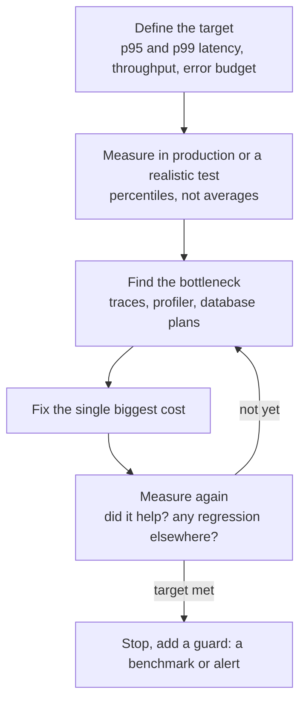

# 📘 Performance and Caching

Fast backends are built by measuring, finding the one thing that dominates, fixing it, and measuring again.
This page gives a method, the usual culprits in order of frequency, and the caching and concurrency techniques with working code.
Three demos were executed: HTTP conditional requests, a cache with stampede protection, and request batching with bounded concurrency.

## Table of Contents

1. [Measure First](#1-measure-first)
2. [Where the Time Goes](#2-where-the-time-goes)
3. [HTTP Caching](#3-http-caching)
4. [Application Caching](#4-application-caching)
5. [Batching and Concurrency](#5-batching-and-concurrency)
6. [Database Access](#6-database-access)
7. [Payloads and the Network](#7-payloads-and-the-network)
8. [Runtime Tuning](#8-runtime-tuning)
9. [Load Testing and Capacity](#9-load-testing-and-capacity)
10. [Checklist and Questions](#10-checklist-and-questions)

---

## 1. Measure First

Intuition about performance is wrong often enough that guessing wastes time.



| Signal | Why |
| --- | --- |
| **Percentiles (p50, p95, p99)** | Averages hide the slow tail that users feel, see [Fundamentals](/docs/system-design/fundamentals) |
| **Rate, Errors, Duration (RED)** per endpoint | The service-level view |
| **Utilization, Saturation, Errors (USE)** per resource | CPU, memory, disk, network, connection pools, queues |
| **Distributed traces** | Show which downstream call or query dominates one slow request |
| **Profiles** (CPU and memory flame graphs) | Show which functions burn CPU: `node --cpu-prof` or `0x` for Node, JFR and async-profiler for the JVM |
| **Event loop lag, GC pauses, thread pool queue depth** | Runtime health |

**Little's law** connects them: concurrent requests in flight = arrival rate x average latency.
If latency grows under load, in-flight requests pile up and exhaust threads, connections and memory, which is how overload spirals.

---

## 2. Where the Time Goes

In a typical API request, in rough order of how often each is the culprit:

| Culprit | Symptom | Typical fix |
| --- | --- | --- |
| **The database** | Slow or many queries, N+1, missing index, lock waits | Indexes, batching, caching, pagination, see [Databases](/docs/databases/indexing-and-query-performance) |
| **Serial remote calls** | Total latency is the sum of downstream latencies | Run independent calls in parallel, cache, batch, or move behind an aggregate endpoint |
| **Chatty clients** | Many small requests per screen | Combine endpoints, GraphQL or a BFF, HTTP/2 |
| **Large payloads** | Big JSON, over-fetching, no compression | Pagination, field selection, compression, binary formats |
| **Blocking or CPU-heavy work on the request path** | Event loop lag, thread pool starvation | Offload to workers or queues |
| **Connection setup** | New TCP and TLS per request | Keep-alive, connection pools |
| **Cold caches and cold starts** | Slow first requests after deploy | Warm-up, keep-warm, gradual traffic shift |
| **Garbage collection and memory pressure** | Latency spikes, out-of-memory kills | Reduce allocation, right-size heap, fix leaks |
| **Lock contention** | Threads waiting on shared state | Shorter critical sections, sharding state |
| **Logging and serialization overhead** | CPU in `JSON.stringify` or log formatting | Sampling, async logging, faster serializers |

The order of investigation: **traces first** (which hop is slow), then that hop's own profile or query plan.

---

## 3. HTTP Caching

The cheapest request is the one that never reaches your code.
HTTP has built-in caching that browsers, CDNs and proxies understand.

| Header | Meaning |
| --- | --- |
| `Cache-Control: max-age=N` | Fresh for N seconds, reuse without asking |
| `Cache-Control: s-maxage=N` | Like `max-age`, for shared caches (CDN) |
| `Cache-Control: no-cache` | May store, but **must revalidate** before use |
| `Cache-Control: no-store` | Do not store at all (sensitive data) |
| `Cache-Control: private` / `public` | Only the user's browser may cache / shared caches may too |
| `Cache-Control: stale-while-revalidate=N` | Serve stale while refreshing in the background |
| `Cache-Control: immutable` | Never changes, do not revalidate |
| `ETag` and `If-None-Match` | Validator: the client asks "still this version?", the server answers **304 Not Modified** with no body |
| `Last-Modified` and `If-Modified-Since` | The date-based validator |
| `Vary` | Which request headers change the response (`Accept-Encoding`, `Accept-Language`, sometimes `Authorization`) |

Typical policies:

| Resource | Policy |
| --- | --- |
| Static assets with hashed file names (`app.3f9a1c.js`) | `public, max-age=31536000, immutable` |
| HTML pages | `no-cache` (revalidate) or a short `max-age` with `stale-while-revalidate` |
| Public API data that changes slowly | `public, max-age=60, stale-while-revalidate=300` |
| Personalized or sensitive responses | `private, no-store` (or `private, max-age=0` with ETags) |

The conditional request saves bandwidth and serialization even when the data must be checked every time:

```js
// runnable
const http = require('node:http');
const crypto = require('node:crypto');

const product = { id: 1, name: 'Keyboard', priceCents: 4500 };

const server = http.createServer((req, res) => {
  const body = JSON.stringify(product);
  const etag = '"' + crypto.createHash('sha1').update(body).digest('base64url').slice(0, 16) + '"';
  const headers = { ETag: etag, 'Cache-Control': 'private, max-age=0, must-revalidate' };

  if (req.headers['if-none-match'] === etag) {            // the client already has this exact version
    res.writeHead(304, headers);
    return res.end();                                     // no body sent
  }
  res.writeHead(200, { 'Content-Type': 'application/json', ...headers });
  res.end(body);
});

server.listen(0, async () => {
  const url = `http://127.0.0.1:${server.address().port}/products/1`;

  const first = await fetch(url);
  const etag = first.headers.get('etag');
  console.log('first request:        ', first.status, 'body bytes:', (await first.text()).length, 'etag:', etag);

  const again = await fetch(url, { headers: { 'If-None-Match': etag } });
  console.log('revalidation:         ', again.status, 'body bytes:', (await again.text()).length);

  product.priceCents = 4900;                              // the resource changes
  const changed = await fetch(url, { headers: { 'If-None-Match': etag } });
  console.log('after the data changed:', changed.status, 'body bytes:', (await changed.text()).length);

  server.close();
});
```

Cautions:

- **Never cache personalized responses in a shared cache.** Use `private` or `Vary`, and be careful with `Authorization`.
- **Versioned URLs beat purging:** put a hash or version in the URL and cache forever, purge only HTML.
- A CDN in front of an API can absorb huge read traffic for public data, see [CDN](/docs/system-design/hld/building-blocks).

---

## 4. Application Caching

### 4.1 Layers

| Layer | Scope | Latency | Notes |
| --- | --- | --- | --- |
| **In-process** (a `Map`, Caffeine, `lru-cache`) | One instance | Nanoseconds | Fastest, but each instance has its own copy (staleness, memory), good for small hot data and config |
| **Distributed** (Redis, Valkey, Memcached) | All instances | Sub-millisecond to a millisecond | Shared, survives deploys, network hop, needs its own ops |
| **Database query cache, materialized views** | Database | Varies | Precompute expensive aggregates |
| **CDN and reverse proxy** | Edge | | For public content |

Pattern details (cache-aside, write-through, eviction policies, invalidation) are in [Building Blocks: caching](/docs/system-design/hld/building-blocks).

### 4.2 Design Rules

- **Cache what is read often, expensive to compute, and tolerant of staleness.** Do not cache what is cheap or changes on every request.
- **Key design:** include everything the result depends on (user, tenant, locale, parameters, version). A missing dimension serves one user's data to another.
- **TTLs on everything**, with **jitter** so entries do not expire together.
- **Invalidate on write** (delete the key) and keep a TTL as a safety net.
- **Protect against the stampede:** when a hot key expires, thousands of requests miss at once and hammer the database. Use **single-flight** (coalesce concurrent loads into one), locks, stale-while-revalidate, or refresh-ahead.
- **Cache negative results** briefly (404s), so lookups of missing keys do not hit the database every time.
- **Bound the size** (LRU eviction) and monitor **hit ratio**, evictions and memory.
- **Serialize carefully:** caching huge objects or using slow serializers can cost more than it saves.
- **Design for cache failure:** the system must still work (slower) if the cache is down, with the database protected by rate limits and circuit breakers.

The following cache combines a TTL, LRU eviction, and single-flight so that many concurrent requests for the same missing key trigger only one load:

```js
// runnable
class Cache {
  #map = new Map();            // key -> { value, expires }. Map keeps insertion order, which gives us LRU
  #inflight = new Map();       // key -> promise of a load already running (single-flight)
  stats = { hits: 0, misses: 0, loads: 0, coalesced: 0, evictions: 0 };

  constructor({ maxEntries = 100, ttlMs = 1000, now = () => Date.now() } = {}) {
    Object.assign(this, { maxEntries, ttlMs, now });
  }

  async get(key, loader) {
    const entry = this.#map.get(key);
    if (entry && entry.expires > this.now()) {
      this.#map.delete(key); this.#map.set(key, entry);      // move to the most-recently-used end
      this.stats.hits++;
      return entry.value;
    }
    if (entry) this.#map.delete(key);                        // expired
    if (this.#inflight.has(key)) {                           // someone is already loading this key: wait for them
      this.stats.coalesced++;
      return this.#inflight.get(key);
    }
    this.stats.misses++;
    const promise = (async () => {
      try {
        this.stats.loads++;
        const value = await loader();
        this.#map.set(key, { value, expires: this.now() + this.ttlMs });
        while (this.#map.size > this.maxEntries) {           // evict the least recently used
          this.#map.delete(this.#map.keys().next().value);
          this.stats.evictions++;
        }
        return value;
      } finally {
        this.#inflight.delete(key);
      }
    })();
    this.#inflight.set(key, promise);
    return promise;
  }
}

const sleep = (ms) => new Promise((r) => setTimeout(r, ms));

(async () => {
  let clock = 0;
  const cache = new Cache({ maxEntries: 2, ttlMs: 1000, now: () => clock });
  let dbCalls = 0;
  const loadFromDb = (id) => async () => { dbCalls++; await sleep(20); return { id, name: 'product ' + id }; };

  // A stampede: 100 concurrent requests for the same missing key
  await Promise.all(Array.from({ length: 100 }, () => cache.get('p:1', loadFromDb(1))));
  console.log('100 concurrent requests, database calls:', dbCalls, '| stats:', JSON.stringify(cache.stats));

  await cache.get('p:1', loadFromDb(1));
  console.log('next request is a hit, database calls:', dbCalls);

  clock += 1500;                                             // the TTL passes
  await cache.get('p:1', loadFromDb(1));
  console.log('after the TTL expired, database calls:', dbCalls);

  await cache.get('p:2', loadFromDb(2));
  await cache.get('p:3', loadFromDb(3));                     // capacity is 2, so p:1 (least recently used) is evicted
  console.log('evictions:', cache.stats.evictions);
})();
```

A production cache adds jitter to the TTL, size accounting, metrics and (for distributed caches) a lock or lease.
Libraries such as **Caffeine** (Java) and `lru-cache` (Node) already implement these ideas.

---

## 5. Batching and Concurrency

### 5.1 Parallelize Independent Work, Bound It

If a request needs data from three services, call them **at the same time**:

```ts
// slow: latencies add up (a + b + c)
const user = await getUser(id);
const orders = await getOrders(id);
const prefs = await getPrefs(id);

// fast: latency is the maximum, and one failure does not have to sink everything
const [user, orders, prefs] = await Promise.all([getUser(id), getOrders(id), getPrefs(id)]);
// use Promise.allSettled when partial results are acceptable
```

Unbounded parallelism is its own bug: firing 10,000 requests at once exhausts sockets, memory and the downstream service.
**Limit concurrency** (a semaphore or pool) and add **timeouts**.

### 5.2 The N+1 Problem and DataLoader

When code fetches a list and then one related item per row, the number of queries grows with the list.
**Batching** collects all keys requested during one tick of the event loop and issues one query for all of them.
This is the idea of Facebook's **DataLoader**, essential in GraphQL resolvers, see [API Design](/docs/backend/api-design).

```js
// runnable
class Loader {                                    // a minimal DataLoader: batches keys requested in the same tick, caches per instance
  constructor(batchFn) { this.batchFn = batchFn; this.pending = []; this.scheduled = false; this.cache = new Map(); }
  load(key) {
    if (this.cache.has(key)) return this.cache.get(key);           // duplicate key in the same request: reuse
    const promise = new Promise((resolve, reject) => this.pending.push({ key, resolve, reject }));
    this.cache.set(key, promise);
    if (!this.scheduled) {
      this.scheduled = true;
      process.nextTick(() => this.#flush());                       // wait until the current tick finishes so more keys can join
    }
    return promise;
  }
  async #flush() {
    const batch = this.pending;
    this.pending = []; this.scheduled = false;
    try {
      const values = await this.batchFn(batch.map((b) => b.key));  // ONE call for all keys, results in key order
      batch.forEach((b, i) => b.resolve(values[i]));
    } catch (e) { batch.forEach((b) => b.reject(e)); }
  }
}

/** A concurrency limiter: at most `limit` tasks run at the same time. */
function pLimit(limit) {
  let active = 0;
  const queue = [];
  const next = () => {
    if (active >= limit || queue.length === 0) return;
    active++;
    const { fn, resolve, reject } = queue.shift();
    fn().then(resolve, reject).finally(() => { active--; next(); });
  };
  return (fn) => new Promise((resolve, reject) => { queue.push({ fn, resolve, reject }); next(); });
}

const sleep = (ms) => new Promise((r) => setTimeout(r, ms));

(async () => {
  const customers = { 1: 'Ana', 2: 'Ben', 3: 'Cy' };
  const orders = [{ id: 101, customerId: 1 }, { id: 102, customerId: 2 }, { id: 103, customerId: 1 }, { id: 104, customerId: 3 }, { id: 105, customerId: 2 }];

  // N+1: one "query" per order
  let queries = 0;
  const getCustomer = async (id) => { queries++; await sleep(5); return customers[id]; };
  await Promise.all(orders.map((o) => getCustomer(o.customerId)));
  console.log('N+1 style, queries:', queries);

  // Batched: one "query" for all distinct customers, like  SELECT ... WHERE id IN (1, 2, 3)
  queries = 0; let batchedKeys = null;
  const customerLoader = new Loader(async (ids) => { queries++; batchedKeys = ids; await sleep(5); return ids.map((id) => customers[id]); });
  const names = await Promise.all(orders.map((o) => customerLoader.load(o.customerId)));
  console.log('batched, queries:', queries, '| keys sent:', batchedKeys, '| result:', names.join(','));

  // Bounded concurrency: 10 slow tasks, never more than 3 at once
  const limit = pLimit(3);
  let running = 0, peak = 0;
  await Promise.all(Array.from({ length: 10 }, () => limit(async () => {
    running++; peak = Math.max(peak, running);
    await sleep(10);
    running--;
  })));
  console.log('10 tasks with a limit of 3, peak concurrency:', peak);
})();
```

Other batching wins: bulk inserts (`INSERT ... VALUES (...), (...)`), `IN` queries instead of loops, batching writes to queues and analytics, and coalescing identical in-flight requests.

---

## 6. Database Access

The database is usually the bottleneck, so the rules are worth restating from the application side:

- **Fewer, better queries per request:** join or batch instead of loops, select only needed columns, paginate.
- **Right indexes** for the real queries (check plans), see [Indexing](/docs/databases/indexing-and-query-performance).
- **Connection pool** sized to the database, not to the number of requests. Requests wait for a connection with a timeout rather than opening more. See [pooling](/docs/databases/replication-sharding-and-operations).
- **Keep transactions short**, and do not hold one open across remote calls or user think time.
- **Prepared statements** for repeated queries (careful with transaction-level poolers).
- **Read replicas** for heavy reads, with lag-aware routing for read-your-writes.
- **Avoid ORM traps:** N+1, loading full entities for read-only lists (use projections), eager fetching everything.
- **Timeouts everywhere:** statement timeout, connection acquisition timeout, so a slow query cannot pile up requests.
- **Stream large results** with cursors instead of loading them all into memory.
- **Cache** the reads that repeat, and precompute aggregates.
- **Do heavy analytics elsewhere:** a replica or warehouse, not the primary.

---

## 7. Payloads and the Network

| Technique | Notes |
| --- | --- |
| **Compression** | `gzip` or **Brotli** for text (JSON, HTML), often 70 to 90 percent smaller. **zstd** is increasingly available. Do not compress already compressed data (images). Compress at the edge or reverse proxy, not in your Node event loop |
| **Pagination and field selection** | Return only what a screen needs, `?fields=`, sparse fieldsets, GraphQL |
| **Binary formats** | Protocol Buffers, MessagePack, Avro for internal high-volume traffic |
| **Keep-alive and HTTP/2 or 3** | Reuse connections, multiplex requests, avoid handshakes |
| **CDN for static and public content** | Offload bandwidth and latency |
| **Fewer round trips** | Aggregate endpoints, BFF, batch APIs, `Promise.all` |
| **Streaming** | Stream large responses and uploads (`pipeline`, chunked transfer) instead of buffering, keeps memory flat |
| **Avoid the N+1 of HTTP** | A screen making 40 API calls is an API design problem |
| **Timeouts and retries** | Timeouts on every outbound call, retries with backoff and jitter only for idempotent calls, see [Distributed Systems](/docs/system-design/hld/distributed-systems) |
| **Serialization cost** | `JSON.stringify` of large objects blocks the event loop, paginate or stream, consider faster serializers (Fastify uses schema-compiled serialization) |

---

## 8. Runtime Tuning

### 8.1 Node.js

- **Keep the event loop free:** no synchronous CPU work or blocking calls on the request path. Offload to `worker_threads` or a queue, see [Node.js and Spring](/docs/backend/nodejs-and-spring).
- **Monitor event loop lag** (`perf_hooks.monitorEventLoopDelay`) and alert on it.
- Use all cores with several processes or container replicas.
- **Memory:** watch heap growth, avoid unbounded caches and closures holding big objects, and set `--max-old-space-size` appropriately for the container.
- **Streams and backpressure** for large data.
- Reuse HTTP agents and database pools, avoid creating clients per request.
- Prefer **async APIs** over `*Sync` functions in servers.

### 8.2 JVM and Spring

- **Heap sizing** relative to container memory (`-XX:MaxRAMPercentage`), avoid the default guessing.
- **Garbage collector:** G1 is the default and fine for most services, **ZGC** (generational in recent JDKs) or Shenandoah for very low pause targets.
- **Thread pools:** size them for the workload and bound queues. Blocking I/O with a small pool starves the server, so use **virtual threads** (Java 21+) for I/O-bound services.
- **JIT warm-up:** first requests are slow, warm up before taking traffic (readiness probes, gradual rollout). GraalVM native images and CDS trade peak throughput for startup.
- **Profile** with JFR and async-profiler, and watch GC logs.
- Connection pool (HikariCP) size and timeouts, and Hibernate batching (`hibernate.jdbc.batch_size`).

### 8.3 General

- Avoid **logging in hot paths**, sample verbose logs.
- Avoid regexes with catastrophic backtracking, and unbounded recursion or loops on user input.
- **Limit** payload sizes, page sizes, and concurrency per client.
- Precompute and **memoize** pure expensive functions.
- Keep **dependencies lean**, startup and memory grow with them.

---

## 9. Load Testing and Capacity

| Test | Question it answers |
| --- | --- |
| **Load test** | Does it meet the SLO at expected peak traffic? |
| **Stress test** | Where does it break, and how (graceful degradation or collapse)? |
| **Spike test** | Can it absorb a sudden 10x burst, and recover? |
| **Soak test** | Are there leaks or slow degradation over hours? |
| **Capacity test** | How many instances do we need for X requests per second? |

Tools: **k6**, **Gatling**, **JMeter**, **Locust**, **autocannon** and **wrk** for quick HTTP checks, **Vegeta**.

Guidance:

- Test **realistic traffic**: a mix of endpoints, realistic payload sizes, cache-hit ratios and data volumes (an empty database lies).
- Use an **open model** (arrival rate) rather than a closed one (fixed users in a loop), because closed loops slow down when the system slows and hide overload, a mistake called **coordinated omission**.
- Watch **percentiles** and error rates, plus resource saturation, to find the **knee** where latency rises sharply.
- Test **dependencies** (database, cache, downstream services) and failure behavior with rate limits and timeouts.
- Run in a **production-like environment**, and rerun after significant changes, ideally in CI as a performance budget.
- Capacity planning: instances = peak load / (per-instance throughput at target latency), plus headroom (N+1 or N+2, 30 to 50 percent), see [Fundamentals](/docs/system-design/fundamentals).
- **Load shedding, rate limiting and circuit breakers** keep a service alive under overload, see [Distributed Systems](/docs/system-design/hld/distributed-systems).

---

## 10. Checklist and Questions

```text
Targets defined (p95, p99), measured in production, traces and profiles available
Queries per request counted, N+1 removed, indexes verified with EXPLAIN
Independent I/O parallelized, concurrency bounded, timeouts on every outbound call
HTTP caching headers set, ETags for revalidation, CDN for static and public data
App cache: keys complete, TTL with jitter, single-flight, size bounded, hit ratio monitored
Payloads paginated and compressed, keep-alive on, no chatty clients
Event loop lag or thread pool saturation monitored, heavy work offloaded
Load and soak tests in CI or before releases, capacity headroom known
```

**Q1. How do you approach a slow API endpoint?**
Measure percentiles, use a trace to find the slow hop, profile or explain that hop, fix the biggest cost (often the database or serial calls), and measure again.

**Q2. What is a cache stampede and how do you prevent it?**
Many requests miss at once when a hot key expires and all hit the database.
Use single-flight or a lock so one request reloads, TTL jitter, stale-while-revalidate, or refresh-ahead.

**Q3. Explain HTTP caching with ETags.**
The server sends a validator (`ETag`), the client sends it back in `If-None-Match`, and the server replies 304 with no body if unchanged, saving bandwidth and serialization while staying correct.

**Q4. Where can caching go wrong?**
Missing key dimensions (serving one user's data to another), stale data after writes, unbounded memory, stampedes, and a system that falls over when the cache is cold or down.

**Q5. What is the N+1 problem and how do you solve it?**
One query for a list plus one per item for related data.
Fix with joins, `IN` batches, eager loading, or DataLoader-style batching.

**Q6. How do you handle CPU-heavy work in Node?**
Move it off the event loop into worker threads, a separate service, or a queue, and keep the request handler responsive.

**Q7. Why bound concurrency?**
Unlimited parallel calls exhaust sockets, memory and downstream capacity.
A semaphore or pool keeps load predictable and protects dependencies.

**Q8. Why does average latency mislead?**
It hides the tail.
With fan-out one slow dependency slows the whole request, so p95 and p99 reflect user experience.

**Q9. How do you size a thread or connection pool?**
From Little's law and the resource behind it: pool size near the concurrency the database can actually serve, small pools with queueing beat large ones.

**Q10. What is coordinated omission in load testing?**
A closed-loop test slows down when the server slows, so it under-reports latency during stalls.
Use an open arrival-rate model and record intended send times.

**Q11. How do you speed up a read-heavy public endpoint?**
HTTP caching with a CDN, an application cache with stampede protection, database indexes and a read replica, and pagination with compressed payloads.

**Q12. What would you monitor for runtime health?**
Percentile latency, error rate, event loop lag or thread pool queue depth, GC pauses, memory, connection pool usage and saturation, and cache hit ratio.

Next: [Async Processing and Messaging](/docs/backend/async-processing-and-messaging).
