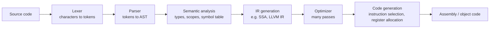
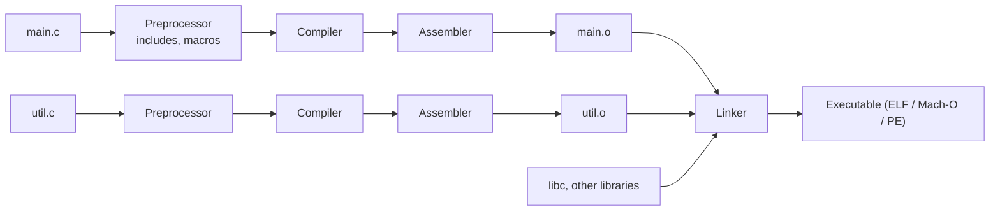

# 📘 Compilers and Program Execution

This page follows a program from source text to a running process.
It explains what compilers, linkers, loaders, virtual machines, and garbage collectors do, which helps with performance tuning, reading stack traces, and answering "what happens when you run a program" questions.

## Table of Contents

1. [Compiled, Interpreted, and JIT](#1-compiled-interpreted-and-jit)
2. [Compiler Phases](#2-compiler-phases)
3. [Common Optimizations](#3-common-optimizations)
4. [From Object Files to Executables](#4-from-object-files-to-executables)
5. [Static vs Dynamic Linking](#5-static-vs-dynamic-linking)
6. [Loading and Running](#6-loading-and-running)
7. [The Call Stack](#7-the-call-stack)
8. [Stack vs Heap](#8-stack-vs-heap)
9. [Garbage Collection](#9-garbage-collection)
10. [Virtual Machines and Runtimes](#10-virtual-machines-and-runtimes)
11. [WebAssembly](#11-webassembly)
12. [Questions](#12-questions)

---

## 1. Compiled, Interpreted, and JIT

| Approach | How | Startup | Peak speed | Examples |
| --- | --- | --- | --- | --- |
| **Ahead-of-time (AOT) compiled** | Translate to machine code before running | Fast | High, fixed at build time | C, C++, Rust, Go, Swift |
| **Interpreted** | Execute source or bytecode instruction by instruction | Fast | Low | CPython (mostly), Ruby MRI (without YJIT), shell scripts |
| **Bytecode + JIT** | Compile to portable bytecode; the VM interprets, profiles, then compiles hot code to machine code at run time | Slower (warm-up) | High, can use runtime profile | Java (HotSpot), C# (.NET), JavaScript (V8), LuaJIT, PyPy |
| **AOT for managed languages** | Compile a VM language ahead of time | Fast | Good, less adaptive | GraalVM Native Image, .NET Native AOT, Android ART |

A language is not inherently compiled or interpreted; implementations are.
Python has CPython (interpreter, with an experimental JIT since 3.13), PyPy (JIT), and Cython (compiler).

**Why JIT can beat AOT**: it sees actual runtime types and hot paths, so it can inline virtual calls, specialize on common types, and **deoptimize** back to the interpreter if assumptions break.
**Why AOT wins at startup**: no warm-up, lower memory, which matters for CLIs and serverless functions.

---

## 2. Compiler Phases



| Phase | Input to output | Example for `total = price * 2;` |
| --- | --- | --- |
| **Lexical analysis** | Characters to tokens | `IDENT(total) ASSIGN IDENT(price) STAR INT(2) SEMI` |
| **Parsing** | Tokens to a syntax tree, following the grammar | `Assign(total, Mul(price, 2))` |
| **Semantic analysis** | Checks meaning: declared names, types, scopes | `price` is `double`, so `2` is converted to `2.0` |
| **IR generation** | Language-independent intermediate form | `%t1 = fmul double %price, 2.0` |
| **Optimization** | Faster or smaller equivalent IR | `fmul x, 2.0` becomes `fadd x, x` |
| **Code generation** | Target machine instructions | `addsd xmm0, xmm0` |

The **front end** (lexing through semantic analysis) is language specific; the **back end** (optimization and code generation) is target specific.
**LLVM** made this split practical: Clang, Rust, Swift, Zig, and Julia front ends share one optimizer and many back ends.

**Static single assignment (SSA)**: every variable is assigned exactly once in the IR, which makes data flow explicit and optimizations simpler.

Parsing families: **LL** (top-down, recursive descent, what most hand-written compilers use) and **LR** (bottom-up, parser generators like yacc and bison).
Errors caught at each stage: lexical (bad character), syntax (missing semicolon), semantic (type mismatch, undefined variable).

---

## 3. Common Optimizations

| Optimization | Before | After |
| --- | --- | --- |
| **Constant folding** | `x = 60 * 60 * 24` | `x = 86400` |
| **Constant propagation** | `a = 5; b = a + 1` | `b = 6` |
| **Dead code elimination** | Code after `return`, unused results | Removed |
| **Common subexpression elimination** | `(a+b)*c + (a+b)*d` | `t = a+b; t*c + t*d` |
| **Strength reduction** | `i * 8` | `i << 3` |
| **Loop-invariant code motion** | `for (...) { y = len(s) * 2; ... }` | Hoist `y` out of the loop |
| **Inlining** | Call to a small function | Its body in place; enables further optimizations |
| **Loop unrolling** | Loop running 4 iterations | Four copies of the body, fewer branches |
| **Vectorization** | Scalar loop over arrays | SIMD instructions processing 4 to 16 elements at once |
| **Tail call optimization** | `return f(x - 1)` | A jump instead of a new stack frame |
| **Escape analysis** | Object that never leaves a function | Allocated on the stack or eliminated (JVM, Go) |
| **Devirtualization** | Virtual call with one observed target | Direct (inlinable) call |

Optimization levels: `-O0` (debuggable), `-O2` (standard release), `-O3` (aggressive), `-Os` / `-Oz` (size).
**Link-time optimization (LTO)** optimizes across files; **profile-guided optimization (PGO)** uses real run data to lay out hot code, typically worth 10 to 20 percent.

Undefined behavior in C and C++ lets compilers assume things never happen (signed overflow, null dereference), which enables optimizations but can delete checks you thought were there.

---

## 4. From Object Files to Executables



```bash
gcc -E main.c -o main.i     # preprocess only
gcc -S main.c               # compile to assembly (main.s)
gcc -c main.c               # assemble to object file (main.o)
gcc main.o util.o -o app    # link
nm main.o                   # list symbols (U = undefined, needs linking)
objdump -d app | less       # disassemble
```

An **object file** contains machine code and data in sections, plus a **symbol table** (what it defines and what it needs) and **relocations** (places to patch once final addresses are known).

The **linker**:

1. **Symbol resolution**: match every undefined symbol to exactly one definition; typical errors are "undefined reference to `foo`" (missing definition or library) and "multiple definition of `foo`".
2. **Relocation**: assign final addresses and patch references.

| Executable format | Platform |
| --- | --- |
| **ELF** | Linux, BSDs, Android |
| **Mach-O** | macOS, iOS |
| **PE / COFF** | Windows (`.exe`, `.dll`) |

Key ELF sections: `.text` (code), `.rodata` (constants), `.data` (initialized globals), `.bss` (zeroed globals), `.symtab`, `.debug_*` (DWARF debug info, removed with `strip`).

---

## 5. Static vs Dynamic Linking

| | Static linking | Dynamic linking |
| --- | --- | --- |
| Library code | Copied into the executable (`.a`, `.lib`) | Loaded at run time (`.so`, `.dylib`, `.dll`) |
| Binary size | Larger | Smaller |
| Memory | Each program has its own copy | One copy in RAM shared by all processes |
| Security updates | Rebuild every program | Update the library once |
| Deployment | Single self-contained file | "DLL hell": missing or mismatched versions |
| Startup | Slightly faster | Loader must resolve symbols (lazily via PLT/GOT) |
| Example | Go and Rust binaries by default (Go fully static with `CGO_ENABLED=0`), Alpine musl builds | Most Linux distribution packages, system libraries |

`ldd ./app` lists dynamic dependencies on Linux (`otool -L` on macOS).

Dynamic linking uses **position-independent code (PIC)**: code that works at any address, reaching globals and functions through the **GOT** (global offset table) and **PLT** (procedure linkage table).
Programs can also load libraries at run time with `dlopen` (plugins).

Static binaries are popular in containers: a Go binary in a `scratch` or distroless image has almost no attack surface.

---

## 6. Loading and Running

What happens when you type `./app` in a shell:

1. The shell calls `fork`, and the child calls `execve("./app", argv, envp)`.
2. The kernel reads the ELF header, checks permissions, and creates a new address space.
3. It maps the program's segments (text as read and execute, data as read and write), sets up the stack with `argv`, environment, and auxiliary vector, applying **ASLR** offsets.
4. For dynamic executables, it maps the **dynamic loader** (`ld-linux.so`) and jumps to it.
5. The loader maps shared libraries, performs relocations, and runs library initializers.
6. Control reaches `_start`, which sets up the C runtime and calls `main(argc, argv)`.
7. `main` returns, `exit` runs `atexit` handlers and flushes buffers, and the kernel tears down the process and notifies the parent.

See [Processes and Threads](/docs/operating-systems/processes-and-threads) for the fork and exec side.

---

## 7. The Call Stack

Each function call pushes a **stack frame**.

```text
Higher addresses
+------------------------------+
| caller's frame               |
+------------------------------+
| arguments beyond registers   |
| return address               |  pushed by CALL
| saved frame pointer          |  <- frame pointer (rbp)
| saved callee registers       |
| local variables              |
| temporaries / spills         |  <- stack pointer (rsp)
+------------------------------+
Lower addresses (stack grows down)
```

A **calling convention** is the agreement on how calls work at the machine level:

| Aspect | x86-64 System V (Linux, macOS) | ARM64 (AAPCS64) |
| --- | --- | --- |
| Integer arguments | `rdi, rsi, rdx, rcx, r8, r9`, then stack | `x0` to `x7` |
| Return value | `rax` | `x0` |
| Callee-saved registers | `rbx, rbp, r12` to `r15` | `x19` to `x28` |
| Stack alignment | 16 bytes at call | 16 bytes |

Windows x64 uses a different convention (`rcx, rdx, r8, r9`), which is one reason binaries are not portable across OSes on the same CPU.
Calling conventions are part of the **ABI** (application binary interface), along with struct layout and name mangling.

**Recursion** uses one frame per level, so deep recursion hits the stack limit: **stack overflow**.
Languages without guaranteed tail call optimization (Java, Python, JavaScript in most engines) need iteration for deep recursion.

**Stack traces** are produced by walking frames (using frame pointers or unwind tables) and mapping return addresses to function names via debug symbols.
Many distributions re-enabled frame pointers by default (Fedora, Ubuntu 24.04) to make profiling reliable.

**Buffer overflows** on the stack overwrite the return address; defenses include **stack canaries**, **NX** (non-executable stack), **ASLR**, **shadow stacks** (Intel CET, ARM GCS), and memory-safe languages.

---

## 8. Stack vs Heap

| | Stack | Heap |
| --- | --- | --- |
| Allocation | Move the stack pointer; nearly free | Allocator finds a free block; more expensive |
| Lifetime | Automatic, ends when the function returns | Until freed or garbage collected |
| Size | Small per thread (8 MB main thread on Linux, 512 KB to 1 MB for many thread stacks) | Limited by RAM and address space |
| Access pattern | Very cache friendly | Can be scattered |
| Thread safety | Private to each thread | Shared; needs synchronization |
| Errors | Stack overflow | Leaks, use-after-free, fragmentation |
| Holds | Locals, return addresses, small fixed-size values | Objects that outlive a call or whose size is known only at run time |

In Java, objects live on the heap and references on the stack, though **escape analysis** may place non-escaping objects on the stack or remove them.
In Go, the compiler decides via escape analysis (`go build -gcflags=-m` shows decisions).
In C and C++, you choose; in Rust, ownership decides when heap memory is freed without a GC.

---

## 9. Garbage Collection

Automatic memory management frees objects that the program can no longer reach.

| Approach | How | Pros | Cons |
| --- | --- | --- | --- |
| **Reference counting** | Each object counts references; free at zero | Immediate reclamation, predictable | Cycles leak without a cycle collector; count updates cost (atomic in multithreaded code) |
| **Mark and sweep** | Mark everything reachable from roots, sweep the rest | Handles cycles | Pauses, fragmentation |
| **Mark and compact** | Mark, then slide live objects together | No fragmentation, fast bump allocation | Moving objects is costly |
| **Copying (semispace)** | Copy live objects to a new space | Cost proportional to live data, compacts | Needs twice the space |
| **Generational** | Young objects collected often, old rarely | Most objects die young (weak generational hypothesis) | Needs write barriers for old-to-young pointers |
| **Concurrent / incremental** | GC runs alongside the program | Short pauses | Barriers, more CPU |

**Roots** are the starting points: stack variables, registers, globals, and static fields.

Real collectors:

| Runtime | Collector | Notes |
| --- | --- | --- |
| **JVM** | G1 (default), ZGC, Shenandoah, Parallel, Serial | ZGC and Shenandoah give sub-millisecond pauses on huge heaps; generational ZGC is the default ZGC mode since Java 23 |
| **Go** | Concurrent, non-moving, tri-color mark and sweep | Tuned for low latency; `GOGC` and `GOMEMLIMIT` control it; Go 1.25 adds the experimental "Green Tea" collector |
| **.NET** | Generational (gen 0, 1, 2, large object heap), workstation vs server modes | |
| **V8 (JavaScript)** | Orinoco: generational, parallel scavenger for young, concurrent marking for old | |
| **CPython** | Reference counting plus a cycle detector | Deterministic cleanup for most objects; the free-threaded build (no GIL) is officially supported since 3.14 |
| **Swift, Objective-C** | ARC (automatic reference counting) at compile time | Weak references break cycles |

**Tri-color marking**: white (not yet seen), gray (seen, children not scanned), black (done).
Concurrent collectors use **write barriers** so the program cannot hide a white object behind a black one while marking runs.

Memory leaks still happen with GC: objects kept reachable by accident (growing caches, listeners never removed, static collections, closures capturing large objects).

---

## 10. Virtual Machines and Runtimes

| Runtime | Pipeline |
| --- | --- |
| **JVM (HotSpot)** | `.java` to bytecode (`javac`); class loading and verification; interpreter; C1 JIT (fast compile) then C2 JIT (optimized) with tiered compilation; deoptimization when assumptions fail |
| **V8 (Chrome, Node.js)** | Parse to AST; Ignition bytecode interpreter; Sparkplug baseline compiler; Maglev mid-tier; TurboFan optimizing compiler; hidden classes and inline caches make property access fast |
| **CPython** | Source to bytecode (`.pyc`); a stack-based interpreter loop with a specializing adaptive interpreter (3.11+); optional experimental JIT |
| **.NET CLR** | C# to IL; RyuJIT with tiered compilation and dynamic PGO; Native AOT option |
| **BEAM (Erlang, Elixir)** | Bytecode, lightweight processes with per-process heaps and GC, preemptive scheduling by reduction counts |

**Stack-based vs register-based VMs**: the JVM and CPython push and pop operands on an operand stack (compact bytecode); Lua and Android's Dalvik use virtual registers (fewer instructions).

```text
// javap -c output for: int add(int a, int b) { return a + b; }
iload_1
iload_2
iadd
ireturn
```

JIT warm-up is why JVM and Node.js benchmarks must run long enough, and why serverless cold starts favor AOT or snapshot techniques (CRaC, Lambda SnapStart).

---

## 11. WebAssembly

**WebAssembly (Wasm)** is a portable, sandboxed binary instruction format.

| Property | Detail |
| --- | --- |
| **Targets** | Compiled from Rust, C, C++, Go, Kotlin, C#, and more |
| **Where** | All major browsers, plus server-side runtimes (Wasmtime, WasmEdge, Wasmer), edge platforms (Cloudflare Workers, Fastly Compute) |
| **Security** | Linear memory sandbox, no access outside unless the host grants it |
| **Speed** | Near native, faster to start than containers |
| **Wasm 3.0** (2025) | Garbage collection support, 64-bit memory, exception handling, tail calls |
| **WASI** | System interface for running outside browsers; the Component Model lets modules in different languages interoperate |

Uses: heavy computation in browsers (Figma, Photoshop web, video editing), plugin systems, edge functions, and portable sandboxes.

---

## 12. Questions

| Question | Short answer |
| --- | --- |
| Compiler vs interpreter vs JIT? | Translate ahead vs execute directly vs compile hot code at run time using profiles |
| Phases of a compiler? | Lexing, parsing, semantic analysis, IR, optimization, code generation |
| What is an AST? | Tree representation of the program's syntactic structure |
| Name some compiler optimizations. | Constant folding, inlining, dead code elimination, loop-invariant motion, vectorization |
| What does the linker do? | Resolves symbols across object files and libraries, relocates addresses |
| Static vs dynamic linking? | Copy into binary vs shared at run time; size, updates, deployment trade-offs |
| What happens when you run `./app`? | fork, execve, map segments, dynamic loader, `_start`, `main`, exit |
| What is in a stack frame? | Return address, saved registers, locals, arguments beyond registers |
| What is a calling convention? | Rules for passing arguments, returning values, and preserving registers |
| Stack vs heap? | Automatic, fast, per-thread vs dynamic, shared, longer lived |
| How does generational GC work? | Collect young objects often since most die young; promote survivors |
| Reference counting vs tracing GC? | Immediate but leaks cycles vs handles cycles but needs pauses or barriers |
| Why can JIT code be faster than AOT? | Uses runtime profiles for speculative inlining and specialization |
| What is WebAssembly? | Portable sandboxed bytecode running near native in browsers and servers |

Next: [Parallelism and Modern Hardware](/docs/computer-fundamentals/parallelism-and-modern-hardware).
