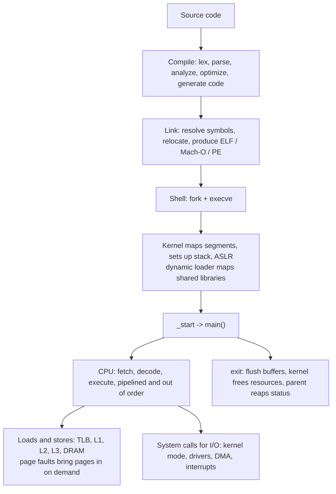

# 📘 Computer Fundamentals Interview Playbook

The other pages teach the material.
This page is for rehearsal: a question bank with what a strong answer contains, recipes for numerical problems, a full "what happens when you run a program" answer, cheat sheets, and a study plan.

## Table of Contents

1. [What Interviewers Look For](#1-what-interviewers-look-for)
2. [What Happens When You Run a Program](#2-what-happens-when-you-run-a-program)
3. [Question Bank](#3-question-bank)
4. [Numerical Problem Recipes](#4-numerical-problem-recipes)
5. [Cheat Sheets](#5-cheat-sheets)
6. [Common Mistakes](#6-common-mistakes)
7. [Study Plan](#7-study-plan)

---

## 1. What Interviewers Look For

| Level | Expected |
| --- | --- |
| **Campus / new grad** | Base conversions, two's complement, logic gates, von Neumann model, fetch-decode-execute, cache basics, compiler vs interpreter |
| **Mid** | Floating point pitfalls, encodings (UTF-8), stack vs heap, linking, GC basics, cache-friendly code |
| **Senior / performance** | Pipelining and branch prediction effects, false sharing, SIMD, NUMA, JIT behavior, reading profiler output |

These topics often appear inside other questions: "why is this loop slow", "why does this float comparison fail", "why does adding threads make it slower".
Connecting theory to observed behavior is what earns credit.

---

## 2. What Happens When You Run a Program

A good answer moves from source to silicon.

Points to hit:

1. **Build**: preprocessing, compilation to assembly, assembling to object files, linking with libraries (static or dynamic); for Java or C#, compile to bytecode, then JIT at run time.
2. **Launch**: the shell forks, the child calls `execve`, the kernel creates an address space, maps text and data, sets up the stack with arguments and environment.
3. **Dynamic loading**: `ld.so` maps shared libraries and resolves symbols, then `_start` calls `main`.
4. **Execution**: the CPU fetches instructions through the instruction cache, predicts branches, executes out of order, and retires in order.
5. **Memory**: virtual addresses translated through the TLB and page tables; first touches cause page faults; data flows through the cache hierarchy.
6. **I/O**: `printf` buffers, then `write` traps into the kernel, which talks to the terminal or file system driver.
7. **Scheduling**: timer interrupts may preempt the program; other processes share the CPU.
8. **Exit**: return from `main`, `exit` flushes stdio, the kernel reclaims memory and FDs, the parent collects the exit status with `wait`.

Pair this with [What Happens When You Type a URL](/docs/networking/networking-interview-playbook#2-what-happens-when-you-type-a-url) for the network side.

---

## 3. Question Bank

### 3.1 Data representation (10)

| # | Question | Strong answer includes | Read |
| --- | --- | --- | --- |
| 1 | Convert 156 to binary and hex. | `10011100`, `0x9C`, method shown | [Number Systems](/docs/computer-fundamentals/number-systems-and-data-representation) |
| 2 | Represent -13 in 8-bit two's complement. | Invert and add 1: `11110011` | [Number Systems](/docs/computer-fundamentals/number-systems-and-data-representation) |
| 3 | Why do computers use two's complement? | Single zero, same adder for signed and unsigned | [Number Systems](/docs/computer-fundamentals/number-systems-and-data-representation) |
| 4 | What happens on integer overflow in your language? | Wrap vs UB vs exception vs bignum, examples of bugs | [Number Systems](/docs/computer-fundamentals/number-systems-and-data-representation) |
| 5 | Why is 0.1 + 0.2 != 0.3? | Binary fractions, rounding, epsilon comparison | [Number Systems](/docs/computer-fundamentals/number-systems-and-data-representation) |
| 6 | How would you store currency? | Integer minor units or decimal type, plus currency code, rounding mode | [Number Systems](/docs/computer-fundamentals/number-systems-and-data-representation) |
| 7 | Check if a number is a power of two. | `x > 0 && (x & (x - 1)) == 0`, why it works | [Number Systems](/docs/computer-fundamentals/number-systems-and-data-representation) |
| 8 | Unicode vs UTF-8 vs UTF-16? | Code points vs encodings, byte lengths, surrogates | [Number Systems](/docs/computer-fundamentals/number-systems-and-data-representation) |
| 9 | What is endianness and where does it matter? | Byte order, network byte order, file formats, `htonl` | [Number Systems](/docs/computer-fundamentals/number-systems-and-data-representation) |
| 10 | What are NaN and Infinity? | Encodings, how they arise, `NaN != NaN` | [Number Systems](/docs/computer-fundamentals/number-systems-and-data-representation) |

### 3.2 Logic and architecture (10)

| # | Question | Strong answer includes | Read |
| --- | --- | --- | --- |
| 11 | Build XOR (or NOT, AND) from NAND gates. | Universal gate, gate-level expression | [Architecture](/docs/computer-fundamentals/digital-logic-and-computer-architecture) |
| 12 | Combinational vs sequential logic? | No memory vs state, flip-flops, clock | [Architecture](/docs/computer-fundamentals/digital-logic-and-computer-architecture) |
| 13 | How does a full adder work? | Sum and carry equations, ripple vs lookahead | [Architecture](/docs/computer-fundamentals/digital-logic-and-computer-architecture) |
| 14 | Explain the von Neumann architecture and its bottleneck. | Shared memory, buses, modified Harvard caches | [Architecture](/docs/computer-fundamentals/digital-logic-and-computer-architecture) |
| 15 | Walk through the instruction cycle. | Fetch, decode, execute, memory, write back, interrupts | [Architecture](/docs/computer-fundamentals/digital-logic-and-computer-architecture) |
| 16 | RISC vs CISC? | Load-store, fixed length, micro-ops, ARM vs x86 | [Architecture](/docs/computer-fundamentals/digital-logic-and-computer-architecture) |
| 17 | What is pipelining and what are hazards? | Throughput, structural, data, control, forwarding | [Architecture](/docs/computer-fundamentals/digital-logic-and-computer-architecture) |
| 18 | Why does sorting an array speed up a branchy loop? | Branch prediction, misprediction penalty | [Architecture](/docs/computer-fundamentals/digital-logic-and-computer-architecture) |
| 19 | What is out-of-order execution? | Reorder buffer, register renaming, in-order retirement | [Architecture](/docs/computer-fundamentals/digital-logic-and-computer-architecture) |
| 20 | SRAM vs DRAM? | Latch vs capacitor, speed, density, refresh, where used | [Architecture](/docs/computer-fundamentals/digital-logic-and-computer-architecture) |

### 3.3 Memory and caches (8)

| # | Question | Strong answer includes | Read |
| --- | --- | --- | --- |
| 21 | Why do we need a memory hierarchy? | Speed vs size vs cost, locality | [Caches](/docs/computer-fundamentals/memory-hierarchy-and-caches) |
| 22 | Explain cache mapping schemes. | Direct, set associative, fully associative, trade-offs | [Caches](/docs/computer-fundamentals/memory-hierarchy-and-caches) |
| 23 | Types of cache misses? | Compulsory, capacity, conflict, coherence | [Caches](/docs/computer-fundamentals/memory-hierarchy-and-caches) |
| 24 | Write-through vs write-back? | Traffic, consistency, dirty bit, allocate policies | [Caches](/docs/computer-fundamentals/memory-hierarchy-and-caches) |
| 25 | What is cache coherence? MESI? | Private caches, invalidation, states | [Caches](/docs/computer-fundamentals/memory-hierarchy-and-caches) |
| 26 | What is false sharing and how do you fix it? | Same line, ping-pong, padding, per-thread data | [Caches](/docs/computer-fundamentals/memory-hierarchy-and-caches) |
| 27 | Why is iterating a 2D array by rows faster? | Row-major layout, lines, prefetching | [Caches](/docs/computer-fundamentals/memory-hierarchy-and-caches) |
| 28 | Array vs linked list performance in practice? | Contiguity, pointer chasing, cache misses | [Caches](/docs/computer-fundamentals/memory-hierarchy-and-caches) |

### 3.4 Compilers, runtimes, and parallelism (12)

| # | Question | Strong answer includes | Read |
| --- | --- | --- | --- |
| 29 | Compiler vs interpreter vs JIT? | Timing of translation, startup vs peak, examples | [Compilers](/docs/computer-fundamentals/compilers-and-program-execution) |
| 30 | Phases of a compiler? | Lexing through code generation, front vs back end | [Compilers](/docs/computer-fundamentals/compilers-and-program-execution) |
| 31 | What does a linker do? | Symbol resolution, relocation, common errors | [Compilers](/docs/computer-fundamentals/compilers-and-program-execution) |
| 32 | Static vs dynamic linking? | Size, sharing, updates, deployment | [Compilers](/docs/computer-fundamentals/compilers-and-program-execution) |
| 33 | Stack vs heap? | Lifetime, speed, size, thread ownership, errors | [Compilers](/docs/computer-fundamentals/compilers-and-program-execution) |
| 34 | What is in a stack frame, and what is a calling convention? | Return address, saved registers, locals, argument registers | [Compilers](/docs/computer-fundamentals/compilers-and-program-execution) |
| 35 | How does garbage collection work? | Roots, mark and sweep, generational, concurrent, leaks still possible | [Compilers](/docs/computer-fundamentals/compilers-and-program-execution) |
| 36 | Reference counting vs tracing GC? | Cycles, pauses, overhead | [Compilers](/docs/computer-fundamentals/compilers-and-program-execution) |
| 37 | Concurrency vs parallelism? | Structure vs execution, examples | [Parallelism](/docs/computer-fundamentals/parallelism-and-modern-hardware) |
| 38 | CPU vs GPU? | Latency vs throughput design, when to use each | [Parallelism](/docs/computer-fundamentals/parallelism-and-modern-hardware) |
| 39 | What is SIMD? | Vector registers, auto-vectorization, blockers | [Parallelism](/docs/computer-fundamentals/parallelism-and-modern-hardware) |
| 40 | Why might adding threads not speed things up? | Amdahl, contention, false sharing, bandwidth | [Parallelism](/docs/computer-fundamentals/parallelism-and-modern-hardware) |

---

## 4. Numerical Problem Recipes

| Problem | Recipe | Example |
| --- | --- | --- |
| **Decimal to binary** | Divide by 2, collect remainders bottom up | 156 = `10011100` |
| **Binary to hex** | Group 4 bits from the right | `1001 1100` = `0x9C` |
| **Two's complement of -x** | Write x in n bits, invert, add 1 | -13 = `11110011` |
| **Signed range** | -2^(n-1) to 2^(n-1) - 1 | 16 bits: -32,768 to 32,767 |
| **IEEE 754 single** | Sign; normalize to `1.f x 2^e`; exponent e + 127; fraction bits | -5.75 = `0xC0B80000` |
| **Cache address split** | Offset = log2(line); sets = size / (line x ways); index = log2(sets); tag = rest | 32 KB, 8-way, 64 B, 32-bit: 20 / 6 / 6 |
| **AMAT** | Hit time + miss rate x miss penalty, nested per level | 1 + 0.1 x (4 + 0.2 x 80) = 3 ns |
| **Pipeline time** | k + (n - 1) cycles for n instructions, k stages | 5 stages, 100 instructions: 104 cycles vs 500 unpipelined |
| **CPU time** | Instructions x CPI / clock rate | 2 x 10^9 x 1.5 / 3 GHz = 1 s |
| **Amdahl speedup** | 1 / ((1 - p) + p / n) | p = 0.9, n = 8: 1 / (0.1 + 0.1125) ≈ 4.7x |
| **Memory addressable** | 2^(address bits) bytes | 32-bit: 4 GiB |
| **Data rate conversion** | Bits / 8 = bytes | 1 Gbps = 125 MB/s |

---

## 5. Cheat Sheets

### Powers of two

| 2^n | Value | Approx |
| --- | --- | --- |
| 2^8 | 256 | |
| 2^10 | 1,024 | 1 thousand (Ki) |
| 2^16 | 65,536 | |
| 2^20 | 1,048,576 | 1 million (Mi) |
| 2^30 | | 1 billion (Gi) |
| 2^32 | 4,294,967,296 | 4.3 billion |
| 2^40 | | 1 trillion (Ti) |
| 2^53 | | JavaScript safe integer limit |
| 2^64 | | 1.8 x 10^19 |

### Hex digits

| Hex | Binary | Hex | Binary |
| --- | --- | --- | --- |
| 0 | 0000 | 8 | 1000 |
| 1 | 0001 | 9 | 1001 |
| 2 | 0010 | A | 1010 |
| 3 | 0011 | B | 1011 |
| 4 | 0100 | C | 1100 |
| 5 | 0101 | D | 1101 |
| 6 | 0110 | E | 1110 |
| 7 | 0111 | F | 1111 |

### Latency ladder

| Level | Time |
| --- | --- |
| Register | < 1 ns |
| L1 | ~1 ns |
| L2 | ~4 ns |
| L3 | ~10 to 20 ns |
| DRAM | ~100 ns |
| NVMe | ~10 to 100 µs |
| Data center round trip | ~0.5 ms |
| HDD seek | ~5 to 10 ms |
| Cross-continent round trip | ~70 to 150 ms |

---

## 6. Common Mistakes

- Comparing floats with `==`, or storing money in `double`.
- Saying "a character is one byte" in a Unicode world.
- Forgetting that `abs(INT_MIN)` overflows.
- Confusing latency with bandwidth, or bits with bytes.
- Thinking pipelining makes one instruction faster (it improves throughput).
- Ignoring the cache when comparing algorithms with the same big-O.
- Assuming more threads always means more speed.
- Saying Java is "interpreted" (it is JIT compiled after warm-up).
- Believing GC prevents all memory leaks.
- Treating hyper-threads as full cores.

---

## 7. Study Plan

| Day | Focus | Output |
| --- | --- | --- |
| 1 | [Number Systems](/docs/computer-fundamentals/number-systems-and-data-representation) | Do 10 conversions, encode two floats by hand, check with Python `struct` |
| 2 | [Architecture](/docs/computer-fundamentals/digital-logic-and-computer-architecture) | Draw the pipeline with a data hazard; explain branch prediction with the sorted-array example |
| 3 | [Caches](/docs/computer-fundamentals/memory-hierarchy-and-caches) | Solve an address breakdown and an AMAT problem; benchmark row vs column traversal |
| 4 | [Compilers](/docs/computer-fundamentals/compilers-and-program-execution) and [Parallelism](/docs/computer-fundamentals/parallelism-and-modern-hardware) | Compile with `-S`, read the assembly; explain generational GC and SIMD |
| 5 | This page | Say "what happens when you run a program" out loud, then answer the question bank |

Related: [Operating Systems](/docs/operating-systems) builds directly on this material, and [DSA](/docs/dsa) benefits from knowing why cache-friendly structures win.
