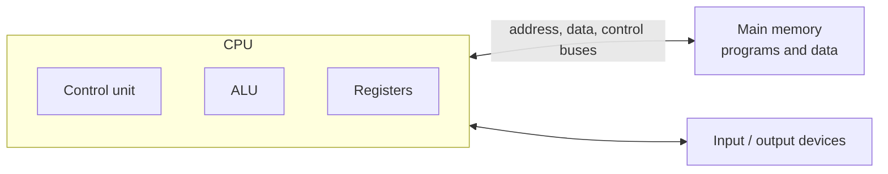
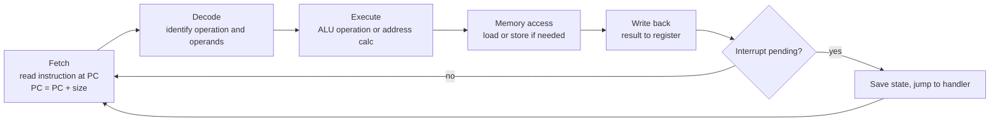

# 📘 Digital Logic and Computer Architecture

This page climbs from single transistors to a modern out-of-order CPU.
You do not need to design chips, but knowing how a CPU executes instructions explains why some code is fast and some is slow.

## Table of Contents

1. [Transistors and Logic Gates](#1-transistors-and-logic-gates)
2. [Boolean Algebra](#2-boolean-algebra)
3. [Combinational Circuits](#3-combinational-circuits)
4. [Sequential Circuits](#4-sequential-circuits)
5. [The von Neumann Architecture](#5-the-von-neumann-architecture)
6. [Inside the CPU](#6-inside-the-cpu)
7. [The Instruction Cycle](#7-the-instruction-cycle)
8. [Instruction Set Architectures](#8-instruction-set-architectures)
9. [Pipelining](#9-pipelining)
10. [Branch Prediction and Speculation](#10-branch-prediction-and-speculation)
11. [Superscalar and Out-of-Order Execution](#11-superscalar-and-out-of-order-execution)
12. [Measuring CPU Performance](#12-measuring-cpu-performance)
13. [Questions](#13-questions)

---

## 1. Transistors and Logic Gates

A **transistor** is an electrically controlled switch.
CMOS chips pair complementary transistors so that almost no current flows except while switching.
A modern high-end chip has tens of billions of them; Apple's M3 Max has about 92 billion, and large GPUs over 200 billion across multiple dies.

Gates combine transistors into Boolean functions:

| Gate | Symbol | Output is 1 when | Truth table (A B -> out) |
| --- | --- | --- | --- |
| **NOT** | `¬A` | A is 0 | 0 -> 1, 1 -> 0 |
| **AND** | `A · B` | Both are 1 | 00->0, 01->0, 10->0, 11->1 |
| **OR** | `A + B` | Either is 1 | 00->0, 01->1, 10->1, 11->1 |
| **NAND** | `¬(A · B)` | Not both 1 | 00->1, 01->1, 10->1, 11->0 |
| **NOR** | `¬(A + B)` | Both are 0 | 00->1, 01->0, 10->0, 11->0 |
| **XOR** | `A ⊕ B` | They differ | 00->0, 01->1, 10->1, 11->0 |
| **XNOR** | `¬(A ⊕ B)` | They are equal | 00->1, 01->0, 10->0, 11->1 |

**NAND and NOR are universal**: any Boolean function can be built from NAND gates alone (or NOR alone).
For example, `NOT A = A NAND A`, and `A AND B = NOT (A NAND B)`.

---

## 2. Boolean Algebra

| Law | AND form | OR form |
| --- | --- | --- |
| Identity | `A · 1 = A` | `A + 0 = A` |
| Null | `A · 0 = 0` | `A + 1 = 1` |
| Idempotent | `A · A = A` | `A + A = A` |
| Complement | `A · ¬A = 0` | `A + ¬A = 1` |
| Commutative | `A · B = B · A` | `A + B = B + A` |
| Distributive | `A · (B + C) = A·B + A·C` | `A + B·C = (A + B)(A + C)` |
| Absorption | `A · (A + B) = A` | `A + A·B = A` |
| **De Morgan** | `¬(A · B) = ¬A + ¬B` | `¬(A + B) = ¬A · ¬B` |

De Morgan's laws show up in everyday code: `!(a && b)` equals `!a || !b`.

Circuits are simplified with algebra or **Karnaugh maps** (grids that group adjacent 1s), producing fewer gates, less area, and lower delay.
Real chip design uses hardware description languages (Verilog, VHDL, Chisel) and synthesis tools that do this automatically.

---

## 3. Combinational Circuits

Output depends **only on current inputs**; no memory.

| Circuit | Does | Used for |
| --- | --- | --- |
| **Half adder** | Adds 2 bits: sum = `A ⊕ B`, carry = `A · B` | Building block |
| **Full adder** | Adds 2 bits plus a carry-in: sum = `A ⊕ B ⊕ Cin`, carry = `A·B + Cin·(A ⊕ B)` | Chained into multi-bit adders |
| **Ripple-carry adder** | n full adders in a chain | Simple but slow: carry must ripple through all bits |
| **Carry-lookahead adder** | Computes carries in parallel | Fast adders in real ALUs |
| **Multiplexer (MUX)** | Selects one of 2^n inputs using n select lines | Choosing operands, data paths |
| **Demultiplexer** | Routes one input to one of many outputs | |
| **Decoder** | n inputs to one of 2^n active outputs | Selecting a memory row or register |
| **Encoder** | Reverse of decoder | Priority encoders for interrupts |
| **Comparator** | A = B, A < B | Branch conditions |

Subtraction reuses the adder: `A - B = A + (~B) + 1`, which is why two's complement won (see [Number Systems](/docs/computer-fundamentals/number-systems-and-data-representation)).

---

## 4. Sequential Circuits

Output depends on inputs **and stored state**; this is where memory comes from.

| Element | Behavior |
| --- | --- |
| **SR latch** | Two cross-coupled NOR (or NAND) gates hold one bit; Set and Reset inputs |
| **D latch** | Stores the D input while enabled (level triggered) |
| **D flip-flop** | Stores D on the clock edge (edge triggered); the basic register bit |
| **JK and T flip-flops** | Variants; T toggles, used in counters |
| **Register** | n flip-flops sharing a clock, holding an n-bit value |
| **Counter** | Register that increments each clock |
| **Shift register** | Shifts bits along each clock; serial to parallel conversion |
| **Finite state machine** | State register plus logic for next state and outputs; controllers, protocol handlers |

The **clock** synchronizes everything: on each tick, flip-flops capture new values computed by combinational logic since the last tick.
The clock period must be longer than the slowest path through the logic (**critical path**), which limits the frequency.
Clock speeds have hovered around 3 to 6 GHz since the mid-2000s because power density (heat) grows with frequency; performance gains now come from parallelism, caches, and specialized units instead.

**SRAM** (caches, registers) stores a bit in a 6-transistor latch: fast, large, expensive.
**DRAM** (main memory) stores a bit as charge in a capacitor with 1 transistor: dense and cheap, but it leaks and must be **refreshed** every few milliseconds, and reads are slower.

---

## 5. The von Neumann Architecture

Almost every computer follows the design John von Neumann described in 1945: **instructions and data live in the same memory**, and the CPU fetches both over the same path.



| Architecture | Memory | Pros | Cons |
| --- | --- | --- | --- |
| **von Neumann** | One memory for code and data | Simple, flexible, programs can load programs | **von Neumann bottleneck**: one path for instructions and data |
| **Harvard** | Separate code and data memories | Fetch both at once | Less flexible |
| **Modified Harvard** (all modern CPUs) | Unified main memory, but separate L1 instruction and data caches | Best of both | |

The **stored-program** idea is what makes software possible: a program is just data that the CPU executes, which is also why code injection attacks exist and why pages are marked non-executable.

**Buses**:

- **Address bus**: which location (its width limits addressable memory).
- **Data bus**: the value.
- **Control bus**: read or write, interrupts, clock.

Modern systems replace shared buses with point-to-point links: PCIe for devices, DDR channels for memory, and on-chip networks between cores.

---

## 6. Inside the CPU

| Component | Role |
| --- | --- |
| **ALU** | Integer arithmetic and logic |
| **FPU / vector units** | Floating point and SIMD math |
| **Registers** | Tiny, fastest storage inside the core (x86-64 has 16 general-purpose, ARM64 has 31) |
| **Program counter (PC / IP)** | Address of the next instruction |
| **Instruction register** | The instruction being decoded |
| **Stack pointer** | Top of the current stack |
| **Flags / status register** | Zero, carry, overflow, sign from the last operation |
| **Control unit** | Decodes instructions and drives the data path; **hardwired** (fast, RISC) or **microprogrammed** (flexible, used for complex x86 instructions) |
| **MMU and TLB** | Virtual to physical address translation (see [Memory Management](/docs/operating-systems/memory-management)) |
| **Caches** | L1, L2 per core, L3 shared (see [Memory Hierarchy and Caches](/docs/computer-fundamentals/memory-hierarchy-and-caches)) |

A modern chip packs many **cores**, each a complete CPU, plus shared cache, memory controllers, often a GPU, and neural engines on one die or several **chiplets** in one package.

---

## 7. The Instruction Cycle



Example: `ADD R1, R2, R3` (R1 = R2 + R3).

1. **Fetch**: send the PC to memory (via the cache), load the instruction, increment PC.
2. **Decode**: opcode says ADD; source registers R2, R3; destination R1.
3. **Execute**: the ALU adds the two register values.
4. **Memory**: nothing to do for ADD.
5. **Write back**: store the sum in R1.

### Addressing modes

| Mode | Example | Operand is |
| --- | --- | --- |
| **Immediate** | `MOV R1, #5` | The constant in the instruction |
| **Register** | `ADD R1, R2` | A register's value |
| **Direct** | `LOAD R1, [1000]` | Memory at a fixed address |
| **Register indirect** | `LOAD R1, [R2]` | Memory at the address in R2 (a pointer dereference) |
| **Base + offset** | `LOAD R1, [R2 + 8]` | A struct field or stack variable |
| **Indexed / scaled** | `mov rax, [rbx + rcx*8]` | Array element `a[i]` with 8-byte elements |
| **PC-relative** | `JMP +16`, `lea rax, [rip + label]` | Relative to the current instruction, for position-independent code |

---

## 8. Instruction Set Architectures

The **ISA** is the contract between software and hardware: instructions, registers, memory model, and encoding.
The **microarchitecture** is how a particular chip implements it (Intel and AMD both implement x86-64 very differently).

| | RISC | CISC |
| --- | --- | --- |
| Instructions | Few, simple, fixed length | Many, complex, variable length |
| Memory access | Only load and store touch memory | Many instructions operate on memory directly |
| Cycles per instruction | Mostly one (pipelined) | Varies |
| Decoding | Simple | Complex |
| Code density | Lower | Higher |
| Examples | ARM, RISC-V, MIPS, PowerPC | x86, x86-64, historic VAX |

The line has blurred: modern x86 chips decode CISC instructions into RISC-like **micro-ops** internally, and ARM added some complex instructions.

| ISA | Where | Notes |
| --- | --- | --- |
| **x86-64** | Most PCs and servers | Backward compatible to 1978; licensed only to Intel and AMD (plus a few); AVX-512 and AVX10 vector extensions |
| **ARM64 (AArch64)** | All phones, Apple silicon Macs, AWS Graviton, Google Axion, Microsoft Cobalt, NVIDIA Grace | Licensed design; strong performance per watt |
| **RISC-V** | Microcontrollers, accelerators, growing into Linux-class chips | Open, royalty-free ISA with modular extensions (vector "V" extension, RVA23 profile) |

Apple's move to ARM (2020) and cloud providers' ARM server chips shifted the industry: ARM servers often cost 20 to 40 percent less for the same work, so multi-architecture container images (`linux/amd64`, `linux/arm64`) are now standard.

---

## 9. Pipelining

Like a laundry line (wash, dry, fold), a **pipeline** overlaps the stages of consecutive instructions.

```text
Cycle:        1    2    3    4    5    6    7    8
Instr 1:      IF   ID   EX   MEM  WB
Instr 2:           IF   ID   EX   MEM  WB
Instr 3:                IF   ID   EX   MEM  WB
Instr 4:                     IF   ID   EX   MEM  WB
```

Ideal: after filling, one instruction completes per cycle.
Without pipelining 4 instructions take 4 x 5 = 20 cycles; with it they take 5 + 3 = 8.
For n instructions in a k-stage pipeline: k + (n - 1) cycles; speedup approaches k for large n.

Pipelining improves **throughput**, not the latency of a single instruction.

### Hazards

| Hazard | Cause | Example | Fixes |
| --- | --- | --- | --- |
| **Structural** | Two stages need the same hardware | One memory port for fetch and load | Separate I and D caches, more units |
| **Data** | An instruction needs a result not yet written | `ADD R1, R2, R3` then `SUB R4, R1, R5` | **Forwarding / bypassing**, stalls (bubbles), compiler scheduling |
| **Control** | The next instruction depends on a branch outcome | `if`, loops, calls | Branch prediction, speculation |

Data hazard types: **RAW** (read after write, the true dependency), **WAR** and **WAW** (false dependencies removed by **register renaming**).

A **load-use hazard** cannot be fully forwarded: the loaded value arrives at the end of MEM, so the dependent instruction must stall at least a cycle.

---

## 10. Branch Prediction and Speculation

Pipelines are 15 to 20 stages deep in modern CPUs, so waiting for every branch to resolve would waste most cycles.
The CPU **predicts** the branch and **speculatively executes** the predicted path.
On a misprediction it throws away the speculative work, costing roughly **15 to 20 cycles**.

| Predictor | Idea |
| --- | --- |
| Static | Backward branches taken (loops), forward not taken |
| 2-bit saturating counter | Needs two wrong guesses in a row to flip |
| Global history / correlating | Uses the outcomes of recent branches |
| TAGE, perceptron | Modern predictors; accuracy often above 95 percent |
| Branch target buffer | Predicts where a jump goes, for indirect calls and virtual methods |
| Return stack buffer | Predicts return addresses |

The classic demonstration: summing values above a threshold in an array runs several times faster when the array is **sorted**, because the branch becomes predictable.
Branchless code (`cmov`, arithmetic masks) avoids the problem when data is random.

**Spectre and Meltdown** (2018) showed that speculative execution leaves traces in the cache that can leak secrets across security boundaries.
Mitigations (retpolines, kernel page-table isolation, speculation barriers) cost some performance, especially for system calls.

---

## 11. Superscalar and Out-of-Order Execution

| Technique | Idea |
| --- | --- |
| **Superscalar** | Fetch, decode, and issue several instructions per cycle (modern cores: 6 to 10 wide) |
| **Out-of-order execution** | Execute instructions as soon as their inputs are ready, not in program order; a **reorder buffer** retires them in order so the program sees sequential behavior |
| **Register renaming** | Map a few architectural registers to hundreds of physical ones to remove false dependencies |
| **SMT / hyper-threading** | Two hardware threads share one core's units to fill idle slots |
| **SIMD** | One instruction operates on many values (see [Parallelism and Modern Hardware](/docs/computer-fundamentals/parallelism-and-modern-hardware)) |
| **VLIW** | Compiler bundles parallel operations explicitly (Itanium, DSPs); lost in general-purpose CPUs |

The practical lesson: modern CPUs can do several operations per cycle, but only if the code has **independent work** and data is in cache.
A chain of dependent operations (each needing the previous result) or a cache miss stalls everything.

---

## 12. Measuring CPU Performance

**The CPU performance equation**:

```text
CPU time = Instruction count x CPI x Clock period
         = Instructions x (Cycles / Instruction) x (Seconds / Cycle)
```

| Factor | Affected by |
| --- | --- |
| **Instruction count** | Algorithm, compiler, ISA |
| **CPI** (cycles per instruction), or IPC (its inverse) | Microarchitecture, cache misses, branch mispredictions, dependencies |
| **Clock rate** | Process technology, power budget |

Example: a program runs 2 billion instructions at a CPI of 1.5 on a 3 GHz CPU: 2 x 10^9 x 1.5 / (3 x 10^9) = **1 second**.

| Law | Statement |
| --- | --- |
| **Amdahl's law** | Speedup is limited by the part you do not improve: `1 / ((1 - p) + p / s)` |
| **Gustafson's law** | With more processors, people solve bigger problems, so parallel speedup scales with problem size |
| **Moore's law** | Transistor counts double about every two years; slowing but not dead thanks to 3D stacking and chiplets |
| **Dennard scaling** | Power per area stayed constant as transistors shrank, until about 2006; its end forced the multi-core era |

Benchmarks: SPEC CPU for general compute, Geekbench for consumer comparisons, and your own workload for anything that matters.
`perf stat` shows instructions, cycles, IPC, cache misses, and branch mispredictions for a real program.

---

## 13. Questions

| Question | Short answer |
| --- | --- |
| Why are NAND and NOR universal? | Any Boolean function can be built from either alone |
| State De Morgan's laws. | `¬(A·B) = ¬A + ¬B`; `¬(A+B) = ¬A · ¬B` |
| Combinational vs sequential circuits? | Output from inputs only vs inputs plus stored state |
| Latch vs flip-flop? | Level triggered vs edge triggered |
| SRAM vs DRAM? | 6-transistor latch, fast, caches vs capacitor, dense, needs refresh, main memory |
| What is the von Neumann bottleneck? | Shared path for instructions and data limits throughput |
| Explain fetch-decode-execute. | Fetch at PC, decode opcode and operands, execute, memory, write back |
| RISC vs CISC? | Simple fixed-length load-store vs complex variable-length; x86 decodes into micro-ops |
| What is pipelining? | Overlapping instruction stages to raise throughput |
| Pipeline hazards and fixes? | Structural, data (forwarding, stalls), control (prediction) |
| Why is sorted data faster in a branchy loop? | The branch becomes predictable, no misprediction flushes |
| What is out-of-order execution? | Run instructions when inputs are ready, retire in order |
| CPU performance equation? | Instructions x CPI x clock period |

Next: [Memory Hierarchy and Caches](/docs/computer-fundamentals/memory-hierarchy-and-caches).
