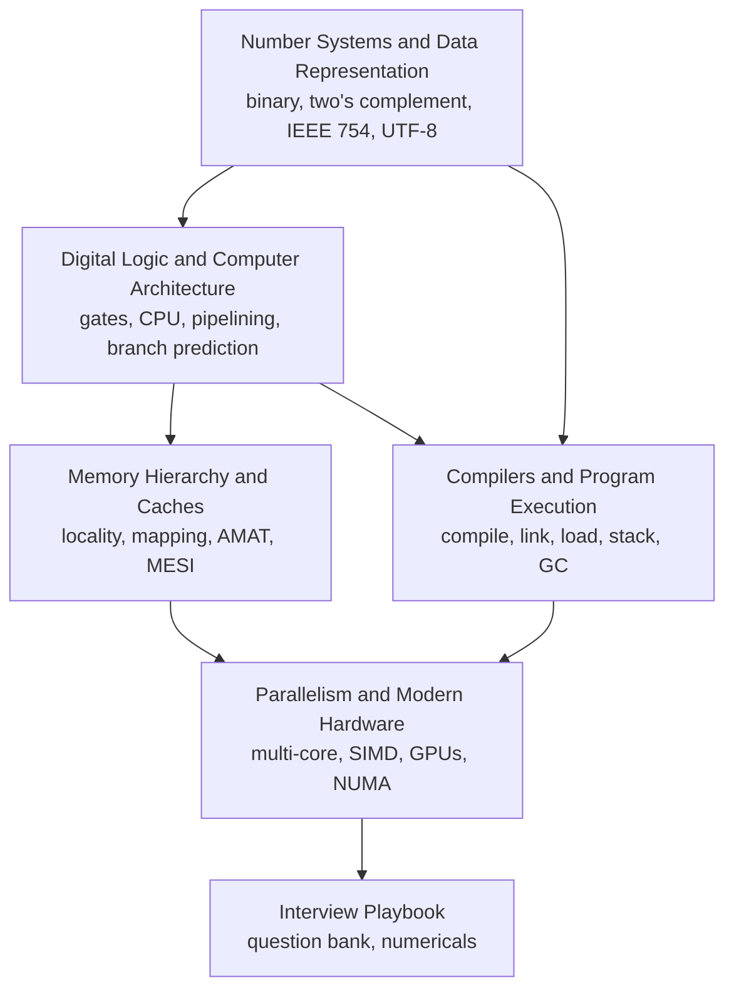

Start here for the "how does a computer actually work" questions, from "convert 156 to binary" to "why does adding threads make this slower".
The pages climb from bits to CPUs to caches to the software that turns code into running programs, then finish with parallel hardware.
Numeric examples (conversions, two's complement, IEEE 754 encodings, UTF-8 bytes) were checked with Python, and hardware details reflect current chips (ARM servers, chiplets, HBM, AI accelerators).

<SectionHub
  path="computer-fundamentals"
  levels={{
    "number-systems-and-data-representation": "Beginner",
    "digital-logic-and-computer-architecture": "Beginner to mid",
    "memory-hierarchy-and-caches": "Mid to advanced",
    "compilers-and-program-execution": "Mid",
    "parallelism-and-modern-hardware": "Advanced",
    "computer-fundamentals-interview-playbook": "All levels"
  }}
/>

## Reading Path

## Pick Your Level

| You are | Read in this order |
| --- | --- |
| New to the topic | [Number Systems](/docs/computer-fundamentals/number-systems-and-data-representation), [Architecture](/docs/computer-fundamentals/digital-logic-and-computer-architecture) |
| Preparing for campus or a written test | Add [Caches](/docs/computer-fundamentals/memory-hierarchy-and-caches) and the numerical recipes in the [Playbook](/docs/computer-fundamentals/computer-fundamentals-interview-playbook) |
| Preparing for performance-focused roles | Add [Compilers](/docs/computer-fundamentals/compilers-and-program-execution) and [Parallelism](/docs/computer-fundamentals/parallelism-and-modern-hardware) |
| A few days left | The [Interview Playbook](/docs/computer-fundamentals/computer-fundamentals-interview-playbook) study plan |

## Related Sections

- [Operating Systems](/docs/operating-systems) builds on this: processes, virtual memory, scheduling, and I/O.
- [Networking](/docs/networking) covers how machines talk to each other.
- [Java](/docs/java) and [JavaScript](/docs/javascript) show these ideas inside real runtimes (JVM, V8, the event loop).
