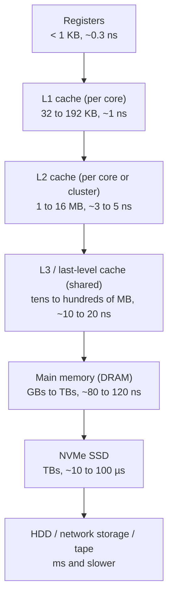
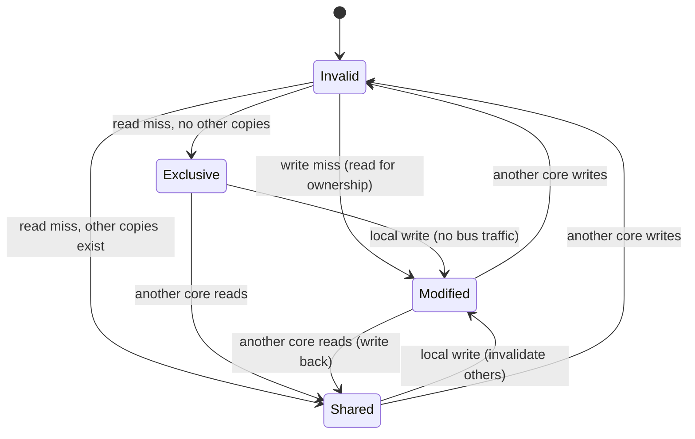

# 📘 Memory Hierarchy and Caches

A CPU can do several operations per nanosecond, but fetching a value from main memory takes about 100 nanoseconds.
Caches bridge that gap, and for most performance-sensitive code **memory access patterns matter more than instruction counts**.
This page explains how caches work and how to write code that uses them well.

## Table of Contents

1. [The Hierarchy](#1-the-hierarchy)
2. [Latency Numbers](#2-latency-numbers)
3. [Locality](#3-locality)
4. [Cache Lines and Organization](#4-cache-lines-and-organization)
5. [Address Breakdown Example](#5-address-breakdown-example)
6. [Replacement and Write Policies](#6-replacement-and-write-policies)
7. [Types of Misses](#7-types-of-misses)
8. [Average Memory Access Time](#8-average-memory-access-time)
9. [Multi-Core Caches and Coherence](#9-multi-core-caches-and-coherence)
10. [False Sharing](#10-false-sharing)
11. [Cache-Friendly Code](#11-cache-friendly-code)
12. [Main Memory and Beyond](#12-main-memory-and-beyond)
13. [Questions](#13-questions)

---

## 1. The Hierarchy



Moving down: **bigger, cheaper per byte, slower**.
Each level caches the one below it.
The hierarchy works because programs have **locality**: most accesses hit the small fast levels.

Sizes vary widely: Apple silicon cores have large L1 caches (192 KB instruction, 128 KB data on performance cores), and AMD's 3D V-Cache stacks extra L3 on top of the die for 96 MB or more per chip.

---

## 2. Latency Numbers

Approximate values for a modern server, popularized by Jeff Dean and Peter Norvig and updated for current hardware.

| Operation | Time | Relative (L1 = 1 second) |
| --- | --- | --- |
| L1 cache hit | 1 ns | 1 s |
| Branch mispredict | 3 to 5 ns | 4 s |
| L2 cache hit | 4 ns | 4 s |
| Uncontended mutex lock/unlock | 15 to 25 ns | 20 s |
| L3 cache hit | 10 to 20 ns | 15 s |
| Main memory access | 100 ns | 1.5 minutes |
| Compress 1 KB with a fast compressor (LZ4, Snappy) | 1 to 2 µs | 25 minutes |
| Read 1 MB sequentially from memory | 20 to 50 µs | 10 hours |
| Round trip within a data center | 200 to 500 µs | 4 days |
| NVMe random 4 KB read | 20 to 100 µs | 1 day |
| Read 1 MB sequentially from NVMe | 150 to 300 µs | 3 days |
| HDD seek | 5 to 10 ms | 3 months |
| Round trip US to Europe | 70 to 90 ms | 2.5 years |

Takeaways:

- A main memory miss costs as much as **hundreds of simple instructions**.
- Sequential access is dramatically faster than random at every level.
- Network round trips inside a data center are now comparable to or slower than an SSD read, so "just call another service" is not free.

---

## 3. Locality

| Kind | Meaning | Example |
| --- | --- | --- |
| **Temporal** | Recently used data will likely be used again soon | Loop counters, hot objects, a function's local variables |
| **Spatial** | Data near recently used data will likely be used soon | Walking an array, executing sequential instructions |

Caches exploit temporal locality by **keeping** recent data and spatial locality by fetching whole **cache lines** instead of single bytes.

---

## 4. Cache Lines and Organization

Caches move data in fixed-size **lines** (blocks), almost always **64 bytes** on x86 and most ARM chips (Apple silicon uses 128 bytes).
Reading one `int` pulls in its 15 neighbors for free.

Each cache entry holds: **valid bit**, **tag** (which memory block this is), **dirty bit** (for write-back caches), and the data.

| Organization | Where a block can go | Pros | Cons |
| --- | --- | --- | --- |
| **Direct-mapped** | Exactly one line: `block number mod number of lines` | Simple, fast lookup | **Conflict misses** when hot addresses map to the same line |
| **Fully associative** | Anywhere | No conflict misses | Must compare every tag; only for tiny caches (TLBs) |
| **n-way set associative** | Anywhere within one set of n lines | Balance | Compare n tags in parallel |

Real L1 caches are typically 8 to 12 way associative, and L3 caches 12 to 16 way or more.

---

## 5. Address Breakdown Example

A **32 KB, 8-way set-associative** cache with **64-byte lines** and **32-bit** addresses.

1. Number of lines = 32 KB / 64 B = **512**.
2. Number of sets = 512 / 8 = **64**.
3. **Offset bits** = log2(64 B) = **6** (which byte within the line).
4. **Index bits** = log2(64 sets) = **6** (which set).
5. **Tag bits** = 32 - 6 - 6 = **20**.

```text
| tag (20 bits) | index (6 bits) | offset (6 bits) |
```

A lookup uses the index to pick the set, compares the tag against all 8 lines in the set in parallel, and on a hit uses the offset to pick the bytes.

If the same cache were **direct-mapped**: 512 sets, so 9 index bits and 17 tag bits.
If **fully associative**: 0 index bits and 26 tag bits.

A useful consequence: addresses that differ by a multiple of (sets x line size) = 64 x 64 = 4 KB map to the same set.
Striding through memory by exactly 4 KB (for example, walking a column of a matrix whose rows are 4 KB) uses only one set, and 9 such addresses already start evicting each other.

---

## 6. Replacement and Write Policies

**Replacement** (which line in a full set to evict):

| Policy | Notes |
| --- | --- |
| **LRU** | Best in theory for small sets; true LRU is expensive for high associativity |
| **Pseudo-LRU** | Tree bits approximate LRU; common in hardware |
| **Random** | Simple, surprisingly competitive |
| **RRIP and adaptive policies** | Modern L3 caches resist scans that would flush useful data |

**Write policies**:

| On a write hit | Behavior | Trade-off |
| --- | --- | --- |
| **Write-through** | Write to cache and the next level immediately | Simple, consistent, more traffic (often with a write buffer) |
| **Write-back** | Write to cache only, mark dirty; write to the next level on eviction | Less traffic, more complex; used by nearly all CPU caches |

| On a write miss | Behavior | Usually paired with |
| --- | --- | --- |
| **Write-allocate** | Load the line into the cache, then write | Write-back |
| **No-write-allocate** | Write directly to the next level | Write-through |

**Inclusive vs exclusive**: an inclusive L3 contains copies of everything in L1 and L2 (simpler coherence); an exclusive one does not duplicate (more total capacity).

---

## 7. Types of Misses

The **3 Cs** (plus a fourth for multi-core):

| Miss | Cause | Reduce with |
| --- | --- | --- |
| **Compulsory (cold)** | First access to a block | Larger lines, prefetching |
| **Capacity** | The working set is bigger than the cache | Bigger cache, smaller data, blocking / tiling |
| **Conflict** | Too many hot blocks map to the same set | Higher associativity, padding, different layout |
| **Coherence** | Another core wrote to the line and invalidated it | Avoid sharing writable data between cores |

---

## 8. Average Memory Access Time

```text
AMAT = hit time + miss rate x miss penalty
```

**One level**: hit time 1 ns, miss rate 5 percent, miss penalty 100 ns.
AMAT = 1 + 0.05 x 100 = **6 ns**.
Halving the miss rate to 2.5 percent gives 3.5 ns; a small miss rate change matters a lot.

**Two levels**: L1 hit 1 ns with 10 percent miss rate; L2 hit 4 ns with 20 percent local miss rate; memory 80 ns.

```text
L2 AMAT   = 4 + 0.2 x 80 = 20 ns
Total AMAT = 1 + 0.1 x 20 = 3 ns
```

Without the L2, AMAT would be 1 + 0.1 x 80 = 9 ns, three times worse.

**Local miss rate** is misses at a level divided by accesses to that level; **global miss rate** divides by all CPU accesses (here L2's global miss rate is 0.1 x 0.2 = 2 percent).

---

## 9. Multi-Core Caches and Coherence

Each core has private L1 and L2 caches, so two cores could hold different values for the same address.
**Cache coherence** protocols keep them consistent.

**MESI** states for each cache line:

| State | Meaning |
| --- | --- |
| **Modified** | Only this cache has it, and it is dirty |
| **Exclusive** | Only this cache has it, clean |
| **Shared** | Several caches may have clean copies |
| **Invalid** | Not usable |



Variants: **MOESI** (AMD, adds Owned) and **MESIF** (Intel, adds Forward).
Protocols are implemented with **snooping** (every cache watches a shared bus, fine for a few cores) or **directories** (a table tracks which caches hold each line, needed for many cores and multi-socket systems).

Coherence keeps caches consistent for a single address, but it does **not** order operations across different addresses; that is the job of the **memory model** and barriers (see [Synchronization and Deadlocks](/docs/operating-systems/synchronization-and-deadlocks)).

---

## 10. False Sharing

Two threads write **different variables** that happen to sit in the **same cache line**.
Every write invalidates the other core's copy, so the line bounces between cores, even though the threads share no data logically.

```c
struct Counters {
    long a;   // written by thread 1
    long b;   // written by thread 2, same 64-byte line as a
};
// Fix: pad or align each counter to its own line
struct PaddedCounter { alignas(64) long value; };
```

| Language | Tool |
| --- | --- |
| C / C++ | `alignas(64)`, `std::hardware_destructive_interference_size` |
| Java | `@jdk.internal.vm.annotation.Contended` (with `-XX:-RestrictContended`), manual padding; `LongAdder` avoids contention by striping |
| Go | Padding fields like `_ [56]byte` |
| Rust | `crossbeam_utils::CachePadded` |

Symptoms: a multi-threaded program that gets **slower** with more threads, and high cache coherence traffic in `perf c2c`.
Per-thread counters that are merged at the end avoid the problem entirely.

---

## 11. Cache-Friendly Code

### Traversal order

C, C++, Java, and most languages store 2D arrays **row-major**: `a[i][j]` and `a[i][j+1]` are adjacent.

```c
// Fast: walks memory sequentially
for (int i = 0; i < N; i++)
    for (int j = 0; j < N; j++)
        sum += a[i][j];

// Slow for large N: jumps a full row on every access
for (int j = 0; j < N; j++)
    for (int i = 0; i < N; i++)
        sum += a[i][j];
```

For large matrices the column-order loop can be several times slower with identical instruction counts.
Fortran, MATLAB, R, and Julia are **column-major**, so the rule flips there.

### Techniques

| Technique | Idea |
| --- | --- |
| **Arrays over linked structures** | Linked lists and trees of heap nodes scatter data; arrays and B-trees keep it contiguous |
| **Structure of arrays (SoA)** | Store `x[]`, `y[]`, `z[]` separately when loops touch one field, instead of an array of structs |
| **Hot/cold splitting** | Keep frequently used fields together, move rarely used ones elsewhere |
| **Blocking / tiling** | Process data in chunks that fit in cache (matrix multiplication, image processing) |
| **Compact types** | `int32` instead of `int64`, bitsets, smaller structs mean more elements per line |
| **Avoid pointer chasing** | Each dereference may be a dependent cache miss |
| **Batch and sort** | Sort lookups by key so accesses become sequential |
| **Prefetching** | Hardware prefetchers detect sequential and strided patterns; software `__builtin_prefetch` for irregular ones |

This is why `std::vector` beats `std::list`, Java `ArrayList` beats `LinkedList` in almost every benchmark, open-addressing hash tables beat chained ones, and B-trees beat binary trees even in memory.

Data-oriented design, columnar databases, and ECS game engines are all applications of these ideas.

---

## 12. Main Memory and Beyond

| Technology | Detail |
| --- | --- |
| **DDR5** | Current mainstream server and desktop DRAM; two independent 32-bit subchannels per module, on-die ECC |
| **LPDDR5X** | Low-power DRAM soldered next to the CPU in phones, laptops, Apple silicon |
| **HBM3 / HBM3E** | Stacked DRAM next to GPUs and AI accelerators with terabytes per second of bandwidth |
| **ECC memory** | Detects and corrects single-bit errors; standard for servers |
| **Memory channels** | Bandwidth scales with channels populated; servers have 8 to 12 per socket |
| **NUMA** | In multi-socket systems each CPU has local memory; remote access is slower (1.5 to 2x); pin threads and allocate locally |
| **CXL** | Cache-coherent memory expansion and pooling over PCIe, now appearing in servers |

**Bandwidth vs latency**: DRAM latency has barely improved in 20 years (still about 100 ns), while bandwidth has grown many times over.
Programs that stream sequentially benefit from bandwidth; programs that chase pointers are stuck with latency.

---

## 13. Questions

| Question | Short answer |
| --- | --- |
| Why is there a memory hierarchy? | Fast memory is small and expensive; locality lets small caches serve most accesses |
| Temporal vs spatial locality? | Reuse soon vs neighbors soon |
| What is a cache line? | The unit of transfer, usually 64 bytes |
| Direct-mapped vs set-associative? | One possible location vs n choices within a set |
| Break down an address for a 32 KB, 8-way, 64 B line cache. | 6 offset, 6 index, 20 tag bits (32-bit address) |
| The 3 Cs of cache misses? | Compulsory, capacity, conflict (plus coherence) |
| Write-through vs write-back? | Write both levels now vs write on eviction with a dirty bit |
| Compute AMAT. | Hit time + miss rate x miss penalty, applied per level |
| What is MESI? | Coherence states: Modified, Exclusive, Shared, Invalid |
| What is false sharing? | Independent variables in one line cause coherence ping-pong; pad or separate |
| Why is row-major traversal faster in C? | Sequential access uses whole cache lines and the prefetcher |
| Why do arrays beat linked lists? | Contiguous memory, fewer cache misses, no pointer chasing |

Next: [Compilers and Program Execution](/docs/computer-fundamentals/compilers-and-program-execution).
