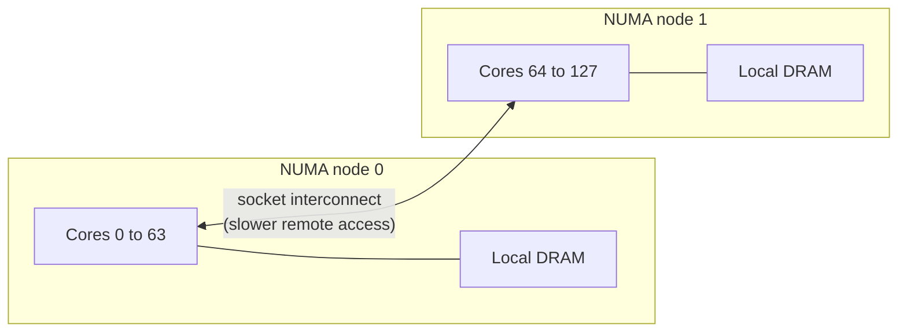
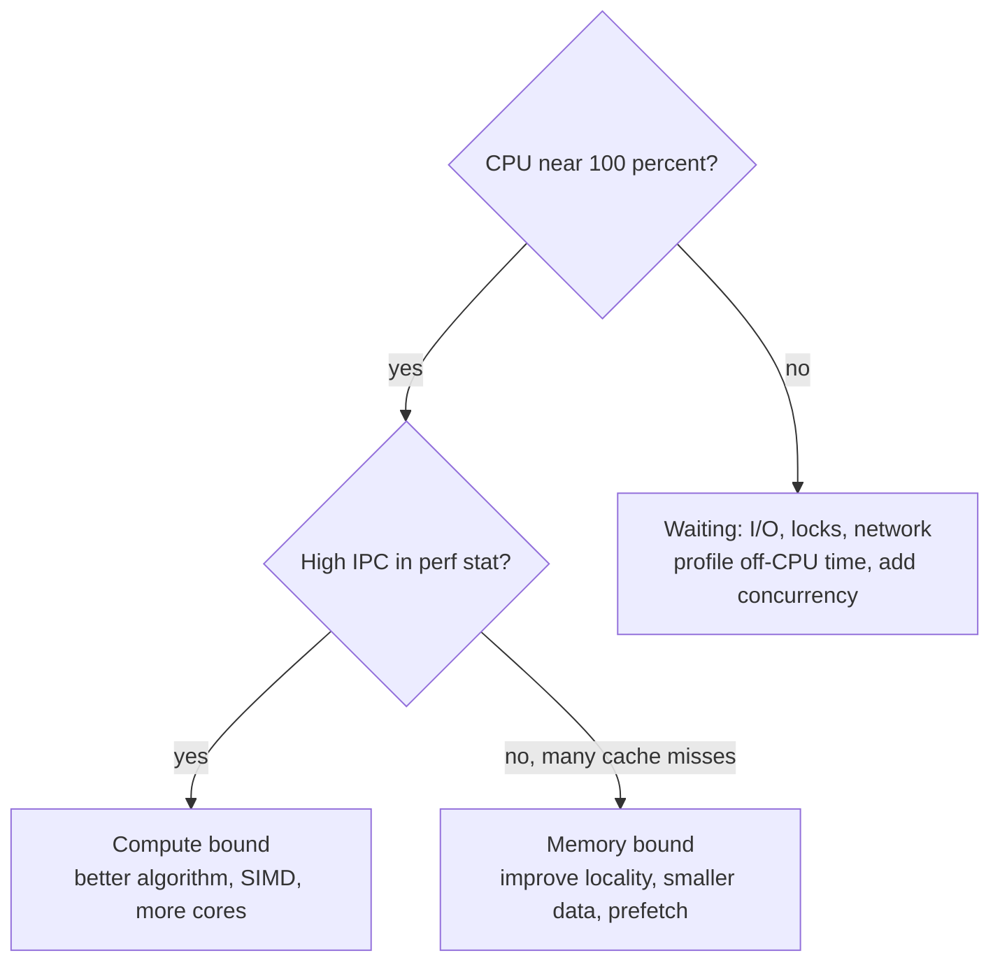

# 📘 Parallelism and Modern Hardware

Single-core speed has grown slowly since the mid-2000s.
Almost all modern performance gains come from doing more things at once: more cores, wider vector units, GPUs, and specialized accelerators.
This page explains those forms of parallelism and what they mean for the code you write.

## Table of Contents

1. [Concurrency vs Parallelism](#1-concurrency-vs-parallelism)
2. [Flynn's Taxonomy](#2-flynns-taxonomy)
3. [Levels of Parallelism](#3-levels-of-parallelism)
4. [Multi-Core and SMT](#4-multi-core-and-smt)
5. [SIMD and Vectorization](#5-simd-and-vectorization)
6. [GPUs](#6-gpus)
7. [AI Accelerators](#7-ai-accelerators)
8. [NUMA and Multi-Socket Systems](#8-numa-and-multi-socket-systems)
9. [Heterogeneous Chips, Chiplets, and Power](#9-heterogeneous-chips-chiplets-and-power)
10. [Buses and I/O](#10-buses-and-io)
11. [A Performance Mindset](#11-a-performance-mindset)
12. [Questions](#12-questions)

---

## 1. Concurrency vs Parallelism

| | Concurrency | Parallelism |
| --- | --- | --- |
| Meaning | Dealing with many tasks at once (structure) | Doing many tasks at the same instant (execution) |
| Needs multiple cores | No | Yes |
| Goal | Responsiveness, handling many independent events | Speed on a large computation |
| Example | One Node.js thread serving 10,000 connections | Splitting an image across 16 cores |

Rob Pike's phrasing: concurrency is about **structure**, parallelism is about **execution**.
A concurrent program may or may not run in parallel.

| Workload | Bottleneck | Right tool |
| --- | --- | --- |
| **CPU-bound** | Computation | Parallelism across cores, SIMD, GPU; thread count about equal to core count |
| **I/O-bound** | Waiting on network or disk | Concurrency: async I/O, event loops, many cheap threads |
| **Memory-bound** | Bandwidth or latency to RAM | Better data layout, fewer bytes, locality |

---

## 2. Flynn's Taxonomy

| Class | Instruction streams | Data streams | Example |
| --- | --- | --- | --- |
| **SISD** | 1 | 1 | Classic single-core CPU |
| **SIMD** | 1 | Many | Vector instructions (AVX, NEON), GPU warps in effect |
| **MISD** | Many | 1 | Rare; redundant flight computers |
| **MIMD** | Many | Many | Multi-core CPUs, clusters |

GPUs are often described as **SIMT** (single instruction, multiple threads): many threads run the same instruction in lockstep groups.

---

## 3. Levels of Parallelism

| Level | Granularity | Who exploits it |
| --- | --- | --- |
| **Bit-level** | Wider words (8 to 64 bit) | Hardware |
| **Instruction-level (ILP)** | Independent instructions in one thread | Pipelining, superscalar, out-of-order (see [Architecture](/docs/computer-fundamentals/digital-logic-and-computer-architecture)) |
| **Data-level (DLP)** | Same operation on many elements | SIMD, GPUs |
| **Thread-level (TLP)** | Independent threads | Multi-core, SMT |
| **Task / request level** | Independent requests or jobs | Servers, thread pools, distributed systems |
| **Machine level** | Many computers | Clusters, MapReduce, Spark, distributed training |

---

## 4. Multi-Core and SMT

A **multi-core** processor has several complete cores on one chip, each with private L1 and L2 caches and a shared L3.
Server CPUs now reach 128 to 192 cores per socket (AMD EPYC, Intel Xeon 6, ARM designs like AWS Graviton4 with 96 cores).

**Simultaneous multithreading (SMT)**, marketed as Hyper-Threading, runs two hardware threads per core.
They share execution units and caches, filling slots one thread leaves idle (for example during a cache miss).

| Question | Answer |
| --- | --- |
| Is an SMT thread as good as a core? | No; typically adds 10 to 30 percent throughput, sometimes less |
| When does SMT hurt? | Cache-heavy workloads competing for L1 and L2; security isolation (some clouds avoid sharing cores between tenants) |
| What do `nproc` and `os.cpus()` count? | Logical CPUs, including SMT siblings |

Scaling limits on multi-core:

- **Amdahl's law**: the serial part caps speedup.
- **Contention**: locks, atomic counters, and shared cache lines serialize work (see [False Sharing](/docs/computer-fundamentals/memory-hierarchy-and-caches#10-false-sharing)).
- **Memory bandwidth**: all cores share the memory channels.
- **Overheads**: thread creation, synchronization, and load imbalance.

---

## 5. SIMD and Vectorization

**SIMD** instructions apply one operation to a vector of values in a wide register.

| Extension | Register width | 32-bit floats per instruction |
| --- | --- | --- |
| SSE (x86) | 128 bits | 4 |
| AVX, AVX2 (x86) | 256 bits | 8 |
| AVX-512, AVX10 (x86) | 512 bits | 16 |
| NEON (ARM) | 128 bits | 4 |
| SVE, SVE2 (ARM) | 128 to 2048 bits, length agnostic | Depends on the chip |
| RISC-V V extension | Length agnostic | Depends on the chip |

```c
// Scalar: one add per iteration
for (int i = 0; i < n; i++) c[i] = a[i] + b[i];

// With AVX2 the compiler (or you, with intrinsics) processes 8 floats at a time
for (int i = 0; i < n; i += 8) {
    __m256 va = _mm256_loadu_ps(&a[i]);
    __m256 vb = _mm256_loadu_ps(&b[i]);
    _mm256_storeu_ps(&c[i], _mm256_add_ps(va, vb));
}
```

Ways to get SIMD:

1. **Auto-vectorization**: compilers vectorize simple loops at `-O2` / `-O3`; check with `-fopt-info-vec` (GCC) or `-Rpass=loop-vectorize` (Clang).
2. **Libraries**: NumPy, BLAS, simdjson, Arrow compute kernels, and database engines (DuckDB, ClickHouse) already use SIMD.
3. **Portable APIs**: Java Vector API (incubating), C# `Vector<T>`, Rust `std::simd` (nightly), Highway (C++).
4. **Intrinsics or assembly**: maximum control, least portable.

What blocks vectorization: branches inside the loop, pointer aliasing (fix with `restrict`), non-contiguous access, and loop-carried dependencies.
Data layout matters: structure-of-arrays vectorizes far better than array-of-structures.

---

## 6. GPUs

A **GPU** trades single-thread speed for massive throughput: thousands of simple cores, very high memory bandwidth, and hardware thread scheduling that hides memory latency by switching between many threads.

| | CPU | GPU |
| --- | --- | --- |
| Cores | Tens to about 200, complex | Thousands of simple lanes |
| Optimized for | Latency of one thread, branchy code | Throughput of many identical operations |
| Memory | Large DRAM, ~100 to 500 GB/s | HBM or GDDR, 1 to 8 TB/s |
| Latency hiding | Caches, out-of-order execution | Switching among many resident threads |
| Good at | OS, databases, business logic | Graphics, matrix math, ML, simulations, video |

### CUDA execution model (NVIDIA; AMD ROCm/HIP is similar)

| Concept | Meaning |
| --- | --- |
| **Kernel** | A function run by many threads in parallel |
| **Thread** | One instance of the kernel |
| **Warp** (32 threads; AMD "wavefront" of 32 or 64) | Executes one instruction at a time in lockstep |
| **Block** | Group of threads sharing fast **shared memory** and able to synchronize |
| **Grid** | All blocks of a kernel launch |
| **Streaming multiprocessor (SM)** | Hardware unit that runs blocks |
| **Tensor cores** | Units for small matrix multiply-accumulate in low precision (FP16, BF16, FP8, FP4) |

```cpp
__global__ void add(const float *a, const float *b, float *c, int n) {
    int i = blockIdx.x * blockDim.x + threadIdx.x;
    if (i < n) c[i] = a[i] + b[i];
}
// launch: add<<<(n + 255) / 256, 256>>>(a, b, c, n);
```

GPU performance pitfalls:

| Pitfall | Why |
| --- | --- |
| **Warp divergence** | If threads in a warp take different branches, both paths run serially |
| **Uncoalesced memory access** | Neighboring threads should read neighboring addresses so one transaction serves the warp |
| **Host-device transfers** | PCIe is much slower than GPU memory; keep data on the GPU |
| **Low occupancy** | Not enough threads to hide latency |
| **Small kernels** | Launch overhead dominates |

GPU programming options, from high to low level: PyTorch, JAX, RAPIDS, then Triton, then CUDA C++ / HIP, plus cross-vendor Vulkan compute, Metal on Apple, and WebGPU in browsers.

---

## 7. AI Accelerators

| Accelerator | Notes |
| --- | --- |
| **NVIDIA data center GPUs** (Hopper H100/H200, Blackwell B200/GB200, Blackwell Ultra) | Tensor cores, HBM3E, NVLink between GPUs; rack-scale systems link 72 GPUs as one domain |
| **AMD Instinct** (MI300X, MI325X, MI350 series) | Large HBM capacity, ROCm software stack |
| **Google TPU** (v5e, v5p, Trillium v6e, Ironwood v7) | Systolic arrays for matrix math, pods connected by optical interconnects |
| **AWS Trainium and Inferentia** | Custom training and inference chips |
| **NPUs in laptops and phones** | Apple Neural Engine, Qualcomm Hexagon, Intel and AMD NPUs for on-device AI |

Why specialized hardware wins for AI: neural networks are dominated by **matrix multiplication** in **low precision**, which is highly parallel and predictable.
Large model inference is often **memory-bandwidth bound** (every token reads all the weights), which is why HBM bandwidth and quantization (8-bit and 4-bit weights) matter so much.

---

## 8. NUMA and Multi-Socket Systems

In a **NUMA** (non-uniform memory access) system, each CPU socket (or chiplet group) has its own local memory.
Accessing another socket's memory crosses an interconnect and is slower.



| Practice | Tool |
| --- | --- |
| See the topology | `lscpu`, `numactl --hardware`, `lstopo` |
| Pin a process to a node | `numactl --cpunodebind=0 --membind=0 ./app` |
| First-touch policy | Memory is allocated on the node of the thread that first writes it, so initialize data on the thread that will use it |
| Databases and JVMs | NUMA-aware allocators, `-XX:+UseNUMA` for some JVM collectors |

---

## 9. Heterogeneous Chips, Chiplets, and Power

| Trend | Meaning |
| --- | --- |
| **Performance + efficiency cores** | Apple silicon, Intel P and E cores, ARM big.LITTLE; the OS places background work on efficiency cores |
| **SoC integration** | CPU, GPU, NPU, media engines, and memory in one package (Apple M-series, Snapdragon X); **unified memory** lets CPU and GPU share data without copies |
| **Chiplets** | Several smaller dies in one package (AMD EPYC and Ryzen, Intel Xeon 6, NVIDIA Blackwell); better yields, mix process nodes |
| **3D stacking** | Cache or memory stacked on logic (AMD 3D V-Cache, HBM) |
| **Process nodes** | "3 nm" and "2 nm" are marketing names, not literal feature sizes; TSMC N2 and Intel 18A entered production in 2025 |

**Power and heat** now limit performance more than transistor count.
Dynamic power is roughly proportional to **capacitance x voltage^2 x frequency**, so higher clocks need higher voltage and power grows much faster than speed.
Chips **boost** when cool and **throttle** when hot, which is why sustained benchmarks differ from short bursts, and why laptops slow down under long loads.

---

## 10. Buses and I/O

| Interconnect | Typical bandwidth | Connects |
| --- | --- | --- |
| **PCIe 4.0 x16** | About 32 GB/s each way | GPUs, NVMe drives, NICs |
| **PCIe 5.0 x16** | About 64 GB/s each way | Current servers |
| **PCIe 6.0 x16** | About 128 GB/s each way | Newest platforms |
| **DDR5 channel** | About 40 to 70 GB/s | CPU to DRAM |
| **NVLink (5th gen)** | 1.8 TB/s per GPU | GPU to GPU |
| **CXL** | Uses PCIe physical layer | Coherent memory expansion and accelerators |
| **USB4 / Thunderbolt 5** | 40 to 80 Gbps (120 Gbps boost for TB5) | Peripherals, external displays |
| **Ethernet (data center)** | 100 to 800 Gbps per port | Servers and switches |

I/O devices talk to the CPU via **memory-mapped I/O** (device registers appear at memory addresses), **interrupts**, and **DMA** (the device writes directly to RAM).
See [OS Fundamentals](/docs/operating-systems/os-fundamentals) for how the kernel handles them.

---

## 11. A Performance Mindset

1. **Measure first.** Profile with `perf`, flame graphs, async-profiler, `pprof`, or Instruments; guesses about bottlenecks are usually wrong.
2. **Find the bound.** Is the program limited by compute, memory bandwidth, memory latency, I/O, or locks?
3. **Fix the algorithm and data layout before micro-optimizing.** An O(n log n) algorithm with good locality beats a tuned O(n^2) one.
4. **Parallelize the right amount.** Match threads to cores for CPU work; use async or many cheap threads for I/O.
5. **Reduce data movement.** Moving data costs more energy and time than computing on it.

**Roofline model**: a kernel's attainable performance is the lower of the chip's peak compute and (memory bandwidth x **arithmetic intensity**), where arithmetic intensity is operations per byte moved.
Low-intensity code (adding two arrays: 1 operation per 12 bytes) is memory bound no matter how many cores you add; high-intensity code (large matrix multiplication) can reach peak compute.



---

## 12. Questions

| Question | Short answer |
| --- | --- |
| Concurrency vs parallelism? | Structuring many tasks vs executing simultaneously |
| CPU-bound vs I/O-bound, and thread counts? | About one thread per core vs many threads or async |
| What is Flynn's taxonomy? | SISD, SIMD, MISD, MIMD by instruction and data streams |
| What is SMT? | Two hardware threads share one core's units; modest throughput gain |
| What is SIMD and how do you get it? | One instruction on many values; auto-vectorization, libraries, intrinsics |
| CPU vs GPU? | Few complex cores for latency vs thousands of simple lanes for throughput |
| What is warp divergence? | Threads in a warp taking different branches serialize both paths |
| Why are GPUs good for deep learning? | Massive parallel low-precision matrix math and high memory bandwidth |
| What is NUMA? | Memory attached to each socket; remote access is slower; pin and allocate locally |
| Why did clock speeds stop rising? | End of Dennard scaling: power and heat grow too fast with frequency |
| What is the roofline model? | Performance bounded by peak compute or bandwidth x arithmetic intensity |
| Why can adding threads make a program slower? | Contention, false sharing, bandwidth limits, overhead |

Next: [Computer Fundamentals Interview Playbook](/docs/computer-fundamentals/computer-fundamentals-interview-playbook).
