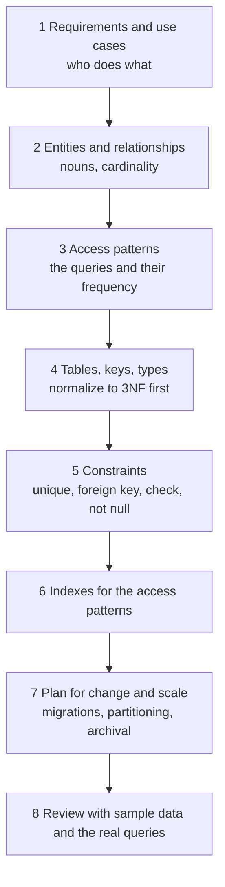
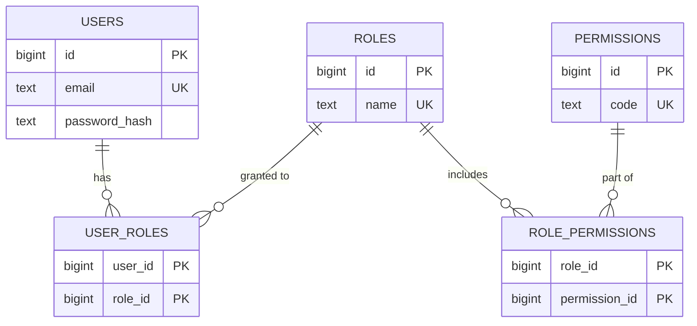
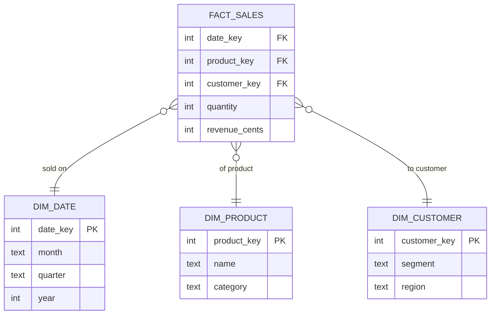
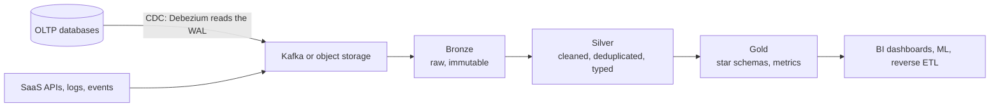

# 📘 Data Modeling Patterns

A good schema makes correct code easy and wrong code impossible.
This page collects the patterns that come up repeatedly in interviews and real systems, each with a runnable SQL example (SQLite, portable to PostgreSQL and MySQL with small syntax changes).
It builds on [Database Fundamentals](/docs/databases/database-fundamentals) and pairs with the design case studies in [System Design](/docs/system-design).

## Table of Contents

1. [The Modeling Process](#1-the-modeling-process)
2. [Money, Snapshots and Orders](#2-money-snapshots-and-orders)
3. [Users, Roles and Permissions](#3-users-roles-and-permissions)
4. [Hierarchies and Trees](#4-hierarchies-and-trees)
5. [History, Soft Delete and SCD Type 2](#5-history-soft-delete-and-scd-type-2)
6. [Double-Entry Ledger](#6-double-entry-ledger)
7. [Multi-Tenancy](#7-multi-tenancy)
8. [Flexible Attributes](#8-flexible-attributes)
9. [Analytics Modeling](#9-analytics-modeling)
10. [Anti-Patterns](#10-anti-patterns)
11. [Questions and Answers](#11-questions-and-answers)

---

## 1. The Modeling Process



Questions to ask about every table:

- What is the **grain**: one row represents exactly what?
- What is the **primary key**, and what natural unique keys must also be enforced?
- Which **columns can change**, and does history matter?
- What is the **lifecycle** (states and allowed transitions)?
- How big will it get, and how is old data archived?
- Who reads it, and by which columns?

---

## 2. Money, Snapshots and Orders

Two rules that prevent the most expensive bugs:

1. **Store money as integers** (minor units such as cents) plus a currency code, or as `NUMERIC(p, s)`. Never floats.
2. **Copy the values that must not change later** into the order. Product prices, names, tax rates and addresses change, but an order records what was true at purchase time. This is a legitimate use of denormalization, not redundancy.

```sql
-- runnable
CREATE TABLE products (id INTEGER PRIMARY KEY, name TEXT NOT NULL, price_cents INTEGER NOT NULL CHECK (price_cents >= 0));
CREATE TABLE orders (
  id INTEGER PRIMARY KEY,
  status TEXT NOT NULL CHECK (status IN ('NEW','PAID','SHIPPED','CANCELLED')),
  currency TEXT NOT NULL DEFAULT 'USD',
  ship_to TEXT NOT NULL                       -- address snapshot, not a foreign key to a mutable address row
);
CREATE TABLE order_items (
  order_id INTEGER NOT NULL REFERENCES orders(id),
  line_no INTEGER NOT NULL,
  product_id INTEGER NOT NULL REFERENCES products(id),
  product_name TEXT NOT NULL,                 -- snapshot
  unit_price_cents INTEGER NOT NULL CHECK (unit_price_cents >= 0),   -- snapshot
  qty INTEGER NOT NULL CHECK (qty > 0),
  PRIMARY KEY (order_id, line_no)
);

INSERT INTO products VALUES (1, 'Keyboard', 4500);
INSERT INTO orders VALUES (1, 'PAID', 'USD', '12 Main St');
INSERT INTO order_items VALUES (1, 1, 1, 'Keyboard', 4500, 2);

-- the price changes later: history must not
UPDATE products SET price_cents = 5200, name = 'Keyboard Pro' WHERE id = 1;

SELECT oi.product_name, oi.unit_price_cents, oi.qty, oi.unit_price_cents * oi.qty AS line_total_cents,
       p.price_cents AS current_price_cents
FROM order_items oi JOIN products p ON p.id = oi.product_id WHERE oi.order_id = 1;
```

Order design notes:

- The **order total** can be derived (`SUM` of lines) or stored with a check that it matches. Storing is convenient for reporting, but keep it consistent in one transaction.
- **Status** as a `CHECK` list or a lookup table, and enforce transitions in code (a state machine), see [Design Patterns](/docs/system-design/lld/design-patterns).
- **Inventory** is a separate table with `CHECK (qty >= 0)`, decremented atomically, see [Transactions](/docs/databases/transactions-and-concurrency).
- **Never delete** financial rows. Reverse them with a new row (refund, credit note).
- Add `created_at`, `updated_at`, and a **version** column where concurrent edits matter.
- Payments use an **idempotency key** with a unique constraint.

---

## 3. Users, Roles and Permissions

Role-based access control (RBAC) is a chain of many-to-many tables.



Notes:

- Store **password hashes** (Argon2id, bcrypt, scrypt), never passwords, see [Backend security](/docs/backend/authentication-and-security).
- Make `email` unique **case-insensitively** (`lower(email)` unique index, or `citext` in PostgreSQL).
- For larger systems with resource-level rules ("editor of this document"), add a `(subject, relation, object)` table, the **relationship-based access control** model used by Google Zanzibar and open-source clones.
- Cache permission checks, and remember that revocation must propagate.

---

## 4. Hierarchies and Trees

Categories, org charts, comments, folders, bill of materials.
There are four classic models.

| Model | Structure | Read subtree | Move subtree | Notes |
| --- | --- | --- | --- | --- |
| **Adjacency list** | `parent_id` on each row | Recursive CTE | Update one row | Simplest, the default. Needs `WITH RECURSIVE` (all modern databases) |
| **Materialized path** | `path` string like `/1/2/3/` | `LIKE '/1/2/%'` (prefix, indexable) | Rewrite paths of the subtree | Fast reads, easy breadcrumb, path length limits |
| **Closure table** | Row per (ancestor, descendant, depth) | Simple join, no recursion | Rewrite closure rows | Fast any-depth queries, more storage, write cost |
| **Nested sets** | `lft` and `rgt` numbers | Range query | Renumber many rows | Fast reads, very expensive writes, rarely a good choice now |

```sql
-- runnable
CREATE TABLE categories (id INTEGER PRIMARY KEY, parent_id INTEGER REFERENCES categories(id), name TEXT NOT NULL, path TEXT NOT NULL);
INSERT INTO categories VALUES
  (1, NULL, 'Electronics',     '/1/'),
  (2, 1,    'Computers',       '/1/2/'),
  (3, 2,    'Laptops',         '/1/2/3/'),
  (4, 1,    'Phones',          '/1/4/'),
  (5, 3,    'Gaming Laptops',  '/1/2/3/5/');

-- Adjacency list: the subtree under Computers (id 2), with depth
WITH RECURSIVE sub(id, name, depth) AS (
  SELECT id, name, 0 FROM categories WHERE id = 2
  UNION ALL
  SELECT c.id, c.name, s.depth + 1 FROM categories c JOIN sub s ON c.parent_id = s.id
)
SELECT id, name, depth FROM sub ORDER BY depth, id;

-- Adjacency list: the breadcrumb from a leaf up to the root
WITH RECURSIVE up(id, parent_id, name, level) AS (
  SELECT id, parent_id, name, 0 FROM categories WHERE id = 5
  UNION ALL
  SELECT c.id, c.parent_id, c.name, u.level + 1 FROM categories c JOIN up u ON c.id = u.parent_id
)
SELECT name FROM up ORDER BY level DESC;

-- Materialized path: the same subtree with one indexable prefix match and no recursion
SELECT id, name FROM categories WHERE path LIKE '/1/2/%' ORDER BY path;

-- Closure table: build it once, then any-depth queries are plain joins
CREATE TABLE closure (ancestor INTEGER, descendant INTEGER, depth INTEGER, PRIMARY KEY (ancestor, descendant));
WITH RECURSIVE t(ancestor, descendant, depth) AS (
  SELECT id, id, 0 FROM categories
  UNION ALL
  SELECT t.ancestor, c.id, t.depth + 1 FROM t JOIN categories c ON c.parent_id = t.descendant
)
INSERT INTO closure SELECT * FROM t;

SELECT c.name, cl.depth FROM closure cl JOIN categories c ON c.id = cl.descendant
WHERE cl.ancestor = 2 ORDER BY cl.depth, c.id;
```

Choosing: start with the **adjacency list** and a recursive CTE.
Add a **materialized path** when you read subtrees and breadcrumbs constantly.
Use a **closure table** when queries are deep and frequent and moves are rare.
Guard against cycles (a node becoming its own ancestor) with a depth limit in recursive queries and validation on writes.

Graph-like data with many hops and cycles may fit a graph database, see [NoSQL Databases](/docs/databases/nosql-databases).

---

## 5. History, Soft Delete and SCD Type 2

### 5.1 Soft Delete

Mark rows deleted instead of removing them: `deleted_at TIMESTAMP NULL`.

- **Every query must filter it.** Forgetting `WHERE deleted_at IS NULL` leaks deleted data. Use a **view** or ORM default scope.
- **Unique constraints break:** a deleted user's email blocks re-registration. Use a **partial unique index**: `UNIQUE (email) WHERE deleted_at IS NULL`.
- Foreign keys still point at deleted rows, which is often what you want (an old order keeps its customer).
- Legal erasure (GDPR) needs real deletion or anonymization, so soft delete is not compliance.
- Archive very old soft-deleted rows to cold storage to keep tables small.

### 5.2 Audit Trail

Record who changed what and when: an `audit_log` table (entity, id, action, actor, before, after, timestamp) written by the application or by triggers, or use **temporal tables** (SQL Server system-versioned tables, MariaDB, and the `temporal_tables` extension for PostgreSQL).
Append-only, never updated.

### 5.3 Slowly Changing Dimensions (SCD Type 2)

When history matters ("what city was this customer in when they bought?"), keep every version with a validity interval.

| Type | Behavior |
| --- | --- |
| **Type 1** | Overwrite, no history |
| **Type 2** | New row per change, with `valid_from`, `valid_to`, `is_current` |
| **Type 3** | Extra column for the previous value (limited history) |

```sql
-- runnable
CREATE TABLE dim_customer (
  sk INTEGER PRIMARY KEY,                 -- surrogate key: one per VERSION
  customer_id INTEGER NOT NULL,           -- business key: constant across versions
  city TEXT NOT NULL,
  valid_from TEXT NOT NULL,
  valid_to TEXT NOT NULL,
  is_current INTEGER NOT NULL
);
INSERT INTO dim_customer VALUES
  (1, 42, 'Pune',   '2024-01-01', '2025-06-30', 0),
  (2, 42, 'Mumbai', '2025-07-01', '9999-12-31', 1);

-- The customer moves. Close the current version and insert the new one (do both in one transaction).
BEGIN;
UPDATE dim_customer SET valid_to = '2026-02-28', is_current = 0 WHERE customer_id = 42 AND is_current = 1;
INSERT INTO dim_customer VALUES (3, 42, 'Delhi', '2026-03-01', '9999-12-31', 1);
COMMIT;

-- Point-in-time lookups: which city on a given date?
SELECT '2024-12-01' AS on_date, city FROM dim_customer WHERE customer_id = 42 AND '2024-12-01' BETWEEN valid_from AND valid_to
UNION ALL
SELECT '2025-08-15', city FROM dim_customer WHERE customer_id = 42 AND '2025-08-15' BETWEEN valid_from AND valid_to
UNION ALL
SELECT '2026-05-01', city FROM dim_customer WHERE customer_id = 42 AND '2026-05-01' BETWEEN valid_from AND valid_to;

-- Current state only
SELECT customer_id, city FROM dim_customer WHERE is_current = 1;
```

In a fact table, store the dimension's **surrogate key** (`sk`), so each fact points at the version that was true when it happened.
To prevent overlapping validity intervals, PostgreSQL offers `EXCLUDE USING gist (customer_id WITH =, tstzrange(valid_from, valid_to) WITH &&)`.

---

## 6. Double-Entry Ledger

Money movement should be recorded as **immutable entries that sum to zero**.
Every transaction has two or more entries, debits and credits, and the total per transaction is exactly zero.
Balances are derived, never edited.

```sql
-- runnable
CREATE TABLE ledger_tx (id INTEGER PRIMARY KEY, memo TEXT NOT NULL);
CREATE TABLE ledger_entries (
  id INTEGER PRIMARY KEY,
  tx_id INTEGER NOT NULL REFERENCES ledger_tx(id),
  account TEXT NOT NULL,
  amount_cents INTEGER NOT NULL             -- positive = debit, negative = credit
);

INSERT INTO ledger_tx VALUES (1, 'customer pays invoice 100'), (2, 'partial refund');
INSERT INTO ledger_entries (tx_id, account, amount_cents) VALUES
  (1, 'cash',     10000), (1, 'revenue', -10000),
  (2, 'revenue',   2500), (2, 'cash',     -2500);

-- Invariant: every transaction balances. This query must return no rows.
SELECT tx_id, SUM(amount_cents) AS imbalance FROM ledger_entries GROUP BY tx_id HAVING SUM(amount_cents) <> 0;

-- Balances are derived from the entries
SELECT account, SUM(amount_cents) AS balance_cents FROM ledger_entries GROUP BY account ORDER BY account;

-- The whole ledger always sums to zero
SELECT SUM(amount_cents) AS total FROM ledger_entries;
```

Design rules:

- **Append-only:** corrections are new reversing entries, never `UPDATE` or `DELETE` (enforce with permissions or triggers).
- Insert all entries of one transaction **in one database transaction**, and verify the sum is zero (a deferred constraint trigger, or in the service).
- Keep **currency** on each entry, and never mix currencies in one balance.
- For speed, maintain a **balance snapshot** table updated in the same transaction, and reconcile it against the entries.
- Reconcile against external systems (payment provider) regularly, see the payment design in [Large-Scale Designs](/docs/system-design/hld/large-scale-designs).

---

## 7. Multi-Tenancy

A SaaS product serves many customers (tenants) from one system.

| Model | Isolation | Cost and operations | Good for |
| --- | --- | --- | --- |
| **Shared tables, `tenant_id` column** | Logical (queries and row-level security) | Cheapest, one schema to migrate, scales to many small tenants | Most SaaS |
| **Schema per tenant** | Medium (separate namespaces, one database) | Migrations run per schema, catalog size grows (thousands of schemas strain PostgreSQL) | Tens to hundreds of tenants with custom needs |
| **Database per tenant** | Strong (separate databases or instances) | Most expensive and most operational work, easiest per-tenant backup, restore and data residency | Enterprise tenants, strict compliance, large tenants |

For the shared-table model:

- Put `tenant_id` first in indexes and in composite primary keys, and in **every** query.
- Use **composite foreign keys** `(tenant_id, customer_id)` so a row cannot reference another tenant's data.
- Enforce isolation in the database with **row-level security** so a missing `WHERE` cannot leak data:

```text
ALTER TABLE invoices ENABLE ROW LEVEL SECURITY;
CREATE POLICY tenant_isolation ON invoices
  USING (tenant_id = current_setting('app.tenant_id')::bigint);

-- per request, after connecting (or per transaction with SET LOCAL):
SET app.tenant_id = '17';
SELECT * FROM invoices;        -- only tenant 17 rows, whatever the query says
```

- Guard against **noisy neighbors** with per-tenant rate limits and quotas.
- Plan to **move a large tenant** to its own shard or database, the [sharding key](/docs/databases/replication-sharding-and-operations) is usually `tenant_id`.
- Store `tenant_id` on child tables even when derivable through a parent, so sharding and RLS stay simple.

---

## 8. Flexible Attributes

Sometimes each row has different attributes (product specs, form responses, event payloads).

| Approach | Structure | Pros | Cons |
| --- | --- | --- | --- |
| **Sparse columns** | Many nullable columns | Typed, indexable, simple | Wide tables when variety is high |
| **EAV** (entity, attribute, value) | Row per attribute | Unlimited attributes | Untyped, awkward queries and joins, poor performance, usually an anti-pattern |
| **JSON column** (`JSONB` in PostgreSQL) | Document per row | Flexible, queryable, indexable | Weaker constraints, harder analytics, schema in the application |
| **Table inheritance patterns** | Single table with a type column, class table per subtype, or concrete tables | Models subtypes | Nullable columns vs many joins trade-off |
| **Document database** | Whole records as documents | Natural fit for nested data | Loses relational integrity |

Hybrid is often best: **typed columns for the fields you filter, join and constrain on, and one JSON column for the long tail**.

```sql
-- runnable
CREATE TABLE events (id INTEGER PRIMARY KEY, user_id INTEGER NOT NULL, created_at TEXT NOT NULL, payload TEXT NOT NULL CHECK (json_valid(payload)));
INSERT INTO events VALUES
  (1, 7, '2026-05-01', '{"type":"click","page":"/home","meta":{"ab":"B"}}'),
  (2, 7, '2026-05-01', '{"type":"purchase","amount_cents":4500,"items":["K1","M2"]}'),
  (3, 8, '2026-05-02', '{"type":"click","page":"/pricing","meta":{"ab":"A"}}');

-- Index the JSON field you query most, as an expression index (PostgreSQL: a GIN index or an expression index)
CREATE INDEX idx_events_type ON events (json_extract(payload, '$.type'));

SELECT id, json_extract(payload, '$.page') AS page
FROM events WHERE json_extract(payload, '$.type') = 'click' ORDER BY id;

SELECT json_extract(payload, '$.meta.ab') AS variant, COUNT(*) AS clicks
FROM events WHERE json_extract(payload, '$.type') = 'click' GROUP BY variant ORDER BY variant;

SELECT SUM(json_extract(payload, '$.amount_cents')) AS revenue_cents FROM events;
```

PostgreSQL syntax: `payload->>'type'`, `payload @> '{"type":"click"}'` (containment, GIN-indexable), `jsonb_path_query`.
MySQL: `payload->>'$.type'` and generated columns for indexing.

---

## 9. Analytics Modeling

Analytical queries scan huge ranges and aggregate.
Model them differently from OLTP, in a warehouse or lakehouse, see [OLTP vs OLAP](/docs/databases/database-fundamentals).

### 9.1 Star Schema

A central **fact table** (events or measurements, one row per **grain**, for example one order line) surrounded by **dimension tables** (descriptive context: date, product, customer, store).



```sql
-- runnable
CREATE TABLE dim_date (date_key INTEGER PRIMARY KEY, month TEXT, quarter TEXT);
CREATE TABLE dim_product (product_key INTEGER PRIMARY KEY, name TEXT, category TEXT);
CREATE TABLE fact_sales (date_key INTEGER, product_key INTEGER, quantity INTEGER, revenue_cents INTEGER);
INSERT INTO dim_date VALUES (20260115, '2026-01', 'Q1'), (20260220, '2026-02', 'Q1'), (20260410, '2026-04', 'Q2');
INSERT INTO dim_product VALUES (1, 'Keyboard', 'Accessories'), (2, 'Mouse', 'Accessories'), (3, 'Monitor', 'Displays');
INSERT INTO fact_sales VALUES
  (20260115, 1, 2, 9000), (20260115, 3, 1, 15000), (20260220, 2, 5, 10000),
  (20260220, 3, 2, 30000), (20260410, 1, 1, 4500), (20260410, 3, 1, 15000);

-- The typical analytic query: join the fact to dimensions, group by dimension attributes
SELECT d.quarter, p.category, SUM(f.revenue_cents) AS revenue_cents, SUM(f.quantity) AS units
FROM fact_sales f
JOIN dim_date d    ON d.date_key = f.date_key
JOIN dim_product p ON p.product_key = f.product_key
GROUP BY d.quarter, p.category
ORDER BY d.quarter, p.category;
```

| Term | Meaning |
| --- | --- |
| **Grain** | What one fact row is. Decide it first and never mix grains |
| **Additive facts** | Can be summed across all dimensions (revenue). Semi-additive (balances) cannot be summed over time |
| **Snowflake schema** | Dimensions normalized into sub-dimensions, less redundancy, more joins |
| **Conformed dimensions** | Shared dimensions (date, customer) reused across fact tables |
| **Surrogate keys** | Warehouse-generated keys on dimensions, enabling SCD Type 2 |
| **Wide denormalized tables** | Common in columnar warehouses where joins are avoided and compression is strong |
| **Data vault** | Hubs, links and satellites, for auditability of many source systems |

### 9.2 Pipeline Shape



- **ELT over ETL:** load raw data first, transform inside the warehouse with SQL (tools like **dbt** version and test transformations).
- **Change data capture** streams row changes from the OLTP log without hammering the primary.
- **Lakehouse table formats** (Apache **Iceberg**, **Delta Lake**, **Hudi**) add ACID transactions, schema evolution and time travel to Parquet files on object storage.
- **Columnar engines** for queries: BigQuery, Snowflake, Redshift, ClickHouse, DuckDB. The 2025 to 2026 trend is analytics on the lake with ClickHouse or DuckDB, and columnar tables reachable from within Postgres.
- **Materialized views and pre-aggregation** serve dashboards.
- **Data quality:** tests for uniqueness, not-null, referential integrity, freshness and row counts, run on every load.

---

## 10. Anti-Patterns

| Anti-pattern | Problem | Better |
| --- | --- | --- |
| Comma-separated values in a column | Cannot constrain, index or join | Junction table, or array or JSON with intent |
| Money in floats | Rounding errors | Integer cents or `NUMERIC` |
| One giant "god" table | Wide, sparse, unclear grain | Normalize by entity |
| EAV for everything | No types, terrible queries | Typed columns plus JSON for the tail |
| Polymorphic foreign key (`owner_type`, `owner_id`) | No referential integrity | Separate FKs or a supertype table |
| Storing files in the database | Bloats backups and buffer cache | Object storage plus a reference |
| Random UUIDv4 as clustered key | Page splits and cache misses | UUIDv7 or bigint |
| Missing foreign keys "for performance" | Orphans and silent corruption | Keep them, index the child column |
| Business rules only in application code | Concurrent writers bypass them | Constraints in the schema |
| Dates as strings | Wrong ordering, no time zones | `DATE`, `TIMESTAMPTZ`, store UTC |
| Undefined delete behavior | Orphans or accidental cascades | Explicit `ON DELETE` choices |
| Reusing a status column for many meanings | Ambiguity | Separate columns or state tables |
| Analytics on the OLTP primary | Slows customers down | Replica or warehouse |

---

## 11. Questions and Answers

**Q1. How do you model a many-to-many relationship?**
A junction table with foreign keys to both tables and a composite primary key on the pair, plus extra columns if the relationship has attributes.

**Q2. Why store the price on the order line instead of joining to the product?**
The product price changes, but the order must record what the customer agreed to.
It is a historical snapshot, and it also keeps order queries fast.

**Q3. Compare hierarchy models.**
Adjacency list is simplest and needs recursive queries.
Materialized path gives fast subtree reads by prefix.
Closure table gives fast any-depth queries with extra storage.
Nested sets read fast but writes are costly.

**Q4. What is SCD Type 2?**
Keeping a new row for each change of a dimension attribute, with valid-from and valid-to dates and a current flag, so facts can join to the version that was true at the time.

**Q5. How do you implement soft delete correctly?**
A `deleted_at` column, a view or default scope that filters it, partial unique indexes for constraints, and awareness that it is not a substitute for real erasure.

**Q6. How would you design a multi-tenant SaaS schema?**
Usually shared tables with `tenant_id` first in keys and indexes, composite foreign keys, and row-level security.
Move large or regulated tenants to separate schemas, shards or databases.

**Q7. How does a double-entry ledger prevent errors?**
Every transaction's entries sum to zero, entries are immutable, and balances are derived, so money cannot appear or vanish and history is auditable.

**Q8. When is JSON in a relational database appropriate?**
For sparse or evolving attributes read as a unit, alongside typed columns for anything you filter, join or constrain.
Index the fields you query.

**Q9. What is the grain of a fact table and why does it matter?**
The meaning of one row (for example one order line).
Mixing grains produces double counting and wrong aggregates.

**Q10. Star schema vs normalized OLTP schema?**
OLTP normalizes for consistent writes.
A star schema denormalizes into facts and dimensions for fast aggregate reads, loaded in batches or streams from the OLTP data.

**Q11. How do you keep a materialized aggregate correct?**
Update it in the same transaction, or rebuild it from the source of truth on a schedule, and reconcile periodically.
Never let it become the only copy.

**Q12. How do you prevent one tenant reading another's data?**
`tenant_id` in every query enforced by row-level security, composite foreign keys, tenant-scoped connections or session variables, and tests that try cross-tenant access.

Next: [Database Interview Playbook](/docs/databases/database-interview-playbook).
