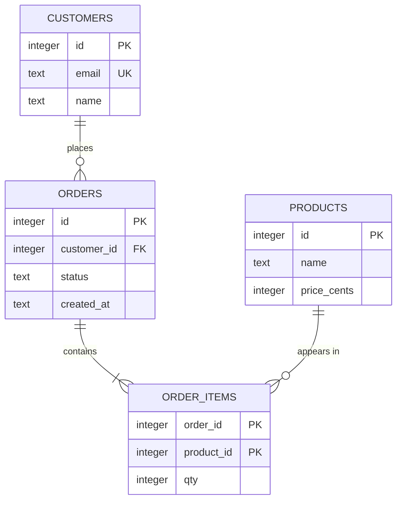
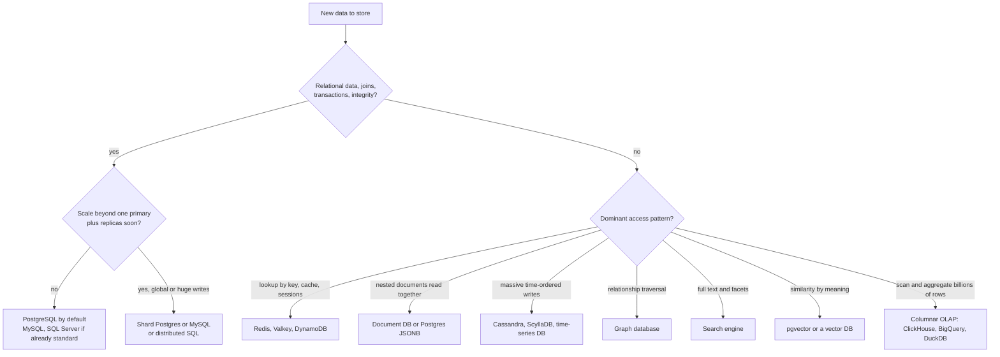

# 📘 Database Fundamentals

This page is the foundation for the whole Databases section.
It explains what a database does for you, how relational data is structured, how to keep it consistent with keys and constraints, and how to pick the right kind of database.
SQL snippets are portable and were executed on SQLite, so you can paste them into any SQL shell.

## Table of Contents

1. [What a Database Gives You](#1-what-a-database-gives-you)
2. [The Database Landscape](#2-the-database-landscape)
3. [The Relational Model](#3-the-relational-model)
4. [Keys and Constraints](#4-keys-and-constraints)
5. [Relationships and ER Diagrams](#5-relationships-and-er-diagrams)
6. [Normalization](#6-normalization)
7. [Data Types and NULL](#7-data-types-and-null)
8. [OLTP vs OLAP](#8-oltp-vs-olap)
9. [Choosing a Database](#9-choosing-a-database)
10. [Beginner Questions](#10-beginner-questions)

---

## 1. What a Database Gives You

You could store data in files.
A **database management system (DBMS)** adds the parts that are hard to get right yourself.

| Capability | What it means |
| --- | --- |
| **Durability** | Committed data survives crashes, using a write-ahead log |
| **Concurrency control** | Many users read and write at once without corrupting each other |
| **Transactions** | A group of changes either all happens or none of it does |
| **Query language** | Declare what you want (SQL), the engine decides how |
| **Indexes** | Find rows fast without scanning everything |
| **Integrity constraints** | The database rejects invalid data (missing parent, duplicate key) |
| **Security** | Users, roles, permissions, encryption, auditing |
| **Tooling** | Backups, replication, monitoring, migrations |

The core promise: **the application states the rules once in the schema, and every writer, in every language, is held to them.**

---

## 2. The Database Landscape

| Family | Model | Examples | Best for |
| --- | --- | --- | --- |
| **Relational (RDBMS)** | Tables, rows, SQL, joins, transactions | PostgreSQL, MySQL, MariaDB, SQL Server, Oracle, SQLite | Almost everything, the default choice |
| **Document** | JSON-like documents | MongoDB, Firestore, Couchbase | Nested, evolving records read as a unit |
| **Key-value** | key to value | Redis, Valkey, DynamoDB, Memcached | Caches, sessions, very fast lookups at scale |
| **Wide-column** | Row key, column families | Cassandra, ScyllaDB, HBase, Bigtable | Huge write volume, time-ordered data |
| **Graph** | Nodes and edges | Neo4j, Amazon Neptune | Relationship traversal (fraud, recommendations) |
| **Time-series** | Timestamped points | TimescaleDB, InfluxDB, Prometheus | Metrics, IoT |
| **Search** | Inverted index | Elasticsearch, OpenSearch | Full text, faceting |
| **Vector** | Embeddings and ANN index | pgvector, Qdrant, Pinecone, Milvus | Semantic search, RAG |
| **Columnar OLAP** | Column-oriented storage | ClickHouse, BigQuery, Snowflake, DuckDB | Analytics, aggregates over billions of rows |
| **Distributed SQL** | SQL over many nodes | Spanner, CockroachDB, TiDB, Aurora DSQL | Global scale with SQL and transactions |

Trends worth knowing as of 2026:

- **PostgreSQL is the default.** It topped the 2025 Stack Overflow developer survey for usage, and the industry has consolidated around it: Databricks bought Neon, Snowflake bought Crunchy Data, PlanetScale added a Postgres product, Supabase and Neon made hosted Postgres a commodity.
- **Postgres absorbs adjacent needs.** JSONB for documents, `pgvector` for embeddings, full text search, PostGIS for geo, TimescaleDB for time series. "Just use Postgres" is a serious answer until measurements say otherwise.
- **PostgreSQL 18** (September 2025) added an asynchronous I/O subsystem, a native `uuidv7()`, virtual generated columns, B-tree skip scans, and OAuth 2.0 authentication.
- **MySQL** continues with 8.4 as the long-term-support line and 9.x adding a `VECTOR` type. MariaDB has native vector search since 11.8 LTS.
- **Embedded engines** matter: SQLite everywhere (browsers, phones, edge), DuckDB for in-process analytics.
- **OLAP moved to columnar engines and lakehouse formats** (ClickHouse, DuckDB, Iceberg), while OLTP stays row-oriented.

See [Building Blocks](/docs/system-design/hld/building-blocks) for how these fit into a system and [NoSQL Databases](/docs/databases/nosql-databases) for the non-relational ones in depth.

---

## 3. The Relational Model

Data lives in **tables** (relations).

| Term | Meaning |
| --- | --- |
| **Table** | A set of rows with the same columns |
| **Row (tuple, record)** | One entity instance |
| **Column (attribute, field)** | A named, typed property |
| **Schema** | The definition of tables, columns, types, constraints |
| **Query** | A declarative request, the optimizer chooses the plan |

Relational algebra is the theory under SQL:

| Operation | SQL |
| --- | --- |
| Selection (filter rows) | `WHERE` |
| Projection (choose columns) | `SELECT col1, col2` |
| Join (combine tables) | `JOIN` |
| Union, intersection, difference | `UNION`, `INTERSECT`, `EXCEPT` |
| Aggregation | `GROUP BY` with `SUM`, `COUNT`, `AVG` |

A table is a **set**, so row order is not guaranteed unless you use `ORDER BY`.

---

## 4. Keys and Constraints

### 4.1 Kinds of Keys

| Key | Definition | Example |
| --- | --- | --- |
| **Super key** | Any set of columns that uniquely identifies a row | (id), (id, name), (email) |
| **Candidate key** | A minimal super key | id, email |
| **Primary key** | The chosen candidate key, unique and not null | id |
| **Alternate key** | Candidate keys not chosen as primary | email (UNIQUE) |
| **Foreign key** | Column referencing another table's key | orders.customer_id |
| **Composite key** | Key of several columns | (order_id, product_id) |
| **Surrogate key** | Meaningless generated id | bigserial, UUID |
| **Natural key** | Real-world unique value | ISBN, email, country code |

Surrogate or natural?
Surrogate keys never change and are compact, so they are the usual primary key.
Keep a `UNIQUE` constraint on the natural key so duplicates are still impossible.

**Which surrogate?**
Auto-increment bigints are compact and ordered but reveal volume and are a single-writer counter.
Random UUIDv4 needs no coordination but scatters inserts across the index.
**UUIDv7** (RFC 9562) is time-ordered, so inserts stay local, and PostgreSQL 18 has a built-in `uuidv7()`.

### 4.2 Constraints

| Constraint | Enforces |
| --- | --- |
| `NOT NULL` | A value must exist |
| `UNIQUE` | No duplicates in the column set |
| `PRIMARY KEY` | `UNIQUE` plus `NOT NULL`, one per table |
| `FOREIGN KEY` | The referenced row must exist (**referential integrity**) |
| `CHECK` | A boolean rule, for example `price_cents >= 0` |
| `DEFAULT` | A value when none is given |

Foreign key actions when the parent row changes:

| Action | Effect |
| --- | --- |
| `RESTRICT` / `NO ACTION` | Block the change if children exist (default) |
| `CASCADE` | Apply the delete or update to children |
| `SET NULL` | Null out the child reference |
| `SET DEFAULT` | Set the child reference to its default |

**Put invariants in the database.**
Application checks race with each other.
A `UNIQUE` constraint and a foreign key are the only checks that are correct under concurrency.

```sql
-- runnable
PRAGMA foreign_keys = ON;   -- SQLite needs this per connection, PostgreSQL and MySQL always enforce

CREATE TABLE customers (
  id    INTEGER PRIMARY KEY,
  email TEXT NOT NULL UNIQUE,
  name  TEXT NOT NULL
);
CREATE TABLE products (
  id          INTEGER PRIMARY KEY,
  name        TEXT NOT NULL,
  price_cents INTEGER NOT NULL CHECK (price_cents >= 0)
);
CREATE TABLE orders (
  id          INTEGER PRIMARY KEY,
  customer_id INTEGER NOT NULL REFERENCES customers(id) ON DELETE RESTRICT,
  status      TEXT NOT NULL CHECK (status IN ('NEW', 'PAID', 'SHIPPED')),
  created_at  TEXT NOT NULL DEFAULT '2026-01-01'
);
CREATE TABLE order_items (
  order_id   INTEGER NOT NULL REFERENCES orders(id) ON DELETE CASCADE,
  product_id INTEGER NOT NULL REFERENCES products(id),
  qty        INTEGER NOT NULL CHECK (qty > 0),
  PRIMARY KEY (order_id, product_id)
);

INSERT INTO customers VALUES (1, 'ana@example.com', 'Ana'), (2, 'ben@example.com', 'Ben');
INSERT INTO products VALUES (1, 'Keyboard', 4500), (2, 'Mouse', 2000), (3, 'Monitor', 15000);
INSERT INTO orders (id, customer_id, status) VALUES (1, 1, 'PAID'), (2, 1, 'NEW'), (3, 2, 'SHIPPED');
INSERT INTO order_items VALUES (1, 1, 1), (1, 2, 2), (2, 3, 1), (3, 1, 2);

SELECT c.name, o.id AS order_id, o.status, SUM(oi.qty * p.price_cents) AS total_cents
FROM customers c
JOIN orders o       ON o.customer_id = c.id
JOIN order_items oi ON oi.order_id = o.id
JOIN products p     ON p.id = oi.product_id
GROUP BY c.name, o.id, o.status
ORDER BY o.id;
```

What the constraints prevent (these statements fail):

```text
INSERT INTO orders (id, customer_id, status) VALUES (9, 99, 'NEW');
  FOREIGN KEY constraint failed          (customer 99 does not exist)
INSERT INTO customers VALUES (3, 'ana@example.com', 'Ana2');
  UNIQUE constraint failed: customers.email
INSERT INTO order_items VALUES (1, 1, 0);
  CHECK constraint failed                (qty must be positive)
DELETE FROM customers WHERE id = 1;
  FOREIGN KEY constraint failed          (RESTRICT, orders still reference Ana)
```

---

## 5. Relationships and ER Diagrams

| Relationship | How to model | Example |
| --- | --- | --- |
| **One to one** | Foreign key with `UNIQUE`, or share the primary key | user and profile |
| **One to many** | Foreign key on the "many" side | customer has many orders |
| **Many to many** | A **junction (join) table** with two foreign keys | orders and products via `order_items` |
| **Self reference** | Foreign key to the same table | employee has a manager, category has a parent |

The schema above as an entity-relationship diagram:



Reading the notation: `||` exactly one, `o{` zero or many, `|{` one or many.

Why a junction table rather than a comma list in a column?
A list breaks the first normal form, cannot be indexed or constrained, and makes "which orders contain product 3" a string search.

---

## 6. Normalization

Normalization removes redundancy so that each fact is stored once.
Redundancy causes **anomalies**:

| Anomaly | Meaning |
| --- | --- |
| **Update** | Changing a fact requires updating many rows, and missing one creates inconsistency |
| **Insert** | You cannot record a fact without an unrelated one (a customer with no orders) |
| **Delete** | Deleting one fact loses another (last order deleted, customer info gone) |

### 6.1 The Normal Forms

| Form | Rule | Violation example |
| --- | --- | --- |
| **1NF** | Atomic values, no repeating groups, each row identifiable | A `phones` column with "555-1, 555-2" |
| **2NF** | 1NF plus no partial dependency: every non-key column depends on the **whole** composite key | In `(order_id, product_id)`, a `product_name` column depends only on `product_id` |
| **3NF** | 2NF plus no transitive dependency: non-key columns depend **only on the key** | `zip` determines `city`, so `city` should not live in the customer table beside `zip` |
| **BCNF** | Every determinant is a candidate key | A stricter 3NF, the usual practical target |

A memory aid: every non-key attribute must depend on **the key, the whole key, and nothing but the key**.

### 6.2 An Update Anomaly, Then the Fix

```sql
-- runnable
-- Denormalized: customer facts repeated on every line
CREATE TABLE lines_bad (
  order_id INTEGER, customer_email TEXT, customer_name TEXT, product TEXT, price INTEGER
);
INSERT INTO lines_bad VALUES
  (1, 'ana@example.com', 'Ana', 'Keyboard', 4500),
  (1, 'ana@example.com', 'Ana', 'Mouse', 2000),
  (2, 'ana@example.com', 'Ana', 'Monitor', 15000);

-- Rename Ana, but the update touches only one row (a typical bug)
UPDATE lines_bad SET customer_name = 'Ana Bell' WHERE order_id = 1 AND product = 'Keyboard';

SELECT customer_email, COUNT(DISTINCT customer_name) AS conflicting_names
FROM lines_bad GROUP BY customer_email HAVING COUNT(DISTINCT customer_name) > 1;

-- Normalized: each fact stored once
CREATE TABLE cust (email TEXT PRIMARY KEY, name TEXT NOT NULL);
CREATE TABLE ord (id INTEGER PRIMARY KEY, email TEXT NOT NULL REFERENCES cust(email));
CREATE TABLE line (order_id INTEGER REFERENCES ord(id), product TEXT, price INTEGER);
INSERT INTO cust VALUES ('ana@example.com', 'Ana');
INSERT INTO ord VALUES (1, 'ana@example.com'), (2, 'ana@example.com');
INSERT INTO line VALUES (1, 'Keyboard', 4500), (1, 'Mouse', 2000), (2, 'Monitor', 15000);

UPDATE cust SET name = 'Ana Bell' WHERE email = 'ana@example.com';   -- one row, one place

SELECT DISTINCT c.name FROM cust c JOIN ord o ON o.email = c.email;
```

### 6.3 When to Denormalize

Normalize by default for OLTP.
Denormalize deliberately, for a measured read problem, and keep one source of truth.

| Technique | Use when |
| --- | --- |
| Duplicate a column (store `customer_name` on the order snapshot) | The value must be **historical** (the price and address at purchase time), which is a legitimate fact, not redundancy |
| Precomputed counters (`likes_count`) | Counting rows is too slow, update transactionally or asynchronously |
| Materialized views | Expensive aggregates read often, refresh on a schedule |
| Summary tables, read models (CQRS) | Reporting queries would hurt the write path |
| JSONB column | Sparse, variable attributes read as a unit |
| Document store | Data naturally read and written as one aggregate |

Rule: **normalize the source of truth, denormalize the read path, and have a way to rebuild the copy.**

---

## 7. Data Types and NULL

### 7.1 Choosing Types

| Need | Use | Avoid |
| --- | --- | --- |
| Whole numbers | `INTEGER` or `BIGINT` sized to the data | `FLOAT` for counts |
| **Money** | `NUMERIC(12,2)` or integer minor units (cents) plus a currency column | `FLOAT` or `DOUBLE`, rounding errors |
| Timestamps | `TIMESTAMP WITH TIME ZONE` (`timestamptz`), stored in UTC | Local times without zone, strings |
| Dates only | `DATE` | Timestamps at midnight |
| Text | `TEXT` (Postgres), `VARCHAR(n)` where a limit is a rule | Fixed `CHAR(n)` for variable data |
| Flags | `BOOLEAN` | `CHAR(1)` with 'Y'/'N' |
| Fixed set | `CHECK` constraint, enum type, or a lookup table | Free text |
| IDs | `BIGINT` identity, `UUID` (prefer v7) | Random strings |
| Flexible attributes | `JSONB` | `JSON` text when you need indexes |

Floating point cannot represent 0.1 exactly.
That is why money is never a float.

### 7.2 NULL: Three-Valued Logic

`NULL` means "unknown or missing", not zero and not empty string.
Any comparison with `NULL` yields **unknown**, and `WHERE` keeps only rows that are true.

```sql
-- runnable
SELECT
  NULL = NULL          AS null_equals_null,     -- NULL (unknown), not true
  NULL IS NULL         AS is_null,              -- 1
  1 + NULL             AS arithmetic,           -- NULL
  NULL AND 0           AS and_false,            -- 0 (false wins)
  NULL OR 1            AS or_true;              -- 1 (true wins)

CREATE TABLE t (id INTEGER, grp TEXT);
INSERT INTO t VALUES (1, 'a'), (2, NULL), (3, 'b');

SELECT COUNT(*) AS rows_total, COUNT(grp) AS non_null_grp FROM t;   -- 3 and 2

-- The classic NOT IN trap: one NULL in the list makes the whole predicate unknown
CREATE TABLE a (x INTEGER);
CREATE TABLE b (y INTEGER);
INSERT INTO a VALUES (1), (2), (3);
INSERT INTO b VALUES (1), (NULL);
SELECT COUNT(*) AS not_in_result     FROM a WHERE x NOT IN (SELECT y FROM b);                       -- 0, surprising
SELECT COUNT(*) AS not_exists_result FROM a WHERE NOT EXISTS (SELECT 1 FROM b WHERE b.y = a.x);   -- 2, what you meant

-- Comparing nullable columns safely
SELECT id FROM t WHERE grp IS NOT 'a';                             -- SQLite spelling of IS DISTINCT FROM
```

Rules to remember:

- Use `IS NULL` and `IS NOT NULL`, never `= NULL`.
- Aggregates ignore `NULL`, except `COUNT(*)`.
- `NOT IN (subquery)` returns nothing if the subquery yields any `NULL`. Prefer `NOT EXISTS`.
- `COALESCE(x, default)` supplies a fallback.
- PostgreSQL and MySQL treat `NULL` as distinct in unique indexes (many nulls allowed). PostgreSQL 15 added `UNIQUE NULLS NOT DISTINCT`.
- Oracle treats the empty string as `NULL`. Others do not.

---

## 8. OLTP vs OLAP

| | OLTP (transactions) | OLAP (analytics) |
| --- | --- | --- |
| Workload | Many small reads and writes of single rows | Few big scans and aggregates over many rows |
| Query shape | `WHERE id = ?`, short transactions | `GROUP BY` over months of data |
| Latency target | Milliseconds | Seconds to minutes |
| Storage layout | **Row-oriented**: a row is stored together | **Column-oriented**: a column is stored together, compresses well, reads only needed columns |
| Schema | Normalized | Star or snowflake, denormalized facts and dimensions |
| Examples | PostgreSQL, MySQL, SQL Server | ClickHouse, BigQuery, Snowflake, DuckDB, Redshift |
| Concurrency | Thousands of concurrent users | Tens of heavy queries |

Do not run heavy analytics on the primary OLTP database.
Replicate to a warehouse, or use a read replica with limits.
See [Data Modeling Patterns](/docs/databases/data-modeling-patterns).

---

## 9. Choosing a Database



Selection checklist:

1. **Access patterns first:** the queries you must serve decide the model.
2. **Consistency needs:** money and inventory need transactions, feeds and counters tolerate staleness.
3. **Scale:** data size, write rate, read rate, growth. Most systems never outgrow one well-run Postgres.
4. **Team and operations:** a managed service you know beats a perfect engine nobody can run.
5. **Ecosystem:** drivers, ORMs, tooling, hiring.
6. **Cost and lock-in.**

A common healthy shape is **polyglot persistence with one source of truth**: Postgres holds the truth, Redis caches hot reads, a search index and a warehouse are derived from it by change data capture.

---

## 10. Beginner Questions

**Q1. What is the difference between a primary key and a unique key?**
Both enforce uniqueness.
A table has one primary key, which cannot be `NULL` and identifies the row for references.
A table can have many unique keys, and they may allow `NULL` depending on the database.

**Q2. What is a foreign key and why use it?**
A column that must match a key in another table, enforcing referential integrity.
It prevents orphan rows and documents relationships, and it is checked correctly even under concurrency.

**Q3. What is normalization and what are 1NF, 2NF and 3NF?**
Organizing tables to remove redundancy.
1NF atomic values, 2NF no partial dependency on part of a composite key, 3NF no transitive dependency.
Every non-key column depends on the key, the whole key, and nothing but the key.

**Q4. When would you denormalize?**
For a measured read bottleneck, for historical snapshots (price at purchase), or in read models and analytics.
Keep a single source of truth and a way to rebuild.

**Q5. What is the difference between `DELETE`, `TRUNCATE` and `DROP`?**
`DELETE` removes selected rows, is logged per row, fires triggers and can be rolled back.
`TRUNCATE` removes all rows quickly and resets storage, with limited rollback support depending on the engine.
`DROP` removes the table itself.

**Q6. Why is `NULL = NULL` not true?**
`NULL` is unknown, and two unknowns are not known to be equal.
Use `IS NULL`.

**Q7. How do you model many-to-many?**
A junction table with foreign keys to both sides, and a composite primary key on the pair.

**Q8. Why never store money as a float?**
Binary floating point cannot represent most decimal fractions exactly, so sums drift.
Use `NUMERIC` or integer cents with a currency.

**Q9. What are the SQL statement categories?**
DDL defines structure (`CREATE`, `ALTER`, `DROP`), DML changes data (`INSERT`, `UPDATE`, `DELETE`), DQL queries (`SELECT`), DCL controls access (`GRANT`, `REVOKE`), TCL controls transactions (`COMMIT`, `ROLLBACK`).

**Q10. Row store or column store?**
Row store for OLTP where whole rows are read and written.
Column store for analytics where a few columns are scanned across many rows.

Next: [SQL Essentials](/docs/databases/sql-essentials).
