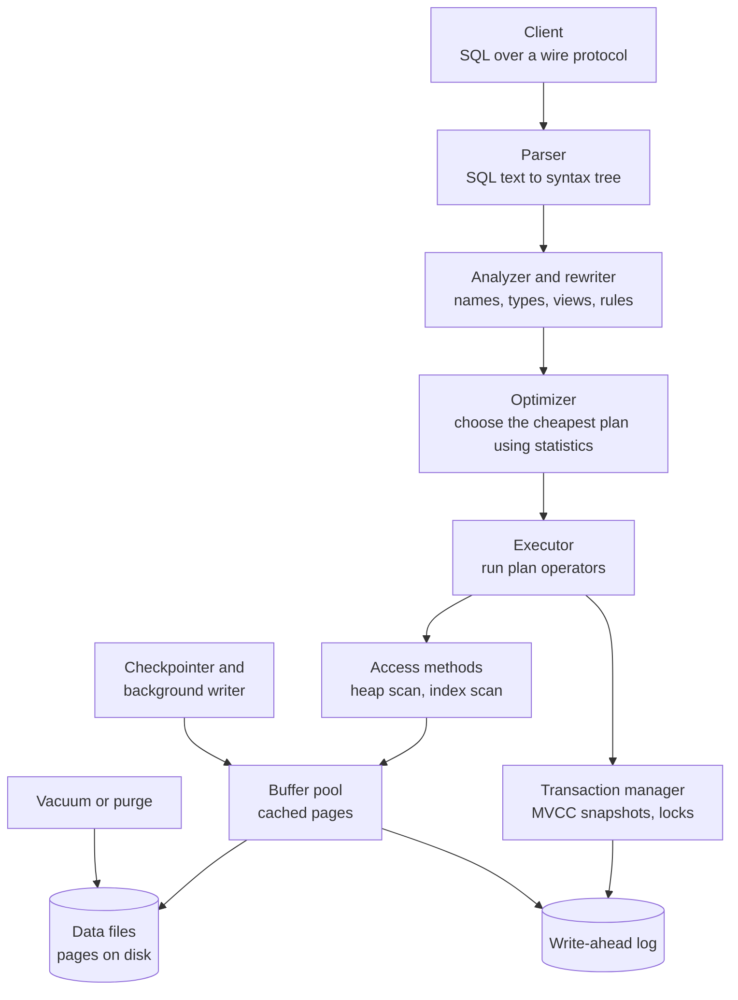
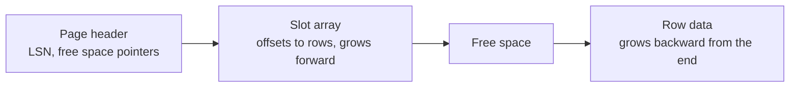
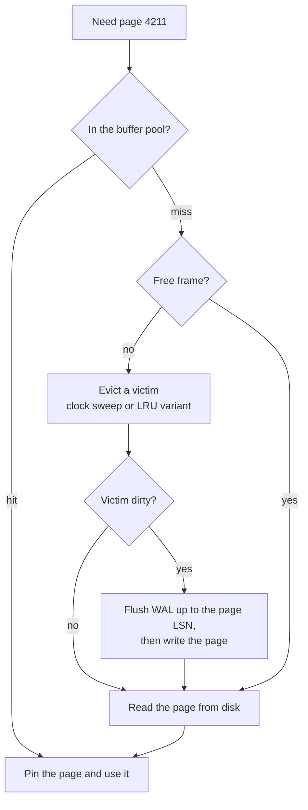
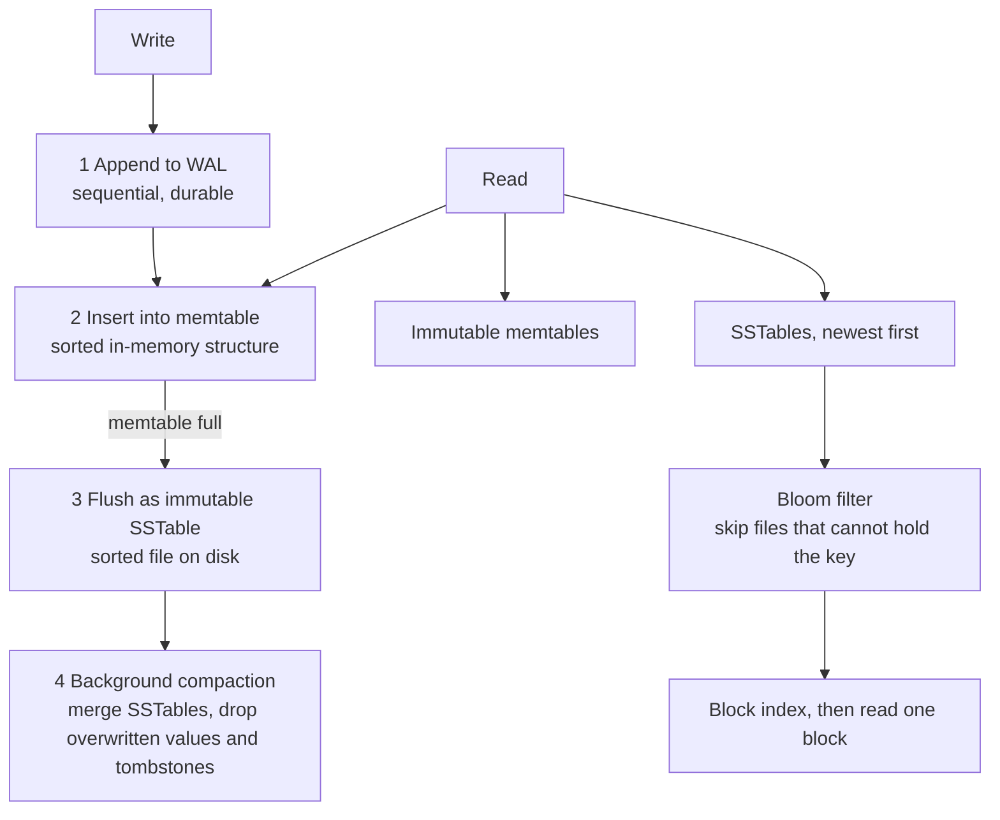
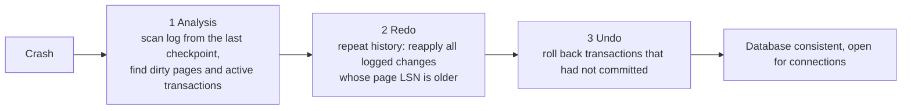
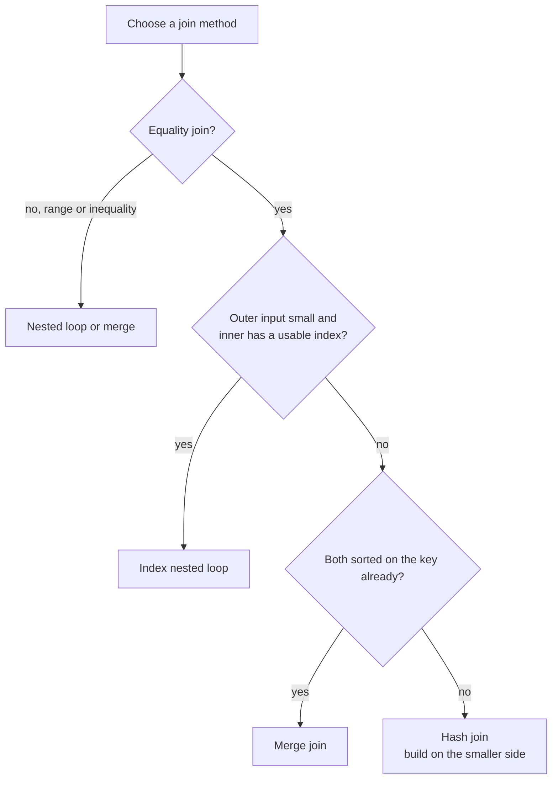

# 📘 Database Internals

Knowing what happens inside the engine turns memorized advice ("add an index", "use LSM for writes") into reasoning you can defend.
This page opens the box: how data is laid out on disk, how it is cached, how writes survive crashes, and how a SQL string becomes a plan.
It is the advanced companion to [Indexing](/docs/databases/indexing-and-query-performance) and [Transactions](/docs/databases/transactions-and-concurrency).

## Table of Contents

1. [Architecture of a Relational Engine](#1-architecture-of-a-relational-engine)
2. [Pages, Heap Files and the Buffer Pool](#2-pages-heap-files-and-the-buffer-pool)
3. [B+Trees in Depth](#3-btrees-in-depth)
4. [LSM Trees](#4-lsm-trees)
5. [Write-Ahead Logging and Recovery](#5-write-ahead-logging-and-recovery)
6. [Query Processing](#6-query-processing)
7. [Join Algorithms](#7-join-algorithms)
8. [Execution Models](#8-execution-models)
9. [Columnar Storage](#9-columnar-storage)
10. [Probabilistic and Specialized Structures](#10-probabilistic-and-specialized-structures)
11. [Questions and Answers](#11-questions-and-answers)

---

## 1. Architecture of a Relational Engine



Each layer has one job.
The **optimizer** decides how, the **executor** does it, the **buffer pool** hides the disk, and the **WAL** guarantees durability.
Connections are usually one process (PostgreSQL) or one thread (MySQL) each, which is why connection counts matter and pooling is standard.

---

## 2. Pages, Heap Files and the Buffer Pool

### 2.1 Pages

Storage is divided into fixed-size **pages** (blocks): 8 KB in PostgreSQL, 16 KB in InnoDB, 4 KB in SQLite by default.
The page is the unit of I/O and of caching.
The engine never reads "a row", it reads the page that contains it.

A common layout is the **slotted page**:



- Rows can be variable length. The slot array gives each row a stable address `(page number, slot)` even when rows move within the page, so indexes keep valid pointers.
- Large values (long text, JSON) are moved out of line: **TOAST** in PostgreSQL, overflow pages in InnoDB.
- Fewer bytes per row means more rows per page, which means fewer page reads, so narrow rows and types (`INTEGER` not `BIGINT` where it fits, no unneeded columns) are a real performance lever.

### 2.2 Heap Files

A **heap** is an unordered collection of pages holding rows.
A sequential scan reads pages in order.
An index maps keys to `(page, slot)` pointers.

### 2.3 The Buffer Pool

Reading from disk (microseconds to milliseconds) is orders of magnitude slower than memory (nanoseconds), so the engine caches pages in a **buffer pool**.



| Concept | Meaning |
| --- | --- |
| **Dirty page** | Modified in memory, not yet written to the data file |
| **Pinning** | A page in use cannot be evicted |
| **Eviction policy** | Usually a clock-sweep or LRU-K approximation, with scan resistance so a big scan does not flush the hot set |
| **Cache hit ratio** | The single most important health number, aim for 99 percent or more on OLTP |
| **Sizing** | InnoDB commonly gets about 70 percent of RAM. PostgreSQL uses `shared_buffers` (often 25 percent) and relies on the OS page cache for the rest (double caching) |
| **Direct I/O** | Some engines bypass the OS cache to avoid double buffering |

**Rule of thumb:** if your working set fits in memory, the database is CPU-bound and fast, and if it does not, latency is dominated by disk reads.
This is why "add RAM" so often works.

---

## 3. B+Trees in Depth

### 3.1 Structure and Fan-Out

In a **B+tree** all row pointers live in the leaves, internal nodes hold only separator keys, and leaves are linked left to right.

Fan-out math for a 16 KB page with 8-byte keys and 6-byte child pointers: about 16,384 / 14, roughly 1,100 children per internal page.

```text
Level 1 (root):      1 page      -> 1,100 children
Level 2:             1,100 pages -> 1.2 million children
Level 3:             1.2M pages  -> 1.3 billion children
```

So three levels index over a billion keys, and the top levels stay in memory.
A lookup is typically 1 to 3 disk reads regardless of table size.

### 3.2 Operations

| Operation | How |
| --- | --- |
| **Search** | Binary search within each page from root to leaf |
| **Range scan** | Seek to the start key, then follow leaf links |
| **Insert** | Find the leaf. If full, **split** it in two and push a separator key up, possibly splitting the parent, up to a new root |
| **Delete** | Remove from the leaf, merge or redistribute if the page is under-full |
| **Bulk load** | Sort first and build bottom-up with a high fill factor, far faster than repeated inserts |

Consequences:

- **Random keys** (UUIDv4) insert into random leaves, causing page splits and cache misses everywhere. **Ordered keys** (auto-increment, UUIDv7) append to the rightmost leaf, which is friendly but can make that page a hot spot under heavy concurrent inserts.
- **Page splits** cost extra writes and leave pages about half full, so B-trees typically run 50 to 70 percent full.
- Updates of an indexed column are a delete plus an insert in that index.
- Concurrency uses short-lived **latches** with techniques like latch crabbing (hold the parent latch until the child is known safe), not the transaction locks discussed elsewhere.
- **Write amplification:** changing one row can write the heap page, index pages, and the WAL. For B-trees this is small per operation but random.

---

## 4. LSM Trees

A **Log-Structured Merge tree** turns random writes into sequential ones.
Used by RocksDB, LevelDB, Cassandra, ScyllaDB, HBase, TiKV, and MyRocks.

### 4.1 Write and Read Paths



- **Writes** are appended to a log and inserted into memory: very fast, no random I/O.
- **Reads** may need to check the memtable and several files, newest first. **Bloom filters** (about 10 bits per key gives roughly a 1 percent false positive rate) and block indexes keep this to about one file read for point lookups.
- **Deletes** write a **tombstone** marker. The old value is only physically removed when compaction merges the files. This is why heavy deletes in Cassandra cause slow reads until tombstones are compacted away.
- **Compaction** merges sorted files in the background, which costs disk and CPU.

### 4.2 Compaction Strategies

| Strategy | Idea | Write amplification | Read amplification | Space |
| --- | --- | --- | --- | --- |
| **Size-tiered** | Merge similarly sized files when there are enough | Lower | Higher (more overlapping files) | Needs up to 2x during compaction |
| **Leveled** | Files organized in levels of non-overlapping key ranges, each about 10x bigger | Higher | Lower (about one file per level) | Tight |
| **Time-window / FIFO** | Group by time, drop whole files by TTL | Very low | Depends | Ideal for time series |

### 4.3 B-Tree vs LSM

| | B+tree (PostgreSQL, InnoDB) | LSM (RocksDB, Cassandra) |
| --- | --- | --- |
| Write pattern | Random in-place page updates | Sequential appends |
| Write throughput | Good | Excellent |
| Point read | About 1 to 3 page reads, predictable | Memtable plus a few files, bloom filters, tail latency from compaction |
| Range scan | Excellent | Good, must merge files |
| Write amplification | Moderate | Higher (compaction rewrites data repeatedly) |
| Space amplification | Fragmentation, about 50 to 70 percent fill | Old versions until compaction |
| Best for | General OLTP, read-heavy, mixed | Write-heavy, ingest, time series, key-value at scale |

### 4.4 A Toy LSM Tree

A complete, runnable model of the ideas above: a write-ahead log, memtable, immutable sorted tables with Bloom filters, tombstones, compaction, and crash recovery.

```js
// runnable
const TOMBSTONE = Symbol('tombstone');

class Bloom {
  constructor(bits = 128) { this.bits = new Uint8Array(bits); }
  #hashes(key) {
    let h1 = 2166136261, h2 = 5381;
    for (const ch of String(key)) {
      h1 = Math.imul(h1 ^ ch.charCodeAt(0), 16777619) >>> 0;
      h2 = (Math.imul(h2, 33) + ch.charCodeAt(0)) >>> 0;
    }
    return [0, 1, 2].map((i) => (h1 + i * h2) % this.bits.length);
  }
  add(key) { this.#hashes(key).forEach((i) => { this.bits[i] = 1; }); }
  mightContain(key) { return this.#hashes(key).every((i) => this.bits[i] === 1); }
}

class SSTable {
  constructor(entries) {                       // sorted [key, value] pairs, immutable once written
    this.entries = entries;
    this.bloom = new Bloom();
    entries.forEach(([k]) => this.bloom.add(k));
  }
  get(key) {
    let lo = 0, hi = this.entries.length - 1;  // binary search: the data is sorted
    while (lo <= hi) {
      const mid = (lo + hi) >> 1;
      const [k, v] = this.entries[mid];
      if (k === key) return { found: true, value: v };
      k < key ? (lo = mid + 1) : (hi = mid - 1);
    }
    return { found: false };
  }
}

class LSM {
  constructor({ memtableLimit = 3 } = {}) {
    this.limit = memtableLimit;
    this.memtable = new Map();
    this.wal = [];                              // stands in for the on-disk write-ahead log
    this.sstables = [];                         // newest first
    this.reads = { tablesProbed: 0, bloomSkips: 0 };
  }
  put(key, value) {
    this.wal.push([key, value]);                // 1. log first (durability)
    this.memtable.set(key, value);              // 2. then the in-memory buffer
    if (this.memtable.size >= this.limit) this.flush();
  }
  delete(key) { this.put(key, TOMBSTONE); }     // a delete is a write of a tombstone marker
  flush() {
    const entries = [...this.memtable.entries()].sort((a, b) => (a[0] < b[0] ? -1 : 1));
    this.sstables.unshift(new SSTable(entries));
    this.memtable = new Map();
    this.wal = [];                              // flushed data no longer needs the log
  }
  get(key) {
    if (this.memtable.has(key)) return this.#visible(this.memtable.get(key));
    for (const t of this.sstables) {            // newest to oldest: the first hit wins
      if (!t.bloom.mightContain(key)) { this.reads.bloomSkips++; continue; }
      this.reads.tablesProbed++;
      const r = t.get(key);
      if (r.found) return this.#visible(r.value);
    }
    return undefined;
  }
  #visible(v) { return v === TOMBSTONE ? undefined : v; }
  compact() {                                   // merge all tables: newest value wins, drop tombstones
    const merged = new Map();
    for (const t of [...this.sstables].reverse()) t.entries.forEach(([k, v]) => merged.set(k, v));
    const live = [...merged.entries()].filter(([, v]) => v !== TOMBSTONE).sort((a, b) => (a[0] < b[0] ? -1 : 1));
    this.sstables = live.length ? [new SSTable(live)] : [];
  }
  static recover(wal, sstables, limit) {        // after a crash: SSTables are on disk, replay the log
    const db = new LSM({ memtableLimit: limit });
    db.sstables = sstables;
    wal.forEach(([k, v]) => db.memtable.set(k, v));
    return db;
  }
}

const db = new LSM({ memtableLimit: 3 });
db.put('a', 1); db.put('b', 2); db.put('c', 3);        // memtable full: flushed to SSTable 1
db.put('a', 10); db.put('d', 4); db.put('e', 5);       // flushed to SSTable 2 (holds the newer 'a')
db.delete('b');                                        // tombstone sits in the memtable
console.log('a =', db.get('a'));                       // 10: the newest version wins
console.log('b =', db.get('b'));                       // undefined: the tombstone hides the old value
console.log('zzz =', db.get('zzz'));                   // undefined: bloom filters let us skip the tables
console.log('sstables before compaction:', db.sstables.length, 'reads:', db.reads);

db.put('f', 6); db.put('g', 7);                        // memtable holds b's tombstone, f, g: flushed as SSTable 3
db.compact();
console.log('sstables after compaction:', db.sstables.length, 'entries:', db.sstables[0].entries.length);
console.log('b after compaction =', db.get('b'), '(tombstone dropped, old value gone)');

db.put('h', 8);                                        // one unflushed write, protected only by the log
const survivor = LSM.recover(db.wal, db.sstables, 3);  // simulate a crash and restart
console.log('after crash, h =', survivor.get('h'), ', a =', survivor.get('a'));
```

Map each piece to a real system: `wal` is the commit log, `memtable` the in-memory table, `SSTable` a sorted string table file, `compact` compaction, and `recover` startup log replay.

---

## 5. Write-Ahead Logging and Recovery

The rule: **the log record describing a change must reach durable storage before the changed data page does** (write-ahead), and before commit is acknowledged.

Why it works: the log is written sequentially and is small, while data pages are written lazily.
After a crash the log tells the engine exactly what to redo and undo.

### 5.1 ARIES-Style Recovery

Most relational engines follow the ARIES algorithm:



- **LSN (log sequence number):** every log record has one, and each page stores the LSN of the last change applied to it. Redo skips changes the page already has, so replay is **idempotent**.
- **Checkpoint:** periodically flush dirty pages and record a checkpoint so recovery starts from there instead of the beginning of time. Checkpoints trade recovery time against write bursts.
- **Torn pages:** a crash in the middle of an 8 KB page write can leave half old, half new bytes. PostgreSQL logs a **full-page image** on the first change after a checkpoint (`full_page_writes`), and InnoDB uses a **doublewrite buffer**.
- **Group commit:** several transactions share one `fsync` of the log.
- **The same log drives replication:** physical WAL shipping (PostgreSQL streaming replication), logical decoding for CDC (Debezium reads it), and point-in-time recovery from archived WAL. See [Replication, Sharding and Operations](/docs/databases/replication-sharding-and-operations).

### 5.2 Durability Cost

`fsync` on every commit is the dominant latency in write-heavy OLTP.
NVMe and battery-backed caches shrink it, group commit amortizes it, and relaxing it (`synchronous_commit = off`) buys throughput for a bounded loss window.

---

## 6. Query Processing

A query passes through these stages:

1. **Parse:** SQL text to a syntax tree, syntax errors happen here.
2. **Analyze:** resolve tables, columns and types, expand views.
3. **Rewrite:** simplify (constant folding, subquery unnesting, predicate pushdown).
4. **Optimize:** choose the cheapest physical plan.
5. **Execute:** run the plan, stream rows to the client.

### 6.1 Cost-Based Optimization

The optimizer enumerates alternatives and estimates each one's cost from **statistics** (row counts, distinct values, histograms, most common values):

- **Access path** for each table: sequential scan, index scan, index-only scan, bitmap scan.
- **Join order:** with n tables there are up to n! orders, so engines use dynamic programming for small n (PostgreSQL up to `join_collapse_limit`, default 8) and heuristics or genetic search beyond.
- **Join method** for each join: nested loop, hash, merge.
- **Where to apply filters** (pushdown), whether to sort or hash for grouping, whether to parallelize.

Estimation error is the main cause of bad plans: the estimated row count of an intermediate result decides the join method, and errors multiply through joins.
This is why up-to-date statistics matter, see [Statistics and the Planner](/docs/databases/indexing-and-query-performance).

```text
Plan tree (illustrative):
HashAggregate
  -> Hash Join (o.customer_id = c.id)
       -> Index Scan on orders o      (created_at >= '2026-01-01')
       -> Hash
            -> Seq Scan on customers c
```

Data flows from the leaves (scans) up to the root.

---

## 7. Join Algorithms

| Algorithm | How | Cost | Best when | Needs |
| --- | --- | --- | --- | --- |
| **Nested loop** | For each outer row, find matches in the inner | O(n x m), or O(n log m) with an index on the inner | Small outer, indexed inner, or tiny tables | Index on the inner join column for large inner |
| **Hash join** | Build a hash table on the smaller input, probe with the larger | O(n + m) | Large unsorted inputs, equality joins | Memory for the hash table, spills to disk in partitions (grace hash join) when too large |
| **Sort-merge join** | Sort both inputs on the join key, walk them together | O(n log n + m log m), or O(n + m) if already sorted | Both inputs already ordered (index order), non-equality range joins, huge inputs | Sorted inputs |



Practical read: a plan with a **hash join over two big scans** is normal for reports, and an **index nested loop** is normal for OLTP lookups.
A **nested loop with a sequential scan on the inner side** over large tables is the red flag, it means a missing index.

Aggregation follows the same choice: **hash aggregate** (build a table of groups) or **sort then group aggregate**.

---

## 8. Execution Models

| Model | How it runs | Used by |
| --- | --- | --- |
| **Volcano (iterator)** | Each operator implements `next()` returning one row, the root pulls rows through the tree | PostgreSQL, MySQL, most row stores. Simple, but a virtual call per row per operator |
| **Vectorized** | Operators process batches of about 1,000 values at a time in tight loops | DuckDB, ClickHouse, Velox. Better CPU cache use and SIMD |
| **Compiled (JIT)** | Generate machine code for the query | PostgreSQL optional JIT, HyPer and Umbra, Spark whole-stage codegen |
| **Parallel query** | Split scans and aggregation across workers, gather results | PostgreSQL parallel workers, MySQL 8 parallel read |
| **Push-based pipelines** | Data is pushed up through pipelines of operators | Modern analytical engines |

Row-at-a-time is fine for OLTP where each query touches a few rows.
Analytics touches billions of values, so vectorized columnar execution wins by 10 to 100 times.

---

## 9. Columnar Storage

A **row store** keeps all columns of a row together, and a **column store** keeps each column in its own contiguous file or block.

| | Row store | Column store |
| --- | --- | --- |
| Read one row with all columns | One page read | Many reads, one per column |
| Aggregate one column over all rows | Reads every column of every row | Reads only that column |
| Insert or update one row | Cheap | Costly (spread across columns), so batched loads |
| Compression | Modest | Excellent, because a column holds similar values |

Column stores get big wins from:

- **Compression:** dictionary encoding, run-length encoding, delta encoding, bit packing. Often 5 to 10 times smaller.
- **Late materialization:** filter on compressed columns and only assemble full rows for survivors.
- **Zone maps (min/max per block)** and partition pruning: skip blocks whose min and max cannot match the filter.
- **Vectorized execution** with SIMD.

File formats: **Parquet** and **ORC** (columnar files on object storage), **Apache Arrow** (in-memory columnar).
Engines: ClickHouse, DuckDB, BigQuery, Snowflake, Redshift, and the columnstore indexes in SQL Server.
Table formats on top of Parquet (Iceberg, Delta Lake, Hudi) add transactions and schema evolution for data lakes, see [Data Modeling Patterns](/docs/databases/data-modeling-patterns).

---

## 10. Probabilistic and Specialized Structures

| Structure | Answers | Notes |
| --- | --- | --- |
| **Bloom filter** | "Is x in the set?" with no false negatives and some false positives | False positive rate about (1 - e^(-kn/m))^k for m bits, n items, k hashes, roughly 1 percent at 10 bits per item. Used in LSM reads, joins, caches, crawlers |
| **Count-min sketch** | Approximate frequency counts | Heavy hitters, top-K over streams |
| **HyperLogLog** | Approximate distinct count in kilobytes | Redis `PFCOUNT`, `APPROX_COUNT_DISTINCT`, about 1 to 2 percent error |
| **Skip list** | Sorted set with O(log n) operations, simple concurrency | Redis sorted sets, memtables in RocksDB |
| **Hash index** | O(1) equality | In-memory tables, hash indexes |
| **Trie / radix tree** | Prefix lookups | Autocomplete, routing tables, adaptive radix tree in some DBs |
| **Inverted index** | Term to document list | Search engines, PostgreSQL GIN |
| **R-tree, quadtree, geohash, S2, H3** | Spatial queries | PostGIS, geo services |
| **HNSW graph** | Approximate nearest neighbor | pgvector, Qdrant, vector search in Cassandra 5, MariaDB and MongoDB |
| **Merkle tree** | Efficiently compare large datasets | Replica repair in Cassandra and Dynamo |

---

## 11. Questions and Answers

**Q1. Why do B-trees have such high fan-out?**
Pages are big and keys are small, so each internal page holds hundreds or thousands of children.
That makes the tree only 3 to 4 levels deep for billions of rows, so lookups take a few page reads.

**Q2. What is a page split and why does it matter?**
When a leaf is full an insert splits it in two and pushes a key to the parent.
Random inserts split often, leaving pages half full and causing extra writes, which is why sequential keys behave better.

**Q3. Why is an LSM tree faster for writes?**
It converts random writes into sequential appends to a log and an in-memory table, deferring the sorting and merging to background compaction.

**Q4. What are the drawbacks of an LSM tree?**
Read amplification (several files to check), write amplification from repeated compaction, space amplification, tombstone buildup, and latency spikes during compaction.

**Q5. Explain write-ahead logging.**
Log records of changes are flushed to disk before the data pages and before commit returns.
After a crash the log is replayed to redo committed work and undo the rest.

**Q6. What are the phases of ARIES recovery?**
Analysis, redo (repeat history), undo (roll back losers), using LSNs on pages to make redo idempotent.

**Q7. What is the buffer pool and why is the hit ratio important?**
A cache of disk pages in memory.
Misses cost a disk read, so a high hit ratio keeps latency low.

**Q8. Compare nested loop, hash and merge joins.**
Nested loop is great for small outer and indexed inner.
Hash join handles large unsorted equality joins in linear time using memory.
Merge join is efficient when inputs are already sorted or for range conditions.

**Q9. Why do wrong row estimates hurt?**
The optimizer picks the join order and method based on them, and errors multiply across joins, so a plan that is great for 10 rows can be terrible for 10 million.

**Q10. Why are column stores faster for analytics?**
They read only the needed columns, compress well, and process data in vectorized batches with block skipping, so scans over billions of values are cheap.

**Q11. How does a Bloom filter help a database?**
It tells cheaply that a key is definitely not in a file or partition, so the engine can skip disk reads.
It may say "maybe" for absent keys but never "no" for present ones.

**Q12. What is a checkpoint?**
A point where dirty pages are flushed and recorded in the log so recovery can start from there.
Frequent checkpoints shorten recovery but cause more write bursts.

Next: [Replication, Sharding and Operations](/docs/databases/replication-sharding-and-operations).
