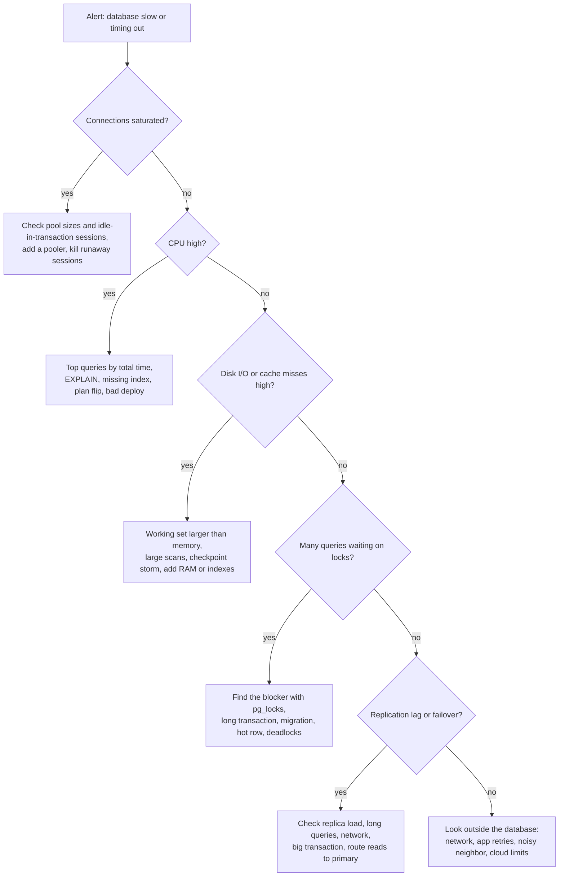

# 📘 Database Interview Playbook

The other pages teach the material.
This page is for rehearsal: a bank of questions with what a strong answer contains, schema design prompts, incident scenarios, one-page cheat sheets, and study plans.

## Table of Contents

1. [What Interviewers Look For](#1-what-interviewers-look-for)
2. [Question Bank](#2-question-bank)
3. [Schema Design Prompts](#3-schema-design-prompts)
4. [Production Scenarios](#4-production-scenarios)
5. [Cheat Sheets](#5-cheat-sheets)
6. [Common Mistakes](#6-common-mistakes)
7. [Study Plans](#7-study-plans)

---

## 1. What Interviewers Look For

| Level | Expected |
| --- | --- |
| **Junior** | Correct SQL for joins and aggregates, keys and normalization, what an index is, basic ACID |
| **Mid** | Window functions, query tuning with `EXPLAIN`, composite indexes, isolation levels and their anomalies, schema design with constraints, N+1 and pagination |
| **Senior** | MVCC and locking behavior, deadlock and lost update prevention, replication lag and failover, partitioning and sharding trade-offs, zero-downtime migrations, choosing between engines with reasons |
| **Staff** | Data architecture across systems (OLTP, cache, search, warehouse), consistency and failure modes, capacity and cost, migration strategy, operational excellence |

Signals that raise your rating: you state assumptions (dialect, data size), you consider NULLs and ties before writing SQL, you check the plan and the write cost of an index, and you name the failure mode of every choice.

---

## 2. Question Bank

Sixty questions, with a checklist of what a strong answer includes.

### 2.1 Fundamentals (15)

| # | Question | Strong answer includes | Read |
| --- | --- | --- | --- |
| 1 | Primary key vs unique key vs foreign key? | Uniqueness, nullability, one per table, referential integrity | [Fundamentals](/docs/databases/database-fundamentals) |
| 2 | Surrogate vs natural key? | Stability, size, keep a unique constraint on the natural key, UUIDv7 vs bigint | [Fundamentals](/docs/databases/database-fundamentals) |
| 3 | What is normalization? Explain 1NF, 2NF, 3NF. | Anomalies, atomic values, whole key, nothing but the key | [Fundamentals](/docs/databases/database-fundamentals) |
| 4 | When do you denormalize? | Measured read problem, snapshots, read models, single source of truth | [Fundamentals](/docs/databases/database-fundamentals) |
| 5 | Why is `NULL = NULL` not true? | Three-valued logic, `IS NULL`, `NOT IN` trap, aggregates ignore NULL | [Fundamentals](/docs/databases/database-fundamentals) |
| 6 | DELETE vs TRUNCATE vs DROP? | Rows vs all rows vs the object, logging, triggers, rollback | [Fundamentals](/docs/databases/database-fundamentals) |
| 7 | How do you model many-to-many? | Junction table, composite key, attributes on the relationship | [Data Modeling](/docs/databases/data-modeling-patterns) |
| 8 | Why never store money as float? | Binary rounding, integer cents or NUMERIC plus currency | [Fundamentals](/docs/databases/database-fundamentals) |
| 9 | OLTP vs OLAP? | Workload, row vs column store, normalized vs star schema | [Fundamentals](/docs/databases/database-fundamentals) |
| 10 | What does a foreign key `ON DELETE CASCADE` do? | Child deletion, risks, RESTRICT alternative | [Fundamentals](/docs/databases/database-fundamentals) |
| 11 | What are ACID properties? | Each letter with a mechanism, C is app invariants not CAP's C | [Transactions](/docs/databases/transactions-and-concurrency) |
| 12 | SQL vs NoSQL: how do you choose? | Access patterns, consistency, scale, team, start relational | [NoSQL](/docs/databases/nosql-databases) |
| 13 | What is a view and a materialized view? | Saved query vs stored result, refresh, uses | [SQL Essentials](/docs/databases/sql-essentials) |
| 14 | What is a stored procedure or trigger and when to avoid them? | Server-side logic, hidden behavior, testing and versioning | [SQL Essentials](/docs/databases/sql-essentials) |
| 15 | Explain CAP in the database context. | Partition forces C or A, examples, PACELC | [Fundamentals](/docs/system-design/fundamentals) |

### 2.2 SQL (10)

| # | Question | Strong answer includes | Read |
| --- | --- | --- | --- |
| 16 | WHERE vs HAVING? | Before vs after grouping, aggregates | [SQL Essentials](/docs/databases/sql-essentials) |
| 17 | INNER vs LEFT vs FULL join, and the LEFT JOIN plus WHERE trap | Unmatched rows, filter in ON to keep them | [SQL Essentials](/docs/databases/sql-essentials) |
| 18 | RANK vs DENSE_RANK vs ROW_NUMBER | Ties and gaps, top N per group | [SQL Essentials](/docs/databases/sql-essentials) |
| 19 | Find the Nth highest salary | DENSE_RANK, distinct, NULL result, ties | [Practice](/docs/databases/sql-practice-problems) |
| 20 | Delete duplicate rows keeping one | ROW_NUMBER partition, verify with SELECT first | [Practice](/docs/databases/sql-practice-problems) |
| 21 | Longest consecutive login streak | Gaps and islands, dedupe, date minus row number | [Practice](/docs/databases/sql-practice-problems) |
| 22 | Customers who never ordered | Anti join, NOT EXISTS vs NOT IN | [Practice](/docs/databases/sql-practice-problems) |
| 23 | Month-over-month growth | Aggregate then LAG, divide by zero | [Practice](/docs/databases/sql-practice-problems) |
| 24 | What is a recursive CTE and when do you use it? | Anchor plus recursive term, hierarchies, cycle guard | [SQL Essentials](/docs/databases/sql-essentials) |
| 25 | Why does SUM double count after a join? | One-to-many fan-out, pre-aggregate | [SQL Essentials](/docs/databases/sql-essentials) |

### 2.3 Indexing and Performance (10)

| # | Question | Strong answer includes | Read |
| --- | --- | --- | --- |
| 26 | How does a B-tree index work? | Sorted pages, shallow tree, log n, range scans, write cost | [Indexing](/docs/databases/indexing-and-query-performance) |
| 27 | Leftmost prefix rule and column order? | Equality, sort, range | [Indexing](/docs/databases/indexing-and-query-performance) |
| 28 | Why is my index not used? | Non-sargable predicate, selectivity, types, stats | [Indexing](/docs/databases/indexing-and-query-performance) |
| 29 | Covering index and index-only scan? | All columns in the index, INCLUDE, visibility map | [Indexing](/docs/databases/indexing-and-query-performance) |
| 30 | Clustered vs non-clustered (InnoDB vs Postgres heap) | Row placement, secondary index lookups, PK width | [Indexing](/docs/databases/indexing-and-query-performance) |
| 31 | How do you debug a slow query? | Reproduce, EXPLAIN ANALYZE, estimates vs actual, fix, re-measure | [Indexing](/docs/databases/indexing-and-query-performance) |
| 32 | Offset vs keyset pagination | Deep offset cost, stable cursor, index on sort key | [Indexing](/docs/databases/indexing-and-query-performance) |
| 33 | What is the N+1 problem? | Symptom, joins, eager loading, batching | [Indexing](/docs/databases/indexing-and-query-performance) |
| 34 | Costs of too many indexes? | Write amplification, space, planner, HOT updates | [Indexing](/docs/databases/indexing-and-query-performance) |
| 35 | Add an index to a huge live table safely | CONCURRENTLY, online DDL, monitoring, rollback | [Operations](/docs/databases/replication-sharding-and-operations) |

### 2.4 Transactions and Concurrency (10)

| # | Question | Strong answer includes | Read |
| --- | --- | --- | --- |
| 36 | List isolation levels and anomalies | Dirty, non-repeatable, phantom, lost update, write skew | [Transactions](/docs/databases/transactions-and-concurrency) |
| 37 | What does PostgreSQL Repeatable Read actually do? | Snapshot isolation, no phantoms, write skew possible | [Transactions](/docs/databases/transactions-and-concurrency) |
| 38 | Explain MVCC | Row versions, snapshots, readers do not block writers, vacuum | [Transactions](/docs/databases/transactions-and-concurrency) |
| 39 | Prevent overselling inventory | Atomic conditional UPDATE, CHECK, affected rows | [Transactions](/docs/databases/transactions-and-concurrency) |
| 40 | Prevent double booking | Unique constraint, exclusion constraint, FOR UPDATE, holds | [Transactions](/docs/databases/transactions-and-concurrency) |
| 41 | What is a deadlock and how do you handle it? | Wait-for cycle, victim, lock ordering, retry | [Transactions](/docs/databases/transactions-and-concurrency) |
| 42 | Optimistic vs pessimistic locking | Version column, FOR UPDATE, contention trade-off | [Transactions](/docs/databases/transactions-and-concurrency) |
| 43 | Explain write skew and a fix | On-call example, serializable, lock rows read, materialize conflict | [Transactions](/docs/databases/transactions-and-concurrency) |
| 44 | `SELECT FOR UPDATE SKIP LOCKED` use case | Job queue, no blocking, batch claims | [Transactions](/docs/databases/transactions-and-concurrency) |
| 45 | How does the WAL give durability and speed? | Log before data, sequential, fsync, group commit, replay | [Internals](/docs/databases/database-internals) |

### 2.5 Internals, Scale and NoSQL (15)

| # | Question | Strong answer includes | Read |
| --- | --- | --- | --- |
| 46 | B-tree vs LSM tree | Write path, amplification, compaction, workloads | [Internals](/docs/databases/database-internals) |
| 47 | Nested loop vs hash vs merge join | Costs, when each wins, memory, sorted input | [Internals](/docs/databases/database-internals) |
| 48 | Why do wrong row estimates hurt? | Join order and method choice, multiplying error, ANALYZE | [Internals](/docs/databases/database-internals) |
| 49 | Why are column stores fast for analytics? | Column pruning, compression, vectorization, zone maps | [Internals](/docs/databases/database-internals) |
| 50 | Scale a read-heavy Postgres | Query fixes, cache, replicas with lag routing, pool, partition, shard | [Operations](/docs/databases/replication-sharding-and-operations) |
| 51 | Sync vs async replication, and lag mitigation | Data loss vs latency, read-your-writes techniques | [Operations](/docs/databases/replication-sharding-and-operations) |
| 52 | How does failover work and fail? | Detect, elect, fence, promote, split brain | [Operations](/docs/databases/replication-sharding-and-operations) |
| 53 | Partitioning vs sharding | One database vs many, pruning, retention, shard key | [Operations](/docs/databases/replication-sharding-and-operations) |
| 54 | Change a column type with zero downtime | Expand, dual write, backfill, switch, contract, lock timeout | [Operations](/docs/databases/replication-sharding-and-operations) |
| 55 | Restore to before an accidental DELETE | Base backup plus WAL replay (PITR), into a new instance | [Operations](/docs/databases/replication-sharding-and-operations) |
| 56 | Embed vs reference in MongoDB | Read together, bounded, atomicity, patterns | [NoSQL](/docs/databases/nosql-databases) |
| 57 | DynamoDB hot partition and single-table design | Key cardinality, write sharding, access patterns first | [NoSQL](/docs/databases/nosql-databases) |
| 58 | Cassandra consistency levels and modeling | RF, QUORUM overlap, query-first tables, tombstones | [NoSQL](/docs/databases/nosql-databases) |
| 59 | Model a hierarchy or SCD Type 2 | Adjacency, path, closure, valid_from and valid_to | [Data Modeling](/docs/databases/data-modeling-patterns) |
| 60 | Multi-tenant schema options | Shared with tenant_id and RLS, schema, database, isolation vs cost | [Data Modeling](/docs/databases/data-modeling-patterns) |

---

## 3. Schema Design Prompts

For each, follow the process: entities, relationships, access patterns, keys, constraints, indexes, growth.
Say the grain, and list the queries before drawing tables.

| Prompt | Key tables | Points to hit |
| --- | --- | --- |
| **E-commerce** | customers, products, orders, order_items, inventory, payments | Price snapshot on lines, money in cents, inventory `CHECK`, order status machine, idempotent payments, index on `(customer_id, created_at)` |
| **Twitter-like** | users, posts, follows, likes, feed cache | Follows as `(follower_id, followee_id)` with both-direction indexes, counters denormalized, fan-out choice, keyset pagination |
| **Chat** | users, conversations, participants, messages | Messages keyed by `(conversation_id, id)`, read receipts as a per-participant pointer, partition by time or conversation |
| **Ticket or seat booking** | events, shows, seats, holds, bookings | `UNIQUE (show_id, seat_id)` on confirmed bookings, hold expiry, no double booking, see [movie booking](/docs/system-design/lld/machine-coding-problems-2) |
| **Bank or wallet** | accounts, ledger_tx, ledger_entries | Double entry, immutable, derived balances, idempotency keys, no floats |
| **Splitwise** | users, groups, expenses, expense_shares, settlements | Integer cents, shares sum to total, netting, see [Splitwise code](/docs/system-design/lld/machine-coding-problems-2) |
| **Library or hotel booking** | books/copies or rooms, members, loans or reservations | Date range overlap constraint (exclusion), availability query, copy vs title |
| **Ride hailing** | riders, drivers, trips, locations | Trip state machine, driver locations in a fast store not the OLTP table, geo index |
| **URL shortener** | urls | Key lookup, `code` primary key, expiry, click events in an append-only store |
| **Analytics for an app** | fact_events, dim_user, dim_date | Star schema, grain, partition by date, columnar storage |

---

## 4. Production Scenarios

Answer these the way you would in an on-call incident: **mitigate first, then find the cause.**



| Scenario | First moves | Root causes and fixes |
| --- | --- | --- |
| **A query got 100x slower after a deploy** | Compare plans before and after, check recent index and stats changes | Missing index for a new filter, plan flip after `ANALYZE`, ORM generated a different query, parameter skew. Fix the index or statistics, add a plan capture |
| **Database CPU pegged at 100%** | `pg_stat_statements` sorted by total time | One hot query, missing index, N+1 from a new endpoint, cache miss storm. Index, batch, cache |
| **"Too many connections"** | Count connections by state and application | Pool too large or leaking, serverless connection storm, long idle-in-transaction. Pooler, timeouts, right-size pools |
| **Deadlocks in production** | Read the deadlock graph in the log | Inconsistent lock order, wide transactions, missing index causing many locked rows. Order locks, shorten transactions, retry |
| **Replica lag spikes** | Lag graph, replica CPU and I/O, long queries on the replica | Large batch write on the primary, conflicting long queries, under-provisioned replica. Throttle batches, split work, route fresh reads to primary |
| **Primary disk almost full** | Find the biggest tables, WAL and temp usage, replication slots | Bloat from blocked vacuum, an abandoned replication slot holding WAL, unbounded log table. Drop the slot, vacuum, partition and archive, add disk |
| **A migration blocked the site** | Find the blocked `ALTER` and its blocker | Lock queue behind a long transaction. Set `lock_timeout`, use concurrent or online DDL, run off-peak |
| **Customers were charged twice** | Look for retries without idempotency | Missing unique idempotency key, client retry after timeout. Add the constraint, reconcile |
| **Stock went negative or was oversold** | Look for read-then-write in the app | No atomic conditional update or check constraint. Atomic `UPDATE ... WHERE qty >= n`, `CHECK` |
| **Reports slow the app down** | Identify the heavy queries and their locks | Analytics on the primary. Read replica with limits, warehouse, materialized views |
| **Data missing after failover** | Compare last LSN of old and new primary | Asynchronous replication loss window. Use synchronous or quorum commit for critical data, reconcile |
| **Table has 5x the expected size** | Compare live vs dead tuples, index sizes | Bloat from long transactions or aggressive updates. Vacuum tuning, `pg_repack`, fillfactor |

---

## 5. Cheat Sheets

### 5.1 SQL

```text
Logical order:   FROM/JOIN  WHERE  GROUP BY  HAVING  SELECT  DISTINCT  ORDER BY  LIMIT
NULL:            IS NULL, COALESCE, NOT EXISTS (not NOT IN), aggregates skip NULL, COUNT(*) counts rows
Top N per group: ROW_NUMBER() OVER (PARTITION BY g ORDER BY x DESC) in a subquery, filter rn <= N
Streaks:         value - ROW_NUMBER() is constant within a run, GROUP BY that
Running total:   SUM(x) OVER (ORDER BY t ROWS UNBOUNDED PRECEDING)
Median:          ROW_NUMBER and COUNT window, or PERCENTILE_CONT(0.5)
Overlap:         a.start < b.end AND b.start < a.end
Upsert:          INSERT ... ON CONFLICT DO UPDATE  (MySQL: ON DUPLICATE KEY UPDATE)
Safe update:     SELECT with the same WHERE first, run inside BEGIN, check row count
```

### 5.2 Indexes and Plans

```text
Composite order:   equality columns, then sort column, then range column
Sargable:          column = constant, range on the raw column. Not: function(column), leading %, type mismatch
Read the plan:     SCAN vs SEARCH, estimated vs actual rows, rows removed by filter, sort, loops, buffers
Index costs:       every write updates every index, space, planner choices, HOT updates
Paging:            keyset (WHERE (created_at, id) < (?, ?)) not OFFSET
```

### 5.3 Transactions

| Anomaly | Read Committed | Repeatable Read / Snapshot | Serializable |
| --- | --- | --- | --- |
| Dirty read | No | No | No |
| Non-repeatable read | Yes | No | No |
| Phantom | Yes | Mostly no (PostgreSQL no) | No |
| Lost update | Possible | Detected in PostgreSQL, prevented by lock in MySQL | No |
| Write skew | Yes | Yes | No |

```text
Oversell:      UPDATE stock SET qty = qty - :n WHERE sku = :s AND qty >= :n   (check rows affected)
Optimistic:    UPDATE ... SET v = v + 1 WHERE id = :id AND v = :seen          (0 rows means retry)
Queue:         SELECT ... FOR UPDATE SKIP LOCKED LIMIT n
Deadlock:      same lock order, short transactions, retry on 40P01 or 1213
Serializable:  always retry on 40001
```

### 5.4 Scale and Operations

```text
Scale path:      fix queries, cache, scale up, pool, read replicas, partition, shard, distributed SQL
Replication:     async fast but lossy, sync or quorum safe but slower, lag breaks read-your-writes
Failover:        detect, elect, FENCE, promote, repoint, rebuild old primary
Migrations:      expand, dual write, backfill in batches, switch, contract, always lock_timeout
Backups:         base backup plus WAL archive = PITR, test restores, 3-2-1, immutable copy
Shard key:       high cardinality, even load, matches the main query, not time
```

### 5.5 Which Database

| Need | Pick |
| --- | --- |
| Default for a product | PostgreSQL |
| Cache, counters, leaderboards, queues | Redis or Valkey |
| Serverless key access at any scale on AWS | DynamoDB |
| Evolving documents | MongoDB or Postgres JSONB |
| Huge write rate, multi-datacenter | Cassandra or ScyllaDB |
| Text search | Elasticsearch or OpenSearch (derived from the primary) |
| Semantic search | pgvector, then a vector database at scale |
| Analytics | ClickHouse, BigQuery, Snowflake, DuckDB |
| Global SQL with transactions | Spanner, CockroachDB, Aurora DSQL |
| Embedded or edge | SQLite |

---

## 6. Common Mistakes

| Mistake | Better |
| --- | --- |
| Writing SQL without asking about NULLs, ties and duplicates | Ask, then state the assumption |
| Answering a tuning question with "add an index" | Reproduce, read the plan, then justify the index and its write cost |
| Reciting isolation levels without engine specifics | Say what PostgreSQL and MySQL actually do |
| Ignoring failure and lag in replication answers | Cover data loss, lag, failover and fencing |
| Proposing sharding first | Walk the scaling ladder and say when sharding is justified |
| Choosing NoSQL by fashion | Start from access patterns and consistency needs |
| No mention of constraints | Put invariants in the database |
| Forgetting migrations and operations | Mention online DDL, backups and monitoring |
| Vague words ("fast", "scalable") | Numbers: rows, QPS, latency, growth |

---

## 7. Study Plans

### 7.1 Four Weeks

| Week | Learn | Practice |
| --- | --- | --- |
| **1: Foundations and SQL** | [Fundamentals](/docs/databases/database-fundamentals), [SQL Essentials](/docs/databases/sql-essentials) | Write every example from memory, then solve problems 1 to 12 in [Practice](/docs/databases/sql-practice-problems) |
| **2: Performance and modeling** | [Indexing](/docs/databases/indexing-and-query-performance), [Data Modeling](/docs/databases/data-modeling-patterns) | Read plans on a real dataset, problems 13 to 20, design three schemas from section 3 |
| **3: Concurrency and internals** | [Transactions](/docs/databases/transactions-and-concurrency), [Internals](/docs/databases/database-internals) | Reproduce a lost update, a deadlock and write skew with two terminals, explain B-tree vs LSM aloud |
| **4: Scale, NoSQL, mocks** | [Replication and Operations](/docs/databases/replication-sharding-and-operations), [NoSQL](/docs/databases/nosql-databases) | Two mock interviews per week, walk the production scenarios, review the question bank |

Set up a local PostgreSQL (Docker: `docker run -e POSTGRES_PASSWORD=pw -p 5432:5432 postgres`) and try the PostgreSQL-specific statements from these pages: `EXPLAIN (ANALYZE, BUFFERS)`, `FOR UPDATE SKIP LOCKED`, `CREATE INDEX CONCURRENTLY`, isolation levels in two `psql` sessions.

### 7.2 Seven-Day Crash Plan

| Day | Focus |
| --- | --- |
| 1 | Keys, constraints, normalization, NULL semantics, joins |
| 2 | Aggregation, subqueries, CTEs, window functions |
| 3 | The SQL practice problems (patterns: top N, streaks, retention, intervals) |
| 4 | Indexes, composite order, `EXPLAIN`, sargability, pagination |
| 5 | Transactions, isolation, MVCC, locks, deadlocks, oversell and double booking patterns |
| 6 | Replication, failover, sharding, migrations, backups, choosing a database |
| 7 | Mock interview, production scenarios, the cheat sheets, sleep |

Cross-links: for architecture-level questions ("design a URL shortener", "design a ticketing system") continue in [System Design](/docs/system-design), and for how applications use databases see [Backend](/docs/backend).
