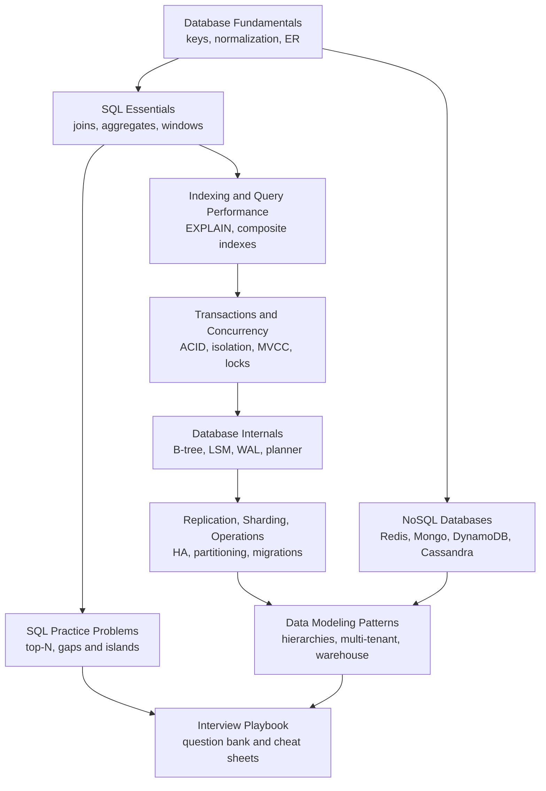

Start here for database prep, from "what is a primary key" to "how does MVCC work" and "how do I shard Postgres".
The focus is relational databases first (PostgreSQL, MySQL, SQLite), because that is what most interviews and most production systems use, then NoSQL and analytics.
Every portable SQL example on these pages was run against SQLite, and Postgres-only syntax is labelled.
Facts that changed recently (PostgreSQL 18, MySQL 9.7 and vectors, DynamoDB multi-Region strong consistency, Postgres as the default engine) are included where they matter.

<SectionHub
  path="databases"
  levels={{
    "database-fundamentals": "Beginner",
    "sql-essentials": "Beginner to mid",
    "sql-practice-problems": "Mid",
    "indexing-and-query-performance": "Mid",
    "transactions-and-concurrency": "Mid to advanced",
    "database-internals": "Advanced",
    "replication-sharding-and-operations": "Advanced",
    "nosql-databases": "Mid to advanced",
    "data-modeling-patterns": "Mid to advanced",
    "database-interview-playbook": "All levels"
  }}
/>

## Reading Path

## Pick Your Level

| You are | Read in this order |
| --- | --- |
| New to databases | [Fundamentals](/docs/databases/database-fundamentals), [SQL Essentials](/docs/databases/sql-essentials), [SQL Practice Problems](/docs/databases/sql-practice-problems) |
| Preparing for a mid-level loop | Add [Indexing](/docs/databases/indexing-and-query-performance), [Transactions](/docs/databases/transactions-and-concurrency), [Data Modeling](/docs/databases/data-modeling-patterns) |
| Preparing for senior or staff | Add [Internals](/docs/databases/database-internals), [Replication and Sharding](/docs/databases/replication-sharding-and-operations), [NoSQL](/docs/databases/nosql-databases) |
| One week left | The [Interview Playbook](/docs/databases/database-interview-playbook) study plan |

## Related Sections

- [System Design](/docs/system-design) uses these ideas at architecture level: sharding, replication, consistency, CAP.
- [Backend](/docs/backend) covers how application code talks to databases: pools, ORMs, transactions, migrations.
- [Java](/docs/java) has the JDBC-adjacent collections and concurrency notes.
