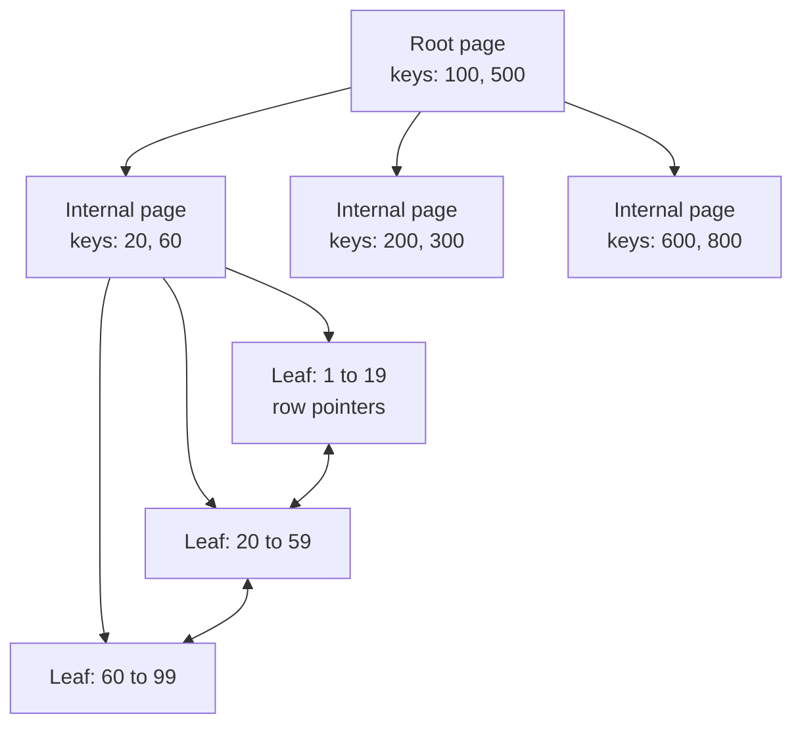
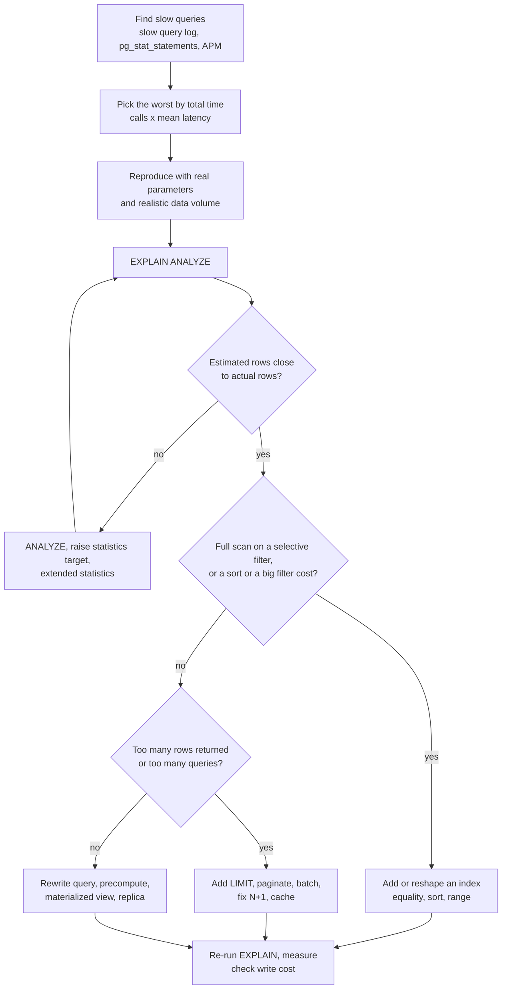

# 📘 Indexing and Query Performance

Most database performance work is one skill: knowing which rows the engine touches and why.
This page explains how indexes work, how to design them, how to read a query plan, and the anti-patterns that silently disable them.
Plans shown as runnable were produced by SQLite's `EXPLAIN QUERY PLAN`.
PostgreSQL-specific output is labelled and is illustrative.

## Table of Contents

1. [What an Index Is](#1-what-an-index-is)
2. [Index Types](#2-index-types)
3. [Composite, Covering, Partial, Expression](#3-composite-covering-partial-expression)
4. [Reading a Query Plan](#4-reading-a-query-plan)
5. [Why an Index Is Not Used](#5-why-an-index-is-not-used)
6. [The Optimization Workflow](#6-the-optimization-workflow)
7. [Statistics and the Planner](#7-statistics-and-the-planner)
8. [Application-Level Problems](#8-application-level-problems)
9. [Index Maintenance](#9-index-maintenance)
10. [Questions and Answers](#10-questions-and-answers)

---

## 1. What an Index Is

An index is a separate, sorted data structure that maps column values to row locations.
Without one the engine must **scan** every row.
With one it can **seek** straight to the matching rows.

### 1.1 The B-Tree

The default index is a **B+tree**: a shallow, wide, balanced tree stored in fixed-size pages (often 8 KB).
Internal pages hold keys and child pointers, leaf pages hold keys and row pointers, and leaves are linked for range scans.



Why it is fast:

- Each page holds hundreds of keys, so the tree is very shallow. A billion rows fit in about 4 levels, so a lookup reads about 4 pages (the top levels stay cached in memory).
- Lookup is O(log n), a range scan finds the first key then follows leaf links, and the sorted order serves `ORDER BY` for free.
- Inserts split full pages, which keeps the tree balanced.

### 1.2 The Trade-off

| Benefit | Cost |
| --- | --- |
| Point lookups, range scans, sorted output, uniqueness checks | Every insert, update of an indexed column, and delete must also update every index |
| Faster joins and `GROUP BY` on the key | Disk space, memory pressure in the buffer cache |
| | More work for the planner, more vacuum and maintenance |

An index is not free: a table with ten indexes does eleven writes per insert.
Add the indexes that your real queries need, and remove the ones nobody uses.

### 1.3 Selectivity

**Selectivity** is the fraction of rows a predicate returns.
An index helps when the predicate is **selective** (returns a small share of the table).

| Predicate | Rows returned | Index useful? |
| --- | --- | --- |
| `id = 42` | 1 of 10 million | Yes, seek |
| `status = 'PAID'` where 25% are paid | 2.5 million | Usually no, a scan is cheaper than 2.5 million random lookups |
| `is_deleted = false` where 99% are false | 9.9 million | No |
| `is_deleted = true` where 1% are true | 100,000 | Maybe, a **partial index** is ideal |

Random lookups into the table (one per index hit) cost more per row than a sequential scan, so the break-even is often around 5 to 15 percent of the table.
The planner estimates this from statistics.

### 1.4 Where the Row Lives

| Engine | Table storage | Index behavior |
| --- | --- | --- |
| **MySQL InnoDB** | **Clustered on the primary key**: the table itself is the primary-key B+tree | Secondary indexes store the primary key value, so a secondary lookup does a second seek in the primary tree. Wide primary keys bloat every secondary index. Random UUID primary keys cause page splits. |
| **PostgreSQL** | **Heap** (unordered), rows identified by `ctid` | All indexes point to heap locations. An update creates a new row version, so indexes may need new entries unless a HOT (heap-only tuple) update applies |
| **SQLite** | Rowid B-tree (or clustered for `WITHOUT ROWID`) | Secondary indexes store the rowid |
| **SQL Server** | Clustered index on one chosen key, or a heap | Nonclustered indexes point to the clustered key |

---

## 2. Index Types

| Type | Best for | Notes |
| --- | --- | --- |
| **B-tree** | Equality, range, `ORDER BY`, prefix `LIKE 'abc%'` | The default and the right answer most of the time |
| **Hash** | Equality only | Rarely better than B-tree, usable in PostgreSQL 10+ |
| **GIN** (PostgreSQL) | Many values per row: `JSONB` keys and containment, arrays, full text search (`tsvector`), trigram `LIKE '%abc%'` | Slower writes, fast search |
| **GiST / SP-GiST** (PostgreSQL) | Geometric, range types, nearest neighbor, exclusion constraints | PostGIS uses GiST |
| **BRIN** (PostgreSQL) | Huge tables whose column correlates with physical order (timestamps in an append-only table) | Tiny index storing min and max per block range |
| **Full text** | Word search with ranking | GIN on `tsvector` in PostgreSQL, `FULLTEXT` in MySQL, or Elasticsearch |
| **Spatial** | Location queries | R-tree, GiST, S2 or H3 cells |
| **Vector** | Approximate nearest neighbor over embeddings | pgvector **HNSW** (graph, better recall and speed, more memory and build time) or **IVFFlat** (clusters, faster build, needs training data), see [AI System Design](/docs/system-design/hld/ai-system-design) |
| **Bitmap** (Oracle, and the bitmap scan technique in PostgreSQL) | Low-cardinality columns in warehouses | Combines several indexes with AND and OR |

PostgreSQL 18 added **skip scan** for multicolumn B-tree indexes, so a query that omits the leading column of a low-cardinality prefix can still use the index in more cases.
Do not rely on it for design: put the columns the query always filters on first.

---

## 3. Composite, Covering, Partial, Expression

### 3.1 Composite Index and the Leftmost Prefix Rule

A composite index on `(a, b, c)` is sorted by `a`, then `b` within each `a`, then `c`.
It can serve queries that use a **leftmost prefix** of its columns.

| Query filters on | Uses index `(a, b, c)`? |
| --- | --- |
| `a` | Yes |
| `a, b` | Yes |
| `a, b, c` | Yes |
| `a, c` | Partly: seeks on `a`, then filters `c` |
| `b` alone | No (barring skip scan) |
| `b, c` | No |

**Column order rule of thumb (equality, sort, range):**

1. Columns compared with **equality** first.
2. Then the column used for **ordering** (so the index returns rows already sorted, no sort step).
3. Then **range** columns (`>`, `<`, `BETWEEN`), because after a range the following columns cannot narrow the seek.

Example query: `WHERE user_id = ? AND status = 'PAID' ORDER BY created_at DESC LIMIT 20`.
Index `(user_id, status, created_at)` finds the rows and returns them in order, so `LIMIT 20` reads 20 index entries and stops.

One composite index usually beats several single-column indexes, because the engine can combine single-column indexes only by merging bitmaps, which is slower.

### 3.2 Covering Index (Index-Only Scan)

If the index contains **every column the query needs**, the engine never touches the table.

- MySQL and SQLite: put the extra columns in the index, `(user_id, total)`.
- PostgreSQL 11+ and SQL Server: `CREATE INDEX ... ON orders (user_id) INCLUDE (total)` stores payload columns only in leaf pages.
- PostgreSQL index-only scans also need the **visibility map** to be up to date (run `VACUUM`).

### 3.3 Partial (Filtered) Index

Index only the rows that matter.
Smaller, faster, cheaper to maintain.

```text
CREATE INDEX idx_orders_open ON orders (created_at) WHERE status = 'NEW';
```

Uses: soft-deleted rows, "pending" queues, unique constraint on a subset (`UNIQUE (email) WHERE deleted_at IS NULL`).

### 3.4 Expression (Functional) Index

Index the result of a function so that a predicate on that function is indexable.

```text
CREATE INDEX idx_users_email_lower ON users (lower(email));
SELECT * FROM users WHERE lower(email) = 'ana@example.com';
```

### 3.5 Demonstration

```sql
-- runnable
CREATE TABLE orders (id INTEGER PRIMARY KEY, user_id INTEGER, status TEXT, created_at TEXT, total INTEGER);
WITH RECURSIVE n(i) AS (SELECT 1 UNION ALL SELECT i + 1 FROM n WHERE i < 20000)
INSERT INTO orders
SELECT i, i % 500,
       CASE i % 4 WHEN 0 THEN 'NEW' WHEN 1 THEN 'PAID' WHEN 2 THEN 'SHIPPED' ELSE 'CANCELLED' END,
       date('2026-01-01', '+' || (i % 365) || ' days'),
       i % 1000
FROM n;

-- no index: the engine scans the whole table
EXPLAIN QUERY PLAN SELECT * FROM orders WHERE user_id = 42;

-- a B-tree index turns the scan into a seek
CREATE INDEX idx_orders_user ON orders (user_id);
EXPLAIN QUERY PLAN SELECT * FROM orders WHERE user_id = 42;

-- covering index: the query is answered from the index alone
CREATE INDEX idx_orders_user_total ON orders (user_id, total);
EXPLAIN QUERY PLAN SELECT SUM(total) FROM orders WHERE user_id = 42;

-- composite index: equality first, then the sort column, so no separate sort step
CREATE INDEX idx_orders_user_status_created ON orders (user_id, status, created_at);
EXPLAIN QUERY PLAN
SELECT id FROM orders WHERE user_id = 42 AND status = 'PAID' ORDER BY created_at DESC LIMIT 5;

-- leftmost prefix: the second column alone cannot seek on this index
EXPLAIN QUERY PLAN SELECT id FROM orders WHERE status = 'PAID' AND created_at > '2026-06-01' AND total = 7;

-- partial index: only 'NEW' rows are indexed
CREATE INDEX idx_orders_new ON orders (created_at) WHERE status = 'NEW';
EXPLAIN QUERY PLAN SELECT id FROM orders WHERE status = 'NEW' AND created_at >= '2026-03-01';
```

In the output look for `SCAN orders` (full table scan) against `SEARCH orders USING INDEX ...` (seek), and for the word `COVERING`.
A `USE TEMP B-TREE FOR ORDER BY` line means an extra sort step, which the composite index above avoids.

---

## 4. Reading a Query Plan

Ask the database how it will run (or ran) the query.

| Database | Command |
| --- | --- |
| PostgreSQL | `EXPLAIN (ANALYZE, BUFFERS) SELECT ...` |
| MySQL 8 | `EXPLAIN ANALYZE SELECT ...` or `EXPLAIN FORMAT=TREE` |
| SQLite | `EXPLAIN QUERY PLAN SELECT ...` |
| SQL Server | Actual Execution Plan, `SET STATISTICS IO ON` |

`EXPLAIN` alone shows the **estimated** plan.
`EXPLAIN ANALYZE` **runs the query** and shows actual times and row counts, so wrap data-changing statements in a transaction you roll back.

Illustrative PostgreSQL output:

```text
Limit  (cost=0.43..8.45 rows=5 width=8) (actual time=0.031..0.040 rows=5 loops=1)
  ->  Index Scan Backward using idx_orders_user_status_created on orders
        (cost=0.43..1290.10 rows=803 width=8) (actual time=0.030..0.037 rows=5 loops=1)
        Index Cond: ((user_id = 42) AND (status = 'PAID'))
        Buffers: shared hit=7
Planning Time: 0.210 ms
Execution Time: 0.062 ms
```

What to look at:

| Field | Meaning |
| --- | --- |
| **Node type** | The operation |
| **cost=a..b** | Planner's estimate in arbitrary units (startup cost..total cost) |
| **rows** (estimated) vs **actual rows** | A large mismatch means stale or insufficient statistics, and a bad plan often follows |
| **loops** | How many times the node ran (nested loops multiply) |
| **Buffers: shared hit / read** | Pages served from cache vs read from disk |
| **Rows Removed by Filter** | Rows fetched then discarded, a sign that a better index would help |

Common plan nodes:

| Node | Meaning |
| --- | --- |
| **Seq Scan** (`SCAN` in SQLite, `ALL` in MySQL) | Read the whole table |
| **Index Scan** | Seek in the index, then fetch each row from the table |
| **Index Only Scan** | Answer from the index alone |
| **Bitmap Index Scan and Bitmap Heap Scan** | Collect matching row locations from one or more indexes, then read the table pages in physical order |
| **Nested Loop** | For each outer row, look up matches in the inner (great when the outer is small and the inner is indexed) |
| **Hash Join** | Build a hash table of one side, probe with the other (good for large unsorted inputs, equality joins) |
| **Merge Join** | Walk two sorted inputs together (good when both are already sorted or indexed) |
| **Sort**, **HashAggregate**, **GroupAggregate** | Ordering and grouping work, watch for spills to disk |

More on how these operators work in [Database Internals](/docs/databases/database-internals).

---

## 5. Why an Index Is Not Used

A predicate that the index can use is called **sargable** (search-argument-able).
These patterns make a predicate non-sargable:

| Anti-pattern | Why it fails | Fix |
| --- | --- | --- |
| Function on the column: `WHERE lower(email) = ?`, `WHERE strftime('%Y-%m', d) = '2026-03'` | The index is on the raw value | Expression index, or rewrite as a **range** `d >= '2026-03-01' AND d < '2026-04-01'` |
| Arithmetic on the column: `WHERE price * 1.2 > 100` | Same | Move the math to the constant side: `price > 100 / 1.2` |
| Leading wildcard: `LIKE '%abc'` | A B-tree sorts by the prefix | Trigram or full text index (`pg_trgm`, `FULLTEXT`), or search-engine |
| Implicit type conversion: `WHERE varchar_col = 123` | The column is cast per row | Match the parameter type to the column type |
| `OR` across different columns | One index cannot serve both branches | `UNION ALL` of two queries, or rely on bitmap OR |
| Low selectivity | Planner correctly prefers a scan | Partial index, or accept the scan |
| `NOT IN`, `<>`, `!=` | Matches most rows | Rewrite, or partial index |
| Wrong composite order | Leading column not filtered | Reorder the index or add another |
| Stale statistics | Planner mis-estimates | `ANALYZE` |
| Very small table | A scan is cheaper | Nothing to fix |
| `SELECT *` | Blocks index-only scans, moves more data | Select needed columns |
| Collation or case mismatch | Index built with a different collation | Align them |

```sql
-- runnable
CREATE TABLE events (id INTEGER PRIMARY KEY, email TEXT, happened TEXT, payload TEXT);
WITH RECURSIVE n(i) AS (SELECT 1 UNION ALL SELECT i + 1 FROM n WHERE i < 20000)
INSERT INTO events
SELECT i, 'User' || (i % 3000) || '@Example.com', date('2026-01-01', '+' || (i % 365) || ' days'), 'x' FROM n;

CREATE INDEX idx_events_happened ON events (happened);
CREATE INDEX idx_events_email   ON events (email);

-- Non-sargable: a function wraps the indexed column, so the index on it is unusable
EXPLAIN QUERY PLAN SELECT id FROM events WHERE strftime('%Y-%m', happened) = '2026-03';

-- Sargable rewrite: a plain range on the raw column
EXPLAIN QUERY PLAN SELECT id FROM events WHERE happened >= '2026-03-01' AND happened < '2026-04-01';

-- Non-sargable: lower() on the column
EXPLAIN QUERY PLAN SELECT id FROM events WHERE lower(email) = 'user42@example.com';

-- Fixed with an expression index
CREATE INDEX idx_events_email_lower ON events (lower(email));
EXPLAIN QUERY PLAN SELECT id FROM events WHERE lower(email) = 'user42@example.com';
```

Read the plans carefully.
The wrapped-column queries show `SCAN events USING COVERING INDEX ...`: the engine walks the **whole index** (cheaper than the table because the index is narrower, but still O(n)) and evaluates the function on every entry.
The sargable rewrite and the expression index show `SEARCH ... (happened>? AND happened<?)` and `(<expr>=?)`, which are real seeks.
The word to look for is `SEARCH` with a condition in parentheses, not merely the presence of an index name.

---

## 6. The Optimization Workflow



Guidance:

- **Measure in production-like conditions.** A plan on 100 rows says nothing about 100 million.
- **Optimize by total cost**, not just the slowest single query: a 5 ms query called 10,000 times per second dominates a 2 s report run once a day.
- **Change one thing at a time**, and always re-check the plan and the write cost.
- Get the query into **the simplest correct form** before adding indexes.

---

## 7. Statistics and the Planner

The planner picks a plan by **estimating** the cost of alternatives using table statistics: row counts, distinct values, most common values, histograms, and correlation.

- `ANALYZE` refreshes statistics (autovacuum does it automatically in PostgreSQL, but big data changes can outrun it).
- Estimates go wrong for **correlated columns** (`city = 'Paris' AND country = 'France'` are not independent). PostgreSQL has `CREATE STATISTICS` for multi-column dependencies.
- **Skewed data** (one customer owns 40 percent of rows) means the best plan depends on the parameter. Prepared statements may cache a generic plan that suits the common value and hurts the rare one (called **parameter sniffing** in SQL Server and MySQL).
- **Plan flips:** a query becomes slow overnight because statistics changed and the plan changed. Capture plans (`auto_explain`, query store) to compare.
- **Hints** (`/*+ ... */` in MySQL and Oracle, `pg_hint_plan` extension) are a last resort. Prefer fixing statistics and indexes.

---

## 8. Application-Level Problems

Many "slow database" problems are visible in the application.

| Problem | Symptom | Fix |
| --- | --- | --- |
| **N+1 queries** | An ORM loads 100 orders, then runs 100 queries for their customers | Join or eager load (`JOIN FETCH`, `include`), batch with `IN`, or a DataLoader |
| **Chatty access** | Many round trips per request | Fewer, larger queries, stored procedures for tight loops |
| **Missing pagination** | Returns 200,000 rows | `LIMIT`, keyset pagination |
| **Deep `OFFSET`** | Page 5000 is slow | Keyset: `WHERE (created_at, id) < (:last_created, :last_id) ORDER BY created_at DESC, id DESC LIMIT 20` |
| **`COUNT(*)` on big tables** | Scans for every page load | Cache, approximate (`reltuples`, estimates), maintain a counter, or drop the exact total from the UI |
| **Huge `IN (...)` lists** | Plan and parse overhead | Join to a temp table or array parameter (`= ANY($1)`) |
| **Long transactions** | Locks held, vacuum blocked, bloat | Keep transactions short, no user think time inside them |
| **Connection storms** | Hundreds of connections thrash the server | A connection pool, PgBouncer, see [Backend performance](/docs/backend/performance-and-caching) |
| **Big writes in one statement** | Long locks, replica lag | Batch by ranges, throttle |
| **Unbounded result sets in the app** | Out-of-memory | Cursors and streaming |

Keyset pagination with a composite sort key needs an index on exactly that key order:

```text
CREATE INDEX idx_posts_feed ON posts (created_at DESC, id DESC);
SELECT * FROM posts
WHERE (created_at, id) < ('2026-05-01 10:00:00', 981234)     -- row-value comparison
ORDER BY created_at DESC, id DESC LIMIT 20;
```

---

## 9. Index Maintenance

- **Bloat:** updates and deletes leave dead entries. Vacuum reclaims space for reuse, `REINDEX` (or `pg_repack`) rebuilds a bloated index.
- **Build without blocking writes:** PostgreSQL `CREATE INDEX CONCURRENTLY` (slower, two passes, cannot run in a transaction, can leave an invalid index if it fails). MySQL online DDL.
- **Find unused indexes:** `pg_stat_user_indexes.idx_scan = 0` over a full business cycle. Drop with care, they may back constraints or rare reports.
- **Find duplicates and redundant prefixes:** `(a)` is redundant when `(a, b)` exists (unless it is unique or much smaller helps).
- **Write amplification:** every index slows inserts. In PostgreSQL, indexing a column you update often prevents **HOT updates**.
- **Fillfactor:** leave free space in pages for update-heavy tables.
- **Index build memory and time** grow with table size, plan them.
- **Foreign keys need an index on the child column** in PostgreSQL (it does not create one automatically), or deleting a parent row scans the child table.
- **Monitor** index size, hit ratio, scans, and bloat over time.

---

## 10. Questions and Answers

**Q1. How does a B-tree index speed up a query?**
It keeps keys sorted in a shallow balanced tree of pages, so a lookup reads a handful of pages instead of the whole table, and range scans follow linked leaves.

**Q2. When is an index not used, even though it exists?**
When the predicate is not sargable (function on the column, leading wildcard, type mismatch), when the predicate is not selective enough for the planner, when the leading column of a composite index is missing, or when statistics are stale.

**Q3. What is the leftmost prefix rule?**
A composite index on `(a, b, c)` can be used for filters on `a`, `a and b`, or `a, b and c`, but not for `b` or `c` alone.

**Q4. How do you order columns in a composite index?**
Equality columns first, then the sort column, then range columns, and put the more selective column earlier among equality columns when queries vary.

**Q5. What is a covering index?**
An index containing every column the query reads, so the engine answers from the index without visiting the table (`Index Only Scan`).

**Q6. Clustered vs non-clustered index?**
A clustered index defines the physical order of table rows (one per table, the primary key in InnoDB).
Non-clustered (secondary) indexes are separate structures pointing to the row or the clustered key.

**Q7. Why is `LIKE '%text%'` slow, and how do you fix it?**
A B-tree cannot seek without a known prefix.
Use a trigram GIN index, full text search, or a search engine.

**Q8. What are the costs of adding an index?**
Slower writes, extra storage and cache use, more maintenance, and more choices for the planner.

**Q9. How do you diagnose a slow query?**
Reproduce it with real parameters, run `EXPLAIN ANALYZE`, compare estimated to actual rows, look for scans, sorts and big filters, then fix the index, statistics or query and re-measure.

**Q10. How do you paginate efficiently through a large table?**
Keyset pagination on an indexed, deterministic sort key, instead of `OFFSET`.

**Q11. What is the N+1 problem?**
Loading a list with one query and then issuing one query per item for related data.
Fix with joins, eager loading or batching.

**Q12. How would you add an index to a huge production table safely?**
Build it online (`CREATE INDEX CONCURRENTLY` in PostgreSQL, online DDL in MySQL), during low traffic, watch replication lag and I/O, validate the plan uses it, and be ready to drop it.

Next: [Transactions and Concurrency](/docs/databases/transactions-and-concurrency).
