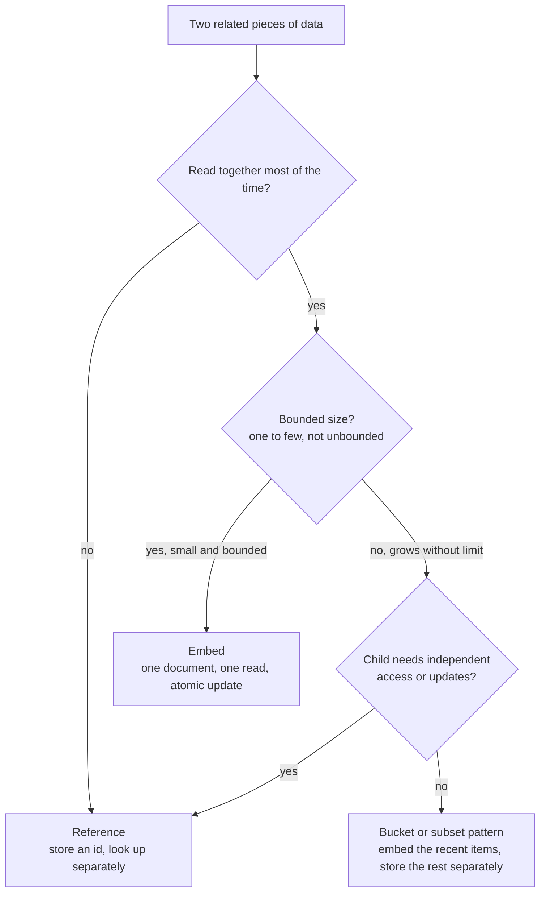
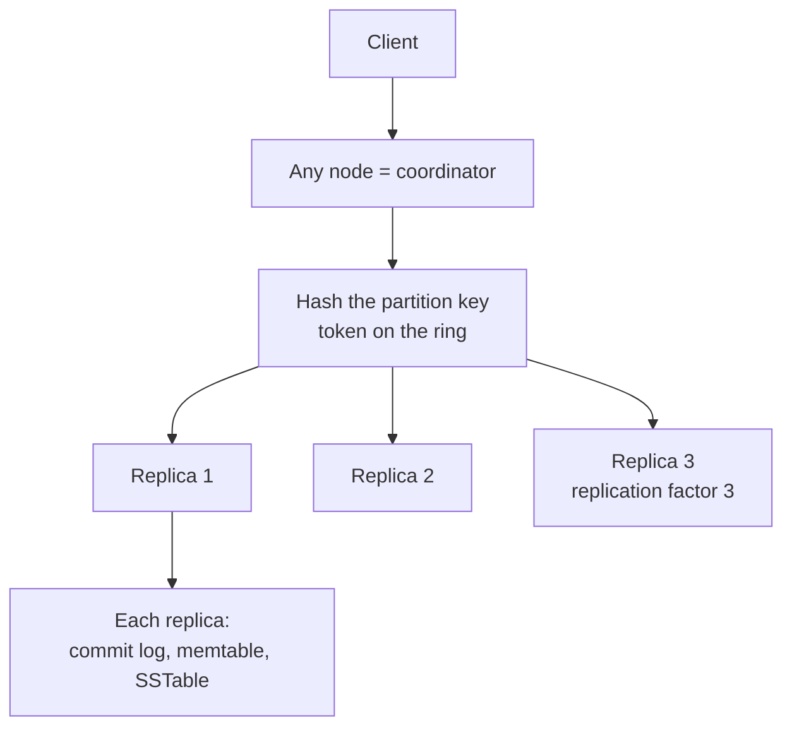
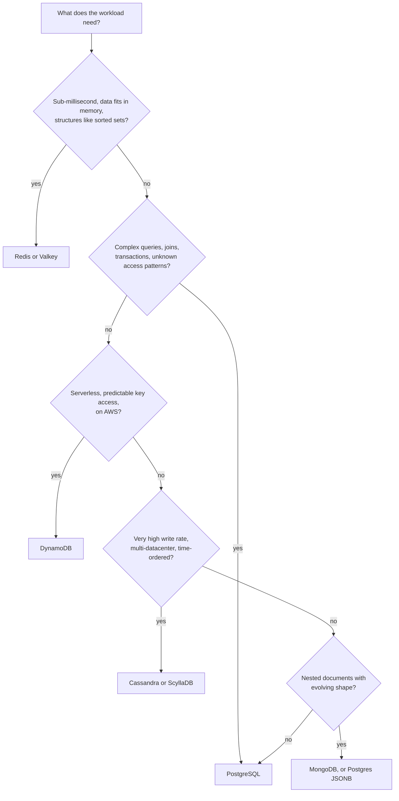

# 📘 NoSQL Databases

"NoSQL" means "not only SQL": databases that trade some relational guarantees (joins, ad hoc queries, cross-row transactions) for scale, flexibility, or a data model that fits one workload.
This page covers the four families you meet in interviews (key-value, document, wide-column, and the specialized ones) and the modeling mindset that separates them from SQL.

Server-based examples here (Redis commands, MongoDB queries, CQL, DynamoDB requests) are illustrative and were not executed in this notes environment, unlike the SQL pages.

## Table of Contents

1. [The NoSQL Mindset](#1-the-nosql-mindset)
2. [Redis and Valkey](#2-redis-and-valkey)
3. [MongoDB](#3-mongodb)
4. [DynamoDB](#4-dynamodb)
5. [Cassandra and ScyllaDB](#5-cassandra-and-scylladb)
6. [Search, Graph, Time-Series](#6-search-graph-time-series)
7. [Vector Databases](#7-vector-databases)
8. [Choosing and Comparing](#8-choosing-and-comparing)
9. [Questions and Answers](#9-questions-and-answers)

---

## 1. The NoSQL Mindset

| | Relational modeling | NoSQL modeling |
| --- | --- | --- |
| Start from | The **data** and its relationships | The **queries** (access patterns) |
| Duplication | Avoided (normalize) | Embraced (denormalize per query) |
| Joins | In the database | In the application, or avoided by embedding |
| Schema | Defined and enforced up front | Flexible, enforced by the app (schema on read) |
| Ad hoc queries | Easy | Hard or impossible, plan the queries |
| Transactions | Multi-row ACID | Often single item or partition, with limited multi-item options |
| Scale | Vertical, replicas, then sharding by hand | Horizontal by design |

The recurring trade-offs come from the [CAP and PACELC](/docs/system-design/fundamentals) theory: many NoSQL systems choose availability and low latency, with tunable consistency.

**Rule of thumb:** if you can list your access patterns and they are simple and high scale, NoSQL can shine.
If you do not yet know how the data will be queried, start relational.

---

## 2. Redis and Valkey

Redis is an in-memory data structure server.
Values are not just strings, they are structures with server-side operations, which is what makes it useful beyond caching.

Licensing and forks (2024 to 2025): Redis moved from BSD to source-available licenses in March 2024 (7.4).
The Linux Foundation forked the last BSD version as **Valkey**, backed by AWS, Google, Oracle and others, and cloud services offer Valkey.
Redis 8 (May 2025) added the OSI-approved AGPLv3 as a license option.
The commands below work on both.

### 2.1 Data Structures

| Type | Commands | Typical uses |
| --- | --- | --- |
| **String** | `SET`, `GET`, `INCR`, `SET key val NX PX 30000`, `MSET` | Cache values, counters, locks, flags |
| **Hash** | `HSET`, `HGET`, `HINCRBY`, `HGETALL` | Objects, sessions, per-user fields |
| **List** | `LPUSH`, `RPOP`, `BLPOP`, `LRANGE` | Simple queues, recent items |
| **Set** | `SADD`, `SISMEMBER`, `SINTER`, `SUNION` | Tags, unique visitors, social relationships |
| **Sorted set** | `ZADD`, `ZRANGE`, `ZREVRANK`, `ZRANGEBYSCORE`, `ZINCRBY` | Leaderboards, priority queues, time-ordered indexes, sliding windows |
| **Stream** | `XADD`, `XREADGROUP`, `XACK` | Durable log with consumer groups (a lightweight Kafka) |
| **Bitmap, HyperLogLog** | `SETBIT`, `BITCOUNT`, `PFADD`, `PFCOUNT` | Daily active users flags, approximate distinct counts in 12 KB |
| **Geo** | `GEOADD`, `GEOSEARCH` | Nearby lookups |
| **Pub/Sub** | `PUBLISH`, `SUBSCRIBE` | Fire-and-forget broadcast (no persistence, use streams for durability) |
| **JSON, search, vector** (Redis modules and Redis 8) | `JSON.SET`, `FT.SEARCH` | Document, full text and vector search in memory |

### 2.2 Patterns

```text
# Rate limiter (fixed window): allow 100 requests per minute per user
INCR   rl:user42:202605011030
EXPIRE rl:user42:202605011030 60        # set on first increment
# if the value exceeds 100, reject

# Leaderboard
ZADD   board:daily 2500 user:42
ZINCRBY board:daily 50 user:42
ZREVRANGE board:daily 0 9 WITHSCORES    # top 10
ZREVRANK  board:daily user:42           # my rank

# Lock (simple, single instance): value is a unique token, released only by its owner
SET lock:job7 <token> NX PX 30000

# Cache-aside with jitter on the TTL to avoid a synchronized stampede
SET user:42 <json> EX 300
```

Distributed locks with a single Redis are fine for **efficiency** (avoid duplicate work) and risky for **correctness**, because a paused client can act after its lease expired.
Use a fencing token or a consensus store when correctness matters, see [Distributed Systems](/docs/system-design/hld/distributed-systems).

### 2.3 Internals and Operations

- **Single-threaded command execution** (I/O can use threads since Redis 6): commands are atomic and there are no locks. One slow command (`KEYS *`, a huge `SMEMBERS`, a big Lua script) blocks everyone, so use `SCAN` and small operations.
- **Persistence:** **RDB** snapshots (compact, point in time, may lose minutes) and **AOF** append-only log (fsync every second by default, loses at most about a second). Many caches use neither or only RDB. Do not treat Redis as your only copy of important data unless you accept the loss window.
- **Replication:** primary to replicas, asynchronous, so failover can lose recent writes. **Sentinel** provides automatic failover for a single primary. **Redis Cluster** shards keys over **16,384 hash slots** across primaries, and multi-key operations must stay in one slot (use hash tags `{user42}`).
- **Eviction** when `maxmemory` is reached: `allkeys-lru`, `allkeys-lfu`, `volatile-ttl`, `noeviction`, and others.
- **Transactions:** `MULTI/EXEC` queues commands and runs them atomically and in isolation, but there is **no rollback** if one command fails midway. Use `WATCH` for optimistic locking, or Lua scripts (or Redis Functions) for atomic logic.
- **Memory is the cost driver:** choose compact encodings, short keys, hashes for small objects, and TTLs.

---

## 3. MongoDB

MongoDB stores **documents** (BSON, a binary JSON with rich types) in **collections**, with a flexible schema.

### 3.1 Modeling: Embed or Reference?

The central design decision.



| Relationship | Model | Example |
| --- | --- | --- |
| One to few | **Embed** | A user with 3 addresses |
| One to many | Embed if bounded, otherwise reference | A blog post with comments: keep the latest 20 embedded (subset), older ones in another collection |
| One to squillions | **Reference** from the child to the parent | A host with millions of log entries |
| Many to many | Arrays of references on one or both sides | Books and authors |

Useful patterns:

| Pattern | Idea |
| --- | --- |
| **Subset** | Embed only the frequently needed part of a large related set |
| **Bucket** | Group many small time-series entries into one document per hour or day |
| **Computed** | Store precomputed values (totals, counts) updated on write |
| **Schema versioning** | A `schemaVersion` field so old and new shapes coexist during migration |
| **Extended reference** | Copy the few fields you display (customer name) into the referencing document, keep the id for the rest |

**Document size limit is 16 MB**, and a document is the unit of atomicity: an update to one document is atomic, including its embedded parts.

```text
// An order with embedded line items (bounded), the customer as an extended reference
{
  _id: ObjectId("..."),
  customer: { id: ObjectId("..."), name: "Ana" },
  status: "PAID",
  items: [ { sku: "K1", qty: 1, priceCents: 4500 }, { sku: "M2", qty: 2, priceCents: 2000 } ],
  totalCents: 8500,
  createdAt: ISODate("2026-05-01T10:00:00Z")
}
```

### 3.2 Queries and Aggregation

```text
db.orders.find({ status: "PAID", createdAt: { $gte: ISODate("2026-05-01") } })
         .sort({ createdAt: -1 }).limit(20)

// Aggregation pipeline: stages transform documents like a Unix pipe
db.orders.aggregate([
  { $match:  { status: "PAID" } },
  { $unwind: "$items" },
  { $group:  { _id: "$items.sku", revenueCents: { $sum: { $multiply: ["$items.qty", "$items.priceCents"] } } } },
  { $sort:   { revenueCents: -1 } },
  { $limit:  5 }
])
```

`$lookup` performs a left join across collections but is not a substitute for relational joins at scale, so if you need joins everywhere, reconsider the model.

### 3.3 Indexes

Same B-tree ideas as SQL: single field, **compound** (follow the **ESR rule**: Equality, Sort, Range), **multikey** (index arrays), **TTL** (auto-expire documents), **partial**, **text**, **geospatial (2dsphere)**, **wildcard**, and hashed (for hashed sharding).
Always check queries with `explain("executionStats")`.

### 3.4 Replication, Consistency, Sharding

- **Replica set:** one primary and secondaries with automatic elections (Raft-like). Writes go to the primary.
- **Write concern** `w: "majority"` waits until a majority acknowledged (durable across failover). **Read concern** (`local`, `majority`, `linearizable`) and **read preference** (primary, secondary) tune consistency and freshness, like the quorum knobs in [Distributed Systems](/docs/system-design/hld/distributed-systems).
- **Sharding:** a **shard key** partitions data into chunks spread over shards, with `mongos` routers and a balancer. A bad shard key (monotonically increasing) creates a hot shard, and the key is hard to change later. Hashed shard keys spread writes, ranged keys support range queries.
- **Transactions:** multi-document ACID transactions exist (since 4.0 for replica sets, 4.2 sharded) but cost performance, so model to keep related data in one document.
- **Change streams** provide CDC-style real-time change feeds.
- **Atlas Search and Vector Search** add full text and vector indexes, and MongoDB 8.0 added quantized vector support.

---

## 4. DynamoDB

DynamoDB is AWS's fully managed key-value and document database with single-digit millisecond latency at any scale.
There are no servers to manage, you pay per request or provisioned capacity.

### 4.1 Core Concepts

| Concept | Meaning |
| --- | --- |
| **Table, item, attribute** | Tables hold items (rows) with attributes, item size limit **400 KB** |
| **Partition key (PK)** | Hashed to choose the physical partition, required |
| **Sort key (SK)** | Optional, orders items within a partition, enables range queries (`begins_with`, `between`) |
| **GSI** (global secondary index) | Another PK and SK over the same data, its own throughput, **eventually consistent** |
| **LSI** (local secondary index) | Same PK, different SK, must be created at table creation |
| **Capacity modes** | **On-demand** (pay per request, auto scales) or **provisioned** (read and write capacity units, optional autoscaling) |
| **Consistency** | Eventually consistent reads by default, strongly consistent reads optional (twice the cost, not on GSIs) |
| **Query vs Scan** | `Query` uses the key (fast, efficient). `Scan` reads the whole table (slow, expensive, avoid) |
| **Conditional writes** | `ConditionExpression` (`attribute_not_exists(pk)`) gives compare-and-set and idempotency |
| **Transactions** | `TransactWriteItems` and `TransactGetItems` for all-or-nothing across up to 100 items, at about double the cost |
| **Streams** | Ordered change log per table, drives Lambda triggers and CDC |
| **TTL** | Automatic item expiry by a timestamp attribute |
| **Limits** | A `Query` page returns up to 1 MB, throughput per partition is bounded (around 3,000 read and 1,000 write units per second) |

### 4.2 Hot Partitions

Data and traffic are distributed by the hash of the partition key.
A key that concentrates traffic (a celebrity user, a date as partition key for today's writes) overloads one partition even if the table has plenty of total capacity.

Fixes: high-cardinality keys, **write sharding** (append a random suffix `user#7#03` and merge on read), caching hot reads (DAX or Redis), and spreading time-series over composite keys.

### 4.3 Single-Table Design

Because there are no joins, related entities are stored in **one table** with generic key names so a single `Query` returns everything a screen needs.

Access patterns first:

1. Get a customer profile.
2. List a customer's orders, newest first.
3. Get one order with its line items.

| PK | SK | Attributes |
| --- | --- | --- |
| `CUSTOMER#42` | `PROFILE` | name, email |
| `CUSTOMER#42` | `ORDER#2026-05-01#1001` | status, total |
| `CUSTOMER#42` | `ORDER#2026-05-07#1017` | status, total |
| `ORDER#1001` | `ITEM#K1` | qty, price |
| `ORDER#1001` | `ITEM#M2` | qty, price |
| `ORDER#1001` | `META` | customerId, status, total |

- Pattern 1: `Query PK = CUSTOMER#42 AND SK = PROFILE`.
- Pattern 2: `Query PK = CUSTOMER#42 AND SK begins_with ORDER#`, `ScanIndexForward = false` (newest first, because the date is in the sort key).
- Pattern 3: `Query PK = ORDER#1001`, returns the meta item and all items in one round trip.

Add **GSIs** for other access paths (for example `GSI1PK = STATUS#PAID`, `GSI1SK = date`) using the overloaded-key technique.

Single-table design is powerful and has costs: the model is hard to read, changing access patterns later can force data migrations, and analytics need an export (to S3 and Athena, or a warehouse).
Many teams use several focused tables instead.

### 4.4 Global Tables

**Global tables** replicate a table across regions.
The default mode is **multi-Region eventual consistency** with last-writer-wins conflict resolution (active-active, low latency).
In June 2025 AWS made **multi-Region strong consistency (MRSC)** generally available: a write is synchronously replicated to at least one other region before it is acknowledged, giving an RPO of zero and strongly consistent reads in any replica.
An MRSC table uses exactly three regions (three replicas, or two replicas plus a witness).
This is a concrete example of the latency-consistency trade-off in [multi-region design](/docs/system-design/hld/distributed-systems).

---

## 5. Cassandra and ScyllaDB

Apache Cassandra (and the C++ rewrite ScyllaDB) is a **wide-column, leaderless, masterless** store built for huge write throughput, linear scale, and multi-datacenter availability.
It follows the Dynamo design plus the Bigtable data model.



| Concept | Meaning |
| --- | --- |
| **Ring, vnodes** | Nodes own token ranges of a hash ring, virtual nodes smooth the distribution |
| **Replication factor (RF)** | Number of copies (typically 3) |
| **Consistency level (CL)** per request | `ONE`, `QUORUM`, `LOCAL_QUORUM`, `ALL`. With RF=3, `QUORUM` reads and writes (2 and 2) overlap and give strong consistency for a key |
| **Gossip** | Peer-to-peer membership and failure detection |
| **Hinted handoff, read repair, anti-entropy repair** | Ways replicas converge after failures |
| **Storage** | LSM tree: commit log, memtable, SSTables, compaction, tombstones ([internals](/docs/databases/database-internals)) |
| **Lightweight transactions (LWT)** | `IF NOT EXISTS` uses Paxos for compare-and-set, much slower than normal writes |

### 5.1 Data Modeling: Query First

Model **one table per query**, denormalizing.

```text
-- Query: latest messages in a chat room
CREATE TABLE messages_by_room (
  room_id    uuid,
  sent_at    timeuuid,
  sender_id  uuid,
  body       text,
  PRIMARY KEY ((room_id), sent_at)          -- partition key: room_id, clustering column: sent_at
) WITH CLUSTERING ORDER BY (sent_at DESC);

SELECT * FROM messages_by_room WHERE room_id = ? LIMIT 50;    -- one partition, sorted, fast
```

Design rules:

- The **partition key** decides where data lives. Every query must specify it. Keep partitions under roughly 100 MB or about 100,000 rows, so add a **bucket** to the key (`(room_id, month)`) for unbounded growth.
- **Clustering columns** sort rows within a partition and support range queries.
- **No joins, no `OR`, limited `WHERE`.** `ALLOW FILTERING` scans and should not appear in production.
- **Secondary indexes** on high-cardinality columns are traps. Cassandra 5.0 adds **Storage-Attached Indexes (SAI)** which are much better, and supports vector search.
- **Deletes and TTLs create tombstones**, and reading through many tombstones is slow, so avoid patterns that delete constantly inside one partition (queues).
- **Counters, batches and materialized views** have caveats, read the docs before using them.

Good fits: messaging history, IoT and time-series ingestion, activity feeds, catalogs with predictable access, multi-datacenter active-active.
Poor fits: ad hoc queries, strong multi-row transactions, small datasets.

---

## 6. Search, Graph, Time-Series

| Family | Engine | Model and strength | Watch out |
| --- | --- | --- | --- |
| **Search** | Elasticsearch, OpenSearch, Solr, Typesense, Meilisearch | Inverted index, analyzers (tokenize, stem), relevance ranking (BM25), facets, near real time (about 1 second refresh), shards and replicas | Not a system of record: feed it from the primary database with CDC and be able to rebuild. See [Building Blocks](/docs/system-design/hld/building-blocks) |
| **Graph** | Neo4j (Cypher), Amazon Neptune, JanusGraph | Property graph of nodes and relationships, cheap multi-hop traversal | Only worth it when traversal depth and relationship queries dominate (fraud rings, recommendations, knowledge graphs). For shallow hierarchies a recursive CTE in SQL is enough |
| **Time-series** | TimescaleDB, InfluxDB, Prometheus, ClickHouse, QuestDB | Append-mostly timestamped data, compression, downsampling, retention, time bucketing, continuous aggregates | High cardinality of series (labels) is the scaling limit, see [monitoring design](/docs/system-design/hld/large-scale-designs) |

Cypher example (illustrative):

```text
// Friends of friends who like the same movie as me, not already my friends
MATCH (me:User {id: 42})-[:FRIEND]->(:User)-[:FRIEND]->(fof:User)-[:LIKES]->(m:Movie)<-[:LIKES]-(me)
WHERE NOT (me)-[:FRIEND]->(fof) AND fof <> me
RETURN fof.name, COUNT(m) AS shared ORDER BY shared DESC LIMIT 10
```

---

## 7. Vector Databases

Vector search finds items whose **embeddings** (numeric representations of meaning) are close to a query embedding.
It powers semantic search, recommendations, and retrieval for LLM applications, see [AI System Design](/docs/system-design/hld/ai-system-design).

| Option | Notes |
| --- | --- |
| **pgvector** (PostgreSQL) | Vectors as a column type, **HNSW** and **IVFFlat** indexes, joins and filters with the rest of your data, transactional. The default choice up to millions or tens of millions of vectors. Widely available on RDS, Cloud SQL, Azure, Supabase, Neon |
| **Dedicated engines** (Qdrant, Milvus, Weaviate, Pinecone) | Purpose-built, rich filtering, sharding for very large collections and high query rates |
| **Search engines** (Elasticsearch, OpenSearch) | Vector plus keyword hybrid search in one system |
| **Databases with vector support** | MongoDB Atlas Vector Search, Redis, Cassandra 5.0 (SAI), MariaDB 11.8 LTS, MySQL `VECTOR` type (functions available, indexing still maturing), SQL Server and others |

Index choice: **HNSW** gives high recall and fast queries at the cost of memory and build time.
**IVFFlat** builds faster and uses less memory but needs training and tuning `probes`.
Quantization (int8, binary) cuts memory by 4 to 32 times.
Filtered vector search (metadata plus similarity) and hybrid keyword plus vector ranking are where engines differ most.

---

## 8. Choosing and Comparing

| | Redis / Valkey | MongoDB | DynamoDB | Cassandra / Scylla | PostgreSQL |
| --- | --- | --- | --- | --- | --- |
| Model | Data structures in memory | Documents | Key-value and document | Wide-column | Relational (plus JSONB) |
| Scale-out | Cluster slots | Sharding | Automatic, managed | Ring, linear | Replicas, then sharding tools |
| Consistency | Async replication | Tunable (write and read concern) | Eventual or strong per read, MRSC across regions | Tunable per request | Strong on primary |
| Joins and ad hoc queries | None | Limited (`$lookup`) | None (plan access patterns) | None | Full SQL |
| Transactions | Single command, scripts | Multi-document available | Up to 100 items | Single partition, LWT | Full ACID |
| Latency | Sub-millisecond | Milliseconds | Single-digit milliseconds | Milliseconds | Milliseconds |
| Sweet spot | Cache, counters, queues, leaderboards | Evolving documents, content, catalogs | Serverless, predictable key access at any scale | Massive writes, multi-region | Default for most systems |



Warnings:

- "We might need to scale" is not a reason to skip relational. One well-tuned PostgreSQL handles far more than most products need.
- Choosing NoSQL to avoid learning schema design leads to inconsistent data and hidden schema in application code.
- Each additional database is an operational commitment: backups, upgrades, monitoring, on-call, skills.
- Keep one **source of truth** and derive the others (cache, search, analytics) from it.

---

## 9. Questions and Answers

**Q1. When would you choose NoSQL over SQL?**
When access patterns are known and simple, scale or latency needs exceed a single relational node, or the data shape is naturally a document or a key lookup.
Otherwise start relational.

**Q2. Embed or reference in MongoDB?**
Embed data that is read together and bounded in size to get one read and atomic updates.
Reference data that grows unboundedly or is accessed independently.

**Q3. What is a hot partition in DynamoDB and how do you avoid it?**
Traffic concentrated on one partition key exceeds that partition's throughput.
Use high-cardinality keys, write sharding with suffixes, and cache hot reads.

**Q4. Explain single-table design.**
Store multiple entity types in one table with generic PK and SK values so one query returns all data a screen needs.
It removes joins at the cost of readability and flexibility.

**Q5. What do QUORUM reads and writes give in Cassandra?**
With RF=3, quorum is 2. Read quorum and write quorum overlap, so a read sees the latest acknowledged write for that key, at higher latency than `ONE`.

**Q6. Why are tombstones a problem?**
Deletes are writes of markers that stay until compaction, and reads must skip through them, so heavy deletes in one partition slow reads and can trigger failures.

**Q7. Redis persistence options?**
RDB snapshots (compact, may lose minutes) and AOF (append-only log, about one second loss with per-second fsync).
Either can be combined, and Redis is usually treated as a cache or ephemeral store unless you accept the loss window.

**Q8. How does Redis Cluster shard data?**
16,384 hash slots assigned to primaries, keys map to a slot by CRC16, and multi-key operations require keys in the same slot (hash tags).

**Q9. Why is a leaderless system like Cassandra highly available?**
Any node can coordinate, replicas can serve while others are down, hinted handoff and repair reconcile later, so there is no single leader to fail over.

**Q10. When is a graph database worth it?**
When queries traverse many relationship hops (fraud detection, recommendations, knowledge graphs) and would need many self-joins in SQL.

**Q11. How would you store embeddings for RAG?**
Start with pgvector in PostgreSQL alongside your data with an HNSW index.
Move to a dedicated vector database when scale, filtering complexity or query rate demands it.

**Q12. How do you keep a search index and cache consistent with the source of truth?**
Treat them as derived: write once to the database, propagate changes by CDC or an outbox, apply idempotently, and keep a rebuild path.

Next: [Data Modeling Patterns](/docs/databases/data-modeling-patterns).
