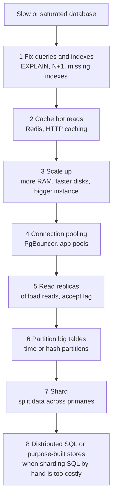
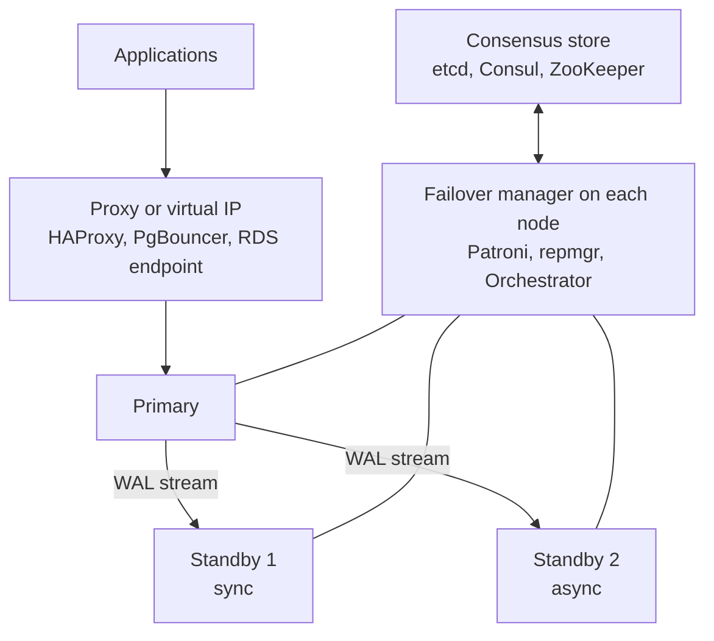
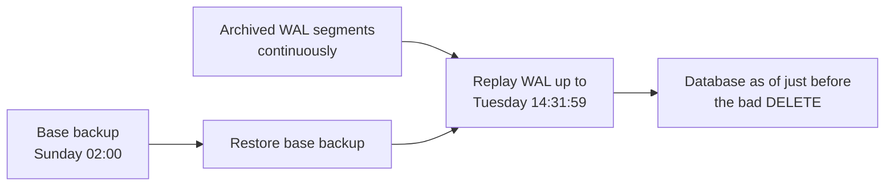
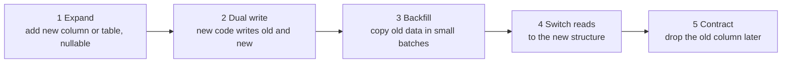

# 📘 Replication, Sharding and Operations

Writing SQL is half of the job.
The other half is keeping the database available, fast, recoverable, and safe as it grows.
This page follows the usual growth path: **replicate, pool, partition, shard**, and then covers backups, migrations, monitoring and security.
Design-level treatment of the same ideas is in [Building Blocks](/docs/system-design/hld/building-blocks) and [Distributed Systems](/docs/system-design/hld/distributed-systems).

## Table of Contents

1. [The Scaling Path](#1-the-scaling-path)
2. [Replication](#2-replication)
3. [High Availability and Failover](#3-high-availability-and-failover)
4. [Connection Pooling](#4-connection-pooling)
5. [Partitioning](#5-partitioning)
6. [Sharding](#6-sharding)
7. [Backups and Recovery](#7-backups-and-recovery)
8. [Schema Migrations Without Downtime](#8-schema-migrations-without-downtime)
9. [Monitoring and Maintenance](#9-monitoring-and-maintenance)
10. [Security](#10-security)
11. [Managed Services and Choosing](#11-managed-services-and-choosing)
12. [Questions and Answers](#12-questions-and-answers)

---

## 1. The Scaling Path

Scale up before you scale out, and do the cheap things first.



A single modern primary with fast NVMe and hundreds of gigabytes of RAM serves a very large workload.
Most companies never reach step 7.
Each step up the ladder adds operational and consistency cost, so move only when measurements demand it.

---

## 2. Replication

Replication copies changes from a **primary** (leader) to **replicas** (followers).
Reasons: high availability, read scaling, geographic locality, backups without load, and feeding other systems.

### 2.1 Kinds of Replication

| Kind | What is shipped | Notes |
| --- | --- | --- |
| **Physical (streaming)** | The write-ahead log, byte for byte | PostgreSQL streaming replication. Exact copy of the whole cluster, same major version, replica is read-only |
| **Logical** | Row changes decoded from the log (insert, update, delete) | PostgreSQL logical replication (publications and subscriptions), MySQL row-based binlog. Selective tables, cross-version upgrades, feeding CDC pipelines (Debezium) |
| **Statement based** | The SQL statements | Old MySQL mode, non-deterministic functions break it, rarely used now |
| **Storage-level** | The storage layer replicates | Aurora shares one distributed storage volume (six copies across three availability zones) between writer and readers |

### 2.2 Synchronous vs Asynchronous

| Mode | Commit returns when | Data loss on primary failure | Latency |
| --- | --- | --- | --- |
| **Asynchronous** | Primary has flushed its own log | The last few transactions can be lost | Lowest |
| **Semi-synchronous / quorum** | At least one (or N of M) replicas have the log | None if the acknowledging replica survives | Adds a network round trip |
| **Synchronous (all)** | Every replica has it | None | Highest, one slow replica stalls writes |

PostgreSQL: `synchronous_standby_names = 'ANY 1 (replica_a, replica_b)'` gives quorum commit.
MySQL: semi-synchronous replication plugin, or Group Replication (Paxos-based).

### 2.3 Replication Lag

**Lag** is how far a replica is behind the primary.
Causes: heavy write bursts, long-running queries on the replica that conflict with replay, slow disks or network, large transactions, single-threaded apply.

Consequences for the application:

- **Read-your-writes breaks:** a user posts, then a page load reads from a lagging replica and the post is missing.
- **Non-monotonic reads:** a refresh goes to a different replica and time appears to go backward.

Mitigations:

- Route reads that must be fresh (right after a write, or in the same session for a short window) to the **primary**.
- Track the write's **log position** (LSN or GTID) and only read from a replica that has passed it.
- Pin a user session to one replica.
- Alert on lag, and stop routing traffic to replicas that fall behind a threshold.
- Watch `pg_stat_replication` (byte and time lag) or `SHOW REPLICA STATUS`.

**Delayed replicas** (intentionally an hour behind) are cheap insurance against a bad `DELETE`.

### 2.4 Multi-Primary and Active-Active

Multiple writers need **conflict resolution**.
Options: single-writer per row or region (home region), last-write-wins, CRDTs, or a consensus database (Spanner, CockroachDB).
Plain PostgreSQL and MySQL are single-primary, and multi-primary setups (Galera, BDR, Group Replication in multi-primary mode) come with restrictions and conflict handling that you must understand before choosing them.

---

## 3. High Availability and Failover

A failure of the primary should be survived in seconds to minutes, without data loss beyond the agreed RPO.



Failover steps:

1. **Detect** failure: missed heartbeats or lease expiry in the consensus store.
2. **Elect** the most caught-up standby.
3. **Fence** the old primary so it cannot accept writes if it returns (**split brain** is the worst outcome). Leases in the consensus store, STONITH, or storage fencing.
4. **Promote** the standby, **repoint** clients (virtual IP, proxy, DNS with a short TTL), and reconfigure other standbys to follow.
5. **Rebuild** the old primary as a standby (`pg_rewind` or a fresh base backup).

| Tool or service | Notes |
| --- | --- |
| **Patroni** | Popular PostgreSQL HA manager using a consensus store for leader election |
| **repmgr, pg_auto_failover** | Alternatives for PostgreSQL |
| **Orchestrator, MySQL InnoDB Cluster / Group Replication** | MySQL failover |
| **RDS Multi-AZ, Cloud SQL HA, Azure zone redundant** | Managed synchronous standby in another zone, automatic failover |
| **Aurora** | Storage-level replication, replicas promoted quickly, typically tens of seconds |

Targets to state in interviews: **RPO** (how much data you can lose, zero with synchronous replication) and **RTO** (how long you can be down, automatic failover gives seconds to minutes).
Test failover regularly, an untested standby is an assumption.

---

## 4. Connection Pooling

A database connection is expensive: PostgreSQL uses a **process per connection** (several megabytes each), and MySQL a thread per connection.
Thousands of direct connections thrash memory and the scheduler.
More connections do not mean more throughput past a small number.

**Sizing rule of thumb** (from the HikariCP guidance): about `(CPU cores x 2) + effective disk spindles` active connections per database server.
Small pools with queueing outperform huge pools.

| Layer | Purpose | Examples |
| --- | --- | --- |
| **Application pool** | Reuse connections inside one process | HikariCP (Java), `pg` Pool (Node), SQLAlchemy pool |
| **External pooler** | Multiplex thousands of client connections onto a few server connections | **PgBouncer**, Pgpool-II, ProxySQL, RDS Proxy, Supavisor |

PgBouncer pooling modes:

| Mode | Connection returned to the pool | Restrictions |
| --- | --- | --- |
| **Session** | When the client disconnects | Safe, least multiplexing |
| **Transaction** | After each transaction | Best multiplexing, but no session state across transactions: no session-level `SET`, advisory locks held across transactions, or (historically) prepared statements |
| **Statement** | After each statement | No multi-statement transactions |

Serverless functions are the classic connection-storm source (each cold start opens a connection), so put a pooler or a serverless-friendly proxy in front.
See [Backend performance](/docs/backend/performance-and-caching).

---

## 5. Partitioning

**Partitioning** splits one big table into smaller physical pieces inside **one** database.
The table still looks like one table to queries.

| Method | Splits by | Good for |
| --- | --- | --- |
| **Range** | Value ranges (dates) | Time-series, logs, orders by month |
| **List** | Explicit values (region, tenant) | Data with natural groups |
| **Hash** | Hash of a key modulo N | Even spread when there is no natural range |

Benefits:

- **Partition pruning:** the planner skips partitions that cannot match the `WHERE`, so a query for one month reads one partition.
- **Cheap retention:** `DROP` or detach an old partition instead of deleting millions of rows (no bloat, no long transaction).
- **Maintenance:** vacuum, reindex, and backup operate per partition.
- Smaller indexes per partition fit in memory.

Pitfalls:

- The **partition key must be part of primary and unique keys** in PostgreSQL, which affects design.
- Queries without the partition key scan **all** partitions.
- Thousands of partitions slow planning. Keep the count to hundreds.
- Foreign keys to and from partitioned tables have limits in some versions.

PostgreSQL declarative partitioning (illustrative):

```text
CREATE TABLE events (
  id         bigint GENERATED ALWAYS AS IDENTITY,
  created_at timestamptz NOT NULL,
  payload    jsonb,
  PRIMARY KEY (id, created_at)
) PARTITION BY RANGE (created_at);

CREATE TABLE events_2026_01 PARTITION OF events FOR VALUES FROM ('2026-01-01') TO ('2026-02-01');
CREATE TABLE events_2026_02 PARTITION OF events FOR VALUES FROM ('2026-02-01') TO ('2026-03-01');

-- retention: detach and drop, instantly, no DELETE
ALTER TABLE events DETACH PARTITION events_2026_01;
DROP TABLE events_2026_01;
```

The `pg_partman` extension automates creating and dropping time partitions.

---

## 6. Sharding

**Sharding** splits data across **multiple independent databases** (shards), each holding a subset.
It scales writes and storage beyond one machine, at the price of complexity.

### 6.1 When and How

Shard only when a single primary cannot handle the **write rate or data size** after the earlier steps.
The design decisions:

| Decision | Guidance |
| --- | --- |
| **Shard key** | High cardinality, spreads load evenly, and matches the main access path so most queries hit one shard. `tenant_id` or `user_id` are common. Avoid `created_at` (all new writes hit one shard) and low-cardinality columns |
| **Strategy** | Hash (even, no range scans), range (range scans, hot spots), directory or lookup table (flexible, an extra dependency), geo |
| **Logical shards** | Create many logical shards (say 256 or 1,024) mapped to fewer physical servers, so rebalancing moves whole logical shards instead of rehashing |
| **Routing** | In the application, a proxy layer, or a sharding-aware database |
| **IDs** | Globally unique without a central counter: UUIDv7, Snowflake-style ids, or per-shard sequences with a shard id embedded |
| **Cross-shard queries** | Scatter-gather is slow, design so the hot path is single-shard, and use a warehouse for global analytics |
| **Cross-shard transactions** | Avoid. Use sagas and idempotency, or keep related data on one shard (the whole tenant on one shard) |
| **Reference data** | Small shared tables (countries, plans) are copied to every shard |
| **Resharding** | Plan it from day one: dual writes or a change stream, backfill, verify, cut over |

### 6.2 Tools and Options

| Option | Model | Notes |
| --- | --- | --- |
| **Citus** (PostgreSQL extension, Microsoft) | Distributed tables sharded by a distribution column, coordinator plus workers, reference tables | Keeps Postgres semantics, great for multi-tenant SaaS and real-time analytics |
| **Vitess** (MySQL, CNCF, born at YouTube) | Proxy layer (VTGate) plus per-shard MySQL, online resharding | Used by large MySQL fleets and PlanetScale |
| **Application-level sharding** | Code picks the shard | Full control, all complexity yours |
| **MongoDB sharded clusters** | Shard key, chunks, balancer, `mongos` routers | Choose the shard key carefully, hashed or ranged |
| **Distributed SQL** | CockroachDB, TiDB, YugabyteDB, Spanner, Aurora DSQL | Automatic sharding and rebalancing with SQL and cross-shard transactions, at the cost of latency for cross-node commits. Aurora DSQL (generally available in 2025) is serverless and active-active across regions using optimistic concurrency, check its documented isolation level |
| **DynamoDB, Cassandra** | Natively partitioned, you model for the partition key | See [NoSQL Databases](/docs/databases/nosql-databases) |

For multi-tenant SaaS, **tenant-per-shard** is the natural design: it keeps transactions local and lets you move a noisy tenant to its own shard.

---

## 7. Backups and Recovery

A backup you have not restored is a hypothesis.

### 7.1 Kinds

| Kind | What | Pros | Cons |
| --- | --- | --- | --- |
| **Logical** (`pg_dump`, `mysqldump`) | SQL or archive of data | Portable across versions, selective | Slow for large databases, point in time only |
| **Physical** (`pg_basebackup`, Percona XtraBackup, file or volume snapshots) | Copy of data files | Fast, exact | Same major version, includes everything |
| **Incremental** | Only blocks changed since the last backup | Smaller, quicker | Restore chain complexity. PostgreSQL 17 added native incremental backup with `pg_basebackup --incremental` and `pg_combinebackup` |
| **Continuous archiving (WAL/binlog)** | Ship every log segment to storage | Enables **point-in-time recovery** | Needs monitoring |

### 7.2 Point-in-Time Recovery (PITR)



PITR answers "someone dropped the table at 14:32, restore to 14:31".
It is what saves you from bad deploys and human error, which replicas do **not** (they replicate the mistake instantly).

### 7.3 Practice

- **3-2-1 rule:** three copies, two media, one offsite (another account and region).
- **Immutable and access-separated backups** so ransomware or a compromised admin cannot delete them.
- **Test restores** on a schedule, and measure real **RTO**. Automate it.
- Encrypt backups, and protect the keys separately.
- Define **retention** (legal and business), and monitor backup and WAL archive success.
- Managed services provide automated backups and PITR windows, learn the limits (retention days, cross-region copy).

---

## 8. Schema Migrations Without Downtime

Code and schema deploy at different moments, so every change must work with **both the old and new code**.

### 8.1 Expand, Migrate, Contract



```sql
-- runnable
CREATE TABLE users (id INTEGER PRIMARY KEY, full_name TEXT NOT NULL);
INSERT INTO users VALUES (1, 'Ana Bell'), (2, 'Ben Cruz'), (3, 'Cy');

-- 1. EXPAND: add nullable columns, old code keeps working
ALTER TABLE users ADD COLUMN first_name TEXT;
ALTER TABLE users ADD COLUMN last_name TEXT;

-- 2. DUAL WRITE: new rows fill both shapes (in real systems the application does this, a trigger is shown for a self-contained demo)
CREATE TRIGGER users_sync AFTER INSERT ON users
BEGIN
  UPDATE users
  SET first_name = substr(NEW.full_name, 1, instr(NEW.full_name || ' ', ' ') - 1),
      last_name  = NULLIF(trim(substr(NEW.full_name, instr(NEW.full_name || ' ', ' '))), '')
  WHERE id = NEW.id;
END;

-- 3. BACKFILL old rows in small id ranges, so each statement is short and locks little
UPDATE users SET first_name = substr(full_name, 1, instr(full_name || ' ', ' ') - 1),
                 last_name  = NULLIF(trim(substr(full_name, instr(full_name || ' ', ' '))), '')
WHERE first_name IS NULL AND id BETWEEN 1 AND 2;
UPDATE users SET first_name = substr(full_name, 1, instr(full_name || ' ', ' ') - 1),
                 last_name  = NULLIF(trim(substr(full_name, instr(full_name || ' ', ' '))), '')
WHERE first_name IS NULL AND id BETWEEN 3 AND 4;

INSERT INTO users (id, full_name) VALUES (4, 'Dee Ford');           -- a new row after the migration started
SELECT id, first_name, last_name FROM users ORDER BY id;

-- 4. VERIFY nothing is left before switching reads
SELECT COUNT(*) AS unmigrated FROM users WHERE first_name IS NULL;

-- 5. CONTRACT after every reader uses the new columns
DROP TRIGGER users_sync;
ALTER TABLE users DROP COLUMN full_name;
SELECT * FROM users ORDER BY id;
```

### 8.2 Dangerous Operations and Safer Versions (PostgreSQL)

| Risky | Why | Safer |
| --- | --- | --- |
| `CREATE INDEX` | Blocks writes for the build | `CREATE INDEX CONCURRENTLY` |
| `ADD COLUMN ... DEFAULT <volatile>` | Rewrites the table | Add nullable, backfill in batches. A constant default is metadata-only since PostgreSQL 11 |
| `ADD CONSTRAINT` (check, foreign key) | Scans the table under a lock | `ADD CONSTRAINT ... NOT VALID`, then `VALIDATE CONSTRAINT` (lighter lock) |
| `ALTER COLUMN TYPE` | Rewrites the table | New column, dual write, backfill, swap |
| `SET NOT NULL` | Full scan | Add a `CHECK (col IS NOT NULL) NOT VALID`, validate, then set not null |
| Rename column or table | Breaks running code | Add new name, migrate, drop old |
| Long `UPDATE` | Long locks, replication lag, bloat | Batch by key range with commits between |

Always set **`lock_timeout`** (for example 3 seconds) and retry.
Otherwise an `ALTER` waiting for a lock queues behind a long transaction and **blocks every query behind it**, causing an outage.

MySQL: online DDL handles many changes, and **gh-ost** or **pt-online-schema-change** copy the table in the background for the rest.

Migration tools: Flyway, Liquibase, Alembic, Prisma Migrate, Rails and Django migrations, Atlas.
Keep migrations versioned in source control, run in CI against a copy of production-like data, and make them **forward-only** with tested restores rather than relying on down-migrations.

---

## 9. Monitoring and Maintenance

### 9.1 What to Watch

| Area | Metrics |
| --- | --- |
| **Latency and throughput** | Queries per second, p95 and p99 latency, slow query log, `pg_stat_statements` (top queries by total time) |
| **Connections** | Active vs idle, idle in transaction, waiting, pool saturation |
| **Cache** | Buffer cache hit ratio, disk reads |
| **Replication** | Lag in bytes and seconds, replica state |
| **Locks** | Blocked queries, long waits, deadlocks (`pg_locks`, `log_lock_waits`) |
| **Transactions** | Oldest transaction age (blocks vacuum), XID wraparound age |
| **Storage** | Disk usage and growth rate, WAL volume, table and index bloat, temp file usage |
| **Checkpoints** | Frequency and duration, write bursts |
| **Resources** | CPU, memory, IOPS and disk latency, network |
| **Errors** | Failed logins, serialization failures, timeouts |

Alert on symptoms first (latency, errors, replication lag, disk full within N hours), and investigate causes on dashboards.
See [Reliability and Operations](/docs/system-design/hld/reliability-and-operations) for SLO-based alerting.

### 9.2 Routine Maintenance

- **Autovacuum and analyze:** keep them healthy. Tune per table for high-churn tables (lower scale factors). Watch for blocked vacuum caused by long transactions or abandoned replication slots.
- **Bloat management:** `pg_repack`, `REINDEX CONCURRENTLY`.
- **Statistics targets** for skewed columns.
- **Upgrades:** minor versions regularly (security fixes). Major upgrades via `pg_upgrade`, logical replication with a cutover, or the managed service's blue-green feature. Rehearse them.
- **Capacity planning:** track growth of data, connections and IOPS, and forecast when the next scaling step is needed.
- **Extensions and versions:** `pg_stat_statements`, `auto_explain`, `pgaudit`, `pg_partman`, `pg_trgm`, `pgvector`.

---

## 10. Security

| Area | Practice |
| --- | --- |
| **Least privilege** | Separate roles for the application (DML only), migrations (DDL), read-only analysts, and admins. Never use the superuser in the app. Revoke `PUBLIC` defaults |
| **SQL injection** | Always use **parameterized queries** or prepared statements, never string concatenation, see [Backend security](/docs/backend/authentication-and-security) |
| **Row-level security (RLS)** | PostgreSQL `CREATE POLICY` restricts which rows a role sees, a strong multi-tenant isolation layer beneath the application |
| **Encryption in transit** | TLS for client and replication connections, verify certificates |
| **Encryption at rest** | Disk or volume encryption, managed service KMS keys, transparent data encryption. Column-level encryption (`pgcrypto`, application-side envelope encryption) for the most sensitive fields |
| **Secrets** | Credentials in a secret manager, rotated. Prefer short-lived credentials, IAM database authentication, or workload identity |
| **Network** | Private subnets, security groups, no public database endpoints, bastion or private link for admins |
| **Auditing** | `pgaudit`, MySQL audit plugin, cloud audit logs, alert on privilege changes and bulk exports |
| **PII and compliance** | Classify data, minimize, mask in non-production, retention limits, support erasure requests (GDPR), keep data in permitted regions |
| **Backups** | Encrypted, access-controlled, immutable copy |
| **Patching** | Apply security releases promptly |

Multi-tenant isolation options, compared in [Data Modeling Patterns](/docs/databases/data-modeling-patterns): shared tables with a `tenant_id` and RLS, schema per tenant, or database per tenant.

---

## 11. Managed Services and Choosing

| Service | What it is | Notes |
| --- | --- | --- |
| **Amazon RDS** | Managed PostgreSQL, MySQL, MariaDB, SQL Server, Oracle | Multi-AZ, backups, read replicas |
| **Amazon Aurora** | PostgreSQL and MySQL compatible with a distributed storage layer | Fast failover and replicas, Serverless v2 scaling, storage grows automatically |
| **Google Cloud SQL, AlloyDB** | Managed PostgreSQL and MySQL, AlloyDB is a Postgres-compatible high-performance option | |
| **Azure Database for PostgreSQL and MySQL, Azure SQL** | Microsoft managed offerings | |
| **Neon** (acquired by Databricks in 2025) | Serverless PostgreSQL, separated storage and compute, scale to zero, instant **branching** | Great for previews and development branches |
| **Supabase** | Postgres platform with auth, storage and realtime | Popular for fast product development |
| **PlanetScale** | Vitess-based MySQL, and a Postgres offering added in 2025 | Online schema changes, horizontal scaling |
| **Turso, Cloudflare D1** | SQLite at the edge | Small, read-heavy, per-tenant databases |
| **CockroachDB, Spanner, Aurora DSQL, TiDB Cloud** | Distributed SQL as a service | Global and horizontally scalable SQL |

Choosing:

- **Team skills and operational load** matter more than benchmarks. A managed service you understand beats a self-managed cluster nobody wants to page for.
- Check the **limits**: maximum connections, storage size, IOPS ceilings, failover time, backup retention, extension support, and version upgrade policy.
- Watch **cost drivers**: provisioned IOPS, cross-zone and cross-region transfer, replicas, backup storage, and idle serverless minimums.
- Avoid deep **lock-in** where cheap: stay on standard SQL and extensions that exist elsewhere.

---

## 12. Questions and Answers

**Q1. How would you scale a read-heavy PostgreSQL database?**
Fix queries and indexes, add caching, add read replicas with lag-aware routing, pool connections, and only then consider partitioning or sharding.

**Q2. What is replication lag and how do you deal with it?**
Delay between the primary and a replica.
Route fresh reads to the primary, track the write LSN, pin sessions, alert on lag, and avoid long conflicting queries on replicas.

**Q3. Synchronous vs asynchronous replication?**
Synchronous waits for replica acknowledgement, giving zero data loss with higher latency.
Asynchronous is fast but can lose recent commits on failover.
Quorum or semi-sync is a compromise.

**Q4. How does automatic failover work and what can go wrong?**
Failure detection, election of the most caught-up standby, fencing of the old primary, promotion and re-pointing clients.
Risks: split brain, lost writes with async replication, flapping from bad timeouts.

**Q5. Why use a connection pooler?**
Connections are heavyweight, and thousands of them thrash the server.
A pooler multiplexes many clients over few server connections, with transaction pooling giving the best density.

**Q6. Partitioning vs sharding?**
Partitioning splits a table inside one database for pruning and maintenance.
Sharding splits data across multiple databases to scale writes and storage beyond one machine.

**Q7. How do you choose a shard key?**
High cardinality, even distribution, and alignment with the dominant query so most requests touch one shard.
`tenant_id` or `user_id` typically, not time.

**Q8. How do you restore a database to just before an accidental delete?**
Point-in-time recovery: restore the latest base backup and replay archived WAL up to the moment before the mistake, into a new instance, then extract or swap.

**Q9. How do you add a column and backfill on a billion-row table safely?**
Expand, migrate, contract: add a nullable column (metadata-only), dual write, backfill in small batches with pauses, verify, switch reads, then drop the old column later.

**Q10. What migration mistake takes sites down?**
A schema change that waits behind a long transaction while holding or queueing for a strong lock, blocking all traffic behind it.
Set `lock_timeout`, use concurrent or online variants, and run during low traffic.

**Q11. What would you monitor on a production database?**
Latency and errors, connections, cache hit ratio, replication lag, locks and long transactions, disk and WAL growth, bloat, vacuum health, and backup success.

**Q12. How do you isolate tenants in a multi-tenant SaaS database?**
Shared tables with `tenant_id` and row-level security for scale and cost efficiency, schema-per-tenant for stronger isolation with moderate scale, or database-per-tenant for strict isolation and easy per-tenant moves.

Next: [NoSQL Databases](/docs/databases/nosql-databases).
