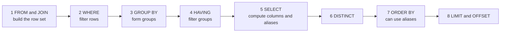

# 📘 SQL Essentials

SQL is declarative: you describe the result, and the optimizer chooses how to compute it.
This page goes from `SELECT` to window functions and recursive queries.
All examples use one small dataset and were executed on SQLite 3.54, which supports the modern SQL used here (CTEs, window functions, `FILTER`, `RETURNING`, upsert).
Where PostgreSQL or MySQL differ, the dialect table in section 9 says how.

## Table of Contents

1. [The Dataset](#1-the-dataset)
2. [How a Query Executes](#2-how-a-query-executes)
3. [Filtering, Sorting, Paging](#3-filtering-sorting-paging)
4. [Joins](#4-joins)
5. [Aggregation](#5-aggregation)
6. [Subqueries and CTEs](#6-subqueries-and-ctes)
7. [Window Functions](#7-window-functions)
8. [Changing Data](#8-changing-data)
9. [Dialect Differences](#9-dialect-differences)
10. [Views, Triggers, Procedures](#10-views-triggers-procedures)
11. [Common Mistakes](#11-common-mistakes)
12. [Questions and Answers](#12-questions-and-answers)

---

## 1. The Dataset

Every runnable block below starts with this setup so it can be pasted alone.
Salaries are in thousands.
Note the edge cases on purpose: Hana has no department, Legal has no employees, Asha has no manager, and there are ties.

```sql
CREATE TABLE departments (id INTEGER PRIMARY KEY, name TEXT);
CREATE TABLE employees (
  id INTEGER PRIMARY KEY, name TEXT, dept_id INTEGER, manager_id INTEGER, salary INTEGER, hired DATE
);
INSERT INTO departments VALUES (1,'Engineering'), (2,'Sales'), (3,'HR'), (4,'Legal');
INSERT INTO employees VALUES
  (1,'Asha',1,NULL,180,'2019-03-01'),
  (2,'Bo',1,1,140,'2020-07-15'),
  (3,'Chen',1,1,140,'2021-01-10'),
  (4,'Dara',2,1,120,'2018-05-20'),
  (5,'Eli',2,4,90,'2022-02-01'),
  (6,'Fay',2,4,90,'2023-06-30'),
  (7,'Gus',3,1,80,'2020-11-11'),
  (8,'Hana',NULL,1,70,'2024-01-05');
```

---

## 2. How a Query Executes

You write `SELECT` first, but the database evaluates clauses in a different **logical order**.
This explains most "why can I not use my alias here" errors.



Consequences:

- `WHERE` cannot use a `SELECT` alias or an aggregate, because those do not exist yet. Use `HAVING` for aggregates.
- `ORDER BY` can use aliases because it runs after `SELECT`.
- Window functions run after `WHERE`, `GROUP BY` and `HAVING`, just before `SELECT` finishes, so you cannot filter on them directly. Wrap in a subquery or CTE.

The physical plan may differ (the optimizer reorders joins and pushes filters down), but results are as if this order applied.

---

## 3. Filtering, Sorting, Paging

```sql
-- runnable
CREATE TABLE employees (
  id INTEGER PRIMARY KEY, name TEXT, dept_id INTEGER, manager_id INTEGER, salary INTEGER, hired DATE
);
INSERT INTO employees VALUES
  (1,'Asha',1,NULL,180,'2019-03-01'), (2,'Bo',1,1,140,'2020-07-15'), (3,'Chen',1,1,140,'2021-01-10'),
  (4,'Dara',2,1,120,'2018-05-20'), (5,'Eli',2,4,90,'2022-02-01'), (6,'Fay',2,4,90,'2023-06-30'),
  (7,'Gus',3,1,80,'2020-11-11'), (8,'Hana',NULL,1,70,'2024-01-05');

-- top 2 in Engineering, ties broken by name
SELECT name, salary FROM employees WHERE dept_id = 1 ORDER BY salary DESC, name LIMIT 2;

-- BETWEEN is inclusive on both ends, IN is a list of OR, LIKE uses % and _
SELECT name FROM employees WHERE salary BETWEEN 90 AND 120 AND name LIKE '%a' ORDER BY name;

-- missing department: use IS NULL, never = NULL
SELECT name FROM employees WHERE dept_id IS NULL;

-- CASE turns values into categories
SELECT name,
       CASE WHEN salary >= 140 THEN 'senior' WHEN salary >= 90 THEN 'mid' ELSE 'junior' END AS band
FROM employees ORDER BY id;

-- DISTINCT removes duplicate rows of the selected columns
SELECT DISTINCT dept_id FROM employees ORDER BY dept_id;
```

Paging:

| Style | Query | Problem |
| --- | --- | --- |
| Offset | `ORDER BY id LIMIT 20 OFFSET 40000` | The database reads and discards 40,000 rows, and results shift if rows are inserted |
| **Keyset (cursor)** | `WHERE id > :last_id ORDER BY id LIMIT 20` | Needs an index on the sort key, cannot jump to page N, but stays fast and stable |

Always add a deterministic `ORDER BY` (with a unique tiebreaker) when paging, or pages can overlap or skip rows.

---

## 4. Joins

A join combines rows from two tables on a condition.

| Join | Returns | Typical use |
| --- | --- | --- |
| `INNER JOIN` | Rows with a match in both | Employees with a department |
| `LEFT JOIN` | All left rows, matching right or `NULL` | All departments, with headcount even if zero |
| `RIGHT JOIN` | All right rows, matching left or `NULL` | Rarely used, swap the tables and use `LEFT` |
| `FULL JOIN` | All rows from both, `NULL` where no match | Reconciliation, find unmatched on either side |
| `CROSS JOIN` | Every combination (Cartesian product) | Generating combinations, calendars |
| Self join | A table joined to itself | Employee to manager |
| Anti join | Left rows with **no** match | Departments with no employees |
| Semi join | Left rows that **have** a match, without duplicating them | `WHERE EXISTS (...)` |

```sql
-- runnable
CREATE TABLE departments (id INTEGER PRIMARY KEY, name TEXT);
CREATE TABLE employees (
  id INTEGER PRIMARY KEY, name TEXT, dept_id INTEGER, manager_id INTEGER, salary INTEGER, hired DATE
);
INSERT INTO departments VALUES (1,'Engineering'), (2,'Sales'), (3,'HR'), (4,'Legal');
INSERT INTO employees VALUES
  (1,'Asha',1,NULL,180,'2019-03-01'), (2,'Bo',1,1,140,'2020-07-15'), (3,'Chen',1,1,140,'2021-01-10'),
  (4,'Dara',2,1,120,'2018-05-20'), (5,'Eli',2,4,90,'2022-02-01'), (6,'Fay',2,4,90,'2023-06-30'),
  (7,'Gus',3,1,80,'2020-11-11'), (8,'Hana',NULL,1,70,'2024-01-05');

-- INNER: 7 rows, Hana (no department) disappears
SELECT COUNT(*) AS inner_rows
FROM employees e JOIN departments d ON d.id = e.dept_id;

-- LEFT: keep every department, headcount 0 for Legal. COUNT(e.id) ignores the NULL from the missing match.
SELECT d.name, COUNT(e.id) AS headcount
FROM departments d LEFT JOIN employees e ON e.dept_id = d.id
GROUP BY d.name ORDER BY d.name;

-- Anti join two ways: departments with no employees
SELECT d.name FROM departments d LEFT JOIN employees e ON e.dept_id = d.id WHERE e.id IS NULL;
SELECT d.name FROM departments d WHERE NOT EXISTS (SELECT 1 FROM employees e WHERE e.dept_id = d.id);

-- Self join: who reports to whom
SELECT e.name AS employee, m.name AS manager
FROM employees e LEFT JOIN employees m ON m.id = e.manager_id
ORDER BY e.id;

-- FULL join: rows that match on neither side (Hana has no dept, Legal has no people)
SELECT e.name AS employee, d.name AS dept
FROM employees e FULL JOIN departments d ON d.id = e.dept_id
WHERE e.id IS NULL OR d.id IS NULL;
```

Join pitfalls:

- **Filtering the right table of a `LEFT JOIN` in `WHERE`** turns it into an inner join, because the `NULL` rows fail the filter. Put the condition in the `ON` clause to keep unmatched rows.
- **Join fan-out:** joining a one-to-many table multiplies rows, so `SUM` on the parent side double counts. Aggregate the child first, then join.
- **Missing join condition** creates an accidental Cartesian product.
- **Join on NULL never matches**, because `NULL = NULL` is unknown.
- **Join types are logical.** The engine picks nested loop, hash join or merge join, see [Database Internals](/docs/databases/database-internals).

---

## 5. Aggregation

`GROUP BY` collapses rows into groups, and aggregate functions summarize each group.

| Function | Notes |
| --- | --- |
| `COUNT(*)` | Counts rows |
| `COUNT(col)` | Counts non-null values |
| `COUNT(DISTINCT col)` | Counts distinct non-null values |
| `SUM`, `AVG`, `MIN`, `MAX` | Ignore `NULL` |
| `STRING_AGG` / `GROUP_CONCAT` | Concatenate values (name differs by dialect) |

`WHERE` filters rows **before** grouping.
`HAVING` filters groups **after** aggregation.
Every selected column must be in `GROUP BY` or inside an aggregate (MySQL without `ONLY_FULL_GROUP_BY` is the dangerous exception, it returns arbitrary values).

```sql
-- runnable
CREATE TABLE employees (
  id INTEGER PRIMARY KEY, name TEXT, dept_id INTEGER, manager_id INTEGER, salary INTEGER, hired DATE
);
INSERT INTO employees VALUES
  (1,'Asha',1,NULL,180,'2019-03-01'), (2,'Bo',1,1,140,'2020-07-15'), (3,'Chen',1,1,140,'2021-01-10'),
  (4,'Dara',2,1,120,'2018-05-20'), (5,'Eli',2,4,90,'2022-02-01'), (6,'Fay',2,4,90,'2023-06-30'),
  (7,'Gus',3,1,80,'2020-11-11'), (8,'Hana',NULL,1,70,'2024-01-05');

-- per department: NULL dept_id forms its own group
SELECT dept_id, COUNT(*) AS n, ROUND(AVG(salary), 1) AS avg_salary, MAX(salary) AS top
FROM employees GROUP BY dept_id ORDER BY dept_id;

-- HAVING filters groups: departments with at least 3 people
SELECT dept_id, COUNT(*) AS n FROM employees GROUP BY dept_id HAVING COUNT(*) >= 3 ORDER BY dept_id;

-- WHERE and HAVING together: only people hired since 2020, then departments averaging over 100
SELECT dept_id, ROUND(AVG(salary), 1) AS avg_salary
FROM employees WHERE hired >= '2020-01-01' AND dept_id IS NOT NULL
GROUP BY dept_id HAVING AVG(salary) > 100;

-- conditional aggregation: pivot-style counts in one pass
SELECT dept_id,
       SUM(CASE WHEN salary >= 100 THEN 1 ELSE 0 END) AS high_paid,
       COUNT(*) FILTER (WHERE salary < 100)            AS low_paid
FROM employees WHERE dept_id IS NOT NULL GROUP BY dept_id ORDER BY dept_id;
```

Advanced grouping (PostgreSQL, MySQL, SQL Server, Oracle; not in SQLite):

```text
GROUP BY ROLLUP (dept_id, hired_year)     subtotals per dept and a grand total
GROUP BY CUBE (dept_id, hired_year)       every combination of subtotals
GROUP BY GROUPING SETS ((dept_id), (hired_year), ())
```

---

## 6. Subqueries and CTEs

| Kind | Where | Note |
| --- | --- | --- |
| **Scalar subquery** | In `SELECT` or `WHERE`, returns one value | Errors if it returns more than one row |
| **`IN (subquery)`** | Membership test | `NOT IN` breaks with `NULL`, prefer `NOT EXISTS` |
| **`EXISTS (subquery)`** | True if any row | Stops at the first match |
| **Correlated subquery** | References the outer query | Logically runs per outer row, often rewritten as a join |
| **Derived table** | Subquery in `FROM` | Needs an alias |
| **CTE** (`WITH`) | Named, reusable subquery | Readability, and required for recursion |
| **`LATERAL`** (PostgreSQL, MySQL 8.0.14+) | Subquery in `FROM` that references earlier `FROM` items | Top-N per group |

```sql
-- runnable
CREATE TABLE employees (
  id INTEGER PRIMARY KEY, name TEXT, dept_id INTEGER, manager_id INTEGER, salary INTEGER, hired DATE
);
INSERT INTO employees VALUES
  (1,'Asha',1,NULL,180,'2019-03-01'), (2,'Bo',1,1,140,'2020-07-15'), (3,'Chen',1,1,140,'2021-01-10'),
  (4,'Dara',2,1,120,'2018-05-20'), (5,'Eli',2,4,90,'2022-02-01'), (6,'Fay',2,4,90,'2023-06-30'),
  (7,'Gus',3,1,80,'2020-11-11'), (8,'Hana',NULL,1,70,'2024-01-05');

-- scalar subquery: earns more than the company average (113.75)
SELECT name, salary FROM employees WHERE salary > (SELECT AVG(salary) FROM employees) ORDER BY id;

-- correlated subquery: earns more than the average of their own department
SELECT e.name, e.salary FROM employees e
WHERE e.salary > (SELECT AVG(x.salary) FROM employees x WHERE x.dept_id = e.dept_id) ORDER BY e.id;

-- the same with a CTE and a join: compute department averages once
WITH dept_avg AS (SELECT dept_id, AVG(salary) AS avg_salary FROM employees GROUP BY dept_id)
SELECT e.name, e.salary, ROUND(d.avg_salary, 1) AS dept_avg
FROM employees e JOIN dept_avg d ON d.dept_id = e.dept_id
WHERE e.salary > d.avg_salary ORDER BY e.id;

-- recursive CTE: everyone below Asha with their depth in the reporting tree
WITH RECURSIVE chain(id, name, depth) AS (
  SELECT id, name, 0 FROM employees WHERE manager_id IS NULL          -- anchor: the root
  UNION ALL
  SELECT e.id, e.name, c.depth + 1 FROM employees e JOIN chain c ON e.manager_id = c.id   -- recurse
)
SELECT id, name, depth FROM chain ORDER BY depth, id;
```

**Recursive CTEs** have an anchor query and a recursive query joined with `UNION ALL`, and stop when the recursive step returns no rows.
Use them for org charts, category trees, bill of materials, and graph traversal.
Guard against cycles with a depth limit or a visited-path column.

In PostgreSQL 12 and later a non-recursive CTE that is referenced once is inlined like a subquery.
Use `MATERIALIZED` or `NOT MATERIALIZED` to control it.

**Set operations** combine results of two queries with matching columns:

| Operator | Result |
| --- | --- |
| `UNION` | Rows in either, duplicates removed (sorts or hashes) |
| `UNION ALL` | Rows in either, duplicates kept (faster, use unless you need dedupe) |
| `INTERSECT` | Rows in both |
| `EXCEPT` (`MINUS` in Oracle) | Rows in the first not in the second |

---

## 7. Window Functions

A window function computes a value over a set of rows related to the current row **without collapsing them** (unlike `GROUP BY`).

```text
function() OVER (
  PARTITION BY col          -- restart the calculation for each group
  ORDER BY col              -- order within the partition
  ROWS BETWEEN ... AND ...  -- optional frame
)
```

| Family | Functions | Use |
| --- | --- | --- |
| Ranking | `ROW_NUMBER`, `RANK`, `DENSE_RANK`, `NTILE(n)` | Top N per group, deduplication, percentiles |
| Offset | `LAG`, `LEAD`, `FIRST_VALUE`, `LAST_VALUE`, `NTH_VALUE` | Compare with previous or next row, changes over time |
| Aggregate as window | `SUM`, `AVG`, `COUNT`, `MIN`, `MAX` with `OVER` | Running totals, moving averages, share of total |
| Distribution | `PERCENT_RANK`, `CUME_DIST` | Percentiles |

The three ranking functions differ on ties:

| salary (desc) | `ROW_NUMBER` | `RANK` | `DENSE_RANK` |
| --- | --- | --- | --- |
| 140 | 1 | 1 | 1 |
| 140 | 2 | 1 | 1 |
| 120 | 3 | 3 | 2 |

`ROW_NUMBER` always gives unique numbers, `RANK` leaves gaps after ties, `DENSE_RANK` does not.

```sql
-- runnable
CREATE TABLE employees (
  id INTEGER PRIMARY KEY, name TEXT, dept_id INTEGER, manager_id INTEGER, salary INTEGER, hired DATE
);
INSERT INTO employees VALUES
  (1,'Asha',1,NULL,180,'2019-03-01'), (2,'Bo',1,1,140,'2020-07-15'), (3,'Chen',1,1,140,'2021-01-10'),
  (4,'Dara',2,1,120,'2018-05-20'), (5,'Eli',2,4,90,'2022-02-01'), (6,'Fay',2,4,90,'2023-06-30'),
  (7,'Gus',3,1,80,'2020-11-11'), (8,'Hana',NULL,1,70,'2024-01-05');

-- ranking within each department
SELECT name, dept_id, salary,
       ROW_NUMBER() OVER w AS rn,
       RANK()       OVER w AS rnk,
       DENSE_RANK() OVER w AS drnk
FROM employees WHERE dept_id IS NOT NULL
WINDOW w AS (PARTITION BY dept_id ORDER BY salary DESC)
ORDER BY dept_id, salary DESC, name;

-- running total, previous value, and difference from the department average
SELECT name, hired, salary,
       SUM(salary) OVER (ORDER BY hired ROWS BETWEEN UNBOUNDED PRECEDING AND CURRENT ROW) AS running_total,
       LAG(salary) OVER (ORDER BY hired) AS prev_hire_salary,
       ROUND(salary - AVG(salary) OVER (PARTITION BY dept_id), 1) AS vs_dept_avg
FROM employees WHERE dept_id IS NOT NULL ORDER BY hired;

-- windows cannot appear in WHERE, so wrap them: top earner per department
SELECT name, dept_id, salary FROM (
  SELECT name, dept_id, salary, ROW_NUMBER() OVER (PARTITION BY dept_id ORDER BY salary DESC, name) AS rn
  FROM employees WHERE dept_id IS NOT NULL
) WHERE rn = 1 ORDER BY dept_id;
```

Details that trip people up:

- With `ORDER BY` and no explicit frame, the default frame is `RANGE BETWEEN UNBOUNDED PRECEDING AND CURRENT ROW`, and `RANGE` treats **ties as peers**, so a running sum over tied values jumps together. Write `ROWS BETWEEN ...` for row-by-row behavior.
- `LAST_VALUE` with the default frame returns the current row, not the partition's last. Extend the frame to `UNBOUNDED FOLLOWING`.
- `PARTITION BY` treats `NULL` as one group.
- Window functions cost a sort per distinct `PARTITION BY` and `ORDER BY`. Index them to avoid it.

---

## 8. Changing Data

```sql
-- runnable
CREATE TABLE stock (sku TEXT PRIMARY KEY, qty INTEGER NOT NULL CHECK (qty >= 0));
INSERT INTO stock VALUES ('A', 10);

-- UPSERT: insert, or update when the key already exists (atomic, no race between check and write)
INSERT INTO stock VALUES ('A', 5) ON CONFLICT (sku) DO UPDATE SET qty = qty + excluded.qty;
INSERT INTO stock VALUES ('B', 3) ON CONFLICT (sku) DO NOTHING;
INSERT INTO stock VALUES ('B', 99) ON CONFLICT (sku) DO NOTHING;      -- ignored, B stays 3

-- UPDATE with an arithmetic expression is atomic; RETURNING gives the new values back
UPDATE stock SET qty = qty - 4 WHERE sku = 'A' RETURNING sku, qty;

DELETE FROM stock WHERE qty < 5 RETURNING sku;

SELECT * FROM stock;
```

| Need | PostgreSQL | MySQL | SQLite |
| --- | --- | --- | --- |
| Upsert | `INSERT ... ON CONFLICT DO UPDATE` | `INSERT ... ON DUPLICATE KEY UPDATE` | `INSERT ... ON CONFLICT DO UPDATE` |
| Return changed rows | `RETURNING` | Not supported (MariaDB has it) | `RETURNING` |
| Merge | `MERGE` (15+, `RETURNING` added in 17) | No `MERGE` | No `MERGE` |

Habits that prevent incidents:

- Write the `WHERE` first, and run it as a `SELECT` before you run the `UPDATE` or `DELETE`.
- Use `BEGIN`, check the affected row count, then `COMMIT` or `ROLLBACK`.
- Batch large updates (for example 5,000 rows per statement) to keep locks and the write-ahead log manageable.
- Prefer arithmetic in SQL (`qty = qty - 4`) over read, compute, write in the application, which races.
- Never build SQL by concatenating user input. Use parameterized queries, see [Backend Security](/docs/backend/authentication-and-security).

---

## 9. Dialect Differences

| Feature | PostgreSQL | MySQL | SQLite |
| --- | --- | --- | --- |
| String concat | `a \|\| b` | `CONCAT(a, b)` | `a \|\| b` |
| Case-insensitive match | `ILIKE` | `LIKE` (depends on collation) | `LIKE` (ASCII case-insensitive) |
| Limit rows | `LIMIT n OFFSET m` | `LIMIT n OFFSET m` | `LIMIT n OFFSET m` |
| Auto ids | `GENERATED ... AS IDENTITY`, `bigserial` | `AUTO_INCREMENT` | `INTEGER PRIMARY KEY` |
| Booleans | `BOOLEAN` | `TINYINT(1)` alias | 0 and 1 |
| Date arithmetic | `now() - interval '7 days'` | `NOW() - INTERVAL 7 DAY` | `datetime('now', '-7 days')` |
| Full join | Yes | No (emulate with `UNION`) | Yes (3.39+) |
| Window functions, CTEs | Yes | Yes (8.0+) | Yes |
| Null ordering | `NULLS FIRST` or `LAST` | Nulls sort first ascending | Nulls sort first ascending |
| JSON | `JSONB` with GIN indexes | `JSON` type | JSON functions, `JSONB` since 3.45 |
| Not-equal null-safe | `IS DISTINCT FROM` | `<=>` | `IS NOT` |

The interview answer: the concepts are portable, the syntax at the edges is not, so name the dialect you are assuming.

---

## 10. Views, Triggers, Procedures

| Object | What | Notes |
| --- | --- | --- |
| **View** | A saved query used like a table | Simplifies access and permissions, no data stored, updatable only when simple |
| **Materialized view** | A view whose result is stored | Fast reads, must be refreshed (`REFRESH MATERIALIZED VIEW`), PostgreSQL and Oracle |
| **Trigger** | Code run on insert, update or delete | Audit trails, derived data. Hidden logic that surprises people, use sparingly |
| **Stored procedure or function** | Named server-side code | Reduces round trips and centralizes rules, harder to version and test than app code |
| **Sequence** | Independent number generator | Gaps are normal, rolled back transactions still consume numbers |

---

## 11. Common Mistakes

| Mistake | Why | Fix |
| --- | --- | --- |
| `SELECT *` in application queries | Fetches unneeded columns, breaks on schema change, defeats covering indexes | List columns |
| `= NULL` | Always unknown | `IS NULL` |
| `NOT IN` with a nullable subquery | Returns nothing | `NOT EXISTS` |
| Function on an indexed column in `WHERE` (`WHERE lower(email) = ...`) | Index cannot be used | Expression index or normalize the data |
| Leading wildcard `LIKE '%abc'` | Cannot use a B-tree index | Full text or trigram index |
| `OFFSET` for deep pages | Reads and discards rows | Keyset pagination |
| `COUNT(*)` on a huge table each request | Full scan | Approximate counts, cached counters |
| Implicit type casts in joins (`varchar` to `int`) | Prevents index use | Match types |
| Joining then aggregating a one-to-many | Double counting | Pre-aggregate |
| Selecting non-grouped columns | Error or arbitrary value | Add to `GROUP BY` or aggregate |
| N+1 queries from an ORM | One query per row | Join, batch, or eager load |
| Relying on row order without `ORDER BY` | Undefined | Always `ORDER BY` |
| Storing dates as strings | Wrong sort and range, no time zones | `DATE` or `TIMESTAMPTZ` |

---

## 12. Questions and Answers

**Q1. What is the difference between `WHERE` and `HAVING`?**
`WHERE` filters rows before grouping and cannot use aggregates.
`HAVING` filters groups after aggregation and can.

**Q2. `INNER JOIN` vs `LEFT JOIN`?**
`INNER` keeps only matching rows.
`LEFT` keeps all left rows and fills right columns with `NULL` where nothing matches.

**Q3. `UNION` vs `UNION ALL`?**
`UNION` removes duplicates, which costs a sort or hash.
`UNION ALL` keeps everything and is faster, so use it unless you need dedupe.

**Q4. `RANK` vs `DENSE_RANK` vs `ROW_NUMBER`?**
`ROW_NUMBER` is unique, `RANK` leaves gaps after ties (1, 1, 3), `DENSE_RANK` does not (1, 1, 2).

**Q5. What is a CTE and when is it useful?**
A named subquery introduced with `WITH`.
It makes complex queries readable, allows reuse within one statement, and enables recursion.

**Q6. `EXISTS` vs `IN`?**
Semantically similar, `EXISTS` short-circuits on first match and handles `NULL` safely.
Modern optimizers often produce the same plan, but `NOT EXISTS` is safer than `NOT IN`.

**Q7. How do you find duplicates?**
`SELECT col, COUNT(*) FROM t GROUP BY col HAVING COUNT(*) > 1`, or use `ROW_NUMBER() OVER (PARTITION BY col ORDER BY id)` and keep rows with `rn > 1` to delete them.

**Q8. What is a correlated subquery?**
A subquery that refers to columns of the outer query, so it is evaluated in relation to each outer row.
Often faster as a join or a window function.

**Q9. How do you get the second highest salary?**
`DENSE_RANK() OVER (ORDER BY salary DESC)` and filter to 2, or `SELECT MAX(salary) FROM t WHERE salary < (SELECT MAX(salary) FROM t)`.
More patterns in [SQL Practice Problems](/docs/databases/sql-practice-problems).

**Q10. Why does `SUM` over a joined one-to-many table give wrong totals?**
The parent value repeats once per child row, so it is summed multiple times.
Aggregate the child table first in a subquery or CTE, then join.

Next: [SQL Practice Problems](/docs/databases/sql-practice-problems).
