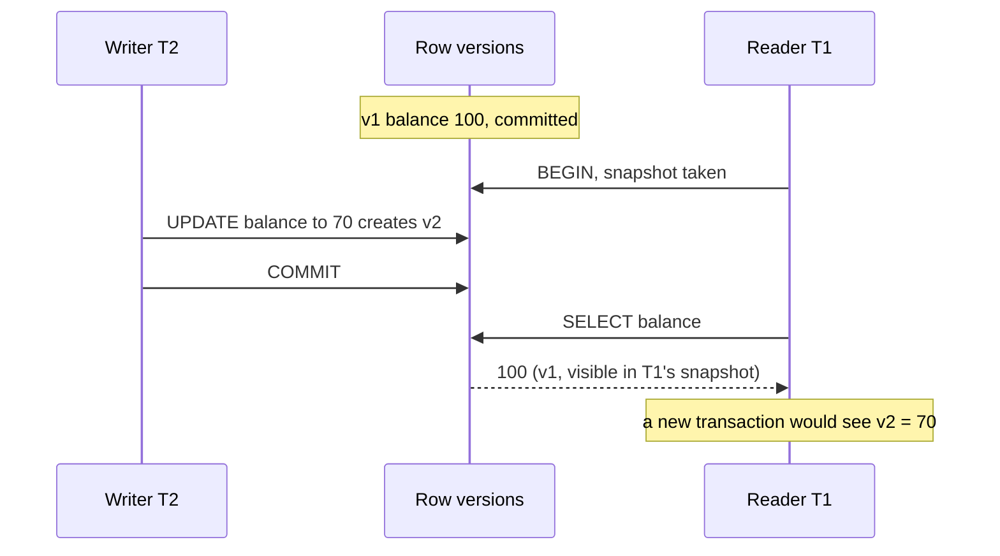
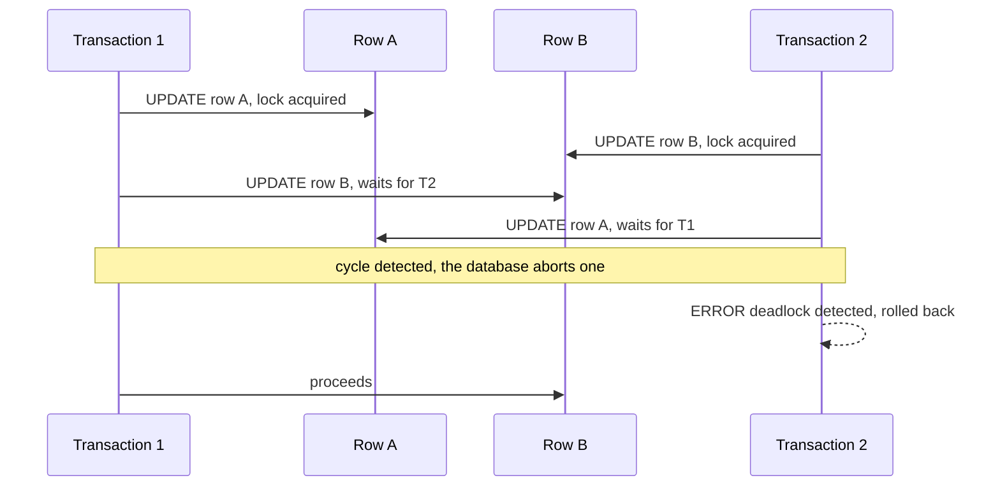
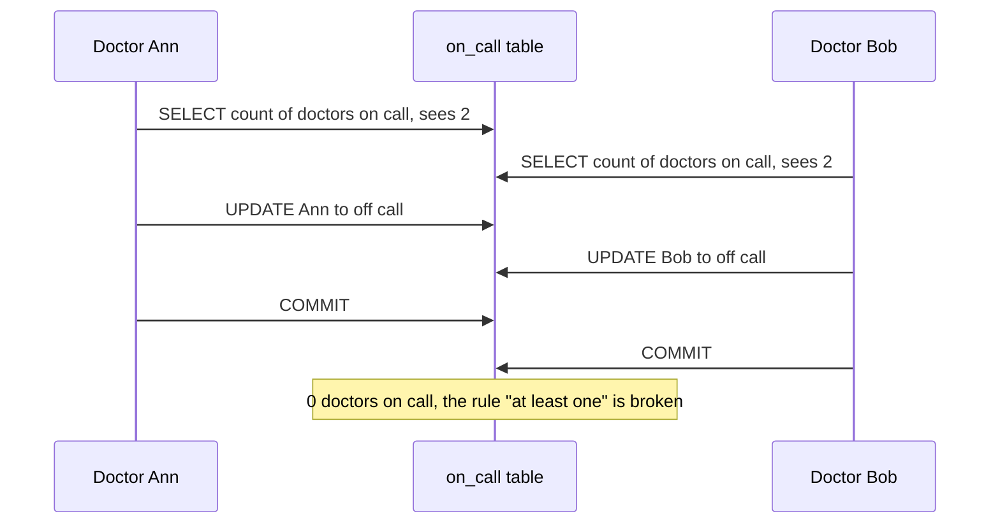

# 📘 Transactions and Concurrency

A transaction groups several operations into one all-or-nothing unit, and concurrency control decides what happens when many transactions run at once.
This is the most interview-heavy database topic, and the source of the subtlest production bugs: oversold stock, double bookings, lost updates, deadlocks.
Runnable examples use SQLite for portability. Behavior that differs by engine is labelled.

## Table of Contents

1. [ACID](#1-acid)
2. [Transaction Control](#2-transaction-control)
3. [Anomalies and Isolation Levels](#3-anomalies-and-isolation-levels)
4. [MVCC](#4-mvcc)
5. [Locking](#5-locking)
6. [Deadlocks](#6-deadlocks)
7. [Optimistic and Pessimistic Concurrency](#7-optimistic-and-pessimistic-concurrency)
8. [Patterns That Work](#8-patterns-that-work)
9. [Write Skew and Serializable](#9-write-skew-and-serializable)
10. [Durability and the WAL](#10-durability-and-the-wal)
11. [Choosing an Isolation Level](#11-choosing-an-isolation-level)
12. [Questions and Answers](#12-questions-and-answers)

---

## 1. ACID

| Property | Promise | Typical mechanism |
| --- | --- | --- |
| **Atomicity** | All operations happen or none do | Undo information, rollback on failure |
| **Consistency** | A transaction moves the database from one valid state to another (constraints hold) | Constraints, triggers, and correct application logic |
| **Isolation** | Concurrent transactions do not see each other's partial work | MVCC snapshots or locks |
| **Durability** | Committed data survives a crash | Write-ahead log flushed to disk before commit returns |

Two clarifications interviewers like:

- The "C" in ACID is about **application invariants** (balance never negative), which the database can only enforce if you declare them as constraints. It is **not** the "C" in CAP, which means linearizability across replicas.
- Isolation is a spectrum. The default level in most databases is **not** fully serializable, which is why anomalies exist.

---

## 2. Transaction Control

```text
BEGIN;                    start (or START TRANSACTION)
  ... statements ...
SAVEPOINT s1;             a named point inside the transaction
  ... statements ...
ROLLBACK TO s1;           undo back to the savepoint, keep the transaction open
COMMIT;                   make everything durable and visible
ROLLBACK;                 undo everything
```

- **Autocommit:** by default each statement is its own transaction. `BEGIN` turns it off until commit.
- An error inside a PostgreSQL transaction **aborts the whole transaction** until you roll back (or roll back to a savepoint). MySQL usually lets you continue after a failed statement.
- Keep transactions **short**. A transaction that waits for user input or a network call holds locks and pins old row versions.

```sql
-- runnable
CREATE TABLE accounts (id INTEGER PRIMARY KEY, balance INTEGER NOT NULL CHECK (balance >= 0));
INSERT INTO accounts VALUES (1, 100), (2, 50);

BEGIN;
UPDATE accounts SET balance = balance - 30 WHERE id = 1;
SAVEPOINT after_debit;
UPDATE accounts SET balance = balance + 999 WHERE id = 2;   -- a mistake
ROLLBACK TO after_debit;                                      -- undo only the mistake
UPDATE accounts SET balance = balance + 30 WHERE id = 2;
COMMIT;
SELECT id, balance FROM accounts ORDER BY id;                 -- 70 and 80: the transfer is intact

BEGIN;
UPDATE accounts SET balance = 0 WHERE id = 1;
ROLLBACK;                                                     -- nothing happened
SELECT balance FROM accounts WHERE id = 1;                    -- still 70
```

---

## 3. Anomalies and Isolation Levels

### 3.1 The Anomalies

| Anomaly | What happens | Example |
| --- | --- | --- |
| **Dirty read** | Read another transaction's uncommitted data | See a balance that is later rolled back |
| **Non-repeatable read** | Read the same row twice, get different values | Balance changes between two reads in one transaction |
| **Phantom read** | Run the same range query twice, get a different set of rows | New matching rows appear |
| **Lost update** | Two read-modify-write cycles, one overwrites the other | Two clerks add stock: both read 10, one writes 15, the other 12 |
| **Read skew** | See parts of two different states | Read account A before a transfer and account B after it, the sum is wrong |
| **Write skew** | Two transactions read overlapping data, then each write a different row, together breaking an invariant | Two doctors both go off call because each saw the other on call |

### 3.2 The Levels (SQL Standard View)

| Level | Dirty read | Non-repeatable read | Phantom |
| --- | --- | --- | --- |
| Read Uncommitted | possible | possible | possible |
| Read Committed | prevented | possible | possible |
| Repeatable Read | prevented | prevented | possible in the standard |
| Serializable | prevented | prevented | prevented |

The standard says nothing about lost update and write skew, and real engines differ from the table, so know the engine.

### 3.3 What Real Engines Do

| Engine | Default | Repeatable Read is actually | Serializable is |
| --- | --- | --- | --- |
| **PostgreSQL** | Read Committed | **Snapshot isolation**: also prevents phantoms, still allows write skew, aborts concurrent updates of the same row | **SSI** (serializable snapshot isolation): detects dangerous patterns and aborts one transaction with error `40001`, no extra blocking |
| **MySQL InnoDB** | **Repeatable Read** | Snapshot for plain reads, but locking reads and writes use current data and **next-key (gap) locks** | Plain `SELECT` becomes `SELECT ... FOR SHARE`, lots of locking |
| **Oracle** | Read Committed | n/a (no level of that name) | Actually snapshot isolation |
| **SQL Server** | Read Committed (locking), or **RCSI** (row versioning) when enabled, which is the default on Azure SQL | Locking | Locking, or `SNAPSHOT` isolation as a separate level |
| **SQLite** | Serializable | n/a | One writer at a time, readers can run beside the writer in WAL mode |
| **CockroachDB, Spanner** | Serializable or strict serializable | | Distributed, see [Distributed Systems](/docs/system-design/hld/distributed-systems) |

Practical consequences:

- **Read Committed** (PostgreSQL default): each statement sees data committed before the statement began. Two statements in a transaction can see different data.
- **Repeatable Read / Snapshot:** the whole transaction sees one consistent snapshot, ideal for reports. Writers who collide on the same row: PostgreSQL aborts the later one with a serialization error, MySQL waits on the lock.
- **Serializable** gives the illusion of serial execution. You pay with aborts and retries, so your application must **retry on serialization failures**.

---

## 4. MVCC

**Multi-Version Concurrency Control** keeps several versions of a row so that **readers do not block writers and writers do not block readers**.



How engines implement it:

| Engine | Old versions live in | Cleanup |
| --- | --- | --- |
| **PostgreSQL** | The table heap itself. Each row version has `xmin` (creating transaction) and `xmax` (deleting or updating transaction). An update writes a new row version. | **VACUUM** reclaims dead versions, autovacuum runs it. Long transactions prevent cleanup and cause bloat |
| **MySQL InnoDB** | **Undo log** (rollback segment). The table holds the latest version, and older ones are rebuilt from undo records | A purge thread removes undo records no snapshot needs. Long transactions grow the undo log |
| **Oracle** | Undo tablespace | Automatic, "snapshot too old" if undo is overwritten |

A **snapshot** decides which versions a transaction sees: the ones committed before it (or the statement) started.

Consequences worth stating:

- **Long-running transactions are dangerous:** they hold back cleanup (bloat, growing undo), and idle-in-transaction sessions keep locks. Set `idle_in_transaction_session_timeout`.
- **Reads take no locks**, so reporting queries do not block writes. This is why snapshot isolation is so popular.
- **Updates are inserts:** in PostgreSQL an update rewrites the row and may touch every index (unless HOT), so high-churn tables need vacuum tuning.
- **Transaction ID wraparound** (PostgreSQL 32-bit transaction ids): vacuum "freezes" old rows to prevent it. Ignoring vacuum eventually forces the database into read-only protection.

---

## 5. Locking

Locks protect data that a transaction is changing.
MVCC removes most **read** locking, but **write-write** conflicts still need locks.

### 5.1 Lock Modes

| Mode | Held by | Compatible with |
| --- | --- | --- |
| **Shared (S)** | Readers who need to keep data from changing | Other S locks |
| **Exclusive (X)** | Writers | Nothing |
| **Intent (IS, IX)** | A table-level marker that row locks exist below | Allows the engine to check table conflicts cheaply |

| Lock granularity | Notes |
| --- | --- |
| **Row lock** | Normal for `UPDATE` and `DELETE`, the default working unit |
| **Page or table lock** | DDL, bulk operations, lock escalation in SQL Server |
| **Gap and next-key locks** (InnoDB) | Lock the gaps between index entries to prevent phantoms under Repeatable Read |
| **Advisory locks** (PostgreSQL) | Application-defined named locks (`pg_advisory_lock`), useful for cross-process coordination |

An `UPDATE` takes row locks and holds them **until the transaction ends**.
So another transaction updating the same row waits.

### 5.2 Explicit Row Locks

```text
SELECT * FROM accounts WHERE id = 1 FOR UPDATE;               lock the row, blocks other writers and lockers
SELECT * FROM accounts WHERE id = 1 FOR SHARE;                block writers, allow other readers
SELECT ... FOR UPDATE NOWAIT;                                 fail immediately if the row is locked
SELECT ... FOR UPDATE SKIP LOCKED;                            skip rows other transactions have locked
```

`FOR UPDATE` is the tool for **read-then-write** logic: read, decide, write, with nobody changing the row in between.

**The job queue pattern with `SKIP LOCKED`** lets many workers pull work without blocking each other:

```text
BEGIN;
SELECT id, payload FROM jobs
WHERE status = 'PENDING'
ORDER BY id
LIMIT 10
FOR UPDATE SKIP LOCKED;          -- each worker gets a different batch, no waiting
-- process, then:
UPDATE jobs SET status = 'DONE' WHERE id = ANY(:ids);
COMMIT;
```

Works in PostgreSQL 9.5+, MySQL 8.0+, Oracle, and SQL Server (`READPAST`).
It is the basis of database-backed queues, see [Backend async processing](/docs/backend/async-processing-and-messaging).

### 5.3 DDL and Locks

Schema changes can take strong locks.
Adding a column with a default, changing a type, or building a plain index can block writes on a big table.
Use online schema change techniques, see [Replication, Sharding and Operations](/docs/databases/replication-sharding-and-operations).
Always set a **lock timeout** on migrations so a blocked `ALTER` does not queue up every other query behind it.

---

## 6. Deadlocks

A **deadlock** is a cycle of transactions each waiting for a lock another holds.



- The database keeps a **wait-for graph** and detects cycles (PostgreSQL checks after `deadlock_timeout`, InnoDB checks immediately). One transaction is chosen as the victim and rolled back (error `40P01` in PostgreSQL, `1213` in MySQL).
- **Prevent** by always acquiring locks in a **consistent order** (for example lower account id first, exactly as in the bank transfer in [Concurrency in LLD](/docs/system-design/lld/concurrency-in-lld)), by keeping transactions short, by updating fewer rows per transaction, and by indexing the columns used in `WHERE` so that fewer rows are locked (InnoDB locks every row it scans).
- **Handle** by catching the deadlock error and **retrying** the whole transaction. Treat deadlocks as a normal, retryable event.
- **Diagnose** with the deadlock graph in the server log (`log_lock_waits`, `SHOW ENGINE INNODB STATUS`).

---

## 7. Optimistic and Pessimistic Concurrency

| | Pessimistic | Optimistic |
| --- | --- | --- |
| Idea | Lock first, then work | Work without locks, check for conflict at commit |
| Tools | `SELECT ... FOR UPDATE`, advisory locks | A `version` column or `updated_at` checked in the `UPDATE`, or serializable retries |
| Good when | Conflicts are common, work inside the transaction is short | Conflicts are rare, or the user thinks between read and write |
| Cost | Blocking, deadlock risk | Wasted work and retries when conflicts occur |

Optimistic locking with a version column:

```text
Read:    SELECT qty, version FROM stock WHERE sku = 'A';           -> qty 5, version 0
Write:   UPDATE stock SET qty = 10, version = version + 1
         WHERE sku = 'A' AND version = 0;
Check:   rows affected = 1 means success, 0 means someone else changed it: re-read and retry (or tell the user)
```

ORMs implement this with `@Version` (JPA), a `lock_version` column (Rails), or concurrency tokens (Entity Framework).

```sql
-- runnable
CREATE TABLE stock (sku TEXT PRIMARY KEY, qty INTEGER NOT NULL CHECK (qty >= 0), version INTEGER NOT NULL DEFAULT 0);
INSERT INTO stock VALUES ('A', 5, 0);

-- Atomic conditional decrement: the check and the write are ONE statement, so no oversell.
-- RETURNING prints a row when it succeeded. No row printed means "not enough stock".
UPDATE stock SET qty = qty - 3 WHERE sku = 'A' AND qty >= 3 RETURNING 'reserved 3, left' AS result, qty;
UPDATE stock SET qty = qty - 3 WHERE sku = 'A' AND qty >= 3 RETURNING 'reserved 3, left' AS result, qty;   -- prints nothing

-- Optimistic locking. Two clients both read version 0.
SELECT qty, version FROM stock WHERE sku = 'A';
-- Client 1 writes first with a version check: succeeds and bumps the version
UPDATE stock SET qty = 10, version = version + 1 WHERE sku = 'A' AND version = 0 RETURNING 'client 1 won, new version' AS result, version;
-- Client 2 still holds version 0: zero rows updated, nothing printed. It must re-read and retry.
UPDATE stock SET qty = 20, version = version + 1 WHERE sku = 'A' AND version = 0 RETURNING 'client 2 won' AS result, version;
SELECT sku, qty, version FROM stock;
```

---

## 8. Patterns That Work

These patterns cover most real concurrency bugs.

### 8.1 Never Read-Modify-Write in the Application

```text
BAD:   qty = SELECT qty ...; UPDATE ... SET qty = qty_in_app - 1     race: two requests both read 10, both write 9
GOOD:  UPDATE stock SET qty = qty - 1 WHERE sku = ? AND qty >= 1     atomic, and the CHECK stays true
```

Push the arithmetic and the condition into one statement, and use the affected row count as the result.

### 8.2 Let Constraints Do the Work

| Need | Constraint |
| --- | --- |
| No double booking of a seat | `UNIQUE (show_id, seat_id)` on confirmed bookings |
| One active subscription per user | Partial unique index `UNIQUE (user_id) WHERE status = 'ACTIVE'` |
| No overlapping reservations for a room | PostgreSQL **exclusion constraint** with a range type: `EXCLUDE USING gist (room WITH =, during WITH &&)` |
| Never negative balance | `CHECK (balance >= 0)` |
| Idempotent payment | `UNIQUE (idempotency_key)`, insert first, handle the duplicate error |
| Exactly one row per key with upsert | `INSERT ... ON CONFLICT DO UPDATE` |

A constraint is checked under concurrency by the database, an application `if` is not.

### 8.3 Reserve Then Confirm (Holds)

For tickets and inventory, insert a **hold row with an expiry**, confirm on payment, and let a background job expire stale holds.
The [ticket booking design](/docs/system-design/hld/large-scale-designs) and the [movie booking code](/docs/system-design/lld/machine-coding-problems-2) use exactly this.

### 8.4 Idempotency Table

```text
CREATE TABLE idempotency_keys (key TEXT PRIMARY KEY, request_hash TEXT NOT NULL, response JSONB, created_at TIMESTAMPTZ NOT NULL);

BEGIN;
INSERT INTO idempotency_keys (key, request_hash, created_at) VALUES (:k, :h, now());   -- duplicate key error means a retry
-- do the work, store the response
COMMIT;
```

### 8.5 Counters and Sequences

- Increment in SQL (`SET n = n + 1`), not in the app.
- Hot counters (page views) become a **contention point** on one row, so shard the counter across N rows and sum, or aggregate asynchronously.
- Sequences and identity columns hand out unique numbers but leave **gaps** (rolled back transactions, cached ranges). Never require gapless invoice numbers from a sequence alone.

### 8.6 Advisory or Named Locks

For "only one instance runs this job", use `pg_try_advisory_lock(key)` or `GET_LOCK()` in MySQL.
The lock is released at session end, which handles crashes.

---

## 9. Write Skew and Serializable

Write skew slips through snapshot isolation.



Each transaction updated a **different row**, so there is no row conflict for snapshot isolation to detect.

Fixes, in order of preference:

1. **Serializable isolation** (`SET TRANSACTION ISOLATION LEVEL SERIALIZABLE`). PostgreSQL detects the dangerous read-write dependency cycle and aborts one transaction. The application retries.
2. **Lock the rows the decision depends on:** `SELECT ... FROM on_call WHERE shift = ? FOR UPDATE`, so the second transaction waits and then sees the updated state.
3. **Materialize the conflict:** add a row both transactions must update (a per-shift counter), forcing a write-write conflict.
4. **Enforce the rule in the database:** a constraint or trigger where possible.

**Retry loop for serializable transactions** (pseudocode):

```text
for attempt in 1..5:
    try:
        BEGIN ISOLATION LEVEL SERIALIZABLE
        ... work ...
        COMMIT
        break
    catch serialization_failure (40001) or deadlock (40P01):
        ROLLBACK
        sleep(backoff with jitter)
```

The whole transaction body must be **idempotent or side-effect free** apart from the database, because it may run more than once.
Do not send emails or call payment APIs inside it, use an outbox row instead.

---

## 10. Durability and the WAL

To make commit fast **and** safe, databases use a **write-ahead log (WAL)**.

1. The change is appended to the sequential log and the log is flushed (`fsync`) to disk.
2. Commit returns.
3. The modified data pages are written to the data files **later**, lazily, in the background (checkpoints).

After a crash, **recovery replays the log** to redo committed changes and undo uncommitted ones.
Sequential log writes are far cheaper than random page writes, which is why commit is fast.

| Setting | Effect |
| --- | --- |
| `fsync` on (never turn off) | Data survives power loss |
| PostgreSQL `synchronous_commit = off` | Commit returns before the flush: faster, may lose the last fraction of a second on crash, never corrupts |
| InnoDB `innodb_flush_log_at_trx_commit = 1` | Flush on every commit (durable), `2` or `0` trade durability for speed |
| **Group commit** | Many concurrent commits share one flush |
| Synchronous replication | Commit waits for a replica, no data loss on failover, higher latency |

Details of the log, checkpoints and recovery are in [Database Internals](/docs/databases/database-internals).

For transactions across several databases or services, see two-phase commit and sagas in [Distributed Systems](/docs/system-design/hld/distributed-systems).

---

## 11. Choosing an Isolation Level

```mermaid
flowchart TD
  S["Transaction to design"] --> A{"Read-only report or export<br/>needing one consistent view?"}
  A -->|"yes"| RR["Repeatable Read or Snapshot<br/>read replica if heavy"]
  A -->|"no"| B{"Read-modify-write on rows<br/>or a decision spanning several rows?"}
  B -->|"single row"| AT["Atomic UPDATE with condition,<br/>or version column"]
  B -->|"several rows, invariant across them"| C{"Can a constraint enforce it?"}
  C -->|"yes"| CO["Unique, exclusion, check constraint"]
  C -->|"no"| SE["Serializable with retries,<br/>or FOR UPDATE on the rows read"]
  A -->|"simple independent writes"| RC["Read Committed is fine"]
```



Rules of thumb:

- **Read Committed** plus atomic statements, constraints and `FOR UPDATE` where needed covers most OLTP code.
- Use **Repeatable Read or Snapshot** for consistent reads across several queries.
- Use **Serializable** when correctness across rows matters more than throughput, and you can retry.
- Whatever you pick, **test under concurrency** with many parallel clients and assert invariants, see [Concurrency in LLD](/docs/system-design/lld/concurrency-in-lld) for the start-gate technique.

---

## 12. Questions and Answers

**Q1. Explain ACID with a bank transfer.**
Atomicity: debit and credit both happen or neither.
Consistency: total money and non-negative balances hold.
Isolation: a concurrent report never sees money in transit.
Durability: once committed, the transfer survives a crash.

**Q2. What is MVCC and why is it useful?**
Keeping multiple row versions so each transaction reads a consistent snapshot without locks.
Readers do not block writers, at the cost of storing old versions and cleaning them up (vacuum or undo purge).

**Q3. What is a lost update and how do you prevent it?**
Two read-modify-write cycles where one overwrites the other.
Use an atomic `UPDATE ... SET x = x + 1`, `SELECT FOR UPDATE`, a version column, or serializable isolation.

**Q4. Explain write skew.**
Two transactions read the same data, then update different rows, jointly violating an invariant, invisible to row-level conflict detection.
Prevent with serializable isolation, locking the rows read, or materializing the conflict.

**Q5. What is a deadlock and how do you handle it?**
A cycle of lock waits.
The database detects it and aborts a victim.
Prevent with consistent lock ordering and short transactions, and always retry on deadlock errors.

**Q6. Pessimistic or optimistic locking?**
Pessimistic when contention is high and the critical section is short.
Optimistic when conflicts are rare or when users hold data during think time, using a version check and retry.

**Q7. What does `SELECT FOR UPDATE SKIP LOCKED` do?**
Locks the selected rows and skips rows already locked by others, so concurrent workers pull different rows from a queue without blocking.

**Q8. How do you prevent overselling?**
One conditional statement: `UPDATE stock SET qty = qty - :n WHERE sku = :s AND qty >= :n`, and check the affected row count, backed by `CHECK (qty >= 0)`.

**Q9. Read Committed vs Repeatable Read in PostgreSQL?**
Read Committed: each statement sees the latest committed data.
Repeatable Read: the whole transaction sees one snapshot taken at its first statement and errors on conflicting concurrent updates.

**Q10. Why can long transactions hurt?**
They hold locks, block vacuum or undo purge causing bloat, and increase the chance of conflicts and deadlocks.

**Q11. How does the WAL provide durability and speed?**
Commits append to a sequential log and flush it, then data files are updated later.
After a crash the log is replayed.

**Q12. How do you enforce "one active booking per room and time range"?**
A PostgreSQL exclusion constraint on a range type, or lock the room row with `FOR UPDATE` and check for overlap in the same transaction.

Next: [Database Internals](/docs/databases/database-internals).
