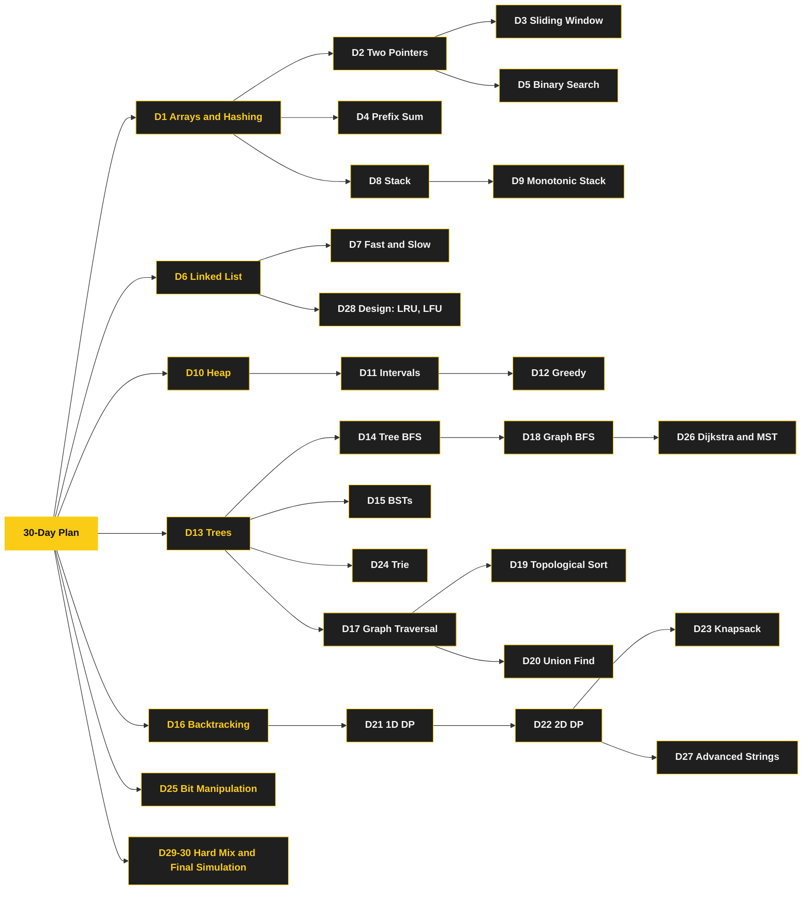

# 📘 LeetCode 30-Day Revision Plan

A pattern-by-pattern practice list: 30 days, 5 problems a day, 150 slots.
It is meant to be run after (or alongside) the pattern notes in this section, so most days link back to the note that teaches the pattern.
Only the problem lists are included here.
Worked solutions are in the pattern pages, not here.

138 problems are unique (31 Easy, 95 Medium, 12 Hard).
The rest are deliberate repeats, for example Daily Temperatures on both Day 8 and Day 9.
🔒 marks a LeetCode Premium problem (252, 253, 269, 1136, 261, 271).

## Table of Contents

1. [How the 30 Days Build on Each Other](#how-the-30-days-build-on-each-other)
2. [How to Run a Day](#how-to-run-a-day)
3. [Day by Day](#day-by-day)
4. [Problems That Repeat](#problems-that-repeat)
5. [Patterns With No Notes Page Yet](#patterns-with-no-notes-page-yet)

---

## How the 30 Days Build on Each Other

Read the tree left to right: a pattern sits to the right of the pattern it builds on.
D1 to D30 are the day numbers.
The schedule below stays in day order, but the tree shows which earlier pattern to revisit when a day feels hard.
If you are short on time, finish one branch at a time.

---

## How to Run a Day

1. Read the pattern note for the day (linked under each day heading) for 10 minutes.
2. Try each problem for 20 to 25 minutes before looking at any hint.
3. Say the pattern and the invariant out loud before you code.
4. Mark any problem you needed a hint for and redo it a week later.

Day 30 is a simulation.
Do it in one sitting with a timer and no notes.

---

## Day by Day

### Day 1: Arrays & Hashing

Notes: none yet, see [Patterns With No Notes Page Yet](#patterns-with-no-notes-page-yet)

| # | Problem | Difficulty |
| --- | --- | --- |
| 1 | [Two Sum](https://leetcode.com/problems/two-sum/) | Easy |
| 217 | [Contains Duplicate](https://leetcode.com/problems/contains-duplicate/) | Easy |
| 242 | [Valid Anagram](https://leetcode.com/problems/valid-anagram/) | Easy |
| 49 | [Group Anagrams](https://leetcode.com/problems/group-anagrams/) | Medium |
| 238 | [Product of Array Except Self](https://leetcode.com/problems/product-of-array-except-self/) | Medium |

### Day 2: Two Pointers

Notes: [Two Pointers](/docs/dsa/arrays-and-linked-lists#3-two-pointers)

| # | Problem | Difficulty |
| --- | --- | --- |
| 125 | [Valid Palindrome](https://leetcode.com/problems/valid-palindrome/) | Easy |
| 167 | [Two Sum II - Input Array Is Sorted](https://leetcode.com/problems/two-sum-ii-input-array-is-sorted/) | Medium |
| 15 | [3Sum](https://leetcode.com/problems/3sum/) | Medium |
| 11 | [Container With Most Water](https://leetcode.com/problems/container-with-most-water/) | Medium |
| 42 | [Trapping Rain Water](https://leetcode.com/problems/trapping-rain-water/) | Hard |

### Day 3: Sliding Window

Notes: [Sliding Window](/docs/dsa/arrays-and-linked-lists#2-sliding-window)

| # | Problem | Difficulty |
| --- | --- | --- |
| 121 | [Best Time to Buy and Sell Stock](https://leetcode.com/problems/best-time-to-buy-and-sell-stock/) | Easy |
| 3 | [Longest Substring Without Repeating Characters](https://leetcode.com/problems/longest-substring-without-repeating-characters/) | Medium |
| 424 | [Longest Repeating Character Replacement](https://leetcode.com/problems/longest-repeating-character-replacement/) | Medium |
| 567 | [Permutation in String](https://leetcode.com/problems/permutation-in-string/) | Medium |
| 76 | [Minimum Window Substring](https://leetcode.com/problems/minimum-window-substring/) | Hard |

### Day 4: Prefix Sum

Notes: [Prefix Sum and Hash Map](/docs/dsa/pattern-playbook#61-prefix-sum-and-hash-map)

| # | Problem | Difficulty |
| --- | --- | --- |
| 1480 | [Running Sum of 1d Array](https://leetcode.com/problems/running-sum-of-1d-array/) | Easy |
| 303 | [Range Sum Query - Immutable](https://leetcode.com/problems/range-sum-query-immutable/) | Easy |
| 560 | [Subarray Sum Equals K](https://leetcode.com/problems/subarray-sum-equals-k/) | Medium |
| 724 | [Find Pivot Index](https://leetcode.com/problems/find-pivot-index/) | Easy |
| 238 | [Product of Array Except Self](https://leetcode.com/problems/product-of-array-except-self/) | Medium |

### Day 5: Binary Search

Notes: [Modified Binary Search](/docs/dsa/trees-graphs-and-search#6-modified-binary-search)

| # | Problem | Difficulty |
| --- | --- | --- |
| 704 | [Binary Search](https://leetcode.com/problems/binary-search/) | Easy |
| 74 | [Search a 2D Matrix](https://leetcode.com/problems/search-a-2d-matrix/) | Medium |
| 875 | [Koko Eating Bananas](https://leetcode.com/problems/koko-eating-bananas/) | Medium |
| 153 | [Find Minimum in Rotated Sorted Array](https://leetcode.com/problems/find-minimum-in-rotated-sorted-array/) | Medium |
| 33 | [Search in Rotated Sorted Array](https://leetcode.com/problems/search-in-rotated-sorted-array/) | Medium |

### Day 6: Linked List

Notes: [In-Place Reversal](/docs/dsa/arrays-and-linked-lists#7-in-place-reversal-of-a-linked-list)

| # | Problem | Difficulty |
| --- | --- | --- |
| 206 | [Reverse Linked List](https://leetcode.com/problems/reverse-linked-list/) | Easy |
| 21 | [Merge Two Sorted Lists](https://leetcode.com/problems/merge-two-sorted-lists/) | Easy |
| 141 | [Linked List Cycle](https://leetcode.com/problems/linked-list-cycle/) | Easy |
| 19 | [Remove Nth Node From End of List](https://leetcode.com/problems/remove-nth-node-from-end-of-list/) | Medium |
| 143 | [Reorder List](https://leetcode.com/problems/reorder-list/) | Medium |

### Day 7: Fast & Slow Pointers

Notes: [Fast and Slow Pointers](/docs/dsa/arrays-and-linked-lists#4-fast-and-slow-pointers)

| # | Problem | Difficulty |
| --- | --- | --- |
| 141 | [Linked List Cycle](https://leetcode.com/problems/linked-list-cycle/) | Easy |
| 202 | [Happy Number](https://leetcode.com/problems/happy-number/) | Easy |
| 876 | [Middle of the Linked List](https://leetcode.com/problems/middle-of-the-linked-list/) | Easy |
| 287 | [Find the Duplicate Number](https://leetcode.com/problems/find-the-duplicate-number/) | Medium |
| 234 | [Palindrome Linked List](https://leetcode.com/problems/palindrome-linked-list/) | Easy |

### Day 8: Stack

Notes: none yet, see [Patterns With No Notes Page Yet](#patterns-with-no-notes-page-yet)

| # | Problem | Difficulty |
| --- | --- | --- |
| 20 | [Valid Parentheses](https://leetcode.com/problems/valid-parentheses/) | Easy |
| 155 | [Min Stack](https://leetcode.com/problems/min-stack/) | Medium |
| 150 | [Evaluate Reverse Polish Notation](https://leetcode.com/problems/evaluate-reverse-polish-notation/) | Medium |
| 22 | [Generate Parentheses](https://leetcode.com/problems/generate-parentheses/) | Medium |
| 739 | [Daily Temperatures](https://leetcode.com/problems/daily-temperatures/) | Medium |

### Day 9: Monotonic Stack

Notes: [Monotonic Stack](/docs/dsa/pattern-playbook#62-monotonic-stack)

| # | Problem | Difficulty |
| --- | --- | --- |
| 739 | [Daily Temperatures](https://leetcode.com/problems/daily-temperatures/) | Medium |
| 496 | [Next Greater Element I](https://leetcode.com/problems/next-greater-element-i/) | Easy |
| 503 | [Next Greater Element II](https://leetcode.com/problems/next-greater-element-ii/) | Medium |
| 84 | [Largest Rectangle in Histogram](https://leetcode.com/problems/largest-rectangle-in-histogram/) | Hard |
| 853 | [Car Fleet](https://leetcode.com/problems/car-fleet/) | Medium |

### Day 10: Heap / Priority Queue

Notes: [Top K Elements](/docs/dsa/trees-graphs-and-search#7-top-k-elements), [Two Heaps](/docs/dsa/trees-graphs-and-search#4-two-heaps)

| # | Problem | Difficulty |
| --- | --- | --- |
| 215 | [Kth Largest Element in an Array](https://leetcode.com/problems/kth-largest-element-in-an-array/) | Medium |
| 1046 | [Last Stone Weight](https://leetcode.com/problems/last-stone-weight/) | Easy |
| 973 | [K Closest Points to Origin](https://leetcode.com/problems/k-closest-points-to-origin/) | Medium |
| 347 | [Top K Frequent Elements](https://leetcode.com/problems/top-k-frequent-elements/) | Medium |
| 295 | [Find Median from Data Stream](https://leetcode.com/problems/find-median-from-data-stream/) | Hard |

### Day 11: Intervals

Notes: [Merge Intervals](/docs/dsa/arrays-and-linked-lists#5-merge-intervals)

| # | Problem | Difficulty |
| --- | --- | --- |
| 56 | [Merge Intervals](https://leetcode.com/problems/merge-intervals/) | Medium |
| 57 | [Insert Interval](https://leetcode.com/problems/insert-interval/) | Medium |
| 435 | [Non-overlapping Intervals](https://leetcode.com/problems/non-overlapping-intervals/) | Medium |
| 252 | [Meeting Rooms](https://leetcode.com/problems/meeting-rooms/) 🔒 | Easy |
| 253 | [Meeting Rooms II](https://leetcode.com/problems/meeting-rooms-ii/) 🔒 | Medium |

### Day 12: Greedy

Notes: [Greedy](/docs/dsa/pattern-playbook#67-greedy)

| # | Problem | Difficulty |
| --- | --- | --- |
| 53 | [Maximum Subarray](https://leetcode.com/problems/maximum-subarray/) | Medium |
| 55 | [Jump Game](https://leetcode.com/problems/jump-game/) | Medium |
| 45 | [Jump Game II](https://leetcode.com/problems/jump-game-ii/) | Medium |
| 134 | [Gas Station](https://leetcode.com/problems/gas-station/) | Medium |
| 763 | [Partition Labels](https://leetcode.com/problems/partition-labels/) | Medium |

### Day 13: Trees

Notes: [Tree Depth-First Search](/docs/dsa/trees-graphs-and-search#3-tree-depth-first-search)

| # | Problem | Difficulty |
| --- | --- | --- |
| 226 | [Invert Binary Tree](https://leetcode.com/problems/invert-binary-tree/) | Easy |
| 104 | [Maximum Depth of Binary Tree](https://leetcode.com/problems/maximum-depth-of-binary-tree/) | Easy |
| 543 | [Diameter of Binary Tree](https://leetcode.com/problems/diameter-of-binary-tree/) | Easy |
| 110 | [Balanced Binary Tree](https://leetcode.com/problems/balanced-binary-tree/) | Easy |
| 100 | [Same Tree](https://leetcode.com/problems/same-tree/) | Easy |

### Day 14: Tree BFS

Notes: [Tree Breadth-First Search](/docs/dsa/trees-graphs-and-search#2-tree-breadth-first-search)

| # | Problem | Difficulty |
| --- | --- | --- |
| 102 | [Binary Tree Level Order Traversal](https://leetcode.com/problems/binary-tree-level-order-traversal/) | Medium |
| 199 | [Binary Tree Right Side View](https://leetcode.com/problems/binary-tree-right-side-view/) | Medium |
| 637 | [Average of Levels in Binary Tree](https://leetcode.com/problems/average-of-levels-in-binary-tree/) | Easy |
| 103 | [Binary Tree Zigzag Level Order Traversal](https://leetcode.com/problems/binary-tree-zigzag-level-order-traversal/) | Medium |
| 116 | [Populating Next Right Pointers in Each Node](https://leetcode.com/problems/populating-next-right-pointers-in-each-node/) | Medium |

### Day 15: Binary Search Trees

Notes: [Tree Depth-First Search](/docs/dsa/trees-graphs-and-search#3-tree-depth-first-search)

| # | Problem | Difficulty |
| --- | --- | --- |
| 700 | [Search in a Binary Search Tree](https://leetcode.com/problems/search-in-a-binary-search-tree/) | Easy |
| 98 | [Validate Binary Search Tree](https://leetcode.com/problems/validate-binary-search-tree/) | Medium |
| 230 | [Kth Smallest Element in a BST](https://leetcode.com/problems/kth-smallest-element-in-a-bst/) | Medium |
| 235 | [Lowest Common Ancestor of a Binary Search Tree](https://leetcode.com/problems/lowest-common-ancestor-of-a-binary-search-tree/) | Medium |
| 450 | [Delete Node in a BST](https://leetcode.com/problems/delete-node-in-a-bst/) | Medium |

### Day 16: Backtracking

Notes: [Subsets and Backtracking](/docs/dsa/trees-graphs-and-search#5-subsets-and-backtracking)

| # | Problem | Difficulty |
| --- | --- | --- |
| 78 | [Subsets](https://leetcode.com/problems/subsets/) | Medium |
| 39 | [Combination Sum](https://leetcode.com/problems/combination-sum/) | Medium |
| 46 | [Permutations](https://leetcode.com/problems/permutations/) | Medium |
| 90 | [Subsets II](https://leetcode.com/problems/subsets-ii/) | Medium |
| 79 | [Word Search](https://leetcode.com/problems/word-search/) | Medium |

### Day 17: Graph Traversal

Notes: [Tree Depth-First Search](/docs/dsa/trees-graphs-and-search#3-tree-depth-first-search)

| # | Problem | Difficulty |
| --- | --- | --- |
| 200 | [Number of Islands](https://leetcode.com/problems/number-of-islands/) | Medium |
| 695 | [Max Area of Island](https://leetcode.com/problems/max-area-of-island/) | Medium |
| 133 | [Clone Graph](https://leetcode.com/problems/clone-graph/) | Medium |
| 417 | [Pacific Atlantic Water Flow](https://leetcode.com/problems/pacific-atlantic-water-flow/) | Medium |
| 130 | [Surrounded Regions](https://leetcode.com/problems/surrounded-regions/) | Medium |

### Day 18: Graph BFS / Shortest Path

Notes: [Tree Breadth-First Search](/docs/dsa/trees-graphs-and-search#2-tree-breadth-first-search)

| # | Problem | Difficulty |
| --- | --- | --- |
| 994 | [Rotting Oranges](https://leetcode.com/problems/rotting-oranges/) | Medium |
| 542 | [01 Matrix](https://leetcode.com/problems/01-matrix/) | Medium |
| 127 | [Word Ladder](https://leetcode.com/problems/word-ladder/) | Hard |
| 1091 | [Shortest Path in Binary Matrix](https://leetcode.com/problems/shortest-path-in-binary-matrix/) | Medium |
| 752 | [Open the Lock](https://leetcode.com/problems/open-the-lock/) | Medium |

### Day 19: Topological Sort

Notes: [Topological Sort](/docs/dsa/trees-graphs-and-search#9-topological-sort)

| # | Problem | Difficulty |
| --- | --- | --- |
| 207 | [Course Schedule](https://leetcode.com/problems/course-schedule/) | Medium |
| 210 | [Course Schedule II](https://leetcode.com/problems/course-schedule-ii/) | Medium |
| 269 | [Alien Dictionary](https://leetcode.com/problems/alien-dictionary/) 🔒 | Hard |
| 802 | [Find Eventual Safe States](https://leetcode.com/problems/find-eventual-safe-states/) | Medium |
| 1136 | [Parallel Courses](https://leetcode.com/problems/parallel-courses/) 🔒 | Medium |

### Day 20: Union Find

Notes: [Union-Find](/docs/dsa/pattern-playbook#63-union-find-disjoint-set-union)

| # | Problem | Difficulty |
| --- | --- | --- |
| 547 | [Number of Provinces](https://leetcode.com/problems/number-of-provinces/) | Medium |
| 684 | [Redundant Connection](https://leetcode.com/problems/redundant-connection/) | Medium |
| 721 | [Accounts Merge](https://leetcode.com/problems/accounts-merge/) | Medium |
| 261 | [Graph Valid Tree](https://leetcode.com/problems/graph-valid-tree/) 🔒 | Medium |
| 947 | [Most Stones Removed with Same Row or Column](https://leetcode.com/problems/most-stones-removed-with-same-row-or-column/) | Medium |

### Day 21: 1D Dynamic Programming

Notes: [Dynamic Programming Recipe](/docs/dsa/pattern-playbook#64-dynamic-programming-recipe)

| # | Problem | Difficulty |
| --- | --- | --- |
| 70 | [Climbing Stairs](https://leetcode.com/problems/climbing-stairs/) | Easy |
| 198 | [House Robber](https://leetcode.com/problems/house-robber/) | Medium |
| 213 | [House Robber II](https://leetcode.com/problems/house-robber-ii/) | Medium |
| 322 | [Coin Change](https://leetcode.com/problems/coin-change/) | Medium |
| 300 | [Longest Increasing Subsequence](https://leetcode.com/problems/longest-increasing-subsequence/) | Medium |

### Day 22: 2D Dynamic Programming

Notes: [Dynamic Programming Recipe](/docs/dsa/pattern-playbook#64-dynamic-programming-recipe)

| # | Problem | Difficulty |
| --- | --- | --- |
| 62 | [Unique Paths](https://leetcode.com/problems/unique-paths/) | Medium |
| 1143 | [Longest Common Subsequence](https://leetcode.com/problems/longest-common-subsequence/) | Medium |
| 309 | [Best Time to Buy and Sell Stock with Cooldown](https://leetcode.com/problems/best-time-to-buy-and-sell-stock-with-cooldown/) | Medium |
| 518 | [Coin Change II](https://leetcode.com/problems/coin-change-ii/) | Medium |
| 97 | [Interleaving String](https://leetcode.com/problems/interleaving-string/) | Medium |

### Day 23: Knapsack / Subset DP

Notes: [Dynamic Programming Recipe](/docs/dsa/pattern-playbook#64-dynamic-programming-recipe)

| # | Problem | Difficulty |
| --- | --- | --- |
| 416 | [Partition Equal Subset Sum](https://leetcode.com/problems/partition-equal-subset-sum/) | Medium |
| 494 | [Target Sum](https://leetcode.com/problems/target-sum/) | Medium |
| 1049 | [Last Stone Weight II](https://leetcode.com/problems/last-stone-weight-ii/) | Medium |
| 474 | [Ones and Zeroes](https://leetcode.com/problems/ones-and-zeroes/) | Medium |
| 377 | [Combination Sum IV](https://leetcode.com/problems/combination-sum-iv/) | Medium |

### Day 24: Trie

Notes: [Trie](/docs/dsa/pattern-playbook#65-trie)

| # | Problem | Difficulty |
| --- | --- | --- |
| 208 | [Implement Trie (Prefix Tree)](https://leetcode.com/problems/implement-trie-prefix-tree/) | Medium |
| 211 | [Design Add and Search Words Data Structure](https://leetcode.com/problems/design-add-and-search-words-data-structure/) | Medium |
| 212 | [Word Search II](https://leetcode.com/problems/word-search-ii/) | Hard |
| 421 | [Maximum XOR of Two Numbers in an Array](https://leetcode.com/problems/maximum-xor-of-two-numbers-in-an-array/) | Medium |
| 648 | [Replace Words](https://leetcode.com/problems/replace-words/) | Medium |

### Day 25: Bit Manipulation

Notes: [Bit Manipulation](/docs/dsa/pattern-playbook#68-bit-manipulation)

| # | Problem | Difficulty |
| --- | --- | --- |
| 136 | [Single Number](https://leetcode.com/problems/single-number/) | Easy |
| 191 | [Number of 1 Bits](https://leetcode.com/problems/number-of-1-bits/) | Easy |
| 338 | [Counting Bits](https://leetcode.com/problems/counting-bits/) | Easy |
| 190 | [Reverse Bits](https://leetcode.com/problems/reverse-bits/) | Easy |
| 371 | [Sum of Two Integers](https://leetcode.com/problems/sum-of-two-integers/) | Medium |

### Day 26: Advanced Graphs

Notes: [Dijkstra](/docs/dsa/pattern-playbook#66-dijkstra-weighted-shortest-path)

| # | Problem | Difficulty |
| --- | --- | --- |
| 743 | [Network Delay Time](https://leetcode.com/problems/network-delay-time/) | Medium |
| 787 | [Cheapest Flights Within K Stops](https://leetcode.com/problems/cheapest-flights-within-k-stops/) | Medium |
| 1584 | [Min Cost to Connect All Points](https://leetcode.com/problems/min-cost-to-connect-all-points/) | Medium |
| 778 | [Swim in Rising Water](https://leetcode.com/problems/swim-in-rising-water/) | Hard |
| 332 | [Reconstruct Itinerary](https://leetcode.com/problems/reconstruct-itinerary/) | Hard |

### Day 27: Advanced Strings

Notes: none yet, see [Patterns With No Notes Page Yet](#patterns-with-no-notes-page-yet)

| # | Problem | Difficulty |
| --- | --- | --- |
| 5 | [Longest Palindromic Substring](https://leetcode.com/problems/longest-palindromic-substring/) | Medium |
| 647 | [Palindromic Substrings](https://leetcode.com/problems/palindromic-substrings/) | Medium |
| 271 | [Encode and Decode Strings](https://leetcode.com/problems/encode-and-decode-strings/) 🔒 | Medium |
| 139 | [Word Break](https://leetcode.com/problems/word-break/) | Medium |
| 1143 | [Longest Common Subsequence](https://leetcode.com/problems/longest-common-subsequence/) | Medium |

### Day 28: Advanced Data Structures

Notes: none yet, see [Patterns With No Notes Page Yet](#patterns-with-no-notes-page-yet)

| # | Problem | Difficulty |
| --- | --- | --- |
| 146 | [LRU Cache](https://leetcode.com/problems/lru-cache/) | Medium |
| 380 | [Insert Delete GetRandom O(1)](https://leetcode.com/problems/insert-delete-getrandom-o1/) | Medium |
| 355 | [Design Twitter](https://leetcode.com/problems/design-twitter/) | Medium |
| 981 | [Time Based Key-Value Store](https://leetcode.com/problems/time-based-key-value-store/) | Medium |
| 460 | [LFU Cache](https://leetcode.com/problems/lfu-cache/) | Hard |

### Day 29: Hard Interview Mix

Notes: [Modified Binary Search](/docs/dsa/trees-graphs-and-search#6-modified-binary-search), [K-way Merge](/docs/dsa/trees-graphs-and-search#8-k-way-merge), [Sliding Window](/docs/dsa/arrays-and-linked-lists#2-sliding-window), [Monotonic Stack](/docs/dsa/pattern-playbook#62-monotonic-stack)

| # | Problem | Difficulty |
| --- | --- | --- |
| 4 | [Median of Two Sorted Arrays](https://leetcode.com/problems/median-of-two-sorted-arrays/) | Hard |
| 23 | [Merge k Sorted Lists](https://leetcode.com/problems/merge-k-sorted-lists/) | Hard |
| 42 | [Trapping Rain Water](https://leetcode.com/problems/trapping-rain-water/) | Hard |
| 76 | [Minimum Window Substring](https://leetcode.com/problems/minimum-window-substring/) | Hard |
| 84 | [Largest Rectangle in Histogram](https://leetcode.com/problems/largest-rectangle-in-histogram/) | Hard |

### Day 30: Final Interview Simulation

Notes: none yet, see [Patterns With No Notes Page Yet](#patterns-with-no-notes-page-yet)

| # | Problem | Difficulty |
| --- | --- | --- |
| 1 | [Two Sum](https://leetcode.com/problems/two-sum/) | Easy |
| 3 | [Longest Substring Without Repeating Characters](https://leetcode.com/problems/longest-substring-without-repeating-characters/) | Medium |
| 200 | [Number of Islands](https://leetcode.com/problems/number-of-islands/) | Medium |
| 207 | [Course Schedule](https://leetcode.com/problems/course-schedule/) | Medium |
| 322 | [Coin Change](https://leetcode.com/problems/coin-change/) | Medium |

---

## Problems That Repeat

These appear on more than one day.
That is intentional revision, not a typo in the list.

| # | Problem | Days |
| --- | --- | --- |
| 1 | [Two Sum](https://leetcode.com/problems/two-sum/) | 1, 30 |
| 3 | [Longest Substring Without Repeating Characters](https://leetcode.com/problems/longest-substring-without-repeating-characters/) | 3, 30 |
| 42 | [Trapping Rain Water](https://leetcode.com/problems/trapping-rain-water/) | 2, 29 |
| 76 | [Minimum Window Substring](https://leetcode.com/problems/minimum-window-substring/) | 3, 29 |
| 84 | [Largest Rectangle in Histogram](https://leetcode.com/problems/largest-rectangle-in-histogram/) | 9, 29 |
| 141 | [Linked List Cycle](https://leetcode.com/problems/linked-list-cycle/) | 6, 7 |
| 200 | [Number of Islands](https://leetcode.com/problems/number-of-islands/) | 17, 30 |
| 207 | [Course Schedule](https://leetcode.com/problems/course-schedule/) | 19, 30 |
| 238 | [Product of Array Except Self](https://leetcode.com/problems/product-of-array-except-self/) | 1, 4 |
| 322 | [Coin Change](https://leetcode.com/problems/coin-change/) | 21, 30 |
| 739 | [Daily Temperatures](https://leetcode.com/problems/daily-temperatures/) | 8, 9 |
| 1143 | [Longest Common Subsequence](https://leetcode.com/problems/longest-common-subsequence/) | 22, 27 |

---

## Patterns With No Notes Page Yet

The 14 pattern pages and the Playbook cover most days.
These days have no matching note here yet:

- **Day 1, Arrays and Hashing:** hash map and hash set lookups.
  The Playbook's [complexity cheat sheet](/docs/dsa/pattern-playbook#5-complexity-cheat-sheet) has the costs.
- **Day 8, Stack:** matching and evaluation with a plain stack.
  [Monotonic Stack](/docs/dsa/pattern-playbook#62-monotonic-stack) is the closest note.
- **Day 27, Advanced Strings:** expand-around-center palindromes and string encoding.
  The [Dynamic Programming Recipe](/docs/dsa/pattern-playbook#64-dynamic-programming-recipe) covers the Word Break and Longest Common Subsequence style of DP.
- **Day 28, Advanced Data Structures:** LRU, LFU, and other design problems that combine a hash map with a linked list or heap.
- **Day 30, Final Interview Simulation:** mixed problems.
  Use the Playbook's [decision flow](/docs/dsa/pattern-playbook#2-a-decision-flow-for-unknown-problems) to pick the pattern.
