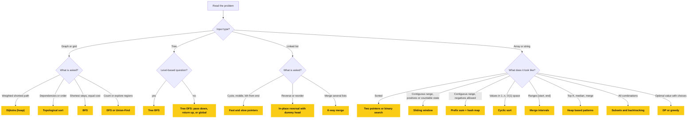

# 📘 Pattern Playbook

The [dsa-patterns](https://github.com/isayanpal/dsa-patterns) repository teaches 14 patterns.
This page is about what surrounds them: how to **pick** the pattern from a problem statement, how to run the interview, what complexity to expect, which patterns the 14 do not cover, and which JavaScript details cost people offers.
Java implementations of the extra patterns are in a **Java** subsection under each of them, followed by a Java collections cheat sheet, cost table, and interview template.

## Table of Contents

1. [Recognition Table](#1-recognition-table)
2. [A Decision Flow for Unknown Problems](#2-a-decision-flow-for-unknown-problems)
3. [The Interview Framework](#3-the-interview-framework)
4. [Constraints Tell You the Complexity](#4-constraints-tell-you-the-complexity)
5. [Complexity Cheat Sheet](#5-complexity-cheat-sheet)
6. [Patterns Beyond the 14](#6-patterns-beyond-the-14)
7. [Combining Patterns](#7-combining-patterns)
8. [JavaScript Gotchas That Break Solutions](#8-javascript-gotchas-that-break-solutions)
9. [Java Collections Cheat Sheet](#9-java-collections-cheat-sheet)
10. [Java Costs and Traps](#10-java-costs-and-traps)
11. [A Reusable Java Interview Template](#11-a-reusable-java-interview-template)
12. [Edge Case Checklist](#12-edge-case-checklist)
13. [Practice Roadmap](#13-practice-roadmap)
14. [One-Line Senior Summary](#14-one-line-senior-summary)

---

## 1. Recognition Table

Read the problem for these phrases before thinking about code.

| If the problem says | Think about | Why |
| --- | --- | --- |
| Longest, shortest, or maximum **contiguous** subarray or substring | Sliding window | State updates incrementally as the window moves |
| Sorted array, pair or triplet with a target sum | Two pointers | Sorted order lets you discard one side each step |
| Palindrome, reverse, compare from both ends | Two pointers | Symmetry |
| Cycle, loop, middle of a list, O(1) space | Fast and slow pointers | Different speeds meet inside a cycle |
| Overlapping ranges, meetings, schedules, calendars | Merge intervals | Sort by start, compare with the last merged |
| Numbers in `1..n` or `0..n`, find missing or duplicate, O(1) space | Cyclic sort | Value `x` belongs at index `x - 1` |
| Reverse a list or a segment, O(1) space | In-place reversal | Flip pointers as you walk |
| Level order, minimum depth, shortest path with equal weights | BFS | Queue explores by distance |
| Path sum, tree height, subtree property, all routes | DFS | Recursion carries or returns state |
| Median, running middle, two competing priorities | Two heaps | Max-heap of lower half, min-heap of upper half |
| All subsets, permutations, combinations | Subsets, backtracking | Choose, explore, undo |
| Sorted or rotated array, "O(log n)", "minimum X such that feasible" | Modified binary search | Halve the search space each step |
| K largest, smallest, most frequent, closest | Top K, heap | Size-K heap |
| K sorted lists or streams | K-way merge | Min-heap with one head per list |
| Prerequisites, dependencies, order of tasks | Topological sort | Kahn's algorithm, detect cycles |
| Subarray sum equals K with negatives | Prefix sum plus hash map | Sliding window fails on negatives |
| Next greater or smaller element | Monotonic stack | Stack keeps candidates in order |
| Are A and B connected, group components, detect cycle in undirected graph | Union-Find | Near constant merges and lookups |
| Count ways, min cost, max value with overlapping subproblems | Dynamic programming | Cache subproblem answers |
| Prefix search, autocomplete, word dictionary | Trie | Shared prefixes |
| Shortest path with weights | Dijkstra | Heap plus relaxation |

---

## 2. A Decision Flow for Unknown Problems



If two patterns fit, prefer the one with the simpler invariant that you can **explain in one sentence**.

---

## 3. The Interview Framework

The repository's preparation steps (read, clarify, identify, break down, pseudocode, test, implement, analyze, optimize) work best as a repeatable script.
Say each step out loud, it is what the interviewer is grading.

| Step | What you do | Example line |
| --- | --- | --- |
| 1. Restate | Say the problem in your own words | "So I get an array and must return the longest run where no value repeats." |
| 2. Clarify | Ask about input size, duplicates, negatives, sorted or not, empty input, mutation allowed, ties | "Can values be negative? Is it fine to modify the input?" |
| 3. Examples | Work one normal case and one edge case by hand | "For `[]` I return 0. For `[5]` I return 1." |
| 4. Brute force | State the obvious solution and its cost | "Check every pair, that is O(n²)." |
| 5. Find the bottleneck | Name what is repeated or wasted | "We recompute the same overlapping sums." |
| 6. Pick a pattern | Justify it with the signal from the recognition table | "Contiguous plus all positives, so a sliding window." |
| 7. Invariant | State what is always true in the loop | "Everything in `[left, right]` is unique." |
| 8. Code | Write clean code with small helpers, meaningful names | |
| 9. Dry run | Trace your own example line by line | |
| 10. Complexity | Time and space, including hidden costs (sort, recursion stack, output size) | "O(n) time, O(k) space for the map." |
| 11. Improve | Mention alternatives and tradeoffs | "If memory matters I could sort instead." |

### 3.1 What Interviewers Score

- **Communication**: thinking aloud beats silent coding.
- **Correctness**: passes your own edge cases before you say "done".
- **Complexity awareness**: you can defend the numbers.
- **Code quality**: readable names, no dead code, small functions.
- **Recovery**: when you hit a bug, you find it by tracing, not by guessing.

### 3.2 If You Are Stuck

1. Solve a **smaller** version by hand, write down what you did, then generalize.
2. Try the brute force and ask what work is repeated.
3. Sort the input, or put it in a hash map, and see if the problem gets easier.
4. Draw the structure (array, tree, graph) with the example.
5. Ask for a hint early. A hint at minute 15 costs less than silence until minute 35.

---

## 4. Constraints Tell You the Complexity

A machine does roughly 10^8 simple operations per second, so use the input size to work out which complexity is allowed.

| n is at most | Target complexity | Typical techniques |
| --- | --- | --- |
| 10 to 12 | O(n!) | Permutations, brute force backtracking |
| 20 to 25 | O(2^n) | Subsets, bitmask DP |
| 100 to 500 | O(n³) | Triple loops, Floyd-Warshall |
| 5,000 | O(n²) | Nested loops, 2D DP |
| 10^5 | O(n log n) | Sort, heap, binary search, sweep line |
| 10^6 | O(n) | Hash map, two pointers, sliding window |
| 10^9 or larger | O(log n) or O(1) | Binary search on answer, math formula |

If your first idea is O(n²) and n is 10^5, the problem is telling you a pattern exists.

---

## 5. Complexity Cheat Sheet

### 5.1 Data Structure Operations

| Structure | Access | Search | Insert | Delete | Notes |
| --- | --- | --- | --- | --- | --- |
| Array | O(1) | O(n) | O(n) | O(n) | Append is amortized O(1) |
| Sorted array | O(1) | O(log n) | O(n) | O(n) | Binary search |
| Linked list | O(n) | O(n) | O(1) at a known node | O(1) at a known node | No random access |
| Hash map / set | - | O(1) avg | O(1) avg | O(1) avg | Worst case O(n) |
| Stack / queue | - | O(n) | O(1) | O(1) | Queue via array `shift` is O(n) in JS |
| Binary heap | O(1) peek | O(n) | O(log n) | O(log n) | Build from array in O(n) with heapify |
| Balanced BST | - | O(log n) | O(log n) | O(log n) | JS has none built in |
| Trie | - | O(L) | O(L) | O(L) | L is word length |
| Union-Find | - | near O(1) | near O(1) | - | With path compression and union by rank |

### 5.2 Sorting

| Algorithm | Best | Average | Worst | Space | Stable |
| --- | --- | --- | --- | --- | --- |
| Merge sort | n log n | n log n | n log n | O(n) | Yes |
| Quick sort | n log n | n log n | n² | O(log n) | No |
| Heap sort | n log n | n log n | n log n | O(1) | No |
| Insertion sort | n | n² | n² | O(1) | Yes |
| Counting sort | n + k | n + k | n + k | O(k) | Yes |

JavaScript's `Array.prototype.sort` is stable since ES2019 and typically O(n log n).

### 5.3 Costs of Common JavaScript Operations

| Operation | Cost | Careful when |
| --- | --- | --- |
| `arr.push`, `arr.pop` | O(1) | - |
| `arr.shift`, `arr.unshift` | O(n) | Using an array as a queue inside a loop |
| `arr.splice`, `arr.slice` | O(n) | Slicing inside a loop makes it O(n²) |
| `arr.includes`, `arr.indexOf` | O(n) | Use a `Set` for repeated lookups |
| `[...a, x]` (copy) | O(n) | Building subsets, still fine, but state it |
| `str += ch` in a loop | Amortized fine in V8 | Use `array.join` for very large strings |
| `Math.max(...arr)` | O(n) | Crashes with "Maximum call stack size exceeded" for around 100k+ items |
| `map.get`, `set.has` | O(1) avg | Object keys compare by reference, not value |

### 5.4 Patterns at a Glance

| Pattern | Time | Space |
| --- | --- | --- |
| Sliding window, two pointers, fast and slow | O(n) | O(1) to O(k) |
| Merge intervals | O(n log n) | O(n) |
| Cyclic sort | O(n) | O(1) |
| Tree BFS / DFS | O(n) | O(width) / O(height) |
| Two heaps | O(log n) per insert | O(n) |
| Subsets / permutations | O(n * 2^n) / O(n * n!) | O(n) recursion |
| Binary search | O(log n) | O(1) |
| Top K | O(n log k) | O(k) |
| K-way merge | O(N log K) | O(K) |
| Topological sort | O(V + E) | O(V + E) |

Recursion **counts as space**: DFS on a skewed tree uses O(n) stack even if you allocate nothing.

---

## 6. Patterns Beyond the 14

These show up constantly and are missing from the original list.

### 6.1 Prefix Sum and Hash Map

Sliding window needs every element to make the window sum move in one direction.
With negative numbers, use **prefix sums**: `prefix[i]` is the sum of the first `i` elements, and the sum of `nums[a..b]` is `prefix[b + 1] - prefix[a]`.

**Subarray sum equals K.**
A subarray ending here sums to `k` if an earlier prefix equals `currentPrefix - k`.
Count how many times each prefix has occurred.

```js
function subarraySum(nums, k) {
  const seen = new Map([[0, 1]]);          // the empty prefix, so subarrays starting at index 0 count
  let prefix = 0;
  let count = 0;
  for (const n of nums) {
    prefix += n;
    count += seen.get(prefix - k) ?? 0;
    seen.set(prefix, (seen.get(prefix) ?? 0) + 1);
  }
  return count;
}

subarraySum([1, 1, 1], 2);      // 2
subarraySum([1, -1, 0], 0);     // 3  (negatives and zeros are fine)
```

The initial `[0, 1]` entry is the line people forget.
Other uses: longest subarray with sum `k`, contiguous array with equal 0s and 1s (map 0 to -1), range sum queries, 2D prefix sums.

#### Java: Prefix Sum and Hash Map

```java
static int subarraySum(int[] nums, int k) {
    Map<Integer, Integer> seen = new HashMap<>();
    seen.put(0, 1);                                  // the empty prefix
    int prefix = 0;
    int count = 0;
    for (int n : nums) {
        prefix += n;
        count += seen.getOrDefault(prefix - k, 0);
        seen.merge(prefix, 1, Integer::sum);
    }
    return count;
}
// subarraySum(new int[]{1, 1, 1}, 2)  -> 2
// subarraySum(new int[]{1, -1, 0}, 0) -> 3
```

Range sum queries with a prefix array:

```java
static int[] buildPrefix(int[] nums) {
    int[] prefix = new int[nums.length + 1];
    for (int i = 0; i < nums.length; i++) prefix[i + 1] = prefix[i] + nums[i];
    return prefix;
}

static int rangeSum(int[] prefix, int from, int toInclusive) {
    return prefix[toInclusive + 1] - prefix[from];
}
```

### 6.2 Monotonic Stack

Keep a stack whose values are always increasing or decreasing.
When a new element breaks the order, it **resolves** every element it pops: it is their "next greater" (or smaller).
Every index is pushed once and popped once, so the whole scan is O(n).

```js
function dailyTemperatures(temps) {
  const answer = new Array(temps.length).fill(0);
  const stack = [];                                    // indices whose answer is still unknown
  for (let i = 0; i < temps.length; i++) {
    while (stack.length > 0 && temps[i] > temps[stack[stack.length - 1]]) {
      const j = stack.pop();
      answer[j] = i - j;
    }
    stack.push(i);
  }
  return answer;
}

dailyTemperatures([73, 74, 75, 71, 69, 72, 76, 73]); // [1, 1, 4, 2, 1, 1, 0, 0]
```

Same idea solves next greater element, stock span, largest rectangle in a histogram, trapping rain water, and remove K digits.

#### Java: Monotonic Stack

```java
static int[] dailyTemperatures(int[] temps) {
    int[] answer = new int[temps.length];
    Deque<Integer> stack = new ArrayDeque<>();       // indices whose answer is still unknown
    for (int i = 0; i < temps.length; i++) {
        while (!stack.isEmpty() && temps[i] > temps[stack.peek()]) {
            int j = stack.pop();
            answer[j] = i - j;
        }
        stack.push(i);
    }
    return answer;
}
// dailyTemperatures(new int[]{73, 74, 75, 71, 69, 72, 76, 73}) -> [1, 1, 4, 2, 1, 1, 0, 0]
```

`ArrayDeque.push` and `peek` both work on the **front** of the deque, so it behaves as a proper stack.

### 6.3 Union-Find (Disjoint Set Union)

Maintains groups under "merge these two" and answers "are these in the same group?" in near constant time.
Two optimizations make it fast: **path compression** in `find`, and **union by rank**.

```js
class UnionFind {
  constructor(n) {
    this.parent = Array.from({ length: n }, (_, i) => i);
    this.rank = new Array(n).fill(0);
    this.components = n;
  }

  find(x) {
    while (this.parent[x] !== x) {
      this.parent[x] = this.parent[this.parent[x]];    // path halving
      x = this.parent[x];
    }
    return x;
  }

  union(a, b) {
    let ra = this.find(a);
    let rb = this.find(b);
    if (ra === rb) return false;                       // already connected: this edge closes a cycle
    if (this.rank[ra] < this.rank[rb]) [ra, rb] = [rb, ra];
    this.parent[rb] = ra;
    if (this.rank[ra] === this.rank[rb]) this.rank[ra]++;
    this.components--;
    return true;
  }
}

function findCircleNum(isConnected) {
  const n = isConnected.length;
  const uf = new UnionFind(n);
  for (let i = 0; i < n; i++) {
    for (let j = i + 1; j < n; j++) {
      if (isConnected[i][j] === 1) uf.union(i, j);
    }
  }
  return uf.components;
}

findCircleNum([[1, 1, 0], [1, 1, 0], [0, 0, 1]]); // 2
```

`union` returning `false` gives you cycle detection in an undirected graph for free (redundant connection).
Also used for Kruskal's minimum spanning tree, accounts merge, and number of islands II.

#### Java: Union-Find (Disjoint Set Union)

```java
class UnionFind {
    private final int[] parent;
    private final int[] rank;
    int components;

    UnionFind(int n) {
        parent = new int[n];
        rank = new int[n];
        components = n;
        for (int i = 0; i < n; i++) parent[i] = i;
    }

    int find(int x) {
        while (parent[x] != x) {
            parent[x] = parent[parent[x]];           // path halving
            x = parent[x];
        }
        return x;
    }

    boolean union(int a, int b) {
        int ra = find(a);
        int rb = find(b);
        if (ra == rb) return false;                  // already connected: this edge closes a cycle
        if (rank[ra] < rank[rb]) {
            int tmp = ra;
            ra = rb;
            rb = tmp;
        }
        parent[rb] = ra;
        if (rank[ra] == rank[rb]) rank[ra]++;
        components--;
        return true;
    }
}
```

```java
static int findCircleNum(int[][] isConnected) {
    int n = isConnected.length;
    UnionFind uf = new UnionFind(n);
    for (int i = 0; i < n; i++) {
        for (int j = i + 1; j < n; j++) {
            if (isConnected[i][j] == 1) uf.union(i, j);
        }
    }
    return uf.components;
}
// findCircleNum(new int[][]{{1, 1, 0}, {1, 1, 0}, {0, 0, 1}}) -> 2
```

### 6.4 Dynamic Programming Recipe

DP is recursion plus a cache, where the subproblems overlap.
Work through the same five questions every time:

1. **State**: what few variables fully describe a subproblem? (`i`, or `i` and `j`, or `i` and `remaining`)
2. **Meaning**: what does `dp[state]` store?
3. **Transition**: how does a state derive from smaller states?
4. **Base cases**: which states are trivially known?
5. **Order and answer**: which direction to fill, and which cell is the answer?

**House robber** (1D, only depends on the previous two states, so O(1) space):

```js
function rob(nums) {
  let take = 0;                            // best total if we rob the current house
  let skip = 0;                            // best total if we skip the current house
  for (const n of nums) {
    [take, skip] = [skip + n, Math.max(take, skip)];
  }
  return Math.max(take, skip);
}

rob([1, 2, 3, 1]);       // 4
rob([2, 7, 9, 3, 1]);    // 12
```

**Coin change** (unbounded choices, minimize count):

```js
function coinChange(coins, amount) {
  const dp = new Array(amount + 1).fill(Infinity);
  dp[0] = 0;
  for (let a = 1; a <= amount; a++) {
    for (const c of coins) {
      if (c <= a) dp[a] = Math.min(dp[a], dp[a - c] + 1);
    }
  }
  return dp[amount] === Infinity ? -1 : dp[amount];
}

coinChange([1, 2, 5], 11); // 3
coinChange([2], 3);        // -1
```

**Longest common subsequence** (2D, two strings):

```js
function longestCommonSubsequence(a, b) {
  const dp = Array.from({ length: a.length + 1 }, () => new Array(b.length + 1).fill(0));
  for (let i = 1; i <= a.length; i++) {
    for (let j = 1; j <= b.length; j++) {
      dp[i][j] = a[i - 1] === b[j - 1]
        ? dp[i - 1][j - 1] + 1
        : Math.max(dp[i - 1][j], dp[i][j - 1]);
    }
  }
  return dp[a.length][b.length];
}

longestCommonSubsequence("abcde", "ace"); // 3
```

Common DP families: 1D (climb stairs, house robber), knapsack (subset sum, coin change), strings (LCS, edit distance), grids (unique paths), and intervals (burst balloons).

#### Java: Dynamic Programming Recipe

**House robber.**

```java
static int rob(int[] nums) {
    int take = 0;                                    // best total if we rob the current house
    int skip = 0;                                    // best total if we skip it
    for (int n : nums) {
        int newTake = skip + n;
        skip = Math.max(take, skip);
        take = newTake;
    }
    return Math.max(take, skip);
}
// rob(new int[]{1, 2, 3, 1})    -> 4
// rob(new int[]{2, 7, 9, 3, 1}) -> 12
```

**Coin change.**
Use a sentinel that is **not** `Integer.MAX_VALUE`, otherwise `dp[a - c] + 1` overflows to a negative number.

```java
static int coinChange(int[] coins, int amount) {
    int[] dp = new int[amount + 1];
    Arrays.fill(dp, amount + 1);                     // "infinity" that cannot overflow
    dp[0] = 0;
    for (int a = 1; a <= amount; a++) {
        for (int c : coins) {
            if (c <= a) dp[a] = Math.min(dp[a], dp[a - c] + 1);
        }
    }
    return dp[amount] > amount ? -1 : dp[amount];
}
// coinChange(new int[]{1, 2, 5}, 11) -> 3
// coinChange(new int[]{2}, 3)        -> -1
```

**Longest common subsequence.**

```java
static int longestCommonSubsequence(String a, String b) {
    int[][] dp = new int[a.length() + 1][b.length() + 1];
    for (int i = 1; i <= a.length(); i++) {
        for (int j = 1; j <= b.length(); j++) {
            dp[i][j] = a.charAt(i - 1) == b.charAt(j - 1)
                    ? dp[i - 1][j - 1] + 1
                    : Math.max(dp[i - 1][j], dp[i][j - 1]);
        }
    }
    return dp[a.length()][b.length()];
}
// longestCommonSubsequence("abcde", "ace") -> 3
```

In Java, `new int[n][m]` is already zero-filled, and each row is its own array, so the shared-reference bug from JavaScript's `fill` does not exist here.

### 6.5 Trie

A tree where each edge is a character.
Words sharing a prefix share a path, which makes prefix queries O(length of the query) regardless of how many words are stored.

```js
class Trie {
  constructor() {
    this.root = { children: new Map(), end: false };
  }

  insert(word) {
    let node = this.root;
    for (const ch of word) {
      if (!node.children.has(ch)) node.children.set(ch, { children: new Map(), end: false });
      node = node.children.get(ch);
    }
    node.end = true;
  }

  #walk(text) {
    let node = this.root;
    for (const ch of text) {
      node = node.children.get(ch);
      if (!node) return null;
    }
    return node;
  }

  search(word) {
    return this.#walk(word)?.end === true;
  }

  startsWith(prefix) {
    return this.#walk(prefix) !== null;
  }
}

const trie = new Trie();
trie.insert("apple");
trie.search("app");      // false
trie.startsWith("app");  // true
```

Used for autocomplete, word search on a board (prune with the trie), and longest common prefix.

#### Java: Trie

```java
class Trie {
    private static class Node {
        Node[] children = new Node[26];
        boolean end;
    }

    private final Node root = new Node();

    void insert(String word) {
        Node node = root;
        for (char ch : word.toCharArray()) {
            int i = ch - 'a';
            if (node.children[i] == null) node.children[i] = new Node();
            node = node.children[i];
        }
        node.end = true;
    }

    boolean search(String word) {
        Node node = walk(word);
        return node != null && node.end;
    }

    boolean startsWith(String prefix) {
        return walk(prefix) != null;
    }

    private Node walk(String text) {
        Node node = root;
        for (char ch : text.toCharArray()) {
            node = node.children[ch - 'a'];
            if (node == null) return null;
        }
        return node;
    }
}
// Trie trie = new Trie();
// trie.insert("apple");
// trie.search("app")     -> false
// trie.startsWith("app") -> true
```

Use `Map<Character, Node>` instead of `Node[26]` when the alphabet is large or unknown, at the cost of boxing.

### 6.6 Dijkstra (Weighted Shortest Path)

BFS only works when every edge costs the same.
Dijkstra uses a min-heap keyed by distance and only works with **non-negative** weights (use Bellman-Ford otherwise).
It reuses the `Heap` class from [Trees, Heaps, Search and Graphs](/docs/dsa/trees-graphs-and-search#12-a-heap-for-javascript).

```js
function dijkstra(n, edges, source) {
  const graph = Array.from({ length: n }, () => []);
  for (const [u, v, w] of edges) graph[u].push([v, w]);

  const dist = new Array(n).fill(Infinity);
  dist[source] = 0;
  const heap = new Heap((a, b) => a[0] - b[0]);        // [distance, node]
  heap.push([0, source]);
  while (heap.size > 0) {
    const [d, u] = heap.pop();
    if (d > dist[u]) continue;                         // stale entry, a shorter path was already found
    for (const [v, w] of graph[u]) {
      if (d + w < dist[v]) {
        dist[v] = d + w;
        heap.push([dist[v], v]);
      }
    }
  }
  return dist;
}

dijkstra(4, [[0, 1, 1], [0, 2, 4], [1, 2, 2], [2, 3, 1]], 0); // [0, 1, 3, 4]
```

O((V + E) log V) time.
The `d > dist[u]` check replaces "decrease key", which binary heaps do not support.

#### Java: Dijkstra (Weighted Shortest Path)

```java
static int[] dijkstra(int n, int[][] edges, int source) {
    List<List<int[]>> graph = new ArrayList<>();
    for (int i = 0; i < n; i++) graph.add(new ArrayList<>());
    for (int[] e : edges) graph.get(e[0]).add(new int[]{e[1], e[2]});

    int[] dist = new int[n];
    Arrays.fill(dist, Integer.MAX_VALUE);
    dist[source] = 0;
    PriorityQueue<int[]> heap = new PriorityQueue<>((a, b) -> Integer.compare(a[0], b[0]));   // {distance, node}
    heap.add(new int[]{0, source});
    while (!heap.isEmpty()) {
        int[] top = heap.poll();
        int d = top[0];
        int u = top[1];
        if (d > dist[u]) continue;                   // stale entry
        for (int[] edge : graph.get(u)) {
            int v = edge[0];
            int w = edge[1];
            if (d + w < dist[v]) {
                dist[v] = d + w;
                heap.add(new int[]{dist[v], v});
            }
        }
    }
    return dist;
}
// dijkstra(4, new int[][]{{0, 1, 1}, {0, 2, 4}, {1, 2, 2}, {2, 3, 1}}, 0) -> [0, 1, 3, 4]
```

`Integer.MAX_VALUE` as infinity is safe here only because `d + w` is computed for a node `u` that was actually reached (`d <= dist[u] < MAX`).
With very large weights, use `long` distances.

### 6.7 Greedy

Make the locally best choice and never look back.
It only works when a proof exists, usually an **exchange argument**: swapping any optimal solution's choice for the greedy one does not make it worse.

```js
function canJump(nums) {
  let farthest = 0;
  for (let i = 0; i < nums.length; i++) {
    if (i > farthest) return false;                    // cannot reach index i
    farthest = Math.max(farthest, i + nums[i]);
  }
  return true;
}

canJump([2, 3, 1, 1, 4]); // true
canJump([3, 2, 1, 0, 4]); // false
```

Classic greedy tells: sort by end time (interval scheduling), sort by ratio (fractional knapsack), always take the smallest available (Huffman coding), track the farthest reach (jump game).
If you cannot prove it, test it against brute force on small inputs.

#### Java: Greedy

```java
static boolean canJump(int[] nums) {
    int farthest = 0;
    for (int i = 0; i < nums.length; i++) {
        if (i > farthest) return false;
        farthest = Math.max(farthest, i + nums[i]);
    }
    return true;
}
// canJump(new int[]{2, 3, 1, 1, 4}) -> true
// canJump(new int[]{3, 2, 1, 0, 4}) -> false
```

### 6.8 Bit Manipulation

```js
function singleNumber(nums) {
  return nums.reduce((acc, n) => acc ^ n, 0);          // pairs cancel: a ^ a = 0, a ^ 0 = a
}

const isPowerOfTwo = (n) => n > 0 && (n & (n - 1)) === 0;

function countBits(n) {
  let count = 0;
  while (n !== 0) {
    n &= n - 1;                                        // clears the lowest set bit
    count++;
  }
  return count;
}

singleNumber([4, 1, 2, 1, 2]); // 4
isPowerOfTwo(16);              // true
countBits(11);                 // 3  (1011)
```

JavaScript bitwise operators work on **32-bit signed integers**.
`1 << 31` is negative, and values above 2^31 - 1 get truncated silently.
Use `BigInt` or `>>> 0` (unsigned shift) when the problem needs 64 bits or unsigned behaviour.

#### Java: Bit Manipulation

```java
static int singleNumber(int[] nums) {
    int acc = 0;
    for (int n : nums) acc ^= n;                     // pairs cancel
    return acc;
}

static boolean isPowerOfTwo(int n) {
    return n > 0 && (n & (n - 1)) == 0;
}

static int countBits(int n) {
    int count = 0;
    while (n != 0) {
        n &= n - 1;                                  // clears the lowest set bit
        count++;
    }
    return count;
}
// singleNumber(new int[]{4, 1, 2, 1, 2}) -> 4
// isPowerOfTwo(16)                       -> true
// countBits(11)                          -> 3
```

Java operators worth knowing:

| Operator | Meaning | Note |
| --- | --- | --- |
| `>>` | Arithmetic right shift | Keeps the sign, `-8 >> 1` is `-4` |
| `>>>` | Logical right shift | Fills with zeros, use for unsigned behaviour |
| `<<` | Left shift | `1 << 31` is `Integer.MIN_VALUE`, and `1 << 32` wraps to `1` for `int` |
| `Integer.bitCount(n)` | Built-in popcount | Prefer it in real code |
| `Long.numberOfTrailingZeros(x)` | Lowest set bit position | Good for bitmask DP |

---

## 7. Combining Patterns

Harder problems are two easy patterns glued together.
Recognize each half separately.

| Problem | Patterns used |
| --- | --- |
| Palindrome linked list | Fast and slow (find middle) plus in-place reversal |
| Reorder list | Fast and slow, reversal, then merge two lists |
| Koko eating bananas, ship packages | Binary search on the answer plus a greedy feasibility check |
| Kth smallest in a sorted matrix | K-way merge, or binary search plus counting |
| Sliding window maximum | Sliding window plus a monotonic deque |
| Word ladder | BFS plus a hash set of words |
| Course schedule with durations | Topological sort plus DP on longest path |
| Employee free time | K-way merge plus merge intervals |
| Find the duplicate number | Cyclic sort, or fast and slow on an implicit list |
| Number of islands | DFS or BFS on a grid, or Union-Find |
| Task scheduler | Top K with a max-heap plus a cooldown queue |
| Minimum window substring | Variable sliding window plus a frequency map |

---

## 8. JavaScript Gotchas That Break Solutions

**Default `sort` is lexicographic.**

```js
[10, 9, 1].sort();               // [1, 10, 9]   surprise
[10, 9, 1].sort((a, b) => a - b); // [1, 9, 10]
```

**`fill` with an object shares one reference.**

```js
const bad = new Array(3).fill([]);
bad[0].push(1);                  // [[1], [1], [1]]
const good = Array.from({ length: 3 }, () => []);
```

The same bug appears in `new Array(n).fill(new Array(m).fill(0))` for a 2D grid.
Use `Array.from({ length: n }, () => new Array(m).fill(0))`.

**Objects and arrays as `Map` keys compare by reference.**

```js
const map = new Map();
map.set([1, 2], "a");
map.get([1, 2]);                 // undefined
map.set("1,2", "a");             // use a string key like `${r},${c}` instead
```

**`%` keeps the sign of the dividend.**

```js
-1 % 3;                          // -1, not 2
((-1 % 3) + 3) % 3;              // 2
```

**Integer division needs `Math.floor` (or `Math.trunc` for negatives).**
`7 / 2` is `3.5`. Use `Math.floor(7 / 2)`, or `(hi - lo) >> 1` for non-negative numbers.

**Numbers are doubles.**
Integers are exact only up to `Number.MAX_SAFE_INTEGER` (2^53 - 1).
Use `BigInt` for factorials, large products, and modular arithmetic on big numbers.

**`Math.max(...arr)` overflows the call stack** for very large arrays. Use `reduce` or a loop.

**`Array.shift()` is O(n).**
A BFS with `queue.shift()` on a million node graph will time out.
Use an index pointer (`for (let head = 0; head < queue.length; head++)`) or the two-array level style.

**Recursion depth is around 10,000 frames.**
A linked list or tree with 10^5 nodes in a chain crashes recursive DFS.
Convert to an explicit stack.

**Mutation while iterating.**
Removing from an array inside `for...of` skips elements.
Iterate backwards, or build a new array with `filter`.

**`==` versus `===`, and falsy zero.**
`if (map.get(key))` is false when the stored value is `0`.
Use `map.has(key)` or `?? 0` and `=== undefined`.

**`sort` mutates.**
Copy first with `[...arr].sort(...)` (or `toSorted` on newer runtimes) if the caller keeps using the original array.

---

## 9. Java Collections Cheat Sheet

| Interface | Implementation to reach for | Why |
| --- | --- | --- |
| `List<T>` | `ArrayList` | O(1) index and append. Avoid `LinkedList` unless you need its iterator removal. |
| `Map<K, V>` | `HashMap` | O(1) average. Use `TreeMap` for sorted keys, `LinkedHashMap` for insertion order or an LRU cache. |
| `Set<T>` | `HashSet` | O(1) average. `TreeSet` for ordered, `LinkedHashSet` for insertion order. |
| `Queue<T>` / `Deque<T>` | `ArrayDeque` | Fast at both ends, no nulls. |
| Stack | `Deque<T>` via `ArrayDeque` | `push`, `pop`, `peek`. |
| Priority queue | `PriorityQueue` | Binary heap, min-heap by default. |
| Sorted with floor and ceiling | `TreeMap` / `TreeSet` | `floorKey`, `ceilingKey`, `headMap`, `tailMap` in O(log n). |
| Counter | `Map<T, Integer>` with `merge(k, 1, Integer::sum)` | One line per increment. |
| Grouping | `map.computeIfAbsent(key, k -> new ArrayList<>()).add(value)` | Replaces the get, null-check, put dance. |

### 9.1 Frequently Used APIs

```java
// Arrays
int[] a = {5, 3, 1};
Arrays.sort(a);                                      // ascending, in place
int[] copy = Arrays.copyOf(a, a.length);
int[] range = Arrays.copyOfRange(a, 1, 3);
Arrays.fill(a, -1);
String s = Arrays.toString(a);                       // "[-1, -1, -1]"
String deep = Arrays.deepToString(new int[][]{{1}, {2}});

// Sorting objects
Integer[] boxed = {5, 3, 1};
Arrays.sort(boxed, Collections.reverseOrder());
int[][] pairs = {{2, 1}, {1, 9}};
Arrays.sort(pairs, Comparator.comparingInt(p -> p[0]));

// Strings
String text = "hello";
char[] chars = text.toCharArray();
Arrays.sort(chars);
String sorted = new String(chars);                   // "ehllo"
StringBuilder sb = new StringBuilder(text).reverse();

// Streams, for concise conversions
int total = Arrays.stream(a).sum();
int max = Arrays.stream(a).max().getAsInt();
List<Integer> list = Arrays.stream(a).boxed().toList();
int[] back = list.stream().mapToInt(Integer::intValue).toArray();
```

### 9.2 Which Structure Does This Problem Want?

| Need | Structure |
| --- | --- |
| Membership test or dedupe | `HashSet` |
| Value to index or count | `HashMap` |
| Smallest or largest so far | `PriorityQueue` |
| Nearest key at or above a value | `TreeSet.ceiling` / `TreeMap.ceilingKey` |
| Recent-first ordering, LRU | `LinkedHashMap` with `accessOrder = true` |
| Undo, matching brackets, next greater | `ArrayDeque` as a stack |
| Level-by-level traversal | `ArrayDeque` as a queue |
| Sliding window maximum | `ArrayDeque` as a monotonic deque of indices |

---

## 10. Java Costs and Traps

| Operation | Cost | Note |
| --- | --- | --- |
| `ArrayList.get`, `add` at end | O(1) amortized | |
| `ArrayList.add(0, x)`, `remove(0)` | O(n) | Use `ArrayDeque` for queue behaviour |
| `LinkedList.get(i)` | O(n) | Almost never the right choice |
| `HashMap.get`, `put` | O(1) average | O(log n) worst case in Java 8 and later after treeification |
| `String +=` in a loop | O(n²) | Use `StringBuilder` |
| `String.substring` | O(k) | It copies since Java 7 |
| `String.contains`, `indexOf` | O(n * m) worst case | |
| `Arrays.sort(int[])` | O(n log n) | Dual-pivot quicksort, worst case O(n²) is rare but possible |
| `Arrays.sort(Object[])` | O(n log n) | TimSort, stable |
| `list.contains`, `list.indexOf` | O(n) | Use a `Set` |
| `PriorityQueue.remove(Object)` | O(n) | |

Traps that cost points in interviews:

- **Overflow.** `int` wraps silently at 2^31 - 1. Sums of two values near 10^9, products, and `(lo + hi) / 2` need `long` or `lo + (hi - lo) / 2`.
- **`Integer` equality.** `==` compares references for boxed values, and only works for -128 to 127 because of the cache. Use `equals` or unbox.
- **Comparator subtraction.** `(a, b) -> a - b` overflows. Use `Integer.compare(a, b)`.
- **Integer division.** `7 / 2` is `3`, and `-7 / 2` is `-3` (truncation toward zero). `-7 % 3` is `-1`, use `Math.floorMod(-7, 3)` to get `2`.
- **`Math.abs(Integer.MIN_VALUE)`** is still `Integer.MIN_VALUE` (negative).
- **`char` arithmetic.** `'a' + 1` is the `int` 98. Cast with `(char) ('a' + 1)` to get `'b'`.
- **Array equality.** `a.equals(b)` and `a == b` compare references. Use `Arrays.equals` or `Arrays.deepEquals`.
- **Arrays as map keys** compare by reference. Use `List<Integer>`, a `String` like `r + "," + c`, or a `record`.
- **`List.remove(int)` versus `remove(Object)`.** With `List<Integer>`, `list.remove(1)` removes **index** 1.
- **Modifying a collection during for-each** throws `ConcurrentModificationException`. Use `Iterator.remove`, `removeIf`, or iterate over a copy.
- **`Arrays.asList(int[])`** returns a one-element `List<int[]>`. Use `Arrays.stream(a).boxed().toList()` instead.
- **Unmodifiable results.** `List.of(...)` and `Stream.toList()` throw `UnsupportedOperationException` on `add`. Copy into an `ArrayList` if you plan to mutate.
- **Records as keys.** A `record Point(int r, int c)` gets correct `equals` and `hashCode` for free, which makes it a clean visited-set key.

```java
record Point(int r, int c) {}
// Set<Point> visited = new HashSet<>();
// visited.add(new Point(2, 3));
// visited.contains(new Point(2, 3)) -> true
```

---

## 11. A Reusable Java Interview Template

Start every problem in Java from this skeleton so the boilerplate never eats time.

```java
import java.util.*;

public class Solution {
    public static void main(String[] args) {
        // call your method with the example from the prompt, then with an edge case
        System.out.println(Arrays.toString(twoSumSorted(new int[]{1, 2, 3, 4, 6}, 6)));
        System.out.println(twoSumSorted(new int[]{}, 3).length);
    }

    static int[] twoSumSorted(int[] nums, int target) {
        int lo = 0;
        int hi = nums.length - 1;
        while (lo < hi) {
            int sum = nums[lo] + nums[hi];
            if (sum == target) return new int[]{lo, hi};
            if (sum < target) lo++;
            else hi--;
        }
        return new int[]{-1, -1};
    }
}
```

Compile and run from a terminal:

```bash
javac Solution.java && java Solution
```

Since Java 11 you can skip the compile step for a single file:

```bash
java Solution.java
```

Checklist before saying "done" in Java:

- Did any `int` arithmetic have a chance to overflow?
- Did I compare boxed values with `equals` or unbox them?
- Did I guard empty arrays and null nodes before indexing?
- Did I copy the working list (`new ArrayList<>(path)`) before saving it?
- Is my comparator safe (`Integer.compare`)?
- Would deep recursion overflow the stack, and is an iterative version needed?

---

## 12. Edge Case Checklist

Run through this list before saying "done".

- Empty input: `[]`, `""`, `null` root or head.
- Single element.
- All elements equal.
- Already sorted, reverse sorted.
- Duplicates (and for trees, duplicate values).
- Negative numbers and zero.
- Very large values (overflow in other languages) and very large `n` (recursion depth, quadratic time).
- The answer does not exist (return value: `-1`, `[]`, `null`, `""`).
- Two possible answers (which one does the problem want?).
- Odd versus even length (middle node, median).
- The input is mutated by your solution (allowed?).

---

## 13. Practice Roadmap

Do 3 to 5 problems per pattern, in order of difficulty, and redo the ones you needed hints for a week later.
The point is to recognize the shape, not to memorize solutions.
For a day-by-day schedule with LeetCode links, see the [LeetCode 30-Day Plan](/docs/dsa/leetcode-30-day-plan).

| Pattern | Warm up | Core | Stretch |
| --- | --- | --- | --- |
| Sliding window | Maximum Average Subarray I | Longest Substring Without Repeating Characters, Longest Repeating Character Replacement, Permutation in String | Minimum Window Substring, Sliding Window Maximum |
| Two pointers | Valid Palindrome | Two Sum II, 3Sum, Container With Most Water, Sort Colors | Trapping Rain Water |
| Fast and slow | Linked List Cycle, Middle of the Linked List | Linked List Cycle II, Happy Number, Palindrome Linked List | Find the Duplicate Number |
| Merge intervals | Meeting Rooms | Merge Intervals, Insert Interval, Non-overlapping Intervals, Meeting Rooms II | Employee Free Time, Interval List Intersections |
| Cyclic sort | Missing Number | Find All Numbers Disappeared in an Array, Find the Duplicate Number, Set Mismatch | First Missing Positive |
| In-place reversal | Reverse Linked List | Reverse Linked List II, Swap Nodes in Pairs, Rotate List | Reverse Nodes in k-Group, Reorder List |
| Tree BFS | Minimum Depth of Binary Tree | Binary Tree Level Order Traversal, Zigzag Level Order, Right Side View | Word Ladder, Rotting Oranges |
| Tree DFS | Maximum Depth, Path Sum | Path Sum II, Diameter of Binary Tree, Lowest Common Ancestor, Validate BST | Binary Tree Maximum Path Sum, Number of Islands |
| Two heaps | Last Stone Weight | Find Median from Data Stream | IPO, Sliding Window Median |
| Subsets | Subsets | Subsets II, Permutations, Combination Sum, Letter Combinations of a Phone Number | Generate Parentheses, N-Queens |
| Modified binary search | Binary Search, Search Insert Position | Search in Rotated Sorted Array, Find Minimum in Rotated Sorted Array, Koko Eating Bananas | Median of Two Sorted Arrays |
| Top K | Kth Largest Element in a Stream | Kth Largest Element in an Array, Top K Frequent Elements, K Closest Points to Origin | Task Scheduler, Reorganize String |
| K-way merge | Merge Two Sorted Lists | Merge k Sorted Lists, Kth Smallest Element in a Sorted Matrix | Find K Pairs with Smallest Sums, Smallest Range Covering Elements from K Lists |
| Topological sort | Find the Town Judge (in-degree idea) | Course Schedule, Course Schedule II | Alien Dictionary, Minimum Height Trees |

---

## 14. One-Line Senior Summary

Identify the **invariant** the input allows (a window, a sorted order, a queue by distance, a heap of the best K, an in-degree of zero), pick the pattern that maintains it cheaply, and prove it with one hand-traced example plus one edge case before you write the code.
