# 📘 Java Concurrency and JVM Internals

## Table of Contents

1. [Threads Basics](#1-threads-basics)
2. [Thread Lifecycle](#2-thread-lifecycle)
3. [Race Conditions and synchronized](#3-race-conditions-and-synchronized)
4. [wait, notify, and Deadlock](#4-wait-notify-and-deadlock)
5. [volatile and the Java Memory Model](#5-volatile-and-the-java-memory-model)
6. [Atomic Classes](#6-atomic-classes)
7. [Locks](#7-locks)
8. [Executor Framework and Thread Pools](#8-executor-framework-and-thread-pools)
9. [CompletableFuture](#9-completablefuture)
10. [Concurrent Collections](#10-concurrent-collections)
11. [Synchronizers](#11-synchronizers)
12. [ThreadLocal](#12-threadlocal)
13. [Virtual Threads](#13-virtual-threads)
14. [JVM Memory Structure](#14-jvm-memory-structure)
15. [Garbage Collection](#15-garbage-collection)
16. [Reference Types](#16-reference-types)
17. [Class Loading](#17-class-loading)
18. [Common Pitfalls](#18-common-pitfalls)
19. [Common Interview Questions](#19-common-interview-questions)
20. [One-Line Senior Summary](#20-one-line-senior-summary)

---

## 1. Threads Basics

A **process** is an isolated program with its own memory.
A **thread** is a unit of execution inside a process, and all threads of a process **share the heap** but each has its **own stack**.
Shared mutable state is the source of every concurrency bug.

### 1.1 Creating Threads

```java
// 1. Runnable (preferred): separates the task from the thread
Runnable task = () -> System.out.println("running in " + Thread.currentThread().getName());
Thread t1 = new Thread(task, "worker-1");
t1.start();

// 2. Extending Thread (ties the task to the thread, less flexible)
class MyThread extends Thread {
    @Override public void run() { System.out.println("hello from thread"); }
}
new MyThread().start();

// 3. Callable + Future: returns a result and can throw checked exceptions
Callable<Integer> compute = () -> 6 * 7;
ExecutorService pool = Executors.newFixedThreadPool(2);
Future<Integer> future = pool.submit(compute);
System.out.println(future.get());    // blocks until done: 42
pool.shutdown();
```

**`start()` vs `run()`:** `start()` creates a new thread and runs `run()` on it.
Calling `run()` directly just executes the method on the **current** thread.
A thread can only be started once, a second `start()` throws `IllegalThreadStateException`.

### 1.2 Useful Thread Methods

```java
Thread.sleep(500);            // pause the current thread (does NOT release locks)
t1.join();                    // wait until t1 finishes
t1.interrupt();               // request cancellation, sets the interrupt flag
Thread.currentThread().isInterrupted();
t1.setDaemon(true);           // daemon threads do not keep the JVM alive (set before start)
```

Interruption is **cooperative**: `interrupt()` only sets a flag, or wakes a thread blocked in `sleep`/`wait`/`join` with `InterruptedException`.
Your code must check the flag and stop.

```java
Thread worker = new Thread(() -> {
    while (!Thread.currentThread().isInterrupted()) {
        try {
            doWork();
            Thread.sleep(100);
        } catch (InterruptedException e) {
            Thread.currentThread().interrupt();   // restore the flag, then exit
            return;
        }
    }
});
```

Never swallow `InterruptedException`, either propagate it or restore the interrupt flag.

---

## 2. Thread Lifecycle

| State | Meaning |
| --- | --- |
| `NEW` | Created, `start()` not yet called |
| `RUNNABLE` | Running, or ready to run and waiting for CPU |
| `BLOCKED` | Waiting to acquire a monitor lock (`synchronized`) |
| `WAITING` | Waiting indefinitely: `wait()`, `join()`, `LockSupport.park()` |
| `TIMED_WAITING` | Waiting with a timeout: `sleep(ms)`, `wait(ms)`, `join(ms)` |
| `TERMINATED` | `run()` has finished |

`BLOCKED` is specifically about `synchronized` monitors, waiting on a `ReentrantLock` shows up as `WAITING`.

**State diagram: Thread States**

`BLOCKED` is only for `synchronized` monitors, a `ReentrantLock` wait shows up as `WAITING`.

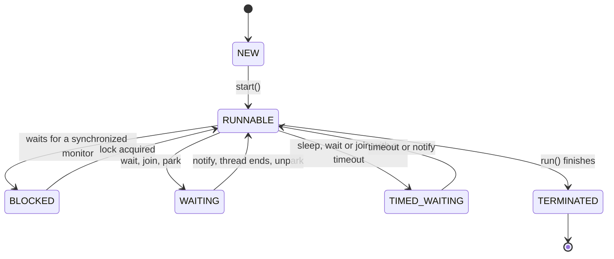

---

## 3. Race Conditions and synchronized

A **race condition** occurs when the result depends on the timing of threads.
`count++` looks atomic but is three steps: read, add, write.

```java
class Counter {
    private int count = 0;
    void increment() { count++; }      // NOT thread-safe
    int get() { return count; }
}

Counter counter = new Counter();
Runnable r = () -> { for (int i = 0; i < 100_000; i++) counter.increment(); };
Thread a = new Thread(r), b = new Thread(r);
a.start(); b.start();
a.join(); b.join();
System.out.println(counter.get());   // usually LESS than 200000: lost updates
```

**Sequence diagram: A Lost Update**

`count++` is read, add, write, so two threads can both read the same old value.

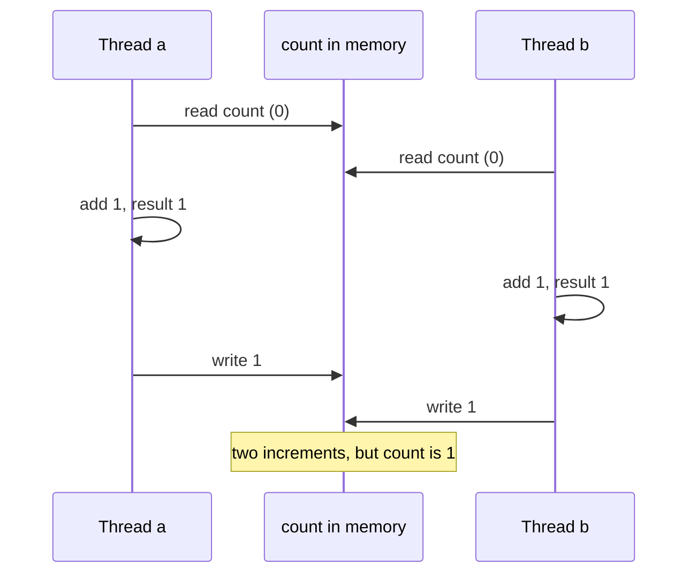

### 3.1 synchronized

Every object has an **intrinsic lock (monitor)**.
`synchronized` gives **mutual exclusion** (one thread at a time) plus **visibility** (changes made inside are visible to the next thread that acquires the same lock).

```java
class SafeCounter {
    private int count = 0;

    synchronized void increment() { count++; }          // locks on `this`

    int get() {
        synchronized (this) { return count; }           // synchronized block
    }

    static synchronized void utility() { /* locks on SafeCounter.class */ }
}

// Prefer a private lock object so outsiders cannot interfere
class Better {
    private final Object lock = new Object();
    private int count;

    void increment() {
        synchronized (lock) { count++; }
    }
}
```

Key facts:

- The lock is **reentrant**: a thread holding it can enter another `synchronized` block on the same object.
- An instance `synchronized` method locks `this`, a static one locks the `Class` object, and these are **different locks**.
- Keep synchronized blocks **small**, and never call unknown or slow code (I/O, callbacks) while holding a lock.
- The lock is released automatically on exit, including on exception.

---

## 4. wait, notify, and Deadlock

### 4.1 wait / notify

Threads coordinate on a monitor with `wait()`, `notify()`, and `notifyAll()`.
They must be called **while holding the object's lock**, or `IllegalMonitorStateException` is thrown.
`wait()` **releases the lock** and sleeps, unlike `sleep()`.

Always wait in a **loop** that re-checks the condition, because of spurious wakeups and multiple waiters.

```java
class BoundedBuffer<T> {
    private final Queue<T> queue = new LinkedList<>();
    private final int capacity;

    BoundedBuffer(int capacity) { this.capacity = capacity; }

    synchronized void put(T item) throws InterruptedException {
        while (queue.size() == capacity) {
            wait();                       // release lock, wait for space
        }
        queue.add(item);
        notifyAll();                      // wake consumers
    }

    synchronized T take() throws InterruptedException {
        while (queue.isEmpty()) {
            wait();                       // release lock, wait for data
        }
        T item = queue.poll();
        notifyAll();                      // wake producers
        return item;
    }
}
```

In real code prefer `BlockingQueue`, which does all of this for you.

| | `sleep` | `wait` |
| --- | --- | --- |
| Class | `Thread` (static) | `Object` (instance) |
| Releases the lock | **No** | **Yes** |
| Needs a monitor | No | Yes |
| Woken by | Timeout or interrupt | `notify`, `notifyAll`, timeout, or interrupt |

**Sequence diagram: wait and notify**

`wait()` releases the lock, and the woken thread must re-check its condition in a loop.

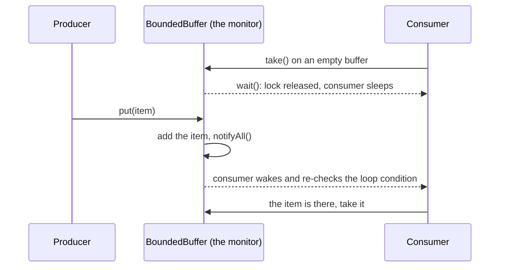

### 4.2 Deadlock

Two or more threads wait on each other forever.

```java
Object lockA = new Object();
Object lockB = new Object();

Thread t1 = new Thread(() -> {
    synchronized (lockA) {
        pause();
        synchronized (lockB) { System.out.println("t1 done"); }   // waits for B
    }
});

Thread t2 = new Thread(() -> {
    synchronized (lockB) {
        pause();
        synchronized (lockA) { System.out.println("t2 done"); }   // waits for A
    }
});
```

A deadlock needs all four **Coffman conditions**: mutual exclusion, hold and wait, no preemption, and circular wait.
Break any one to prevent it:

- Acquire locks in a **consistent global order** (fixes the example above: always lock A then B).
- Use `tryLock(timeout)` and back off.
- Hold fewer locks, for shorter time, or use higher-level structures.
- Diagnose with `jstack <pid>` or a thread dump, which reports "Found one Java-level deadlock".

Related problems: **livelock** (threads keep reacting to each other without progress) and **starvation** (a thread never gets the resource).

**Flowchart: A Deadlock**

Each thread holds the lock the other one needs, so the wait is circular.

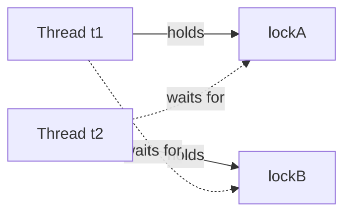

---

## 5. volatile and the Java Memory Model

Each CPU core has caches and the compiler and CPU may **reorder** instructions, so one thread's write is not automatically seen by another.
The **Java Memory Model (JMM)** defines when writes become visible through **happens-before** rules.

### 5.1 volatile

A `volatile` field guarantees:

- **Visibility**: a write is immediately visible to all threads that later read the field.
- **Ordering**: no reordering across the volatile access (a write is a release, a read is an acquire).
- It does **not** give atomicity for compound actions such as `count++`.

```java
class Worker {
    private volatile boolean running = true;    // without volatile, the loop may never see the change

    void run() {
        while (running) {
            doWork();
        }
    }

    void stop() { running = false; }            // called from another thread
}
```

Use `volatile` for simple **flags** and for safely publishing an immutable reference.
Use `synchronized` or atomics when a check-then-act or read-modify-write needs to be atomic.

### 5.2 Key Happens-Before Rules

- Unlocking a monitor happens-before every later locking of that same monitor.
- A write to a `volatile` field happens-before every later read of it.
- `Thread.start()` happens-before any action in the started thread.
- All actions in a thread happen-before another thread returns from `join()` on it.
- Writes to `final` fields in a constructor are visible to any thread that sees the object reference, provided `this` did not escape during construction.

### 5.3 Double-Checked Locking Singleton

```java
public class Singleton {
    private static volatile Singleton instance;   // volatile is REQUIRED

    private Singleton() {}

    public static Singleton getInstance() {
        if (instance == null) {                    // first check, no lock
            synchronized (Singleton.class) {
                if (instance == null) {            // second check, with lock
                    instance = new Singleton();
                }
            }
        }
        return instance;
    }
}
```

Without `volatile`, another thread could see a non-null `instance` that is only **partially constructed**, because object construction can be reordered.
The initialization-on-demand holder idiom or an enum singleton avoids the whole issue.

---

## 6. Atomic Classes

`java.util.concurrent.atomic` gives lock-free thread-safe operations built on hardware **CAS (Compare-And-Swap)**: update the value only if it still equals the expected one, otherwise retry.

```java
AtomicInteger counter = new AtomicInteger();
counter.incrementAndGet();               // atomic ++
counter.addAndGet(5);
counter.compareAndSet(6, 10);            // set to 10 only if current value is 6
counter.updateAndGet(x -> x * 2);

AtomicReference<String> ref = new AtomicReference<>("a");
ref.compareAndSet("a", "b");
```

- Faster than locks under low or moderate contention, and no risk of deadlock.
- Under **heavy contention**, `LongAdder` (and `LongAccumulator`) scale better by spreading updates across cells.
- CAS has the **ABA problem** (value changes A to B to A, and CAS cannot tell), solved with `AtomicStampedReference`.
- Atomicity holds per operation, so two separate atomic calls together are still not atomic.

**Flowchart: Compare-And-Swap**

CAS retries instead of locking, so there is no blocking and no deadlock.

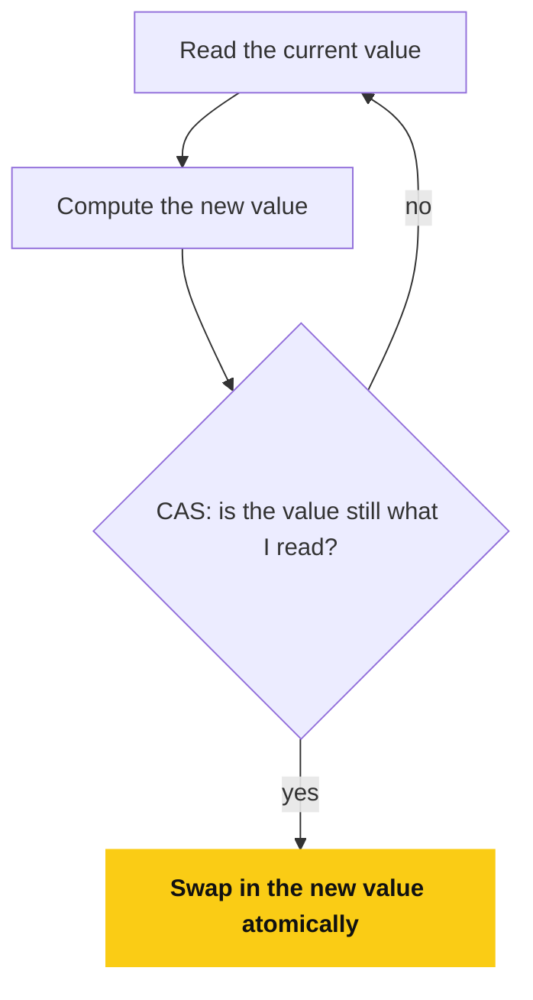

---

## 7. Locks

`ReentrantLock` offers more control than `synchronized`.

```java
class Account {
    private final ReentrantLock lock = new ReentrantLock();
    private double balance;

    void deposit(double amount) {
        lock.lock();
        try {
            balance += amount;
        } finally {
            lock.unlock();                 // ALWAYS unlock in finally
        }
    }

    boolean tryDeposit(double amount) throws InterruptedException {
        if (lock.tryLock(1, TimeUnit.SECONDS)) {       // give up after a timeout
            try {
                balance += amount;
                return true;
            } finally {
                lock.unlock();
            }
        }
        return false;
    }
}
```

| Feature | `synchronized` | `ReentrantLock` |
| --- | --- | --- |
| Release | Automatic | **Manual** (`finally`) |
| Try or timeout | No | `tryLock()`, `tryLock(time)` |
| Interruptible acquire | No | `lockInterruptibly()` |
| Fairness | No | Optional (`new ReentrantLock(true)`) |
| Multiple conditions | One wait set | Many `Condition` objects |

`ReentrantReadWriteLock` allows **many readers or one writer**, which helps read-heavy data.
`StampedLock` adds optimistic reads for even higher read throughput.

---

## 8. Executor Framework and Thread Pools

Creating a thread per task is expensive and unbounded.
A **thread pool** reuses a fixed set of threads.

```java
ExecutorService pool = Executors.newFixedThreadPool(4);

List<Future<Integer>> futures = new ArrayList<>();
for (int i = 1; i <= 5; i++) {
    final int n = i;
    futures.add(pool.submit(() -> n * n));           // Callable<Integer>
}

for (Future<Integer> f : futures) {
    System.out.println(f.get());                     // blocks until that task completes
}

pool.shutdown();                                     // stop accepting tasks, finish queued ones
if (!pool.awaitTermination(5, TimeUnit.SECONDS)) {
    pool.shutdownNow();                              // interrupt running tasks
}
```

`ExecutorService` is `AutoCloseable` from Java 19, so this also works:

```java
try (ExecutorService pool2 = Executors.newFixedThreadPool(4)) {
    pool2.submit(() -> doWork());
}   // close() waits for tasks to finish
```

### 8.1 Factory Methods

| Method | Behavior |
| --- | --- |
| `newFixedThreadPool(n)` | Fixed `n` threads, **unbounded** queue |
| `newCachedThreadPool()` | Grows on demand, reuses idle threads, **unbounded threads** |
| `newSingleThreadExecutor()` | One thread, tasks run in order |
| `newScheduledThreadPool(n)` | Delayed and periodic tasks (`schedule`, `scheduleAtFixedRate`) |
| `newVirtualThreadPerTaskExecutor()` | One virtual thread per task (Java 21) |

Unbounded queues and unbounded thread counts can cause `OutOfMemoryError` under load, so production code often builds a `ThreadPoolExecutor` directly.

### 8.2 ThreadPoolExecutor Parameters

```java
ThreadPoolExecutor executor = new ThreadPoolExecutor(
    4,                                   // corePoolSize: threads kept alive
    8,                                   // maximumPoolSize: upper limit
    60, TimeUnit.SECONDS,                // keepAliveTime for threads above core
    new ArrayBlockingQueue<>(100),       // bounded work queue
    new ThreadPoolExecutor.CallerRunsPolicy()   // rejection policy
);
```

Task submission order:

1. If fewer than `corePoolSize` threads exist, **start a new thread**.
2. Otherwise **queue** the task.
3. If the queue is full and threads are below `maximumPoolSize`, **start an extra thread**.
4. If both are full, apply the **rejection policy**: `AbortPolicy` (throws `RejectedExecutionException`, the default), `CallerRunsPolicy` (caller runs it, natural back-pressure), `DiscardPolicy`, or `DiscardOldestPolicy`.

Sizing rule of thumb:

- **CPU-bound** work: about the number of cores (`Runtime.getRuntime().availableProcessors()`).
- **I/O-bound** work: more threads, roughly `cores * (1 + wait time / compute time)`, or use virtual threads.

`submit` vs `execute`: `submit` returns a `Future` and **captures exceptions inside it**, while `execute` lets an uncaught exception kill the worker thread.
If you ignore the `Future` returned by `submit`, task failures go unnoticed.

**Flowchart: How a Thread Pool Takes a Task**

The queue is tried before extra threads, which surprises many people.

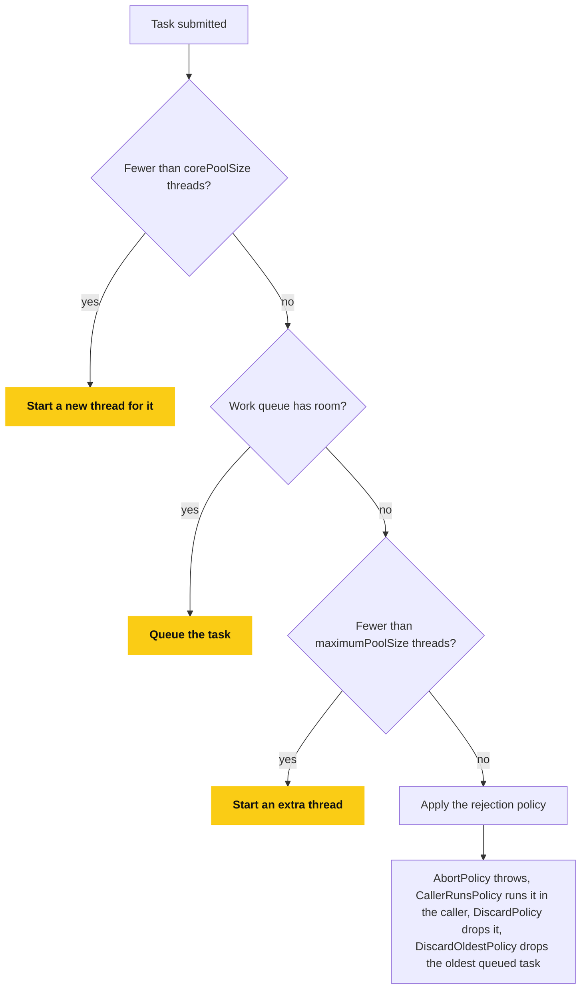

---

## 9. CompletableFuture

`CompletableFuture` composes asynchronous steps without blocking, like a Promise in JavaScript.

```java
CompletableFuture<String> future = CompletableFuture
        .supplyAsync(() -> fetchUser(42))                    // runs on ForkJoinPool.commonPool()
        .thenApply(user -> user.getName())                   // transform result (map)
        .thenCompose(name -> fetchOrdersAsync(name))         // chain another async call (flatMap)
        .exceptionally(ex -> "fallback");                    // recover from any failure upstream

String result = future.join();                               // block for the result
```

| Method | Purpose |
| --- | --- |
| `supplyAsync` / `runAsync` | Start an async task with or without a result |
| `thenApply` | Transform the result synchronously (`map`) |
| `thenCompose` | Chain a step that itself returns a `CompletableFuture` (`flatMap`) |
| `thenAccept` / `thenRun` | Consume the result or just run something |
| `thenCombine` | Combine two independent futures |
| `allOf` / `anyOf` | Wait for all or any of several futures |
| `exceptionally` / `handle` / `whenComplete` | Error handling and cleanup |

Running independent calls in parallel and combining them:

```java
CompletableFuture<User> userF = CompletableFuture.supplyAsync(() -> loadUser(id));
CompletableFuture<List<Order>> ordersF = CompletableFuture.supplyAsync(() -> loadOrders(id));

CompletableFuture<Profile> profile = userF.thenCombine(ordersF, Profile::new);

CompletableFuture.allOf(userF, ordersF).join();     // wait for both
```

Pass your own `Executor` as the last argument to `supplyAsync` for I/O work, otherwise everything shares the common pool, which is sized for CPU work.
`join()` throws an unchecked `CompletionException`, while `get()` throws checked `ExecutionException` and `InterruptedException`.

**Flowchart: A CompletableFuture Chain**

A failure anywhere upstream skips the remaining steps and lands in `exceptionally`.

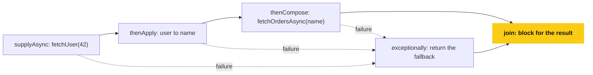

---

## 10. Concurrent Collections

| Collection | Use |
| --- | --- |
| `ConcurrentHashMap` | Thread-safe map with high concurrency |
| `CopyOnWriteArrayList` / `CopyOnWriteArraySet` | Many reads, rare writes (listener lists) |
| `BlockingQueue` (`ArrayBlockingQueue`, `LinkedBlockingQueue`) | Producer-consumer handoff |
| `ConcurrentLinkedQueue` / `ConcurrentLinkedDeque` | Lock-free non-blocking queues |
| `ConcurrentSkipListMap` | Sorted concurrent map |

### 10.1 ConcurrentHashMap

- In Java 8+ it uses **CAS for empty buckets and `synchronized` on the head node of a bucket**, so writers to different buckets do not block each other, and **reads are lock-free**.
- **No null keys or values** (a `null` from `get` must unambiguously mean "absent").
- Iterators are **weakly consistent**: they never throw `ConcurrentModificationException`.
- Individual operations are atomic, but a `get` followed by a `put` is **not**, so use the atomic compound methods:

```java
Map<String, Integer> hits = new ConcurrentHashMap<>();

// BUG: check-then-act race
if (!hits.containsKey("page")) {
    hits.put("page", 0);
}

// Atomic
hits.putIfAbsent("page", 0);
hits.merge("page", 1, Integer::sum);                    // atomic increment
hits.computeIfAbsent("cart", k -> loadCart(k));         // compute once per key
```

### 10.2 Producer-Consumer with BlockingQueue

```java
BlockingQueue<Integer> queue = new ArrayBlockingQueue<>(10);

Thread producer = new Thread(() -> {
    try {
        for (int i = 0; i < 5; i++) {
            queue.put(i);                       // blocks when the queue is full
        }
        queue.put(-1);                          // poison pill: tells the consumer to stop
    } catch (InterruptedException e) {
        Thread.currentThread().interrupt();
    }
});

Thread consumer = new Thread(() -> {
    try {
        while (true) {
            int item = queue.take();            // blocks when the queue is empty
            if (item == -1) break;
            System.out.println("consumed " + item);
        }
    } catch (InterruptedException e) {
        Thread.currentThread().interrupt();
    }
});

producer.start();
consumer.start();
```

---

## 11. Synchronizers

```java
// CountDownLatch: wait until N events have happened (one-shot)
CountDownLatch latch = new CountDownLatch(3);
for (int i = 0; i < 3; i++) {
    pool.submit(() -> { doPart(); latch.countDown(); });
}
latch.await();                  // main thread waits for all 3 workers

// CyclicBarrier: N threads wait for each other at a point, reusable
CyclicBarrier barrier = new CyclicBarrier(3, () -> System.out.println("all arrived"));
// each worker calls barrier.await()

// Semaphore: limit concurrent access to a resource to N permits
Semaphore permits = new Semaphore(2);
permits.acquire();
try { useLimitedResource(); } finally { permits.release(); }
```

| | Purpose | Reusable |
| --- | --- | --- |
| `CountDownLatch` | Wait for events to complete | No |
| `CyclicBarrier` | Threads rendezvous at a common point | Yes |
| `Semaphore` | Bound concurrent access with permits | Yes |
| `Phaser` | Flexible multi-phase barrier | Yes |

---

## 12. ThreadLocal

`ThreadLocal<T>` gives **each thread its own copy** of a variable, so nothing needs to be shared or locked.

```java
// SimpleDateFormat is not thread-safe: one instance per thread is a classic use
private static final ThreadLocal<SimpleDateFormat> FORMAT =
        ThreadLocal.withInitial(() -> new SimpleDateFormat("yyyy-MM-dd"));

String s = FORMAT.get().format(new Date());
```

Common uses are per-request context such as user ID or transaction ID (logging MDC, Spring's security context).

Pitfall: with **thread pools**, threads are reused, so a value left behind leaks into the next task and can also cause **memory leaks**.
Always clean up:

```java
try {
    CONTEXT.set(userId);
    handle();
} finally {
    CONTEXT.remove();          // always remove in pooled threads
}
```

`java.time.DateTimeFormatter` is immutable and thread-safe, so prefer it over `SimpleDateFormat` plus `ThreadLocal`.

---

## 13. Virtual Threads

Virtual threads (**final in Java 21**) are lightweight threads managed by the JVM instead of the OS.
Millions can exist, because a virtual thread is mounted on a small pool of **carrier (platform) threads** only while running, and it is unmounted when it blocks on I/O.

```java
Thread.startVirtualThread(() -> System.out.println("hello from " + Thread.currentThread()));

Thread vt = Thread.ofVirtual().name("vt-1").start(() -> doWork());

try (ExecutorService executor = Executors.newVirtualThreadPerTaskExecutor()) {
    for (int i = 0; i < 10_000; i++) {
        executor.submit(() -> {
            Thread.sleep(Duration.ofSeconds(1));   // blocking is cheap now
            return callRemoteService();
        });
    }
}
```

- Ideal for **I/O-bound, request-per-thread** servers: you get the simple blocking style without needing reactive code.
- **Do not pool virtual threads**, create one per task, they are cheap.
- Not helpful for **CPU-bound** work (still limited by the number of cores).
- Long `synchronized` blocks around blocking calls can **pin** the carrier thread (improved in newer releases), so prefer `ReentrantLock` in that case.
- Keep `ThreadLocal` use small, since there can be millions of threads.

| | Platform thread | Virtual thread |
| --- | --- | --- |
| Scheduled by | OS | JVM |
| Stack memory | About 1 MB reserved | Small, grows on the heap |
| Practical count | Thousands | Millions |
| Blocking cost | Holds an OS thread | Frees the carrier thread |

**Flowchart: A Virtual Thread**

Blocking frees the carrier thread, which is why blocking code is cheap on virtual threads.

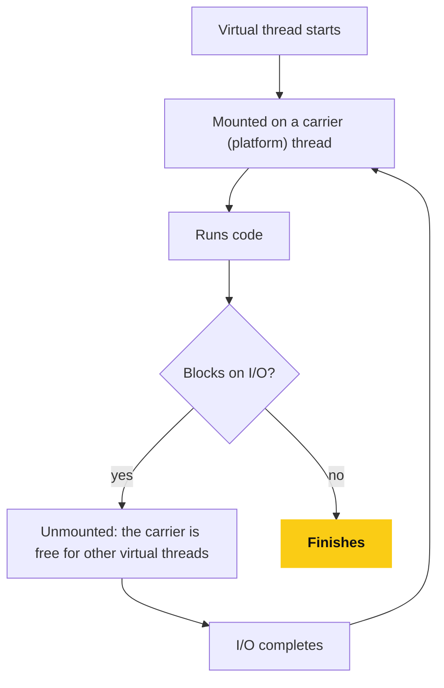

---

## 14. JVM Memory Structure

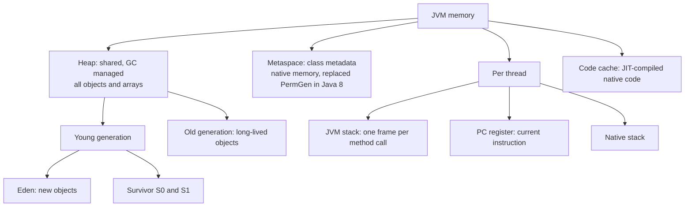

### 14.1 Stack vs Heap

| | Stack | Heap |
| --- | --- | --- |
| Holds | Method frames: primitives, **references** | All **objects** and arrays |
| Scope | One per thread | Shared by all threads |
| Lifetime | Freed automatically when the method returns | Freed by the garbage collector |
| Error when full | `StackOverflowError` | `OutOfMemoryError: Java heap space` |
| Speed | Very fast | Slower to allocate and manage |

```java
void demo() {
    int x = 10;                       // x lives on the stack
    String name = new String("hi");   // the reference `name` is on the stack, the object is on the heap
}
```

The JIT can use **escape analysis** to allocate non-escaping objects on the stack (or eliminate them entirely).

**Flowchart: Stack and Heap**

Primitives and references live in the frame, and every object lives on the heap.

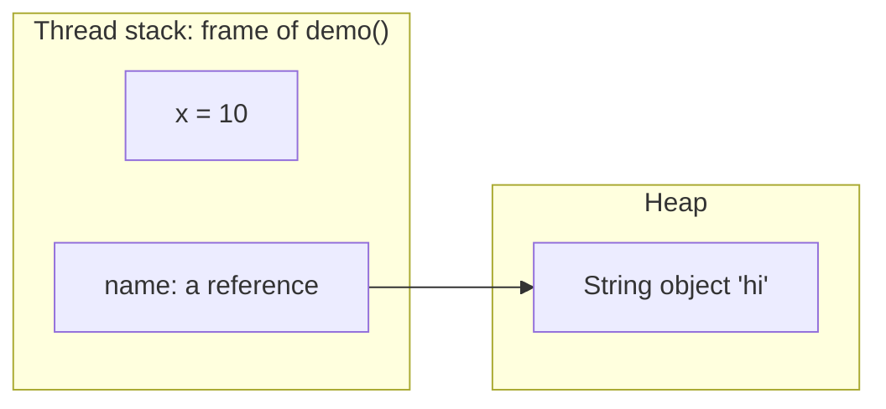

### 14.2 Memory Errors

| Error | Typical cause |
| --- | --- |
| `StackOverflowError` | Infinite or very deep recursion |
| `OutOfMemoryError: Java heap space` | Too many live objects or a leak |
| `OutOfMemoryError: Metaspace` | Too many loaded classes (classloader leaks, dynamic proxies) |
| `OutOfMemoryError: GC overhead limit exceeded` | JVM spends nearly all time collecting and frees almost nothing |
| `OutOfMemoryError: unable to create native thread` | Too many threads for the OS or container limit |

Useful flags: `-Xms` (initial heap), `-Xmx` (max heap), `-Xss` (thread stack size), `-XX:MaxMetaspaceSize`, `-XX:+HeapDumpOnOutOfMemoryError`.

---

## 15. Garbage Collection

The GC automatically reclaims memory of objects that are no longer **reachable** from any **GC root**.
GC roots include local variables on thread stacks, static fields, active threads, and JNI references.
Reference counting is **not** used, so circular references between unreachable objects are collected fine.

### 15.1 Generational Hypothesis

Most objects die young, so the heap is split by age:

1. New objects are allocated in **Eden**.
2. When Eden fills, a **minor GC** copies live objects to a **survivor** space, and their age increases each time they survive.
3. After surviving enough collections (the tenuring threshold), objects are **promoted** to the **old generation**.
4. When the old generation fills, a **major/full GC** runs, which is much more expensive.

A collection that pauses application threads is a **stop-the-world (STW)** pause.

**Flowchart: Generational GC**

Most objects die in Eden, so the frequent minor GC is cheap and the expensive full GC is rare.

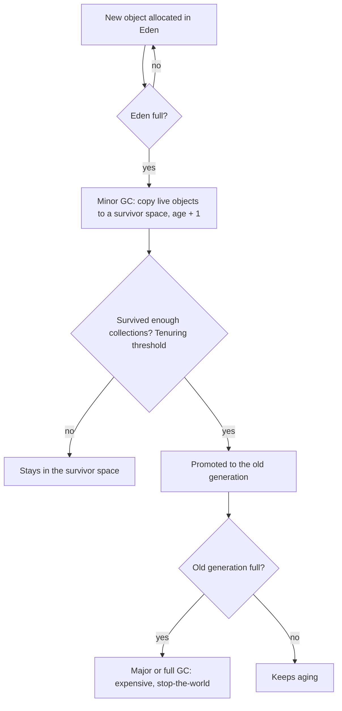

### 15.2 Collectors

| Collector | Notes |
| --- | --- |
| **Serial** | Single-threaded, for tiny heaps and simple apps |
| **Parallel** | Multi-threaded, maximizes **throughput**, default in Java 8 |
| **G1** | Region-based, aims for **predictable pauses** (`-XX:MaxGCPauseMillis`), **default since Java 9** |
| **ZGC** | Very low pauses (sub-millisecond target) even on huge heaps, mostly concurrent, generational mode in Java 21 |
| **Shenandoah** | Low-pause concurrent collector, similar goals to ZGC |

Choose by goal: **throughput** (Parallel), **balanced latency** (G1, the safe default), or **ultra-low latency** (ZGC, Shenandoah).

**Flowchart: Choosing a Collector**

Choose by goal: throughput, balanced latency, or ultra-low latency.

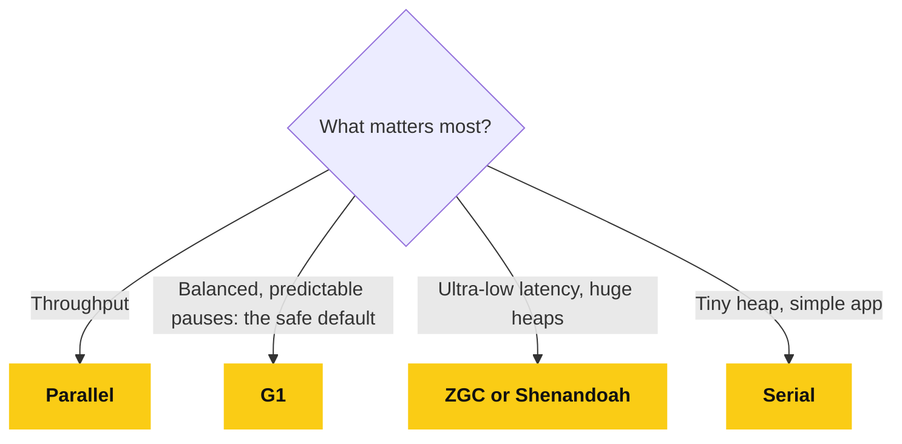

### 15.3 Java Memory Leaks

Java can leak memory even with a GC: **objects that are reachable but no longer needed** are never collected.

Common causes:

- Static collections that only grow (caches with no eviction).
- Listeners and callbacks that are registered but never removed.
- Inner classes and lambdas that capture an outer instance.
- `ThreadLocal` values left in pooled threads.
- Unclosed resources (connections, streams).
- Mutable keys or leaked `ClassLoader`s in long-running containers.

```java
class Cache {
    private static final Map<String, byte[]> CACHE = new HashMap<>();   // grows forever
    static void load(String key) { CACHE.put(key, new byte[1_000_000]); }
}
```

Fix: bounded caches (LRU, Caffeine), `WeakHashMap` for canonicalizing maps, and deregistering listeners.
Investigate with a heap dump (`jmap -dump`, or `-XX:+HeapDumpOnOutOfMemoryError`) analyzed in Eclipse MAT or VisualVM.

`System.gc()` is only a **hint** and should not be called in normal code.

---

## 16. Reference Types

| Reference | Collected when | Typical use |
| --- | --- | --- |
| **Strong** (`Object o = new Object()`) | Never while reachable | Normal references |
| **Soft** (`SoftReference`) | When memory is low | Memory-sensitive caches |
| **Weak** (`WeakReference`) | Next GC once no strong refs remain | Canonicalizing maps, `WeakHashMap` |
| **Phantom** (`PhantomReference`) | After finalization, before memory is reclaimed | Cleanup hooks (`Cleaner`) |

```java
WeakReference<byte[]> ref = new WeakReference<>(new byte[1024]);
System.gc();
System.out.println(ref.get());    // likely null: no strong references remained
```

---

## 17. Class Loading

The JVM loads classes **lazily**, the first time they are needed.

### 17.1 Class Loaders and Parent Delegation

| Loader | Loads |
| --- | --- |
| **Bootstrap** | Core JDK classes (`java.base`), written in native code |
| **Platform** | Other JDK modules and platform classes |
| **Application (system)** | Classes from the application classpath |

**Parent delegation:** a loader first asks its parent to load the class, and only loads it itself if the parent cannot.
This ensures core classes such as `java.lang.String` cannot be replaced by a malicious class with the same name.

**Flowchart: Parent Delegation**

Each loader asks its parent first, so a core class can never be replaced by an application class with the same name.

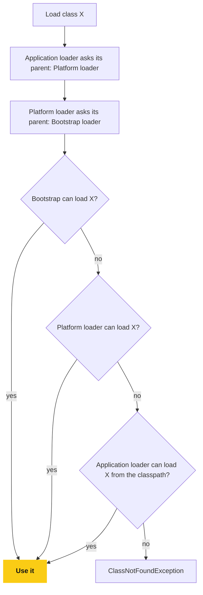

### 17.2 Loading Phases

1. **Loading**: read the `.class` bytes and create the `Class` object.
2. **Linking**: **verify** bytecode, **prepare** static fields (default values), and **resolve** symbolic references.
3. **Initialization**: run static initializers and assign static field values (the `<clinit>` method), which happens once, when the class is first actively used (instantiation, static method or field access).

`ClassNotFoundException` is a checked exception thrown when loading by name fails, while `NoClassDefFoundError` is an error thrown when a class that existed at compile time is missing at runtime.

**Flowchart: Class Loading Phases**

Initialization happens once, when the class is first actively used.

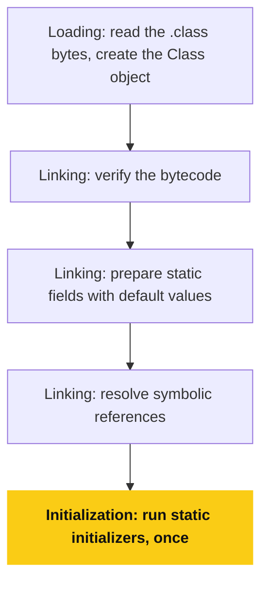

---

## 18. Common Pitfalls

- Sharing mutable state between threads without synchronization, and assuming `count++` is atomic.
- Believing `volatile` makes compound operations atomic.
- Check-then-act races on a `ConcurrentHashMap` (use `computeIfAbsent`, `merge`).
- Catching `InterruptedException` and ignoring it.
- Calling `Thread.run()` instead of `Thread.start()`.
- Waiting with `if` instead of a `while` loop around `wait()`.
- Inconsistent lock ordering, leading to deadlock.
- Forgetting `unlock()` in a `finally` block, or `shutdown()` on an executor (the JVM will not exit).
- Unbounded thread pools or queues that turn load spikes into `OutOfMemoryError`.
- Ignoring the `Future` from `submit()` so exceptions vanish.
- Leaving `ThreadLocal` values set in pooled threads.
- Blocking inside a `CompletableFuture` on the common pool, or parallel streams doing I/O.
- Static caches and listeners that are never cleaned up.
- Calling `System.gc()` and tuning GC flags without measuring first.

---

## 19. Common Interview Questions

- **"`start()` vs `run()`?"** `start` creates a new thread, `run` executes on the caller's thread (see [Section 1.1](#11-creating-threads)).
- **"`synchronized` vs `volatile`?"** Mutual exclusion plus visibility vs visibility and ordering only, with no atomicity.
- **"`synchronized` vs `ReentrantLock`?"** See the table in [Section 7](#7-locks): tryLock, interruptible, fair, multiple conditions, manual release.
- **"What is a deadlock and how do you avoid it?"** See [Section 4.2](#42-deadlock): consistent lock ordering, timeouts, fewer locks.
- **"`sleep` vs `wait`?"** `wait` releases the monitor and needs to be called while holding it, `sleep` does not release anything.
- **"How does `ConcurrentHashMap` achieve thread safety?"** CAS on empty bins and locks on the head node of a bucket, with lock-free reads (see [Section 10.1](#101-concurrenthashmap)).
- **"Explain the thread pool parameters."** Core size, max size, queue, keep-alive, and rejection policy (see [Section 8.2](#82-threadpoolexecutor-parameters)).
- **"What is `CompletableFuture` and how is it different from `Future`?"** Non-blocking composition and callbacks vs a blocking `get()`.
- **"What is the Java Memory Model?"** Rules (happens-before) that define visibility and ordering of memory operations between threads.
- **"Why does double-checked locking need `volatile`?"** To prevent seeing a partially constructed object due to reordering.
- **"What are virtual threads and when do you use them?"** JVM-managed lightweight threads for blocking I/O-heavy workloads (see [Section 13](#13-virtual-threads)).
- **"Explain heap vs stack."** See [Section 14.1](#141-stack-vs-heap).
- **"How does garbage collection work?"** Reachability from GC roots, generational collection with minor and major GCs (see [Section 15](#15-garbage-collection)).
- **"Can Java have memory leaks?"** Yes, from objects that stay reachable but unused, such as static caches and listeners.
- **"What is parent delegation in class loading?"** A class loader defers to its parent first, which protects core classes.
- **"Difference between `ClassNotFoundException` and `NoClassDefFoundError`?"** A failed explicit lookup by name (checked) vs a class present at compile time but missing at runtime (error).

---

## 20. One-Line Senior Summary

> Concurrency in Java is about controlling shared mutable state: prefer immutability and high-level tools (executors, concurrent collections, `CompletableFuture`, virtual threads) over raw `synchronized` and `wait/notify`, understand happens-before well enough to know what `volatile` does not give you, and remember the JVM manages memory for you only as long as you stop holding references you no longer need.
