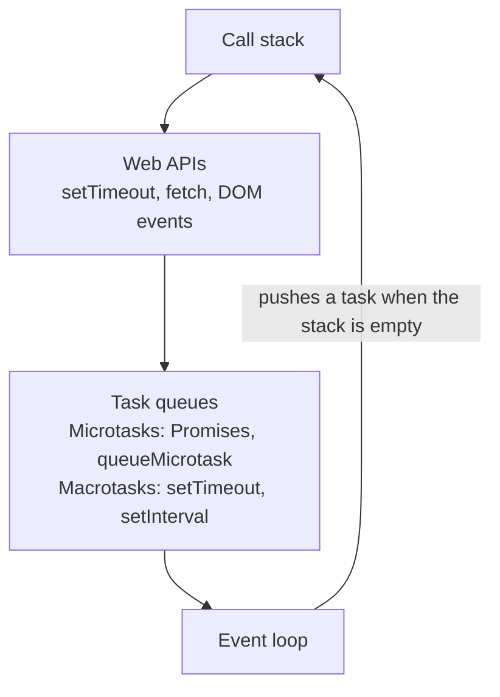
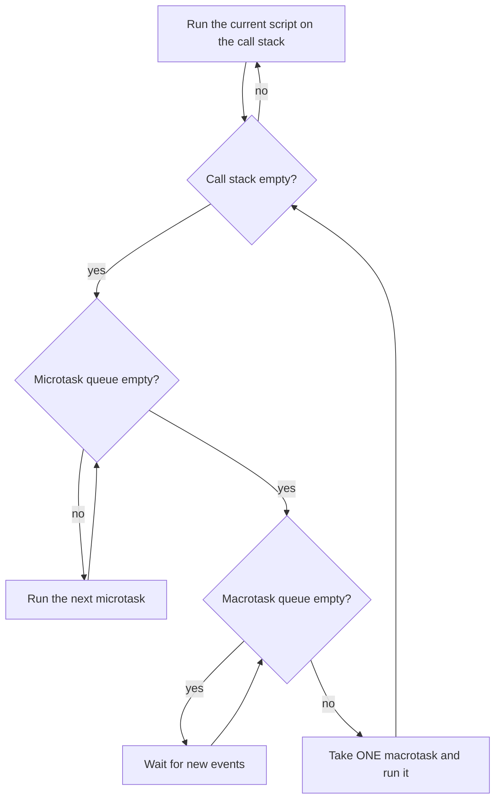
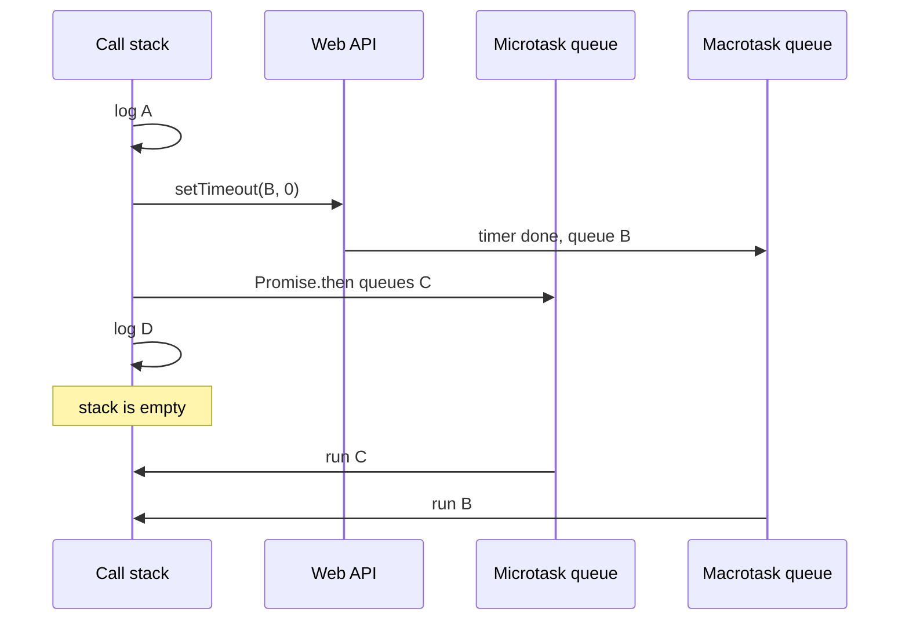
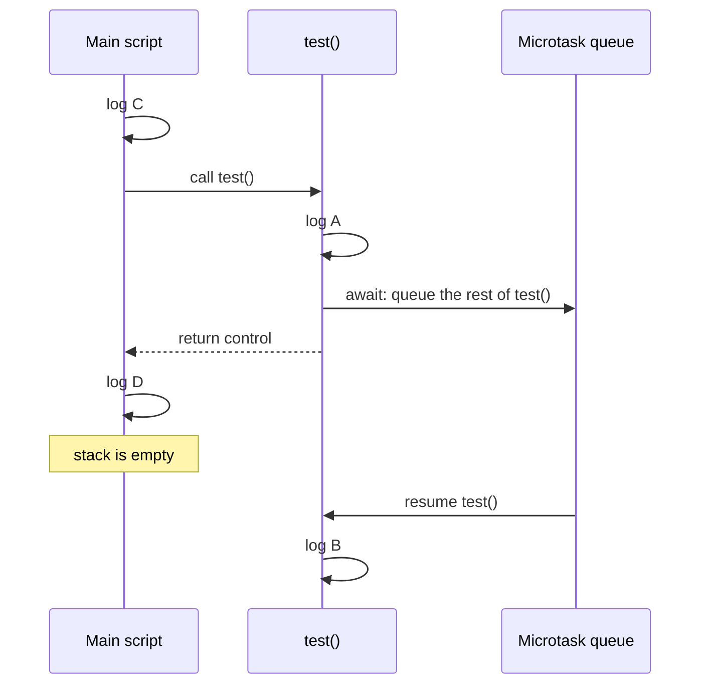
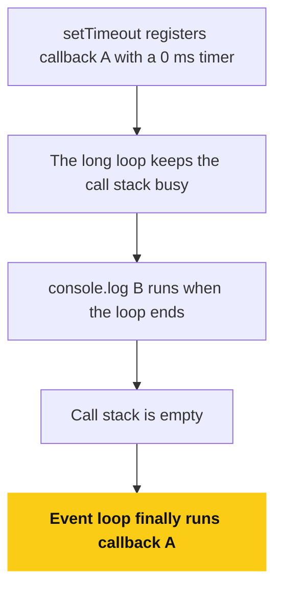
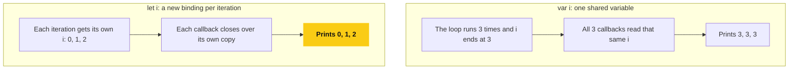
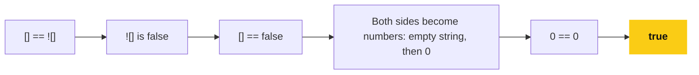
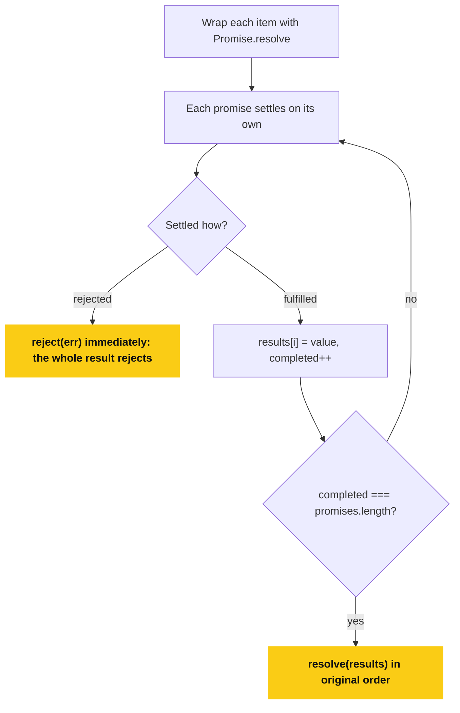
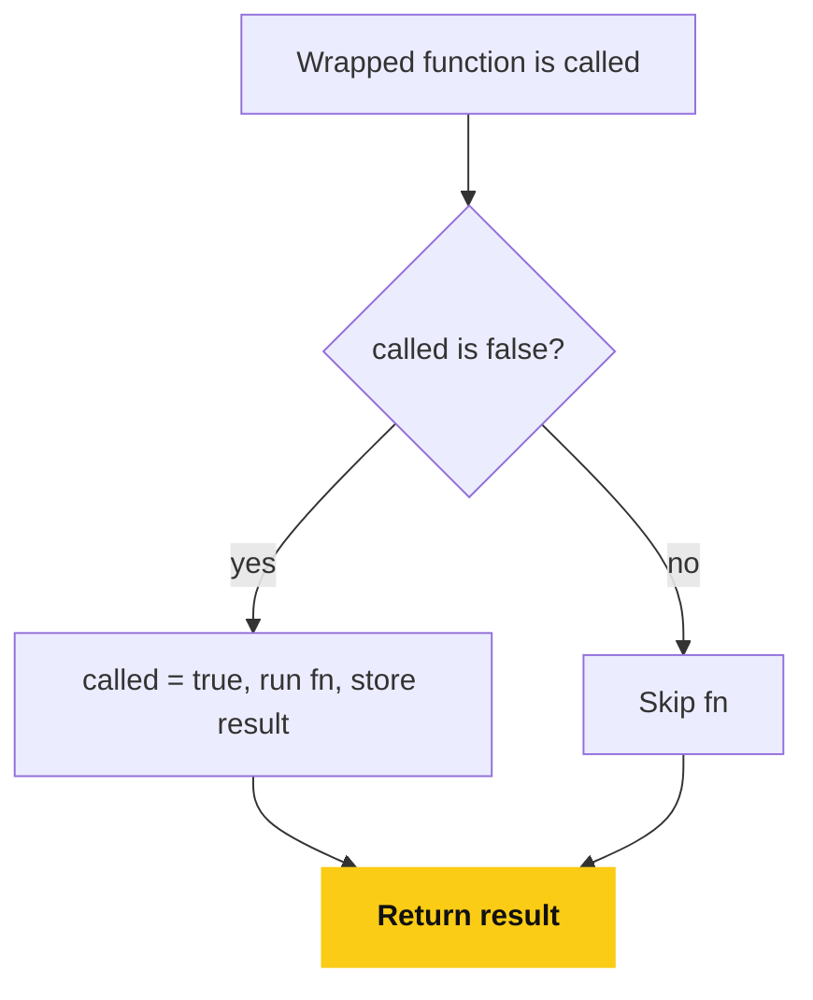
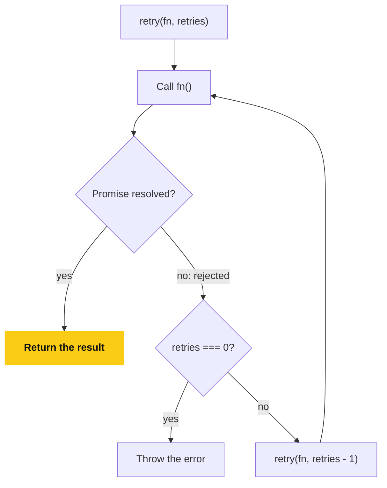

# 📘 JavaScript Advanced Interview Notes

## Deep Async, Event Loop, Tricky Outputs & Machine Coding

## Table of Contents

### Part 1: Deep Async JavaScript & Event Loop

1. [JavaScript Is Single-Threaded — Then How Is Async Possible?](#11-javascript-is-single-threaded--then-how-is-async-possible)
2. [Runtime Architecture](#12-runtime-architecture-mental-diagram)
3. [Event Loop Priority Order](#13-event-loop-priority-order-critical)
4. [Microtasks vs Macrotasks](#14-microtasks-vs-macrotasks)
5. [Deep Event Loop Example](#15-deep-event-loop-example-most-asked)
6. [Nested Microtasks](#16-nested-microtasks-very-tricky)
7. [async / await Internals](#17-async--await-internals-important)
8. [await vs then](#18-await-vs-then-same-priority)
9. [Blocking the Event Loop](#19-blocking-the-event-loop-interview-trap)

### Part 2: Output-Based Tricky JavaScript Questions

1. [var + Closure](#21-var--closure-classic)
2. [let vs var Hoisting](#22-let-vs-var-hoisting)
3. [this Confusion](#23-this-confusion)
4. [Arrow Function this Trap](#24-arrow-function-this-trap)
5. [Object Mutation](#25-object-mutation)
6. [Object Keys Stringification](#26-object-keys-stringification)
7. [== Weirdness](#27--weirdness)
8. [Function Hoisting Priority](#28-function-hoisting-priority)

### Part 3: JavaScript Machine Coding Questions

1. [Debounce Function](#31-debounce-function)
2. [Throttle Function](#32-throttle-function)
3. [Polyfill for Promise.all](#33-polyfill-for-promiseall)
4. [Polyfill for bind](#34-polyfill-for-bind)
5. [Flatten Nested Array](#35-flatten-nested-array)
6. [Deep Clone Object](#36-deep-clone-object)
7. [Once Function](#37-once-function)
8. [Implement Event Emitter](#38-implement-event-emitter)
9. [Retry Promise Function](#39-retry-promise-function)
10. [Implement sleep](#310-implement-sleep)

---

## 1. Deep Async JavaScript & Event Loop (INTERNALS)

---

## 1.1 JavaScript Is Single-Threaded — Then How Is Async Possible?

JavaScript has:

- **Single Call Stack**
- **Asynchronous runtime environment**

Async behavior is handled by:

- Web APIs
- Task queues
- Event Loop

---

## 1.2 Runtime Architecture (Mental Diagram)



---

## 1.3 Event Loop Priority Order (CRITICAL)

Execution order:

1. Call Stack
2. Microtask Queue
3. Macrotask Queue

**Microtasks always execute before macrotasks**

**Flowchart: The Event Loop Cycle**

Read it as a loop that never stops: script, then all microtasks, then one macrotask, then repeat.



---

## 1.4 Microtasks vs Macrotasks

### Microtasks

- Promise.then
- Promise.catch
- Promise.finally
- queueMicrotask
- MutationObserver

### Macrotasks

- setTimeout
- setInterval
- setImmediate (Node)
- requestAnimationFrame

---

## 1.5 Deep Event Loop Example (Most Asked)

```js
console.log("A");

setTimeout(() => {
  console.log("B");
}, 0);

Promise.resolve().then(() => {
  console.log("C");
});

console.log("D");
```

### Execution Breakdown

1. `A` → Call stack
2. `setTimeout` → Web API
3. `Promise.then` → Microtask queue
4. `D` → Call stack empty
5. Microtask → `C`
6. Macrotask → `B`

### Output

```
A
D
C
B
```

**Sequence diagram: Why the Output Is A D C B**

Follow the arrows top to bottom.



---

## 1.6 Nested Microtasks (Very Tricky)

```js
Promise.resolve().then(() => {
  console.log("A");
  Promise.resolve().then(() => {
    console.log("B");
  });
});

setTimeout(() => {
  console.log("C");
}, 0);
```

### Output

```
A
B
C
```

Reason:

- Microtasks can schedule **more microtasks**
- All microtasks must finish before macrotasks

---

## 1.7 async / await Internals (IMPORTANT)

```js
async function test() {
  console.log("A");
  await Promise.resolve();
  console.log("B");
}

console.log("C");
test();
console.log("D");
```

### How it works internally

- `await` pauses function execution
- Remaining code goes to microtask queue

### Output

```
C
A
D
B
```

**Sequence diagram: What await Does**

`await` hands control back to the caller, and the rest of the function resumes later as a microtask.



---

## 1.8 await vs then (Same Priority)

```js
await Promise.resolve();
Promise.resolve().then();
```

Both go to **microtask queue**.

---

## 1.9 Blocking the Event Loop (Interview Trap)

```js
setTimeout(() => console.log("A"), 0);

for (let i = 0; i < 1e10; i++) {}

console.log("B");
```

### Output

```
B
A
```

Why:

- Call stack is blocked
- Event loop cannot push tasks

**Flowchart: Why a Blocked Stack Delays the Timer**

The timer is ready after 0 ms, but nothing can run it until the call stack is free.



---

## 2. Output-Based Tricky JavaScript Questions

---

## 2.1 var + Closure (Classic)

```js
for (var i = 0; i < 3; i++) {
  setTimeout(() => console.log(i), 0);
}
```

### Output

```
3
3
3
```

### Fix

```js
for (let i = 0; i < 3; i++) {
  setTimeout(() => console.log(i), 0);
}
```

**Flowchart: var vs let in a Loop**

`var` gives every callback the same variable, `let` gives each iteration its own.



---

## 2.2 let vs var Hoisting

```js
console.log(a);
var a = 10;

console.log(b);
let b = 20;
```

### Output

```
undefined
ReferenceError
```

---

## 2.3 this Confusion

```js
const obj = {
  name: "JS",
  getName: function () {
    return this.name;
  },
};

const fn = obj.getName;
console.log(fn());
```

### Output

```
undefined
```

Reason:

- Lost context
- `this` → global / undefined (strict)

---

## 2.4 Arrow Function this Trap

```js
const obj = {
  name: "JS",
  greet: () => {
    console.log(this.name);
  },
};

obj.greet();
```

### Output

```
undefined
```

Arrow functions **do not bind this**

---

## 2.5 Object Mutation

```js
const obj = { a: 1 };
const obj2 = obj;

obj2.a = 2;
console.log(obj.a);
```

### Output

```
2
```

---

## 2.6 Object Keys Stringification

```js
const obj = {};
obj[1] = "one";
obj["1"] = "one again";

console.log(obj);
```

### Output

```
{ "1": "one again" }
```

---

## 2.7 == Weirdness

```js
[] == ![];
```

### Output

```
true
```

Explanation:

- `![]` → false
- `[] == false` → `"" == 0` → true

**Flowchart: Why [] == ![] Is true**

Each step is one coercion, applied left to right.



---

## 2.8 Function Hoisting Priority

```js
foo();

var foo = function () {
  console.log("A");
};

function foo() {
  console.log("B");
}
```

### Output

```
B
```

Function declarations beat `var`

---

## 3. JavaScript Machine Coding Questions (INTERVIEW LEVEL)

---

## 3.1 Debounce Function

```js
function debounce(fn, delay) {
  let timer;

  return function (...args) {
    clearTimeout(timer);
    timer = setTimeout(() => {
      fn.apply(this, args);
    }, delay);
  };
}
```

Use cases:

- Search input
- Resize events

---

## 3.2 Throttle Function

```js
function throttle(fn, limit) {
  let lastCall = 0;

  return function (...args) {
    const now = Date.now();
    if (now - lastCall >= limit) {
      lastCall = now;
      fn.apply(this, args);
    }
  };
}
```

Use cases:

- Scroll events
- Infinite scroll

---

## 3.3 Polyfill for Promise.all

```js
Promise.myAll = function (promises) {
  return new Promise((resolve, reject) => {
    const results = [];
    let completed = 0;

    promises.forEach((p, i) => {
      Promise.resolve(p)
        .then((res) => {
          results[i] = res;
          completed++;
          if (completed === promises.length) {
            resolve(results);
          }
        })
        .catch(reject);
    });
  });
};
```

**Flowchart: Promise.all Polyfill**

Results are stored by index so the output order matches the input order, not the completion order.



---

## 3.4 Polyfill for bind

```js
Function.prototype.myBind = function (context, ...args) {
  const fn = this;
  return function (...innerArgs) {
    return fn.apply(context, [...args, ...innerArgs]);
  };
};
```

---

## 3.5 Flatten Nested Array

```js
function flatten(arr) {
  return arr.reduce((acc, val) => {
    if (Array.isArray(val)) {
      acc.push(...flatten(val));
    } else {
      acc.push(val);
    }
    return acc;
  }, []);
}
```

---

## 3.6 Deep Clone Object

```js
function deepClone(obj) {
  if (obj === null || typeof obj !== "object") return obj;

  const copy = Array.isArray(obj) ? [] : {};
  for (let key in obj) {
    copy[key] = deepClone(obj[key]);
  }
  return copy;
}
```

---

## 3.7 Once Function

```js
function once(fn) {
  let called = false;
  let result;

  return function (...args) {
    if (!called) {
      called = true;
      result = fn.apply(this, args);
    }
    return result;
  };
}
```

**Flowchart: once**

The result is cached in the closure, so later calls return it without running `fn` again.



---

## 3.8 Implement Event Emitter

```js
class EventEmitter {
  constructor() {
    this.events = {};
  }

  on(event, fn) {
    this.events[event] = this.events[event] || [];
    this.events[event].push(fn);
  }

  emit(event, data) {
    (this.events[event] || []).forEach((fn) => fn(data));
  }

  off(event, fn) {
    this.events[event] = (this.events[event] || []).filter((f) => f !== fn);
  }
}
```

---

## 3.9 Retry Promise Function

```js
function retry(fn, retries) {
  return fn().catch((err) => {
    if (retries === 0) throw err;
    return retry(fn, retries - 1);
  });
}
```

**Flowchart: Retry**

Each failure calls `retry` again with one fewer attempt, until the attempts run out.



---

## 3.10 Implement sleep

```js
function sleep(ms) {
  return new Promise((resolve) => setTimeout(resolve, ms));
}
```
