# 📘 JavaScript Complete Interview Notes (In-Depth)

## Table of Contents

1. [JavaScript Overview](#1-javascript-overview)
2. [JavaScript Engine & Runtime](#2-javascript-engine--runtime)
3. [Execution Context](#3-execution-context)
4. [Hoisting](#4-hoisting)
5. [Scope & Scope Chain](#5-scope--scope-chain)
6. [Closures](#6-closures)
7. [Data Types](#7-data-types)
8. [Type Coercion](#8-type-coercion)
9. [Equality Operators](#9-equality-operators)
10. [this Keyword](#10-this-keyword)
11. [call, apply, bind](#11-call-apply-bind)
12. [Arrow Functions](#12-arrow-functions)
13. [Functions](#13-functions)
14. [Higher Order Functions](#14-higher-order-functions)
15. [Array Methods](#15-array-methods-very-important)
16. [Object Internals](#16-object-internals)
17. [Prototype & Prototypal Inheritance](#17-prototype--prototypal-inheritance)
18. [Classes](#18-classes-syntactic-sugar)
19. [Shallow vs Deep Copy](#19-shallow-vs-deep-copy)
20. [Asynchronous JavaScript](#20-asynchronous-javascript)
21. [Event Loop](#21-event-loop-critical)
22. [Debouncing & Throttling](#22-debouncing--throttling)
23. [Currying](#23-currying)
24. [Memoization](#24-memoization)
25. [Error Handling](#25-error-handling)
26. [Strict Mode](#26-strict-mode)
27. [Memory Management](#27-memory-management)
28. [Modules](#28-modules)
29. [Browser APIs](#29-browser-apis-interview-favorite)
30. [Security Concepts](#30-security-concepts)
31. [Performance Optimization](#31-performance-optimization)
32. [Common Tricky Interview Questions](#32-common-tricky-interview-questions)
33. [Polyfills](#33-polyfills-important)
34. [Event Delegation](#34-event-delegation)
35. [DOM Manipulation](#35-dom-manipulation)
36. [JavaScript Design Patterns](#36-javascript-design-patterns)
37. [ES6+ Features](#37-es6-features-must-know)

---

## 1. JavaScript Overview

### What is JavaScript?

JavaScript is a **high-level, interpreted, dynamically typed, single-threaded programming language** used primarily for web development.

### Key Characteristics

- Interpreted (JIT-compiled by engines like V8)
- Dynamically typed
- Prototype-based OOP
- Single-threaded with async capabilities
- Event-driven
- Garbage collected

### Where JavaScript Runs

- Browsers (V8, SpiderMonkey)
- Server (Node.js)
- Mobile (React Native)
- Desktop (Electron)

---

## 2. JavaScript Engine & Runtime

### JavaScript Engine

- Parses code
- Compiles to bytecode
- Executes code

**Example Engines**

- V8 (Chrome, Node.js)
- SpiderMonkey (Firefox)

### JavaScript Runtime Components

1. Call Stack
2. Heap
3. Web APIs
4. Callback Queue
5. Microtask Queue
6. Event Loop

**Flowchart: JavaScript Runtime**

The engine only has a call stack and a heap, everything asynchronous is handled by the runtime around it.

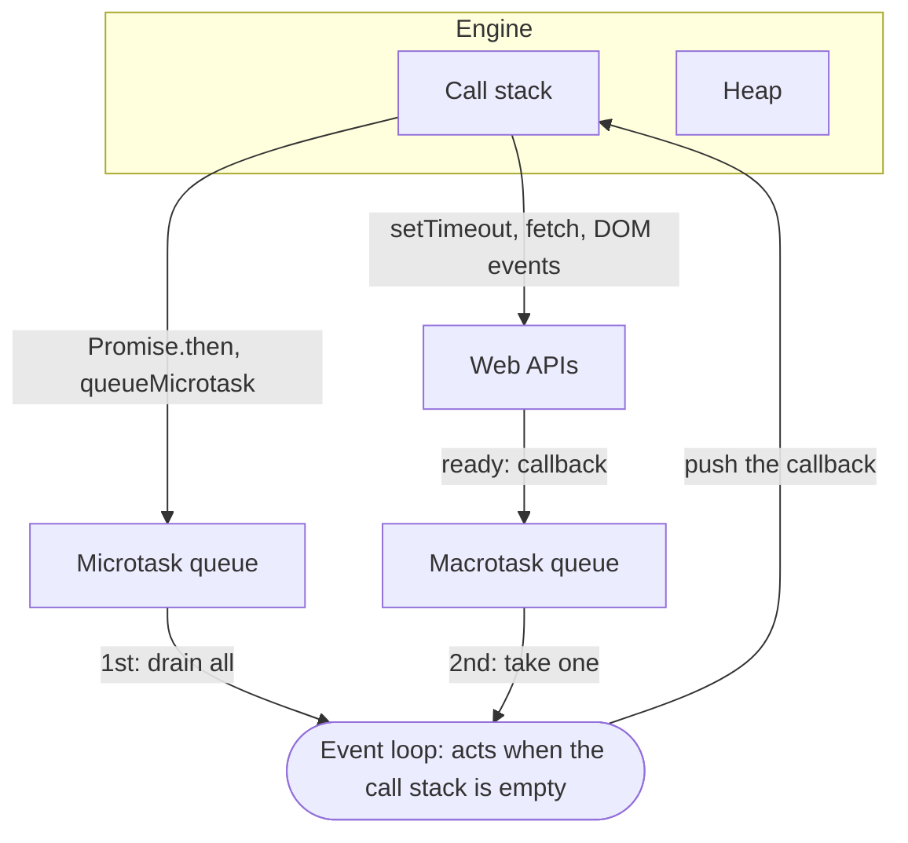

---

## 3. Execution Context

### What is Execution Context?

An environment where JavaScript code is evaluated and executed.

### Types

1. Global Execution Context
2. Function Execution Context
3. Eval Execution Context (rare)

### Phases

1. Creation Phase
2. Execution Phase

#### Creation Phase

- Memory allocation
- Hoisting happens here

#### Execution Phase

- Code execution line by line

**Flowchart: Execution Context Lifecycle**

Every function call gets its own context with the same two phases as the global one.

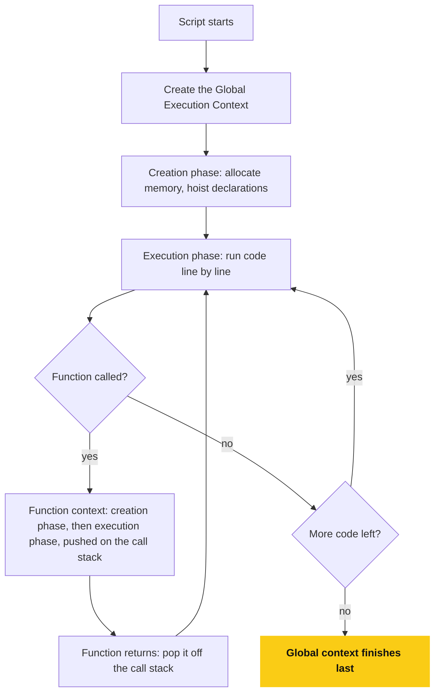

---

## 4. Hoisting

### What is Hoisting?

JavaScript moves **declarations** (not initializations) to the top of their scope.

### Variable Hoisting

```js
console.log(a); // undefined
var a = 10;
```

### let & const

```js
console.log(b); // ReferenceError
let b = 20;
```

**Reason:** Temporal Dead Zone (TDZ)

### Function Hoisting

```js
hello(); // works
function hello() {
  console.log("Hello");
}
```

**Flowchart: How Declarations Are Hoisted**

All three are hoisted during the creation phase, but they start in different states.

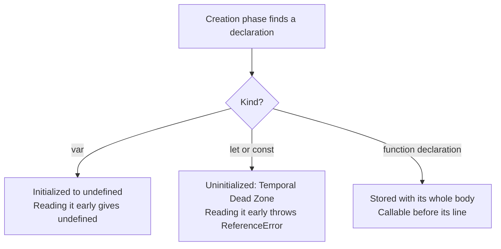

---

## 5. Scope & Scope Chain

### Scope Types

1. Global Scope
2. Function Scope
3. Block Scope

```js
{
  let x = 10;
}
console.log(x); // Error
```

### Scope Chain

- JavaScript searches variables from inner scope to outer scope.

**Flowchart: Scope Chain Lookup**

Lookup only ever goes outward, never inward.

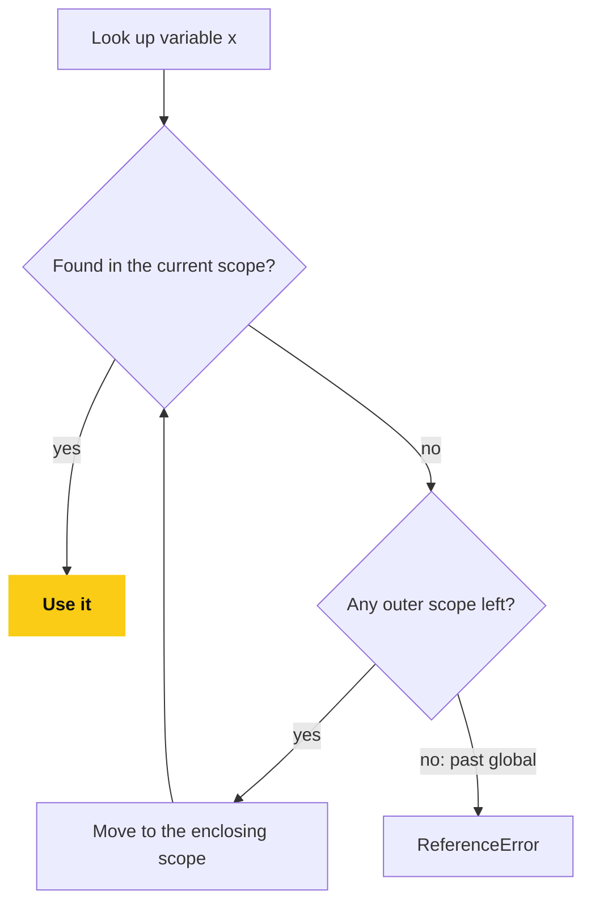

---

## 6. Closures

### Definition

A function that **remembers its lexical scope** even after execution.

### Example

```js
function outer() {
  let count = 0;
  return function inner() {
    count++;
    return count;
  };
}

const counter = outer();
counter(); // 1
counter(); // 2
```

### Use Cases

- Data hiding
- Currying
- Memoization
- Event handlers

**Flowchart: How a Closure Keeps Its Scope**

`outer()` is finished, but `inner` still points at its scope, so `count` is never freed.

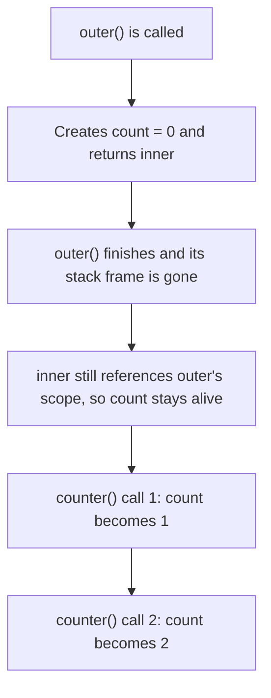

---

## 7. Data Types

### Primitive Types

- String
- Number
- Boolean
- Undefined
- Null
- Symbol
- BigInt

### Non-Primitive

- Object
- Array
- Function

```js
typeof null; // "object" (JS bug)
```

---

## 8. Type Coercion

### Implicit Coercion

```js
"5" + 1; // "51"
"5" - 1; // 4
```

### Truthy & Falsy Values

Falsy:

- false
- 0
- ""
- null
- undefined
- NaN

---

## 9. Equality Operators

### == vs ===

```js
5 == "5"; // true
5 === "5"; // false
```

**Always prefer `===`**

---

## 10. this Keyword

### Value Depends On Invocation

| Context        | this                        |
| -------------- | --------------------------- |
| Global         | window / undefined (strict) |
| Object Method  | Object                      |
| Function       | window / undefined          |
| Arrow Function | Lexical this                |

### Example

```js
const obj = {
  name: "JS",
  greet() {
    console.log(this.name);
  },
};
obj.greet(); // JS
```

**Flowchart: What Is this?**

`this` is decided by how the function is called, except for arrow functions, which never get their own.

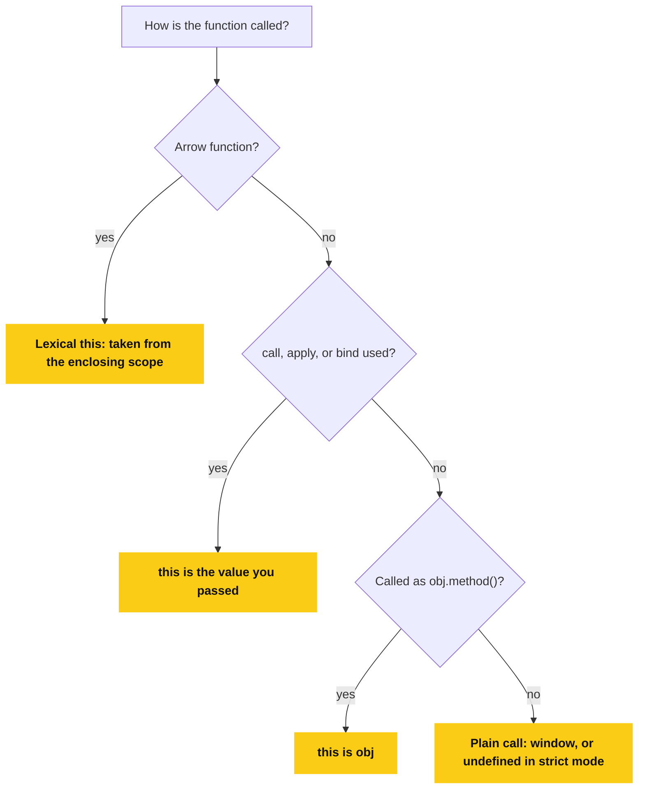

---

## 11. call, apply, bind

### call

```js
fn.call(obj, arg1, arg2);
```

### apply

```js
fn.apply(obj, [arg1, arg2]);
```

### bind

```js
const boundFn = fn.bind(obj);
```

---

## 12. Arrow Functions

### Differences

- No `this`
- No `arguments`
- Cannot be used as constructors

```js
const add = (a, b) => a + b;
```

---

## 13. Functions

### Function Declaration

```js
function test() {}
```

### Function Expression

```js
const test = function () {};
```

### IIFE

```js
(function () {
  console.log("IIFE");
})();
```

---

## 14. Higher Order Functions

Functions that:

- Take functions as arguments OR
- Return functions

```js
const multiply = (x) => (y) => x * y;
```

---

## 15. Array Methods (VERY IMPORTANT)

### map

```js
arr.map((x) => x * 2);
```

### filter

```js
arr.filter((x) => x > 10);
```

### reduce

```js
arr.reduce((acc, val) => acc + val, 0);
```

### forEach

- No return

---

## 16. Object Internals

### Property Access

```js
obj.key;
obj["key"];
```

### Object Destructuring

```js
const { name } = obj;
```

---

## 17. Prototype & Prototypal Inheritance

### Prototype Chain

```js
obj.__proto__ === Constructor.prototype;
```

### Example

```js
function Person(name) {
  this.name = name;
}
Person.prototype.sayHi = function () {
  console.log(this.name);
};
```

**Flowchart: Prototype Chain Lookup**

A property lookup walks up the `__proto__` links until it finds a match or reaches `null`.

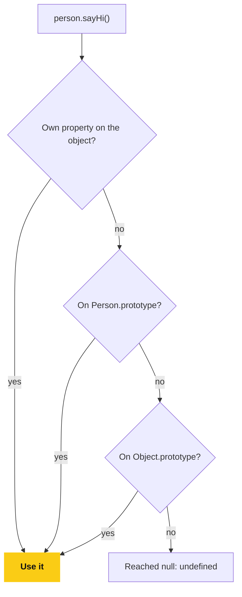

---

## 18. Classes (Syntactic Sugar)

```js
class Person {
  constructor(name) {
    this.name = name;
  }
  greet() {
    console.log(this.name);
  }
}
```

---

## 19. Shallow vs Deep Copy

### Shallow Copy

```js
const copy = { ...obj };
```

### Deep Copy

```js
const deep = JSON.parse(JSON.stringify(obj));
```

---

## 20. Asynchronous JavaScript

### Callbacks

```js
setTimeout(() => {}, 1000);
```

### Promises

```js
fetch(url)
  .then((res) => res.json())
  .catch((err) => {});
```

### async / await

```js
try {
  const data = await fetch(url);
} catch (e) {}
```

**Flowchart: Promise States**

A promise settles once, and its handlers always run as microtasks.

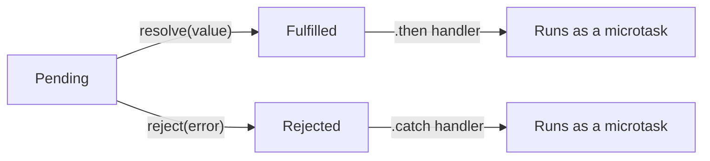

---

## 21. Event Loop (CRITICAL)

### Priority

1. Call Stack
2. Microtask Queue (Promises)
3. Macrotask Queue (setTimeout)

```js
console.log("A");
setTimeout(() => console.log("B"));
Promise.resolve().then(() => console.log("C"));
console.log("D");

// Output: A D C B
```

**Flowchart: The Event Loop Cycle**

Microtasks are drained completely, including any new ones they queue, before a single macrotask runs.
That is why `A D C B` comes out in that order.

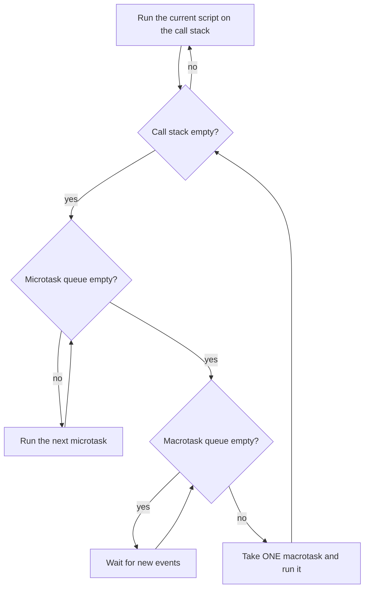

---

## 22. Debouncing & Throttling

### Debounce

```js
function debounce(fn, delay) {
  let timer;
  return function () {
    clearTimeout(timer);
    timer = setTimeout(fn, delay);
  };
}
```

### Throttle

```js
function throttle(fn, limit) {
  let flag = true;
  return function () {
    if (!flag) return;
    flag = false;
    fn();
    setTimeout(() => (flag = true), limit);
  };
}
```

**Flowchart: Debounce**

The function runs only after events stop for `delay` milliseconds.

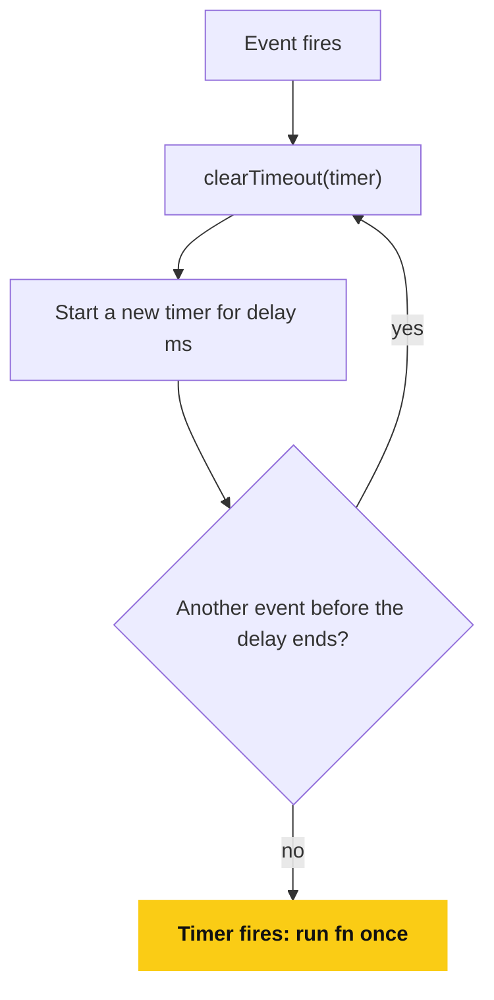

**Flowchart: Throttle**

The function runs at most once per `limit` milliseconds, and extra events in between are dropped.

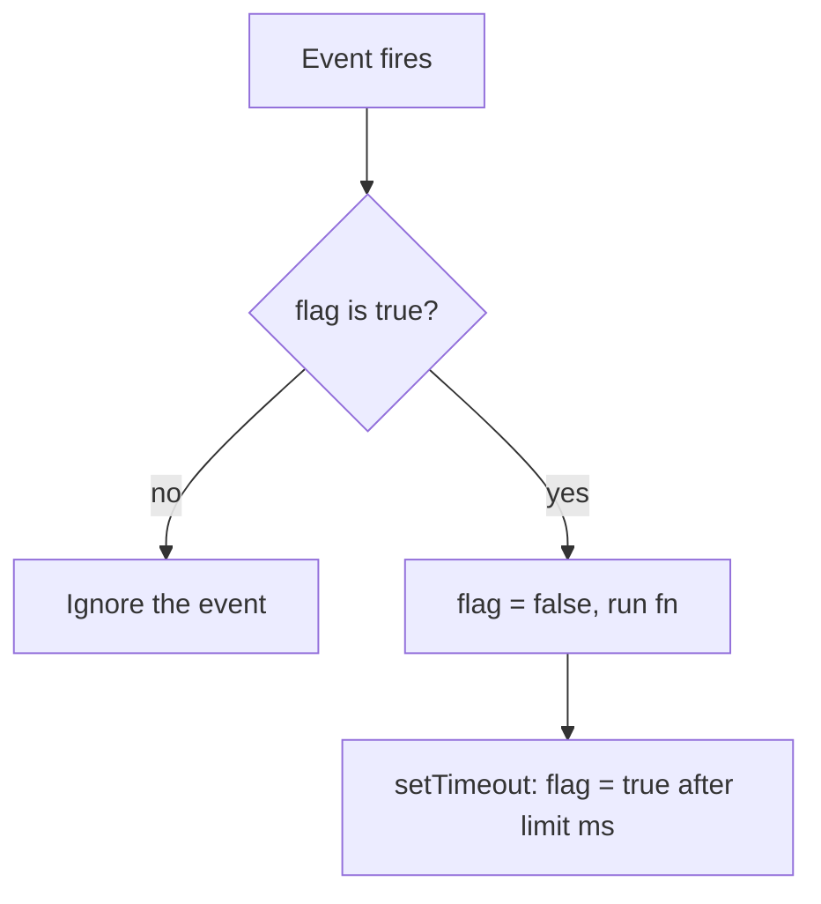

---

## 23. Currying

```js
const sum = (a) => (b) => (c) => a + b + c;
```

---

## 24. Memoization

```js
function memoize(fn) {
  const cache = {};
  return function (x) {
    if (cache[x]) return cache[x];
    return (cache[x] = fn(x));
  };
}
```

---

## 25. Error Handling

```js
try {
  throw new Error("Error");
} catch (e) {
  console.log(e.message);
} finally {
}
```

---

## 26. Strict Mode

```js
"use strict";
```

Prevents:

- Implicit globals
- Silent errors

---

## 27. Memory Management

### Garbage Collection

- Mark & Sweep algorithm
- Avoid memory leaks:

  - Remove event listeners
  - Clear timers
  - Avoid global variables

**Flowchart: Mark and Sweep**

A leak is an object that is still reachable from a root, so the collector correctly keeps it.

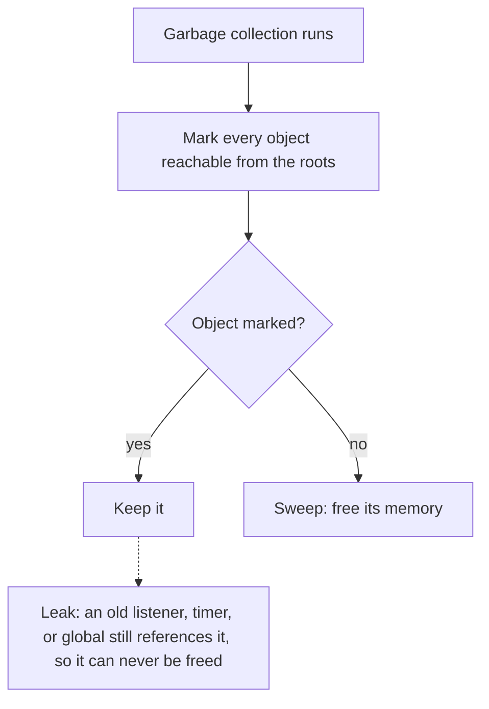

---

## 28. Modules

### ES Modules

```js
export const x = 10;
import { x } from "./file.js";
```

---

## 29. Browser APIs (Interview Favorite)

- localStorage
- sessionStorage
- cookies
- fetch
- IntersectionObserver
- ResizeObserver

---

## 30. Security Concepts

- XSS
- CSRF
- CORS
- Same-Origin Policy

---

## 31. Performance Optimization

- Debounce events
- Memoization
- Avoid reflows
- Web Workers
- Code splitting

---

## 32. Common Tricky Interview Questions

### Question

```js
let a = {};
let b = a;
b.name = "JS";
console.log(a.name); // JS
```

### Question

```js
[] + []; // ""
{
}
+{}; // "[object Object][object Object]"
```

---

## 33. Polyfills (IMPORTANT)

### Example: map polyfill

```js
Array.prototype.myMap = function (cb) {
  let res = [];
  for (let i = 0; i < this.length; i++) {
    res.push(cb(this[i], i, this));
  }
  return res;
};
```

---

## 34. Event Delegation

```js
parent.addEventListener("click", (e) => {
  if (e.target.matches("button")) {
  }
});
```

**Flowchart: Event Delegation**

One listener on the parent handles every child, including ones added later.

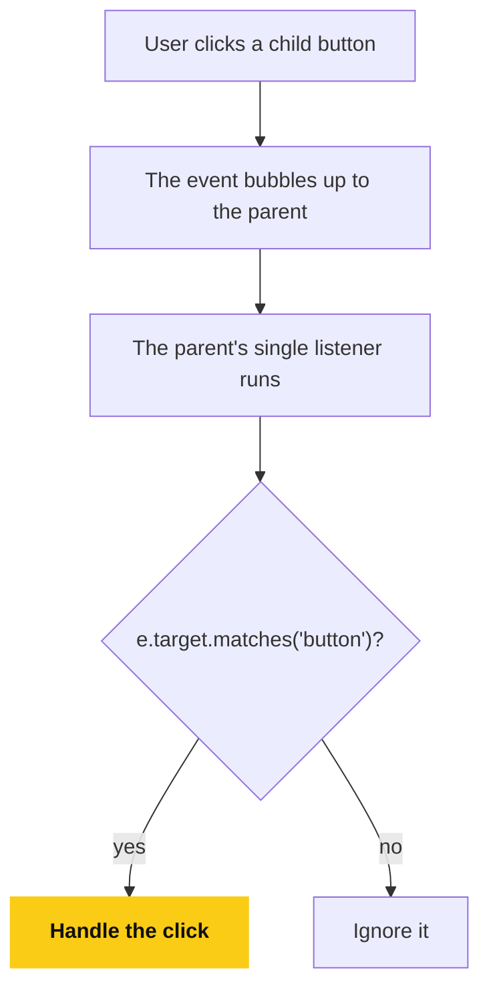

---

## 35. DOM Manipulation

```js
document.querySelector("#id");
element.addEventListener("click", fn);
```

---

## 36. JavaScript Design Patterns

- Module Pattern
- Singleton
- Observer
- Factory

---

## 37. ES6+ Features (Must Know)

- let / const
- Arrow functions
- Spread / Rest
- Destructuring
- Optional chaining
- Nullish coalescing
