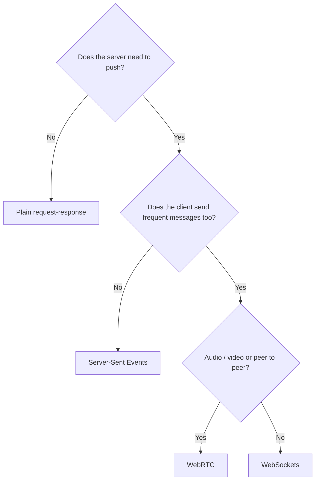
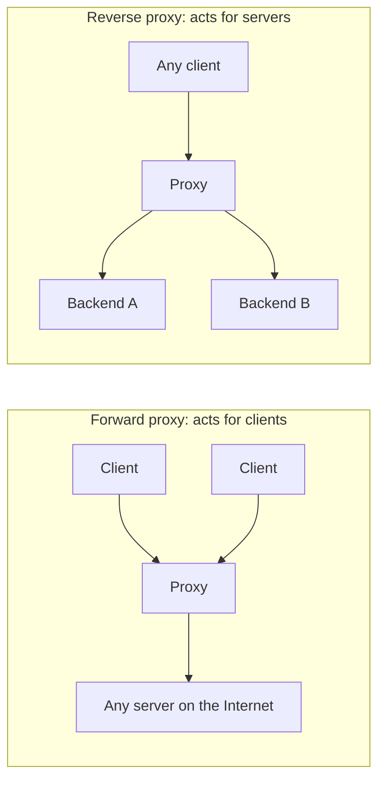

# 📘 Application Protocols and Infrastructure

This page covers the protocols applications build on top of TCP and UDP, and the boxes that sit between a client and a server.
For architecture-level choices see [Building Blocks](/docs/system-design/hld/building-blocks); this page stays close to the wire.

## Table of Contents

1. [Real-Time Options Compared](#1-real-time-options-compared)
2. [WebSockets](#2-websockets)
3. [Server-Sent Events](#3-server-sent-events)
4. [WebRTC](#4-webrtc)
5. [gRPC and RPC Protocols](#5-grpc-and-rpc-protocols)
6. [Other Everyday Protocols](#6-other-everyday-protocols)
7. [Proxies](#7-proxies)
8. [Load Balancers](#8-load-balancers)
9. [CDNs](#9-cdns)
10. [API Gateways and Service Meshes](#10-api-gateways-and-service-meshes)
11. [Connection Management](#11-connection-management)
12. [Questions](#12-questions)

---

## 1. Real-Time Options Compared

| Technique | Direction | Transport | Good for | Watch out for |
| --- | --- | --- | --- | --- |
| **Short polling** | Client pulls every N seconds | HTTP | Simple dashboards, low update rates | Wasted requests, latency up to N |
| **Long polling** | Server holds the request until data or timeout | HTTP | Fallback, simple infra | One hanging request per client, reconnect overhead |
| **Server-Sent Events** | Server to client | HTTP stream (`text/event-stream`) | Feeds, notifications, LLM token streaming | One direction only, text only |
| **WebSockets** | Full duplex | Upgraded HTTP/1.1 connection, or over HTTP/2 (RFC 8441) | Chat, collaboration, games, trading | Stateful connections, harder to load balance and scale |
| **WebRTC** | Peer to peer | UDP (SRTP, SCTP) | Voice, video, low-latency data | NAT traversal, signaling server, TURN costs |
| **WebTransport** | Full duplex, streams and datagrams | HTTP/3 over QUIC | Low-latency games and media in browsers | Newer; Safari support arrived later than Chrome and Firefox |



---

## 2. WebSockets

A WebSocket starts as an HTTP request and upgrades to a raw bidirectional message channel.

```http
GET /chat HTTP/1.1
Host: example.com
Upgrade: websocket
Connection: Upgrade
Sec-WebSocket-Key: dGhlIHNhbXBsZSBub25jZQ==
Sec-WebSocket-Version: 13

HTTP/1.1 101 Switching Protocols
Upgrade: websocket
Connection: Upgrade
Sec-WebSocket-Accept: s3pPLMBiTxaQ9kYGzzhZRbK+xOo=
```

The `Accept` value is a hash of the key plus a fixed GUID, proving the server really speaks WebSocket.
After that, both sides exchange **frames** (text, binary, ping, pong, close).
Client-to-server frames are masked to protect against cache poisoning in intermediaries.

Operating WebSockets at scale:

| Concern | Approach |
| --- | --- |
| **Load balancing** | L7 LB with upgrade support; connections are long-lived so balance by connection count, not round-robin |
| **Fan-out across servers** | Clients on server A must receive messages published on server B: use a pub/sub backplane (Redis, NATS, Kafka) |
| **Heartbeats** | Ping/pong every 20 to 30 seconds to detect dead peers and keep NAT and LB idle timers alive |
| **Reconnect** | Exponential backoff with jitter, resume from a last-seen message ID |
| **Deploys** | Draining closes thousands of connections; stagger and let clients reconnect elsewhere |
| **Auth** | Browsers cannot set custom headers on the WebSocket constructor: use cookies (check `Origin` to block cross-site hijacking) or a short-lived token in the first message |
| **Capacity** | Memory per connection (buffers, TLS state) dominates; tens of thousands to a million per well-tuned server |

---

## 3. Server-Sent Events

```http
HTTP/1.1 200 OK
Content-Type: text/event-stream
Cache-Control: no-cache

id: 41
event: price
data: {"symbol":"ACME","price":101.2}

id: 42
data: plain message
```

- Browser API: `new EventSource("/stream")`.
- Automatic reconnect with the `Last-Event-ID` header, so the server can resume.
- Works through most proxies because it is plain HTTP, and over HTTP/2 many streams share one connection.
- Under HTTP/1.1 browsers limit each origin to 6 connections, which SSE tabs can exhaust.
- Proxies that buffer responses (for example nginx with `proxy_buffering on`) break streaming; disable buffering for these routes.

SSE is the standard way LLM APIs stream tokens.

---

## 4. WebRTC

WebRTC gives browsers direct peer-to-peer audio, video, and data channels.

| Piece | Role |
| --- | --- |
| **Signaling** | Exchange session descriptions (SDP offers and answers) through your own server, often over WebSockets |
| **ICE** | Gather candidate addresses and try them in pairs to find a working path |
| **STUN** | Server that tells a client its public IP and port as seen from outside the NAT |
| **TURN** | Relay server used when direct connection fails (symmetric NATs, strict firewalls); costs bandwidth |
| **DTLS / SRTP** | Encryption for data and media, mandatory |
| **SFU** | Selective forwarding unit: server that receives each participant's stream once and forwards it to others; how group calls scale |

Peer to peer works for two people; group calls use an SFU because full mesh upload bandwidth grows with every participant.

---

## 5. gRPC and RPC Protocols

**gRPC** is an RPC framework using Protocol Buffers over HTTP/2.

| Feature | Detail |
| --- | --- |
| **Contract** | `.proto` files, generated clients and servers in many languages |
| **Encoding** | Protobuf binary: small and fast, field numbers enable backward-compatible evolution |
| **Streaming** | Unary, server streaming, client streaming, bidirectional |
| **Deadlines** | Propagated across calls, so a timed-out request stops work downstream |
| **Status codes** | Its own (`UNAVAILABLE`, `DEADLINE_EXCEEDED`, `NOT_FOUND`), sent in HTTP/2 trailers |
| **Browsers** | Cannot access HTTP/2 trailers, so need gRPC-Web or Connect through a proxy |

Load balancing gotcha: gRPC multiplexes all calls over one long-lived HTTP/2 connection, so an **L4 load balancer pins every call from a client to one backend**.
Use L7 (per-request) balancing: Envoy, a service mesh, or client-side balancing with a lookaside resolver.

| Protocol | Style | Typical use |
| --- | --- | --- |
| REST / JSON over HTTP | Resource oriented | Public APIs |
| GraphQL | Query language over HTTP | Client-driven data fetching |
| gRPC | RPC, protobuf, HTTP/2 | Internal service-to-service |
| Thrift, Avro RPC | RPC | Legacy big-data stacks |
| JSON-RPC | RPC over any transport | Ethereum nodes, the Language Server Protocol, the Model Context Protocol (MCP) |

---

## 6. Other Everyday Protocols

| Protocol | Port | What to know |
| --- | --- | --- |
| **SSH** | 22/TCP | Encrypted remote shell, key-based auth, port forwarding (`-L` local, `-R` remote, `-D` SOCKS), SCP and SFTP ride on it |
| **SMTP** | 25 (server to server), 587 (submission with STARTTLS), 465 (implicit TLS) | Sending mail; SPF, DKIM, DMARC TXT records fight spoofing |
| **IMAP / POP3** | 993 / 995 with TLS | Reading mail: IMAP syncs folders on the server, POP3 downloads |
| **FTP** | 20, 21 | Plaintext, separate control and data connections, active vs passive mode headaches; avoid |
| **SFTP** | 22 | File transfer over SSH, unrelated to FTP despite the name |
| **NTP** | 123/UDP | Clock sync; skew breaks TLS validation, token expiry, and distributed logs. PTP for sub-microsecond accuracy |
| **SNMP** | 161/UDP | Legacy device monitoring |
| **LDAP** | 389, 636 with TLS | Directory lookups, Active Directory |
| **RDP** | 3389 | Windows remote desktop; never expose it directly to the Internet |
| **MQTT** | 1883, 8883 with TLS | Lightweight pub/sub for IoT |
| **AMQP** | 5672 | RabbitMQ messaging |

Email authentication in one line each:
**SPF** lists which servers may send for a domain, **DKIM** signs messages with a key published in DNS, and **DMARC** tells receivers what to do when both fail and where to send reports.
Gmail and Yahoo require all three for bulk senders since 2024.

---

## 7. Proxies



| | Forward proxy | Reverse proxy |
| --- | --- | --- |
| Sits in front of | Clients | Servers |
| Who knows about it | Client is configured to use it | Client thinks it is the server |
| Uses | Egress filtering, caching, anonymity, corporate policy | TLS termination, load balancing, caching, compression, WAF, hiding backend topology |
| Examples | Squid, corporate proxies, SOCKS | nginx, HAProxy, Envoy, Caddy, Traefik, Cloudflare |

A **transparent proxy** intercepts traffic without client configuration.
Proxies pass the original client IP in `X-Forwarded-For` (or `Forwarded`) headers, or at L4 with the **PROXY protocol**.
Only trust these headers when they come from your own proxy, otherwise clients can spoof their IP.

---

## 8. Load Balancers

| | L4 load balancer | L7 load balancer |
| --- | --- | --- |
| Sees | IPs, ports, TCP/UDP | HTTP method, path, headers, cookies |
| Decision per | Connection | Request |
| TLS | Usually passes through | Terminates, can re-encrypt |
| Features | Very fast, protocol agnostic | Path routing, header rewrites, retries, auth, rate limiting, canaries |
| Cost | Cheaper, less CPU | More CPU, adds latency (usually under a millisecond) |
| Examples | AWS NLB, Google Maglev, IPVS, Katran (eBPF) | AWS ALB, nginx, HAProxy, Envoy |

### Algorithms

| Algorithm | How | Best when |
| --- | --- | --- |
| **Round-robin** | Next backend in turn | Identical backends, uniform requests |
| **Weighted round-robin** | Proportional to capacity | Mixed instance sizes, canaries |
| **Least connections** | Backend with fewest active connections | Long or variable requests, WebSockets |
| **Least response time / EWMA** | Fastest recent backend | Latency-sensitive services |
| **Power of two choices** | Pick two at random, take the less loaded | Large fleets, avoids herding, used by Envoy and others |
| **IP hash / consistent hashing** | Hash of client or key picks backend | Session affinity, cache locality |
| **Random** | Uniform random | Simple and surprisingly good at scale |

### Health checks and failure handling

- **Active** checks probe `/healthz`; **passive** checks (outlier detection) eject a backend after errors in real traffic.
- **Connection draining** stops new requests to a backend being removed but lets in-flight ones finish.
- **Sticky sessions** keep a client on one backend using a cookie; they hurt balance and failover, so prefer stateless backends.
- **Direct server return**: the LB handles inbound packets only and backends reply straight to the client, useful when responses are much larger than requests.
- **High availability for the LB itself**: a pair with a floating virtual IP (VRRP / keepalived), ECMP across many LB nodes, or anycast.

---

## 9. CDNs

A **CDN** is a global network of edge servers (points of presence) that serve content close to users.

| Benefit | How |
| --- | --- |
| Lower latency | Edge is a few ms away, TLS terminates close to the user |
| Offload | Cache hits never reach the origin |
| Resilience | Absorb DDoS, serve stale content when the origin is down |
| Better transport | Tuned TCP, HTTP/3, persistent pooled connections from edge to origin |
| Edge compute | Run code at the edge (Cloudflare Workers, Fastly Compute, Lambda@Edge) |

How users reach the nearest edge: **anycast IPs** (Cloudflare) or **DNS-based steering** (Akamai, CloudFront).

Caching controls:

| Header | Meaning |
| --- | --- |
| `Cache-Control: public, max-age=31536000, immutable` | Cache for a year; use with content-hashed filenames |
| `Cache-Control: s-maxage=60` | TTL for shared caches (CDN) only |
| `Cache-Control: no-store` | Never cache (private data) |
| `Cache-Control: no-cache` | May store, but must revalidate before each use |
| `stale-while-revalidate=30` | Serve stale while refreshing in the background |
| `ETag` / `If-None-Match` | Validator; unchanged content returns `304 Not Modified` |
| `Vary: Accept-Encoding` | Cache separate variants per header value |

Invalidation strategies: versioned URLs (best), purge by URL or by tag (surrogate keys), or short TTLs.
**Origin shield**: one mid-tier cache in front of the origin so a cache miss storm across hundreds of edges becomes one origin request.

Classic bug: caching a personalized response publicly because `Cache-Control` was missing or a `Set-Cookie` was cached, leaking one user's page to others.

---

## 10. API Gateways and Service Meshes

| Component | Scope | Typical features |
| --- | --- | --- |
| **API gateway** | North-south (clients into your system) | Auth, rate limiting, request routing, API keys, request transformation, analytics |
| **Service mesh** | East-west (service to service) | mTLS, retries, timeouts, circuit breaking, traffic splitting, telemetry, without app code changes |

Meshes deploy a proxy next to each service (the **sidecar**, usually Envoy) or, increasingly, a per-node proxy plus lightweight per-service components (**Istio ambient mode**, Cilium with eBPF) to cut overhead.

---

## 11. Connection Management

Connections are expensive: TCP handshake, TLS handshake, slow start, kernel memory.
Most network performance work is really about reusing them.

| Practice | Why |
| --- | --- |
| **HTTP keep-alive** | Reuse TCP + TLS across requests |
| **Client connection pools** | Bound concurrency, avoid handshake per request, avoid ephemeral port exhaustion |
| **Idle timeouts in order** | Client idle timeout < LB idle timeout < server idle timeout; otherwise clients send on connections the server already closed, causing sporadic `502` or "connection reset" errors |
| **Timeouts everywhere** | Connect, TLS, read, and total deadlines; a missing timeout turns a slow dependency into a full outage |
| **Retries with backoff and jitter** | Only for idempotent requests, with a retry budget to avoid retry storms |
| **Circuit breakers** | Stop calling a failing dependency and fail fast |
| **DNS re-resolution** | Long-lived pools pin old IPs; recycle connections periodically (max connection age) |

---

## 12. Questions

| Question | Short answer |
| --- | --- |
| WebSockets vs SSE vs long polling? | Full duplex frames vs server-to-client HTTP stream vs repeated held requests |
| How do you scale WebSockets horizontally? | L7 LB with least connections, pub/sub backplane for fan-out, heartbeats, reconnect with resume |
| Forward vs reverse proxy? | Acts for clients vs acts for servers |
| L4 vs L7 load balancer? | Per connection on IP/port vs per request on HTTP content |
| Why does gRPC need L7 load balancing? | One long-lived HTTP/2 connection carries all calls; L4 pins them to one backend |
| How does a CDN route users to the nearest edge? | Anycast or DNS-based steering |
| How do you invalidate CDN caches? | Versioned URLs, purge by tag or URL, short TTL with stale-while-revalidate |
| What are STUN and TURN? | Discover public address vs relay traffic when direct paths fail |
| Why order idle timeouts? | So the client never reuses a connection the server or LB already closed |
| What is a service mesh? | Proxies that give service-to-service mTLS, retries, and telemetry without code changes |

Next: [Network Security](/docs/networking/network-security).
