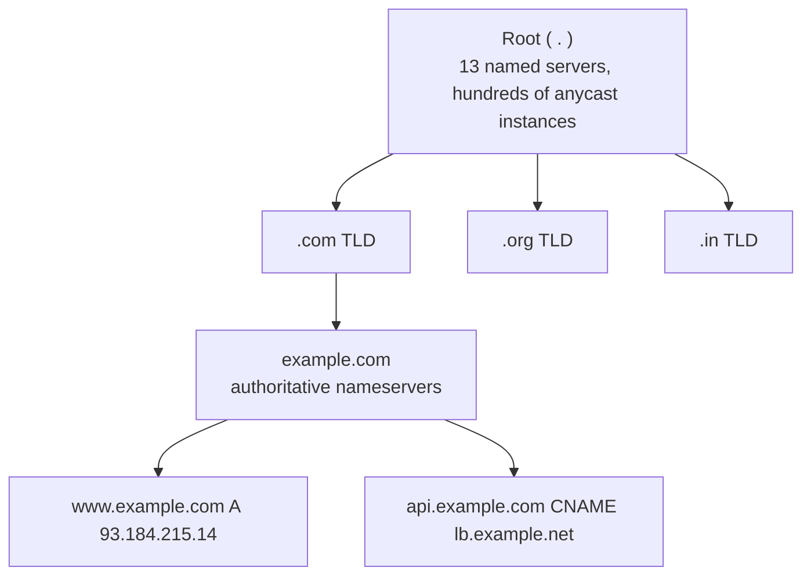
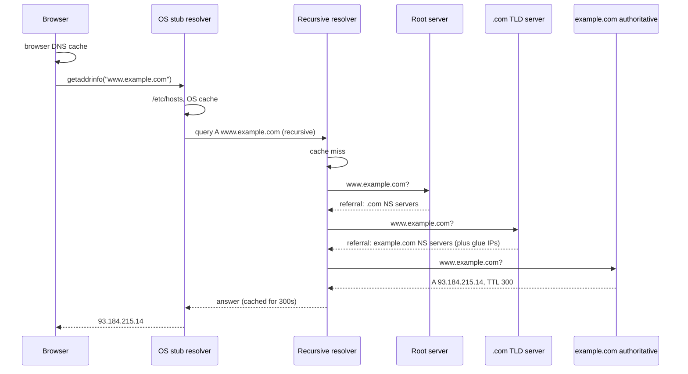
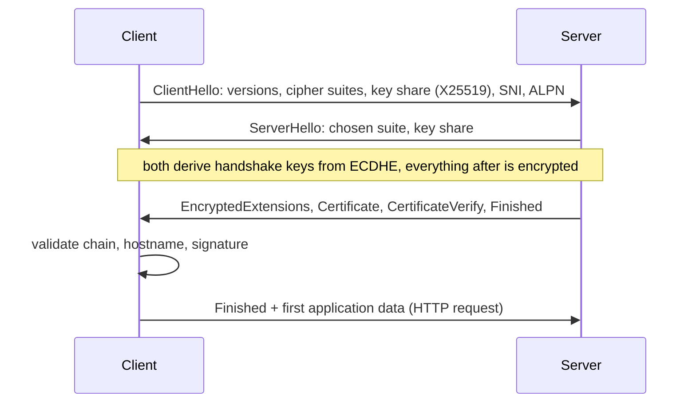
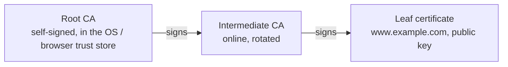

# 📘 DNS, HTTP, and TLS

Every web request starts with a DNS lookup, rides on TLS, and speaks HTTP.
This page covers how each works on the wire and the failure modes you see in production.
HTTP semantics (methods, status codes, headers, cookies, CORS) are covered in [Backend Fundamentals](/docs/backend/backend-fundamentals), so this page focuses on versions, connections, and performance.

## Table of Contents

1. [DNS Basics](#1-dns-basics)
2. [How a Lookup Resolves](#2-how-a-lookup-resolves)
3. [Record Types](#3-record-types)
4. [Caching, TTLs, and Propagation](#4-caching-ttls-and-propagation)
5. [DNS in Production](#5-dns-in-production)
6. [DNS Security and Privacy](#6-dns-security-and-privacy)
7. [HTTP Versions](#7-http-versions)
8. [HTTP/2 in Detail](#8-http2-in-detail)
9. [HTTP/3](#9-http3)
10. [TLS Goals and Building Blocks](#10-tls-goals-and-building-blocks)
11. [The TLS 1.3 Handshake](#11-the-tls-13-handshake)
12. [Certificates and Trust](#12-certificates-and-trust)
13. [HTTPS in Practice](#13-https-in-practice)
14. [Questions](#14-questions)

---

## 1. DNS Basics

**DNS** maps names to records, most often a name to an IP address.
It is a hierarchical, distributed, heavily cached database.

| Role | Job |
| --- | --- |
| **Stub resolver** | The OS library in your machine; asks one recursive resolver and trusts it |
| **Recursive resolver** | Does the legwork and caches: your ISP, `1.1.1.1`, `8.8.8.8`, a corporate resolver |
| **Root servers** | Know the nameservers for every TLD |
| **TLD servers** | Know the nameservers for every domain under `.com`, `.org`, and so on |
| **Authoritative servers** | Hold the actual records for a zone (Route 53, Cloudflare DNS, NS1) |

DNS uses **UDP port 53** for most queries and **TCP port 53** for responses too large for UDP and for zone transfers.
Modern resolvers use EDNS(0) to allow UDP responses around 1,232 bytes before falling back to TCP.

---

## 2. How a Lookup Resolves

- The stub asks a **recursive** query: "give me the final answer".
- The resolver makes **iterative** queries: each server answers with the best referral it has.
- **Glue records** provide the IP of a nameserver whose name is inside the zone it serves (`ns1.example.com` for `example.com`), breaking the chicken-and-egg loop.
- In practice the resolver has the root and `.com` referrals cached, so most lookups need one or zero upstream queries.

---

## 3. Record Types

| Type | Maps | Example |
| --- | --- | --- |
| **A** | Name to IPv4 | `www A 93.184.215.14` |
| **AAAA** | Name to IPv6 | `www AAAA 2606:2800:21f:cb07::1` |
| **CNAME** | Alias to another name | `api CNAME lb-123.elb.amazonaws.com` |
| **MX** | Mail servers for the domain, with priority | `@ MX 10 mail.example.com` |
| **TXT** | Arbitrary text | SPF, DKIM, DMARC, domain verification |
| **NS** | Authoritative nameservers for a zone | `@ NS ns1.provider.net` |
| **SOA** | Zone metadata: primary NS, serial, timers, negative-cache TTL | One per zone |
| **PTR** | IP to name (reverse DNS) | `14.215.184.93.in-addr.arpa PTR www.example.com` |
| **SRV** | Service host and port | `_sip._tcp SRV 10 60 5060 sip.example.com` |
| **CAA** | Which CAs may issue certificates for the domain | `@ CAA 0 issue "letsencrypt.org"` |
| **HTTPS / SVCB** | Connection hints: ALPN (h3), IP hints, ECH keys | Lets browsers use HTTP/3 on first connect |

**CNAME rules:**
a CNAME cannot coexist with other records at the same name, so it cannot sit at the zone apex (`example.com`) where NS and SOA live.
Providers offer **ALIAS / ANAME / CNAME flattening** to resolve the target server-side and return A records at the apex.

---

## 4. Caching, TTLs, and Propagation

Every answer carries a **TTL** in seconds, and every cache in the chain (browser, OS, resolver) may keep it that long.

| TTL choice | Trade-off |
| --- | --- |
| Long (hours to a day) | Fewer queries, faster lookups, but changes take long to reach everyone |
| Short (30 to 300 s) | Fast failover and migrations, more query load and slightly slower first lookups |

"DNS propagation" is not something DNS actively does; it is old answers **expiring** from caches around the world.
Before a migration, **lower the TTL a full old-TTL period in advance**, make the change, then raise it again.

**Negative caching**: an NXDOMAIN ("does not exist") answer is also cached, for the SOA's minimum TTL.
Querying a name before you create it can make it "not exist" for a while.

Some clients ignore TTLs: older JVMs cached forever under a security manager, and the JVM still caches successful lookups by default for 30 seconds (`networkaddress.cache.ttl`).
Long-lived connection pools also never re-resolve, so a DNS change does not move existing connections.

---

## 5. DNS in Production

| Use | How |
| --- | --- |
| **Load distribution** | Multiple A records (round-robin), clients pick one |
| **GeoDNS / latency routing** | Answer depends on the resolver's location (EDNS Client Subnet helps) |
| **Failover** | Health checks remove failed endpoints from answers; limited by TTL and client caching |
| **Weighted routing** | Send 5 percent of lookups to a canary |
| **Service discovery** | Kubernetes CoreDNS: `my-svc.my-ns.svc.cluster.local`; SRV records; Consul DNS |
| **Blue-green cutover** | Flip a CNAME |

DNS is a frequent root cause of outages ("it's always DNS"): expired domains, bad zone pushes, resolvers overloaded, a missing trailing dot in a zone file, or Kubernetes `ndots:5` causing every external lookup to try several cluster suffixes first.

---

## 6. DNS Security and Privacy

| Threat or need | Answer |
| --- | --- |
| **Cache poisoning** (forged answers inserted into a resolver) | Random query IDs and source ports; **DNSSEC** |
| **DNSSEC** | Zones sign records; resolvers validate a chain of signatures from the root; provides authenticity, not privacy |
| **Snooping on queries** | Encrypted DNS: **DoT** (DNS over TLS, port 853), **DoH** (DNS over HTTPS, port 443), **DoQ** (over QUIC) |
| **DNS amplification DDoS** | Small spoofed query, large answer to the victim; open resolvers and ANY queries are abused; response rate limiting |
| **Domain hijacking** | Registrar lock, MFA on the registrar account |
| **Subdomain takeover** | A CNAME points at a deleted cloud resource that someone else can claim; clean up dangling records |
| **DNS tunnelling / exfiltration** | Data smuggled in query names; monitor unusual query volume |

---

## 7. HTTP Versions

| Version | Year | Transport | Key idea | Main problem |
| --- | --- | --- | --- | --- |
| **HTTP/0.9, 1.0** | 1991, 1996 | TCP | One request per connection | New TCP (and TLS) handshake per object |
| **HTTP/1.1** | 1997, RFC 9112 today | TCP | Persistent connections (keep-alive), `Host` header, chunked encoding, pipelining (never really used) | One outstanding request per connection, so browsers open 6 per origin |
| **HTTP/2** | 2015, RFC 9113 | TCP + TLS in practice | Binary framing, multiplexed streams, header compression (HPACK) | TCP head-of-line blocking |
| **HTTP/3** | 2022, RFC 9114 | QUIC over UDP | Streams independent at transport, 1-RTT / 0-RTT setup, connection migration | UDP blocked on some networks, more CPU |

Semantics (methods, status codes, headers) are the same across versions; only the wire format changes.

HTTP/1.1 era workarounds that are **anti-patterns under HTTP/2 and HTTP/3**: domain sharding, sprite sheets, and aggressive file concatenation.

---

## 8. HTTP/2 in Detail

| Concept | Meaning |
| --- | --- |
| **Frame** | Smallest unit: HEADERS, DATA, SETTINGS, WINDOW_UPDATE, RST_STREAM, GOAWAY, PING |
| **Stream** | One request-response pair, identified by an ID (odd for client-initiated) |
| **Multiplexing** | Frames from many streams interleave on one connection |
| **HPACK** | Header compression with a static table, a dynamic table, and Huffman coding |
| **Flow control** | Per stream and per connection windows |
| **Prioritization** | The original tree scheme was deprecated; RFC 9218 extensible priorities (`Priority: u=3, i`) replaced it |
| **Server push** | Deprecated in practice; Chrome removed it. Use `103 Early Hints` and preload instead |
| **ALPN** | TLS extension that negotiates `h2` during the handshake, saving a round trip |

gRPC is built on HTTP/2 streams, which is why gRPC needs HTTP/2 end to end (or a proxy that speaks it).

Security note: the 2023 **HTTP/2 Rapid Reset** attack (CVE-2023-44487) opened and immediately cancelled streams to overwhelm servers, producing record-size DDoS attacks; servers now cap stream resets.

---

## 9. HTTP/3

HTTP/3 maps HTTP semantics onto QUIC streams (see [TCP, UDP, and QUIC](/docs/networking/tcp-udp-and-quic)).

- Header compression is **QPACK**, a variant of HPACK that tolerates out-of-order streams.
- Discovery: a server advertises HTTP/3 with the `Alt-Svc: h3=":443"` header or an **HTTPS DNS record**; the browser tries QUIC and falls back to TCP if UDP fails.
- Biggest wins are on mobile and lossy networks; on a clean wired link the difference is small.
- All major browsers support it, and CDNs (Cloudflare, Fastly, Akamai, CloudFront) offer it.

---

## 10. TLS Goals and Building Blocks

**TLS** (Transport Layer Security, successor of SSL) gives a connection three properties:

| Goal | Mechanism |
| --- | --- |
| **Confidentiality** | Symmetric encryption with an AEAD cipher (AES-GCM, ChaCha20-Poly1305) |
| **Integrity** | AEAD authentication tag detects tampering |
| **Authentication** | Server proves identity with a certificate and a signature (optionally the client too, mTLS) |

| Building block | Role in TLS |
| --- | --- |
| **Asymmetric crypto** (RSA, ECDSA, Ed25519) | Signatures that prove who you are; slow |
| **Key exchange** (ECDHE with X25519) | Both sides derive a shared secret without ever sending it |
| **Symmetric crypto** (AES, ChaCha20) | Fast bulk encryption with the derived keys |
| **Hash / HKDF** (SHA-256, SHA-384) | Derive keys, hash the transcript |
| **Forward secrecy** | Ephemeral keys per session, so a stolen server private key cannot decrypt past traffic |

**Post-quantum**: browsers and major servers now default to the hybrid key exchange **X25519MLKEM768**, combining classic X25519 with the ML-KEM (Kyber) standard, to protect today's traffic against future quantum decryption.

| Version | Status |
| --- | --- |
| SSL 2.0, 3.0 | Broken, forbidden |
| TLS 1.0, 1.1 | Deprecated (RFC 8996), disabled in browsers |
| TLS 1.2 | Still widely supported; safe with ECDHE and AEAD ciphers |
| **TLS 1.3** (RFC 8446) | Current default: 1-RTT handshake, forward secrecy mandatory, legacy ciphers removed |

---

## 11. The TLS 1.3 Handshake

- **1 RTT** for a full handshake, because the client guesses the key exchange group and sends its key share in the first message.
- **Resumption** with a pre-shared key from a previous session skips certificate work.
- **0-RTT early data** sends the request in the first flight, but it can be **replayed** by an attacker, so servers must accept it only for idempotent requests.
- TLS 1.2 needed **2 RTT** and allowed RSA key transport without forward secrecy.

**CertificateVerify** is where the server signs the handshake transcript with its private key, proving it owns the certificate rather than having copied it.

---

## 12. Certificates and Trust

An **X.509 certificate** binds a public key to names (the **Subject Alternative Name** list), signed by a **Certificate Authority**.

The client validates:

1. The chain up to a root in its trust store (the server must send the intermediates).
2. Signatures at each step.
3. Validity dates.
4. The hostname matches a SAN entry (wildcards cover one label: `*.example.com` matches `a.example.com`, not `a.b.example.com`).
5. Revocation status, weakly in practice (OCSP stapling, CRLs, browser-pushed revocation lists).

| Concept | Meaning |
| --- | --- |
| **DV / OV / EV** | Domain, organization, extended validation; browsers no longer show EV specially |
| **ACME** | Protocol for automatic issuance and renewal (Let's Encrypt, cert-manager, Caddy) |
| **Certificate Transparency** | Every public cert is logged publicly, so misissuance can be detected |
| **Certificate lifetime** | Public TLS certs max 398 days today; the CA/Browser Forum approved cutting to 200 days (March 2026), 100 days (2027), and 47 days (2029). Automate renewal |
| **Short-lived certs** | Let's Encrypt offers 6-day certificates |
| **Pinning** | Hardcoding expected keys; causes outages when keys rotate, largely abandoned on the web, still used in some mobile apps |
| **Self-signed** | No CA; fine for internal testing, needs explicit trust |
| **Private CA** | Internal PKI for service-to-service mTLS (Vault, cert-manager, SPIFFE/SPIRE, service meshes) |

**mTLS** (mutual TLS): the client also presents a certificate.
It is the standard way to authenticate services to each other in a zero-trust network, and service meshes (Istio, Linkerd) automate it.

**SNI** (Server Name Indication) puts the hostname in the ClientHello so one IP can serve many certificates.
It is visible to observers; **ECH** (Encrypted Client Hello) encrypts it using a key published in the HTTPS DNS record and is rolling out in browsers and CDNs.

---

## 13. HTTPS in Practice

| Topic | Guidance |
| --- | --- |
| **Where TLS terminates** | At the load balancer or CDN (simplest), re-encrypt to backends for zero-trust, or pass-through (L4) when backends must see the client cert |
| **HSTS** | `Strict-Transport-Security` header forces HTTPS for future visits; preload lists protect the very first visit |
| **Mixed content** | HTTPS pages loading HTTP resources get blocked |
| **Cipher config** | Use TLS 1.2 and 1.3 only with modern suites (Mozilla SSL config generator "intermediate") |
| **Performance** | TLS 1.3, session resumption, OCSP stapling, ECDSA certs (smaller and faster than RSA), HTTP/2 or HTTP/3 |
| **Expired certificates** | A top cause of outages; automate renewal and alert well before expiry |
| **Debugging** | `openssl s_client -connect host:443 -servername host`, `curl -v`, SSL Labs test |

Common error messages:

| Error | Usual cause |
| --- | --- |
| `certificate has expired` | Renewal failed |
| `unable to get local issuer certificate` | Server did not send the intermediate, or the client trust store is missing the root |
| `hostname mismatch` / `ERR_CERT_COMMON_NAME_INVALID` | Name not in SAN, wrong SNI, wrong vhost |
| `handshake failure` / `no shared cipher` | Protocol or cipher mismatch, often an old client |
| `self-signed certificate in certificate chain` | Corporate TLS-intercepting proxy or internal CA not trusted |

---

## 14. Questions

| Question | Short answer |
| --- | --- |
| Walk through a DNS lookup. | Browser, OS cache, recursive resolver; root, TLD, authoritative referrals; answer cached by TTL |
| Recursive vs iterative query? | "Give me the answer" to a resolver vs "give me your best referral" between servers |
| A vs CNAME? | Name to IP vs name to another name; no CNAME at the apex |
| Why do DNS changes take time? | Cached answers expire only after their TTL |
| Does DNS use TCP or UDP? | UDP normally, TCP for large responses and zone transfers |
| HTTP/1.1 vs HTTP/2 vs HTTP/3? | Persistent connections vs multiplexed binary streams on TCP vs streams on QUIC without transport HOL |
| What does TLS provide? | Confidentiality, integrity, server (and optional client) authentication |
| Why is TLS 1.3 faster? | 1-RTT handshake, key share in the first message, 0-RTT resumption |
| What is forward secrecy? | Ephemeral key exchange, so a leaked long-term key does not decrypt past sessions |
| How does the browser trust a certificate? | Chain to a trusted root, valid dates and signatures, hostname in SAN, not revoked |
| What is SNI and why does it matter? | Hostname in ClientHello to pick the right cert on a shared IP; visible unless ECH |
| What is mTLS? | Both sides present certificates; service-to-service auth |

Next: [Application Protocols and Infrastructure](/docs/networking/application-protocols-and-infrastructure).
