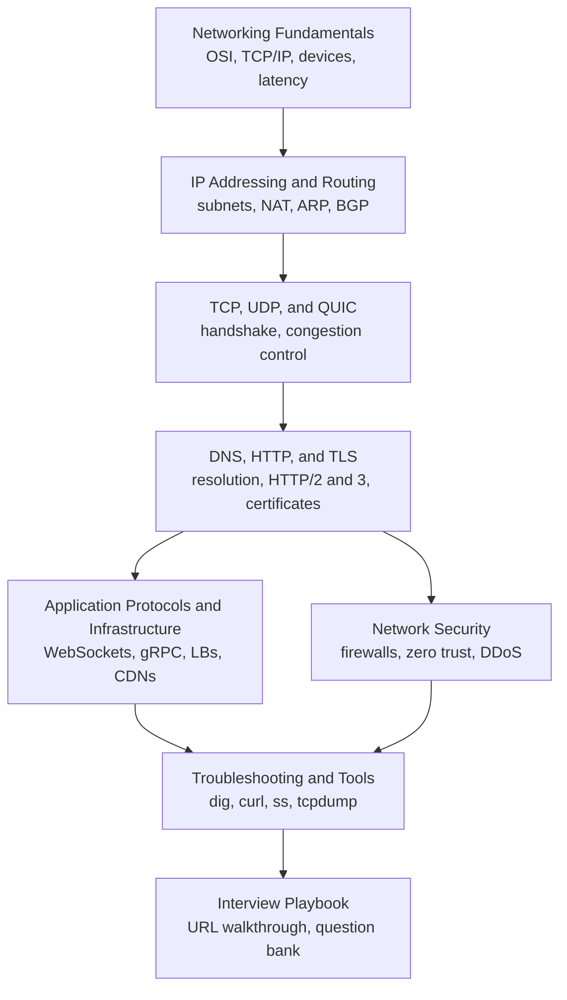

Start here for networking prep, from "what is a MAC address" to "why does gRPC need an L7 load balancer".
The pages follow the stack from the bottom up, then cover the infrastructure between clients and servers, security, and how to debug real problems.
Subnet examples were verified with Python's `ipaddress` module, and recent changes (HTTP/3 and QUIC adoption, post-quantum TLS key exchange, shorter certificate lifetimes) are included where they matter.

<SectionHub
  path="networking"
  levels={{
    "networking-fundamentals": "Beginner",
    "ip-addressing-and-routing": "Beginner to mid",
    "tcp-udp-and-quic": "Mid to advanced",
    "dns-http-and-tls": "Mid",
    "application-protocols-and-infrastructure": "Mid to advanced",
    "network-security": "Mid to advanced",
    "troubleshooting-and-tools": "Mid",
    "networking-interview-playbook": "All levels"
  }}
/>

## Reading Path

## Pick Your Level

| You are | Read in this order |
| --- | --- |
| New to networking | [Fundamentals](/docs/networking/networking-fundamentals), [IP and Routing](/docs/networking/ip-addressing-and-routing), [TCP, UDP, and QUIC](/docs/networking/tcp-udp-and-quic) |
| Preparing for a mid-level loop | Add [DNS, HTTP, and TLS](/docs/networking/dns-http-and-tls), [Infrastructure](/docs/networking/application-protocols-and-infrastructure) |
| Preparing for senior, SRE, or infra roles | Add [Security](/docs/networking/network-security), [Troubleshooting](/docs/networking/troubleshooting-and-tools) |
| One week left | The [Interview Playbook](/docs/networking/networking-interview-playbook) study plan |

## Related Sections

- [Operating Systems](/docs/operating-systems) explains sockets, file descriptors, and I/O multiplexing from the kernel side.
- [Backend](/docs/backend) covers HTTP semantics, APIs, authentication, and caching in application code.
- [System Design](/docs/system-design) uses DNS, CDNs, load balancers, and real-time protocols as building blocks.
