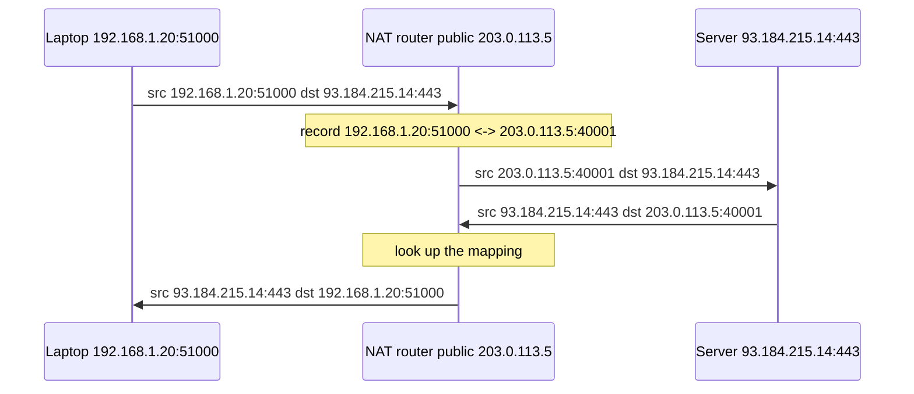
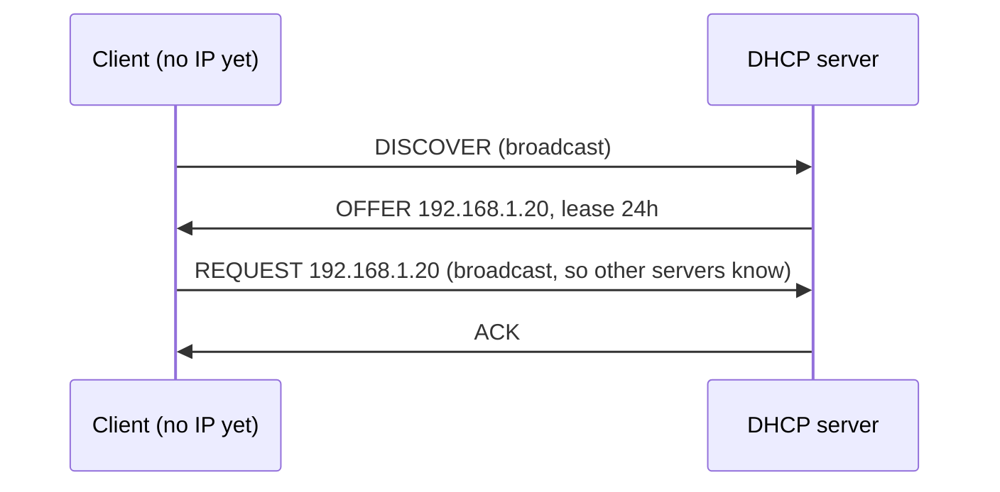

# 📘 IP Addressing and Routing

This page covers layer 3: how hosts get addresses, how a network is carved into subnets, and how packets find their way across the Internet.
Subnet math is the part interviewers test by hand, so the worked examples are spelled out step by step.
Every subnet in the examples was checked with Python's `ipaddress` module.

## Table of Contents

1. [IPv4 Addresses](#1-ipv4-addresses)
2. [CIDR and Subnetting](#2-cidr-and-subnetting)
3. [Special and Private Ranges](#3-special-and-private-ranges)
4. [NAT](#4-nat)
5. [IPv6](#5-ipv6)
6. [ARP, NDP, and DHCP](#6-arp-ndp-and-dhcp)
7. [ICMP](#7-icmp)
8. [How Routing Works](#8-how-routing-works)
9. [Routing Protocols](#9-routing-protocols)
10. [Unicast, Broadcast, Multicast, Anycast](#10-unicast-broadcast-multicast-anycast)
11. [Cloud Networking](#11-cloud-networking)
12. [Questions](#12-questions)

---

## 1. IPv4 Addresses

An IPv4 address is 32 bits written as four decimal octets: `192.168.1.10`.
Each address has a **network part** and a **host part**, and the split is set by the **prefix length** (the `/24` in `192.168.1.0/24`).

```text
192.168.1.10/24
11000000.10101000.00000001.00001010
|<------- network 24 ------>|<host>|
mask 255.255.255.0 = 11111111.11111111.11111111.00000000
```

The network address is `IP AND mask`.
Two hosts are on the same subnet if their network addresses match; otherwise traffic goes to the default gateway.

Old **classful** addressing (class A /8, B /16, C /24) was replaced by **CIDR** in 1993 because fixed class sizes wasted addresses.
Interviewers still ask about classes, so know the first-octet ranges: A 1 to 126, B 128 to 191, C 192 to 223, D (multicast) 224 to 239, E (reserved) 240 to 255.

---

## 2. CIDR and Subnetting

For a prefix `/n`:

- Addresses in the block = 2^(32 - n).
- Usable hosts = 2^(32 - n) - 2, because the first is the **network address** and the last is the **broadcast address**.
- Exceptions: `/31` has 2 usable addresses for point-to-point links (RFC 3021) and `/32` is a single host.
- Cloud providers reserve more: AWS reserves 5 addresses per subnet, Azure 5, GCP 4.

| Prefix | Mask | Addresses | Usable hosts |
| --- | --- | --- | --- |
| /8 | 255.0.0.0 | 16,777,216 | 16,777,214 |
| /16 | 255.255.0.0 | 65,536 | 65,534 |
| /20 | 255.255.240.0 | 4,096 | 4,094 |
| /22 | 255.255.252.0 | 1,024 | 1,022 |
| /24 | 255.255.255.0 | 256 | 254 |
| /25 | 255.255.255.128 | 128 | 126 |
| /26 | 255.255.255.192 | 64 | 62 |
| /27 | 255.255.255.224 | 32 | 30 |
| /28 | 255.255.255.240 | 16 | 14 |
| /29 | 255.255.255.248 | 8 | 6 |
| /30 | 255.255.255.252 | 4 | 2 |
| /32 | 255.255.255.255 | 1 | 1 (host route) |

Mask octet values to memorize: 128, 192, 224, 240, 248, 252, 254, 255.
The **block size** in the interesting octet is 256 minus the mask value.

### Worked example 1: which subnet is this host in?

Host `172.16.45.200/20`.

1. `/20` means the interesting octet is the third (bits 17 to 24), mask value 240, block size 256 - 240 = 16.
2. The third octet is 45, and the nearest multiples of 16 around it are 32 and 48, so the block starts at 32.
3. Network: `172.16.32.0/20`. Next network: `172.16.48.0`.
4. Broadcast: `172.16.47.255`. Usable: `172.16.32.1` to `172.16.47.254`, 4,094 hosts.

### Worked example 2: split a network

Split `10.0.0.0/24` into 4 equal subnets.

4 = 2^2, so borrow 2 bits: `/26`, 64 addresses each.

| Subnet | Range | Broadcast |
| --- | --- | --- |
| 10.0.0.0/26 | .1 to .62 | .63 |
| 10.0.0.64/26 | .65 to .126 | .127 |
| 10.0.0.128/26 | .129 to .190 | .191 |
| 10.0.0.192/26 | .193 to .254 | .255 |

### Worked example 3: VLSM

You have `192.168.10.0/24` and need subnets for 100, 50, 20, and 2 hosts.
Allocate largest first so blocks stay aligned.

| Need | Prefix | Subnet |
| --- | --- | --- |
| 100 hosts | /25 (126) | 192.168.10.0/25 |
| 50 hosts | /26 (62) | 192.168.10.128/26 |
| 20 hosts | /27 (30) | 192.168.10.192/27 |
| 2 hosts | /30 (2) | 192.168.10.224/30 |

`192.168.10.228` onwards stays free for later.

### Supernetting (route aggregation)

`192.168.0.0/24` through `192.168.3.0/24` share their first 22 bits, so they can be advertised as one route `192.168.0.0/22`.
Aggregation keeps Internet routing tables small, which is why providers hand out aligned blocks.

Check your work in any shell with Python:

```python
import ipaddress
n = ipaddress.ip_network("172.16.45.200/20", strict=False)
print(n, n.broadcast_address, n.num_addresses - 2)
# 172.16.32.0/20 172.16.47.255 4094
print(list(ipaddress.ip_network("10.0.0.0/24").subnets(new_prefix=26)))
```

---

## 3. Special and Private Ranges

| Range | Purpose |
| --- | --- |
| `10.0.0.0/8` | Private (RFC 1918) |
| `172.16.0.0/12` | Private (172.16.0.0 to 172.31.255.255) |
| `192.168.0.0/16` | Private |
| `100.64.0.0/10` | Carrier-grade NAT shared space (also used by Tailscale) |
| `127.0.0.0/8` | Loopback (`127.0.0.1` is localhost) |
| `169.254.0.0/16` | Link-local, self-assigned when DHCP fails; `169.254.169.254` is the cloud metadata service |
| `0.0.0.0/8` | "This network"; `0.0.0.0` as a bind address means all interfaces |
| `224.0.0.0/4` | Multicast |
| `255.255.255.255` | Limited broadcast |
| `192.0.2.0/24`, `198.51.100.0/24`, `203.0.113.0/24` | Documentation examples |

Private addresses are not routed on the public Internet, so they need NAT to reach it.

The cloud metadata address `169.254.169.254` matters for security: an SSRF bug that lets an attacker make the server fetch that URL can leak cloud credentials, which is why AWS IMDSv2 requires a session token.

---

## 4. NAT

**Network Address Translation** rewrites addresses as packets cross a router.
IPv4 ran out of addresses (IANA's free pool was exhausted in 2011), and NAT is what kept it alive.

| Type | Mapping | Use |
| --- | --- | --- |
| **Static NAT** | One private IP to one public IP | Expose one server |
| **Dynamic NAT** | Private IPs to a pool of public IPs | Rare today |
| **PAT / NAPT** (masquerade) | Many private IPs to one public IP, distinguished by port | Every home router, cloud NAT gateways |
| **DNAT / port forwarding** | Public IP:port to a private IP:port | Expose a service behind NAT |
| **CGNAT** | ISP-level NAT, customers get `100.64.0.0/10` addresses | Mobile carriers, many ISPs |



Costs of NAT:

- Breaks the end-to-end model: unsolicited inbound connections have no mapping, so peer-to-peer needs **NAT traversal** (STUN, TURN, ICE, used by WebRTC).
- Keeps state, so mappings expire; long-lived idle connections need keepalives.
- Port exhaustion: one public IP has about 64K ports per destination, and cloud NAT gateways hit this under heavy outbound traffic to one endpoint.
- Logging and abuse attribution get harder with CGNAT.

NAT is **not a firewall**, although it has a similar side effect of blocking unsolicited inbound traffic.

---

## 5. IPv6

IPv6 addresses are 128 bits written as eight groups of four hex digits.

```text
2001:0db8:0000:0000:0000:ff00:0042:8329
2001:db8::ff00:42:8329        (drop leading zeros, compress one run of zero groups with ::)
```

| Feature | IPv4 | IPv6 |
| --- | --- | --- |
| Address size | 32 bits | 128 bits |
| Header | 20 to 60 bytes, variable | 40 bytes fixed, extension headers chained |
| Checksum in header | Yes | No (left to L2 and L4) |
| Fragmentation | Routers may fragment | Only the sender fragments, relies on path MTU discovery |
| Address config | DHCP or manual | SLAAC (self-configure from router advertisement) or DHCPv6 |
| Broadcast | Yes | No, uses multicast |
| ARP | ARP | NDP over ICMPv6 |
| NAT | Common | Not needed, every device can have a global address |
| Minimum MTU | 576 | 1280 |

| IPv6 prefix | Meaning |
| --- | --- |
| `::1/128` | Loopback |
| `fe80::/10` | Link-local, every interface has one |
| `fc00::/7` (in practice `fd00::/8`) | Unique local, like RFC 1918 |
| `2000::/3` | Global unicast |
| `ff00::/8` | Multicast |
| `/64` | Standard subnet size, SLAAC needs it |
| `/48` or `/56` | Typical allocation to a site or home |

Transition mechanisms: **dual stack** (run both, the norm), **NAT64/DNS64** (IPv6-only clients reach IPv4 servers), and tunnels.
**Happy Eyeballs** (RFC 8305) makes clients race IPv6 and IPv4 connections so a broken IPv6 path does not stall the user.
Global IPv6 adoption, measured by Google, has hovered around 45 to 50 percent of users.

---

## 6. ARP, NDP, and DHCP

### ARP: IP to MAC on the local link

To send to `192.168.1.1` on the same LAN, a host needs its MAC address.

1. Check the ARP cache (`ip neigh`).
2. On a miss, broadcast "Who has 192.168.1.1? Tell 192.168.1.20".
3. The owner replies by unicast with its MAC.
4. Cache the answer for a while.

If the destination is on another subnet, the host ARPs for the **default gateway's** MAC instead, never the remote host's.

**ARP spoofing**: any host can send a fake reply and become a man in the middle.
Defenses are dynamic ARP inspection on switches and, above all, encryption (TLS) so interception gains nothing.

IPv6 replaces ARP with **Neighbor Discovery Protocol** (NDP), using ICMPv6 neighbor solicitation and advertisement messages to multicast groups instead of broadcast.

### DHCP: getting an address automatically

**DORA**, over UDP ports 67 (server) and 68 (client):



The lease gives the IP, subnet mask, default gateway, DNS servers, and lease time.
Clients renew at 50 percent of the lease.
A **DHCP relay** forwards broadcasts to a server on another subnet.
A rogue DHCP server can hand out a malicious gateway, so switches offer **DHCP snooping**.

---

## 7. ICMP

ICMP carries control and error messages for IP.
It has no ports.

| Message | Used by |
| --- | --- |
| Echo request / reply (type 8 / 0) | `ping` |
| Time exceeded (type 11) | `traceroute`: send packets with TTL 1, 2, 3 and each router that drops one reports back |
| Destination unreachable (type 3) | Port unreachable, host unreachable, **fragmentation needed** (code 4) |
| Redirect (type 5) | Router tells a host a better next hop |

Blocking all ICMP is a common mistake.
"Fragmentation needed" messages power **path MTU discovery**; drop them and connections that send large packets hang (a **PMTUD black hole**).
Allow at least types 3 and 11, and ICMPv6 must be allowed broadly because NDP depends on it.

---

## 8. How Routing Works

Every host and router has a **routing table**: destination prefix, next hop, interface, and metric.

```text
$ ip route
default via 192.168.1.1 dev wlan0
10.8.0.0/16 via 10.8.0.1 dev tun0
192.168.1.0/24 dev wlan0 proto kernel scope link src 192.168.1.20
```

For each packet, a router:

1. Checks and decrements the TTL (IPv6 hop limit); at 0 it drops the packet and sends ICMP time exceeded, which prevents loops from circulating forever.
2. Finds the matching route with the **longest prefix match**.
3. Rewrites the layer 2 header for the next hop and forwards.

### Longest prefix match

| Route | Next hop |
| --- | --- |
| 0.0.0.0/0 | ISP |
| 10.0.0.0/8 | Router A |
| 10.1.0.0/16 | Router B |
| 10.1.2.0/24 | Router C |

Destination `10.1.2.7` matches all four, and the most specific wins: Router C.
Destination `10.1.9.9` goes to Router B.
Destination `8.8.8.8` only matches the default route.
Routers implement this with tries or TCAM hardware so lookups take nanoseconds.

The full IPv4 Internet table (the "DFZ") is roughly one million prefixes, and IPv6 is over 200,000.

---

## 9. Routing Protocols

| Kind | How it works | Examples |
| --- | --- | --- |
| **Static** | Admin writes routes by hand | Small networks, default routes |
| **Distance vector** | Tell neighbors your distance to every destination (Bellman-Ford) | RIP (hop count, max 15) |
| **Link state** | Flood the topology, every router runs Dijkstra | OSPF, IS-IS |
| **Path vector** | Advertise the full AS path, apply policy | BGP |

**Interior gateway protocols** (IGP) route inside one organization.
**Exterior gateway protocols** route between organizations.

| | OSPF | BGP |
| --- | --- | --- |
| Scope | Inside an autonomous system | Between autonomous systems, the Internet |
| Metric | Link cost, shortest path | Policy first (local preference, AS path length, and more) |
| Transport | Directly over IP (protocol 89) | TCP port 179 |
| Convergence | Seconds or less | Slower, deliberately damped |
| Scale | Thousands of routers | About 1 million prefixes, 75,000+ ASes |

An **autonomous system** (AS) is a network under one administrative policy with an AS number: an ISP, a cloud, a large company.
BGP is how they tell each other "I can reach these prefixes".

BGP trusts what neighbors announce, which enables **route hijacks** and **route leaks**.
Famous outages: Pakistan Telecom hijacking YouTube (2008) and Facebook withdrawing its own routes (October 2021), which took its DNS servers off the Internet.
**RPKI** (cryptographically signed route origins) is the main mitigation, and most large networks now drop RPKI-invalid routes.

---

## 10. Unicast, Broadcast, Multicast, Anycast

| Mode | Delivered to | Example |
| --- | --- | --- |
| **Unicast** | One specific host | Almost all traffic |
| **Broadcast** | Every host on the subnet | ARP, DHCP discover (IPv4 only) |
| **Multicast** | Hosts that joined a group | IPTV inside ISPs, market data feeds, NDP |
| **Anycast** | The nearest of many hosts sharing one IP | DNS root servers, `1.1.1.1`, `8.8.8.8`, CDNs |

**Anycast** works by announcing the same prefix via BGP from many locations; routing naturally delivers each client to the closest one.
It gives low latency and absorbs DDoS traffic across many sites.
It suits UDP (DNS) and short TCP connections, because a route change mid-connection can move a flow to a different site.

---

## 11. Cloud Networking

Cloud VPCs apply the same ideas as software.

| Concept | AWS name | Purpose |
| --- | --- | --- |
| Private network | VPC | Your IP range, for example `10.0.0.0/16` |
| Subnet | Subnet (per AZ) | Public subnet has a route to an internet gateway, private does not |
| Route table | Route table | Longest prefix match, per subnet |
| Internet access in | Internet gateway | 1:1 NAT for instances with public IPs |
| Internet access out for private subnets | NAT gateway | PAT |
| Stateful instance firewall | Security group | Allow rules, return traffic automatic |
| Stateless subnet firewall | Network ACL | Allow and deny, ordered, both directions |
| Connect VPCs | VPC peering, Transit Gateway | Non-transitive vs hub |
| Private access to a service | PrivateLink / VPC endpoint | Reach S3 or a SaaS without the Internet |
| On-premises link | Site-to-site VPN, Direct Connect | Encrypted over the Internet vs dedicated line |

Plan CIDRs up front: overlapping ranges (two VPCs both on `10.0.0.0/16`) cannot be peered without NAT, and renumbering later is painful.

Kubernetes adds another layer: every pod gets an IP (often from an overlay or the VPC itself via the CNI plugin), Services get virtual IPs handled by kube-proxy (iptables or IPVS) or eBPF (Cilium), and the cluster needs non-overlapping pod and service CIDRs.

---

## 12. Questions

| Question | Short answer |
| --- | --- |
| How many usable hosts in a /27? | 32 - 2 = 30 |
| Are 10.1.1.10/23 and 10.1.0.200/23 on the same subnet? | Yes, both in 10.1.0.0/23 (10.1.0.0 to 10.1.1.255) |
| What happens when a host sends to an IP on another subnet? | ARP for the default gateway's MAC and send the frame there |
| Why does NAT break peer-to-peer? | No mapping exists for unsolicited inbound traffic; needs STUN, TURN, hole punching |
| Why does IPv6 not need NAT? | Enough addresses for every device; firewalls provide the filtering |
| OSPF vs BGP? | Shortest path inside an AS vs policy-based path vector between ASes |
| What is longest prefix match? | Most specific matching route wins |
| How does traceroute work? | Increasing TTL, collect ICMP time exceeded replies from each hop |
| What is anycast? | Same IP announced from many sites, routing picks the nearest |
| Why should you not block all ICMP? | Breaks path MTU discovery and IPv6 neighbor discovery |

Next: [TCP, UDP, and QUIC](/docs/networking/tcp-udp-and-quic).
