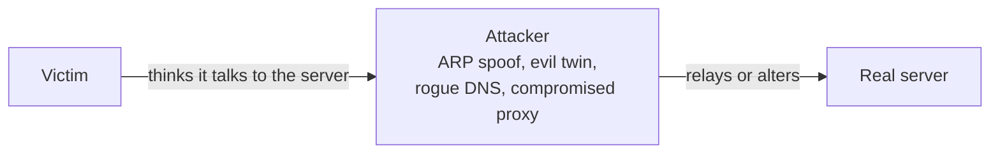

# 📘 Network Security

This page covers how networks are attacked and defended, at the level an application or platform engineer needs.
For application-layer security (authentication, OWASP, injection) see [Authentication and Security](/docs/backend/authentication-and-security).

## Table of Contents

1. [Security Goals](#1-security-goals)
2. [Firewalls](#2-firewalls)
3. [Segmentation and Zero Trust](#3-segmentation-and-zero-trust)
4. [VPNs](#4-vpns)
5. [Attacks by Layer](#5-attacks-by-layer)
6. [Man in the Middle](#6-man-in-the-middle)
7. [DDoS](#7-ddos)
8. [SSRF and Internal Network Exposure](#8-ssrf-and-internal-network-exposure)
9. [Monitoring and Detection](#9-monitoring-and-detection)
10. [Hardening Checklist](#10-hardening-checklist)
11. [Questions](#11-questions)

---

## 1. Security Goals

| Goal | Meaning | Network example |
| --- | --- | --- |
| **Confidentiality** | Only intended parties can read data | TLS, VPN encryption |
| **Integrity** | Data is not altered undetected | AEAD tags, signed DNS (DNSSEC) |
| **Availability** | Service stays reachable | DDoS protection, redundancy |
| **Authentication** | You know who you are talking to | Certificates, mTLS, SSH keys |
| **Non-repudiation** | Sender cannot deny sending | Digital signatures, audit logs |

**Defense in depth**: assume every single control will fail sometime, and layer them so one failure is not a breach.

---

## 2. Firewalls

| Type | Decides on | Notes |
| --- | --- | --- |
| **Stateless packet filter** | Each packet alone: IPs, ports, protocol | Fast; must allow return traffic explicitly (AWS network ACLs) |
| **Stateful firewall** | Tracks connections; return traffic allowed automatically | Most firewalls, AWS security groups, Linux conntrack |
| **Next-generation firewall** | Application identity, users, intrusion prevention | Palo Alto, Fortinet; deep packet inspection |
| **WAF** (web application firewall) | HTTP requests: SQL injection patterns, bad bots, rate limits | Cloudflare, AWS WAF, ModSecurity with the OWASP Core Rule Set |
| **Host firewall** | Traffic on one machine | `nftables` / `iptables`, `ufw`, Windows Firewall |

Rule design:

- **Default deny**, then allow what is needed.
- Filter **egress** too: a compromised server that cannot call out cannot exfiltrate data or reach a command and control server easily.
- Rules are evaluated in order in ACLs; the first match wins.
- Reference groups or tags, not IPs, in cloud rules (a security group can allow traffic "from the app tier security group").

Linux example with `nftables`:

```bash
nft add table inet filter
nft add chain inet filter input '{ type filter hook input priority 0; policy drop; }'
nft add rule inet filter input ct state established,related accept
nft add rule inet filter input iif lo accept
nft add rule inet filter input tcp dport { 22, 443 } accept
```

---

## 3. Segmentation and Zero Trust

**Perimeter model**: a hard shell (firewall) around a soft inside where everything trusts everything.
One phished laptop or one vulnerable server gives the attacker the whole network (lateral movement).

**Segmentation** limits the blast radius:

| Technique | Example |
| --- | --- |
| **Subnets and tiers** | Public subnet for load balancers, private for apps, isolated for databases |
| **DMZ** | Internet-facing servers in a zone that cannot reach the internal network freely |
| **Microsegmentation** | Per-workload policies: Kubernetes NetworkPolicies, security groups per service |
| **Bastion / jump host** | Single hardened entry for admin access, or better, identity-aware access (AWS SSM Session Manager, Teleport) |

**Zero trust** (Google's BeyondCorp, NIST SP 800-207): network location grants no trust.

- Every request is authenticated and authorized, based on user identity, device health, and context.
- Service-to-service traffic uses mTLS with workload identities (SPIFFE).
- Access is least privilege and short lived.
- Everything is logged.

Practical zero trust replaces "VPN into the office network" with an **identity-aware proxy** in front of each internal app (Cloudflare Access, Google IAP, Tailscale with ACLs).

---

## 4. VPNs

A **VPN** creates an encrypted tunnel so remote traffic behaves as if it were on a private network.

| Type | Layer | Notes |
| --- | --- | --- |
| **IPsec** | 3 | Site-to-site standard; IKEv2 for key exchange; ESP encrypts packets; tunnel vs transport mode; complex to configure |
| **SSL / TLS VPN** | 4 to 7 | OpenVPN, corporate remote access; passes firewalls easily on 443 |
| **WireGuard** | 3 | Modern, tiny codebase (about 4,000 lines), fixed modern crypto (Curve25519, ChaCha20-Poly1305), UDP, in the Linux kernel; basis of Tailscale |
| **Mesh VPN / overlay** | 3 | Tailscale, ZeroTier, Nebula: peer-to-peer tunnels with central identity and ACLs |

| Use | Setup |
| --- | --- |
| **Remote access** | Laptop to corporate network |
| **Site to site** | Office or data center to cloud VPC |
| **Split tunnel** | Only corporate traffic goes through the VPN; the rest goes direct |
| **Full tunnel** | All traffic through the VPN; more control, more load |

Consumer VPNs move trust from your ISP to the VPN provider; they do not make you anonymous.

---

## 5. Attacks by Layer

| Layer | Attack | What happens | Defense |
| --- | --- | --- | --- |
| L1 | Wiretap, rogue device | Physical access to traffic | Physical security, encryption |
| L2 | **MAC flooding** | Fill switch table so it floods frames everywhere | Port security |
| L2 | **ARP spoofing** | Claim the gateway's IP, intercept LAN traffic | Dynamic ARP inspection, TLS |
| L2 | **VLAN hopping** | Double tagging or switch spoofing to reach other VLANs | Disable auto-trunking, unused native VLAN |
| L2 | **Rogue DHCP** | Hand out attacker's gateway or DNS | DHCP snooping |
| L2 | **Evil twin Wi-Fi** | Fake access point with a trusted name | WPA3-Enterprise, certificate validation, TLS |
| L3 | **IP spoofing** | Forged source address (for reflection DDoS) | Ingress filtering (BCP 38), uRPF |
| L3 | **BGP hijack** | Announce someone else's prefix | RPKI, monitoring |
| L3 | **ICMP floods, smurf** | Overwhelm with ICMP | Rate limits, no directed broadcast |
| L4 | **SYN flood** | Exhaust half-open connection table | SYN cookies, scrubbing |
| L4 | **Port scanning** | Discover open services (`nmap`) | Minimize exposed ports, detection |
| L4 | **TCP reset injection** | Forge RSTs to kill connections | Random sequence numbers, encryption (QUIC hides most metadata) |
| L7 | **DNS poisoning / spoofing** | Forged DNS answers | DNSSEC, encrypted DNS, random ports |
| L7 | **HTTP floods, Slowloris** | Many or slow requests exhaust servers | Rate limits, timeouts, CDN / WAF |
| L7 | **SSL stripping** | Downgrade HTTPS to HTTP on first visit | HSTS with preload |
| L7 | **Credential stuffing** | Leaked passwords tried at scale | MFA, rate limits, bot detection |

---

## 6. Man in the Middle

A **MITM** sits between two parties and can read or modify traffic.



Getting in the middle is often easy on a shared network.
What stops the attack is **authentication of the endpoint**:

- TLS certificate validation (and never disabling it with `verify=False` or `InsecureSkipVerify`).
- SSH host key verification (the "authenticity of host can't be established" prompt exists for this).
- HSTS so the browser never tries plain HTTP.
- mTLS inside the network.

Corporate **TLS inspection** is a deliberate MITM: the company installs its own root CA on devices so a proxy can decrypt traffic.
It breaks certificate pinning and mTLS, and is why some tools fail with "self-signed certificate in certificate chain" on work laptops.

---

## 7. DDoS

A **distributed denial of service** attack floods a target from many sources, often botnets of compromised IoT devices.

| Category | Target | Examples | Measured in |
| --- | --- | --- | --- |
| **Volumetric** | Bandwidth | UDP floods, amplification (DNS, NTP, memcached, CLDAP) | Tbps |
| **Protocol** | Connection state in servers, firewalls, LBs | SYN floods, fragmented packets | Packets per second |
| **Application (L7)** | App servers and databases | HTTP floods, expensive search queries, HTTP/2 Rapid Reset | Requests per second |

**Amplification**: the attacker sends small requests with the victim's IP as the (spoofed) source to open servers that reply with much larger responses.
Amplification factors range from tens (DNS) to tens of thousands (memcached).
Record attacks have passed 20 Tbps and billions of packets per second, mostly absorbed by large CDN and cloud networks.

Mitigation layers:

1. **Absorb**: anycast CDN or scrubbing service with more capacity than the attack (Cloudflare, AWS Shield, Akamai).
2. **Filter**: drop obviously bad traffic at the edge (unused ports, malformed packets, known reflector protocols).
3. **Rate limit**: per IP, per token, per route; challenge suspicious clients.
4. **Protect the origin**: only accept traffic from the CDN's IP ranges, hide the origin IP.
5. **Design for it**: autoscaling with limits, caching, cheap rejection paths, expensive endpoints behind auth.

---

## 8. SSRF and Internal Network Exposure

**Server-side request forgery**: the attacker makes your server fetch a URL they choose, reaching things only the server can reach.

| Target | Impact |
| --- | --- |
| `http://169.254.169.254/latest/meta-data/iam/...` | Cloud credentials (the 2019 Capital One breach) |
| `http://localhost:6379`, internal admin panels | Unauthenticated internal services |
| `file:///etc/passwd`, `gopher://` | Local files, crafted protocol payloads |

Defenses: allowlist destinations, resolve DNS once and block private and link-local ranges (watch for DNS rebinding and redirects), disable unused URL schemes, send outbound fetches through an egress proxy, and enforce IMDSv2 (token required, hop limit 1) on AWS.

Other exposure to avoid:

- Databases, Redis, Elasticsearch, Docker API (2375), and Kubernetes kubelet ports reachable from the Internet; scanners find them within minutes.
- Management interfaces (SSH, RDP) open to `0.0.0.0/0`.
- Debug endpoints (`/actuator`, `/debug/pprof`) exposed publicly.

---

## 9. Monitoring and Detection

| Tool | What it shows |
| --- | --- |
| **Flow logs** (VPC Flow Logs, NetFlow, IPFIX) | Who talked to whom, when, how much; no payloads |
| **IDS / IPS** (Suricata, Zeek, Snort) | Signature and anomaly detection, optionally blocking |
| **Packet capture** | Full detail for investigation (`tcpdump`, Wireshark) |
| **DNS logs** | Early sign of malware and exfiltration |
| **WAF and LB logs** | Attack patterns on HTTP |
| **SIEM** | Correlates logs across sources and alerts |
| **eBPF tools** (Cilium Hubble, Falco) | Kernel-level visibility of connections per process or pod |

---

## 10. Hardening Checklist

- Encrypt everything in transit, including internal traffic (TLS 1.2+ or mTLS).
- Default-deny ingress and restrict egress.
- Expose only 80 and 443 publicly, behind a CDN or WAF; nothing else.
- Admin access through identity-aware proxies or SSH with keys and MFA, never passwords.
- Private subnets for apps and data; no public IPs on databases.
- Segment by environment (prod, staging) and by tier.
- Enable DDoS protection and rate limiting on public endpoints.
- Enforce IMDSv2 and block metadata access from containers that do not need it.
- Rotate certificates automatically and alert on upcoming expiry.
- Turn on flow logs and DNS logs, and keep them long enough to investigate.
- Patch network devices and VPN appliances fast; they are prime targets for exploits.
- Run periodic external scans of your own address space.

---

## 11. Questions

| Question | Short answer |
| --- | --- |
| Stateless vs stateful firewall? | Judges each packet alone vs tracks connections and allows return traffic |
| Security group vs network ACL? | Stateful, instance-level, allow-only vs stateless, subnet-level, allow and deny, ordered |
| What is zero trust? | No implicit trust from network location; authenticate and authorize every request |
| How does a SYN flood work and how is it stopped? | Fills half-open queue; SYN cookies, scrubbing |
| What is a DNS amplification attack? | Spoofed small queries to open resolvers produce large replies to the victim |
| How does HTTPS stop MITM? | Certificate validation authenticates the server; attacker cannot present a valid cert |
| What is SSRF? | Tricking the server into making requests to internal targets such as the metadata service |
| IPsec vs WireGuard? | Flexible but complex standard vs small, modern, fixed-crypto tunnel |
| How do you protect against DDoS? | Absorb at the edge with anycast CDN, filter, rate limit, hide origin, design cheap failure paths |
| Why restrict egress? | Limits exfiltration and command and control after a compromise |

Next: [Troubleshooting and Tools](/docs/networking/troubleshooting-and-tools).
