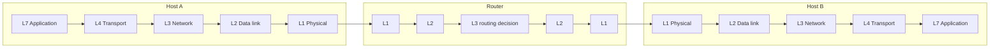
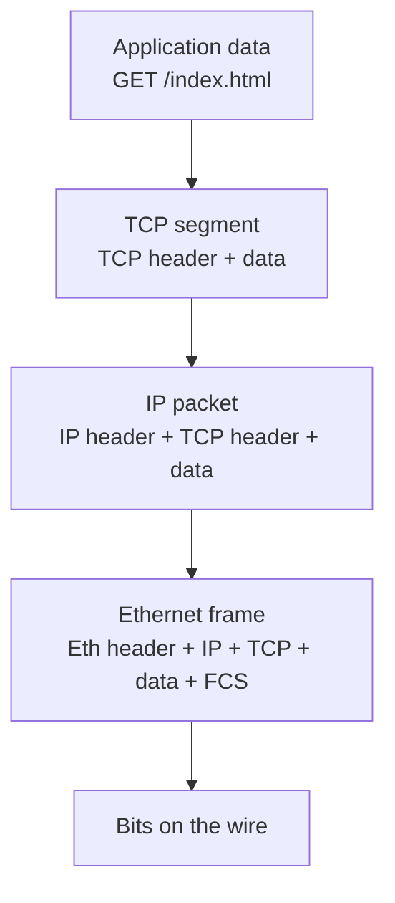

# 📘 Networking Fundamentals

This page is the foundation for the whole Networking section.
It explains how data moves from one machine to another, the layered models everyone refers to, and the vocabulary that interviewers expect you to use precisely.

## Table of Contents

1. [What a Network Is](#1-what-a-network-is)
2. [Network Types and Topologies](#2-network-types-and-topologies)
3. [The OSI Model](#3-the-osi-model)
4. [The TCP/IP Model](#4-the-tcpip-model)
5. [Encapsulation](#5-encapsulation)
6. [Three Kinds of Address](#6-three-kinds-of-address)
7. [Network Devices](#7-network-devices)
8. [Switching and Ethernet](#8-switching-and-ethernet)
9. [Performance Vocabulary](#9-performance-vocabulary)
10. [Numbers Worth Knowing](#10-numbers-worth-knowing)
11. [Beginner Questions](#11-beginner-questions)

---

## 1. What a Network Is

A **network** is a set of devices (hosts) connected so they can exchange data.
Everything else is detail about how to find the other host, how to share the wire, and what to do when data is lost.

| Term | Meaning |
| --- | --- |
| **Host** | Any end device with an address: laptop, phone, server, container |
| **Link** | The physical or wireless medium between two nodes |
| **Protocol** | Agreed rules for message format, order, and actions (TCP, HTTP, DNS) |
| **Packet** | A chunk of data plus headers, the unit that routers forward |
| **Circuit switching** | Reserve a dedicated path for the whole call (old telephone network) |
| **Packet switching** | Split data into packets that share links and may take different paths (the Internet) |

The Internet is packet switched.
Links are shared statistically, which is efficient but means packets can be delayed, reordered, duplicated, or dropped.
Higher layers (mostly TCP) turn that unreliable service into a reliable byte stream.

---

## 2. Network Types and Topologies

| Type | Scope | Example |
| --- | --- | --- |
| **PAN** | A few meters | Bluetooth headphones |
| **LAN** | A building | Office Ethernet and Wi-Fi |
| **MAN** | A city | Metro fiber ring |
| **WAN** | Countries | ISP backbones, the Internet |
| **VPN** | Logical network over another network | Remote access to an office |
| **VPC** | Private network inside a cloud provider | AWS VPC, GCP VPC |

| Topology | Shape | Trade-off |
| --- | --- | --- |
| **Bus** | One shared cable | Cheap, one break kills all, collisions |
| **Star** | Everyone to a central switch | Easy to manage, center is a single point of failure |
| **Ring** | Each node to two neighbors | Predictable, a break needs a dual ring |
| **Mesh** | Many links between nodes | Redundant, expensive |
| **Tree / hierarchical** | Stars of stars | How campus and data center networks are built |

Modern data centers use a **leaf-spine (Clos)** topology: every leaf switch connects to every spine switch, so any two servers are at most two hops apart and there are many equal-cost paths.

---

## 3. The OSI Model

The **OSI model** is a seven-layer reference model.
Real protocols do not map perfectly, but the layer numbers are common vocabulary ("an L4 load balancer", "an L7 firewall").

| # | Layer | Job | Unit | Examples |
| --- | --- | --- | --- | --- |
| 7 | **Application** | Services for the application | Message | HTTP, DNS, SMTP, SSH |
| 6 | **Presentation** | Encoding, compression, encryption | Message | TLS (loosely), JSON, gzip |
| 5 | **Session** | Open, manage, close dialogs | Message | RPC sessions, TLS sessions (loosely) |
| 4 | **Transport** | Process-to-process delivery, reliability, ports | Segment / datagram | TCP, UDP, QUIC |
| 3 | **Network** | Host-to-host delivery across networks, routing | Packet | IP, ICMP |
| 2 | **Data link** | Node-to-node delivery on one link, MAC addresses | Frame | Ethernet, Wi-Fi (802.11), ARP (between 2 and 3) |
| 1 | **Physical** | Bits as signals | Bit | Copper, fiber, radio |

Mnemonic from layer 1 up: **P**lease **D**o **N**ot **T**hrow **S**ausage **P**izza **A**way.

Routers work up to layer 3, switches up to layer 2, and only the end hosts run layers 4 to 7.
That is the **end-to-end principle**: keep the core simple and put intelligence at the edges.

---

## 4. The TCP/IP Model

The model the Internet actually uses has four (sometimes five) layers.

| TCP/IP layer | OSI layers | Protocols |
| --- | --- | --- |
| **Application** | 5, 6, 7 | HTTP, DNS, TLS, SSH, SMTP, gRPC |
| **Transport** | 4 | TCP, UDP, QUIC (runs over UDP) |
| **Internet** | 3 | IPv4, IPv6, ICMP |
| **Link** | 1, 2 | Ethernet, Wi-Fi, ARP |

The IP layer is the **narrow waist**: many link technologies below, many applications above, and exactly one internetworking protocol in the middle.
That is why the Internet could move from dial-up to fiber to 5G without changing applications.

---

## 5. Encapsulation

Each layer wraps the data from the layer above with its own header.
The receiver unwraps in reverse order.

| Header | Key fields |
| --- | --- |
| **Ethernet** (14 bytes + 4 FCS) | Destination MAC, source MAC, EtherType (IPv4 = 0x0800, IPv6 = 0x86DD) |
| **IPv4** (20 bytes minimum) | Source and destination IP, TTL, protocol (TCP = 6, UDP = 17), total length, checksum |
| **IPv6** (40 bytes fixed) | Source and destination IP, hop limit, next header, flow label |
| **TCP** (20 bytes minimum) | Source and destination port, sequence number, ack number, flags, window |
| **UDP** (8 bytes) | Source and destination port, length, checksum |

The **MTU** (maximum transmission unit) on Ethernet is usually 1500 bytes of IP packet.
Subtract 20 bytes of IPv4 and 20 bytes of TCP and you get an **MSS** (maximum segment size) of 1460 bytes of payload.
Tunnels (VPNs, VXLAN) add headers and reduce the effective MTU, which is a classic source of mysterious hangs when large packets are silently dropped.

---

## 6. Three Kinds of Address

| Address | Layer | Scope | Example | Assigned by |
| --- | --- | --- | --- | --- |
| **MAC** | 2 | One link (LAN) | `3c:22:fb:1a:9e:01` (48 bits) | Manufacturer, or randomized by the OS |
| **IP** | 3 | End to end across networks | `203.0.113.10`, `2001:db8::1` | DHCP, SLAAC, or static config |
| **Port** | 4 | One process on a host | `443`, `5432` | OS (ephemeral) or the server config |

A useful analogy: the IP address is the building address, the port is the apartment number, and the MAC address is the name on the door of the next hop the mail carrier walks to.

Key consequence: **as a packet crosses routers, the IP addresses stay the same (ignoring NAT) but the MAC addresses change at every hop.**

A connection is identified by the **5-tuple**: protocol, source IP, source port, destination IP, destination port.
That is how one server on port 443 can hold thousands of client connections at once.

| Port range | Name | Examples |
| --- | --- | --- |
| 0 to 1023 | Well-known | 22 SSH, 25 SMTP, 53 DNS, 80 HTTP, 443 HTTPS |
| 1024 to 49151 | Registered | 3306 MySQL, 5432 PostgreSQL, 6379 Redis, 8080 alt HTTP, 9092 Kafka |
| 49152 to 65535 | Dynamic / ephemeral | Client side of outbound connections (Linux defaults to 32768 to 60999) |

---

## 7. Network Devices

| Device | Layer | What it does |
| --- | --- | --- |
| **Hub** | 1 | Repeats every bit to every port, one collision domain (obsolete) |
| **Switch** | 2 | Learns which MAC is on which port and forwards frames only there |
| **Router** | 3 | Forwards packets between networks using a routing table, decrements TTL |
| **L3 switch** | 2 and 3 | Switch with routing between VLANs in hardware |
| **Access point** | 2 | Bridges Wi-Fi clients onto the wired LAN |
| **Firewall** | 3 to 7 | Allows or blocks traffic by rules, often stateful |
| **Load balancer** | 4 or 7 | Spreads connections or requests across backends |
| **Proxy** | 7 | Makes requests on behalf of a client (forward) or a server (reverse) |
| **NAT gateway** | 3 and 4 | Rewrites private addresses to a public one |
| **Modem** | 1 | Converts between digital data and the carrier's signal (cable, DSL, fiber ONT) |

A home "router" is a router, switch, access point, NAT gateway, DHCP server, DNS forwarder, and firewall in one box.

**Collision domain vs broadcast domain:**
each switch port is its own collision domain, while the whole VLAN is one broadcast domain.
Routers separate broadcast domains.

---

## 8. Switching and Ethernet

How a switch learns:

1. A frame arrives on port 3 from MAC `A`, so the switch records `A -> port 3` in its MAC table.
2. If the destination MAC is in the table, forward only to that port.
3. If it is unknown or broadcast (`ff:ff:ff:ff:ff:ff`), **flood** it out of every port except the one it came in on.
4. Entries age out (often 300 seconds).

| Concept | Meaning |
| --- | --- |
| **VLAN** (802.1Q) | Split one physical switch into several logical LANs with a 12-bit tag (up to 4094 VLANs) |
| **Trunk port** | Carries tagged frames for many VLANs between switches |
| **STP** (Spanning Tree) | Blocks redundant links to prevent broadcast loops, RSTP converges faster |
| **Link aggregation** (LACP) | Bundle ports into one logical link for bandwidth and redundancy |
| **Full duplex** | Send and receive at the same time, no collisions (modern Ethernet) |
| **CSMA/CD** | Collision detection on old shared Ethernet |
| **CSMA/CA** | Collision avoidance on Wi-Fi, because radios cannot detect collisions while sending |

VXLAN extends the VLAN idea to data centers with a 24-bit ID (about 16 million segments) by tunnelling layer 2 frames inside UDP.
Cloud VPCs are built on overlays like this.

---

## 9. Performance Vocabulary

| Term | Meaning | Unit |
| --- | --- | --- |
| **Bandwidth** | Maximum rate a link can carry | bits per second (Mbps, Gbps) |
| **Throughput** | Rate actually achieved | bits per second |
| **Latency** | Time for one bit to go from A to B | ms |
| **RTT** | Round-trip time, there and back | ms |
| **Jitter** | Variation in latency | ms |
| **Packet loss** | Fraction of packets that never arrive | % |
| **Goodput** | Useful application bytes per second, excluding headers and retransmits | bits per second |

Latency has four parts:

| Delay | Cause | Scales with |
| --- | --- | --- |
| **Propagation** | Signal speed, about 200,000 km/s in fiber (2/3 of c) | Distance |
| **Transmission** | Pushing bits onto the link | Packet size / bandwidth |
| **Queuing** | Waiting behind other packets in buffers | Load |
| **Processing** | Header checks and lookups in routers | Device speed |

**Bandwidth-delay product** (BDP) = bandwidth x RTT.
It is how many bytes must be "in flight" to fill the pipe.
For 1 Gbps and 100 ms RTT, BDP = 10^9 x 0.1 / 8 = 12.5 MB, so a TCP window smaller than that cannot use the full link.

**Bufferbloat** is what happens when buffers are too large: queues fill, latency climbs to seconds, and TCP does not see loss early enough to slow down.
Active queue management (fq_codel, CAKE) and BBR congestion control address it.

Rule of thumb: **bandwidth is easy to buy, latency is bounded by physics.**
For small web requests, RTT count matters more than bandwidth, which is why TLS 1.3, HTTP/2, HTTP/3, and CDNs all attack round trips.

---

## 10. Numbers Worth Knowing

| Quantity | Approximate value |
| --- | --- |
| Light in fiber | 5 microseconds per km, so 1,000 km is about 5 ms one way |
| RTT within a data center | 0.1 to 0.5 ms |
| RTT same region, different AZ | 1 to 2 ms |
| RTT US east to US west | about 60 to 70 ms |
| RTT US east to Europe | about 70 to 90 ms |
| RTT US to India or Australia | 180 to 250 ms |
| Geostationary satellite RTT | about 600 ms |
| Low Earth orbit satellite RTT (Starlink) | 25 to 60 ms |
| Ethernet MTU | 1500 bytes (jumbo frames 9000) |
| IPv4 address space | 2^32, about 4.3 billion |
| IPv6 address space | 2^128 |
| Typical TCP initial congestion window | 10 segments, about 14.6 KB |
| Common data center link speeds | 25, 100, 400 Gbps (800 Gbps rolling out) |

The initial congestion window is why the first 14 KB of a web page matter: they fit in the first round trip.

---

## 11. Beginner Questions

| Question | Short answer |
| --- | --- |
| What is the difference between the OSI and TCP/IP models? | OSI is a 7-layer reference, TCP/IP is the 4-layer model the Internet uses; TCP/IP merges OSI 5 to 7 into application and 1 to 2 into link |
| Switch vs router? | Switch forwards frames by MAC within a LAN, router forwards packets by IP between networks |
| Why do we need both MAC and IP? | MAC delivers on one link, IP delivers end to end and is hierarchical so it can be routed |
| What is a port? | A 16-bit number that identifies a process endpoint on a host |
| Bandwidth vs latency? | How much per second vs how long one trip takes; a truck of hard drives has huge bandwidth and terrible latency |
| What is MTU? | Largest packet a link carries, 1500 bytes on Ethernet |
| What is a broadcast domain? | All hosts that receive a layer 2 broadcast, bounded by routers |
| What layer does a load balancer work at? | L4 (TCP/UDP, sees IPs and ports) or L7 (HTTP, sees paths and headers) |
| What is encapsulation? | Each layer adds its header around the data from above |
| What is packet switching? | Data split into independently forwarded packets that share links |

Next: [IP Addressing and Routing](/docs/networking/ip-addressing-and-routing).
