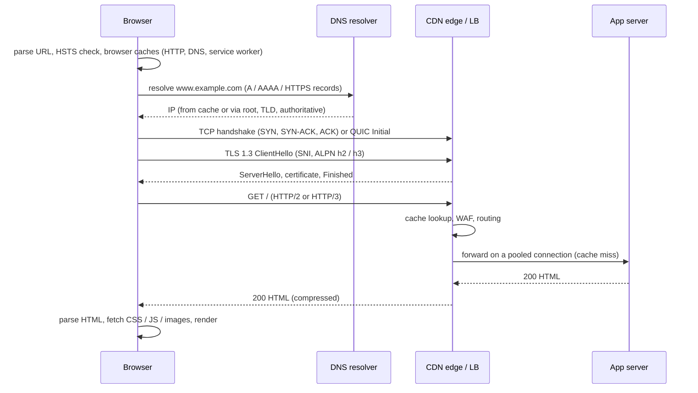

# 📘 Networking Interview Playbook

The other pages teach the material.
This page is for rehearsal: the most famous networking question answered in full, a question bank with what a strong answer contains, scenario prompts, cheat sheets, and a study plan.

## Table of Contents

1. [What Interviewers Look For](#1-what-interviewers-look-for)
2. [What Happens When You Type a URL](#2-what-happens-when-you-type-a-url)
3. [Question Bank](#3-question-bank)
4. [Scenario Questions](#4-scenario-questions)
5. [Cheat Sheets](#5-cheat-sheets)
6. [Common Mistakes](#6-common-mistakes)
7. [Study Plan](#7-study-plan)

---

## 1. What Interviewers Look For

| Level | Expected |
| --- | --- |
| **Junior / new grad** | OSI and TCP/IP layers, TCP vs UDP, handshake, DNS basics, HTTP vs HTTPS, subnet math, common ports |
| **Mid** | TLS handshake, HTTP/2 vs HTTP/3, load balancers L4 vs L7, CDN caching, WebSockets, NAT, debugging with `curl`, `dig`, `ss` |
| **Senior** | Congestion and flow control, TIME_WAIT and connection pooling, timeouts and retries across hops, MTU issues, DDoS and zero trust, cloud VPC design |
| **SRE / infra** | BGP and anycast, packet captures, kernel tuning, load balancer internals, incident narratives with numbers |

Signals that raise your rating: you quote rough numbers (RTTs, MTU, TTLs), you name the failure mode of each component, and you can say which tool you would use to prove a hypothesis.

---

## 2. What Happens When You Type a URL

The classic question.
Go layer by layer and let the interviewer choose where to dig.

Points to hit, in order:

1. **URL parsing**: scheme, host, port, path; non-URLs go to the search engine, and HSTS may upgrade `http` to `https`.
2. **Caches**: browser HTTP cache, service worker, then DNS caches (browser, OS, `/etc/hosts`).
3. **DNS**: recursive resolver, root, TLD, authoritative; TTLs; possibly an HTTPS record advertising HTTP/3; Happy Eyeballs races IPv6 and IPv4.
4. **Routing to the IP**: the OS picks a route; for off-subnet destinations it ARPs for the default gateway; NAT at the home router; ISP; BGP across autonomous systems; often anycast to the nearest CDN edge.
5. **Transport**: TCP three-way handshake (1 RTT), or QUIC which combines transport and TLS.
6. **TLS**: ClientHello with SNI and ALPN, key exchange (X25519 or post-quantum hybrid), certificate chain validation, 1 RTT in TLS 1.3.
7. **HTTP request**: method, path, headers, cookies; HTTP/2 or HTTP/3 multiplexing.
8. **Server side**: CDN cache, load balancer (L7 routing, TLS termination), reverse proxy, application, database and caches, response.
9. **Response**: status, headers (`Cache-Control`, `Set-Cookie`, `Content-Encoding`), body.
10. **Rendering**: parse HTML into the DOM, CSS into the CSSOM, execute JS, layout, paint, composite; further requests reuse the same connection.

Deep dives to have ready: DNS caching and TTLs, the TLS handshake, TCP slow start, CDN cache hits vs misses, and the critical rendering path (see [Frontend System Design](/docs/system-design/hld/frontend-system-design)).

---

## 3. Question Bank

### 3.1 Fundamentals (10)

| # | Question | Strong answer includes | Read |
| --- | --- | --- | --- |
| 1 | Explain the OSI model. | Seven layers with a protocol and device each, why layering helps | [Fundamentals](/docs/networking/networking-fundamentals) |
| 2 | OSI vs TCP/IP? | Reference vs practice, how layers map | [Fundamentals](/docs/networking/networking-fundamentals) |
| 3 | Hub vs switch vs router? | L1 repeat vs L2 MAC forwarding vs L3 IP routing | [Fundamentals](/docs/networking/networking-fundamentals) |
| 4 | MAC vs IP address? | Link-local vs end-to-end, flat vs hierarchical, MAC changes per hop | [Fundamentals](/docs/networking/networking-fundamentals) |
| 5 | What is encapsulation? | Headers per layer, frame / packet / segment | [Fundamentals](/docs/networking/networking-fundamentals) |
| 6 | Bandwidth vs latency vs throughput? | Capacity vs delay vs achieved rate, BDP | [Fundamentals](/docs/networking/networking-fundamentals) |
| 7 | What is MTU and what breaks when it is wrong? | 1500, fragmentation, PMTUD, black holes | [Fundamentals](/docs/networking/networking-fundamentals) |
| 8 | What is a VLAN? | Logical LAN on shared switches, 802.1Q tags, broadcast domains | [Fundamentals](/docs/networking/networking-fundamentals) |
| 9 | Collision domain vs broadcast domain? | Per switch port vs per VLAN, routers split broadcasts | [Fundamentals](/docs/networking/networking-fundamentals) |
| 10 | What is a socket? | OS endpoint, 5-tuple identifies a connection | [TCP, UDP, QUIC](/docs/networking/tcp-udp-and-quic) |

### 3.2 IP and Routing (10)

| # | Question | Strong answer includes | Read |
| --- | --- | --- | --- |
| 11 | Subnet 192.168.5.77/26: network, broadcast, hosts? | 192.168.5.64, .127, 62 hosts | [IP and Routing](/docs/networking/ip-addressing-and-routing) |
| 12 | Split a /24 into 8 subnets. | /27, 32 addresses, 30 hosts each | [IP and Routing](/docs/networking/ip-addressing-and-routing) |
| 13 | What are private IP ranges? | 10/8, 172.16/12, 192.168/16, why NAT | [IP and Routing](/docs/networking/ip-addressing-and-routing) |
| 14 | How does NAT work? | Port-based translation table, costs, traversal | [IP and Routing](/docs/networking/ip-addressing-and-routing) |
| 15 | IPv4 vs IPv6? | Address size, header, SLAAC, NDP, no NAT needed, dual stack | [IP and Routing](/docs/networking/ip-addressing-and-routing) |
| 16 | How does ARP work? | Broadcast request, unicast reply, cache, gateway MAC for remote IPs, spoofing | [IP and Routing](/docs/networking/ip-addressing-and-routing) |
| 17 | Explain DHCP. | DORA, lease contents, relay, snooping | [IP and Routing](/docs/networking/ip-addressing-and-routing) |
| 18 | How does a router choose a path? | Longest prefix match, TTL, next hop | [IP and Routing](/docs/networking/ip-addressing-and-routing) |
| 19 | OSPF vs BGP? | Link state inside an AS vs policy path vector between ASes, RPKI | [IP and Routing](/docs/networking/ip-addressing-and-routing) |
| 20 | What is anycast and who uses it? | Same prefix from many sites, DNS roots, CDNs, DDoS absorption | [IP and Routing](/docs/networking/ip-addressing-and-routing) |

### 3.3 Transport (12)

| # | Question | Strong answer includes | Read |
| --- | --- | --- | --- |
| 21 | TCP vs UDP, with use cases? | Guarantees vs overhead, DNS / VoIP / games / QUIC | [TCP, UDP, QUIC](/docs/networking/tcp-udp-and-quic) |
| 22 | Explain the three-way handshake. Why not two? | ISNs in both directions, old duplicate SYNs | [TCP, UDP, QUIC](/docs/networking/tcp-udp-and-quic) |
| 23 | Explain connection teardown and TIME_WAIT. | FIN each way, 2 x MSL, why, consequences | [TCP, UDP, QUIC](/docs/networking/tcp-udp-and-quic) |
| 24 | What does CLOSE_WAIT piling up mean? | App never closes sockets | [TCP, UDP, QUIC](/docs/networking/tcp-udp-and-quic) |
| 25 | How does TCP guarantee reliability? | Sequence numbers, ACKs, RTO, fast retransmit, SACK, checksum | [TCP, UDP, QUIC](/docs/networking/tcp-udp-and-quic) |
| 26 | Flow control vs congestion control? | rwnd vs cwnd, receiver vs network | [TCP, UDP, QUIC](/docs/networking/tcp-udp-and-quic) |
| 27 | Explain slow start and AIMD. | Exponential then linear, halve on loss | [TCP, UDP, QUIC](/docs/networking/tcp-udp-and-quic) |
| 28 | CUBIC vs BBR? | Loss-based vs model-based, lossy long paths | [TCP, UDP, QUIC](/docs/networking/tcp-udp-and-quic) |
| 29 | What is a SYN flood and SYN cookies? | Half-open exhaustion, stateless cookie in ISN | [TCP, UDP, QUIC](/docs/networking/tcp-udp-and-quic) |
| 30 | What is head-of-line blocking? | In-order delivery stalls later data, HTTP/1.1, HTTP/2 over TCP, QUIC fix | [TCP, UDP, QUIC](/docs/networking/tcp-udp-and-quic) |
| 31 | Why was QUIC built on UDP? | Kernel and middlebox ossification, user-space evolution | [TCP, UDP, QUIC](/docs/networking/tcp-udp-and-quic) |
| 32 | Nagle's algorithm and TCP_NODELAY? | Coalesce small writes, delayed ACK interaction, 40 ms stalls | [TCP, UDP, QUIC](/docs/networking/tcp-udp-and-quic) |

### 3.4 DNS, HTTP, TLS (10)

| # | Question | Strong answer includes | Read |
| --- | --- | --- | --- |
| 33 | Walk through DNS resolution. | Caches, recursive resolver, root / TLD / authoritative, TTL | [DNS, HTTP, TLS](/docs/networking/dns-http-and-tls) |
| 34 | A, AAAA, CNAME, MX, TXT, NS? | What each maps, CNAME apex rule | [DNS, HTTP, TLS](/docs/networking/dns-http-and-tls) |
| 35 | How do you migrate DNS with minimal downtime? | Lower TTL early, switch, verify, raise TTL, watch pinned clients | [DNS, HTTP, TLS](/docs/networking/dns-http-and-tls) |
| 36 | HTTP/1.1 vs HTTP/2 vs HTTP/3? | Keep-alive, multiplexing, HPACK, QUIC, HOL | [DNS, HTTP, TLS](/docs/networking/dns-http-and-tls) |
| 37 | HTTP vs HTTPS? | TLS adds confidentiality, integrity, authentication; port 443 | [DNS, HTTP, TLS](/docs/networking/dns-http-and-tls) |
| 38 | Explain the TLS 1.3 handshake. | ClientHello key share, ServerHello, cert, CertificateVerify, Finished, 1 RTT | [DNS, HTTP, TLS](/docs/networking/dns-http-and-tls) |
| 39 | Symmetric vs asymmetric encryption in TLS? | Asymmetric for auth and key agreement, symmetric for bulk | [DNS, HTTP, TLS](/docs/networking/dns-http-and-tls) |
| 40 | How does certificate validation work? | Chain to root, signatures, dates, SAN, revocation | [DNS, HTTP, TLS](/docs/networking/dns-http-and-tls) |
| 41 | What is forward secrecy? | Ephemeral ECDHE, past sessions safe after key leak | [DNS, HTTP, TLS](/docs/networking/dns-http-and-tls) |
| 42 | What is mTLS and where is it used? | Client certs, service mesh, zero trust | [DNS, HTTP, TLS](/docs/networking/dns-http-and-tls) |

### 3.5 Infrastructure and Security (8)

| # | Question | Strong answer includes | Read |
| --- | --- | --- | --- |
| 43 | L4 vs L7 load balancer? | Per connection vs per request, TLS, features, cost | [Infrastructure](/docs/networking/application-protocols-and-infrastructure) |
| 44 | Load balancing algorithms? | Round-robin, least connections, P2C, consistent hashing | [Infrastructure](/docs/networking/application-protocols-and-infrastructure) |
| 45 | Forward vs reverse proxy? | Acts for clients vs servers, uses, X-Forwarded-For trust | [Infrastructure](/docs/networking/application-protocols-and-infrastructure) |
| 46 | How does a CDN work? | Edges, anycast or DNS steering, cache headers, invalidation, shield | [Infrastructure](/docs/networking/application-protocols-and-infrastructure) |
| 47 | WebSockets vs SSE vs polling? | Direction, transport, scaling | [Infrastructure](/docs/networking/application-protocols-and-infrastructure) |
| 48 | Stateful vs stateless firewall? | Connection tracking, SG vs NACL | [Security](/docs/networking/network-security) |
| 49 | What is a DDoS and how do you mitigate it? | Volumetric / protocol / L7, amplification, anycast absorb, rate limit | [Security](/docs/networking/network-security) |
| 50 | What is zero trust? | Identity per request, mTLS, no implicit network trust | [Security](/docs/networking/network-security) |

---

## 4. Scenario Questions

Answer each with: clarify scope, form hypotheses, name the tool that proves each, fix, prevent.

| Scenario | Strong direction |
| --- | --- |
| "The site is slow for users in Australia only." | Measure with RUM by region; RTT math (about 200 ms to US), handshake count; CDN edge or regional deployment; TLS 1.3 and HTTP/3; cache static assets at edge |
| "Service A gets intermittent 502s from service B through an LB." | Idle timeout ordering (B's keep-alive timeout shorter than LB's), deploy draining, B crashes; check LB logs for backend reset; set server idle timeout > LB's |
| "After moving to Kubernetes, DNS lookups add 20 ms." | `ndots:5` search-domain expansion, conntrack races on UDP, CoreDNS load; use FQDNs with trailing dot, NodeLocal DNSCache |
| "Large file uploads hang, small ones work, only over the VPN." | MTU reduced by tunnel headers, ICMP blocked; test with `ping -M do`; MSS clamping |
| "We need 1 million concurrent WebSocket connections." | Per-connection memory, file descriptor limits, ephemeral ports at the LB, pub/sub backplane, graceful drain, heartbeat intervals |
| "The payment provider asks for a fixed IP allowlist." | Egress through NAT gateway with elastic IPs, or a forward proxy; watch port exhaustion; high availability of the NAT |
| "Design the network for a new three-tier app on AWS." | VPC CIDR planning, public / private / data subnets across 3 AZs, ALB, NAT per AZ, SGs by tier, VPC endpoints, flow logs |
| "A certificate expired in production at 3 AM." | Immediate renewal and deploy; root cause in the renewal automation; monitor expiry with alerts at 30 / 14 / 7 days; shorter lifetimes coming make automation mandatory |

---

## 5. Cheat Sheets

### Ports

| Port | Service | Port | Service |
| --- | --- | --- | --- |
| 20, 21 | FTP | 443 | HTTPS (TCP), HTTP/3 (UDP) |
| 22 | SSH, SFTP | 465, 587 | SMTP submission |
| 23 | Telnet | 853 | DNS over TLS |
| 25 | SMTP | 993 | IMAPS |
| 53 | DNS | 1433 | SQL Server |
| 67, 68 | DHCP | 3306 | MySQL |
| 80 | HTTP | 3389 | RDP |
| 110 | POP3 | 5432 | PostgreSQL |
| 123 | NTP | 6379 | Redis |
| 143 | IMAP | 8080 | Alternate HTTP |
| 179 | BGP | 9092 | Kafka |
| 389, 636 | LDAP, LDAPS | 27017 | MongoDB |

### Layers and devices

| Layer | Unit | Address | Device | Protocols |
| --- | --- | --- | --- | --- |
| 7 Application | Message | URL, hostname | L7 LB, proxy, WAF | HTTP, DNS, TLS, SSH |
| 4 Transport | Segment | Port | L4 LB, stateful firewall | TCP, UDP, QUIC |
| 3 Network | Packet | IP | Router | IP, ICMP, BGP, OSPF |
| 2 Data link | Frame | MAC | Switch, bridge, AP | Ethernet, Wi-Fi, ARP |
| 1 Physical | Bit | None | Hub, repeater, cable | Fiber, copper, radio |

### Subnets

| Prefix | Hosts | Block size in last octet |
| --- | --- | --- |
| /24 | 254 | 256 |
| /25 | 126 | 128 |
| /26 | 62 | 64 |
| /27 | 30 | 32 |
| /28 | 14 | 16 |
| /29 | 6 | 8 |
| /30 | 2 | 4 |

### TCP vs UDP

| | TCP | UDP |
| --- | --- | --- |
| Connection | Handshake | None |
| Reliability | ACKs, retransmit | None |
| Ordering | Yes | No |
| Boundaries | Byte stream | Datagrams |
| Congestion control | Yes | No |
| Header | 20 to 60 bytes | 8 bytes |
| Uses | HTTP/1.1 and HTTP/2, SSH, databases | DNS, VoIP, games, QUIC |

---

## 6. Common Mistakes

- Saying TLS is "at layer 6" as a fact; it sits between transport and application and does not map cleanly.
- Confusing flow control with congestion control.
- Claiming UDP is "unreliable so never use it"; QUIC and all real-time media run on it.
- Forgetting that HTTP/2 still suffers TCP head-of-line blocking.
- Thinking DNS changes "propagate"; caches expire by TTL.
- Treating NAT as a security control.
- Saying "ping fails, so the server is down".
- Blocking all ICMP.
- Using L4 load balancing for gRPC and wondering why one backend is hot.
- Not setting timeouts, or setting the client idle timeout longer than the server's.
- Opening a new connection per request under load.

---

## 7. Study Plan

| Day | Focus | Output |
| --- | --- | --- |
| 1 | [Fundamentals](/docs/networking/networking-fundamentals): layers, addresses, devices, numbers | Draw OSI from memory with a protocol per layer |
| 2 | [IP and Routing](/docs/networking/ip-addressing-and-routing): subnetting drills, NAT, ARP, DHCP | Solve 10 subnet problems by hand, check with Python |
| 3 | [TCP, UDP, QUIC](/docs/networking/tcp-udp-and-quic): handshake, teardown, reliability, congestion | Draw the state machine and the congestion sawtooth |
| 4 | [DNS, HTTP, TLS](/docs/networking/dns-http-and-tls) | Run `dig +trace` and `openssl s_client` on a real site |
| 5 | [Infrastructure](/docs/networking/application-protocols-and-infrastructure) and [Security](/docs/networking/network-security) | Explain L4 vs L7, CDN caching, DDoS layers |
| 6 | [Troubleshooting](/docs/networking/troubleshooting-and-tools) | Use curl timing and tcpdump on your own traffic |
| 7 | This page | Say "what happens when you type a URL" out loud in 5 minutes, then answer the question bank |

Related: [Operating Systems](/docs/operating-systems) for sockets, file descriptors, and epoll, and [System Design](/docs/system-design) for how these pieces combine at scale.
