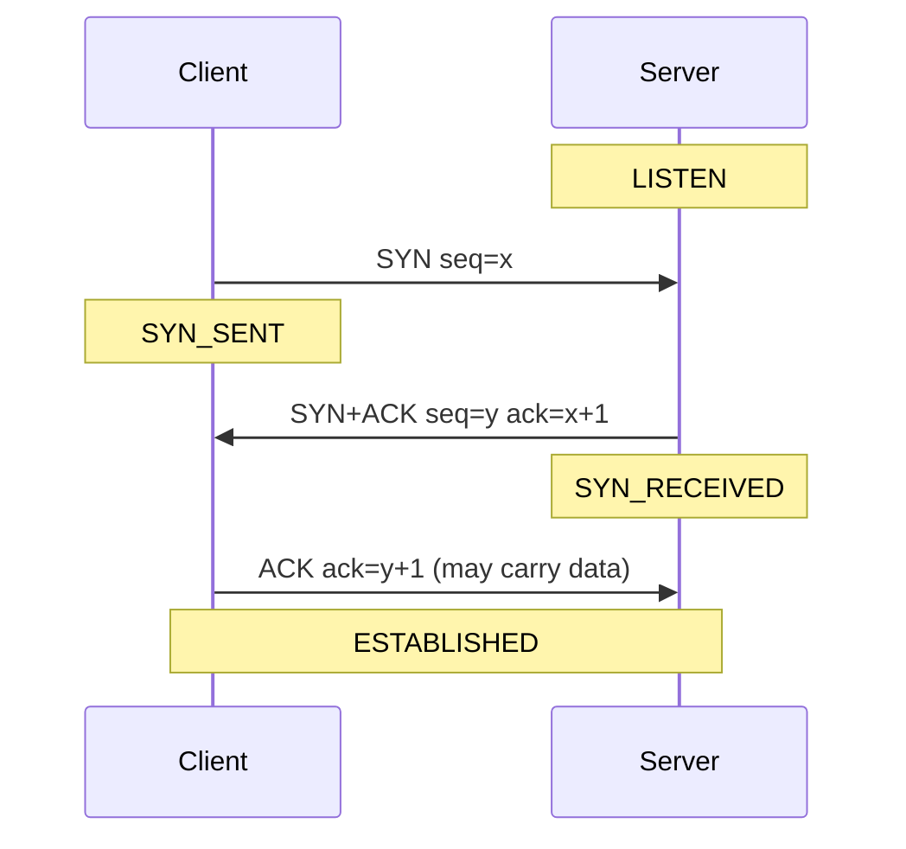
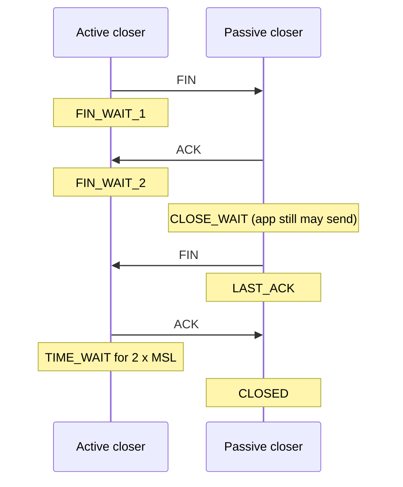
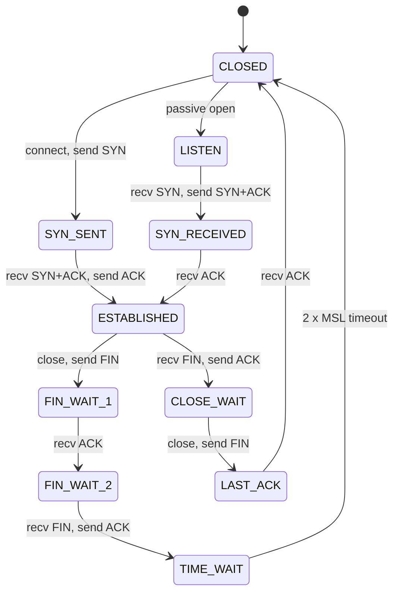
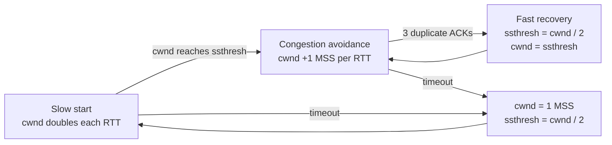
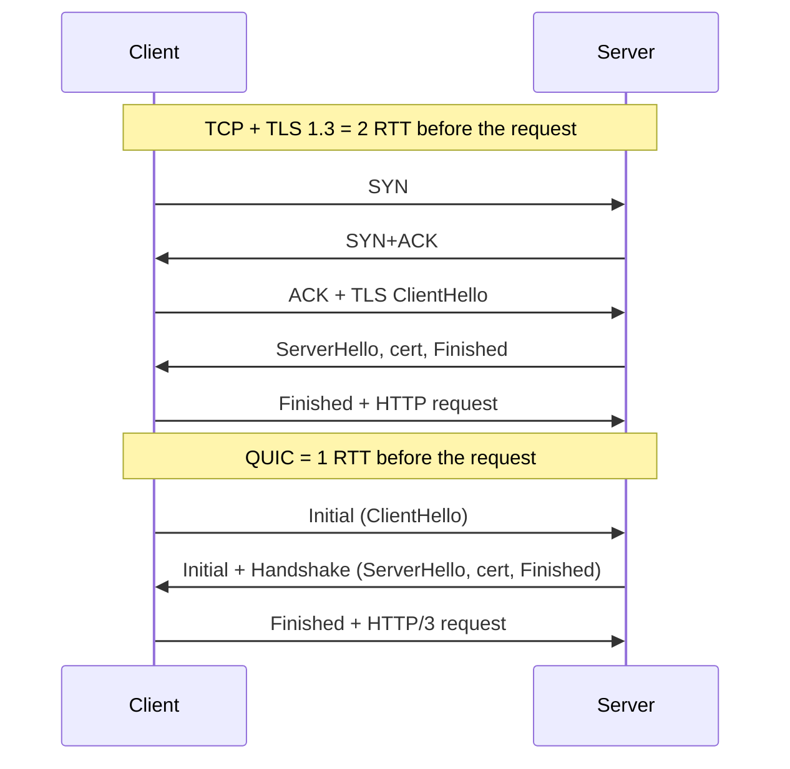

# 📘 TCP, UDP, and QUIC

The transport layer turns host-to-host packet delivery into process-to-process communication.
TCP is the most asked-about protocol in networking interviews, so this page goes deep on the handshake, reliability, flow control, and congestion control, then shows how QUIC rebuilt the same ideas on top of UDP.

## Table of Contents

1. [Sockets and Ports](#1-sockets-and-ports)
2. [UDP](#2-udp)
3. [TCP at a Glance](#3-tcp-at-a-glance)
4. [The Three-Way Handshake](#4-the-three-way-handshake)
5. [Closing a Connection and TIME_WAIT](#5-closing-a-connection-and-time_wait)
6. [The TCP State Machine](#6-the-tcp-state-machine)
7. [Reliability](#7-reliability)
8. [Flow Control](#8-flow-control)
9. [Congestion Control](#9-congestion-control)
10. [Latency Tweaks: Nagle, Delayed ACK, Keepalive](#10-latency-tweaks-nagle-delayed-ack-keepalive)
11. [Head-of-Line Blocking](#11-head-of-line-blocking)
12. [QUIC](#12-quic)
13. [Choosing a Transport](#13-choosing-a-transport)
14. [Questions](#14-questions)

---

## 1. Sockets and Ports

A **socket** is the OS handle an application uses to send and receive on the network.
The classic server flow:

```c
int fd = socket(AF_INET, SOCK_STREAM, 0);   // TCP socket
bind(fd, addr, len);                        // attach to 0.0.0.0:8080
listen(fd, backlog);                        // become a passive listener
int conn = accept(fd, ...);                 // one new socket per client connection
read(conn, buf, n); write(conn, buf, n);
close(conn);
```

The client calls `socket` then `connect`, and the kernel picks an ephemeral source port.

The kernel keeps two queues per listening socket: the **SYN queue** (half-open connections mid-handshake) and the **accept queue** (completed connections waiting for `accept`).
If the application is slow to accept, the accept queue fills and new connections are dropped or reset.
`backlog` and `net.core.somaxconn` bound it.

---

## 2. UDP

UDP adds only ports and a checksum on top of IP.

| Property | UDP |
| --- | --- |
| Connection setup | None |
| Reliability | None, packets can be lost, duplicated, reordered |
| Ordering | None |
| Message boundaries | Preserved, one send = one datagram |
| Congestion control | None built in (the application must be responsible) |
| Header | 8 bytes |

Use UDP when latency matters more than perfect delivery, or when you want to build your own reliability:
DNS, VoIP and video calls, online games, streaming telemetry, DHCP, NTP, and QUIC itself.

A lost voice packet should be skipped, not retransmitted 200 ms later.

---

## 3. TCP at a Glance

TCP provides a **reliable, ordered, full-duplex byte stream** with flow control and congestion control.

```text
 0                   1                   2                   3
|  Source port (16)             |  Destination port (16)        |
|  Sequence number (32)                                          |
|  Acknowledgment number (32)                                    |
| Offset | Rsvd | Flags (CWR ECE URG ACK PSH RST SYN FIN) | Window (16) |
|  Checksum (16)                |  Urgent pointer (16)           |
|  Options: MSS, window scale, SACK permitted, timestamps        |
```

| Flag | Meaning |
| --- | --- |
| **SYN** | Synchronize sequence numbers, open a connection |
| **ACK** | The acknowledgment number is valid |
| **FIN** | Sender has finished sending |
| **RST** | Abort the connection immediately |
| **PSH** | Push buffered data to the application |
| **ECE / CWR** | Explicit congestion notification |

TCP is a **stream**, not a sequence of messages.
Two `send` calls of 100 bytes may arrive as one `recv` of 200 bytes, or as 50 and 150.
Applications must frame messages themselves: length prefixes, delimiters, or a protocol like HTTP.

---

## 4. The Three-Way Handshake



Why three messages and not two?
Each side must pick an **initial sequence number** (ISN) and learn that the other side received it.
The client's SYN and the server's ACK of it cover one direction; the server's SYN and the client's ACK cover the other.
The middle message combines both.
Two messages would also let a delayed duplicate SYN from an old connection open a phantom connection.

ISNs are randomized to prevent attackers from guessing sequence numbers and injecting data.

Options negotiated in the SYNs: **MSS**, **window scale** (lets the 16-bit window grow to 1 GB), **SACK permitted**, and **timestamps**.

**SYN flood**: an attacker sends SYNs from spoofed addresses and never completes the handshake, filling the SYN queue.
Defense: **SYN cookies**, where the server encodes the connection state in its ISN and stores nothing until the final ACK proves the client is real.

**TCP Fast Open** lets a returning client send data in the SYN using a cookie from an earlier connection, saving one RTT, but middleboxes limit its deployment.

Cost to remember: a new HTTPS connection over TCP needs **1 RTT for TCP + 1 RTT for TLS 1.3** before the first request byte, which is why connection reuse matters so much.

---

## 5. Closing a Connection and TIME_WAIT

TCP is full duplex, so each direction closes independently with a FIN.



The side that closes first enters **TIME_WAIT** for twice the maximum segment lifetime (60 seconds on Linux).
It exists for two reasons:

1. If the final ACK is lost, the peer retransmits its FIN and the closer must still be around to ACK it.
2. Delayed packets from the old connection must expire before the same 4-tuple is reused.

Practical consequences:

| Symptom | Cause | Fix |
| --- | --- | --- |
| Thousands of `TIME_WAIT` sockets on a client or proxy | Opening a new connection per request | **Reuse connections** (keep-alive, pooling); `net.ipv4.tcp_tw_reuse` for outbound |
| Many `CLOSE_WAIT` sockets | Your application received FIN but never called `close` | Application bug: leaked sockets, fix the code |
| "Address already in use" on restart | Old socket in TIME_WAIT on the listening port | `SO_REUSEADDR` |
| Ephemeral port exhaustion | High rate of short connections to one destination | Pooling, more source IPs, wider port range |

**RST** aborts without the FIN dance: sent for a connection that does not exist, a closed port, or when an application closes a socket with unread data.
"Connection reset by peer" means you received an RST.

---

## 6. The TCP State Machine



See the states live with `ss -tan` on Linux or `netstat -an` on macOS.

---

## 7. Reliability

TCP numbers every **byte**, not every segment.
The acknowledgment number is **cumulative**: "I have everything up to byte N - 1, send N next".

| Mechanism | What it does |
| --- | --- |
| **Sequence numbers** | Detect loss, duplicates, and reordering; reassemble in order |
| **Checksum** | Detect corruption (weak, 16-bit; TLS and link CRCs catch the rest) |
| **Retransmission timeout** (RTO) | Resend if no ACK arrives in time; RTO is computed from smoothed RTT and its variance, minimum 200 ms on Linux, doubling on each retry |
| **Fast retransmit** | Three duplicate ACKs mean a segment was probably lost; resend without waiting for the timer |
| **SACK** (selective ACK) | Receiver reports the ranges it has, so the sender only resends the holes |
| **Sliding window** | Many segments in flight before any ACK, instead of stop-and-wait |

Sliding window protocols from textbooks:

| Protocol | Sender window | Receiver | On loss |
| --- | --- | --- | --- |
| **Stop-and-wait** | 1 | In order | Resend the one packet |
| **Go-Back-N** | N | Discards out-of-order | Resend from the lost packet onwards |
| **Selective Repeat** | N | Buffers out-of-order | Resend only the lost packet |

TCP is a hybrid: cumulative ACKs like Go-Back-N, but with SACK it behaves like Selective Repeat.

---

## 8. Flow Control

**Flow control protects the receiver.**
Each ACK carries a **receive window** (`rwnd`): how many more bytes the receiver's buffer can take.
The sender never has more unacknowledged data than `rwnd`.

If the receiver's buffer fills, it advertises a **zero window** and the sender stops, periodically sending **window probes**.
A slow consumer therefore slows the producer down automatically, which is TCP's built-in backpressure.

The 16-bit window field caps at 64 KB, so the **window scale** option multiplies it (up to 2^14), allowing windows of about 1 GB for high bandwidth-delay paths.

---

## 9. Congestion Control

**Congestion control protects the network.**
The sender keeps a **congestion window** (`cwnd`) and may have at most `min(cwnd, rwnd)` bytes in flight.



| Phase | Behavior |
| --- | --- |
| **Slow start** | Start at an initial window (10 segments on modern stacks) and double every RTT; exponential, despite the name |
| **Congestion avoidance** | Add about one segment per RTT: **additive increase** |
| **On loss (3 dup ACKs)** | Halve the window: **multiplicative decrease** (AIMD) |
| **On timeout** | Collapse to 1 segment and slow start again |

| Algorithm | Signal | Notes |
| --- | --- | --- |
| **Reno / NewReno** | Loss | The textbook AIMD sawtooth |
| **CUBIC** | Loss | Window grows as a cubic function of time since the last loss; default on Linux, Windows, and macOS |
| **BBR** (v1, v2, v3) | Measured bottleneck bandwidth and minimum RTT | Model-based, does not wait for loss; used by Google and YouTube, good on lossy long paths |
| **DCTCP** | ECN marks | For data centers, keeps queues very short |

**ECN** (explicit congestion notification) lets routers mark packets instead of dropping them, so senders slow down without losing data.

Why this matters in practice:

- A fresh connection starts slow, so **reusing warm connections** is faster than opening new ones.
- Loss on the path (Wi-Fi, mobile) makes loss-based algorithms back off even when the link is not congested, which is one reason BBR exists.
- Flow control and congestion control are different things, and interviewers love that distinction.

---

## 10. Latency Tweaks: Nagle, Delayed ACK, Keepalive

| Mechanism | What it does | Gotcha |
| --- | --- | --- |
| **Nagle's algorithm** | Buffer small writes until the previous data is ACKed, to avoid floods of tiny packets | Adds latency for interactive protocols |
| **Delayed ACK** | Receiver waits up to about 40 ms (Linux) to ACK, hoping to piggyback on a response | Combined with Nagle, a write-write-read pattern can stall about 40 ms per request |
| **`TCP_NODELAY`** | Disable Nagle | Set it for RPC, games, databases; most HTTP clients and servers already do |
| **`TCP_CORK`** / `MSG_MORE` | Hold data until you have a full packet | Use for bulk sends of header + file |
| **TCP keepalive** | Probe an idle connection (Linux default: after 2 hours) | Too slow to detect dead peers for most apps; use application heartbeats or tune `tcp_keepalive_time` |

NAT gateways and load balancers drop idle connections after their own timeout (AWS NLB is 350 seconds by default), so long-lived idle connections need keepalives shorter than that.

---

## 11. Head-of-Line Blocking

Because TCP delivers bytes strictly in order, one lost segment blocks everything behind it until the retransmission arrives, even data belonging to unrelated requests.

| Layer | HOL blocking | Fix |
| --- | --- | --- |
| HTTP/1.1 | One request at a time per connection | Browsers open 6 connections per origin |
| HTTP/2 | Solved at the HTTP layer with multiplexed streams | But one lost TCP packet still stalls **all** streams |
| HTTP/3 over QUIC | Streams are independent at the transport layer | Loss only stalls the affected stream |

---

## 12. QUIC

**QUIC** (RFC 9000, 2021) is a transport protocol built on UDP, with TLS 1.3 built in.
HTTP/3 runs on it, and a large share of web traffic from browsers to big providers now uses it.

| Feature | Benefit |
| --- | --- |
| **Combined transport and crypto handshake** | 1 RTT for a new connection instead of 2 (TCP + TLS) |
| **0-RTT resumption** | Send data in the first flight to a known server (replayable, so only for idempotent requests) |
| **Independent streams** | No transport-level head-of-line blocking |
| **Connection IDs** | Connection survives IP changes, such as Wi-Fi to cellular (**connection migration**) |
| **Encrypted headers** | Middleboxes cannot inspect or ossify the protocol; only a few bits are visible |
| **User-space implementation** | Congestion control and features evolve with app releases, not OS kernels |
| **Better loss recovery** | Packet numbers never repeat, so retransmissions are unambiguous |



Costs: UDP is sometimes blocked or rate limited by enterprise firewalls (clients fall back to TCP), user-space processing uses more CPU than kernel TCP with its offloads, and debugging requires keys because packets are encrypted.

---

## 13. Choosing a Transport

| Need | Choose |
| --- | --- |
| Reliable ordered stream, universal support | TCP |
| Web traffic to browsers with mobile users | HTTP/3 over QUIC, with TCP fallback |
| Real-time media where stale data is useless | UDP (RTP / WebRTC) |
| Tiny request-response (DNS lookups) | UDP, with TCP fallback for large answers |
| Game state updates | UDP with custom reliability for important messages |
| Internal RPC between services | TCP with HTTP/2 (gRPC), pooled connections |
| Many independent streams over lossy links | QUIC |

---

## 14. Questions

| Question | Short answer |
| --- | --- |
| TCP vs UDP? | Reliable ordered stream with connection setup and congestion control vs best-effort datagrams with 8-byte header |
| Why a three-way handshake? | Both sides must exchange and confirm ISNs; protects against old duplicate SYNs |
| What is TIME_WAIT and why? | Active closer waits 2 x MSL to ACK a retransmitted FIN and let old packets die |
| Many CLOSE_WAIT sockets? | Your app is not closing sockets after the peer closed |
| Flow control vs congestion control? | Receiver's buffer (`rwnd`) vs network capacity (`cwnd`) |
| Explain slow start. | cwnd starts small and doubles per RTT until ssthresh or loss |
| What is AIMD? | Additive increase, multiplicative decrease; converges to fair sharing |
| What does SACK solve? | Resending only the missing ranges instead of everything after a loss |
| Why can TCP hurt HTTP/2? | One lost packet blocks all multiplexed streams |
| What does QUIC improve? | 1-RTT setup, 0-RTT resume, no transport HOL, connection migration, encryption by default |
| Is TCP message oriented? | No, it is a byte stream; frame messages yourself |
| Nagle plus delayed ACK problem? | Small writes wait for an ACK the receiver is delaying, about 40 ms stalls; set `TCP_NODELAY` |

Next: [DNS, HTTP, and TLS](/docs/networking/dns-http-and-tls).
