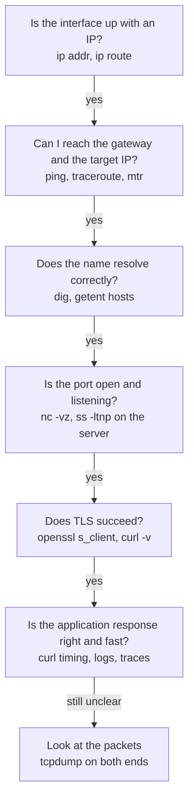

# 📘 Troubleshooting and Tools

Knowing the protocols is half the job; the other half is finding which one is broken.
This page gives a repeatable method and the commands for each layer, then maps common symptoms to causes.
Commands are shown for Linux, with macOS equivalents where they differ.

## Table of Contents

1. [A Method](#1-a-method)
2. [Interfaces and Routes](#2-interfaces-and-routes)
3. [Reachability: ping, traceroute, mtr](#3-reachability-ping-traceroute-mtr)
4. [DNS: dig](#4-dns-dig)
5. [Ports and Sockets: ss, lsof, nc](#5-ports-and-sockets-ss-lsof-nc)
6. [HTTP: curl](#6-http-curl)
7. [TLS: openssl](#7-tls-openssl)
8. [Packets: tcpdump and Wireshark](#8-packets-tcpdump-and-wireshark)
9. [Throughput: iperf3](#9-throughput-iperf3)
10. [Symptom to Cause](#10-symptom-to-cause)
11. [Worked Incident](#11-worked-incident)

---

## 1. A Method

Work up the stack from the bottom, and change one thing at a time.



Questions that narrow things fast:

- Is it everyone or one client? One region or all?
- By name or by IP too? (DNS vs everything else)
- Did anything change: deploy, config, certificate, DNS, security group?
- Is it a clean failure (refused, NXDOMAIN) or a hang (timeout)? Hangs usually mean something silently drops packets: a firewall, a security group, an MTU problem.

---

## 2. Interfaces and Routes

```bash
ip addr                        # interfaces and addresses (macOS: ifconfig)
ip route                       # routing table (macOS: netstat -rn)
ip route get 8.8.8.8           # which route and source IP a destination would use
ip neigh                       # ARP / NDP cache (macOS: arp -a)
cat /etc/resolv.conf           # DNS servers and search domains
resolvectl status              # systemd-resolved view
```

---

## 3. Reachability: ping, traceroute, mtr

```bash
ping -c 4 1.1.1.1
ping -M do -s 1472 host        # test for 1500 MTU without fragmentation (macOS: ping -D -s 1472)
traceroute -n example.com      # hop list; -T for TCP, -I for ICMP
mtr -rwc 100 example.com       # continuous traceroute with per-hop loss and latency
```

Reading the output:

- `ping` failing does not prove the host is down; ICMP is often blocked, so test the real port with `nc` or `curl`.
- `* * *` on a middle hop is normal: many routers rate limit or do not answer ICMP.
- Loss at a middle hop that **does not continue** to later hops is just ICMP deprioritization, not real loss.
- Loss or a latency jump that **persists to the destination** starting at a hop points at that link.
- 1472 bytes of payload + 8 ICMP + 20 IP = 1500; if that fails and smaller sizes work, you have an MTU problem.

---

## 4. DNS: dig

```bash
dig example.com                     # A record via the configured resolver
dig +short example.com AAAA
dig @1.1.1.1 example.com            # ask a specific resolver
dig @ns1.provider.net example.com   # ask the authoritative server directly (bypasses caches)
dig +trace example.com              # walk from the root, shows each delegation
dig -x 93.184.215.14                # reverse lookup
dig example.com MX +noall +answer
getent hosts example.com            # what the OS resolver actually returns (includes /etc/hosts)
```

Look at the `status:` (`NOERROR`, `NXDOMAIN`, `SERVFAIL`), the TTL in the answer, and the `SERVER:` line to know who answered.
`SERVFAIL` often means a DNSSEC validation failure or a broken authoritative server.

If `dig` works but the application fails, the application may be using a different resolver, `/etc/hosts`, a stale in-process cache, or a search domain.

---

## 5. Ports and Sockets: ss, lsof, nc

```bash
ss -ltnp                           # listening TCP sockets with process (macOS: lsof -iTCP -sTCP:LISTEN -n -P)
ss -tan state established | wc -l  # count established connections
ss -tan | awk '{print $1}' | sort | uniq -c   # connections per state (TIME-WAIT, CLOSE-WAIT...)
ss -ti dst 10.0.0.5                # per-connection TCP internals: rtt, cwnd, retrans
lsof -i :8080                      # who holds port 8080
nc -vz db.internal 5432            # can I open a TCP connection? (-u for UDP)
```

Interpreting a failed connect:

| Result | Meaning |
| --- | --- |
| `Connection refused` | Packet reached the host, nothing listening on that port (RST returned) |
| Timeout | Packets dropped: firewall, security group, wrong route, host down |
| `No route to host` | ICMP unreachable came back, or no route locally |
| Listening on `127.0.0.1:8080` only | Service is bound to loopback; bind `0.0.0.0` to accept remote connections (a classic Docker mistake) |

---

## 6. HTTP: curl

```bash
curl -v https://api.example.com/health            # request and response headers, TLS info
curl -sS -o /dev/null -w '%{http_code}\n' URL      # just the status
curl --resolve api.example.com:443:10.0.0.7 https://api.example.com/   # force an IP, keep SNI and Host
curl --http3 -I https://example.com                 # try HTTP/3 (needs a curl built with it)
curl -H 'Host: app.local' http://10.0.0.7/          # hit a vhost by IP
```

Timing breakdown, the single most useful curl trick:

```bash
curl -sS -o /dev/null -w '
dns:      %{time_namelookup}
connect:  %{time_connect}
tls:      %{time_appconnect}
ttfb:     %{time_starttransfer}
total:    %{time_total}
' https://example.com
```

Each value is cumulative from the start.

| Large gap between | Suspect |
| --- | --- |
| start and `dns` | Slow or failing resolver, search-domain retries |
| `dns` and `connect` | Network latency, SYN retries (packet loss or a filtered port) |
| `connect` and `tls` | TLS handshake: far server, OCSP, slow crypto |
| `tls` and `ttfb` | The server itself: application, database, upstream calls |
| `ttfb` and `total` | Large body or slow throughput |

A connect time of almost exactly 1 or 3 seconds (or doubling values) is the signature of SYN retransmissions, meaning packets are being lost.

---

## 7. TLS: openssl

```bash
openssl s_client -connect example.com:443 -servername example.com </dev/null
openssl s_client -connect example.com:443 -servername example.com </dev/null 2>/dev/null \
  | openssl x509 -noout -subject -issuer -dates -ext subjectAltName
openssl s_client -connect example.com:443 -tls1_2      # does TLS 1.2 work?
```

Check `Verify return code: 0 (ok)`, the certificate chain depth, the SAN list, and `notAfter`.
Always pass `-servername` or you may get the default certificate for the IP instead of the one you wanted.

---

## 8. Packets: tcpdump and Wireshark

```bash
sudo tcpdump -i any -nn port 443                    # all 443 traffic
sudo tcpdump -i eth0 -nn host 10.0.0.5 and tcp port 5432
sudo tcpdump -i any -nn 'tcp[tcpflags] & (tcp-syn|tcp-rst) != 0'   # only SYNs and RSTs
sudo tcpdump -i any -nn -w capture.pcap port 53     # save for Wireshark
```

What to look for:

| Pattern | Meaning |
| --- | --- |
| SYN, SYN, SYN with no reply | Something drops traffic on the way in or out |
| SYN then RST | Port closed, or a firewall rejects |
| Handshake OK, then large packets retransmitted forever | MTU black hole |
| Many retransmissions and duplicate ACKs | Packet loss on the path |
| Zero window advertisements | Receiver application not reading fast enough |
| RST from a middlebox after idle time | NAT or LB idle timeout expired |

Capture on **both ends** when you can: if the client sends a packet that the server never sees, the problem is in between.
In Wireshark, filters like `tcp.analysis.retransmission`, `tcp.flags.reset == 1`, and "Follow TCP Stream" save hours.
To decrypt TLS in Wireshark, set `SSLKEYLOGFILE` in the client (browsers and curl support it) and load the key log.

---

## 9. Throughput: iperf3

```bash
iperf3 -s                         # on the server
iperf3 -c server -t 10            # TCP throughput test
iperf3 -c server -P 8             # 8 parallel streams
iperf3 -c server -u -b 500M       # UDP at 500 Mbps, reports loss and jitter
```

If one stream is slow but eight streams fill the link, the limit is per-connection (window size, bandwidth-delay product, or loss), not the link.

---

## 10. Symptom to Cause

| Symptom | Likely causes | First check |
| --- | --- | --- |
| Works by IP, fails by name | DNS | `dig`, `/etc/resolv.conf`, search domains |
| Works on one network, not another | Firewall, proxy, MTU, DNS differences, IPv6 path | Compare `curl -v` and `traceroute` from both |
| Connection timeout | Security group, firewall, NACL, wrong route, host down | `nc -vz`, flow logs, `tcpdump` on target |
| Connection refused | Nothing listening, wrong port, bound to localhost | `ss -ltnp` on the server |
| Connection reset mid-request | Idle timeout mismatch, server crash, proxy limits, RST injection | Timeouts in each hop, server logs |
| 502 Bad Gateway | Proxy could not get a valid response: backend down, crashed, closed keep-alive connection | Backend health, idle timeout ordering |
| 503 Service Unavailable | No healthy backends, overload, rate limiting | LB target health, capacity |
| 504 Gateway Timeout | Backend too slow for the proxy's timeout | Backend latency, proxy timeout |
| Small requests work, large ones hang | MTU / PMTUD black hole | `ping -M do -s 1472`, MSS clamping |
| Slow first request, fast after | DNS, TCP + TLS handshakes, cold caches, JIT | curl timing, connection reuse |
| Intermittent slowness every few seconds | Packet loss causing retransmission, GC pauses, noisy neighbor | `mtr`, `ss -ti` retrans counts |
| Certificate errors on some clients | Missing intermediate, old client trust store, clock skew | `openssl s_client`, check client date |
| Only IPv6 users broken | IPv6 route or firewall missing | `curl -6`, `ping6` |
| Everything slow after a VPN connects | Full tunnel routing, MTU reduction, DNS through VPN | `ip route`, MTU tests |

---

## 11. Worked Incident

**Report:** "Checkout calls to the payment provider fail with timeouts, but only for about 5 percent of requests, starting after a traffic spike."

1. **Scope**: all app servers, one destination, started with load, which suggests a resource limit rather than a network outage.
2. **Timing**: `curl -w` from an app server shows `connect` sometimes takes about 1 or 3 seconds, which is SYN retransmission.
3. **Sockets**: `ss -tan | awk '{print $1}' | sort | uniq -c` shows about 28,000 connections in `TIME-WAIT` to the provider.
4. **Cause**: the HTTP client was creating a new connection per request, and all traffic leaves through one NAT gateway IP. Each destination IP and port tuple can only hold about 64K ports through one NAT address, and the NAT gateway was dropping new connections when mappings for that destination ran out.
5. **Fix**: enable a shared connection pool with keep-alive (connections dropped from thousands per second to a few hundred reused ones), and add a second NAT IP for headroom.
6. **Follow-up**: alert on NAT gateway port allocation errors and on `TIME-WAIT` counts; add a load test that exercises outbound calls.

The lesson generalizes: most "network" incidents are really connection management incidents.

Next: [Networking Interview Playbook](/docs/networking/networking-interview-playbook).
