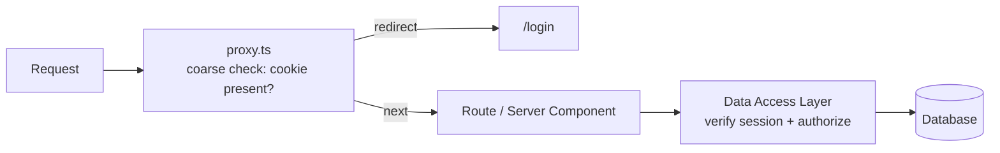
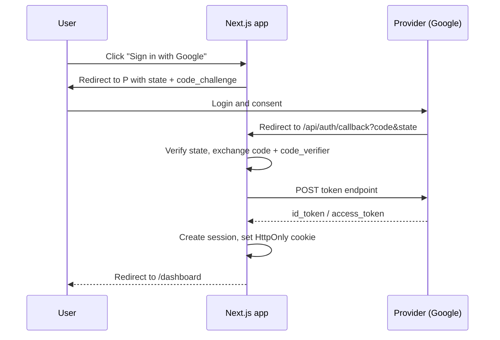

# 📘 Auth, Security, and Proxy

Next.js blurs the line between front end and back end, which makes it easy to put a check in the wrong place.
The core idea of this page: **authenticate and authorize as close to the data as possible**, and treat the proxy as a coarse early filter, not the security boundary.

## Table of Contents

1. [Authentication vs Authorization](#1-authentication-vs-authorization)
2. [proxy.ts (Formerly Middleware)](#2-proxyts-formerly-middleware)
3. [Sessions: Cookies vs JWTs](#3-sessions-cookies-vs-jwts)
4. [Implementing Sessions](#4-implementing-sessions)
5. [The Data Access Layer](#5-the-data-access-layer)
6. [Where to Check Auth](#6-where-to-check-auth)
7. [Auth Libraries and OAuth](#7-auth-libraries-and-oauth)
8. [CSRF, XSS, and Cookies](#8-csrf-xss-and-cookies)
9. [Security Headers and CSP](#9-security-headers-and-csp)
10. [Secrets and Server-only Code](#10-secrets-and-server-only-code)
11. [Rate Limiting and Abuse](#11-rate-limiting-and-abuse)
12. [Production Checklist](#12-production-checklist)
13. [Questions](#13-questions)

---

## 1. Authentication vs Authorization

| | Authentication (authn) | Authorization (authz) |
| --- | --- | --- |
| Question | Who are you? | What may you do? |
| Examples | Password, OAuth, passkey, magic link | Roles, ownership, permissions, tenant membership |
| Failure response | `401 Unauthorized` | `403 Forbidden` |
| Where | Login flow, session verification | Every read and write of protected data |

Three layers to cover:

1. **Sign in**: verify credentials and create a session.
2. **Session management**: store, verify, rotate, and destroy the session.
3. **Authorization**: check the session against the specific resource, on every request.

---

## 2. proxy.ts (Formerly Middleware)

`proxy.ts` (renamed from `middleware.ts` in current versions) runs **before a request completes**, ahead of routing and rendering.
It sits at the project root (or `src/`) and runs on the **Node.js runtime**.
`middleware.ts` is deprecated; a codemod renames it.

```ts
// proxy.ts
import { NextResponse, type NextRequest } from 'next/server';

export function proxy(request: NextRequest) {
  const hasSession = request.cookies.has('session');
  const { pathname } = request.nextUrl;

  if (pathname.startsWith('/dashboard') && !hasSession) {
    const url = new URL('/login', request.url);
    url.searchParams.set('next', pathname);
    return NextResponse.redirect(url);
  }
  return NextResponse.next();
}

export const config = {
  matcher: ['/((?!api|_next/static|_next/image|favicon.ico|.*\\.(?:png|jpg|svg)$).*)'],
};
```

What it is good for:

| Good use | Why |
| --- | --- |
| Optimistic redirect of anonymous users to `/login` | Cheap, early, avoids rendering the page |
| Locale detection and redirects | Runs before routing |
| A/B test bucketing, feature-flag cookies | Set cookie and rewrite |
| Rewrites for multi-tenant subdomains | `acme.app.com` to `/tenants/acme` |
| Adding headers (CSP nonce, request id) | Applies to every matched request |
| Bot or geo blocking | Quick rejections |

What it is **not**:

- **Not your only auth check.**
  A proxy matcher can miss routes (for example Server Action POSTs to a page URL, or routes added later), and a vulnerability in a single layer must not expose data.
  A real incident class (CVE-2025-29927) bypassed middleware auth by spoofing an internal header; apps relying only on middleware were exposed.
- **Not for heavy work**: it runs on every matched request, including prefetches, so no slow database queries or large dependencies.
- **Not a place for data fetching** or business logic.
- It can read and set cookies and headers and rewrite or redirect, but does not render React.



The matcher matters: exclude static assets and images, include API routes if you want them covered, and remember it runs on prefetch requests too.

---

## 3. Sessions: Cookies vs JWTs

| | Server-side session (opaque id in cookie) | Stateless JWT in cookie |
| --- | --- | --- |
| Cookie holds | Random session id | Signed (and optionally encrypted) claims |
| Server state | Session store (DB / Redis) | None |
| Revocation | Immediate (delete the row) | Hard until expiry (need deny-list) |
| Per-request cost | Store lookup | Signature check only |
| Size | Tiny | Grows with claims |
| Best for | Most apps, sensitive systems, instant logout | Simple apps, edge verification, short-lived access tokens |

Guidance:

- Prefer **server-side sessions** (or short-lived JWT plus refresh token rotation) for anything sensitive; revocation and "log out everywhere" are easy with a store.
- Use stateless tokens when you need to verify without a database round trip (edge, third-party APIs).
- Never put sensitive data in a JWT payload without encryption; it is only base64-encoded.
- Always use **`HttpOnly`, `Secure`, `SameSite=Lax` (or `Strict`)** cookies, a sensible `Path`, and a bounded `maxAge`.
  Do not store tokens in `localStorage`: any XSS can read it.

| Cookie flag | Effect |
| --- | --- |
| `HttpOnly` | JavaScript cannot read it, blocks theft via XSS |
| `Secure` | Sent only over HTTPS |
| `SameSite=Lax` | Not sent on cross-site subrequests (blocks most CSRF), sent on top-level GET navigations |
| `SameSite=Strict` | Never sent cross-site (can break returning from external links) |
| `__Host-` prefix | Forces `Secure`, `Path=/`, no `Domain`; strongest binding |

---

## 4. Implementing Sessions

A minimal stateless session with `jose` (signed JWT in an HttpOnly cookie):

```ts
// lib/session.ts
import 'server-only';
import { SignJWT, jwtVerify } from 'jose';
import { cookies } from 'next/headers';

const key = new TextEncoder().encode(process.env.SESSION_SECRET);

export async function createSession(userId: string, role: string) {
  const expiresAt = new Date(Date.now() + 7 * 24 * 60 * 60 * 1000);
  const token = await new SignJWT({ userId, role })
    .setProtectedHeader({ alg: 'HS256' })
    .setExpirationTime(expiresAt)
    .sign(key);

  (await cookies()).set('session', token, {
    httpOnly: true,
    secure: true,
    sameSite: 'lax',
    expires: expiresAt,
    path: '/',
  });
}

export async function readSession() {
  const token = (await cookies()).get('session')?.value;
  if (!token) return null;
  try {
    const { payload } = await jwtVerify(token, key, { algorithms: ['HS256'] });
    return payload as { userId: string; role: string };
  } catch {
    return null;
  }
}

export async function deleteSession() {
  (await cookies()).delete('session');
}
```

Login action:

```ts
'use server';
export async function login(prev: unknown, formData: FormData) {
  const parsed = LoginSchema.safeParse(Object.fromEntries(formData));
  if (!parsed.success) return { error: 'Invalid input' };

  const user = await db.user.findUnique({ where: { email: parsed.data.email } });
  const ok = user && (await verifyPassword(parsed.data.password, user.passwordHash)); // argon2 / bcrypt
  if (!ok) return { error: 'Invalid email or password' };      // same message either way

  await createSession(user.id, user.role);
  redirect('/dashboard');
}
```

Hardening notes:

- Hash passwords with **Argon2id** or **bcrypt/scrypt**; never a fast hash. Never log passwords.
- Return the same error for unknown email and wrong password to avoid account enumeration.
- Rotate the session on login and privilege change (prevents session fixation).
- Add rate limiting and lockout/backoff on login.
- For database sessions, store a random 128-bit+ id, hash it at rest, and keep `expiresAt`, user agent, and IP metadata for session management UIs.

---

## 5. The Data Access Layer

The **Data Access Layer (DAL)** is a server-only module through which all protected data is read.
Each function verifies the session and authorizes before touching the database, and returns **DTOs** (only the fields the caller may see).

```ts
// lib/dal.ts
import 'server-only';
import { cache } from 'react';
import { redirect } from 'next/navigation';
import { readSession } from '@/lib/session';

export const verifySession = cache(async () => {
  const session = await readSession();
  if (!session) redirect('/login');
  return session;                        // deduped within one request
});

export const getCurrentUser = cache(async () => {
  const { userId } = await verifySession();
  const user = await db.user.findUnique({ where: { id: userId } });
  return user && { id: user.id, name: user.name, email: user.email };   // DTO: no passwordHash
});

export async function getInvoice(id: string) {
  const { userId, role } = await verifySession();
  const invoice = await db.invoice.findUnique({ where: { id } });
  if (!invoice) return null;
  if (invoice.ownerId !== userId && role !== 'admin') return null;     // authorization on the resource
  return { id: invoice.id, total: invoice.total, status: invoice.status };
}
```

Why this pattern:

- **One place** to audit security instead of auth checks sprinkled across components.
- It makes it hard to forget: components call `getInvoice`, never `db.invoice` directly.
- `server-only` guarantees it can never be bundled into client code.
- DTOs prevent leaking sensitive columns into the RSC payload.
- `cache()` dedupes `verifySession` so calling it from many components costs one lookup per request.

---

## 6. Where to Check Auth

| Location | Check? | Why |
| --- | --- | --- |
| `proxy.ts` | Coarse: cookie present, redirect early | Fast UX; **not** a security boundary |
| Layout | **Do not rely on it** | Layouts do not re-render on navigation between children, so a check there can be skipped; and partial rendering means a page can render independently |
| Page / Server Component | Yes, via the DAL | Close to rendering the data |
| **DAL functions** | **Yes, always** | The real boundary, every data access |
| Server Actions | **Yes, always** | They are public POST endpoints |
| Route Handlers | **Yes, always** | Public HTTP endpoints |
| Client Components | UX only (hide buttons) | Never security |

Role-based UI pattern:

```tsx
export default async function AdminPage() {
  const user = await getCurrentUser();
  if (user?.role !== 'admin') forbidden();       // renders forbidden.tsx with 403
  return <AdminPanel />;
}
```

Common authorization models: **RBAC** (roles), **ABAC** (attributes), **ownership checks**, **multi-tenant scoping** (always include `tenantId` in queries; use database row-level security as a backstop).

Fail closed: if the session cannot be verified or the resource cannot be matched, deny.

---

## 7. Auth Libraries and OAuth

| Option | Notes |
| --- | --- |
| **Auth.js (NextAuth v5)** | Providers (Google, GitHub), adapters, session strategies, works with App Router; widely used |
| **Better Auth** | Framework-agnostic TypeScript auth with plugins (2FA, orgs, passkeys) |
| **Clerk / Auth0 / WorkOS / Supabase Auth** | Hosted identity, fastest to ship, vendor lock-in and cost |
| **Hand-rolled with `jose` + DB** | Full control; you own the security details |
| **Passkeys / WebAuthn** | Phishing-resistant; SimpleWebAuthn or provider support |

Rule: do not invent crypto or session protocols; use a maintained library or a hosted provider unless you have a reason.

OAuth / OIDC authorization code flow with PKCE:



- `state` prevents CSRF on the callback, PKCE protects the code exchange.
- Validate the `id_token` signature, `iss`, `aud`, `exp`, and `nonce`.
- Link accounts by **verified** email only, to avoid account takeover.
- Keep refresh tokens server-side, encrypted at rest.

---

## 8. CSRF, XSS, and Cookies

**CSRF** (cross-site request forgery): another site makes the user's browser send an authenticated request to yours.

| Defense | Detail |
| --- | --- |
| `SameSite=Lax` cookies | Default in browsers; blocks cross-site POSTs carrying the cookie |
| Server Actions | POST only, and Next.js compares `Origin` with `Host`/`X-Forwarded-Host`, rejecting mismatches |
| `serverActions.allowedOrigins` | Needed when a reverse proxy or multiple domains legitimately differ |
| CSRF tokens | For Route Handlers that accept cookie-authenticated state changes from forms |
| Do not mutate on GET | Safe methods must be side-effect free |

**XSS** (cross-site scripting): attacker script runs in your page.

- React escapes interpolated values by default.
- Danger zones: `dangerouslySetInnerHTML`, `href={userInput}` (`javascript:` URLs), HTML in markdown, third-party scripts, `eval`.
- Sanitize untrusted HTML with a vetted library (DOMPurify via `isomorphic-dompurify`), allowlist URL schemes.
- `HttpOnly` cookies limit damage, **CSP** limits injected script execution.

**Other injection**: use parameterized queries or an ORM (SQL injection), validate and constrain file paths (path traversal), validate outbound URLs and block internal IP ranges (SSRF when the server fetches user-supplied URLs).

---

## 9. Security Headers and CSP

```ts
// next.config.ts
const securityHeaders = [
  { key: 'Strict-Transport-Security', value: 'max-age=63072000; includeSubDomains; preload' },
  { key: 'X-Content-Type-Options', value: 'nosniff' },
  { key: 'Referrer-Policy', value: 'strict-origin-when-cross-origin' },
  { key: 'X-Frame-Options', value: 'DENY' },
  { key: 'Permissions-Policy', value: 'camera=(), microphone=(), geolocation=()' },
];

const nextConfig: NextConfig = {
  async headers() {
    return [{ source: '/:path*', headers: securityHeaders }];
  },
};
```

| Header | Protects against |
| --- | --- |
| `Content-Security-Policy` | XSS, data injection, clickjacking (`frame-ancestors`) |
| `Strict-Transport-Security` | Protocol downgrade, cookie hijacking |
| `X-Content-Type-Options: nosniff` | MIME sniffing attacks |
| `Referrer-Policy` | Leaking URLs to other sites |
| `X-Frame-Options` / `frame-ancestors` | Clickjacking |
| `Permissions-Policy` | Unwanted browser features |

**CSP with nonces** (strict policy that still allows Next.js inline scripts):

```ts
// proxy.ts
import { NextResponse, type NextRequest } from 'next/server';

export function proxy(request: NextRequest) {
  const nonce = Buffer.from(crypto.randomUUID()).toString('base64');
  const csp = [
    `default-src 'self'`,
    `script-src 'self' 'nonce-${nonce}' 'strict-dynamic'`,
    `style-src 'self' 'nonce-${nonce}'`,
    `img-src 'self' blob: data: https:`,
    `object-src 'none'`,
    `base-uri 'self'`,
    `frame-ancestors 'none'`,
  ].join('; ');

  const headers = new Headers(request.headers);
  headers.set('x-nonce', nonce);
  headers.set('Content-Security-Policy', csp);

  const response = NextResponse.next({ request: { headers } });
  response.headers.set('Content-Security-Policy', csp);
  return response;
}
```

- Next.js reads the `x-nonce` request header and applies the nonce to its scripts during rendering.
- Pages using nonces must be **dynamically rendered**, because a static page cannot embed a per-request nonce.
  This is the trade-off: strict CSP versus fully static pages.
  Subresource Integrity (SRI) is the alternative for static pages.
- Roll out with `Content-Security-Policy-Report-Only` first and collect violation reports.

---

## 10. Secrets and Server-only Code

- Keep secrets in environment variables on the server, never prefixed `NEXT_PUBLIC_`.
- Mark data-access and secret-using modules `import 'server-only'` so accidental client imports fail the build.
- Use `experimental_taintObjectReference` and `experimental_taintUniqueValue` to make React throw if a user object or token is passed to a Client Component.
- Props to Client Components appear in the page source: pass minimal DTOs.
- Do not log tokens or full request bodies; scrub PII in logs and error reports.
- Rotate secrets, use different secrets per environment, and keep them in the platform's secret manager rather than in the repo (`.env.local` is for local only).
- `NEXT_PUBLIC_` values are inlined at build time and readable by anyone.
- Dependency hygiene: pin versions, run `npm audit`/Dependabot, and keep **Next.js patched** since framework-level CVEs exist (middleware bypass, SSRF in image optimizer, RSC protocol issues).

---

## 11. Rate Limiting and Abuse

| Target | Limit by |
| --- | --- |
| Login, signup, password reset, OTP | IP and account identifier; exponential backoff; CAPTCHA after repeated failures |
| Expensive actions (exports, AI calls) | User id with a token bucket |
| Public Route Handlers | API key or IP |
| Webhooks | Signature verification, idempotency keys |

```ts
import { Ratelimit } from '@upstash/ratelimit';
import { Redis } from '@upstash/redis';

const limiter = new Ratelimit({ redis: Redis.fromEnv(), limiter: Ratelimit.slidingWindow(5, '1 m') });

export async function login(prev: unknown, formData: FormData) {
  const ip = (await headers()).get('x-forwarded-for')?.split(',')[0] ?? 'unknown';
  const { success } = await limiter.limit(`login:${ip}`);
  if (!success) return { error: 'Too many attempts, try again later' };
  // ...
}
```

- In-memory counters do not work across serverless instances; use a shared store (Redis).
- Trust `x-forwarded-for` only from your own proxy; otherwise clients can spoof it.
- Also rate limit at the edge/CDN/WAF for volumetric abuse.

---

## 12. Production Checklist

| Area | Check |
| --- | --- |
| Sessions | HttpOnly + Secure + SameSite cookies, expiry, rotation, revocation |
| Authz | Every DAL function, Action, and Route Handler checks identity and resource ownership |
| Input | Server-side schema validation on every external input |
| Output | DTOs, no secrets or extra columns in props or JSON |
| Proxy | Coarse filter only, matcher excludes static files, no heavy work |
| Headers | CSP (report-only first), HSTS, nosniff, frame protections |
| CSRF | SameSite, `allowedOrigins` configured behind proxies |
| Secrets | Not in `NEXT_PUBLIC_`, not in the repo, rotated |
| Dependencies | Next.js and packages patched, audit in CI |
| Abuse | Rate limiting on auth and costly endpoints |
| Logging | Audit log of sensitive actions, no secrets in logs |
| Errors | Generic messages to users, digest-based correlation in logs |
| Upload / SSRF | Validate type and size, block internal URLs in server-side fetches |

---

## 13. Questions

**Q: What is `proxy.ts` and how is it different from `middleware.ts`?**
It is the renamed middleware file: code that runs before a request is completed, for redirects, rewrites, and header changes.
In current versions it runs on the Node.js runtime and `middleware.ts` is deprecated.

**Q: Is it safe to protect routes only in the proxy?**
No.
Use it for early redirects, but enforce authentication and authorization in the Data Access Layer, Server Actions, and Route Handlers.
Matchers can miss paths, and middleware-only auth was bypassed in a real CVE.

**Q: Why not check auth in a layout?**
Layouts are not re-rendered when navigating between their children, and pages can be rendered independently, so the check can be skipped.
Check in each page and, more importantly, in the data layer.

**Q: Cookie sessions or JWT?**
Server-side sessions for easy revocation and sensitive apps.
JWT when stateless verification is required, ideally short-lived with refresh rotation.
Either way, deliver via `HttpOnly`, `Secure`, `SameSite` cookies, not `localStorage`.

**Q: How do Server Actions defend against CSRF?**
POST-only plus an `Origin` vs `Host` check, along with `SameSite` cookies.
Add `allowedOrigins` when behind proxies, and still authenticate and authorize inside the action.

**Q: How do you implement a strict CSP in Next.js?**
Generate a nonce per request in `proxy.ts`, set it in the CSP header and an `x-nonce` request header, and use `'strict-dynamic'`.
Pages become dynamic; start in report-only mode.

**Q: How do you stop server code reaching the client?**
`import 'server-only'`, a DAL that returns DTOs, never prefixing secrets with `NEXT_PUBLIC_`, and taint APIs for sensitive objects.

**Q: A user can open another user's invoice by changing the id in the URL. Why, and how do you fix it?**
Missing resource-level authorization (IDOR).
Check ownership or permission inside the DAL for every access, scope queries by user or tenant, and add tests plus database row-level security as a backstop.

**Q: How would you design login with Google for a Next.js app?**
OAuth authorization code flow with PKCE and `state` via Auth.js or a hosted provider, verify the ID token, find or link the user by verified email, create a server session with an HttpOnly cookie, and redirect.
Keep refresh tokens server-side and encrypted.
