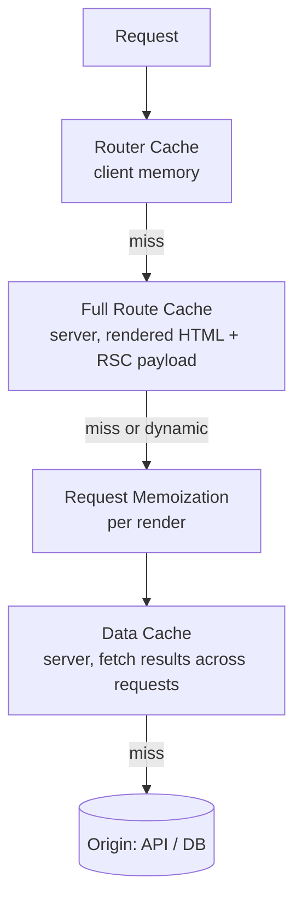
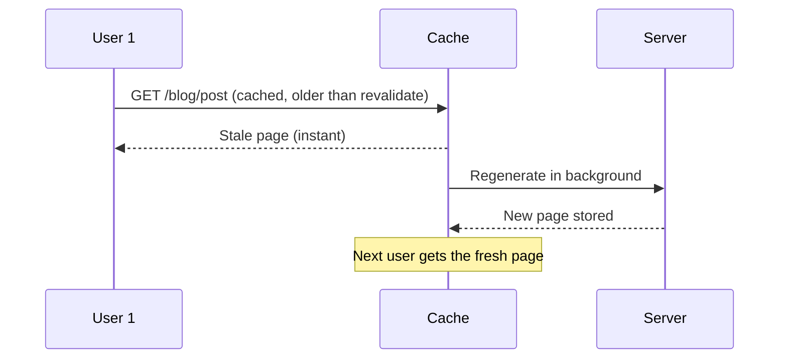

# 📘 Data Fetching and Caching

Caching is the part of Next.js that causes the most production bugs and the most interview questions.
The framework has two models you must be able to describe: the **classic model** (implicit caches layered on `fetch`) and the **Cache Components model** (`"use cache"`, explicit and opt-in).
This page covers fetching first, then both caching models, then how to invalidate and debug.

## Table of Contents

1. [Where to Fetch Data](#1-where-to-fetch-data)
2. [Fetching in Server Components](#2-fetching-in-server-components)
3. [Parallel vs Sequential Fetching](#3-parallel-vs-sequential-fetching)
4. [Request Memoization and React cache](#4-request-memoization-and-react-cache)
5. [The Classic Caching Layers](#5-the-classic-caching-layers)
6. [Cache Components and use cache](#6-cache-components-and-use-cache)
7. [Cache Lifetimes and Tags](#7-cache-lifetimes-and-tags)
8. [Revalidation APIs](#8-revalidation-apis)
9. [Time-based and On-demand ISR](#9-time-based-and-on-demand-isr)
10. [Client-side Data Fetching](#10-client-side-data-fetching)
11. [Debugging Stale Data](#11-debugging-stale-data)
12. [Questions](#12-questions)

---

## 1. Where to Fetch Data

| Where | Use for | Notes |
| --- | --- | --- |
| **Server Component** | Initial page data, SEO content, anything needing secrets | Default choice; `await` directly, no API layer needed |
| **Route Handler** (`route.ts`) | Public or third-party API, webhooks, mobile clients | Client Components can call it with `fetch` |
| **Server Action** | Mutations (create, update, delete) | Not meant for reads (they run sequentially by default) |
| **Client Component + library** | User-driven, frequently refreshed, optimistic or polling data | TanStack Query or SWR; or `use(promise)` from a server-started promise |

Rules of thumb:

- Read data on the **server**, as close to where it renders as possible.
- Mutate with **Server Actions**, then revalidate the affected caches.
- Use a client data library only for things the server cannot do well: infinite scroll, polling, real-time, complex client cache and optimistic UI.
- Avoid fetching your own Route Handlers from Server Components: call the underlying function directly.

---

## 2. Fetching in Server Components

```tsx
// Using fetch to an external API
export default async function Page() {
  const res = await fetch('https://api.example.com/posts');
  if (!res.ok) throw new Error('Failed to load posts');
  const posts: Post[] = await res.json();
  return <PostList posts={posts} />;
}
```

```tsx
// Direct database or ORM access
import { db } from '@/lib/db';

export default async function Page() {
  const users = await db.user.findMany({ where: { active: true } });
  return <UserTable users={users} />;
}
```

- `async` Server Components can `await` anything: `fetch`, ORMs, file reads.
- ORMs and database drivers are **not** covered by `fetch` caching; you cache them with `React.cache` (per request) or `"use cache"` (across requests).
- Failure handling: throw to hit `error.tsx`, or return a value and render an error state for expected failures.
- Only select the fields the UI needs: it keeps queries cheap and prevents leaking columns into the payload.
- Data needed in `generateMetadata` and the page is requested twice in code, but the framework deduplicates `fetch`; for ORM calls wrap the function in `cache()`.

---

## 3. Parallel vs Sequential Fetching

**Waterfall (accidental):**

```tsx
export default async function Page({ params }: { params: Promise<{ id: string }> }) {
  const { id } = await params;
  const user = await getUser(id);          // 200 ms
  const posts = await getPosts(id);        // 300 ms  (waits for user even though it does not depend on it)
  const stats = await getStats(id);        // 150 ms
  // total about 650 ms
}
```

**Parallel:**

```tsx
const [user, posts, stats] = await Promise.all([getUser(id), getPosts(id), getStats(id)]); // about 300 ms
```

**Streaming with independent components** (best UX):

```tsx
export default async function Page({ params }: { params: Promise<{ id: string }> }) {
  const { id } = await params;
  return (
    <>
      <Suspense fallback={<UserSkeleton />}><User id={id} /></Suspense>
      <Suspense fallback={<PostsSkeleton />}><Posts id={id} /></Suspense>
    </>
  );
}
```

| Pattern | When |
| --- | --- |
| `Promise.all` | You need all results to render something |
| `Promise.allSettled` | Some parts may fail without failing the page |
| Sequential `await` | Second request needs the first result (for example user, then their org) |
| Suspense per component | Independent sections with different latencies |
| Preload pattern | Start a fetch early, `await` later; combine with `cache()` |
| Pass a Promise to a Client Component | Start on the server, resolve with `use()` on the client |

- Sequential dependencies are fine, **accidental** ones are bugs; check the network tab and server logs for the shape.
- Nested components that each fetch are fine, because they run in parallel when siblings and are deduplicated when identical.
  A child awaiting inside a parent that awaited first is still a waterfall.

---

## 4. Request Memoization and React cache

Within **one server render pass**, identical `fetch` calls (same URL and options) are **memoized**, so a layout, page, and `generateMetadata` can all call `getPost(id)` and it hits the network once.

For non-`fetch` data sources, wrap the function with React's `cache`:

```ts
// lib/data.ts
import { cache } from 'react';
import { db } from '@/lib/db';

export const getUser = cache(async (id: string) => {
  return db.user.findUnique({ where: { id } });
});
```

| | `React.cache` | `"use cache"` |
| --- | --- | --- |
| Lifetime | One request / render pass | Across requests (until expiry or invalidation) |
| Purpose | Dedupe within a render | Share results between users and requests |
| Storage | In memory, per request | Cache handler (memory, disk, or remote) |
| Invalidates | Automatically at request end | Time (`cacheLife`) or tags |

- Memoization only applies to the same render; it is **not** a data cache.
- Arguments should be primitives for `cache()`: it compares by reference, so a new object each call defeats it.
- It is the right tool for sharing "current user" or "current tenant" across components without prop drilling or context.

---

## 5. The Classic Caching Layers

Before Cache Components, Next.js described four layers.
You still need them for older code and for interviews.



| Layer | Where | What | Duration | Opt out / invalidate |
| --- | --- | --- | --- | --- |
| **Request Memoization** | Server, per request | Return values of identical `fetch` calls | One render pass | `AbortController` signal; not needed in practice |
| **Data Cache** | Server, persistent | `fetch` responses | Until revalidated | `cache: 'no-store'`, `revalidate`, `revalidateTag`, `revalidatePath` |
| **Full Route Cache** | Server, persistent | Rendered HTML and RSC payload of static routes | Until revalidation or redeploy | Dynamic APIs, `dynamic = 'force-dynamic'`, revalidation |
| **Router Cache** | Browser memory | RSC payloads of visited and prefetched segments | Session (short stale times) | `router.refresh()`, `revalidatePath` / `revalidateTag` / cookie changes in Actions |

`fetch` options in the classic model:

```ts
fetch(url);                                            // not cached by default in current versions
fetch(url, { cache: 'force-cache' });                  // cache indefinitely
fetch(url, { cache: 'no-store' });                     // never cache
fetch(url, { next: { revalidate: 3600 } });            // cache, refresh in the background after an hour
fetch(url, { next: { tags: ['posts'] } });             // label for on-demand invalidation
```

Route segment config (classic):

```ts
export const revalidate = 60;              // page-level ISR window in seconds
export const dynamic = 'force-static';     // or 'force-dynamic', 'error', 'auto'
export const fetchCache = 'default-cache';
```

Version history that interviewers ask about:

| Version | Change |
| --- | --- |
| 13 / 14 | `fetch` cached by default (`force-cache`), GET Route Handlers cached by default, Router Cache stale times of 30s (dynamic) and 5 min (static) |
| 15 | `fetch` and GET Route Handlers **not cached by default**, Router Cache no longer reuses page segments by default; `params`, `cookies()`, `headers()` became async |
| 16 | **Cache Components** introduced with `"use cache"` as the explicit, opt-in model; `unstable_cache` superseded; `revalidateTag` takes a cache profile; `updateTag` and `refresh` added |

- The change in 15 was driven by user confusion: "why is my data stale?" was the top complaint.
- If a question starts with "in Next 14 / 13...", answer with the implicit default-cache model; for current code answer with explicit caching.

---

## 6. Cache Components and use cache

Enable it in config:

```ts
// next.config.ts
const nextConfig: NextConfig = { cacheComponents: true };
```

The model:

- **Everything is dynamic by default**: rendered at request time, nothing cached unless you say so.
- Add **`"use cache"`** to cache a file, a component, or a function.
- Cached output becomes part of the **static shell** at build time (Partial Prerendering) and is reused across requests.
- Dynamic parts are fine, but they must be inside `Suspense` so the shell can be produced.

```tsx
// Cache a function
export async function getProducts() {
  'use cache';
  cacheLife('hours');
  cacheTag('products');
  return db.product.findMany();
}
```

```tsx
// Cache a whole component
export async function ProductList() {
  'use cache';
  cacheLife('minutes');
  const products = await db.product.findMany();
  return <ul>{products.map((p) => <li key={p.id}>{p.name}</li>)}</ul>;
}
```

```tsx
// Cache an entire route (file level)
'use cache';
export default async function Page() { /* ... */ }
```

Rules:

| Rule | Why |
| --- | --- |
| Arguments and closed-over values become part of the **cache key** | Different inputs get separate entries |
| Arguments must be serializable | They are hashed into the key |
| You **cannot read `cookies()`, `headers()`, or `searchParams` inside** a cached scope | Request data would leak between users; read them outside and pass the values in as arguments |
| `children` or Server Action props can pass **through** a cached component | They are treated as opaque references, not inputs |
| Return values must be serializable | They are stored and replayed |
| Side effects run only on a cache miss | Do not rely on them running per request |

```tsx
export default async function Page() {
  const locale = (await cookies()).get('locale')?.value ?? 'en';  // dynamic, outside the cache
  return <Suspense fallback={<Skeleton />}><Catalog locale={locale} /></Suspense>;
}

async function Catalog({ locale }: { locale: string }) {
  'use cache';                       // key includes locale
  cacheLife('hours');
  return <List items={await getCatalog(locale)} />;
}
```

Cache variants:

| Directive | Storage and scope |
| --- | --- |
| `'use cache'` | Default: in-memory / configured handler, shared, can be prerendered into the shell |
| `'use cache: remote'` | Stored in a shared remote cache handler, for dynamic contexts that still want reuse across instances |
| `'use cache: private'` | Per-client cache that may read request data like cookies; not shared between users, stored in the browser/memory only |

- Use the `React.cache` function inside for per-request dedupe, and `"use cache"` for cross-request reuse; they compose.
- `fetch` with `"use cache"` around it inherits the cache; you no longer need `force-cache` or `next.revalidate` options.

---

## 7. Cache Lifetimes and Tags

```ts
import { cacheLife, cacheTag } from 'next/cache';

async function getArticle(slug: string) {
  'use cache';
  cacheTag('articles', `article:${slug}`);
  cacheLife('days');                           // named profile
  return db.article.findUnique({ where: { slug } });
}

// Custom inline lifetime (seconds)
cacheLife({ stale: 300, revalidate: 900, expire: 86400 });
```

| Lifetime term | Meaning |
| --- | --- |
| `stale` | How long the **client** may use the cached value without checking the server |
| `revalidate` | After this, the server serves the cached value but refreshes it in the background (stale-while-revalidate) |
| `expire` | After this with no traffic, the next request waits for fresh data (no stale serving) |

- Built-in profiles include `seconds`, `minutes`, `hours`, `days`, `weeks`, and `max`; define custom profiles in `next.config.ts` under `cacheLife`.
- Very short lifetimes (under about a minute for `revalidate`) may be excluded from prerendering and treated as dynamic holes, so do not use them to fake "no cache".
- **Tags** are labels you attach to cached entries so one call can invalidate many entries.
  Tag with both a broad tag (`articles`) and a specific tag (`article:${slug}`) so you can invalidate precisely or in bulk.

---

## 8. Revalidation APIs

| API | Where it runs | Behavior |
| --- | --- | --- |
| `revalidateTag(tag, 'max')` | Server Actions, Route Handlers | Marks tagged entries stale; **stale-while-revalidate**: next visitor still gets the old value while fresh data loads in the background. The second argument is a cache profile |
| `updateTag(tag)` | **Server Actions only** | Expires the tag immediately and the next read waits for fresh data: **read-your-writes** for the user who just mutated |
| `refresh()` | Server Actions | Refreshes **uncached** data in the current route without touching cached entries |
| `revalidatePath('/blog/[slug]', 'page')` | Server Actions, Route Handlers | Invalidates the cached output of a path |
| `router.refresh()` | Client | Re-fetches the current route's server output, keeps client state |

```ts
'use server';
import { updateTag, revalidateTag } from 'next/cache';

export async function publishPost(id: string) {
  await db.post.update({ where: { id }, data: { published: true } });
  updateTag(`post:${id}`);                 // the author sees the change immediately
  revalidateTag('posts', 'max');           // list pages refresh in the background
}
```

```ts
// app/api/webhook/route.ts: CMS publishes content
export async function POST(req: Request) {
  const { slug, secret } = await req.json();
  if (secret !== process.env.WEBHOOK_SECRET) return new Response('Unauthorized', { status: 401 });
  revalidateTag(`article:${slug}`, 'max');
  return Response.json({ ok: true });
}
```

Choosing:

| Situation | Use |
| --- | --- |
| User edits something and must see it right away | `updateTag` |
| Background propagation to everyone else is fine | `revalidateTag(tag, 'max')` |
| External system changed content | `revalidateTag` from a webhook Route Handler |
| Whole path changed | `revalidatePath` |
| Uncached dynamic data (counts, notifications) after an action | `refresh()` |
| Time-based expiry only | `cacheLife` |

- Always **authenticate** webhook and revalidation endpoints; they are public URLs by default.
- Revalidate after a mutation in the **same** Server Action when possible so the UI never shows stale data.
- Tag naming conventions (`entity`, `entity:id`, `user:id:entity`) save you from "revalidate everything" habits.

---

## 9. Time-based and On-demand ISR

**ISR** (incremental static regeneration) lets a static page be refreshed without a full rebuild.



Classic form:

```ts
export const revalidate = 3600;                    // regenerate at most hourly
// or per fetch:  fetch(url, { next: { revalidate: 3600, tags: ['posts'] } })
```

Cache Components form: `"use cache"` plus `cacheLife('hours')` and tags.

- **Time-based**: refresh after N seconds on the next visit.
- **On-demand**: refresh when something happens (webhook, Server Action) using tags or paths.
- ISR needs a **server** (or platform) that persists the cache; a pure `output: 'export'` static site cannot do it.
- With multiple instances, the default filesystem cache is **per instance** unless you provide a shared `cacheHandler`; see [Testing, Deployment, and Operations](/docs/nextjs/testing-deployment-and-operations).

---

## 10. Client-side Data Fetching

```tsx
'use client';
import { useQuery } from '@tanstack/react-query';

export function Notifications() {
  const { data, isPending, error } = useQuery({
    queryKey: ['notifications'],
    queryFn: () => fetch('/api/notifications').then((r) => r.json()),
    refetchInterval: 30_000,
  });
  if (isPending) return <Spinner />;
  if (error) return <ErrorMessage />;
  return <List items={data} />;
}
```

| Use a client library when | Prefer the server when |
| --- | --- |
| Polling, real-time, window-focus refetch | Initial render data and SEO content |
| Infinite scroll and pagination UI state | Data tied to the route and params |
| Optimistic updates with rollback | Anything that needs secrets or direct DB access |
| Shared cache across many client islands | Large data that would bloat the client |

**Hybrid pattern (hydrating a client cache from the server):**

```tsx
// Server Component: prefetch, dehydrate
const queryClient = new QueryClient();
await queryClient.prefetchQuery({ queryKey: ['posts'], queryFn: getPosts });
return <HydrationBoundary state={dehydrate(queryClient)}><PostsClient /></HydrationBoundary>;
```

- Create the `QueryClient` per request on the server (never a module-level singleton), or one user's data leaks to another.
- Server state (data from the server) and client state (UI toggles) should live in different tools; see [Redux](/docs/redux) for client state patterns.
- `use(promise)` with a server-created promise often replaces the hybrid pattern for simple cases.

---

## 11. Debugging Stale Data

Work through the layers in order:

| Symptom | Likely cause | Check |
| --- | --- | --- |
| Data never updates after a mutation | No revalidation after the Server Action | Add `updateTag`/`revalidateTag`/`revalidatePath`; confirm the tag names match exactly |
| Updates show for the author but not others | `revalidateTag` stale-while-revalidate delay | Expected; use `updateTag` for the actor |
| Works locally, stale in production | Production caches, dev does not | Test with `next build && next start` |
| Different instances show different data | Per-instance filesystem cache | Shared cache handler or CDN purge |
| Page unexpectedly dynamic | Used `cookies()`, `headers()`, or `searchParams` | Read the `next build` route table |
| Page unexpectedly static (data never changes) | Data fetched at build and no revalidation | Add `cacheLife`/`revalidate` or make it dynamic |
| Back button shows old data | Router Cache | `router.refresh()`, `refresh()` in the action, or shorter stale time |
| Cached component shows another user's data | Request data read inside a cached scope or shared client | Pass per-user values as arguments; never cache user data without the user id in the key |
| `use cache` misses every time | Unstable arguments (new object each call) or closed-over changing values | Pass primitives, inspect keys, check logs |
| Build fails: "uncached data accessed outside Suspense" | Cache Components found a dynamic hole | Wrap in `Suspense`, or cache with `"use cache"` |

Tools:

- `next build` route table and its cache annotations.
- Verbose fetch logging with `logging: { fetches: { fullUrl: true } }` in `next.config.ts` shows cache hits and misses in dev.
- The response header `x-nextjs-cache` (`HIT`, `MISS`, `STALE`) on the document request.
- Add a temporary `console.log('computed', Date.now())` inside a cached function: it should appear only on misses.
- The Network tab for `_rsc` requests tells you when the Router Cache is or is not used.

---

## 12. Questions

**Q: Explain the Next.js caching layers.**
Classic model: Request Memoization (dedupe within a render), Data Cache (persisted `fetch` results), Full Route Cache (prerendered HTML and RSC payload), Router Cache (client in-memory segments).
Current model: explicit `"use cache"` with `cacheLife` and `cacheTag`, so nothing is cached unless you opt in.

**Q: What changed in Next.js 15 caching?**
`fetch` requests and GET Route Handlers stopped being cached by default, and the client Router Cache stopped reusing page segments by default.
It removed the "why is my data stale" surprise.

**Q: How do you fetch data in the App Router?**
`await` it in an async Server Component, parallelize with `Promise.all` or independent `Suspense` boundaries, dedupe with `fetch` memoization or `React.cache`, and cache across requests with `"use cache"`.

**Q: `revalidateTag` vs `updateTag` vs `revalidatePath`?**
`revalidateTag` marks tagged entries stale with stale-while-revalidate behavior.
`updateTag` is Server-Action-only and expires immediately so the user sees their own write.
`revalidatePath` invalidates by URL path.

**Q: Why can't you call `cookies()` inside a `"use cache"` function?**
Cached output is shared; reading per-request data inside would bake one user's data into a shared entry.
Read it outside and pass the value as an argument, which becomes part of the cache key.

**Q: What is ISR?**
Serving a static page and regenerating it in the background after a time window or on demand, so you get static speed with eventually fresh content and no full rebuild.

**Q: React `cache` vs `use cache`?**
`cache` dedupes inside one render.
`use cache` persists results across requests with lifetimes and tags.

**Q: How do you avoid a data waterfall?**
Start independent requests together (`Promise.all`), move fetching into sibling components under separate `Suspense` boundaries, preload early, and only chain `await`s that are truly dependent.

**Q: Where would you use TanStack Query in a Next.js app?**
In Client Components for polling, infinite lists, optimistic mutations, and shared client cache, often seeded from the server with `HydrationBoundary`.
Initial, SEO-relevant data stays in Server Components.

**Q: Users see old content after a CMS publish. Debug it.**
Confirm the webhook fires and is authenticated, that the tag it revalidates matches the tag on the cached entry, whether multiple instances use separate caches, whether a CDN is caching HTML, and test with a production build rather than dev.
