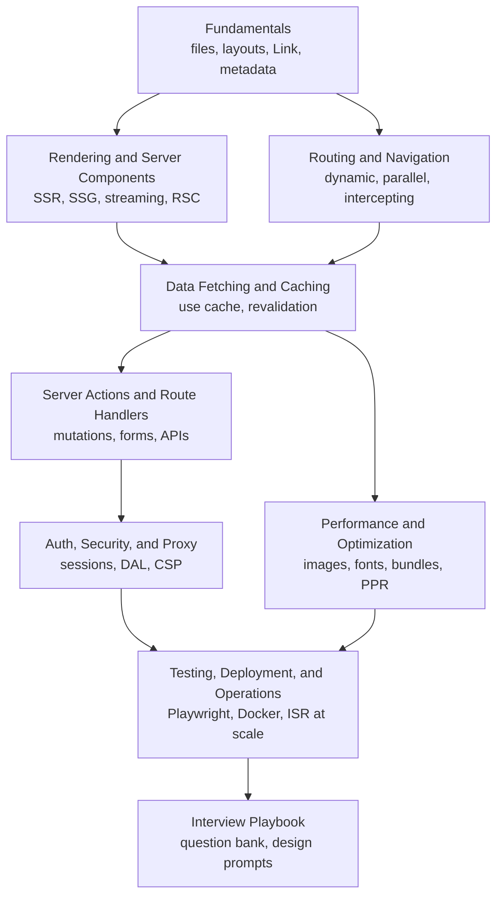

Start here for Next.js prep, from "what is the difference between `page.tsx` and `layout.tsx`" to "why is this page still showing stale data after the mutation".
Each page teaches the framework the way interviews probe it: what runs on the server, what ships to the browser, what is cached where, and how you would prove it.
Everything reflects the current platform: the App Router is the default, Server Components are the default component type, Turbopack is the default bundler, `params` and `cookies()` are async, `proxy.ts` replaces `middleware.ts`, and Cache Components with `"use cache"` is the explicit caching model.

<SectionHub
  path="nextjs"
  levels={{
    "nextjs-fundamentals": "Beginner",
    "rendering-and-server-components": "Mid to advanced",
    "routing-and-navigation": "Beginner to mid",
    "data-fetching-and-caching": "Mid to advanced",
    "server-actions-and-route-handlers": "Mid",
    "auth-security-and-proxy": "Mid to advanced",
    "performance-and-optimization": "Mid to advanced",
    "testing-deployment-and-operations": "Mid",
    "nextjs-interview-playbook": "All levels"
  }}
/>

## Reading Path

## Pick Your Level

| You are | Read in this order |
| --- | --- |
| A React SPA developer new to Next.js | [Fundamentals](/docs/nextjs/nextjs-fundamentals), [Routing and Navigation](/docs/nextjs/routing-and-navigation), [Rendering and Server Components](/docs/nextjs/rendering-and-server-components) |
| Preparing for a mid-level role | Add [Data Fetching and Caching](/docs/nextjs/data-fetching-and-caching), [Server Actions and Route Handlers](/docs/nextjs/server-actions-and-route-handlers), and [Performance](/docs/nextjs/performance-and-optimization) |
| Preparing for senior or platform roles | Add [Auth, Security, and Proxy](/docs/nextjs/auth-security-and-proxy) and [Testing, Deployment, and Operations](/docs/nextjs/testing-deployment-and-operations) |
| One week left | The [Interview Playbook](/docs/nextjs/nextjs-interview-playbook) study plan |

## Related Sections

- [React](/docs/react) covers hooks, rendering, and patterns that apply unchanged inside Client Components.
- [JavaScript](/docs/javascript) and [TypeScript](/docs/typescript) cover the language your app is written in.
- [Redux](/docs/redux) covers Redux Toolkit and RTK Query, which live in Client Components only.
- [Backend](/docs/backend) covers HTTP, auth, caching, and queues behind Route Handlers and Server Actions.
- [Frontend System Design](/docs/system-design/hld/frontend-system-design) covers the client architecture framework used in design rounds.
