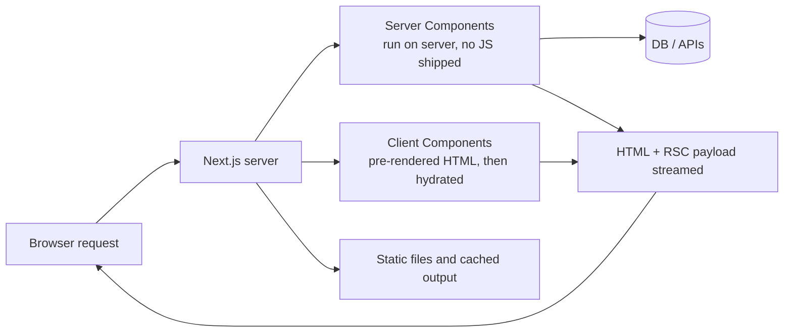
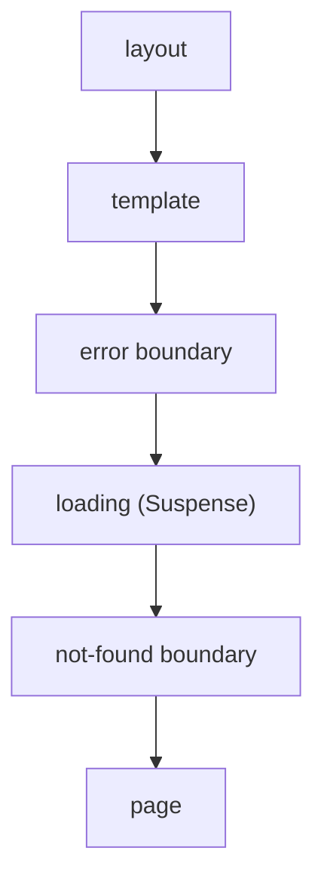

# 📘 Next.js Fundamentals

Next.js is a **full-stack React framework**.
React gives you components and state.
Next.js adds everything around it: file-based routing, server rendering, data fetching, a bundler, image and font optimization, API endpoints, and a deployment story.
If you know React, you already know the component model and hooks.
What changes is **where your code runs** (server or browser), **when it runs** (build time or request time), and **what gets cached**.
Read [React Core Concepts](/docs/react/react-core-concepts) if hooks and reconciliation are new to you.

## Table of Contents

1. [What Next.js Is](#1-what-nextjs-is)
2. [Next.js vs the Alternatives](#2-nextjs-vs-the-alternatives)
3. [Creating a Project](#3-creating-a-project)
4. [Project Anatomy](#4-project-anatomy)
5. [App Router File Conventions](#5-app-router-file-conventions)
6. [Layouts and Templates](#6-layouts-and-templates)
7. [Linking and Navigation](#7-linking-and-navigation)
8. [Styling, Fonts, and Images](#8-styling-fonts-and-images)
9. [Metadata and SEO](#9-metadata-and-seo)
10. [Environment Variables](#10-environment-variables)
11. [Common Mistakes from SPA Developers](#11-common-mistakes-from-spa-developers)
12. [Questions](#12-questions)

---

## 1. What Next.js Is



- **Same React:** components, props, state, hooks, context, Suspense, and transitions all work the same way inside Client Components.
- **Server-first:** components are **Server Components** by default.
  They run on the server (or at build time), can read a database directly, and send **no component JavaScript** to the browser.
- **File-system routing:** folders in `app/` become URL segments, special file names (`page`, `layout`, `loading`, `error`) define behavior.
- **Multiple rendering modes per route:** static, dynamic, streamed, or a mix inside one page.
- **Built-in optimization:** `next/image`, `next/font`, code splitting per route, prefetching, and Turbopack as the bundler.
- **Back end included:** Route Handlers (`route.ts`) for HTTP endpoints and Server Actions for mutations.
- Maintained by Vercel, but it runs anywhere Node.js runs, in a container, or on serverless platforms.

### 1.1 What you get and what you give up

| You get | You give up |
| --- | --- |
| SEO-friendly HTML on first load | A server runtime to run, secure, and scale (unless fully static export) |
| Less client JavaScript via Server Components | A new mental model: server/client boundary, serialization rules |
| Colocated data fetching and UI | Easy mistakes with caching and stale data |
| Routing, layouts, loading and error UI for free | Opinionated conventions you must follow |
| Image, font, and script optimization | Framework upgrades can be real work (async APIs, caching changes) |
| One codebase for pages and API | Not every browser-only library works in Server Components |

---

## 2. Next.js vs the Alternatives

| | Next.js | Vite + React SPA | Remix / React Router v7 | Astro | TanStack Start |
| --- | --- | --- | --- | --- | --- |
| Rendering | SSR, SSG, ISR, streaming, RSC | Client-only | SSR, streaming, loaders | Static first, islands | SSR, streaming |
| Routing | File-based (App Router) | Library (React Router) | File-based, nested | File-based pages | File-based, type-safe |
| Data loading | Server Components, `fetch`, Server Actions | Client fetch (TanStack Query) | `loader` / `action` | Frontmatter fetch | Loaders, server functions |
| Server Components | Yes (core model) | No | Not the default model | Not React-specific | Not the default model |
| SEO | Excellent | Poor without prerender | Excellent | Excellent | Excellent |
| Best for | Full-stack React products, marketing plus app | Dashboards behind login | Web-standards, form-heavy apps | Content sites, docs, blogs | Type-safe full-stack apps |

How to answer "why Next.js?" in an interview:

- Pick Next.js when SEO and first-load speed matter, you want one framework for pages and API, and the team knows React.
- Pick a Vite SPA for authenticated dashboards where SEO is irrelevant and a CDN-hosted static bundle is enough.
- Pick Astro for mostly static content with little interactivity.
- Pick Remix / React Router when you prefer web-standard loaders and actions over the Server Component model.
- Be honest about trade-offs: a server runtime, caching complexity, and vendor-shaped defaults.

---

## 3. Creating a Project

```bash
npx create-next-app@latest my-app
```

The wizard asks for TypeScript, Tailwind, the `src/` directory, the App Router, and the import alias.

```json
{
  "scripts": {
    "dev": "next dev",
    "build": "next build",
    "start": "next start",
    "lint": "eslint ."
  }
}
```

| Command | What it does |
| --- | --- |
| `next dev` | Dev server with Fast Refresh, on-demand compilation (Turbopack) |
| `next build` | Production build: compiles, prerenders static routes, prints the route table |
| `next start` | Runs the production Node server (needs `next build` first) |
| `eslint .` | Linting; the `next lint` command was removed, run ESLint directly |

- **Turbopack** is the default bundler for `dev` and `build` in current versions (Rust based, incremental).
  Webpack is still available with a flag for projects with custom webpack config.
- Requires a modern Node.js (20.9 or newer for recent releases) and TypeScript 5.1 or newer.
- `next build` output is the first thing to read: it marks each route as **static** (prerendered), **partially prerendered**, or **dynamic** (rendered on request).
- `next.config.ts` holds framework configuration (images, redirects, headers, output mode, experimental flags).

```ts
// next.config.ts
import type { NextConfig } from 'next';

const nextConfig: NextConfig = {
  reactStrictMode: true,
  images: {
    remotePatterns: [{ protocol: 'https', hostname: 'cdn.example.com' }],
  },
};

export default nextConfig;
```

---

## 4. Project Anatomy

```
my-app/
  app/
    layout.tsx          root layout (required)
    page.tsx            the "/" route
    globals.css
    dashboard/
      layout.tsx        nested layout
      page.tsx          "/dashboard"
      loading.tsx       streamed fallback
      error.tsx         error boundary
      settings/
        page.tsx        "/dashboard/settings"
    api/
      health/
        route.ts        GET /api/health
  components/           shared UI (not routable)
  lib/                  data access, utilities
  public/               static files served from "/"
  proxy.ts              request interception (formerly middleware.ts)
  next.config.ts
  tsconfig.json
```

- Only `app/` folders containing **`page.tsx`** or **`route.ts`** are publicly routable.
  Everything else in `app/` is safe to colocate: components, tests, helpers.
- `public/` files are served from the site root: `public/logo.svg` is `/logo.svg`.
- A `src/` directory is optional and changes nothing except where the folders live.
- The older **Pages Router** (`pages/`) still works and can coexist with `app/`, but new code should use the App Router.

| App Router | Pages Router |
| --- | --- |
| `app/` directory | `pages/` directory |
| Server Components by default | Everything is a Client Component |
| Nested layouts, streaming, Server Actions | `getServerSideProps`, `getStaticProps`, `_app`, `_document` |
| `fetch` and async components | Data functions per page |
| Where all new features land | Maintenance mode |

---

## 5. App Router File Conventions

| File | Purpose |
| --- | --- |
| `layout.tsx` | Shared UI that wraps child segments, persists across navigation |
| `page.tsx` | The unique UI of a route, makes the segment publicly accessible |
| `loading.tsx` | Instant loading UI, wraps the page in a Suspense boundary |
| `error.tsx` | Error boundary for the segment (must be a Client Component) |
| `global-error.tsx` | Error boundary for the root layout itself |
| `not-found.tsx` | UI for `notFound()` and unmatched URLs |
| `template.tsx` | Like layout, but re-mounts on every navigation |
| `default.tsx` | Fallback for a parallel route slot on hard navigation |
| `route.ts` | HTTP endpoint (GET, POST, ...) instead of UI |
| `opengraph-image.tsx`, `icon.tsx` | Generated metadata images |
| `sitemap.ts`, `robots.ts` | Generated SEO files |

Components in a segment nest in this order:



A minimal route:

```tsx
// app/page.tsx  ->  "/"
export default function Home() {
  return <h1>Hello Next.js</h1>;
}
```

```tsx
// app/dashboard/page.tsx  ->  "/dashboard"
export default async function Dashboard() {
  const stats = await getStats(); // runs on the server
  return <pre>{JSON.stringify(stats)}</pre>;
}
```

- A `page.tsx` **default export** must be a component; it can be `async`.
- Pages receive `params` and `searchParams` as **Promises** (see [Routing and Navigation](/docs/nextjs/routing-and-navigation)).
- `error.tsx` must be a Client Component because error boundaries are class-based and interactive (`reset()`).

---

## 6. Layouts and Templates

```tsx
// app/layout.tsx  (root layout: must render <html> and <body>)
import type { Metadata } from 'next';
import './globals.css';

export const metadata: Metadata = { title: { default: 'Acme', template: '%s | Acme' } };

export default function RootLayout({ children }: { children: React.ReactNode }) {
  return (
    <html lang="en">
      <body>{children}</body>
    </html>
  );
}
```

```tsx
// app/dashboard/layout.tsx
export default function DashboardLayout({ children }: { children: React.ReactNode }) {
  return (
    <div className="grid grid-cols-[240px_1fr]">
      <Sidebar />
      <main>{children}</main>
    </div>
  );
}
```

- The **root layout** is required and is the only place you write `<html>` and `<body>`.
- Layouts **persist and do not re-render** when navigating between child routes, so state in a sidebar survives.
- Layouts cannot read `searchParams` and do not receive the current pathname, because they would not re-render on navigation.
  Read them in a Client Component with `usePathname()` / `useSearchParams()`.
- Layouts can fetch data, and the same `fetch` in a layout and a page is deduplicated within one request.
- A layout cannot pass props to its children; share data with context (Client Components) or by fetching again with a cached function.
- Use **`template.tsx`** when you need a fresh mount on each navigation: enter animations, per-page `useEffect`, resetting state.

---

## 7. Linking and Navigation

```tsx
import Link from 'next/link';

<Link href="/dashboard">Dashboard</Link>
<Link href={{ pathname: '/search', query: { q: 'next' } }}>Search</Link>
<Link href="/blog/hello" prefetch={false}>No prefetch</Link>
<Link href="/settings" replace scroll={false}>Replace history</Link>
```

- `Link` renders an `<a>` and performs **client-side navigation**: no full reload, layouts preserved, only the changed segments fetched.
- It **prefetches** routes entering the viewport in production, so clicks feel instant.
- Static routes prefetch fully; dynamic routes prefetch down to the nearest `loading.tsx` boundary.
- Always use `Link` for internal navigation; a plain `<a>` causes a full page load.

| Need | API | Where |
| --- | --- | --- |
| Link in markup | `<Link>` | Server or Client |
| Imperative navigation | `useRouter()` from `next/navigation` (`push`, `replace`, `back`, `refresh`, `prefetch`) | Client |
| Current path | `usePathname()` | Client |
| Query string | `useSearchParams()` | Client (wrap in `<Suspense>`) |
| Route params in a client tree | `useParams()` | Client |
| Active segment | `useSelectedLayoutSegment()` | Client |
| Redirect while rendering or in actions | `redirect('/login')` | Server |
| 404 | `notFound()` | Server |

```tsx
'use client';
import { usePathname } from 'next/navigation';
import Link from 'next/link';

export function NavLink({ href, children }: { href: string; children: React.ReactNode }) {
  const pathname = usePathname();
  const active = pathname === href;
  return (
    <Link href={href} aria-current={active ? 'page' : undefined} className={active ? 'font-bold' : ''}>
      {children}
    </Link>
  );
}
```

- Import `useRouter` from **`next/navigation`**, not `next/router` (that is the Pages Router).
- `redirect()` throws a special error internally, so do not wrap it in `try/catch` that swallows it.
- `useSearchParams` in a statically rendered page opts that part into client rendering, so wrap it in `Suspense` to avoid a build error.

---

## 8. Styling, Fonts, and Images

### 8.1 Styling options

| Option | Notes |
| --- | --- |
| **Tailwind CSS** | Default choice in `create-next-app`; zero runtime, works in Server Components |
| **CSS Modules** | `Button.module.css` gives locally scoped class names; zero runtime |
| **Global CSS** | Import in the root layout (`app/globals.css`) |
| **CSS-in-JS with runtime** (styled-components, Emotion) | Needs a registry for SSR and runs in Client Components only; awkward with Server Components |
| **Zero-runtime CSS-in-JS** (Panda, vanilla-extract, StyleX) | Works with Server Components |

### 8.2 `next/font`

```tsx
import { Inter } from 'next/font/google';

const inter = Inter({ subsets: ['latin'], display: 'swap', variable: '--font-inter' });

export default function RootLayout({ children }: { children: React.ReactNode }) {
  return (
    <html lang="en" className={inter.variable}>
      <body>{children}</body>
    </html>
  );
}
```

- Fonts are **downloaded at build time and self-hosted**, with no request to Google at runtime.
- Automatic `size-adjust` fallback metrics remove layout shift when the font loads.
- `next/font/local` does the same for your own font files.

### 8.3 `next/image`

```tsx
import Image from 'next/image';
import hero from './hero.jpg';

<Image src={hero} alt="Team at work" priority placeholder="blur" />
<Image src="https://cdn.example.com/a.jpg" alt="Avatar" width={64} height={64} />
<Image src="/cover.jpg" alt="" fill sizes="(max-width: 768px) 100vw, 50vw" style={{ objectFit: 'cover' }} />
```

- Serves resized, modern-format (WebP / AVIF) images through the built-in optimizer, lazy loaded by default.
- Requires `width` and `height` (or `fill`) to reserve space and **prevent layout shift**.
- Add `priority` to the above-the-fold LCP image so it preloads.
- `sizes` tells the browser which candidate to download, and is critical for `fill` and responsive images.
- Remote hosts must be allowed in `images.remotePatterns`.
- Details are in [Performance and Optimization](/docs/nextjs/performance-and-optimization).

---

## 9. Metadata and SEO

```tsx
// Static
export const metadata: Metadata = {
  title: 'Pricing',
  description: 'Plans and pricing',
  openGraph: { title: 'Pricing', images: ['/og/pricing.png'] },
};
```

```tsx
// Dynamic
export async function generateMetadata({ params }: { params: Promise<{ slug: string }> }): Promise<Metadata> {
  const { slug } = await params;
  const post = await getPost(slug); // deduplicated with the page's own fetch
  return { title: post.title, description: post.excerpt, alternates: { canonical: `/blog/${slug}` } };
}
```

- Export `metadata` or `generateMetadata` from a **Server Component** `layout` or `page`; child values override parents and merge shallowly.
- Metadata is streamed in `<head>`; the framework deduplicates the data fetch with the page.
- File-based metadata: `app/icon.png`, `opengraph-image.tsx` (generate share images with `ImageResponse`), `sitemap.ts`, `robots.ts`, `manifest.ts`.
- JSON-LD structured data is added as a `<script type="application/ld+json">` in the page.
- SEO checklist: unique `title` and `description`, canonical URLs, a sitemap, semantic HTML, fast LCP, and real HTML in the response (not client-rendered content).

---

## 10. Environment Variables

```bash
# .env.local  (never commit)
DATABASE_URL=postgres://...
STRIPE_SECRET_KEY=sk_live_...
NEXT_PUBLIC_API_BASE=https://api.example.com
```

| Rule | Detail |
| --- | --- |
| Server-only by default | `process.env.DATABASE_URL` is available on the server and is **not** sent to the browser |
| `NEXT_PUBLIC_` prefix | Inlined into the client bundle **at build time**; treat as public |
| Build-time inlining | Changing a `NEXT_PUBLIC_` value requires a rebuild; server-side values are read at runtime |
| Files and precedence | `.env.local` overrides `.env.development` / `.env.production`, which override `.env`; `.env.local` is ignored in `test` |
| Never expose secrets | Anything in the client bundle is readable by every user |

```ts
// lib/db.ts
import 'server-only'; // build error if a Client Component ever imports this file

export const db = createClient(process.env.DATABASE_URL!);
```

- Import `server-only` in modules that touch secrets or databases so an accidental client import fails the build.
- Validate env vars at startup with a Zod schema so a missing value fails fast instead of at 2 a.m.
- Docker images that need different `NEXT_PUBLIC_` values per environment must rebuild, or read config from a runtime endpoint.

---

## 11. Common Mistakes from SPA Developers

| Mistake | Fix |
| --- | --- |
| Adding `'use client'` to every file | Keep it at the leaves; default to Server Components |
| `useEffect` plus `fetch` for initial data | `await` the data in a Server Component |
| Using `useState` or `onClick` in a Server Component | Move the interactive part into a small Client Component |
| Importing `next/router` in the App Router | Use `next/navigation` |
| Plain `<a>` for internal links | Use `Link` |
| `` with no dimensions | Use `next/image` with `width`/`height` or `fill` |
| Reading `window` or `localStorage` during render | Do it in `useEffect`, or guard for the server |
| Putting secrets in `NEXT_PUBLIC_` variables | They ship to the browser; keep secrets server-side |
| Treating layouts as re-rendering on navigation | They persist; read the path in a Client Component |
| Forgetting `await` on `params` and `cookies()` | They are async in current versions |
| Assuming a page is static | Using `cookies()`, `headers()`, or uncached data makes it dynamic; check the `next build` table |
| Passing functions or class instances from server to client | Props must be serializable (see [Rendering](/docs/nextjs/rendering-and-server-components)) |

---

## 12. Questions

**Q: What is Next.js and why use it over plain React?**
Next.js is a full-stack React framework.
Plain React (with a bundler) gives you a client-rendered SPA: empty HTML, then JavaScript, then data.
Next.js adds server rendering and streaming for fast first paint and SEO, file-based routing and layouts, Server Components to cut client JavaScript, built-in API endpoints, and image/font optimization.

**Q: What is the difference between the App Router and the Pages Router?**
The Pages Router (`pages/`) renders everything as Client Components and uses per-page data functions (`getServerSideProps`, `getStaticProps`).
The App Router (`app/`) uses nested layouts, Server Components by default, streaming with `loading.tsx` and Suspense, Server Actions, and `fetch`-based data loading.
New features land only in the App Router.

**Q: What is the difference between `layout.tsx`, `template.tsx`, and `page.tsx`?**
`page` is the unique UI of a route.
`layout` wraps children and persists across navigation without re-rendering or losing state.
`template` also wraps children but creates a new instance on every navigation, so state and effects reset.

**Q: How does routing work?**
Folders under `app/` define URL segments.
A segment is public only when it contains `page.tsx` or `route.ts`.
Special folders: `[id]` dynamic, `[...slug]` catch-all, `(group)` organizational, `_private` excluded, `@slot` parallel.

**Q: Server Component or Client Component by default?**
Server Component.
Add `'use client'` only at the boundary where you need state, effects, event handlers, or browser APIs.
Everything imported from a Client Component file becomes part of the client bundle.

**Q: How are environment variables exposed?**
Only variables prefixed `NEXT_PUBLIC_` are inlined into the browser bundle, at build time.
All others stay on the server.
Never put secrets in `NEXT_PUBLIC_` variables.

**Q: How do you do SEO in Next.js?**
Server-rendered HTML, the Metadata API (`metadata` and `generateMetadata`), `sitemap.ts` and `robots.ts`, canonical URLs, generated Open Graph images, structured data, and good Core Web Vitals through `next/image`, `next/font`, and streaming.

**Q: Why does `next build` matter in interviews?**
It prints which routes are static, partially prerendered, or dynamic, and the first-load JavaScript per route.
Reading that table is how you confirm a page is cached and how you catch a route that accidentally became dynamic or too heavy.
