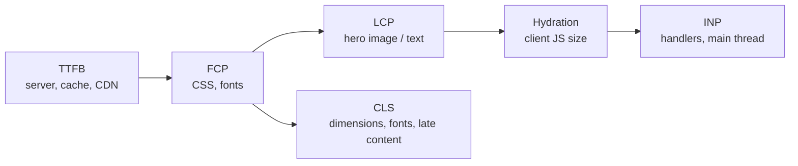

# 📘 Performance and Optimization

Web performance interviews follow a pattern: name the metric, find the bottleneck with a tool, apply the smallest fix, and verify with data.
Next.js bundles many of the fixes (image, font, script optimization, code splitting, streaming), so the skill is knowing **which lever moves which metric**.

## Table of Contents

1. [Core Web Vitals](#1-core-web-vitals)
2. [Measuring](#2-measuring)
3. [Images](#3-images)
4. [Fonts](#4-fonts)
5. [Third-party Scripts](#5-third-party-scripts)
6. [JavaScript Bundle Size](#6-javascript-bundle-size)
7. [Server-side Levers](#7-server-side-levers)
8. [Client-side Rendering Cost](#8-client-side-rendering-cost)
9. [Build and Dev Performance](#9-build-and-dev-performance)
10. [Backend and Network](#10-backend-and-network)
11. [Debugging Playbook](#11-debugging-playbook)
12. [Questions](#12-questions)

---

## 1. Core Web Vitals

| Metric | Measures | Good (75th percentile) | Main Next.js levers |
| --- | --- | --- | --- |
| **LCP** (Largest Contentful Paint) | When the main content appears | 2.5 s or less | Static/cached HTML, `priority` on hero image, streaming, fast TTFB, font preloading |
| **INP** (Interaction to Next Paint) | Responsiveness to input across the visit | 200 ms or less | Less client JS, fewer hydrated components, `useTransition`, break long tasks, avoid heavy handlers |
| **CLS** (Cumulative Layout Shift) | Visual stability | 0.1 or less | `next/image` dimensions, `next/font` fallbacks, reserved space for ads and embeds, skeletons of final size |

Supporting metrics: **TTFB** (server and network speed), **FCP** (first paint), **TBT** (lab proxy for INP), **bundle size** (first-load JS).

Field data (real users, CrUX / RUM) is what Google ranks on; lab data (Lighthouse) helps you debug.



---

## 2. Measuring

| Tool | Use |
| --- | --- |
| **Lighthouse / PageSpeed Insights** | Lab audit, plus CrUX field data for public URLs |
| **Chrome DevTools Performance** panel | Long tasks, main-thread flame chart, layout shifts, INP breakdown |
| **`@next/bundle-analyzer`** (or `next experimental-analyze` with Turbopack) | What is in each route's bundle |
| `next build` output | First-load JS per route and static/dynamic status |
| **`useReportWebVitals`** | Send real-user metrics to analytics |
| React DevTools Profiler | Why a Client Component re-renders |
| `web-vitals` library, Vercel Speed Insights, Sentry, Datadog RUM | Production RUM with segmentation |
| WebPageTest | Realistic network/device throttling, filmstrip |

```tsx
// app/web-vitals.tsx
'use client';
import { useReportWebVitals } from 'next/web-vitals';

export function WebVitals() {
  useReportWebVitals((metric) => {
    navigator.sendBeacon('/api/vitals', JSON.stringify(metric));   // name, value, rating, id
  });
  return null;
}
```

Always test a **production build** (`next build && next start`) on a throttled mobile profile; dev mode is much slower and unrepresentative.

---

## 3. Images

Images are usually the biggest bytes and the LCP element.

```tsx
import Image from 'next/image';

// Above the fold hero: preload, high priority
<Image src="/hero.jpg" alt="..." width={1600} height={900} priority sizes="100vw" />

// Responsive card grid
<Image src={p.image} alt={p.name} width={400} height={300}
  sizes="(max-width: 640px) 100vw, (max-width: 1024px) 50vw, 25vw" />

// Container-filling background
<div className="relative h-64"><Image src={cover} alt="" fill sizes="100vw" className="object-cover" /></div>
```

| Feature | Effect |
| --- | --- |
| Automatic resizing | Serves widths matching `sizes` and device pixel ratio via `srcset` |
| Modern formats | WebP / AVIF where supported (`images.formats`) |
| Lazy loading | Below-the-fold images load on approach (default) |
| `priority` (or `loading="eager"` / `fetchPriority="high"`) | Preloads the LCP image, never lazy loaded |
| `width`/`height` or `fill` | Reserves space, **prevents CLS** |
| `placeholder="blur"` | Low-res preview, smoother perceived load |
| Caching | Optimized images cached on disk/CDN; `minimumCacheTTL` controls freshness |
| `remotePatterns` | Allowlist of external hosts (security and abuse protection) |

Pitfalls:

- Missing `sizes` on responsive images makes the browser assume `100vw` and download an oversized file.
- Marking many images `priority` defeats the purpose; one or two per page.
- Serving huge originals: resize at upload; the optimizer costs CPU on first request per size.
- On self-hosted setups install `sharp` (included by default in recent versions) and put a CDN in front.
- Use `unoptimized` or a custom `loader` (Cloudinary, imgix) if you already have an image CDN.
- SVGs and animated GIFs are not optimized by default.

---

## 4. Fonts

```tsx
import { Geist } from 'next/font/google';
const geist = Geist({ subsets: ['latin'], display: 'swap' });
```

- Self-hosted at build time: no layout-blocking third-party font request, no extra DNS/TLS handshake.
- Automatic fallback font with `size-adjust` metrics removes the layout shift when the web font swaps in.
- Subset fonts (`subsets`, `weight`) and use **variable fonts** to cut bytes.
- Limit families and weights; each one is a request.
- `display: 'swap'` shows text immediately; `optional` avoids shift entirely on slow connections.

---

## 5. Third-party Scripts

Analytics, chat widgets, tag managers, and ads are common causes of poor INP and LCP.

```tsx
import Script from 'next/script';

<Script src="https://example.com/analytics.js" strategy="afterInteractive" />
<Script src="https://example.com/chat.js" strategy="lazyOnload" />
<Script id="init" strategy="beforeInteractive">{`window.__flag = true`}</Script>
```

| Strategy | When it loads |
| --- | --- |
| `beforeInteractive` | Before hydration (critical, root layout only) |
| `afterInteractive` (default) | Soon after hydration |
| `lazyOnload` | During browser idle time |
| `worker` (experimental) | Off the main thread via Partytown |

- Prefer `@next/third-parties` components (Google Tag Manager, Analytics, YouTube/Maps embeds) which load efficiently.
- Replace heavy embeds with a **facade** (static thumbnail that loads the iframe on click).
- Audit the tag manager regularly; every tag is a main-thread cost.

---

## 6. JavaScript Bundle Size

Every Client Component and everything it imports ships to the browser, is parsed, and must hydrate.

| Technique | How |
| --- | --- |
| **Server Components by default** | Libraries used only in Server Components never reach the client |
| Push `'use client'` down | A small interactive leaf instead of a whole page |
| **Dynamic import** | Load heavy, below-the-fold, or interaction-triggered UI lazily |
| Analyze | Find big dependencies (moment, lodash, chart libs) and replace or lazy-load them |
| Tree-shakeable imports | `import { debounce } from 'lodash-es'`, or `optimizePackageImports` for icon/UI libraries |
| Avoid barrel files in hot paths | Barrel re-exports can pull in whole packages |
| Replace heavy libraries | `date-fns` or `Intl` instead of moment; native `fetch` instead of axios |
| Check `use client` leaks | A provider at the root that imports big modules makes everything under it heavier |

```tsx
import dynamic from 'next/dynamic';

const Chart = dynamic(() => import('@/components/Chart'), {
  loading: () => <ChartSkeleton />,
  ssr: false,            // only inside a Client Component; skips server render for browser-only libs
});

// Load on interaction: declare at module scope, render only when needed
const Editor = dynamic(() => import('./Editor'));

function Post() {
  const [open, setOpen] = useState(false);
  return open ? <Editor /> : <button onClick={() => setOpen(true)}>Edit</button>;
}
```

- `React.lazy` + `Suspense` also works in Client Components.
- `ssr: false` with `dynamic` is only allowed inside Client Components; in Server Components just import normally or wrap in a Client Component.
- Set a **bundle budget** in CI (fail the build if first-load JS for a route exceeds a threshold).
- Compare `next build` first-load JS before and after each change; shared chunks count across routes.

Server Components win by example:

```tsx
// Server Component: markdown + syntax highlighting libraries stay on the server (0 KB client)
import { marked } from 'marked';
import hljs from 'highlight.js';

export default async function Post({ params }: { params: Promise<{ slug: string }> }) {
  const { slug } = await params;
  const html = renderMarkdown((await getPost(slug)).body);
  return <article dangerouslySetInnerHTML={{ __html: html }} />;   // sanitize untrusted content
}
```

---

## 7. Server-side Levers

| Lever | Effect |
| --- | --- |
| **Static rendering + CDN** | Best TTFB and LCP; no server work per request |
| **ISR / `use cache` + tags** | Static speed with fresh content |
| **Streaming + Suspense** | Early shell, slow data does not block first paint |
| **Partial Prerendering** (Cache Components) | Static shell instantly, dynamic holes stream in |
| **Parallel data fetching** | Eliminates waterfalls; see [Data Fetching and Caching](/docs/nextjs/data-fetching-and-caching) |
| **Colocate with the data** | Run the server in the same region as the database (round trips add up) |
| **Connection pooling** | Serverless functions need a pooler (PgBouncer, Prisma Accelerate, Neon pooling) |
| **Compression** | Brotli/gzip at the CDN or server (`compress: true`) |
| **HTTP caching headers** | `Cache-Control` with `s-maxage` and `stale-while-revalidate` for CDN caching |
| **Prefetching** | `Link` prefetches in viewport; tune with `prefetch` prop |

Dynamic rendering should be a **deliberate** choice:

- Move `cookies()` and `searchParams` reads into small components behind `Suspense`, so the rest of the page remains static.
- Check that a page you thought was static is not accidentally dynamic in the build table.

---

## 8. Client-side Rendering Cost

Even with Server Components, Client Components must hydrate and re-render efficiently.

| Problem | Fix |
| --- | --- |
| Large hydrated tree | Fewer/smaller Client Components, lazy-load below the fold |
| Slow input handlers | `useTransition`/`useDeferredValue`, debounce, move work off the main thread (Web Worker) |
| Long lists | Virtualize (`@tanstack/react-virtual`), paginate, `content-visibility: auto` |
| Re-render storms | Colocate state, split contexts, memoize expensive children; see [React](/docs/react) |
| Layout thrash | Batch reads/writes, avoid animating layout properties; use `transform` and `opacity` |
| Large JSON in props | Send only needed fields; paginate; fetch on demand |
| Long tasks (over 50 ms) | Break up work with `scheduler.yield()` or `requestIdleCallback` |

**React Compiler** (stable support in current Next.js, opt in with `reactCompiler: true`) automatically memoizes components and hooks at build time, reducing manual `useMemo`/`useCallback` and many wasted renders.
It does not fix algorithmic problems, large trees, or oversized bundles.

---

## 9. Build and Dev Performance

- **Turbopack** is the default for `dev` and `build`: faster cold starts, incremental rebuilds, and optional file-system caching for restarts.
- Keep dependency graphs lean; large barrel files and giant JSON imports slow compilation.
- CI caching: persist `.next/cache` between builds so image optimization and compilation results are reused.
- Monorepo builds: Turborepo/Nx remote cache and `outputFileTracingRoot` for correct tracing.
- Static export or too many `generateStaticParams` can make builds slow; prerender the top N and let the rest render on demand.
- Use `output: 'standalone'` to produce a small deployable folder (see [Testing, Deployment, and Operations](/docs/nextjs/testing-deployment-and-operations)).

---

## 10. Backend and Network

| Area | Practice |
| --- | --- |
| Database | Indexes for your query patterns, select only needed columns, avoid N+1 (batch with `IN`, DataLoader), pagination |
| Cache | Redis/KV for hot reads; `use cache` for rendered results; CDN for static and public data |
| Region | Deploy compute near the DB, assets near users |
| HTTP | HTTP/2 or 3, Brotli, long-lived immutable caching for hashed `/_next/static` assets |
| Preconnect | `<link rel="preconnect">` for critical third-party origins |
| Payload | Compress JSON, drop unused fields, return DTOs |
| Timeouts and retries | Bound upstream calls; fail fast, show fallback via `Suspense`/error boundaries |

Static assets under `/_next/static` are fingerprinted and served with `immutable` caching; do not change that.
Files in `public/` are not fingerprinted, so set cache headers deliberately when they change.

---

## 11. Debugging Playbook

| Symptom | Investigate | Typical fix |
| --- | --- | --- |
| Slow LCP | LCP element in Lighthouse; is it an image or text? TTFB? | `priority`, correct `sizes`, static/cached rendering, preload font, reduce render-blocking CSS |
| High TTFB | Server timing, DB queries, cold starts, region | Cache, parallelize, add indexes, move compute closer to data, pooling |
| Poor INP | Performance panel, long tasks on interaction | Less hydration, transitions, split work, remove heavy third-party scripts |
| High CLS | "Layout shift regions" in DevTools | Image dimensions, font fallbacks, skeletons sized correctly, reserve ad slots |
| Big first-load JS | Bundle analyzer | Convert to Server Components, dynamic import, replace libraries |
| Slow navigation | Network tab for `_rsc`, waterfall in components | Prefetch, parallel fetch, `loading.tsx`, avoid dynamic layouts |
| Slow only in production | Cold starts, cache misses, region mismatch | Warm up, bigger memory, cache, connection pooling |
| Memory growth on server | Heap snapshots, unbounded in-memory caches | Bound caches, avoid module-level state keyed by request, check large closures |
| Hydration is slow | React Profiler, hydration time | Smaller client tree, Suspense boundaries, defer non-critical widgets |

Method:

1. **Measure** with field data first, then reproduce with throttling in a production build.
2. **Locate** the bottleneck (network, server, main thread, bundle).
3. **Change one thing** and re-measure.
4. **Guard** with a performance budget or CI check so it does not regress.

---

## 12. Questions

**Q: How do you improve LCP in Next.js?**
Make the HTML fast (static or cached rendering, low TTFB, streaming), mark the LCP image with `priority` and correct `sizes`, serve modern formats, preload fonts via `next/font`, and keep render-blocking CSS and JS small.

**Q: How do Server Components help performance?**
They send no component JavaScript, keep heavy libraries on the server, fetch data close to the source, and reduce hydration work, which improves load time and INP.

**Q: What causes CLS and how does Next.js help?**
Images, fonts, and embeds that change size after load.
`next/image` requires dimensions, `next/font` provides size-adjusted fallbacks, and you should reserve space for dynamic content with correctly sized skeletons.

**Q: How would you reduce the bundle size of a route?**
Run the bundle analyzer, move non-interactive code into Server Components, push `'use client'` to leaves, lazy-load heavy components with `dynamic`, swap large libraries, and enforce a budget in CI.

**Q: What is Partial Prerendering for performance?**
A static shell served immediately from the CDN with dynamic sections streamed in, so personalized pages get static-level TTFB and LCP.

**Q: How do you load third-party scripts without hurting performance?**
`next/script` with `afterInteractive` or `lazyOnload`, `@next/third-parties`, facades for heavy embeds, and regular tag audits.

**Q: Lighthouse says 95 but users complain it is slow. Why?**
Lab data uses a fast simulated device on one URL.
Check field data (CrUX/RUM) by device, geography, and route; authenticated pages and slow phones expose INP and TTFB issues that Lighthouse does not.

**Q: What does the React Compiler change?**
It automatically memoizes components and values at build time, cutting wasted re-renders without manual `useMemo`/`useCallback`.
It is not a substitute for reducing bundle size or fixing slow data fetching.
