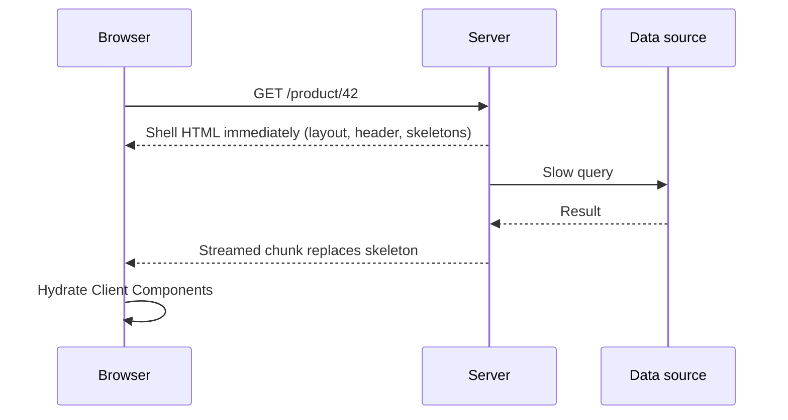
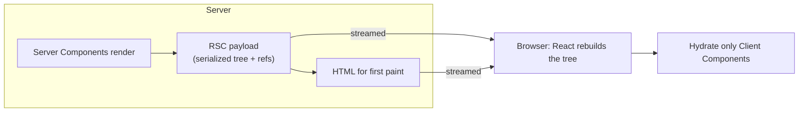
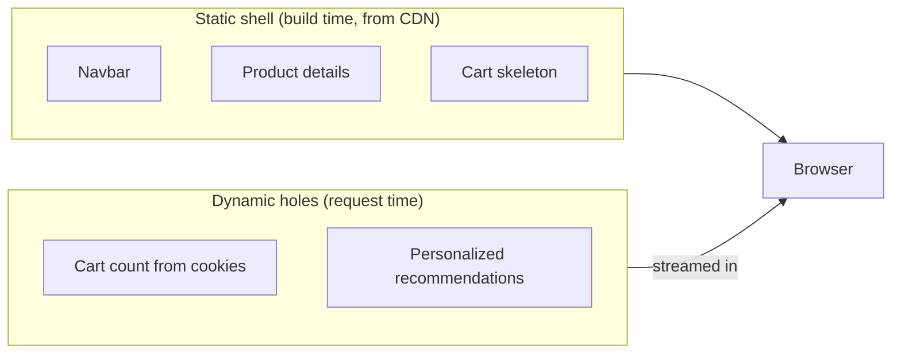

# 📘 Rendering and Server Components

This is the page interviewers care about most.
Next.js lets you choose, per route and even per component, **where** UI is rendered (server or browser) and **when** (build time or request time).
Server Components are the part that confuses people coming from classic SSR, so this page separates the two ideas clearly.

## Table of Contents

1. [The Rendering Spectrum](#1-the-rendering-spectrum)
2. [Static vs Dynamic Rendering](#2-static-vs-dynamic-rendering)
3. [React Server Components](#3-react-server-components)
4. [The use client Boundary](#4-the-use-client-boundary)
5. [Composition Patterns](#5-composition-patterns)
6. [Serialization Rules](#6-serialization-rules)
7. [Streaming and Suspense](#7-streaming-and-suspense)
8. [Hydration](#8-hydration)
9. [Partial Prerendering](#9-partial-prerendering)
10. [Runtimes: Node.js and Edge](#10-runtimes-nodejs-and-edge)
11. [Choosing a Strategy](#11-choosing-a-strategy)
12. [Questions](#12-questions)

---

## 1. The Rendering Spectrum

| Strategy | Where / when HTML is made | First paint | Data freshness | Use for |
| --- | --- | --- | --- | --- |
| **CSR** (client-side rendering) | Browser, after JS loads | Slow (blank, then spinner) | Fresh per visit | Logged-in dashboards, highly interactive widgets |
| **SSR** (server-side rendering) | Server, on every request | Fast | Always fresh | Personalized or frequently changing pages |
| **SSG** (static generation) | Build time | Fastest (CDN file) | Stale until rebuild | Marketing pages, docs, blog posts |
| **ISR** (incremental static regeneration) | Build time, regenerated in the background | Fastest | Stale up to a window, then refreshed | Catalogs, articles, listings |
| **Streaming SSR** | Server, in chunks as data resolves | Fast shell, progressive content | Fresh | Pages with slow data parts |



- In the App Router you do not pick one mode per page with special functions.
  The mode is **inferred** from what the route does: reading request data or uncached data makes it dynamic, otherwise it is prerendered.
- You can mix modes inside one page: a static shell with a dynamic, streamed section (Partial Prerendering).
- CSR still exists: a Client Component that fetches in `useEffect` or with TanStack Query is client rendered, and that is fine for data that is private and not SEO relevant.

---

## 2. Static vs Dynamic Rendering

A route is **static** when Next.js can render it at build time (or on first request and cache it) without request-specific information.
It becomes **dynamic** (rendered per request) when it uses a **dynamic API** or uncached data.

| Triggers dynamic rendering | Notes |
| --- | --- |
| `cookies()`, `headers()`, `connection()` | Request-specific data |
| `searchParams` prop on a page | Depends on the query string |
| `params` for a path not listed in `generateStaticParams` and `dynamicParams` enabled | Rendered on first request, then can be cached |
| Uncached `fetch` or database query in current versions | Runs per request unless cached with `"use cache"` |
| `export const dynamic = 'force-dynamic'` | Explicit opt-out of caching (route segment config) |
| `unstable_noStore()` / `noStore()` (older) | Opt a component out of static rendering |

```tsx
// Static: nothing request specific, built once
export default async function Page() {
  const posts = await getPublishedPosts(); // cached (see Data Fetching and Caching)
  return <PostList posts={posts} />;
}
```

```tsx
// Dynamic: reads cookies, so it renders on every request
import { cookies } from 'next/headers';

export default async function Page() {
  const theme = (await cookies()).get('theme')?.value ?? 'light';
  return <Themed theme={theme} />;
}
```

- `next build` prints a table: `○` static, `●` SSG with params, `ƒ` dynamic, and a partial-prerender marker when using Cache Components.
- One dynamic API anywhere in a route (including a layout) makes the whole route dynamic unless the dynamic part is isolated behind `Suspense`.
- Static output is served from a CDN or the cache without running your code, which is why it is the cheapest and fastest option.
- To make a dynamic-looking page static again, move request-specific reading into a small Client Component, or cache the data, or stream the dynamic part.

---

## 3. React Server Components

A **Server Component (RSC)** is a React component that runs **only on the server** (at build time or request time).
It is not "SSR".
SSR turns Client Components into HTML and then ships their JavaScript for hydration.
RSC components **never ship their JavaScript** and never hydrate.

```tsx
// app/products/page.tsx  (Server Component by default)
import { db } from '@/lib/db';
import { AddToCart } from './AddToCart'; // a Client Component

export default async function Products() {
  const products = await db.product.findMany(); // direct DB access, no API layer
  return (
    <ul>
      {products.map((p) => (
        <li key={p.id}>
          {p.name} <AddToCart id={p.id} />
        </li>
      ))}
    </ul>
  );
}
```



| | Server Component | Client Component |
| --- | --- | --- |
| Default in App Router | **Yes** | No, needs `'use client'` |
| Runs | Server only (build or request) | Server (pre-render) **and** browser |
| JS sent to browser | None for itself | Yes |
| Can be `async` and `await` data | Yes | No |
| Hooks like `useState`, `useEffect` | No | Yes |
| Event handlers (`onClick`) | No | Yes |
| Browser APIs (`window`, `localStorage`) | No | Yes (inside effects or handlers) |
| Direct DB, secrets, file system | Yes | No |
| Can import the other kind | Imports Client Components | Cannot import Server Components (can receive them as `children`) |

What the **RSC payload** is:

- A compact, streamable description of the rendered React tree.
- Server Component output is already resolved into elements; Client Components appear as **references** (module id plus props).
- On the first load the HTML is used for instant display and the payload is used to hydrate and build the React tree.
- On client navigation only the payload for the changed segments is fetched, and React merges it into the existing tree, preserving client state in layouts.

Why RSC exists:

- **Smaller bundles:** heavy libraries used only for rendering (markdown, syntax highlighting, date formatting) stay on the server.
- **No client-server waterfalls:** the component fetches data next to where it renders, close to the database.
- **Security:** secrets and data-access code never reach the browser.
- **Streaming:** each Suspense boundary can resolve independently.

---

## 4. The use client Boundary

```tsx
// components/Counter.tsx
'use client';

import { useState } from 'react';

export function Counter() {
  const [n, setN] = useState(0);
  return <button onClick={() => setN(n + 1)}>{n}</button>;
}
```

- `'use client'` at the **top of a file** marks that file as the **entry to the client bundle**.
  Everything that file imports also becomes client code.
  You do not add the directive to every child.
- It marks a **module boundary**, not a component type: `children` passed *into* a Client Component from a Server Component stay Server Components.
- `'use server'` is a different directive: it marks **Server Actions** (functions callable from the client), not Server Components.
- Client Components are still **pre-rendered to HTML on the server** on first load, then hydrated, so they are not "browser only".
- Keep the boundary as low (close to leaves) as possible so the rest of the tree stays on the server.

Wrong vs right:

```tsx
// Whole page client rendered just for one button
'use client';
export default function Page() { /* big tree + one onClick */ }

// Page stays a Server Component; only the button is a client island
export default function Page() {
  return (
    <>
      <HeavyServerContent />
      <LikeButton />   {/* 'use client' lives in this file only */}
    </>
  );
}
```

Third-party components that use hooks but lack the directive fail in Server Components.
Wrap them in your own `'use client'` file and re-export.

```tsx
'use client';
export { Carousel } from 'some-carousel-lib';
```

---

## 5. Composition Patterns

### 5.1 Passing Server Components as children

```tsx
// ClientShell.tsx
'use client';
export function ClientShell({ children }: { children: React.ReactNode }) {
  const [open, setOpen] = useState(true);
  return open ? <aside>{children}</aside> : null;
}

// page.tsx  (Server Component)
<ClientShell>
  <ServerSidebarWithDbData />   {/* still rendered on the server */}
</ClientShell>
```

- Importing a Server Component inside a Client Component file would turn it into client code.
  Passing it as `children` or another JSX prop keeps it on the server.
- This is the key pattern for providers, modals, tabs, and layouts with interactivity.

### 5.2 Context providers

```tsx
// app/providers.tsx
'use client';
import { ThemeProvider } from 'next-themes';
import { QueryClient, QueryClientProvider } from '@tanstack/react-query';
import { useState } from 'react';

export function Providers({ children }: { children: React.ReactNode }) {
  const [client] = useState(() => new QueryClient());
  return (
    <QueryClientProvider client={client}>
      <ThemeProvider attribute="class">{children}</ThemeProvider>
    </QueryClientProvider>
  );
}

// app/layout.tsx stays a Server Component
<body><Providers>{children}</Providers></body>
```

- Context is **not available in Server Components**.
  Render providers as deep as practical so the rest can remain server-rendered.
- Server Components share data by fetching again with a cached function (see `cache()` in [Data Fetching and Caching](/docs/nextjs/data-fetching-and-caching)), not through context.

### 5.3 Passing data from server to client

```tsx
// Server
const user = await getUser();
return <ProfileForm initial={{ name: user.name, email: user.email }} />;
```

- Pass only the fields the client needs, never whole database rows (they may contain secrets and inflate the payload).
- Props are serialized into the payload, which is visible in the page source.

### 5.4 Keeping server-only code out

```ts
import 'server-only';
```

- Importing a file marked `server-only` from a Client Component is a build error.
- `client-only` is the counterpart for code that must not run on the server.
- `experimental_taintObjectReference` / `taintUniqueValue` can flag values that must never be passed to the client.

### 5.5 Sharing code between worlds

- Pure utility functions can be imported anywhere.
- A module with no directive is "shared": it adopts the environment of whoever imports it.
- Avoid putting `window` access at module scope in shared code.

---

## 6. Serialization Rules

Props crossing from a Server Component to a Client Component, and arguments and return values of Server Actions, must be **serializable by React**.

| Allowed | Not allowed |
| --- | --- |
| Strings, numbers, booleans, `null`, `undefined`, `bigint` | Functions (except Server Actions marked `'use server'`) |
| Plain objects and arrays of allowed values | Class instances (methods are lost or it throws) |
| `Date`, `Map`, `Set`, `URL`, typed arrays | Symbols, DOM nodes, event objects |
| Promises (can be unwrapped with `use()` on the client) | Anything with circular non-React references |
| JSX / React elements | Values containing secrets you do not want exposed |
| Server Action references | Event handlers defined in a Server Component |

```tsx
// Error: Functions cannot be passed directly to Client Components
<Button onClick={() => doSomething()} />          // in a Server Component

// Fix: Server Action
<Button action={doSomethingAction} />            // 'use server' function

// Fix: move the handler into a Client Component
```

Passing a **Promise** to a client component:

```tsx
// Server: start fetching, do not await
const commentsPromise = getComments(id);
return <Suspense fallback={<Spinner />}><Comments promise={commentsPromise} /></Suspense>;

// Client
'use client';
import { use } from 'react';
export function Comments({ promise }: { promise: Promise<Comment[]> }) {
  const comments = use(promise);   // suspends until resolved
  return <List items={comments} />;
}
```

This starts the fetch on the server early, streams the result, and lets the client component stay interactive.

---

## 7. Streaming and Suspense

```tsx
// app/dashboard/page.tsx
import { Suspense } from 'react';

export default function Dashboard() {
  return (
    <>
      <Header />                                  {/* instant */}
      <Suspense fallback={<RevenueSkeleton />}>
        <Revenue />                               {/* slow query, streams in */}
      </Suspense>
      <Suspense fallback={<FeedSkeleton />}>
        <ActivityFeed />                          {/* independent, streams in */}
      </Suspense>
    </>
  );
}
```

- `loading.tsx` in a segment is sugar for wrapping that segment's `page` in `<Suspense fallback={<Loading />}>`.
- Finer `Suspense` boundaries around specific slow components give better UX than one big page spinner.
- Independent boundaries load in **parallel** and appear as each resolves, which avoids the all-or-nothing wait of old SSR.
- The status code is sent with the shell (`200`); errors after streaming begins are handled by error boundaries, and `notFound()` after streaming starts renders the not-found UI without changing the status code (use it before streaming or in a layout for correct 404 status).
- Streaming needs a runtime and proxy chain that does not buffer responses (check the CDN or reverse proxy config).
- Meaningful skeletons that match final dimensions prevent layout shift.

```tsx
// app/dashboard/loading.tsx
export default function Loading() {
  return <DashboardSkeleton />;
}
```

---

## 8. Hydration

**Hydration** attaches event handlers and state to the server-rendered HTML so Client Components become interactive.

- Only Client Components hydrate; Server Component output is plain HTML plus payload data.
- React hydrates Suspense boundaries independently and **prioritizes the part the user interacts with**, so a slow boundary does not block the rest.
- A **hydration mismatch** happens when the HTML from the server differs from the first client render.

| Common cause | Fix |
| --- | --- |
| `new Date()`, `Math.random()`, `Date.now()` in render | Compute on the server and pass down, or set in `useEffect` |
| `typeof window !== 'undefined'` branches in render | Use `useEffect` or `useSyncExternalStore` with a server snapshot |
| Reading `localStorage` in render | Read it after mount |
| Browser extensions altering the DOM | `suppressHydrationWarning` on the affected element (only that element) |
| Invalid HTML nesting (`<p>` in `<p>`, `<div>` in `<p>`) | Fix the markup |
| Different locale or timezone formatting server vs client | Format with a fixed locale/timezone or render after mount |

```tsx
'use client';
import { useEffect, useState } from 'react';

export function LocalTime({ iso }: { iso: string }) {
  const [text, setText] = useState(() => new Date(iso).toISOString()); // same on server and first client render
  useEffect(() => setText(new Date(iso).toLocaleString()), [iso]);
  return <time dateTime={iso}>{text}</time>;
}
```

- Less client JavaScript means less hydration work, which improves Interaction to Next Paint.
- Server Components can render `Date` formatting safely because they never rerun on the client.

---

## 9. Partial Prerendering

Static pages are fast but cannot personalize.
Dynamic pages can personalize but lose the CDN-fast shell.
**Partial Prerendering (PPR)** gives you both in one route: a **static shell** prerendered at build time and served instantly, with **dynamic holes** streamed in on the same response.



In current versions PPR is delivered through **Cache Components**:

```ts
// next.config.ts
const nextConfig: NextConfig = { cacheComponents: true };
```

```tsx
import { Suspense } from 'react';
import { cookies } from 'next/headers';

export default function ProductPage() {
  return (
    <>
      <ProductDetails />                    {/* uses "use cache": part of the static shell */}
      <Suspense fallback={<CartSkeleton />}>
        <CartCount />                       {/* reads cookies(): dynamic hole */}
      </Suspense>
    </>
  );
}

async function CartCount() {
  const id = (await cookies()).get('cart')?.value;
  return <span>{await getCartCount(id)}</span>;
}
```

- Anything dynamic **must** sit inside a `Suspense` boundary (or be cached) when Cache Components is on, otherwise the build errors, which makes accidental dynamic rendering visible.
- The mental model flips: with Cache Components, code is dynamic by default unless you opt into caching with `"use cache"`.
  Details in [Data Fetching and Caching](/docs/nextjs/data-fetching-and-caching).

---

## 10. Runtimes: Node.js and Edge

| | Node.js runtime | Edge runtime |
| --- | --- | --- |
| Default | **Yes** | Opt-in per route (`export const runtime = 'edge'`) |
| APIs | All Node APIs, native modules, most npm packages | Web-standard subset only (fetch, Request, Response, Web Crypto) |
| Cold start | Slower | Very fast |
| Location | Region (or serverless region) | Near the user |
| Use for | Almost everything, DB drivers, auth libraries | Lightweight latency-sensitive logic |

- Heavy work, TCP database drivers, and Node-only libraries need the Node.js runtime.
- Edge has size limits and no file system; many ORMs require adapters or HTTP drivers.
- `proxy.ts` (formerly middleware) runs on the Node.js runtime in current versions.
- Choose Edge only with a measured reason; Node is the safe default.

---

## 11. Choosing a Strategy

| Situation | Choose |
| --- | --- |
| Blog, docs, marketing | Static (SSG) with ISR or tag revalidation |
| Product page: stable details, per-user price or cart | Static shell with dynamic holes (PPR / Cache Components) |
| Search results page | Dynamic SSR keyed by query, or client fetch with a static shell |
| Logged-in dashboard | Dynamic Server Components with Suspense, or CSR with TanStack Query for highly interactive parts |
| Real-time feed or chat | Client Component with WebSocket / SSE, Server Component for the initial snapshot |
| Admin tool, no SEO | Dynamic, or SPA-style Client Components behind auth |
| Rarely changing but on-demand fresh | Static plus `revalidateTag` from a webhook or Server Action |

Rules of thumb:

- Render as much as possible on the server and statically, and make the dynamic portion as small as possible.
- Push interactivity to small Client Component leaves.
- Prefer streaming (`Suspense`) over blocking the whole page on the slowest query.
- Cache data explicitly and document the revalidation trigger.

---

## 12. Questions

**Q: Is SSR the same as React Server Components?**
No.
SSR renders components to HTML on the server and then ships their JavaScript to hydrate them in the browser.
RSC components run only on the server, ship no JavaScript, and never hydrate.
In Next.js you usually get both: Client Components are server rendered *and* hydrated, Server Components are server rendered only.

**Q: Where does `'use client'` go and what does it do?**
At the top of a file.
It marks the file as a client entry point, so it and everything it imports become part of the client bundle.
It does not make a component "browser-only": it still pre-renders on the server first.

**Q: Can a Client Component import a Server Component?**
Not directly: the import would convert it to client code.
You can pass a Server Component as `children` or a prop from a parent Server Component.

**Q: How do you share state between Server Components?**
There is no context on the server.
Fetch where needed using a request-scoped cached function (`React.cache`) or `fetch` memoization, and pass props down.

**Q: What causes a hydration mismatch?**
Server HTML differing from the first client render: dates, random values, `window` checks, locale differences, invalid nesting, or extensions mutating the DOM.
Fix by making the first client render match, then updating in an effect.

**Q: What triggers dynamic rendering?**
Reading `cookies()`, `headers()`, `searchParams`, or `connection()`, using uncached data (with Cache Components), or `force-dynamic`.
Isolate dynamic parts behind `Suspense` to keep a static shell.

**Q: What is streaming and why does it help?**
The server sends HTML in chunks as each Suspense boundary resolves.
Users see the shell and fast parts immediately and slow parts appear later, improving TTFB and perceived performance versus waiting for all data.

**Q: What is Partial Prerendering?**
A route that serves a static prerendered shell instantly and streams dynamic content into holes marked by `Suspense`, in a single response.
It removes the old static-or-dynamic trade-off per page.

**Q: When would you use the Edge runtime?**
Rarely: lightweight, latency-sensitive logic that uses only web APIs.
Node.js is the default because it supports full Node APIs, database drivers, and most libraries.
