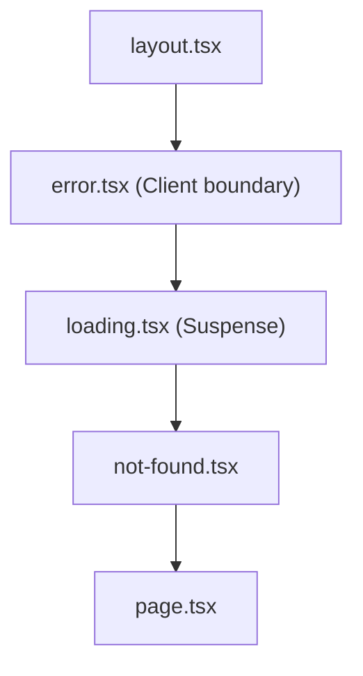
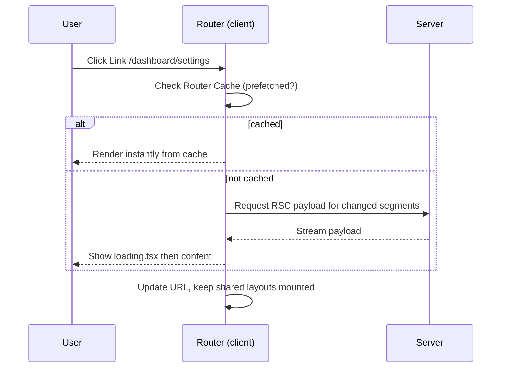

# 📘 Routing and Navigation

Routing in the App Router is **folder structure**.
The interesting parts are what the folder names can express (dynamic segments, groups, slots, interceptors) and how navigation behaves on the client: layouts persist, only changed segments fetch, and prefetching makes it feel instant.

## Table of Contents

1. [Segments and Dynamic Routes](#1-segments-and-dynamic-routes)
2. [Params and Search Params](#2-params-and-search-params)
3. [Route Groups and Private Folders](#3-route-groups-and-private-folders)
4. [Static Params](#4-static-params)
5. [Loading, Error, and Not Found](#5-loading-error-and-not-found)
6. [Parallel Routes](#6-parallel-routes)
7. [Intercepting Routes and Modals](#7-intercepting-routes-and-modals)
8. [Redirects, Rewrites, and Headers](#8-redirects-rewrites-and-headers)
9. [Client Navigation Behavior](#9-client-navigation-behavior)
10. [Internationalization](#10-internationalization)
11. [Typed Routes and Organization](#11-typed-routes-and-organization)
12. [Questions](#12-questions)

---

## 1. Segments and Dynamic Routes

| Folder | URL | Matches |
| --- | --- | --- |
| `app/blog/page.tsx` | `/blog` | Exactly `/blog` |
| `app/blog/[slug]/page.tsx` | `/blog/hello` | One dynamic segment |
| `app/shop/[...slug]/page.tsx` | `/shop/a`, `/shop/a/b/c` | **Catch-all**, one or more segments (not `/shop`) |
| `app/docs/[[...slug]]/page.tsx` | `/docs`, `/docs/a`, `/docs/a/b` | **Optional** catch-all, also matches the base |
| `app/(marketing)/about/page.tsx` | `/about` | Route group, folder name not in URL |
| `app/_components/Foo.tsx` | none | Private folder, never routable |
| `app/@modal/...` | none | Parallel route **slot** |
| `app/(.)photo/[id]/page.tsx` | intercepted | Intercepting route |

Priority when several match: static segments beat dynamic, dynamic beats catch-all, catch-all beats optional catch-all.

```tsx
// app/blog/[slug]/page.tsx
export default async function Post({ params }: { params: Promise<{ slug: string }> }) {
  const { slug } = await params;
  const post = await getPost(slug);
  if (!post) notFound();
  return <article>{post.title}</article>;
}
```

---

## 2. Params and Search Params

In current versions `params` and `searchParams` are **Promises**, because reading them can make rendering dynamic.
Synchronous access was a temporary compatibility layer and is removed.

```tsx
type Props = {
  params: Promise<{ slug: string }>;
  searchParams: Promise<{ [key: string]: string | string[] | undefined }>;
};

export default async function Page({ params, searchParams }: Props) {
  const { slug } = await params;
  const { page = '1', sort } = await searchParams;
  // ...
}
```

| Where | How to read |
| --- | --- |
| Server `page` / `layout` / `route` | `await params`, `await searchParams` (page only) |
| Client Component | `useParams()`, `useSearchParams()`, `usePathname()` |
| Client Component needing the Promise | `use(params)` from React |
| `generateMetadata` | `await params` |

- `searchParams` is only available in **`page`**, not `layout` (layouts do not re-render on navigation).
- Using `searchParams` makes the page **dynamic**.
  For filters in a mostly static page, read them in a Client Component with `useSearchParams` inside `Suspense`.
- `params` values for catch-all routes are string **arrays**.
- Codemods and the generated `PageProps<'/blog/[slug]'>` / `LayoutProps` helpers give type-safe props without hand-writing types.

State in the URL is a first-class pattern:

```tsx
'use client';
import { useRouter, usePathname, useSearchParams } from 'next/navigation';

export function SortSelect() {
  const router = useRouter();
  const pathname = usePathname();
  const params = useSearchParams();

  function onChange(value: string) {
    const next = new URLSearchParams(params);
    next.set('sort', value);
    router.replace(`${pathname}?${next}`);
  }
  return <select defaultValue={params.get('sort') ?? 'new'} onChange={(e) => onChange(e.target.value)}>...</select>;
}
```

- Filters, sorting, pagination, and tabs belong in the URL: shareable, bookmarkable, back-button friendly, and readable by the server.

---

## 3. Route Groups and Private Folders

```
app/
  (marketing)/
    layout.tsx        marketing layout
    page.tsx          "/"
    pricing/page.tsx  "/pricing"
  (app)/
    layout.tsx        authenticated app shell
    dashboard/page.tsx
  _lib/               private, ignored by routing
```

- `(group)` folders organize code and let **different sections use different layouts** without affecting the URL.
- Multiple root layouts: if each group has its own `layout.tsx` with `<html>`, navigating between groups does a **full page load**.
- Two groups must not resolve to the same URL (`(a)/about` and `(b)/about` conflict).
- `_folder` opts a folder (and its children) out of routing; `%5Ffolder` can express a literal underscore.

---

## 4. Static Params

```tsx
// app/blog/[slug]/page.tsx
export async function generateStaticParams() {
  const posts = await getAllPosts();
  return posts.map((p) => ({ slug: p.slug }));
}

export const dynamicParams = true; // default: unknown slugs render on demand, then cache
```

- `generateStaticParams` tells Next.js which dynamic paths to **prerender at build time**.
- `dynamicParams = true` (default): other values are rendered on first request and then cached like static pages (on-demand ISR).
- `dynamicParams = false`: unknown values return **404**.
- With Cache Components, at least one param set (or runtime fallback strategy) must be provided so the build can validate that the route is prerenderable.
- Nested dynamic routes: a child's `generateStaticParams` receives the parent's `params` and can return only the remaining segments.
- Build-time requests to your data source happen once per path, so batch or use a cached loader to avoid thousands of calls.

---

## 5. Loading, Error, and Not Found



```tsx
// app/dashboard/error.tsx
'use client';

export default function Error({ error, reset }: { error: Error & { digest?: string }; reset: () => void }) {
  return (
    <div role="alert">
      <p>Something went wrong.</p>
      <button onClick={() => reset()}>Try again</button>
    </div>
  );
}
```

```tsx
// app/blog/[slug]/not-found.tsx
export default function NotFound() {
  return <p>Post not found.</p>;
}
// Trigger with: import { notFound } from 'next/navigation'; notFound();
```

| File | Catches / does | Notes |
| --- | --- | --- |
| `loading.tsx` | Shows while the segment's async content resolves | Instant, part of prefetch; keep it small and matching layout |
| `error.tsx` | Runtime errors in the segment and below (not its own layout) | Client Component; `reset()` re-renders the segment |
| `global-error.tsx` | Errors in the root layout | Must define its own `<html>` and `<body>` |
| `not-found.tsx` | `notFound()` calls and unmatched URLs (root one) | Returns a 404 status when thrown before streaming starts |
| `unauthorized.tsx` / `forbidden.tsx` | `unauthorized()` (401) and `forbidden()` (403) | Opt-in feature for auth failures |

- In production, error messages from Server Components are **redacted** to avoid leaking details; the client receives a `digest` that you match against server logs.
- Errors thrown in **event handlers** are not caught by error boundaries; handle them with `try/catch`.
- Expected errors (validation, "not found") should be **returned values** from Server Actions, not thrown; reserve `throw` for unexpected failures.

---

## 6. Parallel Routes

A **slot** is a folder named `@name`.
Slots are passed to the parent layout as props and render side by side, each with its own loading and error states.

```
app/dashboard/
  layout.tsx
  page.tsx
  @analytics/
    page.tsx
    loading.tsx
  @team/
    page.tsx
    error.tsx
    default.tsx
```

```tsx
// app/dashboard/layout.tsx
export default function Layout({
  children,
  analytics,
  team,
}: {
  children: React.ReactNode;
  analytics: React.ReactNode;
  team: React.ReactNode;
}) {
  return (
    <>
      {children}
      <section className="grid grid-cols-2">{analytics}{team}</section>
    </>
  );
}
```

- Slots stream and fail **independently**, so one slow widget does not block the others.
- They enable conditional rendering of slots (for example show `@admin` only for admins by reading the session in the layout).
- On client navigation, Next.js keeps each slot's active state; on a **hard navigation** (reload or direct URL) a slot that cannot be matched falls back to `default.tsx`.
  A missing `default.tsx` yields a 404 (and in current versions the build requires it).
- Tabs inside a slot can have their own nested routes, giving independently navigable panels.

---

## 7. Intercepting Routes and Modals

Intercepting routes load a route **inside the current layout** during client navigation, while a direct visit or refresh shows the full page.
This is how Instagram-style "photo modal over the feed" works.

| Convention | Intercepts |
| --- | --- |
| `(.)folder` | Same level |
| `(..)folder` | One level up (by route segment, not file system) |
| `(..)(..)folder` | Two levels up |
| `(...)folder` | From the app root |

```
app/
  feed/
    page.tsx                      feed
  photo/[id]/
    page.tsx                      full photo page (direct URL / refresh)
  @modal/
    default.tsx                   returns null
    (.)photo/[id]/page.tsx        photo rendered in a modal over the feed
  layout.tsx                      renders {children} and {modal}
```

```tsx
// app/@modal/(.)photo/[id]/page.tsx
import { Modal } from '@/components/Modal';

export default async function PhotoModal({ params }: { params: Promise<{ id: string }> }) {
  const { id } = await params;
  return <Modal><Photo id={id} /></Modal>;
}
```

```tsx
// components/Modal.tsx
'use client';
import { useRouter } from 'next/navigation';

export function Modal({ children }: { children: React.ReactNode }) {
  const router = useRouter();
  return (
    <div role="dialog" aria-modal="true" onClick={() => router.back()}>
      <div onClick={(e) => e.stopPropagation()}>{children}</div>
    </div>
  );
}
```

- The URL changes to `/photo/42`, so the modal is **shareable**: opening that URL directly shows the full page.
- Close with `router.back()` so history stays consistent.
- Requires a `default.tsx` returning `null` in the slot so non-matching states render nothing.
- Interview angle: "modal with a real URL" is the canonical use case.

---

## 8. Redirects, Rewrites, and Headers

| Mechanism | Where | Use for |
| --- | --- | --- |
| `redirect()` / `permanentRedirect()` | Server Components, Actions, Route Handlers | Redirect after a mutation or failed auth check |
| `redirects()` in `next.config.ts` | Config | Static, known URL changes (301 / 308 for SEO) |
| `rewrites()` in `next.config.ts` | Config | Proxy to another backend or alias a URL without changing the browser URL |
| `proxy.ts` | Request pipeline | Dynamic decisions: auth gating, locale, A/B, geo |
| `headers()` in `next.config.ts` | Config | Security headers, cache headers |

```ts
// next.config.ts
const nextConfig: NextConfig = {
  async redirects() {
    return [{ source: '/old-blog/:slug', destination: '/blog/:slug', permanent: true }];
  },
  async rewrites() {
    return [{ source: '/api/legacy/:path*', destination: 'https://legacy.example.com/:path*' }];
  },
};
```

- `redirect()` uses `307` (temporary) in Server Components and `303` in Server Actions; `permanentRedirect()` uses `308`.
- Redirects in `next.config` run before the filesystem; rewrites keep the visible URL unchanged.
- Never call `redirect()` inside `try`; it works by throwing, and a `catch` would swallow it.

---

## 9. Client Navigation Behavior

What happens on a `Link` click:



- **Layouts are preserved**: only segments that differ are fetched and re-rendered, and client state in shared layouts survives.
- **Prefetching** runs for visible `Link`s in production.
  Static routes prefetch the full payload, dynamic routes prefetch down to the nearest `loading.tsx`.
- The **client Router Cache** keeps visited and prefetched segments in memory for the session; in current versions page segments are not reused stale by default, so back/forward and fresh navigations behave predictably.
- `router.refresh()` re-fetches the current route's server output (new data) without losing client state like input values.
- Scroll: new page navigations scroll to top; back/forward restores position; `scroll={false}` on `Link` opts out.
- Browser **back/forward** restores from history without re-running Server Components when cached.
- `router.prefetch(href)` prefetches imperatively, for example on hover for non-`Link` elements.

Differences worth noting versus an SPA router:

| | SPA router | Next.js App Router |
| --- | --- | --- |
| Data on navigation | Client fetches JSON | Server sends RSC payload for changed segments |
| Layout state | Re-render by default | Layouts persist |
| Loading UI | Your own spinner logic | `loading.tsx` Suspense boundary, prefetched |
| Code splitting | You configure lazy routes | Automatic per route and per Client Component entry |

---

## 10. Internationalization

Next.js gives you routing primitives, you bring the library (`next-intl`, `Lingui`, or `i18next`).

```
app/
  [locale]/
    layout.tsx        sets <html lang={locale}>
    page.tsx
    about/page.tsx
```

```ts
// proxy.ts: detect locale and redirect "/" -> "/en"
import { NextResponse, type NextRequest } from 'next/server';

const locales = ['en', 'fr', 'de'];

export function proxy(request: NextRequest) {
  const { pathname } = request.nextUrl;
  if (locales.some((l) => pathname === `/${l}` || pathname.startsWith(`/${l}/`))) return;
  const locale = negotiateLocale(request.headers.get('accept-language'), locales) ?? 'en';
  return NextResponse.redirect(new URL(`/${locale}${pathname}`, request.url));
}

export const config = { matcher: ['/((?!_next|api|.*\\..*).*)'] };
```

- Locale in the **path** (`/fr/...`) is best for SEO and CDN caching; add `alternates.languages` metadata (`hreflang`).
- `generateStaticParams` in `[locale]` prerenders every locale.
- Load only the messages the page needs on the server; do not ship every translation to the client.
- Format dates and numbers with `Intl` using an explicit locale and time zone to avoid hydration mismatches.
- Right-to-left languages need `dir="rtl"` on `<html>`.

---

## 11. Typed Routes and Organization

```ts
// next.config.ts
const nextConfig: NextConfig = { typedRoutes: true };
```

- With typed routes, `<Link href="/typo">` and `router.push` get compile-time checking against your real route list.
- Generated helpers like `PageProps<'/blog/[slug]'>` type `params` automatically.

Organization patterns:

| Pattern | Layout |
| --- | --- |
| **Colocation** | Keep `_components`, `actions.ts`, `queries.ts`, and tests beside the route that owns them |
| **Feature folders** | `features/billing/` holds UI, actions, and data access; `app/` only wires routes to features |
| **Thin routes** | `page.tsx` parses params, calls a data function, renders a feature component |
| **Route groups for shells** | `(marketing)`, `(app)`, `(auth)` each with own layout |

---

## 12. Questions

**Q: How do you create a dynamic route and read its parameter?**
Name the folder `[slug]`, and in `page.tsx` do `const { slug } = await params`.
In a Client Component use `useParams()`.

**Q: Difference between `[slug]`, `[...slug]`, and `[[...slug]]`?**
Single segment; one or more segments as an array; zero or more segments (also matches the base route).

**Q: Why are `params` and `searchParams` Promises?**
Reading them can make a route dynamic, and Promises let Next.js prerender what it can and start the dynamic work only when needed.

**Q: What are route groups for?**
Organizing routes and applying different layouts per section without changing URLs.

**Q: What are parallel routes and when do you use them?**
`@slot` folders rendered simultaneously as layout props with independent loading and error states.
Use for dashboards, conditional panels (role-based), and modals.

**Q: How do you build a modal that has its own URL?**
A parallel `@modal` slot with an intercepting route `(.)photo/[id]` that renders the modal on client navigation, plus a normal `photo/[id]` page for direct visits.
Close with `router.back()`.

**Q: What is `generateStaticParams`?**
It returns the param sets to prerender at build time.
With `dynamicParams = true` other values render on demand and are cached, with `false` they 404.

**Q: Redirect vs rewrite?**
A redirect changes the URL in the browser (3xx).
A rewrite serves different content while keeping the visible URL.

**Q: How does navigation stay fast?**
Prefetching visible links, streaming only changed segments, persistent layouts, and the client Router Cache.

**Q: How do you handle errors per route?**
`error.tsx` (Client Component with `reset`), `not-found.tsx` with `notFound()`, and `global-error.tsx` for root layout failures.
Return expected errors as values from actions.
