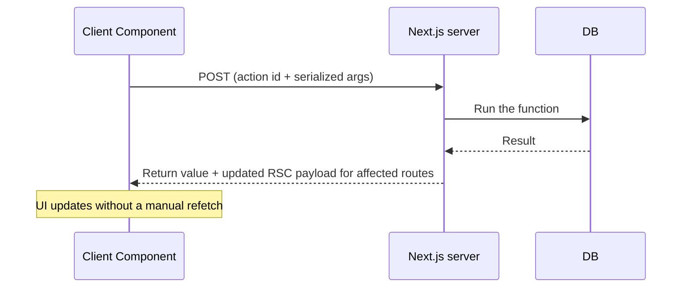

# 📘 Server Actions and Route Handlers

Next.js gives you two ways to run server code in response to the client: **Server Actions** (functions you call from components, for mutations) and **Route Handlers** (HTTP endpoints you define with `route.ts`).
Choosing correctly, and securing both, is a standard interview topic.

## Table of Contents

1. [Server Actions Basics](#1-server-actions-basics)
2. [Forms and Progressive Enhancement](#2-forms-and-progressive-enhancement)
3. [useActionState and Pending UI](#3-useactionstate-and-pending-ui)
4. [Validation and Error Handling](#4-validation-and-error-handling)
5. [Optimistic Updates](#5-optimistic-updates)
6. [Revalidation After Mutations](#6-revalidation-after-mutations)
7. [Calling Actions from Event Handlers](#7-calling-actions-from-event-handlers)
8. [Uploads](#8-uploads)
9. [Route Handlers](#9-route-handlers)
10. [Actions vs Route Handlers](#10-actions-vs-route-handlers)
11. [Security Model](#11-security-model)
12. [Questions](#12-questions)

---

## 1. Server Actions Basics

A **Server Action** is an async function marked with `'use server'` that runs on the server but can be invoked from the client.

```ts
// app/actions.ts
'use server';

import { revalidatePath } from 'next/cache';
import { db } from '@/lib/db';

export async function createTodo(formData: FormData) {
  const title = String(formData.get('title') ?? '');
  await db.todo.create({ data: { title } });
  revalidatePath('/todos');
}
```

Two places to put the directive:

| Placement | Effect |
| --- | --- |
| Top of a **file** | Every exported async function is a Server Action; file can be imported by Client Components |
| Inside a **function** body (in a Server Component) | That one function is an Action; closed-over values are encrypted and sent to the client |

How they work:



- The function body is **never sent to the browser**, the client receives only a reference (an encrypted action id).
- Each call is an HTTP `POST` handled by the framework; arguments and return values must be serializable.
- Actions run **sequentially per client** by default, so they are for writes, not for parallel reads.
- After an action that calls `revalidatePath`/`revalidateTag`/`updateTag`/`refresh`, the response includes updated server-rendered UI, so the page updates in one round trip.
- Actions are public endpoints (see [Security Model](#11-security-model)).

---

## 2. Forms and Progressive Enhancement

```tsx
// app/todos/page.tsx  (Server Component)
import { createTodo } from '@/app/actions';

export default function Page() {
  return (
    <form action={createTodo}>
      <input name="title" required />
      <button type="submit">Add</button>
    </form>
  );
}
```

- Passing a function to `<form action>` is a React 19 feature: React calls it with `FormData`.
- **Progressive enhancement:** in a Server Component form, it works even **before JavaScript loads** (a plain POST), then upgrades to client-side submission after hydration.
- Inputs are identified by `name`, read with `formData.get('title')`.
- After the action finishes, React **resets uncontrolled form fields** (use `useActionState` to preserve values on error).
- Extra arguments with `bind`:

```tsx
const updateTitle = updateTodo.bind(null, todo.id);   // action(id, formData)
<form action={updateTitle}>...</form>
```

- `next/form` (`<Form action="/search">`) gives GET forms client-side navigation with prefetching and preserved layouts, for search boxes and filters.

---

## 3. useActionState and Pending UI

```tsx
'use client';
import { useActionState } from 'react';
import { useFormStatus } from 'react-dom';
import { signup, type SignupState } from '@/app/actions';

const initial: SignupState = { ok: false, errors: {}, values: { email: '' } };

export function SignupForm() {
  const [state, formAction, isPending] = useActionState(signup, initial);
  return (
    <form action={formAction}>
      <input name="email" defaultValue={state.values.email} aria-invalid={!!state.errors.email} />
      {state.errors.email && <p role="alert">{state.errors.email}</p>}
      <SubmitButton />
      {isPending && <Spinner />}
    </form>
  );
}

function SubmitButton() {
  const { pending } = useFormStatus();    // must be rendered INSIDE the <form>
  return <button disabled={pending}>{pending ? 'Saving...' : 'Sign up'}</button>;
}
```

| Hook | Purpose |
| --- | --- |
| `useActionState(action, initialState)` | Returns `[state, formAction, isPending]`; the action receives `(prevState, formData)` |
| `useFormStatus()` | `pending`, `data`, `method` of the **parent form**; must be used in a child component of the form |
| `useOptimistic(state, reducer)` | Show an expected result immediately and roll back if it fails |
| `useTransition()` | Wrap non-form calls so you get `isPending` and avoid blocking input |

The matching action signature:

```ts
'use server';
export type SignupState = { ok: boolean; errors: Record<string, string>; values: { email: string } };

export async function signup(prev: SignupState, formData: FormData): Promise<SignupState> {
  // validate and return the next state
}
```

---

## 4. Validation and Error Handling

**Never trust the client.**
Even with client-side validation for UX, re-validate on the server.

```ts
'use server';
import { z } from 'zod';
import { redirect } from 'next/navigation';

const Schema = z.object({
  email: z.string().email(),
  password: z.string().min(12),
});

export async function signup(prev: SignupState, formData: FormData): Promise<SignupState> {
  const raw = Object.fromEntries(formData);
  const parsed = Schema.safeParse(raw);

  if (!parsed.success) {
    const errors = Object.fromEntries(
      parsed.error.issues.map((i) => [String(i.path[0]), i.message]),
    );
    return { ok: false, errors, values: { email: String(raw.email ?? '') } };
  }

  try {
    await createUser(parsed.data);
  } catch (e) {
    if (isUniqueViolation(e)) return { ok: false, errors: { email: 'Already registered' }, values: { email: parsed.data.email } };
    throw e;               // unexpected: goes to error.tsx
  }

  redirect('/welcome');    // outside try/catch
}
```

| Kind of failure | How to handle |
| --- | --- |
| Validation, "already exists", wrong password | **Return** a typed result; render inline |
| Authorization failure | Throw / call `unauthorized()` or `forbidden()`, or return an error value |
| Unexpected bug or infrastructure failure | `throw`; caught by `error.tsx`; logged on the server |
| Redirect after success | `redirect()` **outside** `try/catch` |

- Return a discriminated union (`{ ok: true, data } | { ok: false, errors }`) so the client can switch on it with type safety.
- Never return raw error messages or stack traces from the database to the client.
- Validation libraries: Zod, Valibot, or ArkType; share the schema with the client form (React Hook Form) for instant feedback.
- Wrapper helpers (a `safeAction` function that validates input, checks the session, and catches errors) remove repetition; libraries like `next-safe-action` package this.

---

## 5. Optimistic Updates

```tsx
'use client';
import { useOptimistic } from 'react';
import { addComment } from '@/app/actions';

export function Comments({ comments }: { comments: Comment[] }) {
  const [optimistic, addOptimistic] = useOptimistic(
    comments,
    (current, text: string) => [...current, { id: crypto.randomUUID(), text, pending: true }],
  );

  async function action(formData: FormData) {
    const text = String(formData.get('text'));
    addOptimistic(text);                       // show immediately
    await addComment(text);                    // real mutation; revalidation replaces optimistic state
  }

  return (
    <>
      <ul>{optimistic.map((c) => <li key={c.id} className={c.pending ? 'opacity-60' : ''}>{c.text}</li>)}</ul>
      <form action={action}><input name="text" /><button>Post</button></form>
    </>
  );
}
```

- Optimistic state is **temporary**: when the action settles and new props arrive, React replaces it, and if the action throws, it reverts automatically.
- Use stable client IDs for optimistic items so keys do not jump.
- Use it for likes, comments, todos, reordering: low-risk actions where the success rate is high.
- Do not use it for payments or anything irreversible.

---

## 6. Revalidation After Mutations

An action that mutates data must tell Next.js what became stale:

```ts
'use server';
import { updateTag, revalidatePath, refresh } from 'next/cache';
import { redirect } from 'next/navigation';

export async function updateProfile(formData: FormData) {
  await db.user.update(/* ... */);
  updateTag('profile');            // cached data tagged "profile" refreshes right now
  revalidatePath('/settings');     // or by path
  refresh();                       // uncached/dynamic data on the current route
  redirect('/settings');           // optional navigation
}
```

- `redirect()` after `revalidate*` is the standard "post-redirect-get" flow.
- Calling `cookies().set()` or `delete()` in an action also refreshes the current route so the UI reflects the new cookie.
- If the UI looks stale after an action, the bug is almost always **missing or mismatched revalidation**; see [Data Fetching and Caching](/docs/nextjs/data-fetching-and-caching).

---

## 7. Calling Actions from Event Handlers

Not everything is a form.
You can call an action from `onClick`, effects, or other handlers (they are just async functions).

```tsx
'use client';
import { useTransition } from 'react';
import { deleteTodo } from '@/app/actions';

export function DeleteButton({ id }: { id: string }) {
  const [isPending, startTransition] = useTransition();
  return (
    <button
      disabled={isPending}
      onClick={() => startTransition(async () => { await deleteTodo(id); })}
    >
      {isPending ? 'Deleting...' : 'Delete'}
    </button>
  );
}
```

- Wrap in `startTransition` so the UI stays responsive and you get `isPending`.
- Event-handler calls have **no progressive enhancement**; they need JavaScript.
- Because actions run one at a time per client, do not use them for fetching data or fast-firing calls like typeahead; use a Route Handler or a Server Component with search params.

---

## 8. Uploads

```tsx
<form action={uploadAvatar} encType="multipart/form-data">
  <input type="file" name="avatar" accept="image/*" />
  <button>Upload</button>
</form>
```

```ts
'use server';
export async function uploadAvatar(formData: FormData) {
  const file = formData.get('avatar');
  if (!(file instanceof File) || file.size === 0) return { error: 'No file' };
  if (file.size > 2 * 1024 * 1024) return { error: 'Max 2 MB' };
  if (!['image/png', 'image/jpeg', 'image/webp'].includes(file.type)) return { error: 'Invalid type' };
  // stream/upload to object storage
}
```

- Server Action request bodies have a default size limit (1 MB), configurable with `serverActions.bodySizeLimit` in `next.config.ts` (under `experimental` in older versions).
- For large files, **upload directly from the browser to object storage with a pre-signed URL**: it avoids passing bytes through your server, avoids function time and size limits, and scales better.
- Validate type by **content** (magic bytes), not only the `Content-Type` header, which the client controls.
- Scan or re-encode user uploads; never serve them from your own origin with executable types.

---

## 9. Route Handlers

A **Route Handler** is a `route.ts` file exporting functions named after HTTP methods.
It uses the standard Web `Request` and `Response` APIs.

```ts
// app/api/todos/route.ts
import { NextResponse } from 'next/server';

export async function GET(request: Request) {
  const { searchParams } = new URL(request.url);
  const limit = Number(searchParams.get('limit') ?? 20);
  const todos = await db.todo.findMany({ take: limit });
  return NextResponse.json(todos);
}

export async function POST(request: Request) {
  const body = await request.json();
  const parsed = TodoSchema.safeParse(body);
  if (!parsed.success) return NextResponse.json({ errors: parsed.error.flatten() }, { status: 400 });
  const todo = await db.todo.create({ data: parsed.data });
  return NextResponse.json(todo, { status: 201 });
}
```

```ts
// app/api/todos/[id]/route.ts
export async function DELETE(_req: Request, { params }: { params: Promise<{ id: string }> }) {
  const { id } = await params;
  await db.todo.delete({ where: { id } });
  return new Response(null, { status: 204 });
}
```

Key facts:

- Supported methods: `GET`, `POST`, `PUT`, `PATCH`, `DELETE`, `HEAD`, `OPTIONS`; unsupported ones return `405`.
- A `route.ts` cannot live in the same folder as a `page.tsx` for the same path.
- `GET` handlers are **not cached by default** in current versions; opt in with `export const dynamic = 'force-static'` or `"use cache"`.
- `params` is a Promise; read cookies and headers with `cookies()` and `headers()` from `next/headers` or from the request object.
- Use `NextResponse` helpers or plain `Response`; set status, headers, and cookies explicitly.

### 9.1 Typical uses

| Use | Notes |
| --- | --- |
| Public REST/JSON API | For mobile apps, third parties, or non-React clients |
| **Webhooks** (Stripe, GitHub, CMS) | Read the **raw body** for signature verification, respond quickly, do slow work asynchronously |
| OAuth callbacks | Exchange code for tokens, set cookies, redirect |
| Proxy to another service | Hide keys, add auth, normalize responses |
| Streaming responses | SSE, AI token streaming, file download |
| Generated files | RSS, sitemap, PDFs, images |

```ts
// Webhook with signature verification
export async function POST(req: Request) {
  const raw = await req.text();                              // exact bytes for the signature
  const sig = req.headers.get('stripe-signature')!;
  let event;
  try {
    event = stripe.webhooks.constructEvent(raw, sig, process.env.STRIPE_WEBHOOK_SECRET!);
  } catch {
    return new Response('Bad signature', { status: 400 });
  }
  await enqueue(event);                                       // process async, return fast
  return new Response('ok');
}
```

### 9.2 Streaming and Server-Sent Events

```ts
export async function GET() {
  const stream = new ReadableStream({
    async start(controller) {
      const enc = new TextEncoder();
      for (let i = 0; i < 5; i++) {
        controller.enqueue(enc.encode(`data: ${i}\n\n`));
        await new Promise((r) => setTimeout(r, 1000));
      }
      controller.close();
    },
  });
  return new Response(stream, { headers: { 'Content-Type': 'text/event-stream', 'Cache-Control': 'no-cache, no-transform' } });
}
```

- Platform and proxy buffering can break streaming; test behind the real CDN.
- Long-lived connections (WebSockets) are not supported by serverless functions; use a dedicated service or a custom server.

### 9.3 CORS

```ts
const cors = {
  'Access-Control-Allow-Origin': 'https://app.example.com',
  'Access-Control-Allow-Methods': 'GET,POST,OPTIONS',
  'Access-Control-Allow-Headers': 'Content-Type, Authorization',
};

export async function OPTIONS() { return new Response(null, { status: 204, headers: cors }); }
export async function GET() { return Response.json({ ok: true }, { headers: cors }); }
```

- Same-origin requests from your own app do not need CORS.
- Never use `*` with credentials; list explicit origins.
- Apply common headers from `proxy.ts` or `next.config` `headers()` for many routes.

---

## 10. Actions vs Route Handlers

| | Server Action | Route Handler |
| --- | --- | --- |
| Intended for | Mutations from your own UI | HTTP API for any client |
| Called by | React (forms, handlers) via framework POST | Any HTTP client |
| URL | Opaque, internal | Stable, documented |
| Methods | POST only | Any |
| Return | Serializable value; updates the UI automatically | Any `Response` |
| Progressive enhancement | Yes (with forms in Server Components) | N/A |
| Cache integration | Direct `revalidate*` calls, UI refresh included | Revalidate manually; client refetches |
| Concurrency | Sequential per client | Parallel |
| Good for | Create, update, delete, form submit | Webhooks, mobile API, streaming, file download, public endpoints |
| Versioning and contracts | Internal only | You can version it |

Decision guide:

- Form submitted from your Next.js UI: **Server Action**.
- Anyone else (mobile app, partner, webhook, cron): **Route Handler**.
- Reads for UI: **Server Component** (not either of these).
- Typeahead or polling from Client Components: a **Route Handler** or a Server Component keyed on search params.
- Business logic should live in a shared module (`lib/services/todos.ts`) called by both, so there is one place for rules and authorization.

---

## 11. Security Model

**Every Server Action is a public HTTP endpoint.**
Anyone who learns the action id can POST to it, whether or not your UI shows a button for it.

| Risk | Defense |
| --- | --- |
| Unauthenticated calls | Check the session **inside the action**, not just in the page that renders the button |
| Missing authorization (IDOR) | Verify the user owns or may act on the specific resource id, every time |
| Invalid input | Validate with a schema on the server; never trust hidden fields |
| CSRF | Actions only accept `POST`, and Next.js compares the `Origin` header to the host; configure `serverActions.allowedOrigins` when behind a proxy with a different host; use `SameSite` cookies |
| Leaking secrets through closures | Closed-over variables in inline actions are encrypted, but avoid capturing sensitive values; pass ids and re-fetch |
| Dead code exposure | Unused actions are pruned from the build, but do not rely on it; delete actions you no longer use |
| Rate limiting and abuse | Throttle by user and IP (Upstash, Redis) for login, signup, expensive actions |
| Large payloads | Limit body size; validate file size/type server-side |
| Over-sharing in return values | Return only what the client needs |

```ts
'use server';
export async function deletePost(postId: string) {
  const session = await getSession();                    // 1. authentication
  if (!session) unauthorized();
  const post = await db.post.findUnique({ where: { id: postId } });
  if (!post || post.authorId !== session.userId) forbidden();   // 2. authorization on the resource
  await db.post.delete({ where: { id: postId } });
  updateTag('posts');
}
```

- Hiding a button in the UI is not security.
- Apply the same checks in Route Handlers; they are even more directly exposed.
- More patterns (data access layer, sessions, CSP) are in [Auth, Security, and Proxy](/docs/nextjs/auth-security-and-proxy).

---

## 12. Questions

**Q: What is a Server Action?**
An async function with `'use server'` that runs on the server and can be called from the client.
Next.js turns it into a POST endpoint, serializes arguments, runs it, and returns the result plus updated UI for revalidated routes.

**Q: Are Server Actions secure by default?**
No.
They are public endpoints.
Authenticate, authorize against the specific resource, and validate input inside every action.

**Q: Server Action or Route Handler?**
Actions for mutations from your own UI, Route Handlers for APIs consumed by other clients, webhooks, streaming, and anything needing a stable URL or non-POST methods.

**Q: What is progressive enhancement here?**
A form posting to an action works without JavaScript (a native form POST) and upgrades to client-side submission once hydrated.

**Q: How do you show pending state?**
`useFormStatus` in a child of the form, `useActionState`'s `isPending`, or `useTransition` for non-form calls.

**Q: How do you show errors from an action?**
Return a typed result (`{ ok: false, errors }`) from validation or expected failures and read it with `useActionState`.
Throw only for unexpected errors so `error.tsx` handles them.

**Q: How do you do optimistic UI?**
`useOptimistic` to render the expected state immediately; it reverts if the action fails and is replaced by real data after revalidation.

**Q: Why can a Server Action feel slow when used for fetching?**
Actions are queued and run one at a time per client and are POSTs, so they cannot be cached or parallelized like reads.
Use Server Components or Route Handlers for reads.

**Q: How do you implement a Stripe webhook?**
A Route Handler `POST`: read `req.text()` for the raw body, verify the signature, respond fast with 2xx, process asynchronously, and make the handler idempotent by storing processed event ids.

**Q: How would you handle a 200 MB file upload?**
Do not pass it through a Server Action or Route Handler: issue a pre-signed URL from the server and upload directly from the browser to object storage (multipart or resumable), then record the object key in the database.
