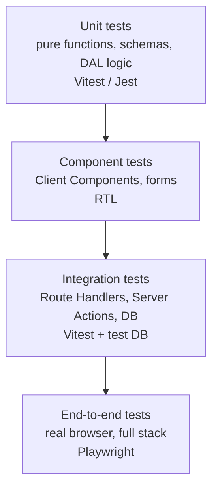

# 📘 Testing, Deployment, and Operations

A Next.js app is a server application as well as a front end.
That means tests have to cover server and client code, and operations (build, containers, caching across instances, monitoring) matter as much as in any backend service.

## Table of Contents

1. [Testing Strategy](#1-testing-strategy)
2. [Unit and Component Tests](#2-unit-and-component-tests)
3. [End-to-end Tests with Playwright](#3-end-to-end-tests-with-playwright)
4. [Mocking and Test Data](#4-mocking-and-test-data)
5. [CI Pipeline](#5-ci-pipeline)
6. [Deployment Options](#6-deployment-options)
7. [Self-hosting with Docker](#7-self-hosting-with-docker)
8. [Environments and Configuration](#8-environments-and-configuration)
9. [Caching Across Instances](#9-caching-across-instances)
10. [Observability](#10-observability)
11. [Upgrades and Maintenance](#11-upgrades-and-maintenance)
12. [Questions](#12-questions)

---

## 1. Testing Strategy



| Layer | Tool | Tests |
| --- | --- | --- |
| Unit | Vitest or Jest | Utilities, validation schemas, reducers, business logic modules |
| Component | Vitest/Jest + React Testing Library | Client Components: rendering, events, a11y roles |
| Integration | Vitest against Route Handlers and actions as plain functions | Request/response shape, auth checks, DB side effects with a test database |
| End-to-end | **Playwright** (or Cypress) | Full flows, **async Server Components**, caching behavior, redirects, proxy |
| Visual | Playwright screenshots, Chromatic | Regressions in layout |
| Accessibility | `jest-axe`, `@axe-core/playwright` | Violations |
| Performance | Lighthouse CI | Budgets for LCP, CLS, bundle size |

Key point: **async Server Components are not supported by unit-test renderers** (React Testing Library, jsdom) today.
Test their logic by extracting data and view-model functions, and cover the rendered result with E2E tests.

---

## 2. Unit and Component Tests

```ts
// vitest.config.mts
import { defineConfig } from 'vitest/config';
import react from '@vitejs/plugin-react';
import tsconfigPaths from 'vite-tsconfig-paths';

export default defineConfig({
  plugins: [tsconfigPaths(), react()],
  test: { environment: 'jsdom', setupFiles: ['./vitest.setup.ts'], globals: true },
});
```

```tsx
// Counter.test.tsx
import { render, screen } from '@testing-library/react';
import userEvent from '@testing-library/user-event';
import { Counter } from './Counter';

it('increments', async () => {
  render(<Counter />);
  await userEvent.click(screen.getByRole('button', { name: /count/i }));
  expect(screen.getByRole('button')).toHaveTextContent('1');
});
```

Testing tips:

- Query by **role and accessible name**, not test ids or class names, so tests double as accessibility checks.
- Mock `next/navigation` (`useRouter`, `usePathname`) and `next/headers` where a unit touches them; or use `next-router-mock` style helpers.
- Test **Server Actions as plain async functions**: pass `FormData`, assert the returned state and the calls to the data layer; mock `next/cache` and `next/navigation` (`redirect` throws).
- Keep business logic out of components and routes so most tests are fast and framework-free.
- Test the DAL's authorization rules exhaustively: owner, other user, admin, anonymous.

```ts
// action.test.ts
import { vi } from 'vitest';
vi.mock('next/cache', () => ({ updateTag: vi.fn(), revalidatePath: vi.fn() }));
vi.mock('next/navigation', () => ({ redirect: vi.fn(), unauthorized: vi.fn() }));

it('rejects invalid email', async () => {
  const fd = new FormData();
  fd.set('email', 'nope');
  const res = await signup({ ok: false, errors: {}, values: { email: '' } }, fd);
  expect(res.errors.email).toBeDefined();
});
```

---

## 3. End-to-end Tests with Playwright

```ts
// playwright.config.ts
import { defineConfig, devices } from '@playwright/test';

export default defineConfig({
  testDir: './e2e',
  use: { baseURL: 'http://localhost:3000', trace: 'on-first-retry' },
  webServer: { command: 'npm run build && npm run start', url: 'http://localhost:3000', reuseExistingServer: !process.env.CI },
  projects: [{ name: 'chromium', use: { ...devices['Desktop Chrome'] } }, { name: 'mobile', use: { ...devices['Pixel 7'] } }],
});
```

```ts
// e2e/checkout.spec.ts
import { test, expect } from '@playwright/test';

test('guest cannot open dashboard', async ({ page }) => {
  await page.goto('/dashboard');
  await expect(page).toHaveURL(/\/login\?next=%2Fdashboard/);
});

test('user adds a todo', async ({ page }) => {
  await page.goto('/todos');
  await page.getByLabel('Title').fill('Write notes');
  await page.getByRole('button', { name: 'Add' }).click();
  await expect(page.getByText('Write notes')).toBeVisible();
});
```

- Run against a **production build** (`next build && next start`) so caching, streaming, and static behavior match reality.
- Reuse authentication with Playwright `storageState` instead of logging in through the UI for every test.
- Seed a deterministic test database per run (or per worker) and reset between tests.
- Use `page.route` to stub third-party calls made by the **browser**; server-side `fetch` calls need a mock server (MSW node server, Playwright experimental Next.js integration, or a local fake service).
- Assert streaming states: loading skeleton first, then content, using web-first assertions that auto-wait.
- Check the **no-JS path** for forms (`javaScriptEnabled: false`) to verify progressive enhancement.

---

## 4. Mocking and Test Data

| Need | Approach |
| --- | --- |
| HTTP APIs called by the server | MSW (Node) or a local stub server started by Playwright `webServer` |
| HTTP APIs called by the browser | MSW in the browser or `page.route` |
| Database | Real test database in Docker/Testcontainers (best), SQLite in-memory only if the dialect matches |
| Time | Fake timers (`vi.useFakeTimers`), a clock abstraction in code |
| Random ids | Inject generator or seed |
| Auth | Test-only session helper that mints a valid cookie; never ship a bypass in production code |
| Feature flags | Environment variable or cookie override in non-production |

Contract tests (Pact, OpenAPI schema checks) protect Route Handlers consumed by mobile or partner clients.

---

## 5. CI Pipeline

```yaml
# .github/workflows/ci.yml (essentials)
name: ci
on: [pull_request]
jobs:
  verify:
    runs-on: ubuntu-latest
    steps:
      - uses: actions/checkout@v4
      - uses: actions/setup-node@v4
        with: { node-version: 22, cache: npm }
      - run: npm ci
      - run: npm run lint
      - run: npx tsc --noEmit
      - run: npm test
      - uses: actions/cache@v4
        with:
          path: .next/cache
          key: next-${{ runner.os }}-${{ hashFiles('package-lock.json') }}-${{ hashFiles('**/*.ts', '**/*.tsx') }}
          restore-keys: next-${{ runner.os }}-${{ hashFiles('package-lock.json') }}-
      - run: npm run build
      - run: npx playwright install --with-deps chromium && npx playwright test
```

Order for fast feedback: lint and typecheck, unit tests, build, E2E.

| Practice | Why |
| --- | --- |
| Cache `.next/cache` | Faster builds (compilation and image optimization reused) |
| Run `tsc --noEmit` separately | Next build type-checks but errors are clearer standalone |
| Preview deployments per PR | Reviewers and E2E hit a real URL; share with design/QA |
| Bundle-size check | Fail when first-load JS crosses a budget |
| Dependency audit and patch updates | Framework CVEs are real; automate Renovate/Dependabot |
| Secrets via CI secret store | No `.env` files in the repo |
| Database migrations as a separate, gated step | Avoid deploying code that needs a missing column |

---

## 6. Deployment Options

| Target | How | Notes |
| --- | --- | --- |
| **Vercel** | Git push, zero config | Full feature support (ISR, PPR, image optimization, edge network), usage-based pricing |
| **Node.js server** | `next build` then `next start` | Any VM or PaaS (Render, Fly.io, Railway, ECS); you manage scaling and caching |
| **Docker** | `output: 'standalone'` image | Portable to Kubernetes, ECS, Cloud Run |
| **Static export** | `output: 'export'` | Plain HTML/CSS/JS on any static host; **no** server features (Server Actions, dynamic rendering without params, ISR, image optimizer, proxy) |
| **Serverless/edge via adapters** | OpenNext (AWS), Cloudflare adapter, Netlify | Community or platform adapters; the **Build Adapters API** standardizes this |

Choose by constraints:

- Need every feature and minimal ops: Vercel.
- Cost control, compliance, or existing infrastructure: self-host with Docker.
- Purely static marketing site: static export on a CDN.
- Bursty traffic and no always-on servers: serverless adapters, but watch cold starts, DB connections, and streaming support.

What differs by platform: ISR persistence, streaming, image optimizer, WebSockets (not on serverless), maximum function duration, request/response size limits, and cron/background work.

---

## 7. Self-hosting with Docker

```ts
// next.config.ts
const nextConfig: NextConfig = { output: 'standalone' };
```

`standalone` traces and copies only the files needed to run the server into `.next/standalone`, giving a small image.

```dockerfile
FROM node:22-alpine AS deps
WORKDIR /app
COPY package.json package-lock.json ./
RUN npm ci

FROM node:22-alpine AS build
WORKDIR /app
COPY --from=deps /app/node_modules ./node_modules
COPY . .
RUN npm run build

FROM node:22-alpine AS run
WORKDIR /app
ENV NODE_ENV=production PORT=3000 HOSTNAME=0.0.0.0
RUN addgroup -S app && adduser -S app -G app
COPY --from=build /app/.next/standalone ./
COPY --from=build /app/.next/static ./.next/static
COPY --from=build /app/public ./public
USER app
EXPOSE 3000
CMD ["node", "server.js"]
```

Operational details:

- `public/` and `.next/static` are **not** copied automatically into standalone output; copy them, or serve them from a CDN.
- Put a **CDN or reverse proxy** (Nginx, Cloudflare, CloudFront) in front: it caches `/_next/static/*` immutably, terminates TLS, compresses, and absorbs traffic.
- Disable proxy response buffering for streaming (Nginx `proxy_buffering off` or `X-Accel-Buffering: no`).
- Set `HOSTNAME=0.0.0.0` so the container is reachable.
- Add a health endpoint (`app/api/health/route.ts`) for liveness and readiness probes.
- Graceful shutdown: handle `SIGTERM` to finish in-flight requests during deploys.
- Memory: tune `NODE_OPTIONS=--max-old-space-size`, set container limits, watch for leaks.
- Image optimization on a small container is CPU intensive: use a CDN, a separate image service, or a custom loader.

---

## 8. Environments and Configuration

| Concern | Guidance |
| --- | --- |
| `NEXT_PUBLIC_*` | Inlined at **build time**; a Docker image built once cannot change them per environment. Use one build per environment, or serve runtime config from an API/`window.__CONFIG__` |
| Server env vars | Read at runtime (dynamic rendering); in prerendered pages, read at build time, so mark the route dynamic if the value must be live |
| Secrets | Platform secret manager, injected at runtime; never baked into images |
| Per-environment config | `APP_ENV`, validated at startup by a Zod `env.ts` that throws on missing values |
| Feature flags | Flag provider with server evaluation; avoid flash of wrong UI by deciding on the server |
| Build ID | `generateBuildId` keeps a stable id across multi-instance builds so assets and Server Action ids match |
| Deployment skew | During rollout, old clients may call new servers; set `deploymentId` / use platform skew protection so clients refresh instead of hitting mismatched action or chunk ids |

Database migrations: run before or alongside the deploy with backward-compatible steps (expand, migrate, contract), because old and new versions run concurrently during rollout.

---

## 9. Caching Across Instances

By default the Data Cache, ISR output, and `use cache` entries are stored in memory and on the **local disk of one instance**.
With several instances behind a load balancer:

| Problem | Effect |
| --- | --- |
| Each instance has its own cache | Different users see different versions of the same page |
| `revalidateTag` hits one instance | The others stay stale |
| Rolling deploys | New instances start with empty caches (thundering herd on the origin) |
| Ephemeral filesystems (serverless, containers) | Cache lost on restart |

Solution: a **shared cache handler** (Redis, S3, DynamoDB, or your platform's built-in cache).

```ts
// next.config.ts
const nextConfig: NextConfig = {
  cacheHandler: require.resolve('./cache-handler.mjs'),   // Data Cache / ISR
  cacheHandlers: { default: require.resolve('./use-cache-handler.mjs') },  // "use cache"
  cacheMaxMemorySize: 0,                                   // disable per-instance in-memory layer
};
```

- Handlers implement `get`, `set`, and tag invalidation (`revalidateTag`) against the shared store.
- Libraries such as `@neshca/cache-handler` and platform adapters provide ready-made handlers.
- Put a CDN in front for public HTML with `s-maxage`/`stale-while-revalidate`, and purge by tag or path on revalidation.
- Warm critical routes after deploy to avoid cold-cache spikes.
- Static prerendered output built into the image is the same everywhere; the problem is runtime regeneration and tag invalidation.

---

## 10. Observability

### 10.1 Instrumentation

```ts
// instrumentation.ts (project root or src/)
export async function register() {
  if (process.env.NEXT_RUNTIME === 'nodejs') {
    await import('./instrumentation-node');   // init OpenTelemetry SDK, Sentry, etc.
  }
}

export async function onRequestError(err: unknown, request: { path: string; method: string }, context: { routerKind: string; routePath: string; routeType: string }) {
  await reportError(err, { path: request.path, route: context.routePath, type: context.routeType });
}
```

- `register()` runs once on server startup, the place to initialize monitoring.
- `onRequestError` receives every server error with route context.
- Built-in **OpenTelemetry** spans cover rendering, data fetching, and Route Handlers; `@vercel/otel` or a custom SDK exports them to Datadog, Honeycomb, Grafana, or similar.

### 10.2 What to monitor

| Signal | Tools | Alerts |
| --- | --- | --- |
| Errors (server and client) | Sentry, Datadog, Rollbar | Spike in error rate, new error types per release |
| Latency | OTel traces, APM | p95 TTFB per route, slow database queries |
| Web Vitals (RUM) | Vercel Analytics, `useReportWebVitals`, CrUX | LCP/INP/CLS regressions by route and device |
| Logs | Structured JSON to stdout, shipped to a log platform | Auth failures, 5xx rates |
| Cache | Hit/miss ratios, ISR regeneration errors | Sudden drop in hit rate |
| Infra | CPU, memory, event-loop lag, restarts | Memory growth, saturation |
| Business events | Product analytics | Conversion funnel drops after a deploy |
| Synthetic checks | Playwright monitors, uptime pings | Login or checkout failing |

Practices:

- Structured logs with a **request id** (set in `proxy.ts`, propagated to upstream calls) and no PII or secrets.
- Correlate client errors and server logs using the error `digest`.
- Upload **source maps** to your error tracker (keep them out of public hosting if you do not want to expose source).
- Release health: tag errors with the build id/commit so you can see which deploy introduced a regression, and keep a one-click rollback.

---

## 11. Upgrades and Maintenance

- Read the upgrade guide for each major version and run the official **codemods** (`npx @next/codemod@latest upgrade`) before manual fixes.
- Upgrade often in small steps; skipping several majors multiplies the breaking changes.
- Notable recent migrations to recognize: async `params`/`searchParams`/`cookies()`/`headers()`, `fetch` caching defaults flip (15), `middleware.ts` to `proxy.ts`, Turbopack as default bundler, `next lint` removal, `unstable_cache` to `"use cache"`, `experimental.ppr` to `cacheComponents`, React 19 changes (`ref` as a prop, `forwardRef` unnecessary).
- Pin Node versions with `.nvmrc`/`engines` and match the Docker image.
- Run E2E tests and a canary deployment on an upgrade branch; compare bundle sizes and Web Vitals before and after.
- Subscribe to security advisories; patch framework CVEs promptly.
- Keep the Pages Router and App Router migration incremental: both run side by side, move route by route.

---

## 12. Questions

**Q: How do you test Server Components?**
Unit test renderers cannot run async Server Components today, so extract data and logic into plain functions to unit test, and verify the rendered output with Playwright end-to-end tests against a production build.

**Q: How do you test a Server Action?**
Call it as an async function with `FormData`, mock `next/cache` and `next/navigation`, assert the returned state and calls to the data layer, and cover authorization cases.
Add E2E for the form flow including the no-JS path.

**Q: Vercel vs self-hosting?**
Vercel gives full feature support and zero ops at usage-based cost.
Self-hosting gives cost control and compliance but you must run the Node server, a shared cache handler, a CDN, and observability yourself.

**Q: What does `output: 'standalone'` do?**
It builds a minimal self-contained server with only the traced dependencies, ideal for small Docker images; you still copy `public` and `.next/static`.

**Q: Why do `NEXT_PUBLIC_` variables cause Docker problems?**
They are inlined at build time, so one image cannot serve different environments.
Rebuild per environment or fetch runtime config.

**Q: ISR works locally but pages are inconsistent in production behind a load balancer. Why?**
Each instance keeps its own cache on local disk or memory, so regeneration and tag invalidation affect only one.
Use a shared cache handler and a CDN with purge on revalidation.

**Q: How do you handle deployment skew?**
Use a stable deployment id and platform skew protection so old clients that call new Server Action ids or missing chunks trigger a refresh, and keep database changes backward compatible.

**Q: What is `instrumentation.ts`?**
A server startup hook with `register()` for initializing monitoring and `onRequestError` for reporting errors with route context; it integrates with OpenTelemetry.

**Q: Can you use a static export?**
Yes with `output: 'export'`, but without Server Actions, Route Handlers that need a server, ISR, proxy, or the default image optimizer.
Good for fully static sites.

**Q: How do you do a safe upgrade across a major version?**
Run the official codemod, read the upgrade guide, fix type errors, run unit and E2E tests, deploy to a preview or canary, compare bundle size and Web Vitals, and keep a rollback ready.
