# 📘 Object-Oriented Programming (OOPS)

## Table of Contents

1. [What Is OOP](#1-what-is-oop)
2. [Classes and Objects](#2-classes-and-objects)
3. [The Four Pillars](#3-the-four-pillars)
   - [Encapsulation](#31-encapsulation)
   - [Abstraction](#32-abstraction)
   - [Inheritance](#33-inheritance)
   - [Polymorphism](#34-polymorphism)
4. [Encapsulation vs Abstraction](#4-encapsulation-vs-abstraction)
5. [Composition vs Inheritance](#5-composition-vs-inheritance)
6. [SOLID Principles](#6-solid-principles)
   - [Single Responsibility Principle](#61-single-responsibility-principle)
   - [Open/Closed Principle](#62-openclosed-principle)
   - [Liskov Substitution Principle](#63-liskov-substitution-principle)
   - [Interface Segregation Principle](#64-interface-segregation-principle)
   - [Dependency Inversion Principle](#65-dependency-inversion-principle)
7. [UML Relationships](#7-uml-relationships)
8. [Common Design Patterns](#8-common-design-patterns)
   - [Singleton](#81-singleton)
   - [Factory](#82-factory)
   - [Strategy](#83-strategy)
   - [Observer](#84-observer)
   - [Decorator](#85-decorator)
9. [OOP in JavaScript vs Classical OOP](#9-oop-in-javascript-vs-classical-oop)
10. [Common Pitfalls](#10-common-pitfalls)
11. [Common Interview Questions](#11-common-interview-questions)
12. [One-Line Senior Summary](#12-one-line-senior-summary)

---

## 1. What Is OOP

Object-Oriented Programming is a paradigm that models software as a collection of **objects**, each bundling **state** (data) and **behavior** (methods) together, instead of separating data and functions.

It exists to make large systems easier to reason about by mapping code structure to real-world (or domain) entities: a `User`, an `Order`, a `PaymentMethod`.

---

## 2. Classes and Objects

- **Class** — a blueprint that defines what data and behavior instances of it will have.
- **Object** — a concrete instance of a class, with its own state.

**Flowchart: Class and Object**

One class, many objects, and each object owns its state.

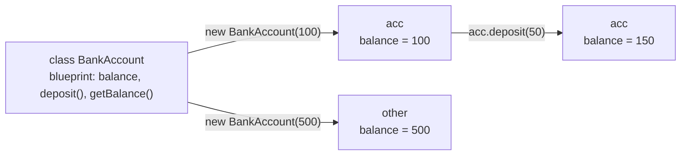
```mermaid
flowchart LR
  C["class BankAccount<br/>blueprint: balance, deposit(), getBalance()"]
  C -->|"new BankAccount(100)"| A["acc<br/>balance = 100"]
  C -->|"new BankAccount(500)"| B["other<br/>balance = 500"]
  A -->|"acc.deposit(50)"| A2["acc<br/>balance = 150"]
```

```ts
class BankAccount {
  private balance: number;

  constructor(initialBalance: number) {
    this.balance = initialBalance;
  }

  deposit(amount: number): void {
    this.balance += amount;
  }

  getBalance(): number {
    return this.balance;
  }
}

const acc = new BankAccount(100); // acc is an object (instance)
acc.deposit(50);
console.log(acc.getBalance()); // 150
```

**Java:**

```java
public class BankAccount {
    private double balance;

    public BankAccount(double initialBalance) {
        this.balance = initialBalance;
    }

    public void deposit(double amount) {
        this.balance += amount;
    }

    public double getBalance() {
        return balance;
    }
}

public class Main {
    public static void main(String[] args) {
        BankAccount acc = new BankAccount(100); // acc is an object (instance)
        acc.deposit(50);
        System.out.println(acc.getBalance()); // 150.0
    }
}
```

---

## 3. The Four Pillars

**Flowchart: The Four Pillars**

Each pillar answers a different question about how to manage change.

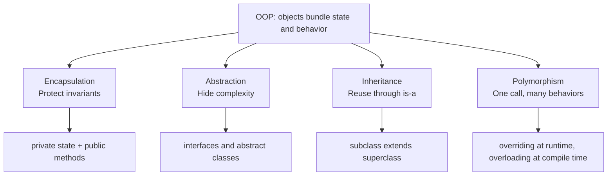
```mermaid
flowchart TD
  O["OOP: objects bundle state and behavior"]
  O --> E["Encapsulation<br/>Protect invariants"]
  O --> A["Abstraction<br/>Hide complexity"]
  O --> I["Inheritance<br/>Reuse through is-a"]
  O --> P["Polymorphism<br/>One call, many behaviors"]
  E --> E1["private state + public methods"]
  A --> A1["interfaces and abstract classes"]
  I --> I1["subclass extends superclass"]
  P --> P1["overriding at runtime, overloading at compile time"]
```

### 3.1 Encapsulation

Bundling data with the methods that operate on it, and restricting direct access to internal state.

```ts
class BankAccount {
  #balance: number; // truly private field

  constructor(balance: number) {
    this.#balance = balance;
  }

  withdraw(amount: number): void {
    if (amount > this.#balance) {
      throw new Error("Insufficient funds");
    }
    this.#balance -= amount;
  }

  get balance(): number {
    return this.#balance;
  }
}
```

**Java:**

```java
public class BankAccount {
    private double balance; // private: only this class can touch it

    public BankAccount(double balance) {
        this.balance = balance;
    }

    public void withdraw(double amount) {
        if (amount > balance) {
            throw new IllegalArgumentException("Insufficient funds");
        }
        balance -= amount;
    }

    public double getBalance() { // getter only, no setter
        return balance;
    }
}
```

Why it matters: `#balance` can't be set to a negative number from outside the class. All mutation goes through `withdraw`/`deposit`, which enforce the account's invariants.

**Flowchart: Encapsulation**

All mutation goes through a method that enforces the rule, so the balance can never be set to something invalid from outside.

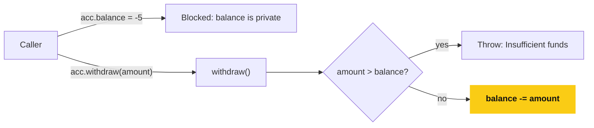
```mermaid
flowchart LR
  C["Caller"] -->|"acc.balance = -5"| X["Blocked: balance is private"]
  C -->|"acc.withdraw(amount)"| M["withdraw()"]
  M --> V{"amount > balance?"}
  V -->|yes| E["Throw: Insufficient funds"]
  V -->|no| U["balance -= amount"]:::done

  classDef done fill:#facc15,stroke:#facc15,color:#111111,font-weight:bold
```

### 3.2 Abstraction

Exposing only the essential behavior to the caller and hiding implementation detail.

```ts
interface PaymentGateway {
  charge(amount: number): Promise<boolean>;
}

class StripeGateway implements PaymentGateway {
  async charge(amount: number): Promise<boolean> {
    // complex HTTP calls, retries, signature verification hidden here
    return true;
  }
}

function checkout(gateway: PaymentGateway, amount: number) {
  // checkout() doesn't know or care HOW charging happens
  return gateway.charge(amount);
}
```

**Java:**

```java
public interface PaymentGateway {
    boolean charge(double amount);
}

public class StripeGateway implements PaymentGateway {
    @Override
    public boolean charge(double amount) {
        // complex HTTP calls, retries, signature verification hidden here
        return true;
    }
}

public class CheckoutService {
    // doesn't know or care HOW charging happens
    public boolean checkout(PaymentGateway gateway, double amount) {
        return gateway.charge(amount);
    }
}
```

Why it matters: `checkout()` can work with `StripeGateway`, `PaypalGateway`, or a `MockGateway` in tests, without ever knowing their internals.

**Class diagram: Abstraction**

`checkout()` depends only on the interface, so any gateway that implements it can be plugged in.

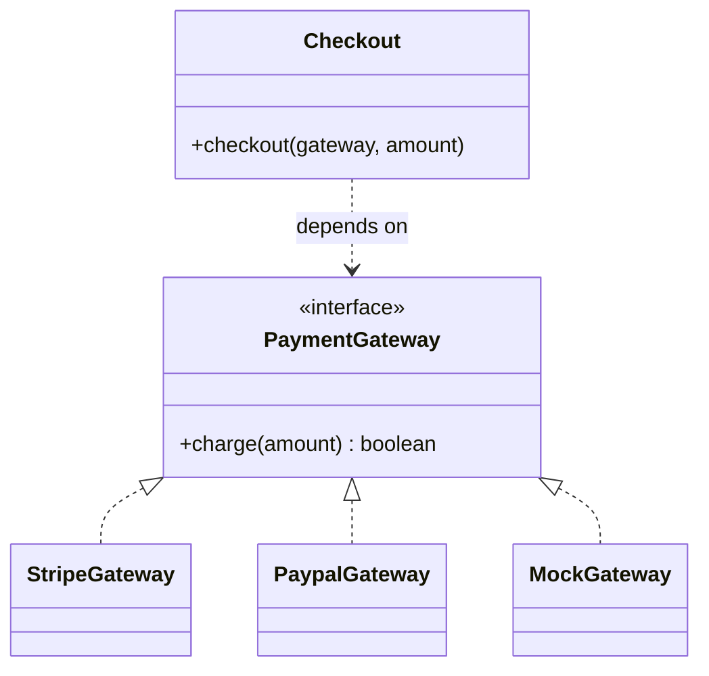
```mermaid
classDiagram
  class PaymentGateway {
    <<interface>>
    +charge(amount) boolean
  }
  class StripeGateway
  class PaypalGateway
  class MockGateway
  class Checkout {
    +checkout(gateway, amount)
  }
  PaymentGateway <|.. StripeGateway
  PaymentGateway <|.. PaypalGateway
  PaymentGateway <|.. MockGateway
  Checkout ..> PaymentGateway : depends on
```

### 3.3 Inheritance

A class (subclass) acquires fields and methods from another class (superclass), enabling code reuse and an "is-a" relationship.

```ts
class Employee {
  constructor(protected name: string, protected baseSalary: number) {}

  getSalary(): number {
    return this.baseSalary;
  }
}

class Manager extends Employee {
  constructor(name: string, baseSalary: number, private bonus: number) {
    super(name, baseSalary);
  }

  getSalary(): number {
    return this.baseSalary + this.bonus; // overrides base behavior
  }
}
```

**Java:**

```java
public class Employee {
    protected String name;
    protected double baseSalary;

    public Employee(String name, double baseSalary) {
        this.name = name;
        this.baseSalary = baseSalary;
    }

    public double getSalary() {
        return baseSalary;
    }
}

public class Manager extends Employee {
    private double bonus;

    public Manager(String name, double baseSalary, double bonus) {
        super(name, baseSalary);
        this.bonus = bonus;
    }

    @Override
    public double getSalary() {
        return baseSalary + bonus; // overrides base behavior
    }
}
```

`Manager` **is an** `Employee`, with extra behavior layered on top.

**Class diagram: Inheritance**

`Manager` is an `Employee`: it inherits the fields and overrides `getSalary()` to add the bonus.

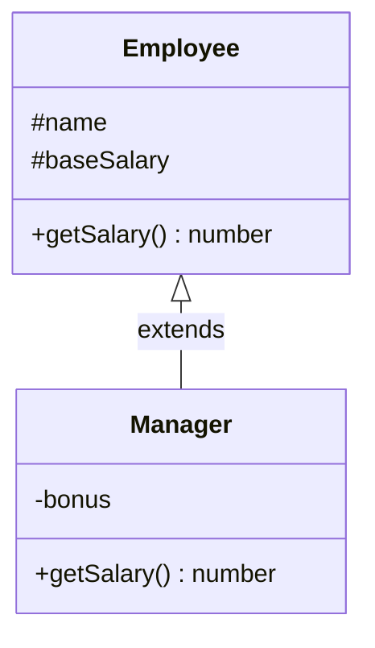
```mermaid
classDiagram
  class Employee {
    #name
    #baseSalary
    +getSalary() number
  }
  class Manager {
    -bonus
    +getSalary() number
  }
  Employee <|-- Manager : extends
```

### 3.4 Polymorphism

The same interface/method behaves differently depending on the actual object, allowing code to work with a general type while executing type-specific logic.

```ts
abstract class Shape {
  abstract area(): number;
}

class Circle extends Shape {
  constructor(private radius: number) { super(); }
  area(): number { return Math.PI * this.radius ** 2; }
}

class Rectangle extends Shape {
  constructor(private w: number, private h: number) { super(); }
  area(): number { return this.w * this.h; }
}

function printArea(shape: Shape) {
  console.log(shape.area()); // correct area() runs based on actual type
}

printArea(new Circle(2));      // 12.57
printArea(new Rectangle(3, 4)); // 12
```

**Java:**

```java
public abstract class Shape {
    public abstract double area();
}

public class Circle extends Shape {
    private final double radius;

    public Circle(double radius) { this.radius = radius; }

    @Override
    public double area() { return Math.PI * radius * radius; }
}

public class Rectangle extends Shape {
    private final double w, h;

    public Rectangle(double w, double h) { this.w = w; this.h = h; }

    @Override
    public double area() { return w * h; }
}

static void printArea(Shape shape) {
    System.out.println(shape.area()); // correct area() runs based on actual type
}

printArea(new Circle(2));       // 12.566...
printArea(new Rectangle(3, 4)); // 12.0
```

**Flowchart: How a Call Is Resolved**

Overloading is decided by the compiler from the argument types and count.
Overriding is decided at runtime from the actual class of the object.

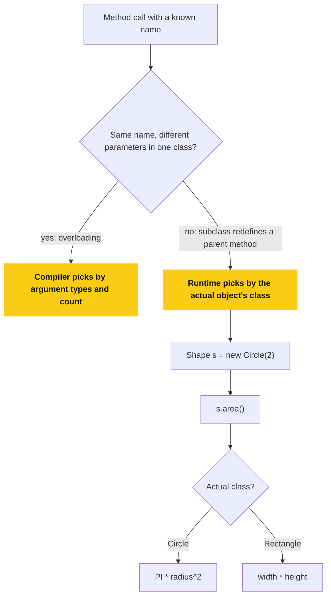
```mermaid
flowchart TD
  A["Method call with a known name"] --> B{"Same name, different parameters in one class?"}
  B -->|"yes: overloading"| C["Compiler picks by argument types and count"]:::done
  B -->|"no: subclass redefines a parent method"| D["Runtime picks by the actual object's class"]:::done
  D --> E["Shape s = new Circle(2)"]
  E --> F["s.area()"]
  F --> G{"Actual class?"}
  G -->|Circle| H["PI * radius^2"]
  G -->|Rectangle| I["width * height"]

  classDef done fill:#facc15,stroke:#facc15,color:#111111,font-weight:bold
```

Two common flavors:

- **Runtime (dynamic) polymorphism** — method overriding, resolved at runtime via the object's actual class (shown above).
- **Compile-time (static) polymorphism** — method overloading, resolved at compile time based on argument types/count (common in Java/C++, simulated in TS via overload signatures).

Java supports both natively. Overloading (compile-time) vs overriding (runtime):

```java
class Calculator {
    int add(int a, int b) { return a + b; }             // overloading: same name,
    double add(double a, double b) { return a + b; }    // different parameter types
    int add(int a, int b, int c) { return a + b + c; }  // or different count
}

Shape s = new Circle(2);
s.area(); // overriding: Circle.area() chosen at runtime from the actual object
```

---

## 4. Encapsulation vs Abstraction

These get confused constantly in interviews:

- **Encapsulation** is about **hiding data** (implementation state) — a mechanism (`private`/`#field`, getters/setters).
- **Abstraction** is about **hiding complexity** (implementation detail) behind a simpler interface — a design decision (interfaces, abstract classes).

**Flowchart: Encapsulation or Abstraction?**

Ask what is being hidden, and how.

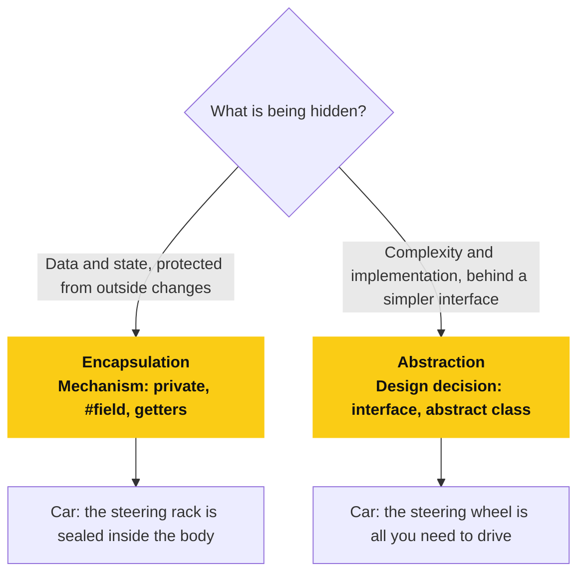
```mermaid
flowchart TD
  A{"What is being hidden?"} -->|"Data and state, protected from outside changes"| B["Encapsulation<br/>Mechanism: private, #field, getters"]:::done
  A -->|"Complexity and implementation, behind a simpler interface"| C["Abstraction<br/>Design decision: interface, abstract class"]:::done
  B --> B1["Car: the steering rack is sealed inside the body"]
  C --> C1["Car: the steering wheel is all you need to drive"]

  classDef done fill:#facc15,stroke:#facc15,color:#111111,font-weight:bold
```

Analogy: a car's steering wheel is **abstraction** (you don't need to know how the steering rack works to drive). The steering rack being sealed inside the car body so you can't tamper with it is **encapsulation**.

---

## 5. Composition vs Inheritance

Inheritance models "is-a"; composition models "has-a" by including other objects as fields instead of extending them.

```ts
// Inheritance (is-a) — Manager IS an Employee
class Manager extends Employee { ... }

// Composition (has-a) — Car HAS an Engine
class Engine {
  start() { console.log("engine started"); }
}

class Car {
  private engine = new Engine();

  start() {
    this.engine.start();
  }
}
```

**Java:**

```java
// Inheritance (is-a) - Manager IS an Employee
class Manager extends Employee { /* ... */ }

// Composition (has-a) - Car HAS an Engine
class Engine {
    void start() { System.out.println("engine started"); }
}

class Car {
    private final Engine engine = new Engine();

    void start() {
        engine.start();
    }
}
```

**Flowchart: Composition or Inheritance?**

Default to composition, and reach for inheritance only when every check passes.

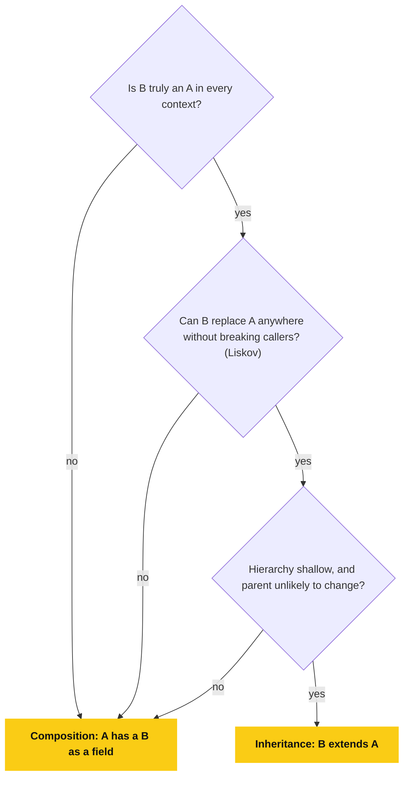
```mermaid
flowchart TD
  A{"Is B truly an A in every context?"} -->|no| C["Composition: A has a B as a field"]:::done
  A -->|yes| B{"Can B replace A anywhere without breaking callers? (Liskov)"}
  B -->|no| C
  B -->|yes| D{"Hierarchy shallow, and parent unlikely to change?"}
  D -->|no| C
  D -->|yes| E["Inheritance: B extends A"]:::done

  classDef done fill:#facc15,stroke:#facc15,color:#111111,font-weight:bold
```

Rule of thumb, and a very common senior-level answer: **"favor composition over inheritance"** — deep inheritance hierarchies get fragile and hard to change (the "fragile base class" problem), while composition keeps components swappable and independently testable.

---

## 6. SOLID Principles

**Flowchart: Code Smell to SOLID Principle**

Use this to name the principle a piece of code is breaking.

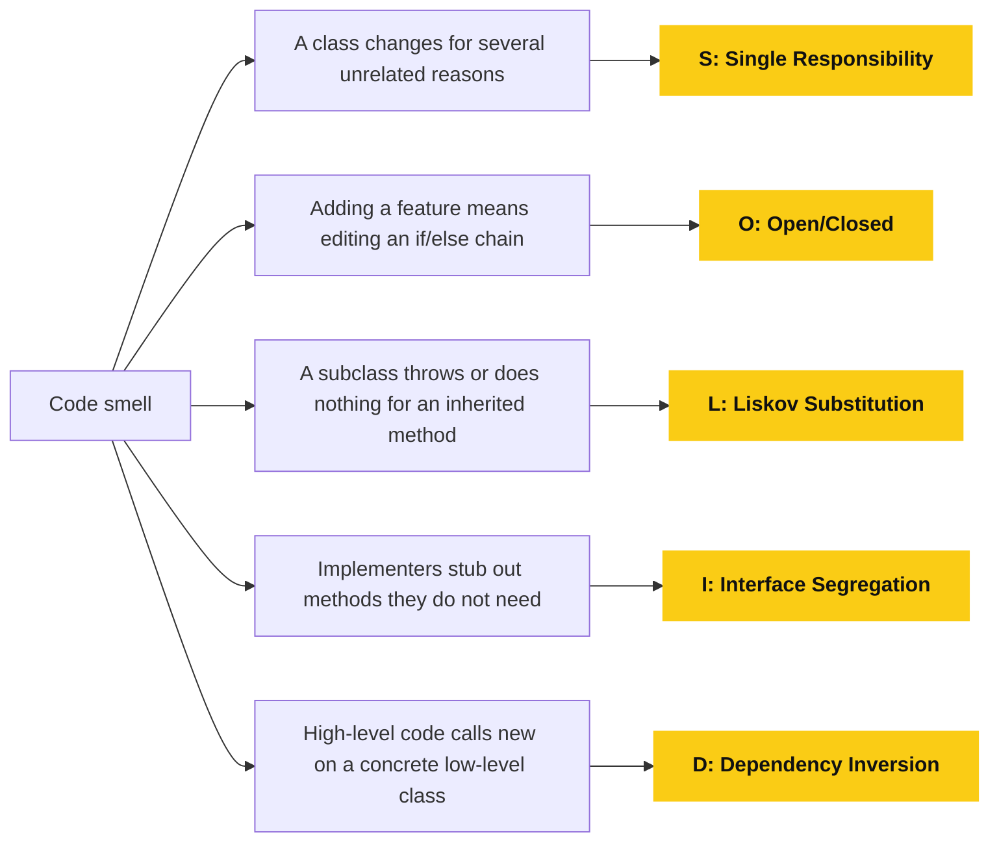
```mermaid
flowchart LR
  A["Code smell"] --> S1["A class changes for several unrelated reasons"] --> P1["S: Single Responsibility"]:::done
  A --> S2["Adding a feature means editing an if/else chain"] --> P2["O: Open/Closed"]:::done
  A --> S3["A subclass throws or does nothing for an inherited method"] --> P3["L: Liskov Substitution"]:::done
  A --> S4["Implementers stub out methods they do not need"] --> P4["I: Interface Segregation"]:::done
  A --> S5["High-level code calls new on a concrete low-level class"] --> P5["D: Dependency Inversion"]:::done

  classDef done fill:#facc15,stroke:#facc15,color:#111111,font-weight:bold
```

### 6.1 Single Responsibility Principle

A class should have only one reason to change.

Bad: an `Invoice` class that calculates totals *and* saves itself to the database *and* formats a PDF — three unrelated reasons to change.

Good: split into `Invoice` (data + calculation), `InvoiceRepository` (persistence), `InvoicePdfFormatter` (presentation).

**Java:**

```java
// Bad: three reasons to change in one class
class Invoice {
    double calculateTotal() { /* ... */ return 0; }
    void saveToDatabase() { /* ... */ }
    byte[] renderPdf() { /* ... */ return new byte[0]; }
}

// Good: one responsibility each
class Invoice {
    double calculateTotal() { /* data + calculation */ return 0; }
}

class InvoiceRepository {
    void save(Invoice invoice) { /* persistence */ }
}

class InvoicePdfFormatter {
    byte[] format(Invoice invoice) { /* presentation */ return new byte[0]; }
}
```

**Class diagram: Single Responsibility**

Three reasons to change become three classes, each with one.

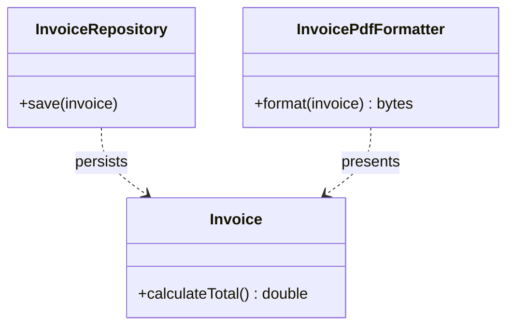
```mermaid
classDiagram
  class Invoice {
    +calculateTotal() double
  }
  class InvoiceRepository {
    +save(invoice)
  }
  class InvoicePdfFormatter {
    +format(invoice) bytes
  }
  InvoiceRepository ..> Invoice : persists
  InvoicePdfFormatter ..> Invoice : presents
```

### 6.2 Open/Closed Principle

Classes should be open for extension but closed for modification.

```ts
interface DiscountStrategy {
  apply(price: number): number;
}

class NoDiscount implements DiscountStrategy {
  apply(price: number) { return price; }
}

class SeasonalDiscount implements DiscountStrategy {
  apply(price: number) { return price * 0.9; }
}

function finalPrice(price: number, strategy: DiscountStrategy) {
  return strategy.apply(price);
}
```

**Java:**

```java
interface DiscountStrategy {
    double apply(double price);
}

class NoDiscount implements DiscountStrategy {
    public double apply(double price) { return price; }
}

class SeasonalDiscount implements DiscountStrategy {
    public double apply(double price) { return price * 0.9; }
}

class PriceCalculator {
    static double finalPrice(double price, DiscountStrategy strategy) {
        return strategy.apply(price);
    }
}
```

Adding a new `BlackFridayDiscount` needs a new class, not edits to `finalPrice` or existing discount classes.

**Class diagram: Open/Closed**

A new `BlackFridayDiscount` is a new class.
`finalPrice` and the existing discounts are not touched.

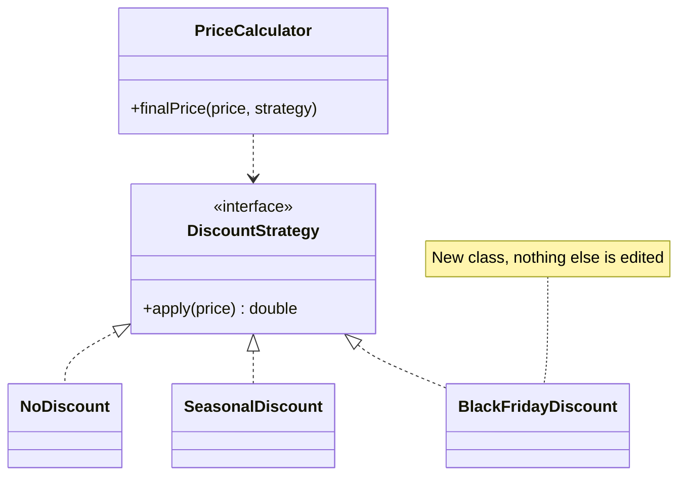
```mermaid
classDiagram
  class DiscountStrategy {
    <<interface>>
    +apply(price) double
  }
  class NoDiscount
  class SeasonalDiscount
  class BlackFridayDiscount
  note for BlackFridayDiscount "New class, nothing else is edited"
  class PriceCalculator {
    +finalPrice(price, strategy)
  }
  DiscountStrategy <|.. NoDiscount
  DiscountStrategy <|.. SeasonalDiscount
  DiscountStrategy <|.. BlackFridayDiscount
  PriceCalculator ..> DiscountStrategy
```

### 6.3 Liskov Substitution Principle

Subclasses must be substitutable for their base class without breaking correctness.

Classic violation:

```ts
class Bird {
  fly(): void { console.log("flying"); }
}

class Penguin extends Bird {
  fly(): void { throw new Error("Penguins can't fly!"); } // breaks LSP
}
```

**Java:**

```java
class Bird {
    void fly() { System.out.println("flying"); }
}

class Penguin extends Bird {
    @Override
    void fly() { throw new UnsupportedOperationException("Penguins can't fly!"); } // breaks LSP
}

// Fix: split the hierarchy so only flying birds promise fly()
interface Flyable { void fly(); }

abstract class Bird { /* eat(), layEggs(), ... */ }
class Sparrow extends Bird implements Flyable {
    public void fly() { System.out.println("flying"); }
}
class Penguin extends Bird { /* no fly() to break */ }
```

Any code that does `bird.fly()` expecting a `Bird` now crashes when handed a `Penguin`. Fix: don't model `Penguin` as a `Bird` that flies — separate `FlyingBird` and `FlightlessBird`, or use composition.

**Class diagram: Liskov Substitution Fix**

Only birds that can fly promise `fly()`, so no caller can be handed a `Penguin` and crash.

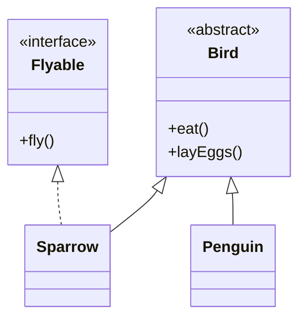
```mermaid
classDiagram
  class Bird {
    <<abstract>>
    +eat()
    +layEggs()
  }
  class Flyable {
    <<interface>>
    +fly()
  }
  class Sparrow
  class Penguin
  Bird <|-- Sparrow
  Bird <|-- Penguin
  Flyable <|.. Sparrow
```

### 6.4 Interface Segregation Principle

Prefer many small, specific interfaces over one large, general-purpose one, so implementers aren't forced to implement methods they don't need.

```ts
// Bad: one fat interface
interface Worker {
  work(): void;
  eat(): void;
}

// A Robot implementing Worker is forced to implement eat(), which makes no sense.

// Good: split it
interface Workable { work(): void; }
interface Eatable { eat(): void; }

class Robot implements Workable {
  work() { console.log("welding"); }
}

class Human implements Workable, Eatable {
  work() { console.log("coding"); }
  eat() { console.log("lunch"); }
}
```

**Java:**

```java
// Bad: one fat interface
interface Worker {
    void work();
    void eat();
}
// A Robot implementing Worker is forced to implement eat(), which makes no sense.

// Good: split it
interface Workable { void work(); }
interface Eatable { void eat(); }

class Robot implements Workable {
    public void work() { System.out.println("welding"); }
}

class Human implements Workable, Eatable {
    public void work() { System.out.println("coding"); }
    public void eat() { System.out.println("lunch"); }
}
```

**Class diagram: Interface Segregation**

A robot needs `work()` only, so it implements only `Workable`.

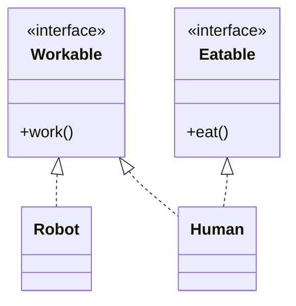
```mermaid
classDiagram
  class Workable {
    <<interface>>
    +work()
  }
  class Eatable {
    <<interface>>
    +eat()
  }
  class Robot
  class Human
  Workable <|.. Robot
  Workable <|.. Human
  Eatable <|.. Human
```

### 6.5 Dependency Inversion Principle

High-level modules shouldn't depend on low-level modules directly, both should depend on abstractions.

```ts
// Bad: OrderService is tightly coupled to a concrete MySQLDatabase
class OrderService {
  private db = new MySQLDatabase();
}

// Good: depends on an interface, concrete implementation is injected
interface Database {
  save(order: Order): void;
}

class OrderService {
  constructor(private db: Database) {} // dependency injected
}

class MySQLDatabase implements Database {
  save(order: Order) { /* ... */ }
}
```

**Java:**

```java
// Bad: OrderService is tightly coupled to a concrete MySQLDatabase
class OrderService {
    private final MySQLDatabase db = new MySQLDatabase();
}

// Good: depends on an interface, concrete implementation is injected
interface Database {
    void save(Order order);
}

class OrderService {
    private final Database db;

    OrderService(Database db) { // dependency injected via constructor
        this.db = db;
    }
}

class MySQLDatabase implements Database {
    public void save(Order order) { /* ... */ }
}

class InMemoryTestDatabase implements Database {
    public void save(Order order) { /* ... */ }
}

OrderService service = new OrderService(new InMemoryTestDatabase()); // e.g. in a unit test
```

**Class diagram: Dependency Inversion**

Both the high-level class and the low-level classes point at the abstraction, so the arrow into the concrete database is inverted.

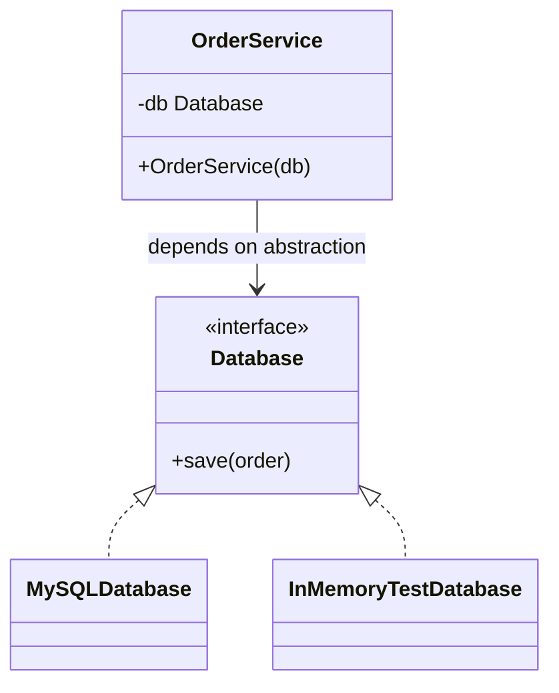
```mermaid
classDiagram
  class OrderService {
    -db Database
    +OrderService(db)
  }
  class Database {
    <<interface>>
    +save(order)
  }
  class MySQLDatabase
  class InMemoryTestDatabase
  OrderService --> Database : depends on abstraction
  Database <|.. MySQLDatabase
  Database <|.. InMemoryTestDatabase
```

This is what makes swapping `MySQLDatabase` for `InMemoryTestDatabase` in unit tests trivial.

---

## 7. UML Relationships

Common relationships between classes, weakest to strongest coupling:

- **Association** — two classes interact, but neither owns the other (`Teacher` teaches `Student`).
- **Aggregation** — a "has-a" relationship where the part can exist independently of the whole (`Department` has `Professors`; a professor still exists if the department is dissolved).
- **Composition** — a stronger "has-a" where the part's lifecycle is bound to the whole (`House` has `Rooms`; a room doesn't exist without the house).
- **Inheritance (Generalization)** — "is-a" relationship (`Manager` is an `Employee`).
- **Realization/Implementation** — a class implements an interface's contract (`StripeGateway` implements `PaymentGateway`).

**Flowchart: Which UML Relationship?**

Start with is-a, then ask about ownership and lifecycle.

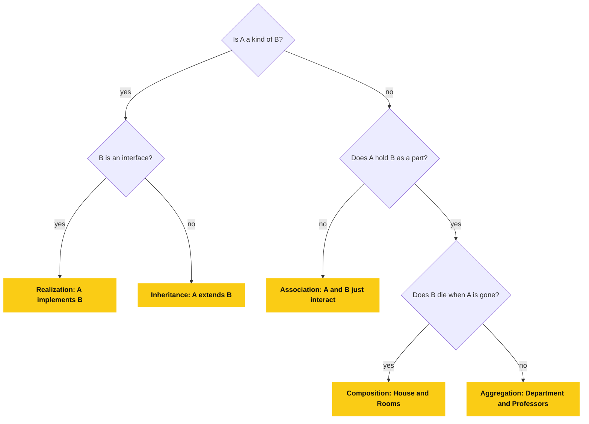
```mermaid
flowchart TD
  A{"Is A a kind of B?"} -->|yes| B{"B is an interface?"}
  B -->|yes| R["Realization: A implements B"]:::done
  B -->|no| G["Inheritance: A extends B"]:::done
  A -->|no| C{"Does A hold B as a part?"}
  C -->|no| S["Association: A and B just interact"]:::done
  C -->|yes| D{"Does B die when A is gone?"}
  D -->|yes| K["Composition: House and Rooms"]:::done
  D -->|no| Ag["Aggregation: Department and Professors"]:::done

  classDef done fill:#facc15,stroke:#facc15,color:#111111,font-weight:bold
```

**Class diagram: UML Relationships**

The same five relationships drawn with their standard arrows.

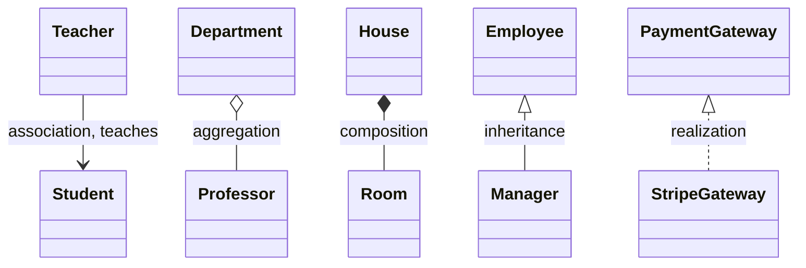
```mermaid
classDiagram
  Teacher --> Student : association, teaches
  Department o-- Professor : aggregation
  House *-- Room : composition
  Employee <|-- Manager : inheritance
  PaymentGateway <|.. StripeGateway : realization
```

**Java:**

```java
// Association: Teacher uses Student, neither owns the other
class Teacher {
    void teach(Student student) { /* ... */ }
}

// Aggregation: Professors are created elsewhere and outlive the Department
class Department {
    private final List<Professor> professors;

    Department(List<Professor> professors) {
        this.professors = professors;
    }
}

// Composition: House creates its Rooms, so Rooms die with the House
class House {
    private final List<Room> rooms = new ArrayList<>();

    House() {
        rooms.add(new Room("Kitchen"));
        rooms.add(new Room("Bedroom"));
    }
}

// Inheritance (Generalization)
class Manager extends Employee { /* ... */ }

// Realization
class StripeGateway implements PaymentGateway { /* ... */ }
```

---

## 8. Common Design Patterns

### 8.1 Singleton

Ensures a class has exactly one instance, with a global access point.

```ts
class ConfigManager {
  private static instance: ConfigManager;
  private constructor(public settings: Record<string, string>) {}

  static getInstance(): ConfigManager {
    if (!ConfigManager.instance) {
      ConfigManager.instance = new ConfigManager({});
    }
    return ConfigManager.instance;
  }
}
```

**Java:**

```java
public class ConfigManager {
    private final Map<String, String> settings = new HashMap<>();

    private ConfigManager() {} // no outside instantiation

    // Initialization-on-demand holder: lazy and thread-safe without explicit locking
    private static class Holder {
        private static final ConfigManager INSTANCE = new ConfigManager();
    }

    public static ConfigManager getInstance() {
        return Holder.INSTANCE;
    }

    public Map<String, String> getSettings() {
        return settings;
    }
}

// Simplest thread-safe alternative (also safe against reflection and serialization):
enum AppConfig {
    INSTANCE;
    private final Map<String, String> settings = new HashMap<>();
}
```

Use case: app-wide configuration or a shared connection pool. Caution: overused Singletons become hidden global state that makes testing harder.

**Flowchart: Singleton**

The private constructor forces every caller through `getInstance()`, so only one object is ever created.

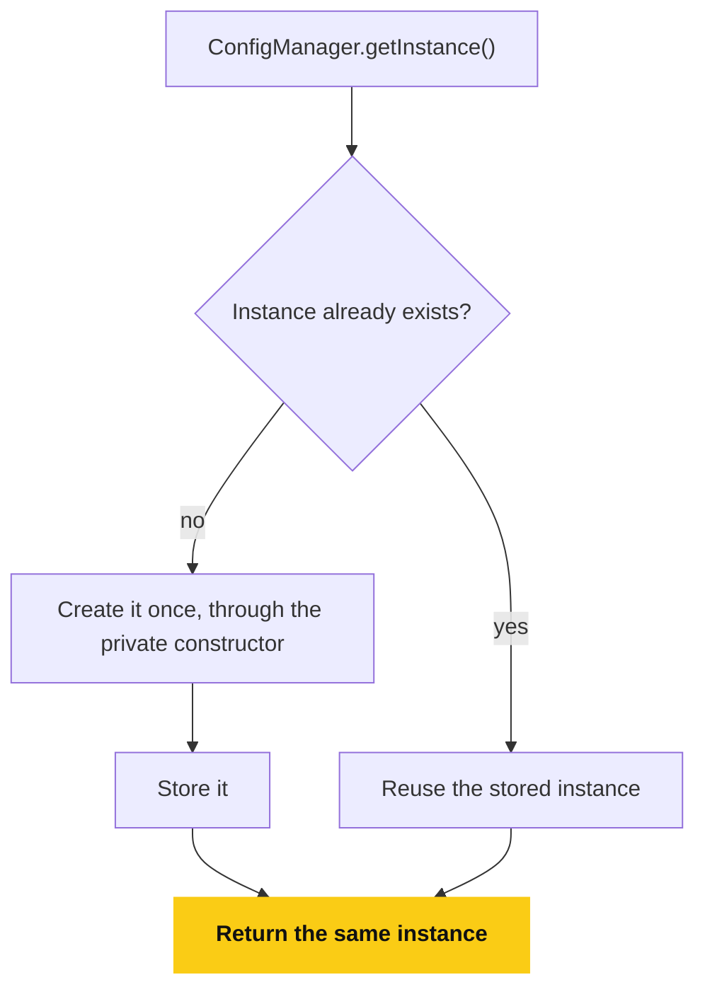
```mermaid
flowchart TD
  A["ConfigManager.getInstance()"] --> B{"Instance already exists?"}
  B -->|no| C["Create it once, through the private constructor"]
  C --> D["Store it"]
  B -->|yes| E["Reuse the stored instance"]
  D --> F["Return the same instance"]:::done
  E --> F

  classDef done fill:#facc15,stroke:#facc15,color:#111111,font-weight:bold
```

### 8.2 Factory

Delegates object creation to a dedicated method/class instead of calling `new` directly, so the caller doesn't need to know the concrete type.

```ts
interface Notification { send(msg: string): void; }
class EmailNotification implements Notification { send(msg: string) { /* ... */ } }
class SmsNotification implements Notification { send(msg: string) { /* ... */ } }

function createNotification(type: "email" | "sms"): Notification {
  return type === "email" ? new EmailNotification() : new SmsNotification();
}
```

**Java:**

```java
interface Notification {
    void send(String msg);
}

class EmailNotification implements Notification {
    public void send(String msg) { /* ... */ }
}

class SmsNotification implements Notification {
    public void send(String msg) { /* ... */ }
}

class NotificationFactory {
    static Notification create(String type) {
        return switch (type) {
            case "email" -> new EmailNotification();
            case "sms" -> new SmsNotification();
            default -> throw new IllegalArgumentException("Unknown type: " + type);
        };
    }
}

Notification n = NotificationFactory.create("email"); // caller only sees the interface
```

**Flowchart: Factory**

The caller asks for a type by name and only ever sees the `Notification` interface.

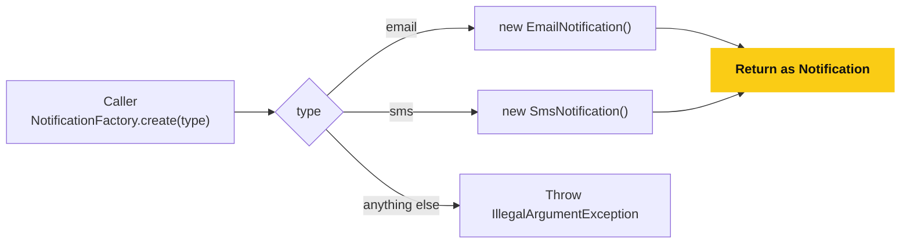
```mermaid
flowchart LR
  C["Caller<br/>NotificationFactory.create(type)"] --> S{"type"}
  S -->|email| E["new EmailNotification()"]
  S -->|sms| M["new SmsNotification()"]
  S -->|"anything else"| X["Throw IllegalArgumentException"]
  E --> R["Return as Notification"]:::done
  M --> R

  classDef done fill:#facc15,stroke:#facc15,color:#111111,font-weight:bold
```

### 8.3 Strategy

Encapsulates interchangeable algorithms behind a common interface, selected at runtime (already shown in [6.2](#62-openclosed-principle) with `DiscountStrategy`).

**Class diagram: Strategy**

The context holds a strategy and delegates to it, and the strategy can be swapped at runtime.

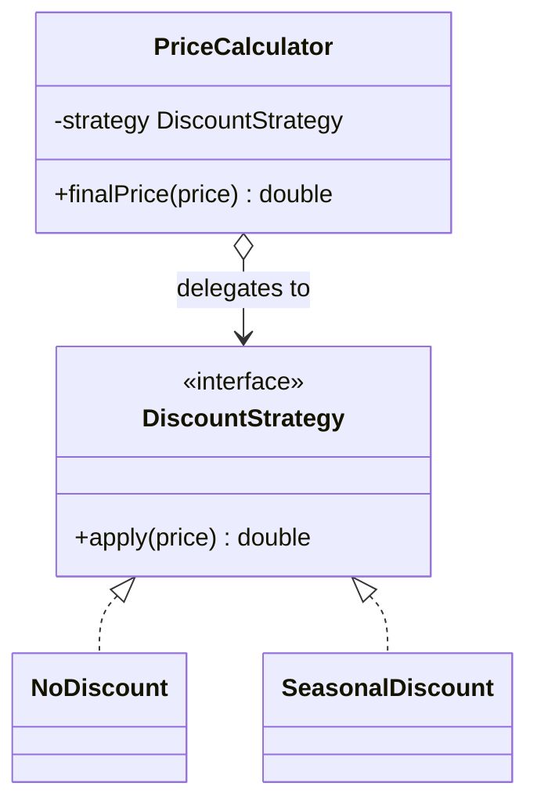
```mermaid
classDiagram
  class PriceCalculator {
    -strategy DiscountStrategy
    +finalPrice(price) double
  }
  class DiscountStrategy {
    <<interface>>
    +apply(price) double
  }
  class NoDiscount
  class SeasonalDiscount
  PriceCalculator o--> DiscountStrategy : delegates to
  DiscountStrategy <|.. NoDiscount
  DiscountStrategy <|.. SeasonalDiscount
```

### 8.4 Observer

Defines a one-to-many dependency: when one object (subject) changes state, all its dependents (observers) are notified automatically.

```ts
class EventEmitter {
  private listeners: Array<(data: unknown) => void> = [];

  subscribe(fn: (data: unknown) => void) {
    this.listeners.push(fn);
  }

  publish(data: unknown) {
    this.listeners.forEach((fn) => fn(data));
  }
}

const orderPlaced = new EventEmitter();
orderPlaced.subscribe((data) => console.log("send confirmation email", data));
orderPlaced.subscribe((data) => console.log("update inventory", data));
orderPlaced.publish({ orderId: "123" });
```

**Java:**

```java
interface Observer<T> {
    void update(T data);
}

class EventEmitter<T> {
    private final List<Observer<T>> listeners = new ArrayList<>();

    void subscribe(Observer<T> observer) {
        listeners.add(observer);
    }

    void publish(T data) {
        listeners.forEach(o -> o.update(data));
    }
}

EventEmitter<String> orderPlaced = new EventEmitter<>();
orderPlaced.subscribe(id -> System.out.println("send confirmation email " + id));
orderPlaced.subscribe(id -> System.out.println("update inventory " + id));
orderPlaced.publish("123");
```

This is the pattern behind DOM events, Redux subscriptions, and pub/sub systems.

**Sequence diagram: Observer**

The publisher does not know who is listening, it just notifies everyone who subscribed.

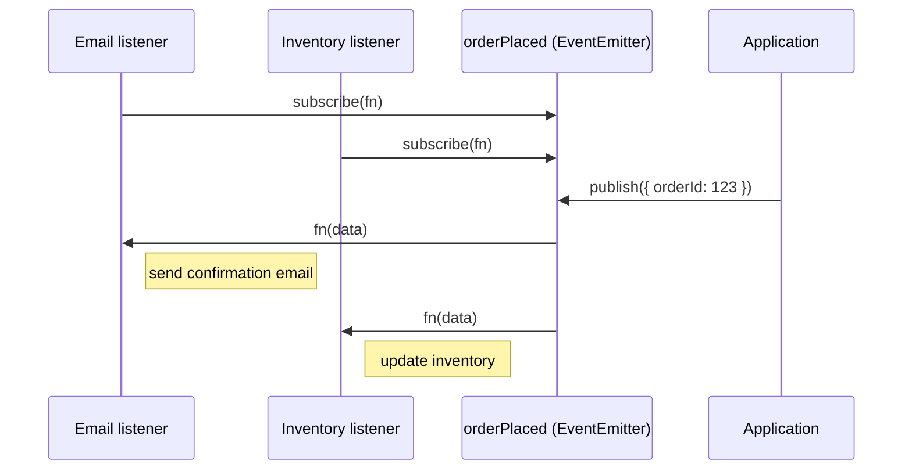
```mermaid
sequenceDiagram
  participant Mail as Email listener
  participant Inv as Inventory listener
  participant Pub as orderPlaced (EventEmitter)
  participant App as Application
  Mail->>Pub: subscribe(fn)
  Inv->>Pub: subscribe(fn)
  App->>Pub: publish({ orderId: 123 })
  Pub->>Mail: fn(data)
  Note right of Mail: send confirmation email
  Pub->>Inv: fn(data)
  Note right of Inv: update inventory
```

### 8.5 Decorator

Adds behavior to an individual object dynamically, without altering other instances of the same class.

```ts
interface Coffee { cost(): number; }

class SimpleCoffee implements Coffee {
  cost() { return 2; }
}

class MilkDecorator implements Coffee {
  constructor(private coffee: Coffee) {}
  cost() { return this.coffee.cost() + 0.5; }
}

const order = new MilkDecorator(new SimpleCoffee());
console.log(order.cost()); // 2.5
```

**Java:**

```java
interface Coffee {
    double cost();
}

class SimpleCoffee implements Coffee {
    public double cost() { return 2; }
}

class MilkDecorator implements Coffee {
    private final Coffee coffee;

    MilkDecorator(Coffee coffee) { this.coffee = coffee; }

    public double cost() { return coffee.cost() + 0.5; }
}

Coffee order = new MilkDecorator(new SimpleCoffee());
System.out.println(order.cost()); // 2.5
```

**Flowchart: Decorator**

Each decorator calls the object it wraps and adds its own behavior on top.

```mermaid
flowchart LR
  A["order.cost()"] --> B["MilkDecorator.cost()"]
  B -->|"coffee.cost()"| C["SimpleCoffee.cost()"]
  C -->|"returns 2"| B
  B -->|"adds 0.5, returns 2.5"| D["Result: 2.5"]:::done

  classDef done fill:#facc15,stroke:#facc15,color:#111111,font-weight:bold
```

`java.io` is the classic real-world example: `new BufferedReader(new InputStreamReader(System.in))` wraps one reader in another.

---

## 9. OOP in JavaScript vs Classical OOP

- JS classes are **syntactic sugar over prototypal inheritance** — there's no real "class" at the engine level, just objects linked via `[[Prototype]]`.
- Private fields (`#field`) are a relatively recent (ES2022) addition; before that, privacy was only a convention (`_field`) or achieved via closures.
- JS supports multiple inheritance-like composition via **mixins** (functions that return a class extending their argument), since it only allows single `extends`.

```ts
const Serializable = (Base: any) => class extends Base {
  toJSON() { return JSON.stringify(this); }
};

class Model {}
class User extends Serializable(Model) {}
```

**Flowchart: Prototype Chain Lookup**

A method call walks up the `[[Prototype]]` links until it finds the property or reaches `null`.
The mixin adds one more link to the chain.

```mermaid
flowchart TD
  A["user.toJSON()"] --> B{"Own property on the user object?"}
  B -->|yes| Z["Call it"]:::done
  B -->|no| C{"On User.prototype?"}
  C -->|yes| Z
  C -->|no| D{"On the Serializable(Model) mixin class prototype?"}
  D -->|"yes: defined here"| Z
  D -->|no| E{"On Model.prototype?"}
  E -->|yes| Z
  E -->|no| F{"On Object.prototype?"}
  F -->|yes| Z
  F -->|no| G["undefined: TypeError, not a function"]

  classDef done fill:#facc15,stroke:#facc15,color:#111111,font-weight:bold
```

Java also has single class inheritance, but allows multiple interfaces, and `default` methods give mixin-like reuse:

```java
interface Loggable {
    default void log(String msg) { System.out.println("[LOG] " + msg); }
}

interface Serializable {
    default String toJson() { return "{}"; } // real code would delegate to Jackson/Gson
}

class Model {}
class User extends Model implements Loggable, Serializable {}
```

---

## 10. Common Pitfalls

- Overusing inheritance for code reuse when composition would be more flexible (see [Section 5](#5-composition-vs-inheritance)).
- Violating LSP by overriding a method to throw or no-op instead of properly modeling the type hierarchy.
- God classes that violate SRP by doing persistence, business logic, and presentation all in one place.
- Making everything `public` "to keep it simple," defeating encapsulation and letting invariants be broken from anywhere.
- Deep inheritance chains (4-5 levels) that make it hard to trace which class actually defines a given behavior.

---

## 11. Common Interview Questions

- "What are the four pillars of OOP?" — encapsulation, abstraction, inheritance, polymorphism, each with a concrete code example (see [Section 3](#3-the-four-pillars)).
- "Difference between abstraction and encapsulation?" — see [Section 4](#4-encapsulation-vs-abstraction).
- "Difference between method overloading and overriding?" — overloading is compile-time (same name, different signature); overriding is runtime (subclass redefines a parent method).
- "Why favor composition over inheritance?" — flexibility, avoids fragile base class problem, easier to test in isolation.
- "Explain SOLID with an example for each." — walk through [Section 6](#6-solid-principles) with the code samples.
- "What's the Liskov Substitution Principle, and give a violation example?" — the `Penguin extends Bird` example in [6.3](#63-liskov-substitution-principle).
- "Is JavaScript truly object-oriented?" — it's prototype-based; `class` syntax is sugar over prototypal inheritance (see [Section 9](#9-oop-in-javascript-vs-classical-oop)).

---

## 12. One-Line Senior Summary

> OOP pillars aren't checkboxes to recite, they're tools for managing change: encapsulation protects invariants, abstraction hides volatility, inheritance and composition model relationships, and polymorphism lets new types plug in without touching existing code.
